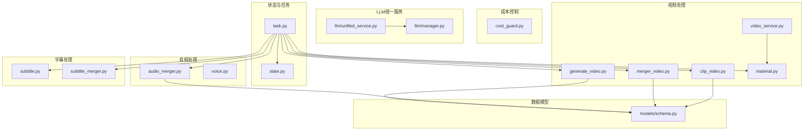
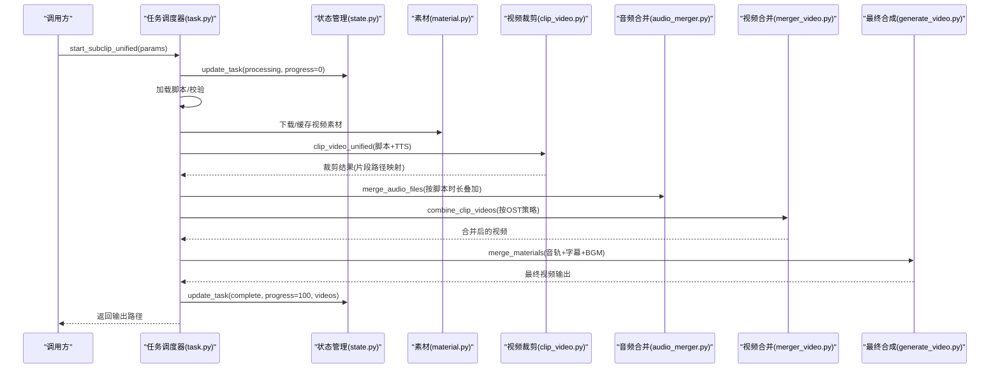
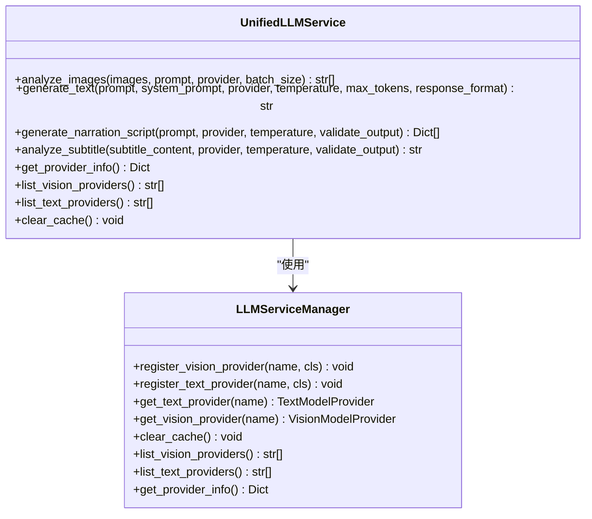
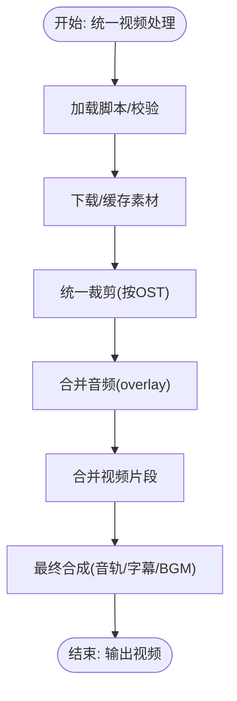
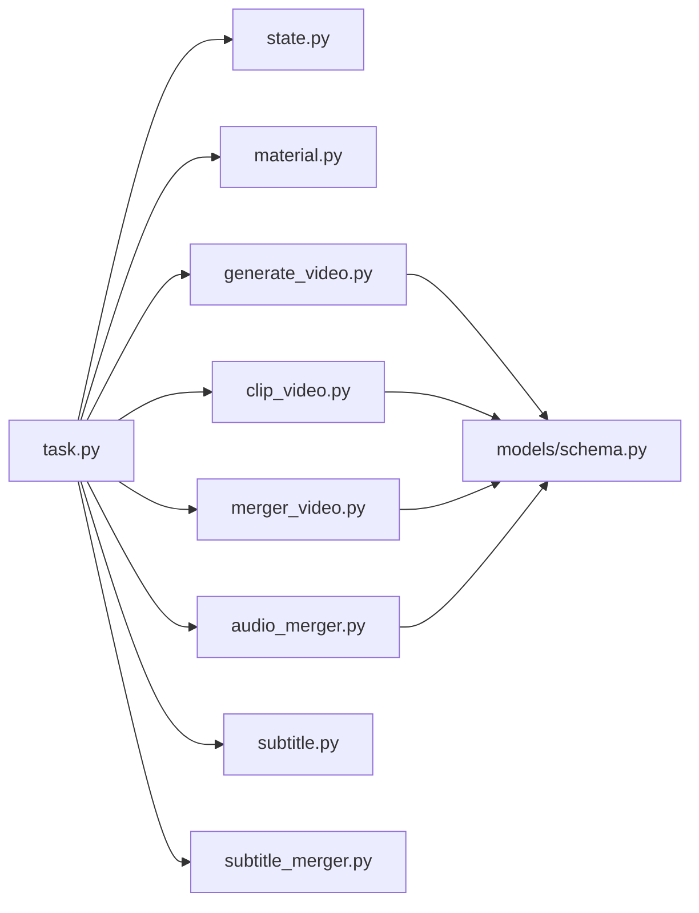

# API参考

<cite>
**本文引用的文件**
- [README.md](file://README.md)
- [app/services/state.py](file://app/services/state.py)
- [app/services/task.py](file://app/services/task.py)
- [app/services/cost_guard.py](file://app/services/cost_guard.py)
- [app/services/llm/unified_service.py](file://app/services/llm/unified_service.py)
- [app/services/llm/manager.py](file://app/services/llm/manager.py)
- [app/services/video_service.py](file://app/services/video_service.py)
- [app/services/audio_merger.py](file://app/services/audio_merger.py)
- [app/services/generate_video.py](file://app/services/generate_video.py)
- [app/services/merger_video.py](file://app/services/merger_video.py)
- [app/services/clip_video.py](file://app/services/clip_video.py)
- [app/services/subtitle.py](file://app/services/subtitle.py)
- [app/services/subtitle_merger.py](file://app/services/subtitle_merger.py)
- [app/services/material.py](file://app/services/material.py)
- [app/services/voice.py](file://app/services/voice.py)
- [app/models/schema.py](file://app/models/schema.py)
</cite>

## 目录
1. [简介](#简介)
2. [项目结构](#项目结构)
3. [核心组件](#核心组件)
4. [架构总览](#架构总览)
5. [详细组件分析](#详细组件分析)
6. [依赖分析](#依赖分析)
7. [性能考虑](#性能考虑)
8. [故障排查指南](#故障排查指南)
9. [结论](#结论)
10. [附录](#附录)

## 简介
本文件为 NarratoAI 的 API 参考文档，覆盖状态管理、任务调度、成本控制、LLM 统一服务、视频处理、音频处理、字幕处理等模块的公共接口与使用说明。文档面向开发者与集成者，提供参数定义、返回值、错误码与使用示例的指引，并包含版本管理、向后兼容与迁移建议。

## 项目结构
NarratoAI 采用模块化设计，核心能力分布在以下服务层：
- 状态管理与任务调度：state、task
- 成本控制：cost_guard
- LLM 统一服务：llm/unified_service、llm/manager
- 视频处理：video_service、clip_video、merger_video、generate_video、material
- 音频处理：audio_merger、voice
- 字幕处理：subtitle、subtitle_merger
- 数据模型：models/schema

图示来源
- [app/services/state.py:1-123](file://app/services/state.py#L1-L123)
- [app/services/task.py:1-272](file://app/services/task.py#L1-L272)
- [app/services/cost_guard.py:1-98](file://app/services/cost_guard.py#L1-L98)
- [app/services/llm/unified_service.py:1-263](file://app/services/llm/unified_service.py#L1-L263)
- [app/services/llm/manager.py:1-246](file://app/services/llm/manager.py#L1-L246)
- [app/services/video_service.py:1-56](file://app/services/video_service.py#L1-L56)
- [app/services/clip_video.py:1-800](file://app/services/clip_video.py#L1-L800)
- [app/services/merger_video.py:1-678](file://app/services/merger_video.py#L1-L678)
- [app/services/generate_video.py:1-510](file://app/services/generate_video.py#L1-L510)
- [app/services/material.py:1-580](file://app/services/material.py#L1-L580)
- [app/services/audio_merger.py:1-172](file://app/services/audio_merger.py#L1-L172)
- [app/services/voice.py:1-800](file://app/services/voice.py#L1-L800)
- [app/services/subtitle.py:1-467](file://app/services/subtitle.py#L1-L467)
- [app/services/subtitle_merger.py:1-239](file://app/services/subtitle_merger.py#L1-L239)
- [app/models/schema.py:1-209](file://app/models/schema.py#L1-L209)

章节来源
- [README.md:1-180](file://README.md#L1-L180)

## 核心组件
- 状态管理 API：提供任务状态更新与查询，支持内存态与 Redis 态两种实现。
- 任务调度 API：封装统一视频处理流程，协调裁剪、合并、音频/字幕处理与最终合成。
- 成本控制 API：估算视觉输入成本、限制帧采样数量，保障预算可控。
- LLM 统一服务 API：提供图片分析、文本生成、解说文案生成、字幕分析等统一入口。
- 视频处理 API：提供视频裁剪、多片段合并、最终合成等能力。
- 音频处理 API：提供音频合并、TTS 生成与字幕对齐。
- 字幕处理 API：提供字幕生成、校正与合并。

章节来源
- [app/services/state.py:1-123](file://app/services/state.py#L1-L123)
- [app/services/task.py:1-272](file://app/services/task.py#L1-L272)
- [app/services/cost_guard.py:1-98](file://app/services/cost_guard.py#L1-L98)
- [app/services/llm/unified_service.py:1-263](file://app/services/llm/unified_service.py#L1-L263)
- [app/services/llm/manager.py:1-246](file://app/services/llm/manager.py#L1-L246)
- [app/services/video_service.py:1-56](file://app/services/video_service.py#L1-L56)
- [app/services/clip_video.py:780-800](file://app/services/clip_video.py#L780-L800)
- [app/services/merger_video.py:328-460](file://app/services/merger_video.py#L328-L460)
- [app/services/generate_video.py:66-102](file://app/services/generate_video.py#L66-L102)
- [app/services/audio_merger.py:21-76](file://app/services/audio_merger.py#L21-L76)
- [app/services/subtitle.py:26-198](file://app/services/subtitle.py#L26-L198)
- [app/services/subtitle_merger.py:62-185](file://app/services/subtitle_merger.py#L62-L185)
- [app/models/schema.py:160-209](file://app/models/schema.py#L160-L209)

## 架构总览
统一视频处理流程由任务调度器驱动，贯穿脚本准备、TTS 生成、视频裁剪、音频/字幕合并、多片段合并与最终合成。

图示来源
- [app/services/task.py:195-247](file://app/services/task.py#L195-L247)
- [app/services/state.py:19-46](file://app/services/state.py#L19-L46)
- [app/services/material.py:190-254](file://app/services/material.py#L190-L254)
- [app/services/clip_video.py:780-800](file://app/services/clip_video.py#L780-L800)
- [app/services/audio_merger.py:21-76](file://app/services/audio_merger.py#L21-L76)
- [app/services/merger_video.py:328-460](file://app/services/merger_video.py#L328-L460)
- [app/services/generate_video.py:66-102](file://app/services/generate_video.py#L66-L102)

## 详细组件分析

### 状态管理 API
- 接口职责
  - 更新任务状态与进度
  - 查询任务状态
  - 删除任务
- 实现方式
  - 内存态：进程内字典存储
  - Redis态：键值哈希存储，支持分布式共享
- 关键方法
  - update_task(task_id, state, progress, **kwargs)
  - get_task(task_id)
  - delete_task(task_id)
- 参数与返回
  - state：整型状态码（由常量定义）
  - progress：0-100 的整型进度
  - kwargs：附加字段（如视频输出路径等）
- 使用示例
  - 进度推进：update_task(task_id, state=PROCESSING, progress=20)
  - 完成标记：update_task(task_id, state=COMPLETE, progress=100, videos=[...])

章节来源
- [app/services/state.py:18-46](file://app/services/state.py#L18-L46)
- [app/services/state.py:48-87](file://app/services/state.py#L48-L87)
- [app/services/state.py:116-122](file://app/services/state.py#L116-L122)

### 任务调度 API
- 统一视频处理流程
  - 加载并校验脚本
  - 生成/缓存 TTS
  - 统一视频裁剪（按 OST 类型）
  - 合并音频/字幕
  - 合并视频片段
  - 最终合成（音轨、字幕、BGM）
- 关键方法
  - start_subclip_unified(task_id, params)
  - validate_params(video_path, audio_path, output_file, params)
- 参数与返回
  - params：VideoClipParams（视频路径、语言、音量、字幕样式、线程数等）
  - 返回：包含输出视频路径的字典
- 错误处理
  - 脚本缺失、TTS 结果不完整、视频片段缺失等均会抛出异常

章节来源
- [app/services/task.py:195-247](file://app/services/task.py#L195-L247)
- [app/services/task.py:258-272](file://app/services/task.py#L258-L272)
- [app/models/schema.py:160-209](file://app/models/schema.py#L160-L209)

### 成本控制 API
- 视觉令牌估算
  - estimate_visual_tokens(frame_count, tokens_per_frame)
  - estimate_visual_cost_cny(frame_count, input_price_per_million, tokens_per_frame)
- 帧采样上限控制
  - cap_frame_records(frame_records, max_total_frames)
    - 保留时序顺序
    - 至少每场景保留一个帧
    - 剩余槽位按比例分布
- 返回元数据
  - original、capped、estimated_tokens、estimated_cost_cny

章节来源
- [app/services/cost_guard.py:13-24](file://app/services/cost_guard.py#L13-L24)
- [app/services/cost_guard.py:26-97](file://app/services/cost_guard.py#L26-L97)

### LLM 统一服务 API
- 统一入口
  - analyze_images(images, prompt, provider, batch_size, **kwargs)
  - generate_text(prompt, system_prompt, provider, temperature, max_tokens, response_format, **kwargs)
  - generate_narration_script(prompt, provider, temperature, validate_output, **kwargs)
  - analyze_subtitle(subtitle_content, provider, temperature, validate_output, **kwargs)
  - get_provider_info() / list_vision_providers() / list_text_providers()
  - clear_cache()
- 提供商管理
  - LLMServiceManager.get_text_provider(name)
  - LLMServiceManager.get_vision_provider(name)
  - 支持缓存与错误处理
- 参数与返回
  - images：路径/PIL对象列表
  - prompt/system_prompt：提示词
  - provider：提供商名称（可选）
  - temperature/max_tokens/response_format：生成参数
  - validate_output：是否进行输出格式校验
- 错误码
  - ProviderNotFoundError：提供商未注册
  - ConfigurationError：配置缺失或错误
  - LLMServiceError：服务调用失败

图示来源
- [app/services/llm/unified_service.py:20-242](file://app/services/llm/unified_service.py#L20-L242)
- [app/services/llm/manager.py:15-245](file://app/services/llm/manager.py#L15-L245)

章节来源
- [app/services/llm/unified_service.py:20-242](file://app/services/llm/unified_service.py#L20-L242)
- [app/services/llm/manager.py:15-245](file://app/services/llm/manager.py#L15-L245)

### 视频处理服务 API
- 视频裁剪服务
  - crop_video(video_path, video_script) -> (task_id, Dict[timestamp, video_path])
- 统一视频裁剪
  - clip_video_unified(video_origin_path, script_list, tts_results) -> Dict[_id, video_path]
- 多片段合并
  - combine_clip_videos(output_video_path, video_paths, video_ost_list, video_aspect, threads)
- 最终合成
  - merge_materials(video_path, audio_path, output_path, subtitle_path, bgm_path, options)
    - options：voice_volume、bgm_volume、original_audio_volume、keep_original_audio、subtitle_*、threads、fps、subtitle_enabled
- 数据模型
  - VideoClipParams：视频路径、语言、音量、字幕样式、线程数等

图示来源
- [app/services/task.py:195-247](file://app/services/task.py#L195-L247)
- [app/services/clip_video.py:780-800](file://app/services/clip_video.py#L780-L800)
- [app/services/merger_video.py:328-460](file://app/services/merger_video.py#L328-L460)
- [app/services/generate_video.py:66-102](file://app/services/generate_video.py#L66-L102)

章节来源
- [app/services/video_service.py:9-56](file://app/services/video_service.py#L9-L56)
- [app/services/clip_video.py:780-800](file://app/services/clip_video.py#L780-L800)
- [app/services/merger_video.py:328-460](file://app/services/merger_video.py#L328-L460)
- [app/services/generate_video.py:66-102](file://app/services/generate_video.py#L66-L102)
- [app/models/schema.py:160-209](file://app/models/schema.py#L160-L209)

### 音频处理服务 API
- 音频合并
  - merge_audio_files(task_id, total_duration, list_script) -> 输出音频路径
  - overlay 合并，按脚本 duration 叠加，空片段保留间隔
- TTS 生成与字幕
  - voice.tts_multiple(...)：批量生成 TTS 并返回时长与文件路径
  - 字幕事件构建：add_subtitle_event、new_sub_maker、mktimestamp
- 音量与格式
  - 支持 FFmpeg 检测与编码器选择
  - 字幕时间戳解析与格式化

章节来源
- [app/services/audio_merger.py:21-76](file://app/services/audio_merger.py#L21-L76)
- [app/services/voice.py:28-78](file://app/services/voice.py#L28-L78)

### 字幕处理服务 API
- 字幕生成
  - create(audio_file, subtitle_file)：Whisper 转写，生成 SRT
  - create_with_gemini(audio_file, subtitle_file, api_key)：Gemini 转写
  - extract_audio_and_create_subtitle(video_file, subtitle_file)：从视频提取音频再转写
- 字幕校正
  - correct(subtitle_file, video_script)：基于编辑脚本进行合并/纠错
- 字幕合并
  - merge_subtitle_files(subtitle_items, output_file)：按 editedTimeRange 合并多个 SRT

章节来源
- [app/services/subtitle.py:26-198](file://app/services/subtitle.py#L26-L198)
- [app/services/subtitle.py:257-348](file://app/services/subtitle.py#L257-L348)
- [app/services/subtitle.py:383-431](file://app/services/subtitle.py#L383-L431)
- [app/services/subtitle_merger.py:62-185](file://app/services/subtitle_merger.py#L62-L185)

## 依赖分析
- 组件耦合
  - task.py 依赖 state、material、clip_video、audio_merger、merger_video、generate_video、subtitle_merger、voice 等模块
  - generate_video 依赖 models/schema 中的音量默认值
  - clip_video/merger_video 依赖 ffmpeg_utils（通过工具模块间接使用）
- 外部依赖
  - FFmpeg：视频裁剪、合并、编码
  - Whisper/Gemini：字幕生成
  - Edge TTS：TTS 生成
- 循环依赖
  - 当前模块间无明显循环导入

图示来源
- [app/services/task.py:10-24](file://app/services/task.py#L10-L24)
- [app/services/generate_video.py:28-30](file://app/services/generate_video.py#L28-L30)
- [app/services/clip_video.py:19-20](file://app/services/clip_video.py#L19-L20)
- [app/services/merger_video.py:18-19](file://app/services/merger_video.py#L18-L19)
- [app/services/audio_merger.py:9-10](file://app/services/audio_merger.py#L9-L10)

章节来源
- [app/services/task.py:10-24](file://app/services/task.py#L10-L24)

## 性能考虑
- 硬件加速
  - 自动检测并选择最优编码器（NVENC/AMF/QSV/VideoToolbox/libx264），在 Windows 上谨慎使用硬件加速以避免滤镜链错误
- 多线程与线程数
  - 合成阶段支持 threads 参数，合理设置可提升性能
- 音量智能调整
  - AudioNormalizer 在保留原声前提下自动平衡 TTS 与原声音量
- 帧采样预算
  - cap_frame_records 控制代表性帧数量，降低视觉输入成本

章节来源
- [app/services/merger_video.py:211-242](file://app/services/merger_video.py#L211-L242)
- [app/services/generate_video.py:196-230](file://app/services/generate_video.py#L196-L230)
- [app/services/cost_guard.py:26-97](file://app/services/cost_guard.py#L26-L97)

## 故障排查指南
- FFmpeg 未安装
  - 现象：视频裁剪/合并失败
  - 处理：安装 FFmpeg 并确保在 PATH 中
- 硬件加速错误
  - 现象：CUDA/硬件编码器相关报错
  - 处理：自动降级到软件编码；必要时强制软件编码
- 字幕文件无效
  - 现象：字幕为空或格式不符
  - 处理：检查 SRT 时间戳格式；使用 correct 进行校正
- TTS 结果缺失
  - 现象：脚本中 OST=0/2 的片段无音频
  - 处理：确认 tts_multiple 返回结果与缓存命中情况
- 状态更新异常
  - 现象：Redis 连接失败或类型转换异常
  - 处理：检查 Redis 配置；确认字段类型转换逻辑

章节来源
- [app/services/clip_video.py:230-301](file://app/services/clip_video.py#L230-L301)
- [app/services/subtitle.py:351-380](file://app/services/subtitle.py#L351-L380)
- [app/services/audio_merger.py:12-18](file://app/services/audio_merger.py#L12-L18)
- [app/services/state.py:89-106](file://app/services/state.py#L89-L106)

## 结论
本文档梳理了 NarratoAI 的核心 API，涵盖状态管理、任务调度、成本控制、LLM 统一服务、视频/音频/字幕处理等模块。通过统一的数据模型与模块化设计，系统实现了从脚本到成品视频的自动化流水线。建议在生产环境中结合成本控制与硬件加速策略，以获得更优的性能与稳定性。

## 附录

### API 版本管理、向后兼容与迁移指南
- 版本演进
  - v0.7.5：新增 IndexTTS2 语音克隆支持
  - v0.7.3：引入 LiteLLM 管理模型供应商
  - v0.7.2：新增腾讯云 TTS
  - v0.7.1：语音克隆与最新大模型支持
  - v0.6.0：短剧解说与剪辑流程优化
- 向后兼容
  - LLM 统一服务提供便捷函数 generate_text_unified、analyze_images_unified，便于从旧接口平滑迁移
  - VideoClipParams 与音量默认值在 models/schema 中集中定义，保证全局一致性
- 迁移建议
  - 从直接调用具体提供商迁移到 LLMServiceManager 获取实例
  - 使用 VideoClipParams 替代分散的参数传递
  - 在 Windows 环境下优先使用软件编码或谨慎启用硬件加速

章节来源
- [README.md:35-46](file://README.md#L35-L46)
- [app/services/llm/unified_service.py:245-262](file://app/services/llm/unified_service.py#L245-L262)
- [app/models/schema.py:16-35](file://app/models/schema.py#L16-L35)