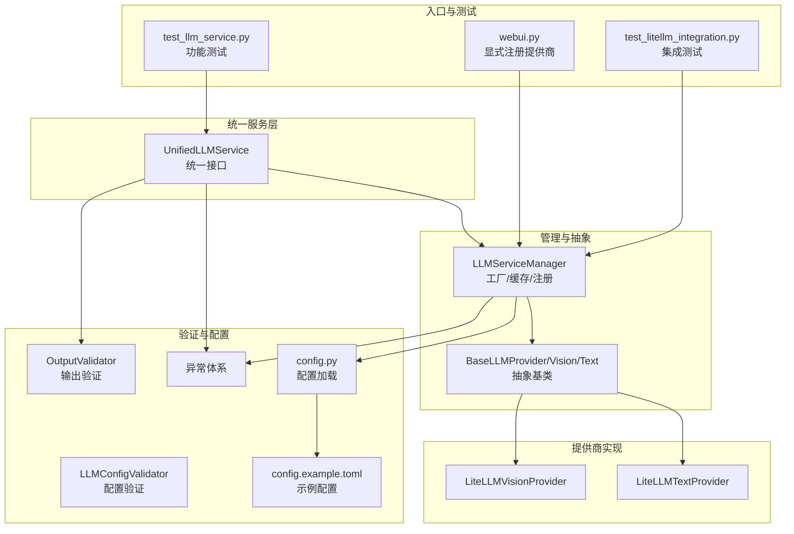
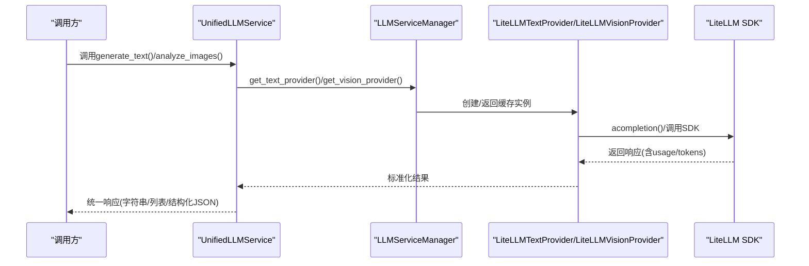
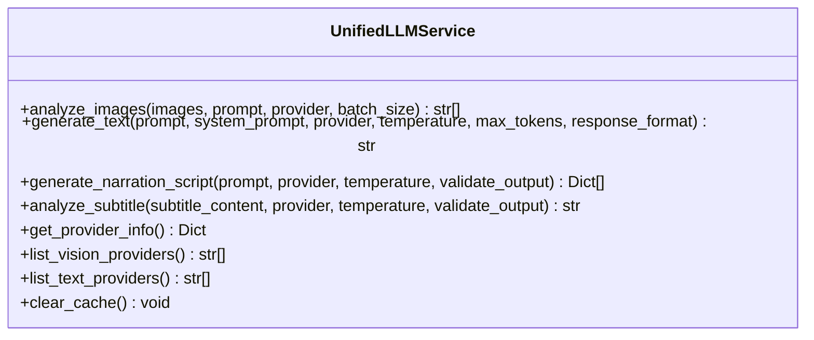
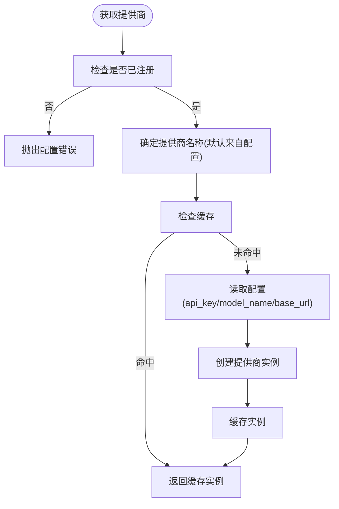
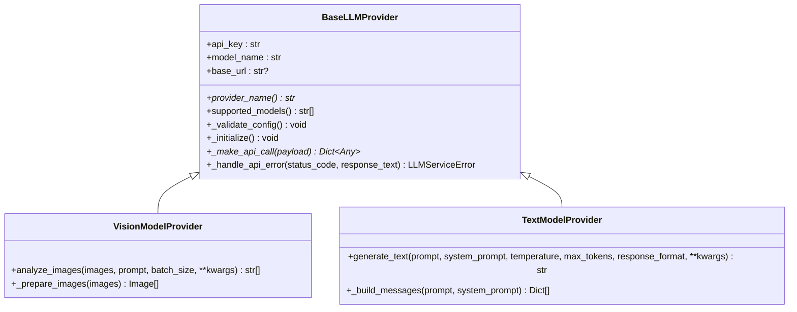
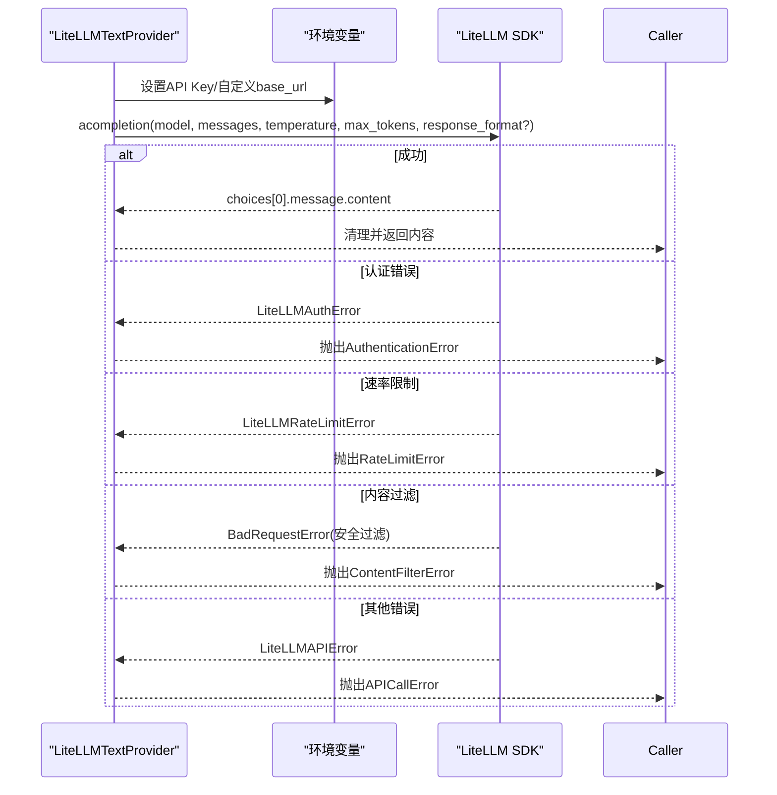
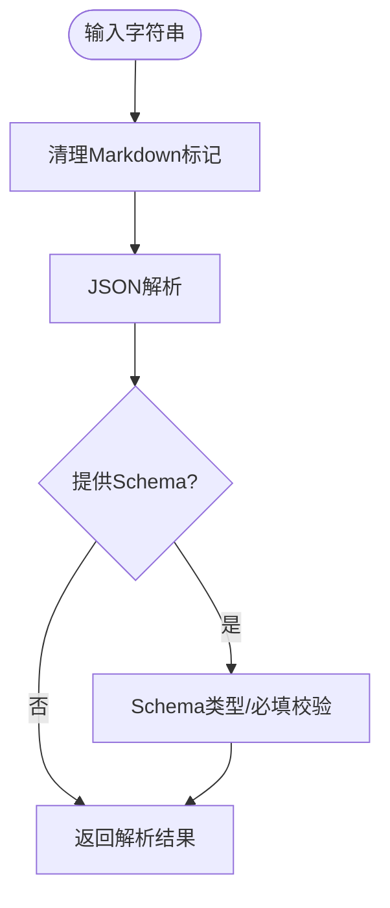
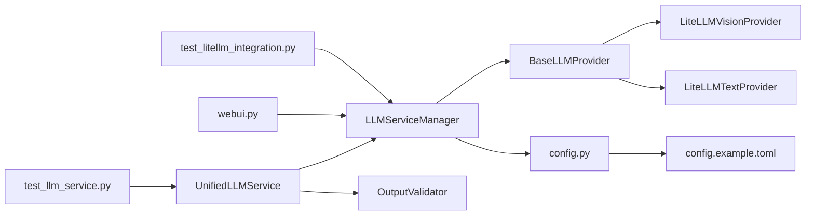

# LLM统一服务API

<cite>
**本文引用的文件**
- [unified_service.py](file://app/services/llm/unified_service.py)
- [manager.py](file://app/services/llm/manager.py)
- [base.py](file://app/services/llm/base.py)
- [litellm_provider.py](file://app/services/llm/litellm_provider.py)
- [validators.py](file://app/services/llm/validators.py)
- [config_validator.py](file://app/services/llm/config_validator.py)
- [exceptions.py](file://app/services/llm/exceptions.py)
- [__init__.py](file://app/services/llm/__init__.py)
- [config.py](file://app/config/config.py)
- [webui.py](file://webui.py)
- [test_llm_service.py](file://app/services/llm/test_llm_service.py)
- [test_litellm_integration.py](file://app/services/llm/test_litellm_integration.py)
- [config.example.toml](file://config.example.toml)
- [providers/__init__.py](file://app/services/llm/providers/__init__.py)
</cite>

## 目录
1. [简介](#简介)
2. [项目结构](#项目结构)
3. [核心组件](#核心组件)
4. [架构总览](#架构总览)
5. [详细组件分析](#详细组件分析)
6. [依赖关系分析](#依赖关系分析)
7. [性能考量](#性能考量)
8. [故障排查指南](#故障排查指南)
9. [结论](#结论)
10. [附录](#附录)

## 简介
本文件面向“LLM统一服务API”的使用者与维护者，系统阐述统一接口的设计理念与实现机制，覆盖多提供商支持、参数标准化与响应统一化；详述模型调用接口的请求参数格式、响应数据结构与错误处理；说明提供商切换与负载均衡策略（故障转移、性能监控与成本优化）；提供完整的API使用示例（文本生成、对话交互、多模态处理）；介绍配置管理接口（提供商认证、参数验证与动态配置更新）；并给出性能优化建议与最佳实践。

## 项目结构
该模块位于 app/services/llm 目录，采用“统一服务层 + 管理器 + 抽象基类 + LiteLLM提供商实现 + 验证器 + 异常体系”的分层设计。WebUI入口在 webui.py 中显式注册提供商，配置由 config.py 加载，示例配置在 config.example.toml 中提供。

**图表来源**
- [unified_service.py:20-263](file://app/services/llm/unified_service.py#L20-L263)
- [manager.py:15-246](file://app/services/llm/manager.py#L15-L246)
- [base.py:16-190](file://app/services/llm/base.py#L16-L190)
- [litellm_provider.py:59-491](file://app/services/llm/litellm_provider.py#L59-L491)
- [validators.py:15-201](file://app/services/llm/validators.py#L15-L201)
- [config_validator.py:15-309](file://app/services/llm/config_validator.py#L15-L309)
- [exceptions.py:11-119](file://app/services/llm/exceptions.py#L11-L119)
- [config.py:24-95](file://app/config/config.py#L24-L95)
- [webui.py:227-246](file://webui.py#L227-L246)
- [test_llm_service.py:1-264](file://app/services/llm/test_llm_service.py#L1-L264)
- [test_litellm_integration.py:1-229](file://app/services/llm/test_litellm_integration.py#L1-L229)
- [config.example.toml:1-177](file://config.example.toml#L1-L177)

**章节来源**
- [unified_service.py:1-263](file://app/services/llm/unified_service.py#L1-L263)
- [manager.py:1-246](file://app/services/llm/manager.py#L1-L246)
- [base.py:1-190](file://app/services/llm/base.py#L1-L190)
- [litellm_provider.py:1-491](file://app/services/llm/litellm_provider.py#L1-L491)
- [validators.py:1-201](file://app/services/llm/validators.py#L1-L201)
- [config_validator.py:1-309](file://app/services/llm/config_validator.py#L1-L309)
- [exceptions.py:1-119](file://app/services/llm/exceptions.py#L1-L119)
- [config.py:1-95](file://app/config/config.py#L1-L95)
- [webui.py:1-294](file://webui.py#L1-L294)
- [test_llm_service.py:1-264](file://app/services/llm/test_llm_service.py#L1-L264)
- [test_litellm_integration.py:1-229](file://app/services/llm/test_litellm_integration.py#L1-L229)
- [config.example.toml:1-177](file://config.example.toml#L1-L177)

## 核心组件
- 统一服务接口：提供简化的API，封装文本生成、图片分析、解说文案生成、字幕分析等能力，屏蔽底层提供商差异。
- 管理器：负责提供商注册、实例缓存、配置读取与实例创建。
- 抽象基类：定义统一的提供商接口与通用行为（如图片预处理、消息构建、错误映射）。
- LiteLLM提供商：统一接入100+提供商，自动重试、统一错误处理、支持多种模型格式。
- 输出验证器：严格校验JSON结构与业务规则，保障下游消费稳定。
- 配置验证器：批量验证提供商配置，输出报告与建议。
- 异常体系：统一错误类型与错误码，便于上层处理与日志追踪。

**章节来源**
- [unified_service.py:20-263](file://app/services/llm/unified_service.py#L20-L263)
- [manager.py:15-246](file://app/services/llm/manager.py#L15-L246)
- [base.py:16-190](file://app/services/llm/base.py#L16-L190)
- [litellm_provider.py:59-491](file://app/services/llm/litellm_provider.py#L59-L491)
- [validators.py:15-201](file://app/services/llm/validators.py#L15-L201)
- [config_validator.py:15-309](file://app/services/llm/config_validator.py#L15-L309)
- [exceptions.py:11-119](file://app/services/llm/exceptions.py#L11-L119)

## 架构总览
统一服务通过管理器按需创建提供商实例，LiteLLM提供商负责与外部API交互，统一错误映射与响应格式，输出验证器保证结构化输出，配置验证器保障配置正确性。

**图表来源**
- [unified_service.py:65-109](file://app/services/llm/unified_service.py#L65-L109)
- [manager.py:69-208](file://app/services/llm/manager.py#L69-L208)
- [litellm_provider.py:349-472](file://app/services/llm/litellm_provider.py#L349-L472)

## 详细组件分析

### 统一服务接口（UnifiedLLMService）
- 文本生成：支持system提示词、温度、最大token、JSON响应格式等参数，自动处理异常并返回字符串。
- 图片分析：支持多图、批处理、图片预处理（缩放、类型转换），返回分析结果列表。
- 解说文案生成：基于文本生成，自动JSON格式化与结构校验。
- 字幕分析：内置系统提示词，支持输出验证。
- 提供商查询与缓存：列出提供商、获取信息、清空缓存。

**图表来源**
- [unified_service.py:20-263](file://app/services/llm/unified_service.py#L20-L263)

**章节来源**
- [unified_service.py:20-263](file://app/services/llm/unified_service.py#L20-L263)

### 管理器（LLMServiceManager）
- 注册机制：显式注册视觉/文本提供商，避免循环依赖。
- 实例缓存：按提供商名称缓存实例，降低重复创建开销。
- 配置读取：从配置中读取API Key、模型名、Base URL，缺失时报错。
- 提供商查询：列出已注册提供商、获取详细信息。

**图表来源**
- [manager.py:69-208](file://app/services/llm/manager.py#L69-L208)

**章节来源**
- [manager.py:15-246](file://app/services/llm/manager.py#L15-L246)

### 抽象基类（BaseLLMProvider）
- 统一构造：校验API Key与模型名，初始化提供商特定设置。
- 视觉模型：图片预处理（PIL、缩放）、批处理。
- 文本模型：消息构建（system/user），统一API调用接口。
- 错误映射：HTTP状态码映射到统一异常类型。

**图表来源**
- [base.py:16-190](file://app/services/llm/base.py#L16-L190)

**章节来源**
- [base.py:16-190](file://app/services/llm/base.py#L16-L190)

### LiteLLM提供商（LiteLLMVisionProvider / LiteLLMTextProvider）
- 统一接口：支持100+提供商，自动设置环境变量与base_url。
- 视觉模型：图片转base64，拼装消息，批处理调用。
- 文本模型：统一消息格式，JSON模式兼容，自动清理输出。
- 错误处理：认证、速率限制、内容过滤、API错误统一映射。

**图表来源**
- [litellm_provider.py:349-472](file://app/services/llm/litellm_provider.py#L349-L472)

**章节来源**
- [litellm_provider.py:59-491](file://app/services/llm/litellm_provider.py#L59-L491)

### 输出验证器（OutputValidator）
- JSON输出清理与解析，支持Schema校验与字段必填检查。
- 解说文案：校验items数组、时间戳格式、字段完整性。
- 字幕分析：长度与关键词校验，保证可读性。

**图表来源**
- [validators.py:18-88](file://app/services/llm/validators.py#L18-L88)

**章节来源**
- [validators.py:15-201](file://app/services/llm/validators.py#L15-L201)

### 配置验证器（LLMConfigValidator）
- 验证所有提供商配置，输出错误与警告清单。
- 生成配置建议，包含必填项、示例模型与通用建议。
- 支持打印验证报告。

**章节来源**
- [config_validator.py:15-309](file://app/services/llm/config_validator.py#L15-L309)

### 异常体系（LLMServiceError家族）
- 统一错误码与细节字段，便于前端与日志识别。
- 典型异常：提供商未找到、配置错误、API调用错误、速率限制、认证错误、内容过滤、输出验证错误、模型不支持。

**章节来源**
- [exceptions.py:11-119](file://app/services/llm/exceptions.py#L11-L119)

## 依赖关系分析
- 统一服务依赖管理器获取提供商实例，依赖验证器进行输出校验。
- 管理器依赖配置模块读取配置，依赖抽象基类与具体提供商实现。
- LiteLLM提供商依赖LiteLLM SDK与环境变量。
- WebUI在启动时显式注册提供商，确保服务可用。
- 测试脚本验证统一服务与集成情况。

**图表来源**
- [unified_service.py:12-14](file://app/services/llm/unified_service.py#L12-L14)
- [manager.py:10-12](file://app/services/llm/manager.py#L10-L12)
- [litellm_provider.py:16-27](file://app/services/llm/litellm_provider.py#L16-L27)
- [config.py:10-11](file://app/config/config.py#L10-L11)
- [webui.py:236-237](file://webui.py#L236-L237)
- [test_llm_service.py:20-22](file://app/services/llm/test_llm_service.py#L20-L22)
- [test_litellm_integration.py:15-17](file://app/services/llm/test_litellm_integration.py#L15-L17)

**章节来源**
- [providers/__init__.py:12-34](file://app/services/llm/providers/__init__.py#L12-L34)
- [webui.py:227-246](file://webui.py#L227-L246)

## 性能考量
- 批处理与缓存：图片分析支持批处理，管理器对提供商实例进行缓存，减少重复创建。
- 超时与重试：配置中设置文本/视觉超时与重试次数，LiteLLM自动处理重试。
- 图片预处理：自动缩放与类型转换，平衡质量与性能。
- 模型选择：示例配置提供多提供商与模型组合，按速度/精度/成本权衡选择。
- 并发与异步：统一使用异步接口，适合高并发场景。

**章节来源**
- [litellm_provider.py:149-165](file://app/services/llm/litellm_provider.py#L149-L165)
- [manager.py:210-215](file://app/services/llm/manager.py#L210-L215)
- [config.example.toml:4-7](file://config.example.toml#L4-L7)

## 故障排查指南
- 提供商未注册：确认WebUI启动时已调用提供商注册函数。
- 配置缺失：检查API Key、模型名、Base URL是否配置完整。
- 认证失败：核对API Key有效性与权限范围。
- 速率限制：降低并发或等待重试窗口。
- 内容过滤：调整提示词或更换模型。
- 输出验证失败：检查提示词是否强制JSON格式，或关闭严格校验。
- 配置验证：使用配置验证器输出报告，逐项修正。

**章节来源**
- [manager.py:84-88](file://app/services/llm/manager.py#L84-L88)
- [config_validator.py:18-85](file://app/services/llm/config_validator.py#L18-L85)
- [exceptions.py:26-119](file://app/services/llm/exceptions.py#L26-L119)

## 结论
该统一服务API通过“统一接口 + 管理器 + 抽象基类 + LiteLLM提供商 + 验证器 + 异常体系”的架构，实现了多提供商透明接入、参数标准化与响应统一化。配合完善的配置与验证工具、异步与缓存机制，满足文本生成、对话交互、多模态处理等多样化场景，并为故障转移、性能监控与成本优化提供良好基础。

## 附录

### API使用示例（路径指引）
- 文本生成
  - 示例调用路径：[unified_service.py:65-109](file://app/services/llm/unified_service.py#L65-L109)
  - 参数要点：prompt、system_prompt、temperature、max_tokens、response_format
- 图片分析
  - 示例调用路径：[unified_service.py:24-63](file://app/services/llm/unified_service.py#L24-L63)
  - 参数要点：images（路径/PIL对象列表）、prompt、batch_size
- 解说文案生成
  - 示例调用路径：[unified_service.py:112-159](file://app/services/llm/unified_service.py#L112-L159)
  - 参数要点：prompt、temperature、validate_output
- 字幕分析
  - 示例调用路径：[unified_service.py:162-206](file://app/services/llm/unified_service.py#L162-L206)
  - 参数要点：subtitle_content、temperature、validate_output

**章节来源**
- [unified_service.py:24-206](file://app/services/llm/unified_service.py#L24-L206)

### 配置管理接口
- 配置加载：config.py负责加载config.toml，支持UTF-8-SIG编码回退。
- 示例配置：config.example.toml提供LLM超时、重试、提供商与模型示例。
- 配置验证：LLMConfigValidator批量验证并输出报告与建议。
- 动态更新：当前实现为一次性加载；如需热更新，可在上层增加监听与重载逻辑。

**章节来源**
- [config.py:24-95](file://app/config/config.py#L24-L95)
- [config.example.toml:1-177](file://config.example.toml#L1-L177)
- [config_validator.py:18-85](file://app/services/llm/config_validator.py#L18-L85)

### 测试与集成
- 单元测试：test_llm_service.py涵盖文本生成、JSON生成、字幕分析、解说文案生成与配置验证。
- 集成测试：test_litellm_integration.py验证提供商注册、LiteLLM导入与向后兼容性。
- WebUI集成：webui.py在启动时显式注册提供商，确保服务可用。

**章节来源**
- [test_llm_service.py:25-264](file://app/services/llm/test_llm_service.py#L25-L264)
- [test_litellm_integration.py:20-229](file://app/services/llm/test_litellm_integration.py#L20-L229)
- [webui.py:227-246](file://webui.py#L227-L246)