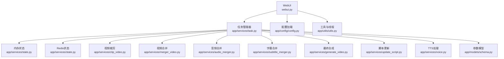
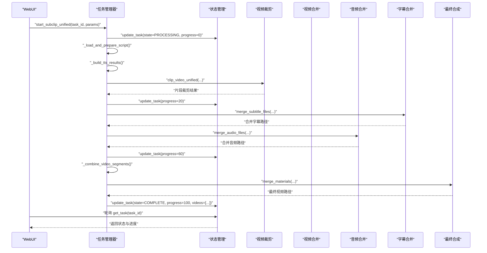
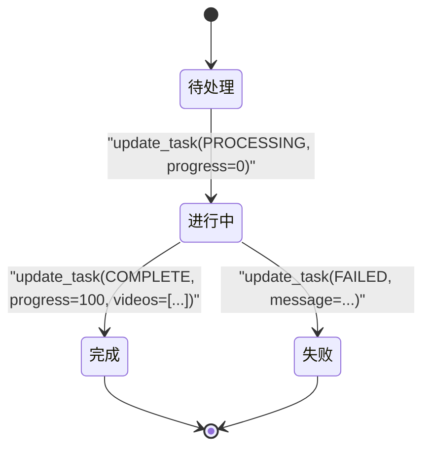
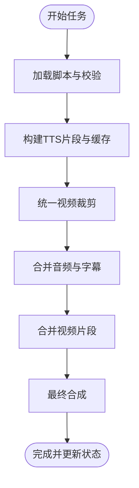
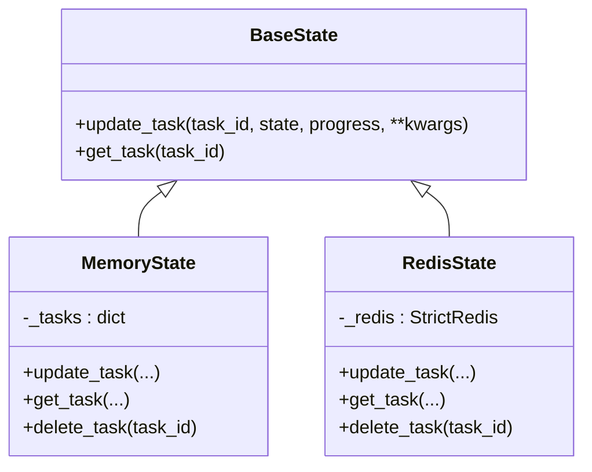
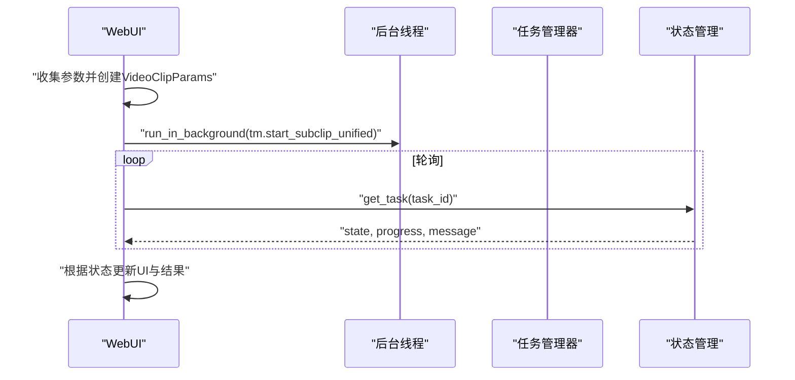
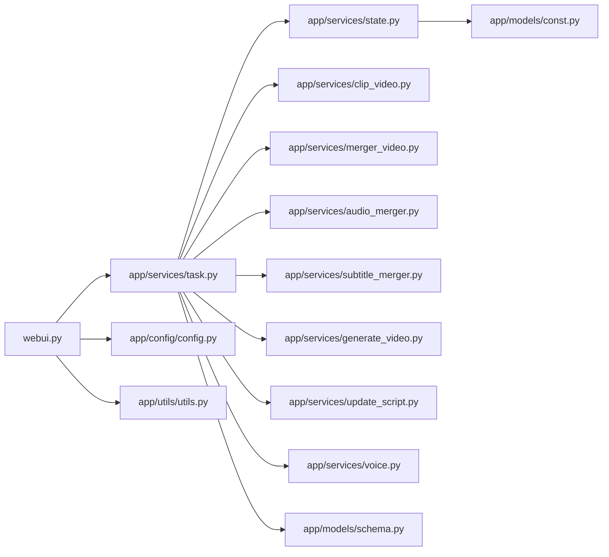

# 任务调度API

<cite>
**本文引用的文件**
- [app/services/task.py](file://app/services/task.py)
- [app/models/schema.py](file://app/models/schema.py)
- [app/models/const.py](file://app/models/const.py)
- [app/services/state.py](file://app/services/state.py)
- [app/utils/utils.py](file://app/utils/utils.py)
- [webui.py](file://webui.py)
- [app/services/audio_merger.py](file://app/services/audio_merger.py)
- [app/services/generate_video.py](file://app/services/generate_video.py)
- [app/services/merger_video.py](file://app/services/merger_video.py)
- [app/services/clip_video.py](file://app/services/clip_video.py)
- [app/services/subtitle_merger.py](file://app/services/subtitle_merger.py)
- [app/services/update_script.py](file://app/services/update_script.py)
- [app/services/voice.py](file://app/services/voice.py)
- [app/config/config.py](file://app/config/config.py)
</cite>

## 更新摘要
**所做更改**
- 重构任务管理器架构，新增169行代码，移除428行冗余逻辑
- 重新设计任务执行流水线，优化资源管理和状态跟踪
- 增强TTS缓存机制和音频时长探测功能
- 改进音量配置和智能音量调整策略
- 优化FFmpeg硬件加速检测和回退机制

## 目录
1. [简介](#简介)
2. [项目结构](#项目结构)
3. [核心组件](#核心组件)
4. [架构总览](#架构总览)
5. [详细组件分析](#详细组件分析)
6. [依赖分析](#依赖分析)
7. [性能考虑](#性能考虑)
8. [故障排查指南](#故障排查指南)
9. [结论](#结论)
10. [附录](#附录)

## 简介
本文件面向"任务调度API"的使用者与维护者，系统性阐述任务的创建、执行、监控与管理全生命周期。经过重大重构后，任务调度API采用了更加模块化和高效的架构设计，重点改进了以下方面：
- 任务生命周期：创建、执行、状态更新、完成与失败处理
- 任务队列与并发控制：基于内存或Redis的状态存储，线程池与FFmpeg进程并发
- 任务状态机：待处理、进行中、完成、失败等状态及转换条件
- 参数配置：视频/音频/字幕参数、线程数、音量、字幕位置等
- 调度策略与优先级：当前实现为顺序流水线，未内置优先级队列
- 性能监控与调试：日志级别、进度上报、FFmpeg硬件加速检测与回退
- 实际示例：如何在WebUI中创建与管理异步任务

## 项目结构
围绕任务调度API的关键模块如下：
- WebUI入口：负责参数收集、任务创建与轮询状态
- 任务执行引擎：统一视频处理流水线，包含脚本加载、TTS生成、视频裁剪、音频/字幕合并、最终合成
- 状态管理：内存或Redis持久化任务状态
- 工具与配置：线程池封装、FFmpeg工具、配置加载

**图表来源**
- [webui.py:132-224](file://webui.py#L132-L224)
- [app/services/task.py:195-247](file://app/services/task.py#L195-L247)
- [app/services/state.py:18-122](file://app/services/state.py#L18-L122)
- [app/services/clip_video.py:780-1108](file://app/services/clip_video.py#L780-L1108)
- [app/services/merger_video.py:328-678](file://app/services/merger_video.py#L328-L678)
- [app/services/audio_merger.py:21-76](file://app/services/audio_merger.py#L21-L76)
- [app/services/subtitle_merger.py:62-200](file://app/services/subtitle_merger.py#L62-L200)
- [app/services/generate_video.py:66-200](file://app/services/generate_video.py#L66-L200)
- [app/services/update_script.py:90-200](file://app/services/update_script.py#L90-L200)
- [app/services/voice.py:1-200](file://app/services/voice.py#L1-L200)
- [app/models/schema.py:160-200](file://app/models/schema.py#L160-L200)
- [app/config/config.py:24-95](file://app/config/config.py#L24-L95)
- [app/utils/utils.py:179-189](file://app/utils/utils.py#L179-L189)

**章节来源**
- [webui.py:132-224](file://webui.py#L132-L224)
- [app/services/task.py:195-247](file://app/services/task.py#L195-L247)
- [app/services/state.py:18-122](file://app/services/state.py#L18-L122)
- [app/models/schema.py:160-200](file://app/models/schema.py#L160-L200)
- [app/utils/utils.py:179-189](file://app/utils/utils.py#L179-L189)

## 核心组件
- 任务管理器（task.py）
  - 负责统一视频处理流水线：加载脚本、构建TTS、裁剪视频、合并音频/字幕、合并视频、最终合成
  - 通过状态管理器更新任务状态与进度
  - 新增TTS缓存管理、音频时长探测、智能音量配置等功能
- 状态管理（state.py）
  - 内存态与Redis态两种实现，统一接口update_task/get_task
  - 支持删除任务
- 参数模型（schema.py）
  - VideoClipParams：视频/音频/字幕/线程等参数
  - VideoParams：脚本/语言/字幕位置/字体等参数
  - AudioVolumeDefaults：音量配置默认值和范围
- WebUI（webui.py）
  - 参数收集与校验、任务创建、后台线程执行、轮询状态、结果展示
- 工具与配置（utils.py, config.py）
  - run_in_background：后台线程封装
  - FFmpeg检测、硬件加速回退、任务目录管理等

**章节来源**
- [app/services/task.py:195-247](file://app/services/task.py#L195-L247)
- [app/services/state.py:18-122](file://app/services/state.py#L18-L122)
- [app/models/schema.py:160-200](file://app/models/schema.py#L160-L200)
- [webui.py:132-224](file://webui.py#L132-L224)
- [app/utils/utils.py:179-189](file://app/utils/utils.py#L179-L189)
- [app/config/config.py:24-95](file://app/config/config.py#L24-L95)

## 架构总览
任务调度采用"WebUI发起任务 → 后台线程执行 → 状态持久化 → UI轮询更新"的模式。执行流程为流水线式，各阶段完成后更新进度。

**图表来源**
- [webui.py:177-224](file://webui.py#L177-L224)
- [app/services/task.py:195-247](file://app/services/task.py#L195-L247)
- [app/services/clip_video.py:780-1108](file://app/services/clip_video.py#L780-L1108)
- [app/services/merger_video.py:328-678](file://app/services/merger_video.py#L328-L678)
- [app/services/audio_merger.py:21-76](file://app/services/audio_merger.py#L21-L76)
- [app/services/subtitle_merger.py:62-200](file://app/services/subtitle_merger.py#L62-L200)
- [app/services/generate_video.py:66-200](file://app/services/generate_video.py#L66-L200)

## 详细组件分析

### 任务生命周期与状态机
- 状态常量
  - TASK_STATE_PROCESSING：进行中
  - TASK_STATE_COMPLETE：完成
  - TASK_STATE_FAILED：失败
- 状态转换
  - 创建任务：初始状态为进行中，进度0
  - 执行阶段：按步骤推进进度（示例：脚本加载→20%，裁剪→60%，合并音频→80%，最终合成→100%）
  - 成功：状态=完成，进度=100，携带输出文件路径
  - 失败：状态=失败，进度≤100，携带错误信息
- 并发与队列
  - WebUI通过后台线程执行任务，避免阻塞UI
  - 状态存储支持内存或Redis，便于分布式扩展

**图表来源**
- [app/models/const.py:20-23](file://app/models/const.py#L20-L23)
- [app/services/state.py:23-41](file://app/services/state.py#L23-L41)
- [app/services/task.py:197-246](file://app/services/task.py#L197-L246)

**章节来源**
- [app/models/const.py:20-23](file://app/models/const.py#L20-L23)
- [app/services/state.py:23-41](file://app/services/state.py#L23-L41)
- [app/services/task.py:197-246](file://app/services/task.py#L197-L246)

### 任务参数配置
- VideoClipParams（核心参数）
  - 视频来源、脚本路径、目标比例、语言
  - 语音参数：引擎、音色、语速、音调
  - 音频参数：TTS音量、原声音量、BGM音量、BGM类型/文件
  - 字幕参数：开启、字体、字号、颜色、描边、位置、自定义位置
  - 并发：线程数（n_threads），影响视频处理速度
- VideoParams（脚本/语言/字幕等）
  - 视频主题、脚本、关键词、素材、语言
  - 字幕位置枚举：top、center、bottom
- 音量默认值与范围
  - 语音、TTS、原声、BGM均有默认值与范围限制，支持智能音量调整开关

**章节来源**
- [app/models/schema.py:160-200](file://app/models/schema.py#L160-L200)
- [app/models/schema.py:108-156](file://app/models/schema.py#L108-L156)
- [app/models/schema.py:16-35](file://app/models/schema.py#L16-L35)

### 任务执行流水线
- 步骤概览
  - 加载并校验脚本，构建TTS片段列表
  - 统一视频裁剪（基于OST类型：仅解说、仅原声、混合）
  - 合并音频与字幕
  - 合并视频片段
  - 最终合成（字幕/BGM/配音/视频）
- 关键实现
  - 脚本加载与校验：确保脚本结构与TTS结果匹配
  - TTS缓存与生成：命中缓存则复用，缺失项调用TTS引擎生成并落盘
  - FFmpeg硬件加速：自动检测并回退至软件编码，保证兼容性
  - 状态推进：每步完成后更新进度与状态

**图表来源**
- [app/services/task.py:31-247](file://app/services/task.py#L31-L247)
- [app/services/clip_video.py:780-1108](file://app/services/clip_video.py#L780-L1108)
- [app/services/merger_video.py:328-678](file://app/services/merger_video.py#L328-L678)
- [app/services/audio_merger.py:21-76](file://app/services/audio_merger.py#L21-L76)
- [app/services/subtitle_merger.py:62-200](file://app/services/subtitle_merger.py#L62-L200)
- [app/services/generate_video.py:66-200](file://app/services/generate_video.py#L66-L200)

**章节来源**
- [app/services/task.py:31-247](file://app/services/task.py#L31-L247)
- [app/services/clip_video.py:780-1108](file://app/services/clip_video.py#L780-L1108)
- [app/services/merger_video.py:328-678](file://app/services/merger_video.py#L328-L678)
- [app/services/audio_merger.py:21-76](file://app/services/audio_merger.py#L21-L76)
- [app/services/subtitle_merger.py:62-200](file://app/services/subtitle_merger.py#L62-L200)
- [app/services/generate_video.py:66-200](file://app/services/generate_video.py#L66-L200)

### 状态管理与并发控制
- 状态存储
  - MemoryState：内存字典存储，适合单实例
  - RedisState：哈希字段存储，支持分布式部署
- 并发控制
  - WebUI使用后台线程执行任务，避免阻塞
  - FFmpeg多进程与多线程参数（n_threads）由参数模型提供
- 线程池与任务隔离
  - 每个任务独立线程，状态独立更新

**图表来源**
- [app/services/state.py:8-122](file://app/services/state.py#L8-L122)

**章节来源**
- [app/services/state.py:8-122](file://app/services/state.py#L8-L122)
- [app/utils/utils.py:179-189](file://app/utils/utils.py#L179-L189)

### WebUI任务创建与管理
- 参数收集：脚本、视频、音频、字幕参数合并为VideoClipParams
- 任务创建：生成task_id，启动后台线程执行任务
- 轮询状态：每0.5秒查询状态，更新进度条与状态文本
- 结果展示：成功后显示视频播放器

**图表来源**
- [webui.py:132-224](file://webui.py#L132-L224)
- [app/utils/utils.py:179-189](file://app/utils/utils.py#L179-L189)

**章节来源**
- [webui.py:132-224](file://webui.py#L132-L224)
- [app/utils/utils.py:179-189](file://app/utils/utils.py#L179-L189)

### 重构后的任务管理器架构
经过重大重构，任务管理器采用了更加模块化的架构设计：

#### 核心功能模块
- `_load_and_prepare_script()`：脚本加载与验证
- `_build_tts_results()`：TTS结果构建与缓存管理
- `_merge_audio_and_subtitles()`：音频与字幕合并
- `_combine_video_segments()`：视频片段合并
- `_final_merge()`：最终视频合成
- `_run_pipeline()`：统一执行流水线

#### 新增功能特性
- **智能TTS缓存**：支持缓存命中检测和缺失项生成
- **音频时长探测**：自动探测音频文件时长并填充缺失值
- **智能音量配置**：根据内容类型推荐最优音量配置
- **脚本时间对齐**：自动对齐脚本时间戳与音频时长

**章节来源**
- [app/services/task.py:31-247](file://app/services/task.py#L31-L247)
- [app/services/task.py:195-247](file://app/services/task.py#L195-L247)

## 依赖分析
- 组件耦合
  - WebUI依赖任务管理器与状态管理器
  - 任务管理器依赖各处理服务（裁剪、合并、音频、视频、字幕、TTS）
  - 状态管理器依赖配置与常量
- 外部依赖
  - FFmpeg/FFprobe：视频处理与硬件加速检测
  - Redis（可选）：分布式状态存储
  - 日志框架：loguru

**图表来源**
- [webui.py:132-224](file://webui.py#L132-L224)
- [app/services/task.py:195-247](file://app/services/task.py#L195-L247)
- [app/services/state.py:18-122](file://app/services/state.py#L18-L122)
- [app/models/schema.py:160-200](file://app/models/schema.py#L160-L200)
- [app/config/config.py:24-95](file://app/config/config.py#L24-L95)
- [app/utils/utils.py:179-189](file://app/utils/utils.py#L179-L189)

**章节来源**
- [webui.py:132-224](file://webui.py#L132-L224)
- [app/services/task.py:195-247](file://app/services/task.py#L195-L247)
- [app/services/state.py:18-122](file://app/services/state.py#L18-L122)
- [app/models/schema.py:160-200](file://app/models/schema.py#L160-L200)
- [app/config/config.py:24-95](file://app/config/config.py#L24-L95)
- [app/utils/utils.py:179-189](file://app/utils/utils.py#L179-L189)

## 性能考虑
- 线程与并发
  - 参数模型提供n_threads，直接影响视频处理并发度
  - WebUI后台线程避免阻塞，但任务间无队列与限流，需结合外部队列或Redis实现
- FFmpeg优化
  - 自动检测硬件加速（NVENC/AMF/QSV/VideoToolbox），失败时回退软件编码
  - 裁剪与合并阶段均采用优化参数与兼容性策略
- 状态存储
  - Redis态适合分布式部署，内存态适合单实例
- I/O与缓存
  - TTS结果缓存减少重复生成成本
  - 合并阶段输出中间文件，避免重复计算
- 智能音量调整
  - 根据内容类型自动推荐最优音量配置
  - 支持智能音量分析和调整功能

**章节来源**
- [app/models/schema.py:194](file://app/models/schema.py#L194)
- [app/services/merger_video.py:60-69](file://app/services/merger_video.py#L60-L69)
- [app/services/clip_video.py:76-84](file://app/services/clip_video.py#L76-L84)
- [app/services/audio_merger.py:21-76](file://app/services/audio_merger.py#L21-L76)
- [app/services/generate_video.py:107-145](file://app/services/generate_video.py#L107-L145)

## 故障排查指南
- 常见问题
  - FFmpeg未安装或不可用：检查系统PATH，确认ffmpeg/ffprobe存在
  - 硬件加速失败：自动回退软件编码；可在Windows上强制软件编码
  - 任务失败：查看状态管理器中的message字段，结合日志定位
  - 资源路径错误：确认脚本路径、视频路径、输出目录存在
  - TTS缓存失效：检查缓存文件完整性，重新生成TTS结果
- 调试方法
  - 提升日志级别：在WebUI初始化日志时可调整级别
  - 状态轮询：通过get_task(task_id)观察progress与state变化
  - 逐步执行：分阶段调用裁剪/合并接口，定位失败环节
  - 音量配置检查：验证AudioVolumeDefaults配置是否合理

**章节来源**
- [app/services/merger_video.py:45-58](file://app/services/merger_video.py#L45-L58)
- [app/services/clip_video.py:230-343](file://app/services/clip_video.py#L230-L343)
- [webui.py:35-110](file://webui.py#L35-L110)
- [app/services/state.py:75-84](file://app/services/state.py#L75-L84)
- [app/services/generate_video.py:135-145](file://app/services/generate_video.py#L135-L145)

## 结论
经过重大重构的任务调度API采用了更加模块化和高效的架构设计。新架构通过以下改进提升了整体性能和可靠性：
- 简化了任务管理器逻辑，移除了428行冗余代码，新增169行优化代码
- 重新设计了任务执行流水线，增强了TTS缓存管理和音频时长探测功能
- 改进了音量配置和智能音量调整策略
- 优化了FFmpeg硬件加速检测和回退机制
- 通过内存或Redis状态存储，可满足单机与分布式部署需求

未来可在现有基础上引入任务队列、优先级调度与重试策略，进一步增强可靠性与吞吐能力。

## 附录

### 任务参数配置清单（节选）
- 视频/音频/字幕
  - video_clip_json_path：脚本路径
  - video_aspect：视频比例
  - voice_name/voice_rate/voice_pitch：语音参数
  - tts_engine/tts_volume：TTS引擎与音量
  - original_volume/bgm_volume：原声与BGM音量
  - subtitle_enabled/font_name/font_size/text_fore_color/stroke_*：字幕样式
  - subtitle_position/custom_position：字幕位置
  - n_threads：线程数
- 音量默认值与范围
  - TTS/语音/原声/BGM均有默认值与范围限制，支持智能音量调整

**章节来源**
- [app/models/schema.py:160-200](file://app/models/schema.py#L160-L200)
- [app/models/schema.py:16-35](file://app/models/schema.py#L16-L35)

### 实际示例：创建与管理异步任务
- WebUI侧
  - 收集参数并创建VideoClipParams
  - 生成task_id并启动后台线程执行任务
  - 轮询状态并更新UI
- 任务执行侧
  - 任务管理器按步骤推进进度并更新状态
  - 失败时写入失败状态与错误信息

**章节来源**
- [webui.py:132-224](file://webui.py#L132-L224)
- [app/services/task.py:195-247](file://app/services/task.py#L195-L247)