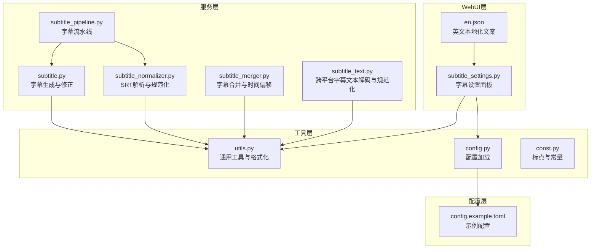
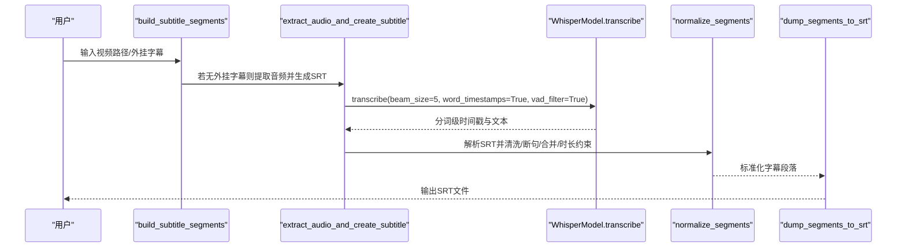
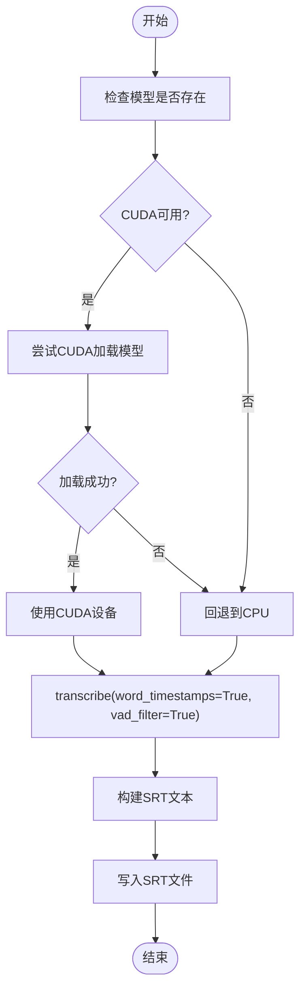
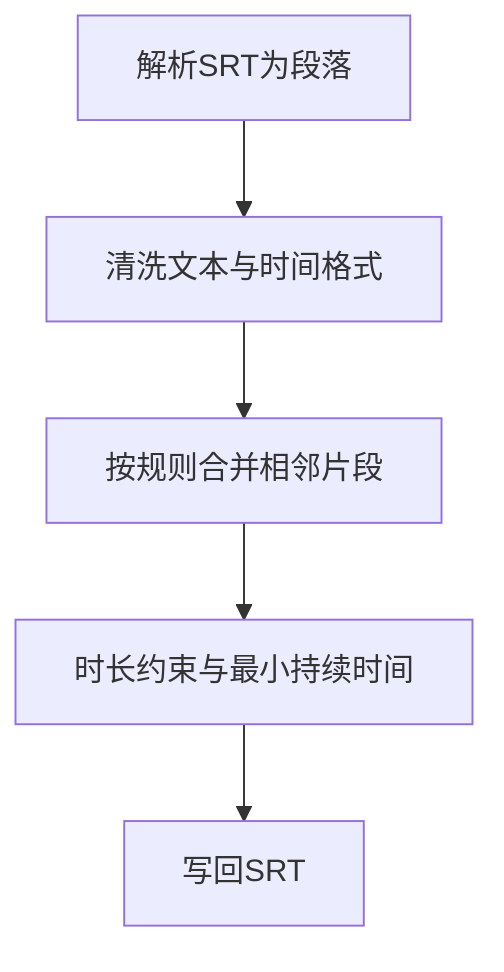
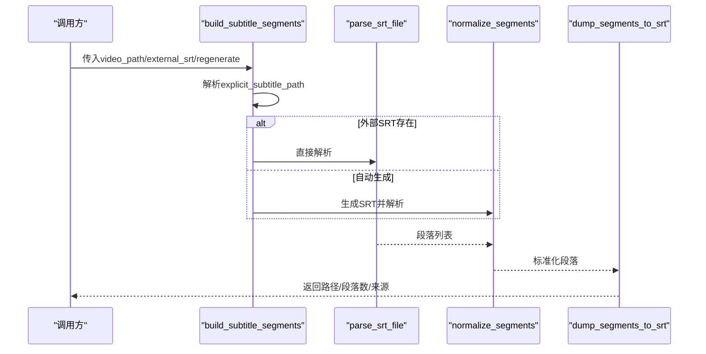
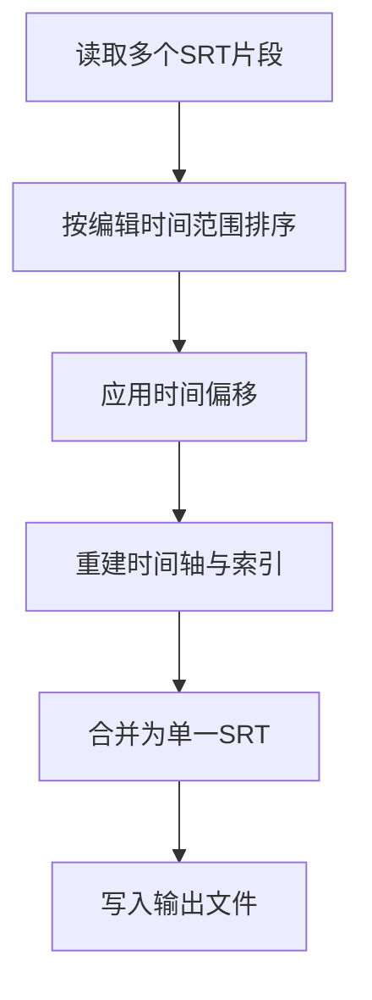
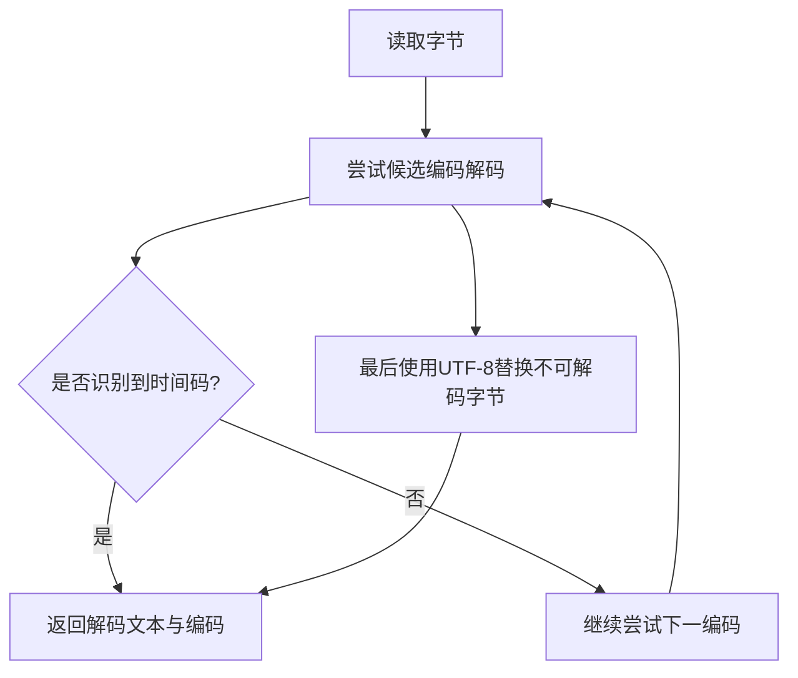
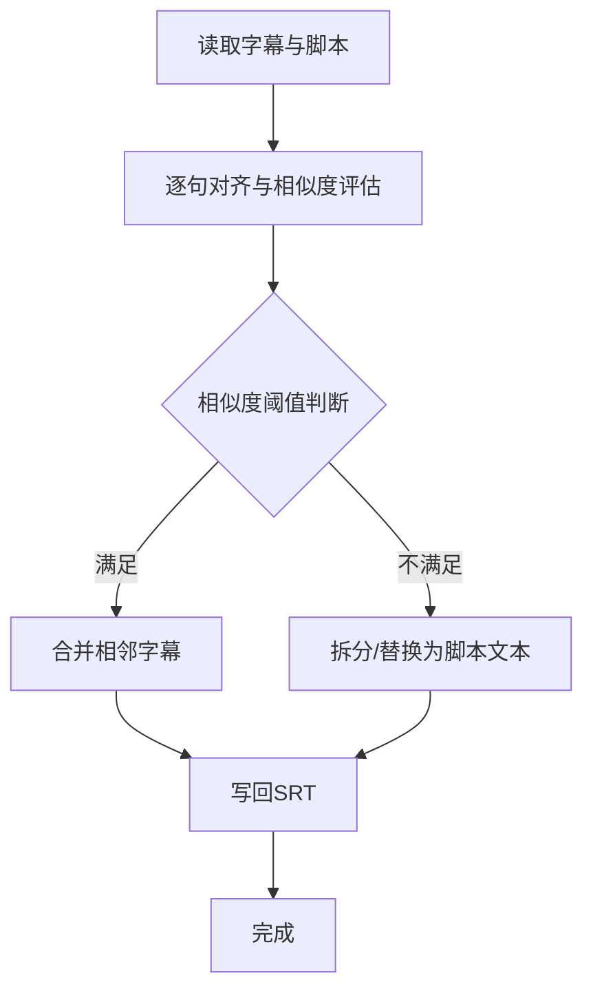
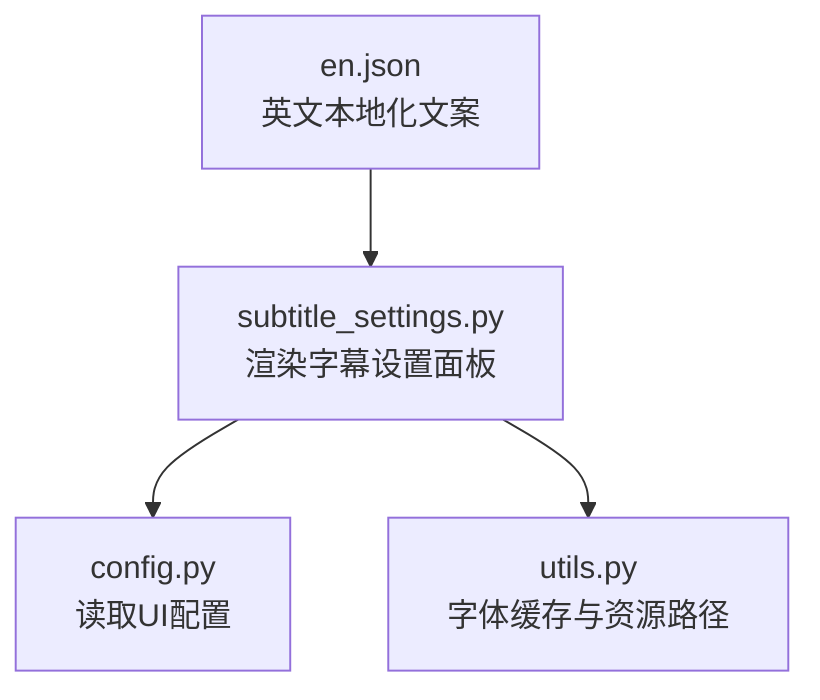
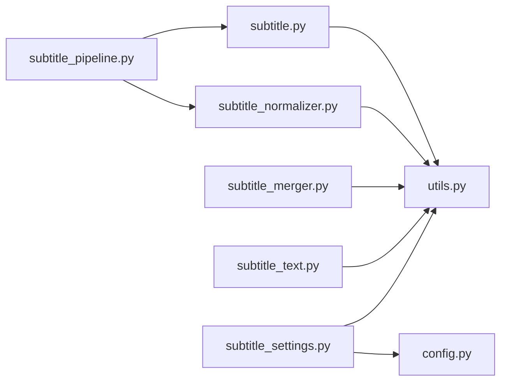

# 字幕处理API

<cite>
**本文引用的文件**
- [app/services/subtitle.py](file://app/services/subtitle.py)
- [app/services/subtitle_normalizer.py](file://app/services/subtitle_normalizer.py)
- [app/services/subtitle_pipeline.py](file://app/services/subtitle_pipeline.py)
- [app/services/subtitle_merger.py](file://app/services/subtitle_merger.py)
- [app/services/subtitle_text.py](file://app/services/subtitle_text.py)
- [app/utils/utils.py](file://app/utils/utils.py)
- [app/config/config.py](file://app/config/config.py)
- [app/models/const.py](file://app/models/const.py)
- [webui/components/subtitle_settings.py](file://webui/components/subtitle_settings.py)
- [webui/i18n/en.json](file://webui/i18n/en.json)
- [config.example.toml](file://config.example.toml)
- [README.md](file://README.md)
</cite>

## 目录
1. [简介](#简介)
2. [项目结构](#项目结构)
3. [核心组件](#核心组件)
4. [架构总览](#架构总览)
5. [详细组件分析](#详细组件分析)
6. [依赖关系分析](#依赖关系分析)
7. [性能考量](#性能考量)
8. [故障排除指南](#故障排除指南)
9. [结论](#结论)
10. [附录](#附录)

## 简介
本文件系统性梳理字幕处理API的设计与实现，覆盖以下能力：
- 字幕生成：基于Whisper的自动语音识别、基于Gemini的转录生成、从视频提取音频后生成字幕
- 字幕同步与对齐：时间轴对齐、延迟补偿、多语言支持
- 格式转换：SRT解析与标准化、跨平台编码解码与规范化
- 字幕规范化：字符集处理、标点与断句、时长约束与合并策略
- 字幕管道：预处理、处理、后处理的完整流水线
- 质量检查与修复：相似度校验、合并纠正、脚本格式验证
- 多语言与本地化：界面与提示文案的国际化配置

## 项目结构
围绕字幕处理的核心模块分布如下：
- 服务层：字幕生成、规范化、合并、文本工具
- 工具层：通用工具、配置管理、常量定义
- WebUI层：字幕设置面板、本地化文案
- 配置层：示例配置文件与运行时配置加载

**图表来源**
- [app/services/subtitle.py:1-467](file://app/services/subtitle.py#L1-L467)
- [app/services/subtitle_normalizer.py:1-154](file://app/services/subtitle_normalizer.py#L1-L154)
- [app/services/subtitle_pipeline.py:1-64](file://app/services/subtitle_pipeline.py#L1-L64)
- [app/services/subtitle_merger.py:1-239](file://app/services/subtitle_merger.py#L1-L239)
- [app/services/subtitle_text.py:1-125](file://app/services/subtitle_text.py#L1-L125)
- [app/utils/utils.py:1-675](file://app/utils/utils.py#L1-L675)
- [app/config/config.py:1-95](file://app/config/config.py#L1-L95)
- [app/models/const.py:1-26](file://app/models/const.py#L1-L26)
- [webui/components/subtitle_settings.py:1-165](file://webui/components/subtitle_settings.py#L1-L165)
- [webui/i18n/en.json:1-91](file://webui/i18n/en.json#L1-L91)
- [config.example.toml:1-177](file://config.example.toml#L1-L177)

**章节来源**
- [README.md:1-180](file://README.md#L1-L180)

## 核心组件
- 字幕生成服务：支持Whisper模型自动识别与Gemini转录生成，提供从视频提取音频并生成SRT的能力
- 字幕规范化服务：解析SRT、清洗文本、断句与合并、时长约束、输出标准化SRT
- 字幕流水线：统一入口，支持外部SRT与自动生成SRT，串联解析与规范化
- 字幕合并服务：按时间偏移合并多个SRT片段，支持编辑时间范围与输出命名
- 字幕文本工具：跨平台解码与规范化，处理编码、BOM、换行与毫秒分隔符
- 通用工具：SRT格式化、时间转换、标点处理、临时目录管理、国际化加载
- 配置与本地化：运行时配置加载、WebUI字幕设置面板、英文文案

**章节来源**
- [app/services/subtitle.py:26-467](file://app/services/subtitle.py#L26-L467)
- [app/services/subtitle_normalizer.py:34-154](file://app/services/subtitle_normalizer.py#L34-L154)
- [app/services/subtitle_pipeline.py:33-63](file://app/services/subtitle_pipeline.py#L33-L63)
- [app/services/subtitle_merger.py:62-185](file://app/services/subtitle_merger.py#L62-L185)
- [app/services/subtitle_text.py:40-125](file://app/services/subtitle_text.py#L40-L125)
- [app/utils/utils.py:222-234](file://app/utils/utils.py#L222-L234)
- [app/config/config.py:24-95](file://app/config/config.py#L24-L95)
- [webui/components/subtitle_settings.py:9-165](file://webui/components/subtitle_settings.py#L9-L165)
- [webui/i18n/en.json:1-91](file://webui/i18n/en.json#L1-L91)

## 架构总览
字幕处理API采用“服务层 + 工具层 + WebUI层”的分层设计，核心流程如下：

**图表来源**
- [app/services/subtitle_pipeline.py:33-63](file://app/services/subtitle_pipeline.py#L33-L63)
- [app/services/subtitle.py:38-197](file://app/services/subtitle.py#L38-L197)
- [app/services/subtitle_normalizer.py:34-141](file://app/services/subtitle_normalizer.py#L34-L141)

## 详细组件分析

### 字幕生成服务（自动识别、翻译与格式输出）
- 自动识别：加载Whisper模型（优先CUDA，失败回退CPU），使用词级时间戳与VAD过滤，输出SRT
- 翻译生成：通过Gemini模型生成转录文本并以SRT格式输出
- 视频到字幕：从视频提取音频，再调用字幕生成流程
- 设备与计算类型：动态检测CUDA可用性，按设备选择float16或int8

**图表来源**
- [app/services/subtitle.py:38-197](file://app/services/subtitle.py#L38-L197)

**章节来源**
- [app/services/subtitle.py:26-197](file://app/services/subtitle.py#L26-L197)

### 字幕规范化服务（SRT解析、清洗、断句与合并）
- 解析SRT：正则提取时间轴与文本，统一为内部段落结构
- 文本清洗：去除多余空白、首尾标点、统一换行与毫秒分隔符
- 断句与合并：基于标点、字符数、时长阈值与间隙阈值进行合并
- 时长约束：最小/最大时长补足，保证可读性与播放体验
- 输出SRT：写回标准SRT格式

**图表来源**
- [app/services/subtitle_normalizer.py:34-141](file://app/services/subtitle_normalizer.py#L34-L141)

**章节来源**
- [app/services/subtitle_normalizer.py:34-154](file://app/services/subtitle_normalizer.py#L34-L154)
- [app/utils/utils.py:222-234](file://app/utils/utils.py#L222-L234)
- [app/models/const.py:1-26](file://app/models/const.py#L1-L26)

### 字幕流水线（预处理、处理、后处理）
- 外部SRT优先：若提供外挂字幕则直接使用
- 自动生成：无外挂字幕时，按视频哈希生成唯一SRT路径，避免重复生成
- 解析与规范化：统一走SRT解析与规范化流程
- 回写SRT：将规范化结果写回原路径，便于后续使用

**图表来源**
- [app/services/subtitle_pipeline.py:33-63](file://app/services/subtitle_pipeline.py#L33-L63)

**章节来源**
- [app/services/subtitle_pipeline.py:19-63](file://app/services/subtitle_pipeline.py#L19-L63)

### 字幕合并与时间轴对齐（延迟补偿与多语言支持）
- 时间偏移：按编辑时间范围对每个片段应用统一偏移
- 合并策略：按起始时间排序，重建索引与时间轴，合并为单一SRT
- 输出命名：根据首个与末个时间范围生成文件名，便于溯源
- 多语言支持：通过编辑时间范围与字幕文本的组合，支持多语言字幕拼接

**图表来源**
- [app/services/subtitle_merger.py:73-185](file://app/services/subtitle_merger.py#L73-L185)

**章节来源**
- [app/services/subtitle_merger.py:62-185](file://app/services/subtitle_merger.py#L62-L185)

### 字幕文本工具（编码转换、字符集处理与样式统一）
- 跨平台解码：尝试UTF-8/UTF-8-SIG/UTF-16/GBK/GB2312等编码，优先能识别时间码的解码
- 文本规范化：去除BOM与NUL字节、统一换行、将时间码毫秒分隔符从点改为逗号
- 读取SRT：封装字节读取与解码流程，返回文本与编码信息

**图表来源**
- [app/services/subtitle_text.py:69-125](file://app/services/subtitle_text.py#L69-L125)

**章节来源**
- [app/services/subtitle_text.py:40-125](file://app/services/subtitle_text.py#L40-L125)

### 字幕质量检查与修复（相似度校验与合并纠正）
- 脚本对比：将脚本文本按标点切分为句子，与字幕文本进行相似度比较
- 合并纠正：当合并后相似度高于阈值时，接受合并；否则保留脚本文本并修正时间轴
- 结果回写：将修正后的内容写回SRT文件

**图表来源**
- [app/services/subtitle.py:257-348](file://app/services/subtitle.py#L257-L348)

**章节来源**
- [app/services/subtitle.py:257-348](file://app/services/subtitle.py#L257-L348)
- [app/utils/utils.py:244-275](file://app/utils/utils.py#L244-L275)

### 多语言支持与本地化配置
- WebUI字幕设置：提供启用/禁用字幕、字体、颜色、大小、位置、描边等参数
- 引擎兼容性：针对特定TTS引擎禁用精确字幕生成，给出替代建议
- 国际化文案：英文界面文案集中管理，便于扩展其他语言

**图表来源**
- [webui/components/subtitle_settings.py:9-165](file://webui/components/subtitle_settings.py#L9-L165)
- [webui/i18n/en.json:1-91](file://webui/i18n/en.json#L1-L91)
- [app/config/config.py:60-95](file://app/config/config.py#L60-L95)

**章节来源**
- [webui/components/subtitle_settings.py:9-165](file://webui/components/subtitle_settings.py#L9-L165)
- [webui/i18n/en.json:1-91](file://webui/i18n/en.json#L1-L91)
- [app/config/config.py:24-95](file://app/config/config.py#L24-L95)

## 依赖关系分析
- 组件内聚：各服务职责清晰，字幕生成、解析、合并、文本工具相对独立
- 组件耦合：流水线依赖生成与规范化；合并依赖时间解析与格式化；文本工具被多处复用
- 外部依赖：Whisper模型、Gemini API、FFmpeg（环境变量）、Streamlit（WebUI）

**图表来源**
- [app/services/subtitle.py:1-467](file://app/services/subtitle.py#L1-L467)
- [app/services/subtitle_normalizer.py:1-154](file://app/services/subtitle_normalizer.py#L1-L154)
- [app/services/subtitle_pipeline.py:1-64](file://app/services/subtitle_pipeline.py#L1-L64)
- [app/services/subtitle_merger.py:1-239](file://app/services/subtitle_merger.py#L1-L239)
- [app/services/subtitle_text.py:1-125](file://app/services/subtitle_text.py#L1-L125)
- [app/utils/utils.py:1-675](file://app/utils/utils.py#L1-L675)
- [app/config/config.py:1-95](file://app/config/config.py#L1-L95)
- [webui/components/subtitle_settings.py:1-165](file://webui/components/subtitle_settings.py#L1-L165)

**章节来源**
- [app/services/subtitle.py:1-467](file://app/services/subtitle.py#L1-L467)
- [app/services/subtitle_normalizer.py:1-154](file://app/services/subtitle_normalizer.py#L1-L154)
- [app/services/subtitle_pipeline.py:1-64](file://app/services/subtitle_pipeline.py#L1-L64)
- [app/services/subtitle_merger.py:1-239](file://app/services/subtitle_merger.py#L1-L239)
- [app/services/subtitle_text.py:1-125](file://app/services/subtitle_text.py#L1-L125)
- [app/utils/utils.py:1-675](file://app/utils/utils.py#L1-L675)
- [app/config/config.py:1-95](file://app/config/config.py#L1-L95)
- [webui/components/subtitle_settings.py:1-165](file://webui/components/subtitle_settings.py#L1-L165)

## 性能考量
- 设备选择：优先CUDA加速，失败自动回退CPU，兼顾稳定性
- VAD与分词：启用VAD过滤与词级时间戳，提升断句与对齐精度
- 合并策略：通过字符数与时长阈值控制段落数量，平衡可读性与同步精度
- I/O优化：临时目录与缓存管理，避免重复生成与磁盘抖动

[本节为通用指导，无需具体文件分析]

## 故障排除指南
- 模型缺失：若未下载Whisper模型，将打印提示并返回None，需按提示下载模型并放置到指定路径
- CUDA加载失败：自动回退CPU，若仍失败，检查CUDA与驱动环境
- 视频无音频：从视频提取音频时若无音频轨道，将报错并返回None
- 字幕内容为空：上传脚本或字幕文件内容过短时，WebUI会给出警告
- 编码问题：跨平台字幕文件可能遇到编码差异，使用文本工具自动尝试多种编码并规范化
- 合并无内容：合并多个字幕时若均为空，将返回None并打印警告

**章节来源**
- [app/services/subtitle.py:42-49](file://app/services/subtitle.py#L42-L49)
- [app/services/subtitle.py:383-431](file://app/services/subtitle.py#L383-L431)
- [app/services/subtitle_merger.py:141-144](file://app/services/subtitle_merger.py#L141-L144)
- [webui/components/script_settings.py:354-384](file://webui/components/script_settings.py#L354-L384)
- [app/services/subtitle_text.py:82-111](file://app/services/subtitle_text.py#L82-L111)

## 结论
本字幕处理API以清晰的服务分层与完善的工具链支撑，实现了从自动识别、翻译生成、时间轴对齐、格式规范化到合并输出的全链路能力。通过流水线化设计与跨平台文本工具，兼顾易用性与可维护性；结合WebUI与本地化配置，满足多语言与多场景需求。

[本节为总结性内容，无需具体文件分析]

## 附录

### 使用示例（路径指引）
- 从视频生成字幕：调用 [extract_audio_and_create_subtitle:383-431](file://app/services/subtitle.py#L383-L431)
- 构建字幕段落：调用 [build_subtitle_segments:33-63](file://app/services/subtitle_pipeline.py#L33-L63)
- 合并多个字幕：调用 [merge_subtitle_files:62-185](file://app/services/subtitle_merger.py#L62-L185)
- 规范化SRT：调用 [parse_srt_file → normalize_segments → dump_segments_to_srt:34-154](file://app/services/subtitle_normalizer.py#L34-L154)
- 跨平台解码字幕：调用 [decode_subtitle_bytes:69-111](file://app/services/subtitle_text.py#L69-L111)

### 配置参考
- 示例配置：[config.example.toml:1-177](file://config.example.toml#L1-L177)
- 运行时配置加载：[config.py:24-95](file://app/config/config.py#L24-L95)
- WebUI字幕设置：[subtitle_settings.py:9-165](file://webui/components/subtitle_settings.py#L9-L165)
- 英文本地化文案：[en.json:1-91](file://webui/i18n/en.json#L1-L91)