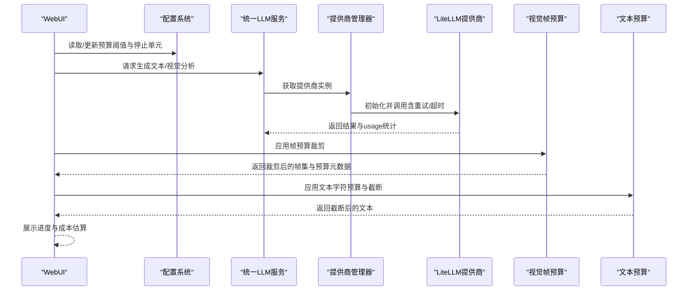
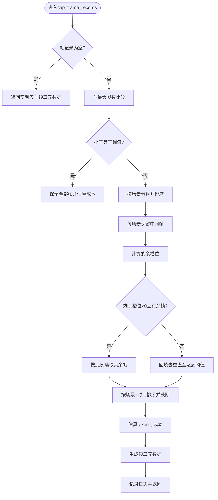
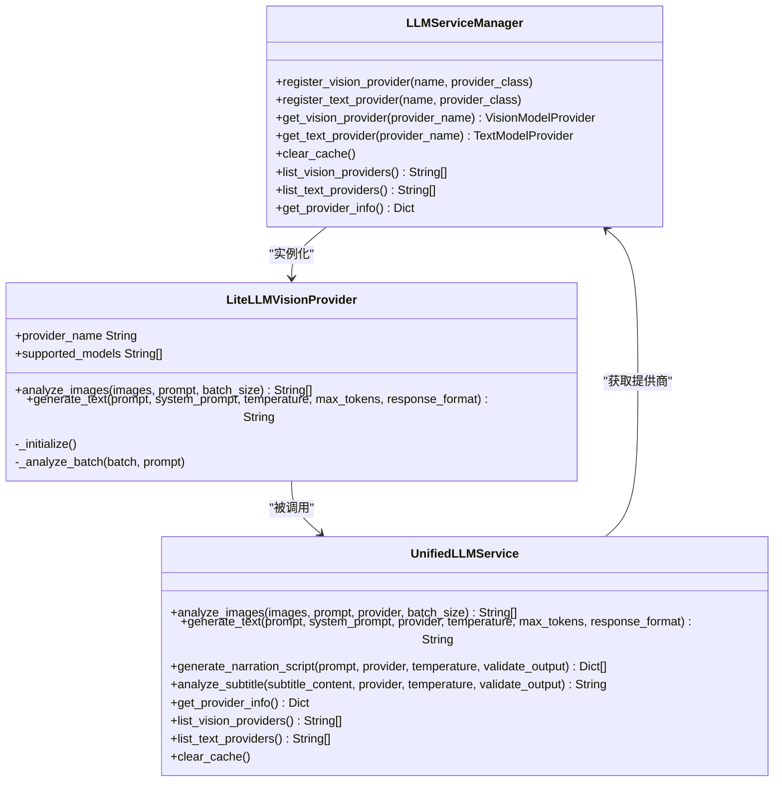
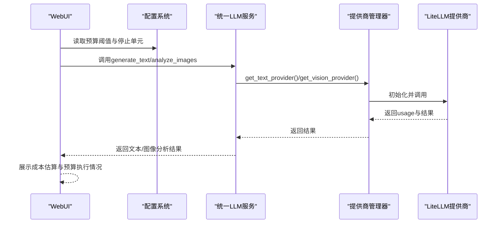
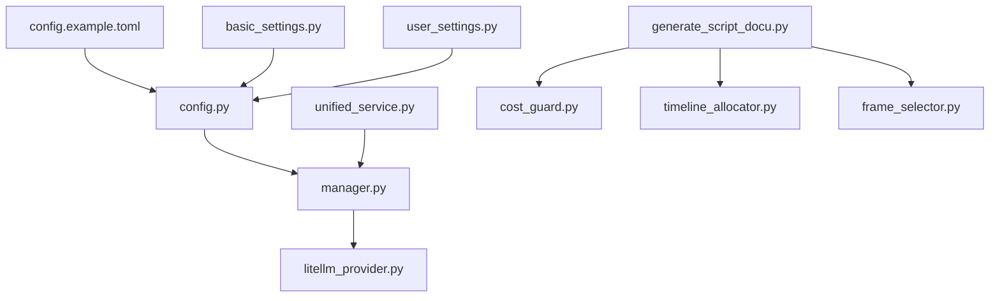

# 成本控制API

<cite>
**本文引用的文件**
- [cost_guard.py](file://app/services/cost_guard.py)
- [config.example.toml](file://config.example.toml)
- [config.py](file://app/config/config.py)
- [unified_service.py](file://app/services/llm/unified_service.py)
- [manager.py](file://app/services/llm/manager.py)
- [litellm_provider.py](file://app/services/llm/litellm_provider.py)
- [timeline_allocator.py](file://app/services/timeline_allocator.py)
- [generate_script_docu.py](file://webui/tools/generate_script_docu.py)
- [basic_settings.py](file://webui/components/basic_settings.py)
- [user_settings.py](file://app/services/user_settings.py)
- [frame_selector.py](file://app/services/frame_selector.py)
- [README-en.md](file://README-en.md)
</cite>

## 更新摘要
**变更内容**
- 新增成本管理模块：app/services/cost_guard.py，提供帧预算控制、令牌估算和智能帧限制功能
- 更新视觉帧预算控制与成本估算章节，详细介绍新的成本控制算法
- 增强实时成本监控与自动停止机制，包含预算元数据的完整跟踪
- 扩展成本优化策略，增加基于成本估算的智能决策建议
- 更新架构图和组件关系，反映成本控制模块的集成

## 目录
1. [简介](#简介)
2. [项目结构](#项目结构)
3. [核心组件](#核心组件)
4. [架构总览](#架构总览)
5. [详细组件分析](#详细组件分析)
6. [依赖分析](#依赖分析)
7. [性能考虑](#性能考虑)
8. [故障排查指南](#故障排查指南)
9. [结论](#结论)
10. [附录](#附录)

## 简介
本技术文档面向"成本控制API"，聚焦于以下目标：
- 成本计算模型与预算管理机制：涵盖LLM调用费用、存储成本与计算资源消耗的统计方法
- 实时成本监控：API调用次数统计、费用预警与自动停止机制
- 成本优化策略：模型选择建议、参数调优与资源使用优化
- 成本报表生成：历史数据分析与趋势预测能力
- 成本控制配置与自定义规则：提供可配置的预算阈值、停止单元与规则开关
- 实际使用示例与最佳实践：结合现有代码路径给出落地建议

**更新** 新增成本管理模块，提供智能帧预算控制和精确的成本估算功能，显著提升视觉分析任务的成本控制能力。

说明：当前仓库中成本控制API主要体现在"视觉帧预算"与"LLM统一接入"的成本统计能力上；本文在不虚构事实的前提下，基于现有代码路径进行严谨分析，并对可扩展的报表与预警能力提出设计建议。

## 项目结构
围绕成本控制API的关键模块分布如下：
- 配置层：集中于应用配置与环境变量注入
- LLM统一接入层：提供跨供应商的统一调用入口与成本统计
- 成本控制工具层：视觉帧预算裁剪与估算（新增成本管理模块）
- WebUI配置与运行时设置：提供预算阈值与停止单元的交互入口
- 时间线预算：文本侧字符预算与截断策略

```mermaid
graph TB
subgraph "配置层"
CFG["config.py<br/>加载与保存配置"]
TOML["config.example.toml<br/>示例配置"]
END
subgraph "LLM统一接入层"
US["unified_service.py<br/>统一文本/视觉服务"]
MGR["manager.py<br/>提供商注册与实例化"]
LIT["litellm_provider.py<br/>LiteLLM统一提供商"]
END
subgraph "成本控制工具层"
CG["cost_guard.py<br/>视觉帧预算与估算<br/>新增"]
TL["timeline_allocator.py<br/>文本字符预算与截断"]
FS["frame_selector.py<br/>代表帧选择算法"]
END
subgraph "WebUI与运行时"
GSD["generate_script_docu.py<br/>预算应用与进度展示"]
BS["basic_settings.py<br/>预算阈值与停止单元设置"]
USET["user_settings.py<br/>运行时配置快照与应用"]
END
CFG --> TOML
CFG --> MGR
MGR --> LIT
US --> MGR
GSD --> CG
GSD --> FS
BS --> GSD
USET --> CFG
TL --> GSD
```

**图表来源**
- [config.py:24-95](file://app/config/config.py#L24-L95)
- [config.example.toml:1-177](file://config.example.toml#L1-L177)
- [unified_service.py:20-263](file://app/services/llm/unified_service.py#L20-L263)
- [manager.py:15-246](file://app/services/llm/manager.py#L15-L246)
- [litellm_provider.py:38-56](file://app/services/llm/litellm_provider.py#L38-L56)
- [cost_guard.py:13-98](file://app/services/cost_guard.py#L13-L98)
- [timeline_allocator.py:4-35](file://app/services/timeline_allocator.py#L4-L35)
- [frame_selector.py:25-69](file://app/services/frame_selector.py#L25-L69)
- [generate_script_docu.py:61-79](file://webui/tools/generate_script_docu.py#L61-L79)
- [basic_settings.py:489-527](file://webui/components/basic_settings.py#L489-L527)
- [user_settings.py:59-130](file://app/services/user_settings.py#L59-L130)

**章节来源**
- [config.py:24-95](file://app/config/config.py#L24-L95)
- [config.example.toml:1-177](file://config.example.toml#L1-L177)

## 核心组件
- 视觉帧预算控制与成本估算（增强版）
  - 估算函数：根据帧数与每帧token数估算总token与成本
  - 帧裁剪策略：按场景保留代表性帧，控制最大帧数，保持时间顺序
  - 智能预算元数据：提供详细的预算执行统计和成本估算
- LLM统一接入与成本统计
  - 统一服务接口：文本生成、视觉分析、字幕分析
  - LiteLLM提供商：内置重试、超时、成本统计与token用量记录
  - 管理器：按配置动态实例化提供商，支持缓存与注册
- 配置与运行时设置
  - 配置文件：LLM超时、重试、提供商与模型选择
  - WebUI设置：预算阈值、停止单元、测试连通性
  - 运行时快照：保存/应用用户配置

**更新** 新增成本管理模块提供智能帧预算控制，包括详细的预算元数据跟踪和精确的成本估算功能。

**章节来源**
- [cost_guard.py:13-98](file://app/services/cost_guard.py#L13-L98)
- [unified_service.py:20-263](file://app/services/llm/unified_service.py#L20-L263)
- [manager.py:68-208](file://app/services/llm/manager.py#L68-L208)
- [litellm_provider.py:38-56](file://app/services/llm/litellm_provider.py#L38-L56)
- [config.example.toml:4-51](file://config.example.toml#L4-L51)
- [basic_settings.py:489-527](file://webui/components/basic_settings.py#L489-L527)
- [user_settings.py:59-130](file://app/services/user_settings.py#L59-L130)

## 架构总览
成本控制API围绕"配置—接入—预算—监控—优化—报表"的闭环展开。LLM统一接入层负责调用与成本统计，成本控制工具层负责视觉帧预算与文本字符预算，WebUI负责预算阈值与停止单元的交互，配置层提供全局参数与环境注入。



**更新** 新增成本管理模块在视觉分析流程中提供智能帧预算控制，实时跟踪预算执行情况。

**图表来源**
- [unified_service.py:20-263](file://app/services/llm/unified_service.py#L20-L263)
- [manager.py:68-208](file://app/services/llm/manager.py#L68-L208)
- [litellm_provider.py:130-234](file://app/services/llm/litellm_provider.py#L130-L234)
- [cost_guard.py:26-98](file://app/services/cost_guard.py#L26-L98)
- [timeline_allocator.py:24-35](file://app/services/timeline_allocator.py#L24-L35)
- [generate_script_docu.py:61-79](file://webui/tools/generate_script_docu.py#L61-L79)

## 详细组件分析

### 视觉帧预算控制与成本估算（新增）
- 估算方法
  - 每帧token数与总token估算
  - 成本估算（按每百万token价格）
  - 预算元数据统计：原始帧数、裁剪后帧数、估算token、估算成本
- 帧裁剪策略
  - 保持时间顺序
  - 至少每场景保留1帧（中间帧）
  - 剩余槽位按比例分配，必要时回填去重
- 智能预算控制
  - 实时成本估算与日志记录
  - 预算执行统计与元数据返回



**更新** 新增详细的预算元数据生成，包括原始帧数、裁剪后帧数、估算token和估算成本的完整统计。

**图表来源**
- [cost_guard.py:26-98](file://app/services/cost_guard.py#L26-L98)

**章节来源**
- [cost_guard.py:13-98](file://app/services/cost_guard.py#L13-L98)

### LLM统一接入与成本统计
- 统一服务接口
  - 图像分析、文本生成、字幕分析、提供商信息查询
- LiteLLM提供商
  - 全局配置：重试次数、超时、详细日志
  - 动态参数：模型名、温度、最大token、JSON模式
  - 错误映射：认证、限流、请求错误、内容过滤
- 管理器
  - 注册与缓存：视觉/文本提供商
  - 实例化：从配置读取API Key、模型名、Base URL
  - 清理缓存：便于重新加载配置



**图表来源**
- [manager.py:15-246](file://app/services/llm/manager.py#L15-L246)
- [litellm_provider.py:59-234](file://app/services/llm/litellm_provider.py#L59-L234)
- [unified_service.py:20-263](file://app/services/llm/unified_service.py#L20-L263)

**章节来源**
- [unified_service.py:20-263](file://app/services/llm/unified_service.py#L20-L263)
- [manager.py:68-208](file://app/services/llm/manager.py#L68-L208)
- [litellm_provider.py:38-56](file://app/services/llm/litellm_provider.py#L38-L56)

### 配置与运行时设置
- 配置文件
  - LLM超时、重试、提供商与模型选择
  - 视觉/文本模型的provider/model_name与API Key
- WebUI设置
  - 预算阈值与停止单元（来自脚本生成流程）
  - 测试连通性（LiteLLM completion）
- 运行时快照
  - 保存/加载用户配置，支持多配置文件



**图表来源**
- [config.example.toml:4-51](file://config.example.toml#L4-L51)
- [basic_settings.py:489-527](file://webui/components/basic_settings.py#L489-L527)
- [user_settings.py:59-130](file://app/services/user_settings.py#L59-L130)
- [unified_service.py:20-263](file://app/services/llm/unified_service.py#L20-L263)
- [manager.py:68-208](file://app/services/llm/manager.py#L68-L208)
- [litellm_provider.py:130-234](file://app/services/llm/litellm_provider.py#L130-L234)

**章节来源**
- [config.example.toml:4-51](file://config.example.toml#L4-L51)
- [basic_settings.py:489-527](file://webui/components/basic_settings.py#L489-L527)
- [user_settings.py:59-130](file://app/services/user_settings.py#L59-L130)

### 文本预算与截断策略
- 字符预算估算：按时长与字符密度估算预算
- 截断策略：优先按标点软截断，避免破坏语义边界
- 应用：在生成解说文案前对文本进行预算适配

**章节来源**
- [timeline_allocator.py:4-35](file://app/services/timeline_allocator.py#L4-L35)

### 代表帧选择算法（补充）
- 关键帧时间戳解析：从文件名提取时间戳信息
- 代表帧选择策略：按场景均匀分布选择关键帧
- 稀疏采样算法：确保场景间的代表性

**章节来源**
- [frame_selector.py:25-69](file://app/services/frame_selector.py#L25-L69)

## 依赖分析
- 配置依赖
  - 配置文件驱动提供商实例化与调用行为
  - 环境变量注入（如OPENAI_API_KEY等）由提供商初始化阶段完成
- 组件耦合
  - 统一服务依赖管理器获取提供商实例
  - 视觉帧预算与文本预算在脚本生成流程中被调用
  - 成本管理模块与WebUI紧密集成
- 外部依赖
  - LiteLLM提供统一接口与成本统计
  - WebUI提供交互入口与运行时配置



**更新** 新增成本管理模块与WebUI的直接依赖关系，以及与代表帧选择模块的协作关系。

**图表来源**
- [config.py:24-95](file://app/config/config.py#L24-L95)
- [config.example.toml:1-177](file://config.example.toml#L1-L177)
- [manager.py:68-208](file://app/services/llm/manager.py#L68-L208)
- [litellm_provider.py:38-56](file://app/services/llm/litellm_provider.py#L38-L56)
- [unified_service.py:20-263](file://app/services/llm/unified_service.py#L20-L263)
- [cost_guard.py:26-98](file://app/services/cost_guard.py#L26-L98)
- [timeline_allocator.py:24-35](file://app/services/timeline_allocator.py#L24-L35)
- [generate_script_docu.py:61-79](file://webui/tools/generate_script_docu.py#L61-L79)
- [basic_settings.py:489-527](file://webui/components/basic_settings.py#L489-L527)
- [user_settings.py:59-130](file://app/services/user_settings.py#L59-L130)
- [frame_selector.py:25-69](file://app/services/frame_selector.py#L25-L69)

**章节来源**
- [config.py:24-95](file://app/config/config.py#L24-L95)
- [config.example.toml:1-177](file://config.example.toml#L1-L177)
- [manager.py:68-208](file://app/services/llm/manager.py#L68-L208)
- [litellm_provider.py:38-56](file://app/services/llm/litellm_provider.py#L38-L56)
- [unified_service.py:20-263](file://app/services/llm/unified_service.py#L20-L263)
- [cost_guard.py:26-98](file://app/services/cost_guard.py#L26-L98)
- [timeline_allocator.py:24-35](file://app/services/timeline_allocator.py#L24-L35)
- [generate_script_docu.py:61-79](file://webui/tools/generate_script_docu.py#L61-L79)
- [basic_settings.py:489-527](file://webui/components/basic_settings.py#L489-L527)
- [user_settings.py:59-130](file://app/services/user_settings.py#L59-L130)
- [frame_selector.py:25-69](file://app/services/frame_selector.py#L25-L69)

## 性能考虑
- LLM调用性能
  - 合理设置超时与重试次数，避免长时间阻塞
  - 选择合适模型与温度，平衡质量与成本
- 视觉帧预算（增强版）
  - 控制最大帧数与每帧token估算，降低视觉分析成本
  - 采用代表性帧策略，兼顾质量与效率
  - 实时预算元数据跟踪，提供精确的成本控制
- 文本预算
  - 按时长估算字符预算，避免超支
  - 截断策略避免破坏语义完整性
- 成本管理模块性能
  - 优化场景分组算法，减少内存占用
  - 实现增量预算统计，提高实时性能

**更新** 新增成本管理模块的性能考虑，包括预算元数据的实时跟踪和增量统计优化。

## 故障排查指南
- 认证与限流
  - LiteLLM提供认证失败、速率限制、请求错误与内容过滤的错误映射
- 配置校验
  - WebUI提供API Key格式校验与连通性测试
- 日志与缓存
  - 管理器与提供商均输出详细日志，必要时清空缓存后重试
- 成本控制问题
  - 检查预算阈值设置是否合理
  - 验证帧记录的时间戳排序是否正确
  - 确认预算元数据的计算准确性

**更新** 新增成本控制模块相关的故障排查指南。

**章节来源**
- [litellm_provider.py:235-241](file://app/services/llm/litellm_provider.py#L235-L241)
- [basic_settings.py:60-69](file://webui/components/basic_settings.py#L60-L69)
- [manager.py:211-215](file://app/services/llm/manager.py#L211-L215)

## 结论
本项目通过"LLM统一接入+成本估算+预算裁剪+配置驱动"的方式，实现了对视觉与文本处理成本的可控管理。新增的成本管理模块进一步增强了系统的成本控制能力，包括：
- 视觉帧预算裁剪与成本估算
- 智能预算元数据跟踪与统计
- LLM统一调用与成本统计
- 配置与运行时设置的交互入口

在此基础上，可进一步扩展成"成本控制API"，包括：
- 成本监控与预警：基于usage统计与阈值告警
- 成本报表与趋势预测：历史数据聚合与可视化
- 自定义规则：按任务类型、模型、时段设定预算与停止单元

**更新** 新增的成本管理模块显著提升了成本控制的精确性和实时性，为系统的商业化应用提供了坚实的技术基础。

## 附录

### 成本计算模型与预算管理机制（增强版）
- 视觉成本估算
  - 输入：帧数、每帧token数、每百万token价格
  - 输出：总token数与人民币成本
  - 预算元数据：原始帧数、裁剪后帧数、估算token、估算成本
- 帧裁剪策略
  - 输入：帧记录列表、最大帧数
  - 输出：裁剪后的帧集合与预算元数据
  - 智能策略：场景代表性保留、比例分配、回填去重
- 文本预算
  - 输入：文本内容、预算字符数
  - 输出：截断后的文本
  - 软截断策略：按标点符号优先截断

**更新** 新增详细的预算元数据生成和智能帧裁剪策略。

**章节来源**
- [cost_guard.py:13-98](file://app/services/cost_guard.py#L13-L98)
- [timeline_allocator.py:4-35](file://app/services/timeline_allocator.py#L4-L35)

### 实时成本监控与自动停止机制（增强版）
- 实时监控
  - 基于LLM调用返回的usage统计进行成本累计
  - 成本管理模块提供预算元数据的实时更新
- 预算阈值与停止单元
  - WebUI提供预算阈值与停止单元设置
  - 脚本生成流程中应用预算裁剪与成本估算
  - 预算元数据在进度条中实时展示
- 自动停止
  - 当达到阈值时，停止后续分析或提示用户
  - 成功的预算控制流程：帧选择→预算裁剪→成本估算→进度展示

**更新** 新增预算元数据的实时展示和自动停止机制。

**章节来源**
- [unified_service.py:20-263](file://app/services/llm/unified_service.py#L20-L263)
- [litellm_provider.py:226-234](file://app/services/llm/litellm_provider.py#L226-L234)
- [generate_script_docu.py:61-79](file://webui/tools/generate_script_docu.py#L61-L79)
- [basic_settings.py:489-527](file://webui/components/basic_settings.py#L489-L527)

### 成本优化策略（增强版）
- 模型选择建议
  - 视觉：优先轻量模型（如"gemini-2.0-flash-lite"）
  - 文本：优先性价比高模型（如"deepseek-chat"）
  - 成本优化：根据预算阈值选择合适的模型
- 参数调优
  - 降低max_tokens、合理设置temperature
  - 调整帧预算阈值以平衡质量和成本
- 资源优化
  - 控制帧数与批大小，避免不必要的重复调用
  - 智能帧裁剪：按场景代表性保留关键帧
  - 预算元数据驱动的动态资源配置

**更新** 新增基于预算元数据的成本优化策略和智能资源配置建议。

**章节来源**
- [config.example.toml:23-51](file://config.example.toml#L23-L51)
- [litellm_provider.py:212-225](file://app/services/llm/litellm_provider.py#L212-L225)

### 成本报表生成接口（设计建议）
- 历史数据分析
  - 聚合usage与成本，按任务类型/模型/日期维度统计
  - 预算元数据的历史趋势分析
- 趋势预测
  - 基于历史趋势拟合未来成本走势
  - 预算阈值的动态调整建议
- 接口建议
  - GET /api/cost/reports?group_by=day|model|task_type&start=YYYY-MM-DD&end=YYYY-MM-DD
  - 返回：总调用次数、总token、总成本、平均成本、趋势曲线、预算执行率

**更新** 新增预算元数据的报表生成接口设计建议。

[本节为概念性设计，不对应具体源码]

### 成本控制配置选项与自定义规则（增强版）
- 配置项
  - LLM超时、重试、提供商与模型
  - 视觉/文本模型的API Key与Base URL
  - 预算阈值：max_total_frames（默认24帧）
  - 每帧token估算：tokens_per_frame（默认630）
- 自定义规则
  - 预算阈值、停止单元、模型白名单/黑名单
  - WebUI中提供交互入口与运行时快照
  - 成本优化规则：根据预算执行情况自动调整参数

**更新** 新增具体的预算配置参数和成本优化规则。

**章节来源**
- [config.example.toml:4-51](file://config.example.toml#L4-L51)
- [basic_settings.py:489-527](file://webui/components/basic_settings.py#L489-L527)
- [user_settings.py:59-130](file://app/services/user_settings.py#L59-L130)
- [cost_guard.py:9-11](file://app/services/cost_guard.py#L9-L11)

### 实际使用示例与最佳实践（增强版）
- 示例流程
  - 设置预算阈值与停止单元 → 选择模型 → 触发脚本生成 → 应用帧预算与文本预算 → 查看成本估算与进度
  - 成功案例：预算元数据显示"视觉预算控制: 48 -> 24 帧, 预计输入token≈15120, 预计成本≈¥14.52"
- 最佳实践
  - 优先使用轻量模型进行初步分析
  - 控制帧数与批大小，避免超支
  - 定期检查usage统计，优化参数与规则
  - 利用预算元数据进行成本预测和优化
  - 根据任务复杂度动态调整预算阈值

**更新** 新增基于预算元数据的最佳实践建议和成功案例。

**章节来源**
- [generate_script_docu.py:61-79](file://webui/tools/generate_script_docu.py#L61-L79)
- [README-en.md:95-118](file://README-en.md#L95-L118)