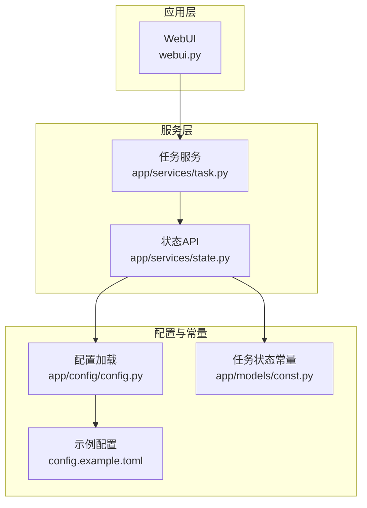
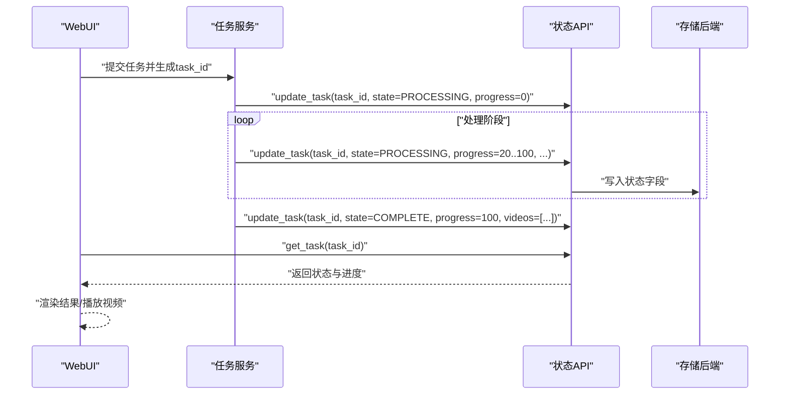
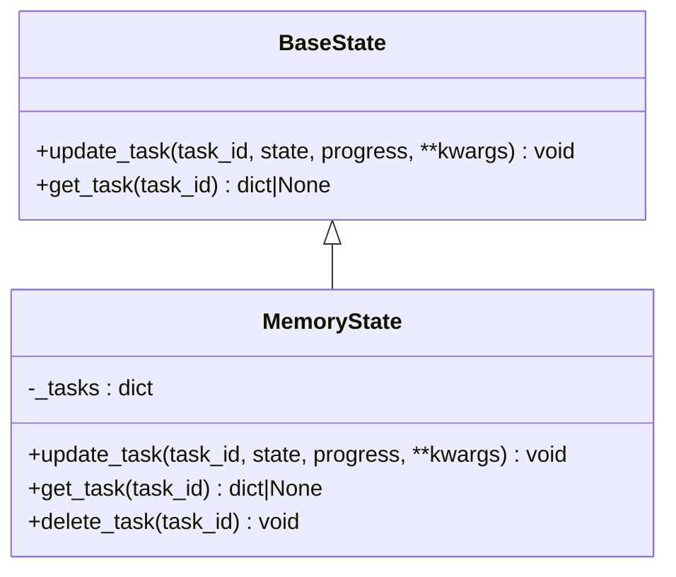
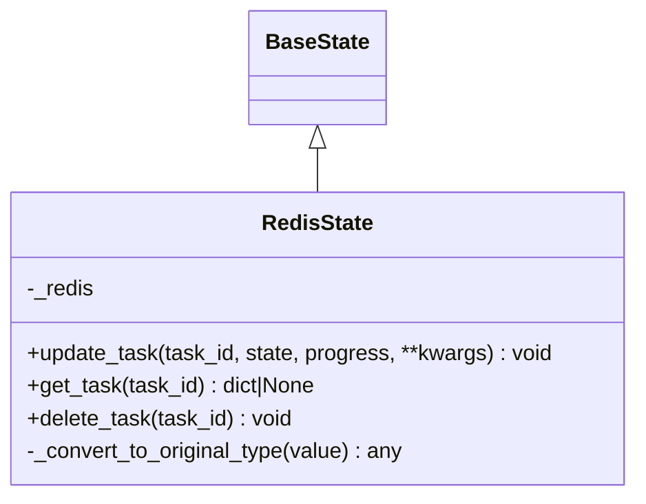
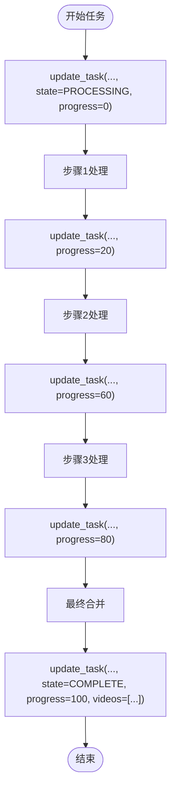
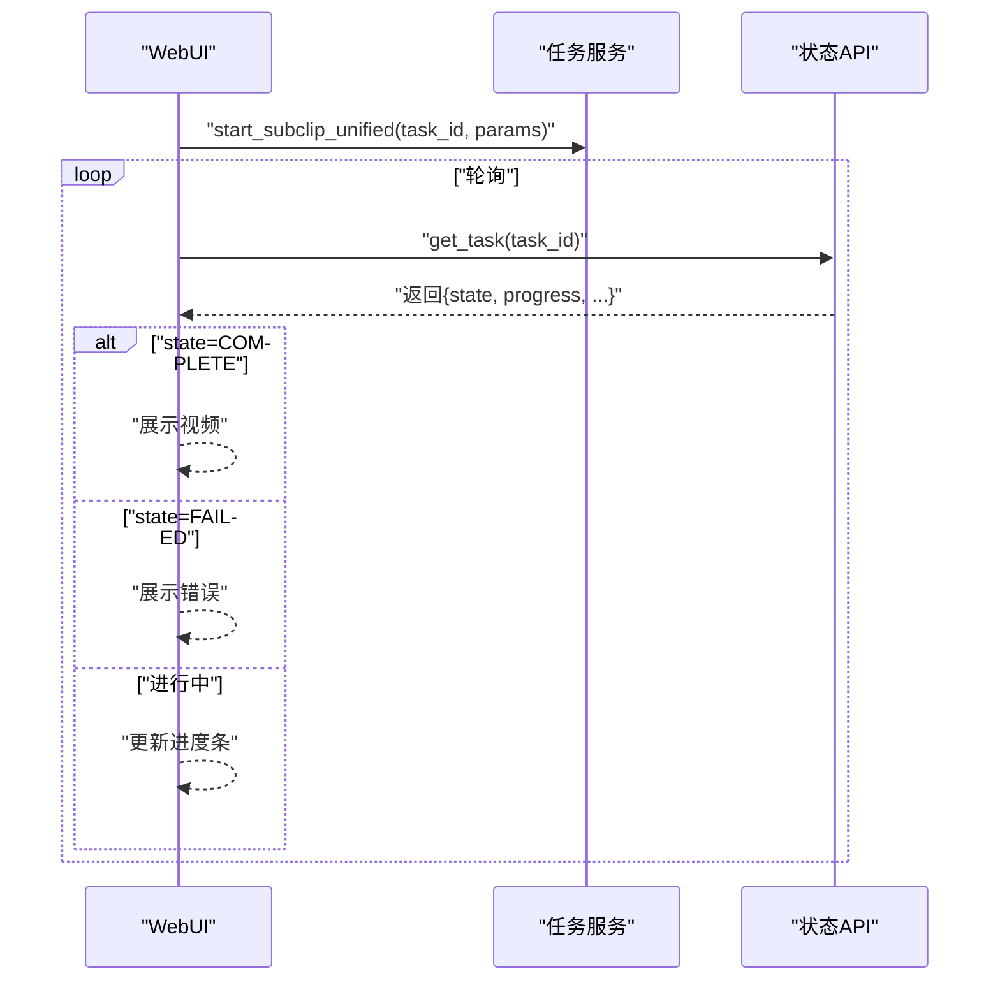
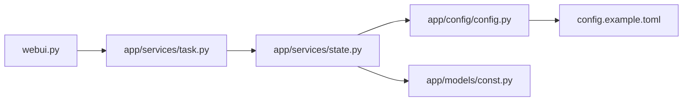

# 状态管理API

<cite>
**本文引用的文件**
- [app/services/state.py](file://app/services/state.py)
- [app/services/task.py](file://app/services/task.py)
- [app/models/const.py](file://app/models/const.py)
- [app/config/config.py](file://app/config/config.py)
- [config.example.toml](file://config.example.toml)
- [webui.py](file://webui.py)
</cite>

## 目录
1. [简介](#简介)
2. [项目结构](#项目结构)
3. [核心组件](#核心组件)
4. [架构总览](#架构总览)
5. [详细组件分析](#详细组件分析)
6. [依赖关系分析](#依赖关系分析)
7. [性能考量](#性能考量)
8. [故障排查指南](#故障排查指南)
9. [结论](#结论)
10. [附录](#附录)

## 简介
本文件系统性阐述状态管理API的设计与实现，覆盖抽象基类BaseState的接口规范、MemoryState内存态与RedisState分布式态的实现原理、配置与序列化机制、典型使用流程与最佳实践，并提供端到端的调用示例与排障建议。目标读者既包括需要快速集成的开发者，也包括希望深入理解内部机制的架构师。

## 项目结构
状态管理相关的核心代码位于服务层，通过统一的state接口对外暴露，业务流程在任务服务中驱动状态更新，WebUI通过轮询方式展示进度与结果。

图示来源
- [app/services/state.py:1-123](file://app/services/state.py#L1-L123)
- [app/services/task.py:195-247](file://app/services/task.py#L195-L247)
- [app/config/config.py:24-44](file://app/config/config.py#L24-L44)
- [app/models/const.py:20-23](file://app/models/const.py#L20-L23)
- [config.example.toml:1-177](file://config.example.toml#L1-L177)

章节来源
- [app/services/state.py:1-123](file://app/services/state.py#L1-L123)
- [app/services/task.py:195-247](file://app/services/task.py#L195-L247)
- [app/config/config.py:24-44](file://app/config/config.py#L24-L44)
- [app/models/const.py:20-23](file://app/models/const.py#L20-L23)
- [config.example.toml:1-177](file://config.example.toml#L1-L177)

## 核心组件
- 抽象基类BaseState：定义统一的状态更新与查询接口，约束实现类必须提供update_task与get_task方法。
- MemoryState：基于内存字典的任务状态存储，适合单机或开发环境。
- RedisState：基于Redis Hash的任务状态存储，适合多进程/多实例部署，具备持久化与共享能力。
- 全局state：根据配置动态选择MemoryState或RedisState实例，保证上层调用无差异。

章节来源
- [app/services/state.py:8-15](file://app/services/state.py#L8-L15)
- [app/services/state.py:19-46](file://app/services/state.py#L19-L46)
- [app/services/state.py:49-107](file://app/services/state.py#L49-L107)
- [app/services/state.py:110-122](file://app/services/state.py#L110-L122)

## 架构总览
状态管理采用“抽象接口 + 多实现 + 全局单例”的模式，业务流程在任务服务中推进，实时更新状态；WebUI通过轮询获取最新状态并展示。

图示来源
- [app/services/task.py:195-247](file://app/services/task.py#L195-L247)
- [app/services/state.py:23-38](file://app/services/state.py#L23-L38)
- [app/services/state.py:75-84](file://app/services/state.py#L75-L84)
- [webui.py:177-224](file://webui.py#L177-L224)

## 详细组件分析

### BaseState 抽象基类与接口规范
- update_task(task_id: str, state: int, progress: int = 0, **kwargs)
  - 参数
    - task_id: 任务唯一标识符
    - state: 任务状态枚举值（参考常量）
    - progress: 进度百分比（整数），默认0
    - **kwargs: 扩展字段（如最终产物路径、错误信息等）
  - 返回: 无（写入操作）
  - 使用场景: 任务生命周期内多次调用，用于推进进度与记录结果
- get_task(task_id: str)
  - 参数: task_id
  - 返回: 字典或None（包含state、progress及扩展字段）
  - 使用场景: UI轮询或后续处理阶段读取状态

章节来源
- [app/services/state.py:8-15](file://app/services/state.py#L8-L15)
- [app/models/const.py:20-23](file://app/models/const.py#L20-L23)

### MemoryState 内存状态管理
- 数据结构
  - 以task_id为键的字典，值为包含state、progress与kwargs的映射
- 状态更新机制
  - 将progress强制转换为整数并限制最大值为100
  - 将state、progress与kwargs合并写入内存字典
- 进度跟踪
  - 通过get_task读取当前状态，便于UI轮询展示
- 删除任务
  - 提供delete_task用于清理过期或失败任务

图示来源
- [app/services/state.py:8-15](file://app/services/state.py#L8-L15)
- [app/services/state.py:19-46](file://app/services/state.py#L19-L46)

章节来源
- [app/services/state.py:19-46](file://app/services/state.py#L19-L46)

### RedisState 分布式状态管理
- 连接参数
  - host、port、db、password：通过构造函数注入
  - 全局配置读取：enable_redis、redis_host、redis_port、redis_db、redis_password
- 数据存储
  - 使用Redis Hash存储每个task_id的字段（state、progress及kwargs）
  - 写入时将字段值转换为字符串
- 类型转换
  - 读取时对值进行解码与原类型还原（优先尝试字面量解析，其次整数，最后字符串）
- 删除任务
  - 提供delete_task删除对应Hash

图示来源
- [app/services/state.py:49-107](file://app/services/state.py#L49-L107)
- [app/config/config.py:24-44](file://app/config/config.py#L24-L44)
- [config.example.toml:1-177](file://config.example.toml#L1-L177)

章节来源
- [app/services/state.py:49-107](file://app/services/state.py#L49-L107)
- [app/config/config.py:24-44](file://app/config/config.py#L24-L44)
- [config.example.toml:1-177](file://config.example.toml#L1-L177)

### 全局状态实例与配置选择
- 全局state根据配置决定使用RedisState还是MemoryState
- 配置项
  - enable_redis: 是否启用Redis
  - redis_host/port/db/password: Redis连接参数

章节来源
- [app/services/state.py:110-122](file://app/services/state.py#L110-L122)
- [app/config/config.py:24-44](file://app/config/config.py#L24-L44)
- [config.example.toml:1-177](file://config.example.toml#L1-L177)

### 任务流程中的状态管理
- 任务开始：将state设为PROCESSING，progress置0
- 处理阶段：按步骤更新progress（如20、60、80），并可附加中间结果
- 完成：将state设为COMPLETE，progress置100，并附加最终产物（如videos）

图示来源
- [app/services/task.py:195-247](file://app/services/task.py#L195-L247)
- [app/models/const.py:20-23](file://app/models/const.py#L20-L23)

章节来源
- [app/services/task.py:195-247](file://app/services/task.py#L195-L247)
- [app/models/const.py:20-23](file://app/models/const.py#L20-L23)

### WebUI 中的状态查询与轮询
- 生成按钮触发任务执行，同时启动轮询
- 轮询周期：约0.5秒
- 依据state与progress更新UI进度条与状态文本
- 成功：展示视频播放
- 失败：展示错误信息

图示来源
- [webui.py:177-224](file://webui.py#L177-L224)
- [app/services/task.py:195-247](file://app/services/task.py#L195-L247)
- [app/models/const.py:20-23](file://app/models/const.py#L20-L23)

章节来源
- [webui.py:177-224](file://webui.py#L177-L224)

## 依赖关系分析
- 低耦合：上层仅依赖BaseState接口，不关心具体实现
- 配置驱动：通过配置文件控制后端存储类型与Redis连接参数
- 常量统一：状态枚举集中于const模块，避免魔法值

图示来源
- [app/services/state.py:1-123](file://app/services/state.py#L1-L123)
- [app/services/task.py:195-247](file://app/services/task.py#L195-L247)
- [app/config/config.py:24-44](file://app/config/config.py#L24-L44)
- [app/models/const.py:20-23](file://app/models/const.py#L20-L23)
- [config.example.toml:1-177](file://config.example.toml#L1-L177)

章节来源
- [app/services/state.py:1-123](file://app/services/state.py#L1-L123)
- [app/services/task.py:195-247](file://app/services/task.py#L195-L247)
- [app/config/config.py:24-44](file://app/config/config.py#L24-L44)
- [app/models/const.py:20-23](file://app/models/const.py#L20-L23)
- [config.example.toml:1-177](file://config.example.toml#L1-L177)

## 性能考量
- 写入频率
  - 建议按阶段更新progress，避免过于频繁的写入导致Redis压力
- Redis优化
  - 合理设置过期时间（可在上层封装中增加TTL）
  - 对大字段（如长文本）考虑压缩或外部存储引用
- 内存态适用性
  - MemoryState适合单实例或开发环境；生产建议使用RedisState
- 类型转换开销
  - get_task时的类型还原为O(n)，n为字段数；字段数量应保持合理

## 故障排查指南
- 无法连接Redis
  - 检查enable_redis与redis_host/port/db/password配置
  - 确认Redis服务可达且认证正确
- 状态未更新
  - 确认任务流程中确实调用了update_task
  - 检查progress边界（>100会被截断为100）
- 类型还原异常
  - Redis读取时对非列表/整数字符串回退为字符串；确认写入时是否为期望类型
- WebUI不显示进度
  - 确认轮询逻辑正常，get_task返回的state与progress存在
  - 检查任务异常分支是否写入了state=FAILED与message

章节来源
- [app/services/state.py:110-122](file://app/services/state.py#L110-L122)
- [app/services/state.py:75-84](file://app/services/state.py#L75-L84)
- [app/services/state.py:90-106](file://app/services/state.py#L90-L106)
- [webui.py:177-224](file://webui.py#L177-L224)

## 结论
该状态管理API通过清晰的抽象接口与灵活的实现选择，实现了从内存到Redis的平滑过渡；配合任务服务与WebUI的轮询机制，提供了可靠的进度跟踪与结果展示。生产环境建议使用RedisState并结合合理的字段设计与轮询策略，以获得更好的稳定性与可观测性。

## 附录

### API使用示例（步骤说明）
- 任务状态查询
  - 步骤
    - 调用get_task(task_id)获取状态字典
    - 读取state与progress字段，必要时读取扩展字段（如videos、message）
- 进度更新
  - 步骤
    - 在任务各阶段调用update_task(task_id, state=PROCESSING, progress=阶段值)
    - 任务完成后调用update_task(task_id, state=COMPLETE, progress=100, videos=[...])
- 错误处理
  - 步骤
    - 任务异常时调用update_task(task_id, state=FAILED, message=错误描述)
    - WebUI侧监听state=FAILED并展示错误

章节来源
- [app/services/state.py:10-15](file://app/services/state.py#L10-L15)
- [app/services/state.py:23-38](file://app/services/state.py#L23-L38)
- [app/services/task.py:195-247](file://app/services/task.py#L195-L247)
- [webui.py:177-224](file://webui.py#L177-L224)

### 配置项一览（Redis相关）
- enable_redis: 是否启用Redis作为状态后端
- redis_host: Redis主机地址
- redis_port: Redis端口
- redis_db: Redis数据库编号
- redis_password: Redis密码

章节来源
- [app/services/state.py:110-114](file://app/services/state.py#L110-L114)
- [config.example.toml:1-177](file://config.example.toml#L1-L177)