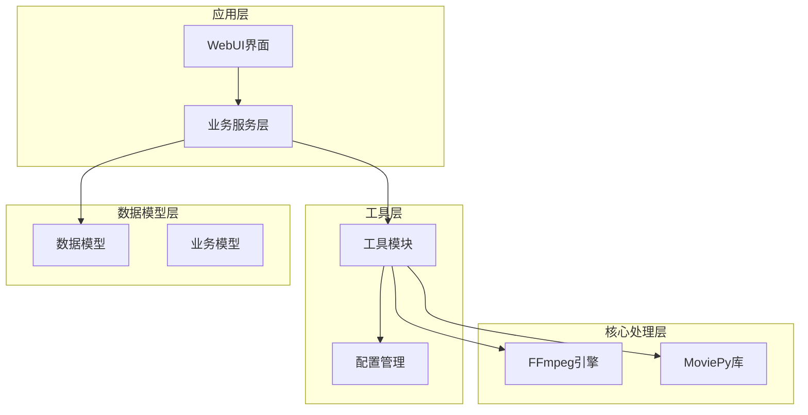
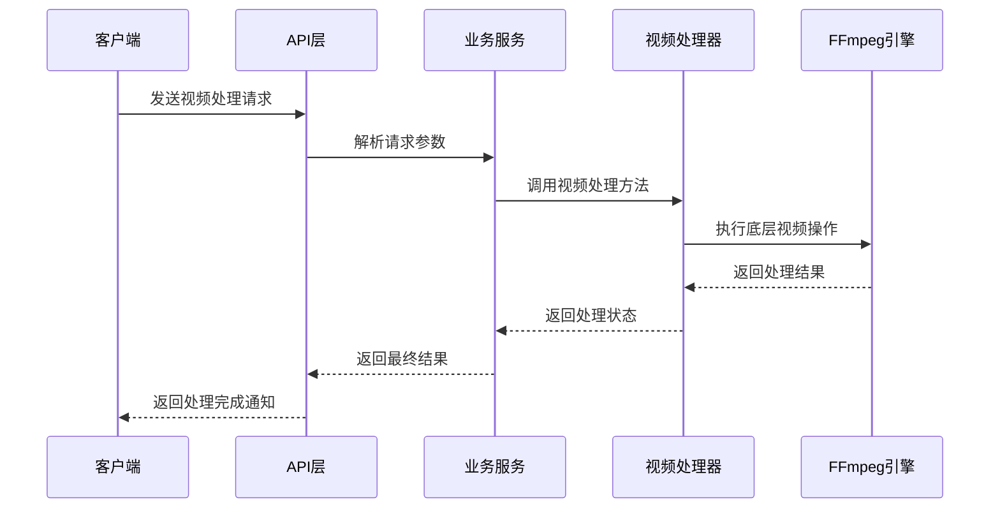
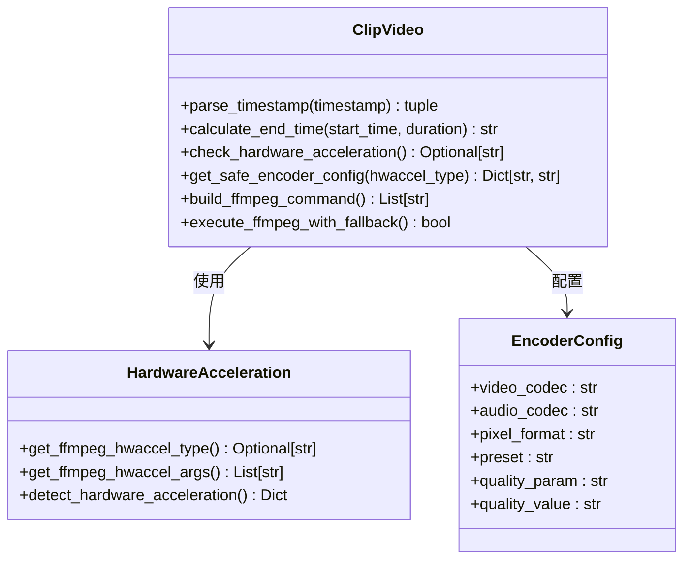
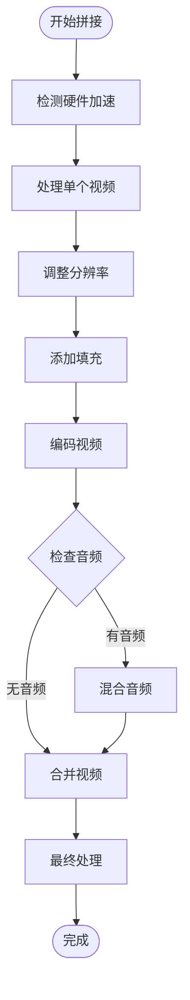
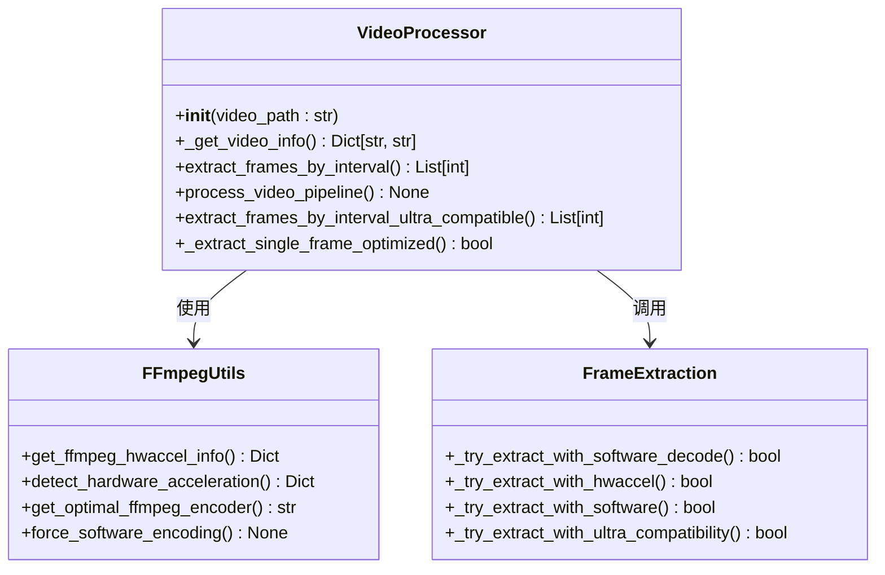
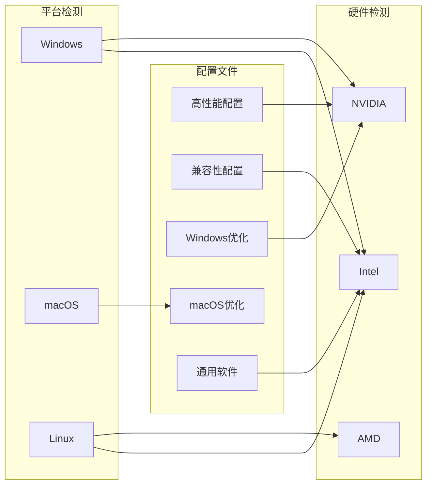
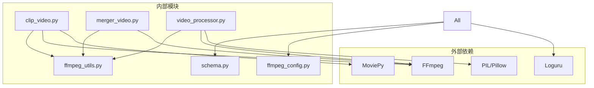

# 视频处理API

<cite>
**本文档引用的文件**
- [app/services/clip_video.py](file://app/services/clip_video.py)
- [app/services/merger_video.py](file://app/services/merger_video.py)
- [app/services/video.py](file://app/services/video.py)
- [app/utils/video_processor.py](file://app/utils/video_processor.py)
- [app/utils/ffmpeg_utils.py](file://app/utils/ffmpeg_utils.py)
- [app/models/schema.py](file://app/models/schema.py)
- [app/services/media_duration.py](file://app/services/media_duration.py)
- [app/services/frame_selector.py](file://app/services/frame_selector.py)
- [app/config/ffmpeg_config.py](file://app/config/ffmpeg_config.py)
- [webui/components/ffmpeg_diagnostics.py](file://webui/components/ffmpeg_diagnostics.py)
- [app/services/generate_video.py](file://app/services/generate_video.py)
</cite>

## 目录
1. [简介](#简介)
2. [项目结构](#项目结构)
3. [核心组件](#核心组件)
4. [架构概览](#架构概览)
5. [详细组件分析](#详细组件分析)
6. [依赖关系分析](#依赖关系分析)
7. [性能考虑](#性能考虑)
8. [故障排除指南](#故障排除指南)
9. [结论](#结论)
10. [附录](#附录)

## 简介

NarratoAI 是一个基于 Python 的专业视频处理 API 系统，专注于短视频内容创作和视频编辑。该系统提供了完整的视频处理能力，包括视频剪辑、拼接、格式转换、元数据管理、字幕处理和音频合成等功能。

系统采用模块化设计，主要基于 FFmpeg 进行底层视频处理，结合 Python 的 MoviePy 库进行高级视频编辑操作。项目支持多平台部署，包括 Windows、macOS 和 Linux 系统，并针对不同硬件平台提供了优化的硬件加速方案。

## 项目结构

项目采用清晰的分层架构，主要分为以下几个层次：



**图表来源**
- [app/services/clip_video.py:1-800](file://app/services/clip_video.py#L1-L800)
- [app/utils/ffmpeg_utils.py:1-800](file://app/utils/ffmpeg_utils.py#L1-L800)

**章节来源**
- [app/services/clip_video.py:1-800](file://app/services/clip_video.py#L1-L800)
- [app/utils/ffmpeg_utils.py:1-800](file://app/utils/ffmpeg_utils.py#L1-L800)

## 核心组件

### 视频剪辑接口

视频剪辑功能提供了精确的时间轴定位和高质量的视频裁剪能力：

- **时间轴定位**: 支持毫秒级精度的时间戳处理
- **多格式支持**: 自动识别和处理各种视频格式
- **质量保持**: 通过硬件加速和智能编码器选择确保输出质量
- **错误处理**: 完善的降级机制和回退策略

### 视频拼接API

视频拼接功能支持多片段合并和音频混合：

- **多片段合并**: 支持任意数量视频片段的无缝拼接
- **音频混合**: 智能音频轨道混合和音量平衡
- **格式统一**: 自动调整分辨率和帧率以保持一致性
- **过渡效果**: 内置过渡效果和转场处理

### 视频格式转换接口

格式转换功能提供了灵活的编码器选择和参数配置：

- **编码器选择**: 自动检测和选择最优编码器
- **分辨率调整**: 智能分辨率转换和缩放
- **压缩参数**: 可配置的质量和压缩参数
- **像素格式**: 支持多种像素格式转换

### 元数据管理API

元数据管理提供了全面的视频信息检测和处理：

- **时长获取**: 精确的媒体时长检测
- **帧率检测**: 实时帧率分析和报告
- **色彩空间转换**: 自动色彩空间识别和转换
- **格式兼容性**: 多种容器格式的支持

**章节来源**
- [app/services/clip_video.py:143-227](file://app/services/clip_video.py#L143-L227)
- [app/services/merger_video.py:130-326](file://app/services/merger_video.py#L130-L326)
- [app/utils/video_processor.py:45-88](file://app/utils/video_processor.py#L45-L88)

## 架构概览

系统采用分层架构设计，确保了良好的可维护性和扩展性：



**图表来源**
- [app/services/clip_video.py:780-800](file://app/services/clip_video.py#L780-L800)
- [app/utils/ffmpeg_utils.py:252-355](file://app/utils/ffmpeg_utils.py#L252-L355)

系统的核心架构特点：

1. **模块化设计**: 每个功能模块都有明确的职责边界
2. **硬件加速**: 智能检测和利用 GPU 加速
3. **错误处理**: 完善的异常捕获和降级机制
4. **配置管理**: 灵活的配置系统支持不同环境

## 详细组件分析

### 视频剪辑组件

视频剪辑组件提供了精确的视频裁剪功能，支持多种硬件加速方案：



**图表来源**
- [app/services/clip_video.py:21-140](file://app/services/clip_video.py#L21-L140)
- [app/utils/ffmpeg_utils.py:778-800](file://app/utils/ffmpeg_utils.py#L778-L800)

#### 核心功能特性

1. **时间戳解析**: 支持多种时间格式的解析和转换
2. **硬件加速检测**: 自动检测和配置硬件加速
3. **编码器选择**: 智能选择最适合的编码器
4. **降级机制**: 多层回退策略确保处理成功

**章节来源**
- [app/services/clip_video.py:21-800](file://app/services/clip_video.py#L21-L800)

### 视频拼接组件

视频拼接组件提供了强大的多片段合并能力：



**图表来源**
- [app/services/merger_video.py:130-326](file://app/services/merger_video.py#L130-L326)

#### 关键处理流程

1. **硬件加速优化**: 根据平台自动选择最优硬件加速方案
2. **分辨率统一**: 智能调整所有视频到统一分辨率
3. **音频混合**: 多音频轨道的智能混合和平衡
4. **质量保证**: 通过多层验证确保输出质量

**章节来源**
- [app/services/merger_video.py:1-678](file://app/services/merger_video.py#L1-L678)

### 视频处理工具组件

视频处理工具组件提供了底层的视频分析和处理能力：



**图表来源**
- [app/utils/video_processor.py:26-670](file://app/utils/video_processor.py#L26-L670)
- [app/utils/ffmpeg_utils.py:252-355](file://app/utils/ffmpeg_utils.py#L252-L355)

#### 处理策略

1. **多层提取策略**: 从硬件加速到软件解码的渐进式降级
2. **兼容性保证**: 针对不同平台和硬件的特殊处理
3. **性能优化**: 智能选择最优的提取策略
4. **错误恢复**: 完善的错误检测和恢复机制

**章节来源**
- [app/utils/video_processor.py:1-670](file://app/utils/video_processor.py#L1-L670)

### 配置管理系统

配置管理系统提供了灵活的 FFmpeg 参数管理和优化：



**图表来源**
- [app/config/ffmpeg_config.py:27-141](file://app/config/ffmpeg_config.py#L27-L141)

**章节来源**
- [app/config/ffmpeg_config.py:1-285](file://app/config/ffmpeg_config.py#L1-L285)

## 依赖关系分析

系统采用松耦合的设计，各组件之间的依赖关系清晰明确：



**图表来源**
- [app/services/clip_video.py:19-20](file://app/services/clip_video.py#L19-L20)
- [app/utils/ffmpeg_utils.py:5-10](file://app/utils/ffmpeg_utils.py#L5-L10)

### 依赖管理策略

1. **最小依赖原则**: 仅引入必要的第三方库
2. **版本兼容性**: 确保依赖库的版本兼容性
3. **错误隔离**: 通过异常处理隔离依赖问题
4. **配置分离**: 将依赖配置与业务逻辑分离

**章节来源**
- [app/services/clip_video.py:1-800](file://app/services/clip_video.py#L1-L800)
- [app/utils/ffmpeg_utils.py:1-800](file://app/utils/ffmpeg_utils.py#L1-L800)

## 性能考虑

系统在设计时充分考虑了性能优化，采用了多种策略来提升处理效率：

### 硬件加速优化

系统支持多种硬件加速方案，根据平台和硬件自动选择最优配置：

- **NVIDIA CUDA**: 通过 NVENC 编码器实现硬件加速
- **AMD GPU**: 支持 AMF 编码器
- **Intel GPU**: 支持 QSV 和 VAAPI
- **Apple Silicon**: 支持 VideoToolbox

### 多线程处理

系统充分利用多核 CPU 能力，通过并行处理提升性能：

- **关键帧提取**: 支持多线程并行提取
- **视频处理**: 智能分配处理任务
- **内存管理**: 优化的内存使用策略

### 缓存机制

系统实现了多层次的缓存机制来减少重复计算：

- **关键帧缓存**: 缓存已提取的关键帧
- **硬件检测缓存**: 缓存硬件加速检测结果
- **配置缓存**: 缓存优化的配置参数

## 故障排除指南

### 常见问题及解决方案

#### 硬件加速问题

**问题**: 硬件加速不可用或失败
**解决方案**:
1. 检查显卡驱动程序是否最新
2. 确认 FFmpeg 版本支持当前硬件
3. 在设置中强制禁用硬件加速
4. 使用兼容性配置文件

#### 关键帧提取失败

**问题**: 提取关键帧时出现滤镜链错误
**解决方案**:
1. 选择兼容性配置文件
2. 禁用硬件加速
3. 更新显卡驱动程序
4. 检查视频文件完整性

#### 处理速度慢

**问题**: 视频处理速度过慢
**解决方案**:
1. 启用硬件加速（如果可用）
2. 选择高性能配置文件
3. 降低视频质量设置
4. 关闭其他占用资源的程序

**章节来源**
- [webui/components/ffmpeg_diagnostics.py:201-281](file://webui/components/ffmpeg_diagnostics.py#L201-L281)

## 结论

NarratoAI 视频处理 API 系统提供了完整、专业和高性能的视频处理能力。系统采用模块化设计，支持多种硬件加速方案，具有良好的跨平台兼容性和扩展性。

主要优势包括：
- **功能完整**: 覆盖视频处理的各个环节
- **性能优秀**: 通过硬件加速和优化算法提升处理速度
- **易于使用**: 清晰的 API 设计和完善的错误处理
- **高度可配置**: 灵活的配置系统支持不同需求

该系统适合用于短视频内容创作、视频编辑自动化和大规模视频处理场景。

## 附录

### API 使用示例

由于代码示例的限制，以下是各功能模块的使用要点：

#### 视频剪辑示例
```python
# 基本视频剪辑
start_time = "00:01:30,500"
end_time = "00:02:15,750"
output_path = "output.mp4"

# 调用剪辑函数
success = clip_video(
    input_path="input.mp4",
    output_path=output_path,
    start_time=start_time,
    end_time=end_time
)
```

#### 视频拼接示例
```python
# 多视频拼接
video_paths = ["video1.mp4", "video2.mp4", "video3.mp4"]
output_path = "merged.mp4"

# 调用拼接函数
result = combine_clip_videos(
    output_video_path=output_path,
    video_paths=video_paths,
    video_ost_list=[1, 1, 1]
)
```

#### 关键帧提取示例
```python
# 关键帧提取
processor = VideoProcessor("input.mp4")
frame_numbers = processor.extract_frames_by_interval(
    output_dir="frames",
    interval_seconds=5.0,
    use_hw_accel=True
)
```

### 错误处理最佳实践

1. **输入验证**: 始终验证输入参数的有效性
2. **异常捕获**: 使用 try-catch 处理潜在的异常
3. **降级策略**: 实现多层回退机制
4. **日志记录**: 详细记录处理过程和错误信息
5. **资源清理**: 确保及时释放系统资源