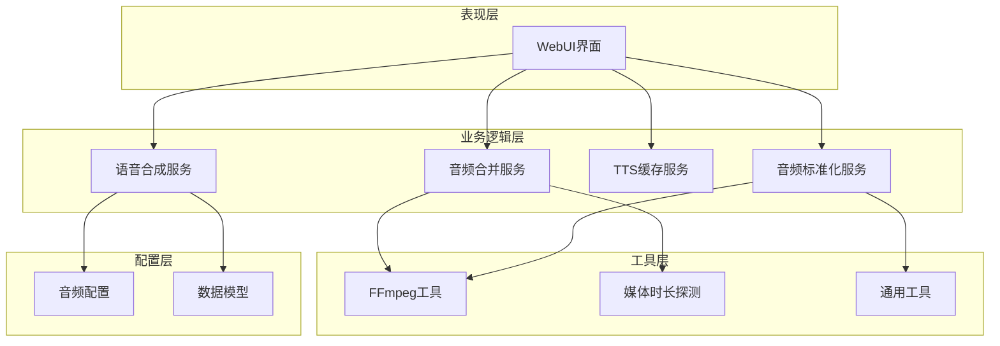
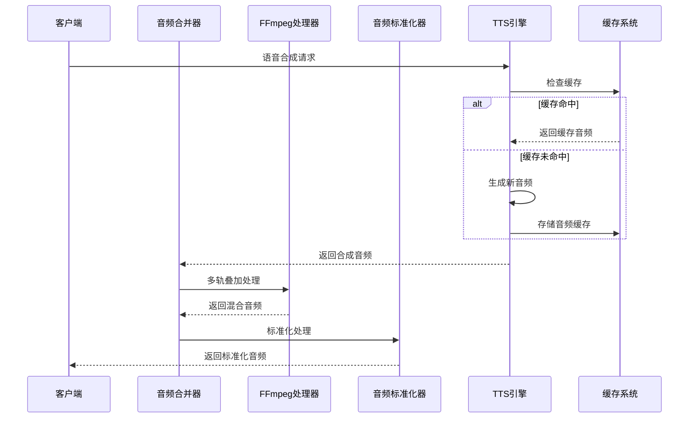
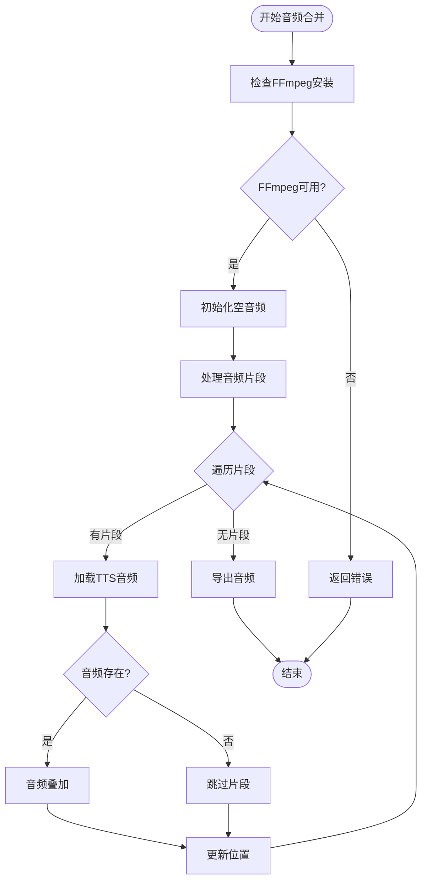
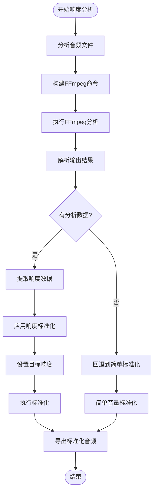
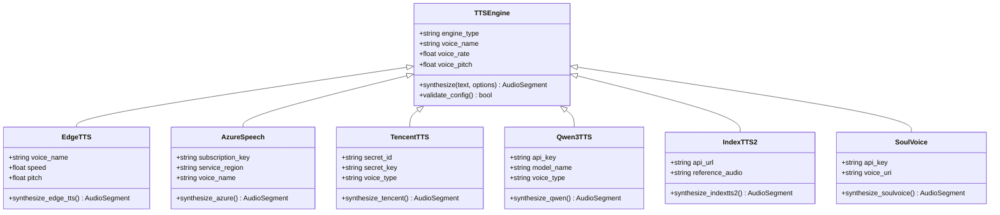
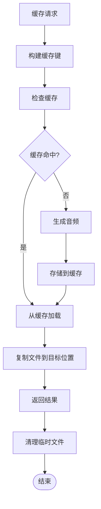
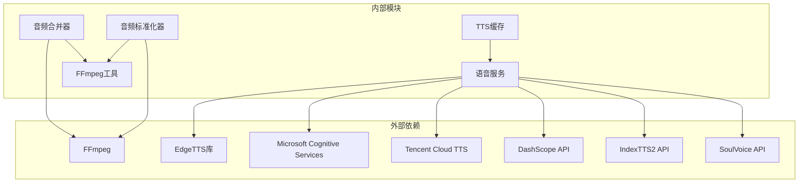

# 音频处理API

<cite>
**本文档引用的文件**
- [audio_merger.py](file://app/services/audio_merger.py)
- [audio_normalizer.py](file://app/services/audio_normalizer.py)
- [tts_cache.py](file://app/services/tts_cache.py)
- [ffmpeg_utils.py](file://app/utils/ffmpeg_utils.py)
- [audio_config.py](file://app/config/audio_config.py)
- [voice.py](file://app/services/voice.py)
- [audio_settings.py](file://webui/components/audio_settings.py)
- [media_duration.py](file://app/services/media_duration.py)
- [utils.py](file://app/utils/utils.py)
- [schema.py](file://app/models/schema.py)
- [clip_video.py](file://app/services/clip_video.py)
</cite>

## 目录
1. [简介](#简介)
2. [项目结构](#项目结构)
3. [核心组件](#核心组件)
4. [架构概览](#架构概览)
5. [详细组件分析](#详细组件分析)
6. [依赖关系分析](#依赖关系分析)
7. [性能考虑](#性能考虑)
8. [故障排除指南](#故障排除指南)
9. [结论](#结论)
10. [附录](#附录)

## 简介
本项目提供了一套完整的音频处理API，涵盖多音轨合成、响度标准化、TTS引擎集成、音频缓存管理以及格式转换等核心功能。系统采用模块化设计，通过FFmpeg进行底层音频处理，结合Python生态中的音频处理库，实现了高性能、可扩展的音频处理能力。

## 项目结构
项目采用分层架构设计，主要分为以下层次：



**图表来源**
- [audio_merger.py:1-172](file://app/services/audio_merger.py#L1-172)
- [audio_normalizer.py:1-315](file://app/services/audio_normalizer.py#L1-315)
- [tts_cache.py:1-125](file://app/services/tts_cache.py#L1-125)
- [ffmpeg_utils.py:1-800](file://app/utils/ffmpeg_utils.py#L1-800)

**章节来源**
- [audio_merger.py:1-172](file://app/services/audio_merger.py#L1-172)
- [audio_normalizer.py:1-315](file://app/services/audio_normalizer.py#L1-315)
- [tts_cache.py:1-125](file://app/services/tts_cache.py#L1-125)

## 核心组件

### 音频混合接口
音频混合接口提供了多音轨合成的核心功能，支持：
- 多轨道音频叠加合成
- 时间轴精确定位
- 自动间隔处理
- 错误容错机制

### 音频标准化API
音频标准化API实现了专业的响度控制和动态范围管理：
- LUFS响度分析和标准化
- RMS响度估算
- 智能音量调整算法
- 峰值限制保护

### TTS引擎集成接口
TTS引擎集成了多种语音合成服务：
- Edge TTS（Azure V1）
- Azure Speech Services（V2）
- 腾讯云TTS
- 通义千问Qwen3 TTS
- IndexTTS2语音克隆
- SoulVoice TTS

### 音频缓存管理API
缓存管理系统提供了高效的音频内容缓存：
- 基于内容的MD5缓存键生成
- 结构化的缓存目录组织
- 自动缓存命中检测
- 缓存清理和维护

**章节来源**
- [audio_merger.py:21-76](file://app/services/audio_merger.py#L21-76)
- [audio_normalizer.py:22-302](file://app/services/audio_normalizer.py#L22-302)
- [tts_cache.py:24-94](file://app/services/tts_cache.py#L24-94)

## 架构概览



**图表来源**
- [audio_merger.py:21-76](file://app/services/audio_merger.py#L21-76)
- [audio_normalizer.py:122-198](file://app/services/audio_normalizer.py#L122-198)
- [tts_cache.py:45-94](file://app/services/tts_cache.py#L45-94)

## 详细组件分析

### 音频混合组件分析

#### 核心功能流程
音频混合组件实现了精确的多音轨合成：



**图表来源**
- [audio_merger.py:21-76](file://app/services/audio_merger.py#L21-76)

#### 时间戳处理机制
系统支持多种时间戳格式的解析和转换：

| 时间格式 | 支持类型 | 示例 |
|---------|---------|------|
| HH:MM:SS,mmm | 详细格式 | 00:01:30,500 |
| MM:SS,mmm | 分钟格式 | 01:30,500 |
| SS,mmm | 秒格式 | 90,500 |
| SS-mmm | 毫秒分隔 | 90-500 |

**章节来源**
- [audio_merger.py:79-134](file://app/services/audio_merger.py#L79-134)

### 音频标准化组件分析

#### LUFS响度分析流程
音频标准化组件实现了专业的响度控制：



**图表来源**
- [audio_normalizer.py:122-198](file://app/services/audio_normalizer.py#L122-198)

#### 音量调整算法
系统实现了智能音量调整算法，确保不同音频源的一致响度：

| 音频类型 | 默认音量 | 调整范围 | 用途 |
|---------|---------|---------|------|
| TTS音频 | 0.8 | 0.1-2.0 | 解说语音 |
| 原声音频 | 1.3 | 0.1-3.0 | 原始对话 |
| 背景音乐 | 0.3 | 0.1-1.0 | 背景配乐 |

**章节来源**
- [audio_normalizer.py:236-273](file://app/services/audio_normalizer.py#L236-273)
- [audio_config.py:19-47](file://app/config/audio_config.py#L19-47)

### TTS引擎集成组件分析

#### 多引擎支持架构
TTS引擎集成了多种语音合成服务：



**图表来源**
- [voice.py:1127-1153](file://app/services/voice.py#L1127-1153)
- [audio_settings.py:22-66](file://webui/components/audio_settings.py#L22-66)

#### WebUI集成界面
WebUI提供了直观的TTS引擎配置界面：

| 引擎类型 | 特性 | 适用场景 | 配置要求 |
|---------|------|---------|----------|
| Edge TTS | 免费，不稳定 | 测试和轻量使用 | 无 |
| Azure Speech | 企业级，付费 | 稳定服务需求 | API Key |
| 腾讯云TTS | 中文优化，国内访问快 | 中文语音合成 | Secret ID/Key |
| Qwen3 TTS | 阿里云，音质优秀 | 高质量中文合成 | API Key |
| IndexTTS2 | 语音克隆 | 个性化语音 | 参考音频 |
| SoulVoice | 灵活配置 | 自定义音色 | API配置 |

**章节来源**
- [voice.py:1127-1153](file://app/services/voice.py#L1127-1153)
- [audio_settings.py:22-66](file://webui/components/audio_settings.py#L22-66)

### 音频缓存管理组件分析

#### 缓存策略架构
缓存管理系统采用了智能的缓存策略：



**图表来源**
- [tts_cache.py:45-94](file://app/services/tts_cache.py#L45-94)

#### 缓存键生成机制
缓存键基于音频内容的MD5哈希生成：

| 参数 | 作用 | 示例 |
|------|------|------|
| 文本内容 | 音频内容标识 | "你好世界" |
| 语音名称 | 音色标识 | "zh-CN-XiaoxiaoNeural" |
| 语速 | 速度参数 | 1.0 |
| 语调 | 音调参数 | 1.0 |
| 引擎类型 | 引擎标识 | "edge_tts" |

**章节来源**
- [tts_cache.py:24-94](file://app/services/tts_cache.py#L24-94)

## 依赖关系分析



**图表来源**
- [audio_merger.py:1-10](file://app/services/audio_merger.py#L1-10)
- [audio_normalizer.py:12-20](file://app/services/audio_normalizer.py#L12-20)
- [voice.py:1-25](file://app/services/voice.py#L1-25)

**章节来源**
- [ffmpeg_utils.py:1-800](file://app/utils/ffmpeg_utils.py#L1-800)
- [audio_config.py:1-221](file://app/config/audio_config.py#L1-221)

## 性能考虑

### 硬件加速优化
系统实现了智能的硬件加速检测和配置：

| 平台 | 支持的加速方式 | 编码器选择 | 性能优势 |
|------|---------------|-----------|----------|
| Windows | CUDA, NVENC, D3D11VA | h264_nvenc | NVIDIA独显最佳 |
| macOS | VideoToolbox | h264_videotoolbox | 集成GPU优化 |
| Linux | VAAPI, AMF, QSV | h264_vaapi | 多种方案支持 |

### 内存管理策略
- 采用流式处理减少内存占用
- 及时清理临时文件
- 智能缓存淘汰机制
- 并发处理优化

### 并行处理能力
- 多线程音频合成
- 异步缓存管理
- 并行文件操作
- 资源池管理

## 故障排除指南

### 常见问题及解决方案

#### FFmpeg相关问题
- **问题**: FFmpeg未安装
- **解决方案**: 安装FFmpeg并添加到系统PATH
- **预防**: 使用内置检测函数检查环境

#### TTS引擎配置问题
- **问题**: Azure语音名称格式错误
- **解决方案**: 使用正则表达式验证格式
- **预防**: 提供常用音色参考列表

#### 缓存失效问题
- **问题**: 缓存文件损坏
- **解决方案**: 自动检测和重建缓存
- **预防**: 实施缓存完整性校验

**章节来源**
- [audio_merger.py:12-18](file://app/services/audio_merger.py#L12-18)
- [voice.py:69-81](file://app/services/voice.py#L69-81)
- [tts_cache.py:88-90](file://app/services/tts_cache.py#L88-90)

## 结论
本音频处理API提供了完整、高效、可扩展的音频处理解决方案。通过模块化设计和智能优化，系统能够满足从基础音频合成到专业音频处理的各种需求。建议在生产环境中重点关注硬件加速配置、缓存策略优化和错误处理机制的实施。

## 附录

### API使用示例

#### 音频混合示例
```python
# 合并多个音频片段
segments = [
    {'audio': 'segment1.mp3', 'duration': 10},
    {'audio': 'segment2.mp3', 'duration': 15}
]
result = merge_audio_files('task_001', 25, segments)
```

#### 音频标准化示例
```python
# 标准化音频响度
normalizer = AudioNormalizer()
normalized_audio = normalizer.normalize_audio_lufs(
    'input.mp3', 'output.mp3', target_lufs=-20.0
)
```

#### TTS合成示例
```python
# 使用不同TTS引擎合成语音
voice_params = {
    'text': '你好世界',
    'voice_name': 'zh-CN-XiaoxiaoNeural',
    'voice_rate': 1.0,
    'voice_pitch': 1.0,
    'tts_engine': 'edge_tts'
}
audio_file = tts(**voice_params)
```

### 性能调优建议

#### 硬件配置建议
- **CPU**: 多核处理器，推荐8核以上
- **内存**: 至少16GB RAM
- **存储**: SSD固态硬盘
- **GPU**: NVIDIA GTX 1660以上（可选）

#### 系统优化
- 启用硬件加速
- 调整并发线程数
- 优化缓存策略
- 监控系统资源使用