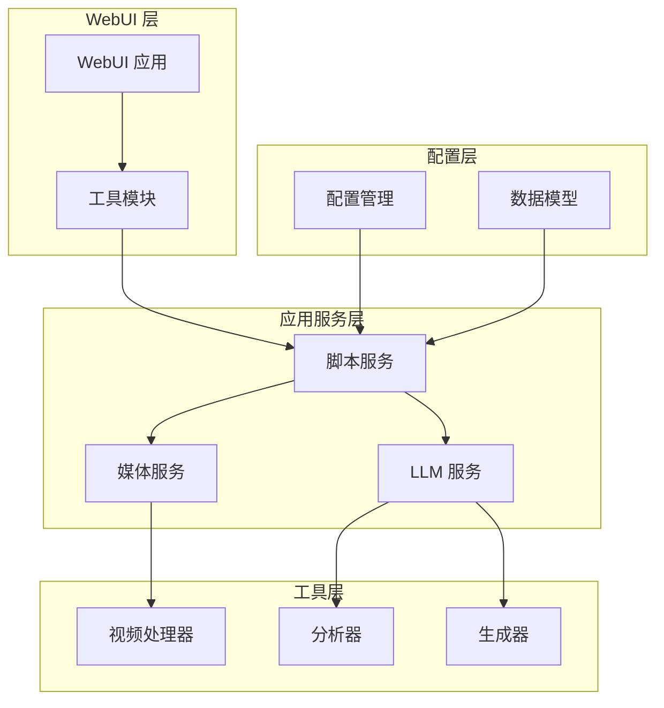
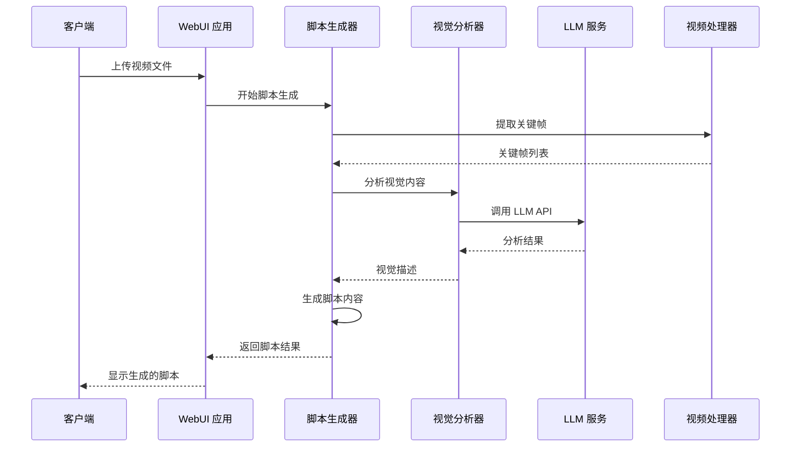
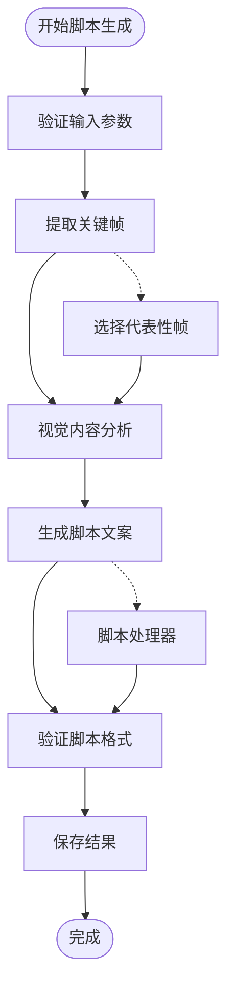
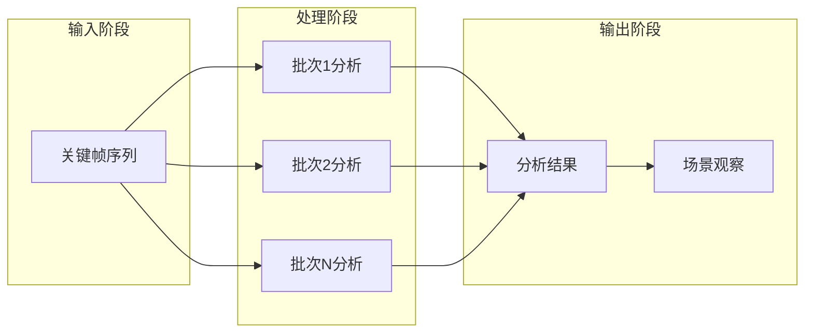
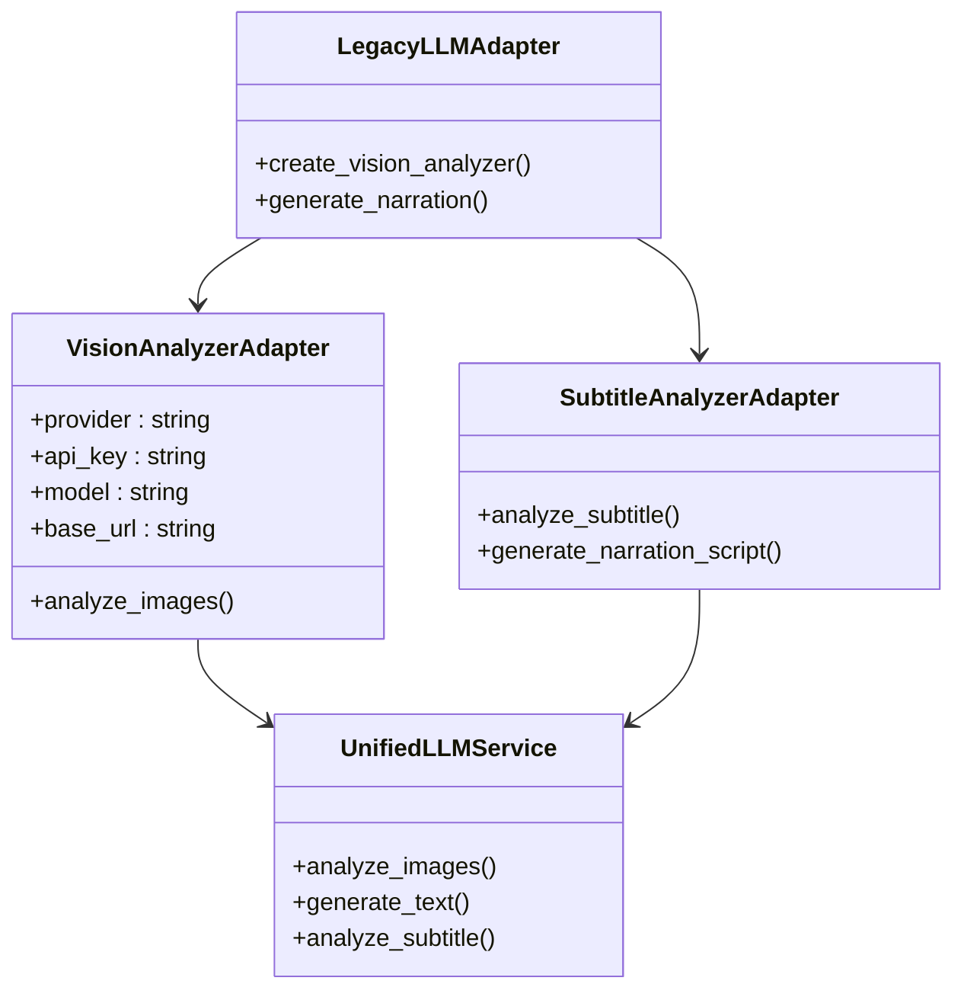
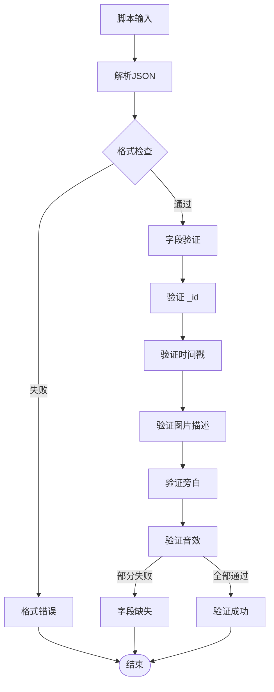
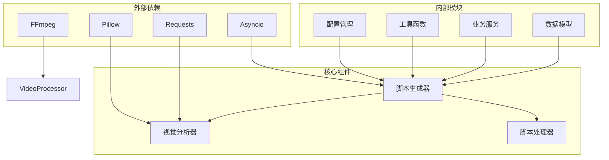

# 生成脚本文档

<cite>
**本文档引用的文件**
- [generate_script_docu.py](file://webui/tools/generate_script_docu.py)
- [script_service.py](file://app/services/script_service.py)
- [check_script.py](file://app/utils/check_script.py)
- [script_generator.py](file://app/utils/script_generator.py)
- [schema.py](file://app/models/schema.py)
- [subtitle_pipeline.py](file://app/services/subtitle_pipeline.py)
- [frame_selector.py](file://app/services/frame_selector.py)
- [evidence_fuser.py](file://app/services/evidence_fuser.py)
- [video_processor.py](file://app/utils/video_processor.py)
- [base.py](file://webui/tools/base.py)
- [config.py](file://app/config/config.py)
- [migration_adapter.py](file://app/services/llm/migration_adapter.py)
- [gemini_analyzer.py](file://app/utils/gemini_analyzer.py)
- [qwenvl_analyzer.py](file://app/utils/qwenvl_analyzer.py)
- [README.md](file://README.md)
</cite>

## 目录
1. [简介](#简介)
2. [项目结构](#项目结构)
3. [核心组件](#核心组件)
4. [架构概览](#架构概览)
5. [详细组件分析](#详细组件分析)
6. [依赖关系分析](#依赖关系分析)
7. [性能考虑](#性能考虑)
8. [故障排除指南](#故障排除指南)
9. [结论](#结论)

## 箎介

NarratoAI 是一个基于大型语言模型的自动化影视解说工具，专注于提供一站式 AI 影视解说+自动化剪辑解决方案。该工具能够自动处理视频脚本生成、字幕分析、场景构建和最终的视频合成，为内容创作者提供高效的自动化工作流程。

本项目采用模块化设计，通过多个专门的服务组件协同工作，实现了从原始视频到成品视频的完整自动化处理流程。系统支持多种 LLM 提供商，包括 Gemini、Qwen、OpenAI 等，为用户提供灵活的模型选择。

## 项目结构

项目采用清晰的分层架构设计，主要分为以下几个层次：

**图表来源**
- [generate_script_docu.py:1-179](file://webui/tools/generate_script_docu.py#L1-L179)
- [script_service.py:1-324](file://app/services/script_service.py#L1-L324)

**章节来源**
- [README.md:105-141](file://README.md#L105-L141)

## 核心组件

### 脚本生成器 (ScriptGenerator)

脚本生成器是整个系统的核心组件，负责协调各个服务组件完成完整的脚本生成流程。它实现了异步处理机制，支持多种 LLM 提供商，并具备强大的错误处理能力。

主要功能特性：
- 异步关键帧提取和处理
- 多提供商 LLM 支持
- 批量图片分析
- 自动化脚本生成
- 错误恢复和重试机制

### 视觉分析器 (VisionAnalyzer)

视觉分析器负责处理视频帧的视觉内容分析，支持多种视觉语言模型（VLM）。它能够理解复杂的视觉场景并生成详细的场景描述。

支持的分析能力：
- 批量图片处理
- 多提供商支持
- 自动重试机制
- 结果格式化

### 脚本处理器 (ScriptProcessor)

脚本处理器专门负责将视觉分析结果转换为最终的视频脚本。它根据场景持续时间和内容复杂度智能计算合适的字数，并生成符合要求的口播文案。

**章节来源**
- [script_service.py:15-324](file://app/services/script_service.py#L15-L324)
- [gemini_analyzer.py:17-326](file://app/utils/gemini_analyzer.py#L17-L326)
- [script_generator.py:433-642](file://app/utils/script_generator.py#L433-L642)

## 架构概览

系统采用事件驱动的异步架构，通过明确的组件边界和职责分离实现了高度的模块化：

**图表来源**
- [generate_script_docu.py:23-110](file://webui/tools/generate_script_docu.py#L23-L110)
- [script_service.py:20-74](file://app/services/script_service.py#L20-L74)

## 详细组件分析

### 脚本生成流程

脚本生成过程是一个多阶段的复杂流程，涉及视频处理、视觉分析和文本生成等多个步骤：

**图表来源**
- [generate_script_docu.py:32-100](file://webui/tools/generate_script_docu.py#L32-L100)
- [frame_selector.py:25-69](file://app/services/frame_selector.py#L25-L69)

#### 关键帧提取机制

系统采用智能的关键帧提取策略，支持多种提取模式以适应不同的视频内容：

| 提取模式 | 描述 | 适用场景 |
|---------|------|----------|
| 时间间隔提取 | 按固定时间间隔提取帧 | 标准视频内容 |
| 智能差异检测 | 基于画面变化检测提取 | 动态场景 |
| 超级兼容模式 | 最大兼容性方案 | 复杂视频格式 |

#### 视觉分析流程

视觉分析采用多阶段处理机制，确保分析结果的准确性和可靠性：

**图表来源**
- [video_processor.py:495-584](file://app/utils/video_processor.py#L495-L584)
- [evidence_fuser.py:7-32](file://app/services/evidence_fuser.py#L7-L32)

**章节来源**
- [generate_script_docu.py:112-131](file://webui/tools/generate_script_docu.py#L112-L131)
- [video_processor.py:26-670](file://app/utils/video_processor.py#L26-L670)

### LLM 服务集成

系统支持多种 LLM 提供商，通过统一的接口实现无缝切换：

**图表来源**
- [migration_adapter.py:62-205](file://app/services/llm/migration_adapter.py#L62-L205)

#### 多提供商支持

系统支持的主要 LLM 提供商及其特性：

| 提供商 | 模型名称 | 特性 | 适用场景 |
|--------|----------|------|----------|
| Gemini | gemini-pro, gemini-2.0-flash | 原生 API, 安全过滤 | 一般用途, 安全要求高 |
| Qwen | qwen-vl-max, qwen2-vl | 阿里云生态, 性价比 | 中文内容, 成本敏感 |
| OpenAI | gpt-4, gpt-3.5-turbo | 生态成熟, 功能丰富 | 复杂任务, 英文内容 |
| Moonshot | koi-moonshot-v1 | 性价比高 | 大规模处理 |

**章节来源**
- [migration_adapter.py:150-342](file://app/services/llm/migration_adapter.py#L150-L342)
- [gemini_analyzer.py:17-326](file://app/utils/gemini_analyzer.py#L17-L326)
- [qwenvl_analyzer.py:16-270](file://app/utils/qwenvl_analyzer.py#L16-L270)

### 脚本验证系统

系统内置了完善的脚本验证机制，确保生成的脚本符合预定义的格式要求：

**图表来源**
- [check_script.py:5-111](file://app/utils/check_script.py#L5-L111)

**章节来源**
- [check_script.py:1-111](file://app/utils/check_script.py#L1-L111)

## 依赖关系分析

系统采用松耦合的设计原则，通过明确的接口定义实现组件间的解耦：

**图表来源**
- [base.py:16-47](file://webui/tools/base.py#L16-L47)
- [config.py:24-95](file://app/config/config.py#L24-L95)

### 关键依赖关系

系统的关键依赖关系包括：

1. **配置管理依赖**：所有组件都依赖配置系统获取运行参数
2. **异步处理依赖**：核心组件都支持异步操作以提高性能
3. **文件系统依赖**：大量使用临时文件和缓存机制
4. **外部 API 依赖**：LLM 提供商的 API 调用

**章节来源**
- [base.py:1-147](file://webui/tools/base.py#L1-L147)
- [config.py:1-95](file://app/config/config.py#L1-L95)

## 性能考虑

系统在设计时充分考虑了性能优化，采用了多种策略来提升处理效率：

### 并行处理策略

- **批量处理**：支持多帧并行分析，减少 API 调用次数
- **异步操作**：使用 asyncio 实现非阻塞的异步处理
- **缓存机制**：关键帧和分析结果的智能缓存

### 内存管理

- **流式处理**：避免一次性加载大量数据到内存
- **渐进式存储**：中间结果及时清理，释放内存空间
- **资源监控**：实时监控内存使用情况

### 网络优化

- **连接复用**：重用 HTTP 连接减少建立开销
- **超时控制**：合理的超时设置避免长时间阻塞
- **重试机制**：智能的失败重试策略

## 故障排除指南

### 常见问题及解决方案

#### 关键帧提取失败

**问题症状**：关键帧提取完全失败，无任何文件生成

**可能原因**：
- FFmpeg 安装或配置问题
- 视频格式不支持
- 权限不足

**解决方案**：
1. 检查 FFmpeg 是否正确安装
2. 尝试使用超级兼容模式
3. 验证文件权限

#### LLM API 调用失败

**问题症状**：LLM API 返回错误或超时

**可能原因**：
- API 密钥配置错误
- 网络连接问题
- 配额限制

**解决方案**：
1. 验证 API 密钥有效性
2. 检查网络连接状态
3. 查看配额使用情况

#### 内存不足错误

**问题症状**：处理大型视频时出现内存不足

**解决方案**：
1. 减少批处理大小
2. 增加系统内存
3. 优化视频分辨率

**章节来源**
- [video_processor.py:409-451](file://app/utils/video_processor.py#L409-L451)
- [gemini_analyzer.py:38-53](file://app/utils/gemini_analyzer.py#L38-L53)

## 结论

NarratoAI 项目展现了现代 AI 应用开发的最佳实践，通过模块化设计、异步处理和多提供商支持实现了高度的灵活性和可扩展性。系统不仅提供了完整的自动化脚本生成解决方案，还为未来的功能扩展和技术演进奠定了坚实的基础。

项目的成功之处在于：
- 清晰的架构设计和职责分离
- 强大的错误处理和恢复机制
- 灵活的配置管理和环境适配
- 完善的性能优化策略

随着 AI 技术的不断发展，NarratoAI 有望成为内容创作领域的重要工具，为创作者提供更加智能化和自动化的解决方案。