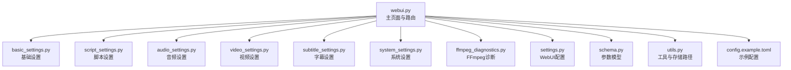
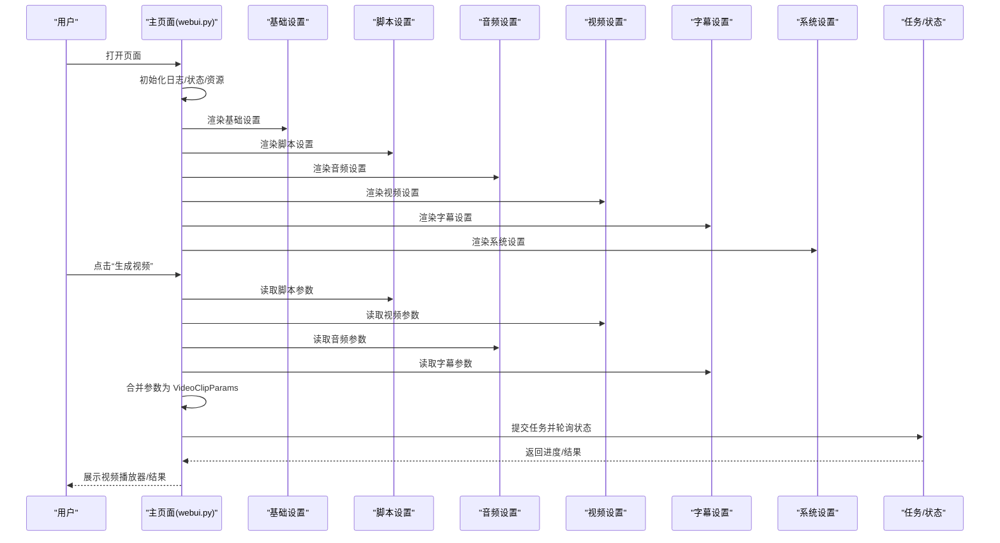
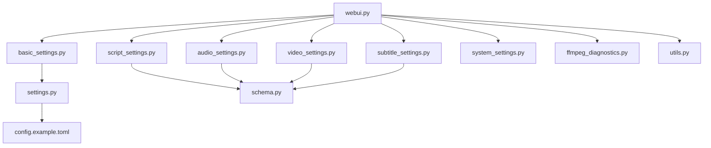

# Web界面使用

<cite>
**本文引用的文件**
- [webui.py](file://webui.py)
- [basic_settings.py](file://webui/components/basic_settings.py)
- [video_settings.py](file://webui/components/video_settings.py)
- [audio_settings.py](file://webui/components/audio_settings.py)
- [subtitle_settings.py](file://webui/components/subtitle_settings.py)
- [system_settings.py](file://webui/components/system_settings.py)
- [script_settings.py](file://webui/components/script_settings.py)
- [settings.py](file://webui/config/settings.py)
- [en.json](file://webui/i18n/en.json)
- [schema.py](file://app/models/schema.py)
- [utils.py](file://app/utils/utils.py)
- [config.example.toml](file://config.example.toml)
- [ffmpeg_diagnostics.py](file://webui/components/ffmpeg_diagnostics.py)
</cite>

## 目录
1. [简介](#简介)
2. [项目结构](#项目结构)
3. [核心组件](#核心组件)
4. [架构总览](#架构总览)
5. [详细组件分析](#详细组件分析)
6. [依赖分析](#依赖分析)
7. [性能考虑](#性能考虑)
8. [故障排除指南](#故障排除指南)
9. [结论](#结论)
10. [附录](#附录)

## 简介
本指南面向使用 NarratoAI Web 界面的用户，帮助您快速掌握界面布局、导航结构与各功能模块的使用方法。文档涵盖以下方面：
- 整体布局与导航：顶部标题、侧边菜单、主面板分区与生成按钮的位置与作用。
- 基础设置：语言、代理、LLM 提供商与模型配置、连通性测试。
- 视频设置：视频比例、画质、原声音量等参数。
- 音频设置：TTS 引擎选择、音色与语速/语调调节、背景音乐、试听功能。
- 字幕设置：启用/禁用、字体、字号、颜色、描边、位置与自定义位置。
- 系统设置：缓存清理（关键帧、裁剪视频、任务）。
- 脚本设置：脚本来源（文件/上传/AI 自动生成）、视频素材选择、生成与保存脚本。
- 高级选项：FFmpeg 诊断与配置、硬件加速检测、兼容性报告与故障排除。
- 操作流程与最佳实践：从准备素材到生成视频的完整工作流。
- 截图与示例：结合界面元素与操作步骤，提供直观指引。

## 项目结构
Web 界面由 Streamlit 驱动，采用“主页面 + 多组件面板”的布局：
- 主页面负责初始化日志、国际化、全局状态、FFmpeg 硬件加速检测与资源初始化，并渲染各设置面板与生成按钮。
- 各设置面板独立封装在 webui/components 下，分别处理基础设置、脚本设置、视频设置、音频设置、字幕设置与系统设置。
- 配置与模型定义位于 app/config 与 app/models 下，提供全局配置读取、参数模型与默认值。

图表来源
- [webui.py:227-294](file://webui.py#L227-L294)
- [basic_settings.py:142-161](file://webui/components/basic_settings.py#L142-L161)
- [script_settings.py:18-50](file://webui/components/script_settings.py#L18-L50)
- [audio_settings.py:83-94](file://webui/components/audio_settings.py#L83-L94)
- [video_settings.py:5-12](file://webui/components/video_settings.py#L5-L12)
- [subtitle_settings.py:9-16](file://webui/components/subtitle_settings.py#L9-L16)
- [system_settings.py:30-46](file://webui/components/system_settings.py#L30-L46)
- [ffmpeg_diagnostics.py:262-281](file://webui/components/ffmpeg_diagnostics.py#L262-L281)
- [settings.py:52-175](file://webui/config/settings.py#L52-L175)
- [schema.py:160-200](file://app/models/schema.py#L160-L200)
- [utils.py:76-118](file://app/utils/utils.py#L76-L118)
- [config.example.toml:1-177](file://config.example.toml#L1-L177)

章节来源
- [webui.py:15-32](file://webui.py#L15-L32)
- [webui.py:227-294](file://webui.py#L227-L294)

## 核心组件
- 基础设置（Basic Settings）：语言切换、代理开关与配置、LLM 提供商与模型配置（含 LiteLLM 统一接口）、连通性测试。
- 脚本设置（Script Settings）：脚本来源选择（文件/上传/AI 自动生成）、视频素材选择、生成与保存脚本、脚本编辑区。
- 音频设置（Audio Settings）：TTS 引擎选择（Edge TTS、Azure Speech、腾讯云 TTS、Qwen3 TTS、IndexTTS2、SoulVoice）、音色与语速/语调调节、背景音乐、试听功能。
- 视频设置（Video Settings）：视频比例（横屏/竖屏）、画质（4K/2K/1080p/720p/480p）、原声音量。
- 字幕设置（Subtitle Settings）：启用/禁用、字体、字号、颜色、描边、位置（顶部/居中/底部/自定义）。
- 系统设置（System Settings）：缓存清理（关键帧、裁剪视频、任务）。
- FFmpeg 诊断（FFmpeg Diagnostics）：硬件加速检测、配置文件推荐、兼容性报告、故障排除指南。

章节来源
- [basic_settings.py:142-726](file://webui/components/basic_settings.py#L142-L726)
- [script_settings.py:18-552](file://webui/components/script_settings.py#L18-L552)
- [audio_settings.py:83-782](file://webui/components/audio_settings.py#L83-L782)
- [video_settings.py:5-63](file://webui/components/video_settings.py#L5-L63)
- [subtitle_settings.py:9-165](file://webui/components/subtitle_settings.py#L9-L165)
- [system_settings.py:30-46](file://webui/components/system_settings.py#L30-L46)
- [ffmpeg_diagnostics.py:20-281](file://webui/components/ffmpeg_diagnostics.py#L20-L281)

## 架构总览
Web 界面采用“主页面 + 多面板”结构，主页面负责：
- 页面配置与样式、日志初始化、国际化、全局状态初始化。
- 注册 LLM 提供商、检测 FFmpeg 硬件加速、初始化基础资源。
- 渲染各设置面板与生成按钮；收集各面板参数，合并为 VideoClipParams 并提交任务。

图表来源
- [webui.py:227-294](file://webui.py#L227-L294)
- [script_settings.py:543-552](file://webui/components/script_settings.py#L543-L552)
- [video_settings.py:56-63](file://webui/components/video_settings.py#L56-L63)
- [audio_settings.py:1-944](file://webui/components/audio_settings.py#L1-L944)
- [subtitle_settings.py:152-165](file://webui/components/subtitle_settings.py#L152-L165)

## 详细组件分析

### 基础设置（Basic Settings）
- 语言设置：支持多语言切换，界面语言保存在会话状态与配置中。
- 代理设置：可启用/禁用 HTTP/HTTPS 代理，并写入环境变量。
- LLM 提供商与模型：统一使用 LiteLLM，支持 100+ 提供商；提供“原生 Gemini”“OpenAI 兼容 Gemini”等模式；支持 Base URL 与 API Key 配置；提供连通性测试。
- 配置验证：对 API Key、Base URL、模型名称进行格式校验；错误信息集中展示；保存成功后清理 LLM 缓存。

最佳实践
- 优先使用 LiteLLM 统一接口，便于扩展与迁移。
- Base URL 与 API Key 必须与所选提供商匹配；若使用 OpenAI 兼容网关，需填写完整接口地址。
- 连通性测试通过后再进行后续生成流程，避免因网络/鉴权导致失败。

章节来源
- [basic_settings.py:162-220](file://webui/components/basic_settings.py#L162-L220)
- [basic_settings.py:221-329](file://webui/components/basic_settings.py#L221-L329)
- [basic_settings.py:333-558](file://webui/components/basic_settings.py#L333-L558)
- [basic_settings.py:559-726](file://webui/components/basic_settings.py#L559-L726)

### 脚本设置（Script Settings）
- 脚本来源：文件选择/上传、AI 自动生成（画面解说/短剧混剪/短剧解说）、从本地文件加载。
- 视频素材：支持本地上传与目录内现有视频选择。
- 生成与保存：根据脚本来源调用相应生成工具；脚本编辑区支持 JSON 格式编辑与保存，内置格式校验与示例展示。
- 参数获取：提供 get_script_params() 供主页面读取脚本路径、视频路径、语言等。

最佳实践
- 画面解说模式下，适当提高关键帧提取间隔与批处理大小以平衡 Token 消耗与质量。
- 短剧混剪模式支持自定义片段数量，建议从 5 开始尝试，逐步调整。
- 短剧解说模式需上传 SRT 字幕文件，注意编码识别与内容有效性。

章节来源
- [script_settings.py:18-50](file://webui/components/script_settings.py#L18-L50)
- [script_settings.py:51-272](file://webui/components/script_settings.py#L51-L272)
- [script_settings.py:273-402](file://webui/components/script_settings.py#L273-L402)
- [script_settings.py:404-552](file://webui/components/script_settings.py#L404-L552)

### 音频设置（Audio Settings）
- TTS 引擎：Edge TTS、Azure Speech、腾讯云 TTS、Qwen3 TTS、IndexTTS2、SoulVoice。
- 引擎配置：按引擎类型渲染专属配置项（音色、语速、语调、音量、API Key、Base URL 等）。
- 背景音乐：支持随机、无、自定义路径；音量可调。
- 试听：一键合成示例文本并播放，便于快速验证参数。

最佳实践
- 中文场景优先考虑 Azure/腾讯云/Qwen3 TTS，英文场景可选 OpenAI/Google 等。
- IndexTTS2 需要本地或私有部署，首次合成耗时较长，建议准备清晰参考音频。
- 试听功能可用于快速确认音色与语速/语调是否符合预期。

章节来源
- [audio_settings.py:22-700](file://webui/components/audio_settings.py#L22-L700)
- [audio_settings.py:706-782](file://webui/components/audio_settings.py#L706-L782)

### 视频设置（Video Settings）
- 视频比例：支持竖屏（9:16）与横屏（16:9）。
- 画质：支持 4K、2K、Full HD、HD、SD。
- 原声音量：使用统一默认值，允许适度上调以平衡 TTS 音量。

最佳实践
- 短视频平台（如 TikTok）建议使用竖屏 9:16；长视频平台（如西瓜视频）建议横屏 16:9。
- 画质越高，处理时间越长；可根据硬件能力与目标平台选择合适画质。

章节来源
- [video_settings.py:5-63](file://webui/components/video_settings.py#L5-L63)
- [schema.py:16-35](file://app/models/schema.py#L16-L35)

### 字幕设置（Subtitle Settings）
- 启用/禁用：默认启用；SoulVoice/Qwen3_TTS 引擎时禁用以避免不支持的精确字幕生成。
- 字体：从资源字体目录加载，支持颜色与字号。
- 位置：顶部/居中/底部/自定义百分比位置。
- 样式：描边颜色与宽度。

最佳实践
- 字体与字号需与视频画质匹配，避免过小或过粗影响可读性。
- 自定义位置建议在 60%-80% 区间，兼顾字幕可读性与画面美观。

章节来源
- [subtitle_settings.py:9-165](file://webui/components/subtitle_settings.py#L9-L165)

### 系统设置（System Settings）
- 缓存清理：一键清理关键帧、裁剪视频、任务等临时目录，释放磁盘空间。
- 适用于调试与维护阶段，避免历史残留影响后续处理。

最佳实践
- 生成失败或磁盘空间不足时，优先清理相关缓存目录。
- 清理前建议备份重要中间产物。

章节来源
- [system_settings.py:30-46](file://webui/components/system_settings.py#L30-L46)

### FFmpeg 诊断（FFmpeg Diagnostics）
- 诊断信息：系统信息、FFmpeg 安装状态、硬件加速检测、推荐配置、兼容性报告。
- 设置选项：选择配置文件、强制禁用硬件加速、重置检测、测试兼容性。
- 故障排除：常见问题与解决方案，包括关键帧提取失败、硬件加速不可用、处理缓慢、文件权限问题等。

最佳实践
- 若硬件加速不可用，优先选择“兼容性配置”或“Windows NVIDIA 优化配置”，必要时强制禁用硬件加速。
- 处理缓慢时，检查显卡驱动、关闭其他 GPU 占用程序、降低画质或增加关键帧间隔。

章节来源
- [ffmpeg_diagnostics.py:20-281](file://webui/components/ffmpeg_diagnostics.py#L20-L281)

## 依赖分析
- 组件耦合
  - 主页面 webui.py 依赖各设置面板的渲染与参数获取函数，形成“面板-主页面”单向依赖。
  - 各面板内部模块化，仅依赖 app/models/schema.py 的参数模型与 app/utils/utils.py 的工具函数。
- 外部依赖
  - LLM 提供商通过 LiteLLM 统一接入，支持多家提供商与 Base URL 自定义。
  - FFmpeg 工具用于硬件加速检测与视频处理，诊断组件提供可视化配置与故障排除。
- 配置来源
  - WebUI 配置通过 settings.py 读取与保存；示例配置 config.example.toml 提供默认值与注释说明。

图表来源
- [webui.py:227-294](file://webui.py#L227-L294)
- [settings.py:52-175](file://webui/config/settings.py#L52-L175)
- [schema.py:160-200](file://app/models/schema.py#L160-L200)
- [utils.py:76-118](file://app/utils/utils.py#L76-L118)
- [config.example.toml:1-177](file://config.example.toml#L1-L177)

## 性能考虑
- 硬件加速：优先启用硬件加速以提升关键帧提取与视频编码性能；若不可用，选择兼容性配置或强制软件编码。
- 画质与批处理：高画质与大批量批处理会显著增加 Token 与计算消耗；建议根据目标平台与硬件能力折中选择。
- 线程数：参数模型中提供 n_threads 字段，可适当增大以提升处理速度（受 CPU/GPU 与 I/O 限制）。
- 缓存管理：定期清理关键帧与任务缓存，避免磁盘空间不足与历史残留影响性能。

## 故障排除指南
常见问题与解决方案
- 关键帧提取失败（滤镜链错误）
  - 选择“兼容性配置”或“Windows NVIDIA 优化配置”，强制禁用硬件加速，重新尝试。
- 硬件加速不可用
  - 更新显卡驱动，安装对应 SDK（NVIDIA CUDA/AMD Media SDK），或使用软件编码。
- 处理速度很慢
  - 启用硬件加速、选择高性能配置、降低画质或增加关键帧间隔、关闭其他 GPU 占用程序。
- 文件权限问题
  - 确保对输出目录有写入权限，以管理员身份运行（Windows），检查磁盘空间，避免特殊字符路径。

章节来源
- [ffmpeg_diagnostics.py:201-281](file://webui/components/ffmpeg_diagnostics.py#L201-L281)

## 结论
NarratoAI Web 界面提供了从脚本生成、素材选择、音频与字幕配置到视频生成与 FFmpeg 诊断的一体化工作流。通过合理配置各模块参数与利用缓存清理、硬件加速与兼容性报告，可在保证质量的同时提升生成效率。建议在正式批量生产前，先进行小规模试制与参数调优，并结合故障排除指南快速定位与解决问题。

## 附录

### 操作流程与最佳实践
- 准备阶段
  - 在基础设置中选择语言、配置代理（如需）、注册并测试 LLM 提供商。
  - 在脚本设置中选择脚本来源（文件/上传/AI 自动生成），上传或生成脚本并保存。
  - 在音频设置中选择合适的 TTS 引擎与音色，调节语速/语调/音量，试听确认。
  - 在视频设置中选择视频比例与画质，设置原声音量。
  - 在字幕设置中选择字体、字号、颜色、描边与位置。
  - 如需，使用 FFmpeg 诊断检查硬件加速与兼容性，必要时调整配置。
- 生成阶段
  - 点击“生成视频”，观察进度条与状态提示；完成后在播放器中预览结果。
- 维护阶段
  - 生成失败时，清理相关缓存目录；检查日志与错误信息，结合故障排除指南处理。

### 界面截图与示例
- 基础设置面板
  - 语言选择、代理开关、LLM 提供商与模型配置、连通性测试按钮。
- 脚本设置面板
  - 脚本来源选择（文件/上传/AI 自动生成）、视频素材选择、生成/保存脚本按钮、脚本编辑区。
- 音频设置面板
  - TTS 引擎选择、引擎专属配置项、背景音乐选择与音量、试听按钮。
- 视频设置面板
  - 视频比例、画质、原声音量滑块。
- 字幕设置面板
  - 启用/禁用、字体、字号、颜色、描边、位置与自定义位置。
- 系统设置面板
  - 清理关键帧、裁剪视频、任务缓存按钮。
- FFmpeg 诊断页面
  - 诊断信息、配置设置、故障排除指南与测试按钮。

章节来源
- [webui.py:266-294](file://webui.py#L266-L294)
- [en.json:1-91](file://webui/i18n/en.json#L1-L91)