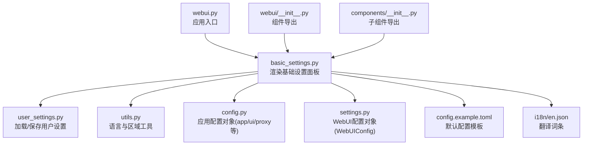
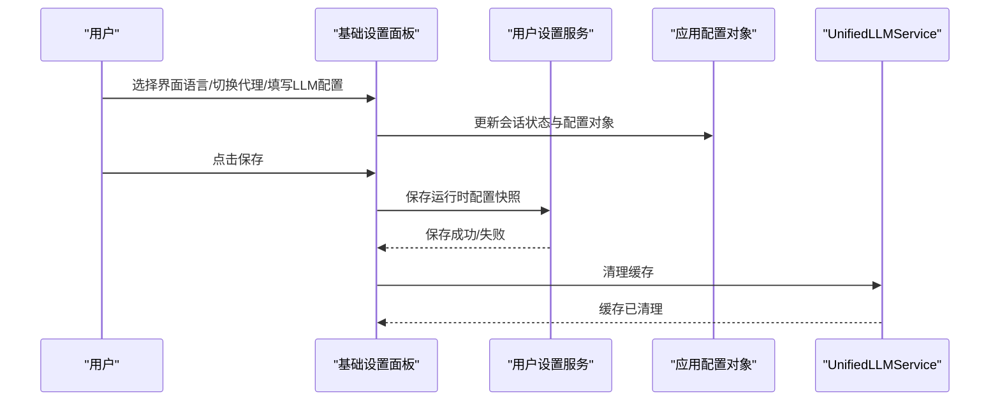
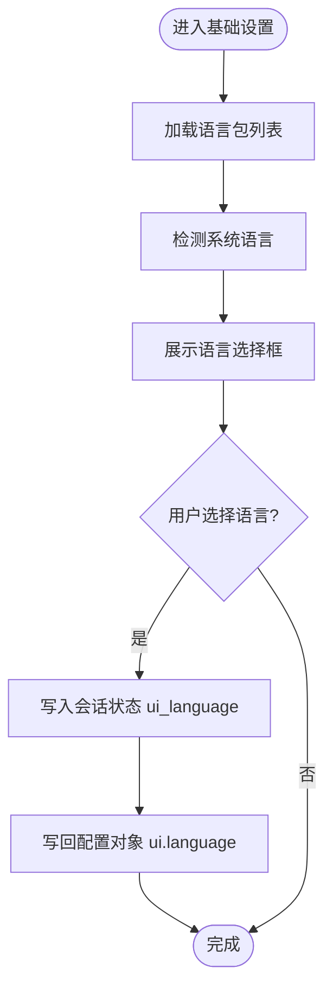
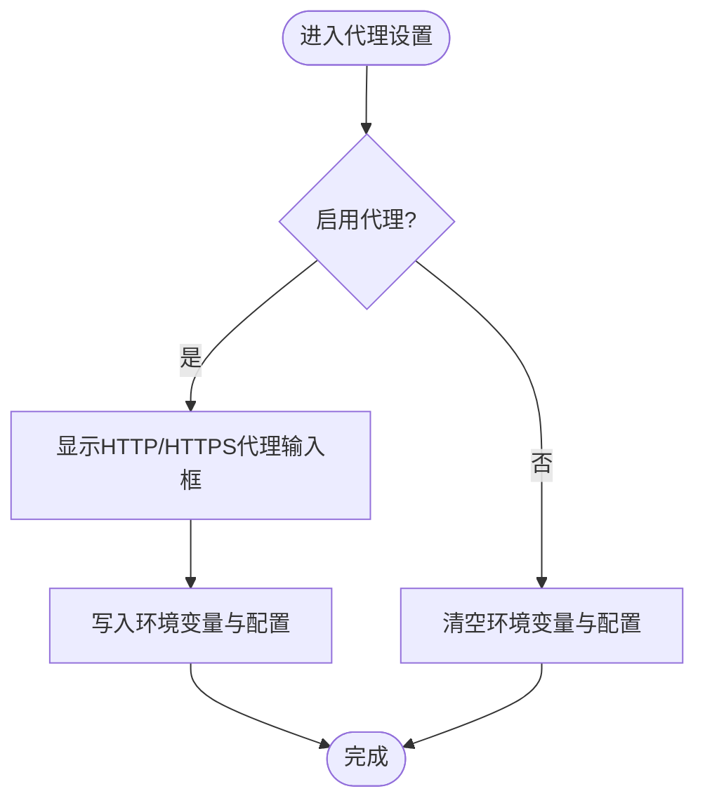
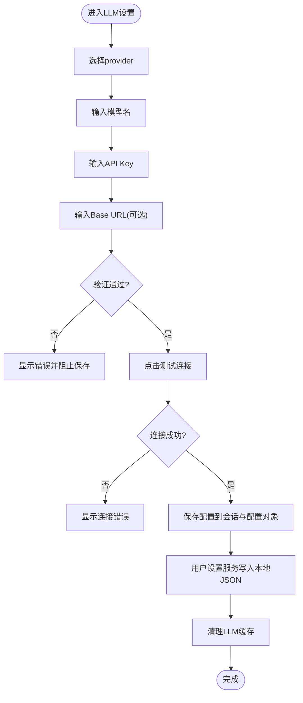
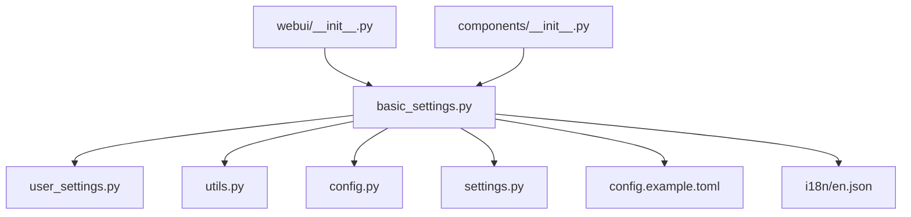

# 基本设置

<cite>
**本文引用的文件**
- [webui/components/basic_settings.py](file://webui/components/basic_settings.py)
- [webui.py](file://webui.py)
- [app/services/user_settings.py](file://app/services/user_settings.py)
- [app/utils/utils.py](file://app/utils/utils.py)
- [app/config/config.py](file://app/config/config.py)
- [webui/config/settings.py](file://webui/config/settings.py)
- [config.example.toml](file://config.example.toml)
- [webui/i18n/en.json](file://webui/i18n/en.json)
- [webui/__init__.py](file://webui/__init__.py)
- [webui/components/__init__.py](file://webui/components/__init__.py)
</cite>

## 更新摘要
**所做更改**
- 更新了基本设置面板的UI布局结构，采用三列布局设计提升用户体验
- 改进了语言设置和代理设置的界面组织方式
- 优化了LLM配置的输入体验和验证机制
- 增强了连接测试功能的用户反馈

## 目录
1. [简介](#简介)
2. [项目结构](#项目结构)
3. [核心组件](#核心组件)
4. [架构总览](#架构总览)
5. [详细组件分析](#详细组件分析)
6. [依赖分析](#依赖分析)
7. [性能考虑](#性能考虑)
8. [故障排查指南](#故障排查指南)
9. [结论](#结论)
10. [附录](#附录)

## 简介
本指南面向"基本设置"组件的使用者与维护者，系统讲解该组件在 WebUI 中的位置、作用与交互流程；涵盖界面语言选择、代理配置、以及 LLM（视频分析与文案生成）模型配置的入口与验证规则；并提供配置修改的操作步骤、保存机制、重置方法、国际化切换方式，以及常见场景的最佳实践。

## 项目结构
"基本设置"组件位于 WebUI 层，负责渲染基础配置面板，并通过用户设置服务持久化到本地 JSON 文件，同时影响运行时配置对象。

**图表来源**
- [webui.py:270-271](file://webui.py#L270-L271)
- [basic_settings.py:142-160](file://webui/components/basic_settings.py#L142-L160)
- [user_settings.py:100-131](file://app/services/user_settings.py#L100-L131)
- [utils.py:284-303](file://app/utils/utils.py#L284-L303)
- [config.py:24-95](file://app/config/config.py#L24-L95)
- [settings.py:52-175](file://webui/config/settings.py#L52-L175)
- [config.example.toml:1-177](file://config.example.toml#L1-L177)
- [webui/i18n/en.json:1-91](file://webui/i18n/en.json#L1-L91)
- [webui/__init__.py:5-21](file://webui/__init__.py#L5-L21)
- [webui/components/__init__.py:1-13](file://webui/components/__init__.py#L1-L13)

**章节来源**
- [webui.py:270-271](file://webui.py#L270-L271)
- [basic_settings.py:142-160](file://webui/components/basic_settings.py#L142-L160)

## 核心组件
- 基础设置面板渲染器：负责组织语言、代理、视觉/文本 LLM 设置三列布局，并在用户操作时即时更新会话状态与配置对象。
- 用户设置服务：负责将运行时配置快照写入本地 JSON 文件，支持多配置文件档案（profile）管理。
- 工具函数：提供系统语言检测、多语言包加载、时间格式化等能力，支撑语言切换与本地化展示。
- 应用配置对象：封装 app、ui、proxy 等配置段，提供读取与保存能力。
- WebUI 配置对象：封装 WebUI 层的配置读取、保存与更新逻辑，避免与后端配置混淆。
- 示例配置模板：提供默认配置项与注释，便于首次安装与迁移。

**章节来源**
- [basic_settings.py:142-160](file://webui/components/basic_settings.py#L142-L160)
- [user_settings.py:100-131](file://app/services/user_settings.py#L100-L131)
- [utils.py:284-303](file://app/utils/utils.py#L284-L303)
- [config.py:24-95](file://app/config/config.py#L24-L95)
- [settings.py:52-175](file://webui/config/settings.py#L52-L175)
- [config.example.toml:1-177](file://config.example.toml#L1-L177)

## 架构总览
"基本设置"组件的控制流如下：应用启动时渲染基础设置面板；用户在面板中进行语言选择、代理开关与 LLM 配置；每次输入变更都会更新会话状态与配置对象；点击保存后由用户设置服务将当前配置快照写入本地 JSON 文件；随后清理 LLM 缓存以使新配置生效。

**图表来源**
- [webui.py:270-271](file://webui.py#L270-L271)
- [basic_settings.py:142-160](file://webui/components/basic_settings.py#L142-L160)
- [basic_settings.py:716-725](file://webui/components/basic_settings.py#L716-L725)
- [user_settings.py:100-107](file://app/services/user_settings.py#L100-L107)

## 详细组件分析

### 基础设置面板位置与作用
- 位置：应用入口文件在页面顶部渲染标题与帮助信息后，立即渲染"基础设置"面板，随后渲染主工作区面板与系统设置面板。
- 作用：集中管理界面语言、网络代理、以及 LLM（视频分析与文案生成）的统一配置入口；提供配置验证与连接测试能力；保存配置至本地用户设置文件。

**章节来源**
- [webui.py:266-294](file://webui.py#L266-L294)
- [basic_settings.py:142-160](file://webui/components/basic_settings.py#L142-L160)

### UI布局增强与用户体验改进
- 三列布局设计：基础设置面板采用 `st.columns(3)` 实现左右语言代理设置、中间视觉LLM设置、右侧文本LLM设置的三栏布局，提升信息密度和操作效率。
- 展开式设计：使用 `st.expander` 包装整个基础设置面板，用户可选择展开或收起，节省页面空间。
- 实时更新机制：每个配置项的变更都会即时更新会话状态和配置对象，提供流畅的交互体验。

**更新** 新增了三列布局设计和展开式面板结构，显著改善了用户界面体验

**章节来源**
- [basic_settings.py:142-160](file://webui/components/basic_settings.py#L142-L160)
- [webui.py:270-271](file://webui.py#L270-L271)

### 界面语言选择
- 语言列表来源：扫描 i18n 目录下的语言包，读取语言代码与显示名称，结合系统语言默认选中。
- 选择行为：用户选择后，更新会话状态中的 ui_language，并写回配置对象 ui.language。
- 生效范围：语言切换影响当前会话的翻译词条，后续面板与提示语随之变化。

**图表来源**
- [basic_settings.py:162-187](file://webui/components/basic_settings.py#L162-L187)
- [utils.py:284-303](file://app/utils/utils.py#L284-L303)

**章节来源**
- [basic_settings.py:162-187](file://webui/components/basic_settings.py#L162-L187)
- [utils.py:284-303](file://app/utils/utils.py#L284-L303)
- [webui/i18n/en.json:1-91](file://webui/i18n/en.json#L1-L91)

### 代理设置
- 开关：提供"启用代理"复选框，控制是否启用 HTTP/HTTPS 代理。
- 输入：启用时显示 HTTP_PROXY 与 HTTPS_PROXY 文本输入框；禁用时清空配置并移除环境变量。
- 环境变量：保存代理地址时同步写入 HTTP_PROXY 与 HTTPS_PROXY 环境变量，确保运行时网络请求使用代理。

**图表来源**
- [basic_settings.py:189-218](file://webui/components/basic_settings.py#L189-L218)

**章节来源**
- [basic_settings.py:189-218](file://webui/components/basic_settings.py#L189-L218)

### LLM 配置（视频分析与文案生成）
- 统一入口：采用 LiteLLM 统一接口，分别配置"视频分析模型"和"文案生成模型"，二者共享相同的 provider、模型名、API Key、Base URL 的输入与校验逻辑。
- provider 列表：内置支持 100+ 提供商，若当前 provider 不在列表中，会自动插入到列表首位。
- 模型名格式：支持 provider/model（推荐）或直接模型名（LiteLLM 自动推断）。提供格式校验与长度限制。
- Base URL：针对 OpenAI 兼容网关提供帮助提示与必填校验；部分 provider 有推荐地址。
- 连接测试：提供"测试连接"按钮，分别对 LiteLLM 视觉与文本模型进行连通性测试，返回友好错误提示。
- 保存策略：每次输入变更均进行验证，通过后写入配置对象与会话状态；点击保存后由用户设置服务写入本地 JSON 文件，并清理 LLM 缓存。

**图表来源**
- [basic_settings.py:559-726](file://webui/components/basic_settings.py#L559-L726)
- [basic_settings.py:221-329](file://webui/components/basic_settings.py#L221-L329)
- [basic_settings.py:333-453](file://webui/components/basic_settings.py#L333-L453)
- [basic_settings.py:455-558](file://webui/components/basic_settings.py#L455-L558)
- [user_settings.py:100-107](file://app/services/user_settings.py#L100-L107)

**章节来源**
- [basic_settings.py:559-726](file://webui/components/basic_settings.py#L559-L726)
- [basic_settings.py:221-329](file://webui/components/basic_settings.py#L221-L329)
- [basic_settings.py:333-453](file://webui/components/basic_settings.py#L333-L453)
- [basic_settings.py:455-558](file://webui/components/basic_settings.py#L455-L558)
- [user_settings.py:100-107](file://app/services/user_settings.py#L100-L107)

### 配置项说明与推荐值
- 项目名称与描述：来源于应用配置对象，可在配置文件中设置；用于页面标题与描述展示。
- 语言：建议根据系统语言自动选择；如需固定语言，可在"界面语言"中选择。
- 代理：仅在需要翻墙或企业网络环境下启用；HTTP/HTTPS 地址需以 http:// 或 https:// 开头。
- 视频分析模型（LiteLLM）：
  - 推荐 provider/model 格式，如 gemini/gemini-2.0-flash-lite 或 deepseek/deepseek-chat。
  - Base URL 对 OpenAI 兼容网关必填，可参考示例模板中的推荐地址。
- 文案生成模型（LiteLLM）：
  - 推荐使用高性价比与稳定性兼顾的模型，如 deepseek/deepseek-chat 或 qwen/qwen-plus。
  - Base URL 同上，兼容网关需填写完整地址。

**章节来源**
- [config.py:77-83](file://app/config/config.py#L77-L83)
- [config.example.toml:23-51](file://config.example.toml#L23-L51)

### 操作步骤与注意事项
- 修改语言：
  - 在"基础设置"中选择目标语言，确认后即刻生效。
  - 注意：语言切换不会自动重置其他配置，仅影响翻译词条。
- 修改代理：
  - 勾选"启用代理"，填写 HTTP/HTTPS 地址；保存后环境变量与配置对象同步更新。
  - 如需关闭代理，取消勾选并保存，系统会清除环境变量与配置。
- 修改 LLM 配置：
  - 在对应模型设置中填写 provider/model、API Key、Base URL（如适用）。
  - 点击"测试连接"验证连通性；通过后再点击"保存"写入本地。
  - 保存后系统会清理 LLM 缓存，确保新配置生效。
- 重置选项：
  - 语言与代理的配置可通过再次编辑覆盖；LLM 配置可清空后重新填写。
  - 若需恢复默认，可参考示例配置模板，将相应字段还原为默认值。

**章节来源**
- [basic_settings.py:162-187](file://webui/components/basic_settings.py#L162-L187)
- [basic_settings.py:189-218](file://webui/components/basic_settings.py#L189-L218)
- [basic_settings.py:559-726](file://webui/components/basic_settings.py#L559-L726)
- [config.example.toml:1-177](file://config.example.toml#L1-L177)

### 国际化支持与语言切换
- 语言包加载：扫描 i18n 目录，读取各语言 JSON 文件中的语言名称与词条。
- 系统语言检测：优先使用系统语言代码；若未匹配到对应语言包，则回退到英文。
- 切换流程：选择语言后写入会话状态与配置对象，后续所有翻译词条均按所选语言返回。

**章节来源**
- [basic_settings.py:162-187](file://webui/components/basic_settings.py#L162-L187)
- [utils.py:284-303](file://app/utils/utils.py#L284-L303)
- [webui/i18n/en.json:1-91](file://webui/i18n/en.json#L1-L91)

### 常见配置场景与最佳实践
- 中国大陆用户（无需代理）：
  - 保持"启用代理"关闭；LLM 配置直接使用各提供商官方 Base URL。
- 海外用户或需代理：
  - 启用代理并填写 HTTP/HTTPS 地址；注意地址以 http:// 或 https:// 开头。
- 使用 OpenAI 兼容网关：
  - 填写完整的 Base URL；可参考示例模板中的推荐地址；provider/model 格式更稳妥。
- 性能与稳定性：
  - 视频分析模型建议选择速度与成本平衡的模型；文案生成模型建议选择推理能力强且稳定的模型。
  - 定期进行"测试连接"以确保网络与凭据有效。

**章节来源**
- [config.example.toml:52-64](file://config.example.toml#L52-L64)
- [basic_settings.py:36-58](file://webui/components/basic_settings.py#L36-L58)

## 依赖分析
- 组件耦合：
  - 基础设置面板依赖用户设置服务进行持久化；依赖工具函数进行语言包加载与系统语言检测；依赖应用配置对象与 WebUI 配置对象进行读写。
- 外部依赖：
  - LiteLLM：统一 LLM 接口，支持 100+ 提供商；用于连接测试与模型调用。
  - requests/openai/litellm：用于连接测试与模型调用。
- 循环依赖：
  - 未发现循环导入；模块职责清晰，数据流向单向。

**图表来源**
- [basic_settings.py:142-160](file://webui/components/basic_settings.py#L142-L160)
- [user_settings.py:100-131](file://app/services/user_settings.py#L100-L131)
- [utils.py:284-303](file://app/utils/utils.py#L284-L303)
- [config.py:24-95](file://app/config/config.py#L24-L95)
- [settings.py:52-175](file://webui/config/settings.py#L52-L175)
- [config.example.toml:1-177](file://config.example.toml#L1-L177)
- [webui/i18n/en.json:1-91](file://webui/i18n/en.json#L1-L91)
- [webui/__init__.py:5-21](file://webui/__init__.py#L5-L21)
- [webui/components/__init__.py:1-13](file://webui/components/__init__.py#L1-L13)

**章节来源**
- [basic_settings.py:142-160](file://webui/components/basic_settings.py#L142-L160)
- [user_settings.py:100-131](file://app/services/user_settings.py#L100-L131)
- [utils.py:284-303](file://app/utils/utils.py#L284-L303)
- [config.py:24-95](file://app/config/config.py#L24-L95)
- [settings.py:52-175](file://webui/config/settings.py#L52-L175)
- [config.example.toml:1-177](file://config.example.toml#L1-L177)
- [webui/i18n/en.json:1-91](file://webui/i18n/en.json#L1-L91)

## 性能考虑
- 连接测试采用同步调用，耗时受网络与模型服务影响；建议在弱网或高延迟环境下适当增加超时时间。
- 保存配置后清理 LLM 缓存，避免旧配置残留导致的性能与一致性问题。
- 代理开启时会增加一次网络跳转，建议仅在必要时启用。

## 故障排查指南
- 语言切换无效：
  - 确认已选择语言并保存；检查会话状态与配置对象是否已更新。
- 代理无法生效：
  - 确认地址以 http:// 或 https:// 开头；检查环境变量是否同步写入。
- LLM 连接失败：
  - 检查 API Key 是否正确；确认 Base URL 是否完整（OpenAI 兼容网关必填）；查看测试连接返回的错误提示。
- 配置未持久化：
  - 确认点击了"保存"按钮；检查用户设置文件是否成功写入；必要时重启应用以加载最新配置。

**章节来源**
- [basic_settings.py:135-140](file://webui/components/basic_settings.py#L135-L140)
- [basic_settings.py:189-218](file://webui/components/basic_settings.py#L189-L218)
- [basic_settings.py:559-726](file://webui/components/basic_settings.py#L559-L726)
- [user_settings.py:100-107](file://app/services/user_settings.py#L100-L107)

## 结论
"基本设置"组件提供了界面语言、网络代理与 LLM 配置的一站式入口，配合严格的输入验证与连接测试，能够帮助用户快速完成项目配置并稳定运行。通过用户设置服务的本地持久化与缓存清理机制，用户可以安全地调整配置并在不同会话间复用。最新的UI布局优化进一步提升了用户体验和操作效率。

## 附录
- 配置文件位置与模板：
  - 应用配置：config.toml（示例模板为 config.example.toml）
  - WebUI 配置：.streamlit/webui.toml（示例模板为 config.example.toml）
- 关键路径：
  - 基础设置面板渲染入口：webui.py
  - 用户设置读写：app/services/user_settings.py
  - 语言包加载与系统语言检测：app/utils/utils.py
  - 应用配置对象：app/config/config.py
  - WebUI 配置对象：webui/config/settings.py
- 组件导出：
  - WebUI 主包导出：webui/__init__.py
  - 子组件导出：webui/components/__init__.py