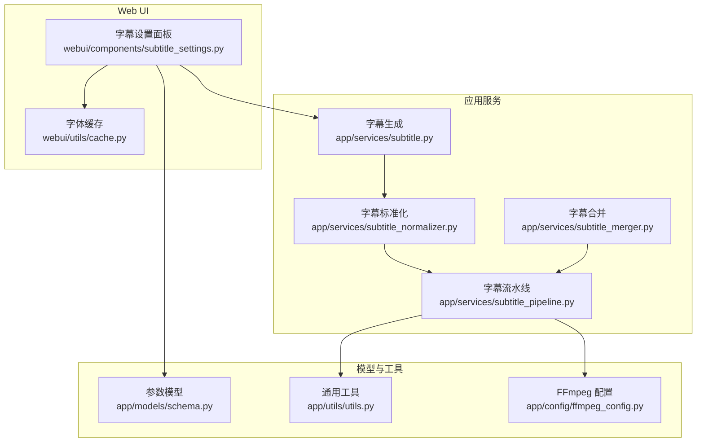
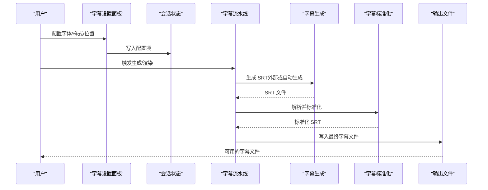
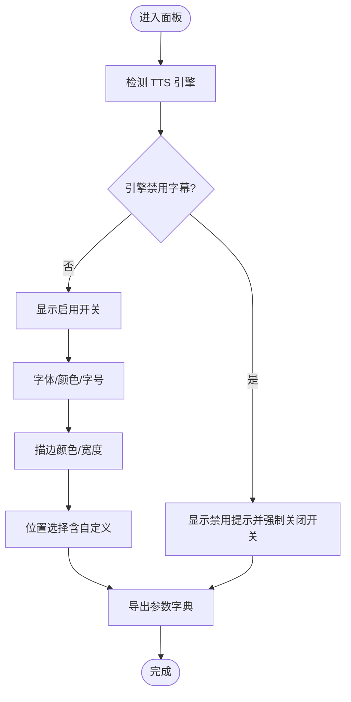
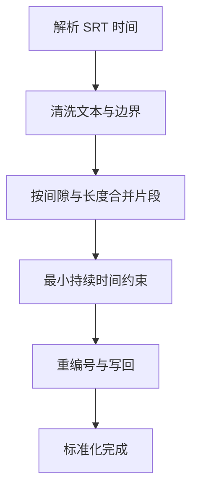
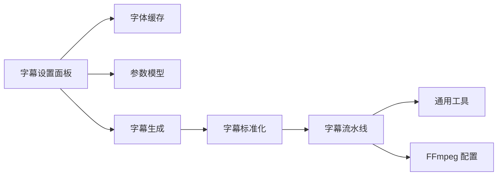

# 字幕设置面板

<cite>
**本文引用的文件**
- [webui/components/subtitle_settings.py](file://webui/components/subtitle_settings.py)
- [webui/utils/cache.py](file://webui/utils/cache.py)
- [app/services/subtitle.py](file://app/services/subtitle.py)
- [app/services/subtitle_normalizer.py](file://app/services/subtitle_normalizer.py)
- [app/services/subtitle_merger.py](file://app/services/subtitle_merger.py)
- [app/services/subtitle_pipeline.py](file://app/services/subtitle_pipeline.py)
- [app/models/schema.py](file://app/models/schema.py)
- [app/utils/utils.py](file://app/utils/utils.py)
- [app/config/ffmpeg_config.py](file://app/config/ffmpeg_config.py)
</cite>

## 目录
1. [简介](#简介)
2. [项目结构](#项目结构)
3. [核心组件](#核心组件)
4. [架构总览](#架构总览)
5. [详细组件分析](#详细组件分析)
6. [依赖关系分析](#依赖关系分析)
7. [性能考量](#性能考量)
8. [故障排查指南](#故障排查指南)
9. [结论](#结论)
10. [附录](#附录)

## 简介
本指南围绕“字幕设置面板”展开，面向非技术用户与开发者，系统讲解字幕设置面板的界面布局、功能模块及其在字幕处理流程中的作用。文档覆盖以下主题：
- 字体与样式配置：字体选择、字号、颜色、描边等
- 位置参数：顶部、居中、底部、自定义百分比位置
- 字幕格式与同步：SRT 格式特性与时间轴对齐
- 预处理能力：时间轴调整、格式标准化、多片段合并
- 渲染与输出：与视频渲染管线的衔接
- 实战示例与视觉优化建议

## 项目结构
字幕设置面板位于 Web UI 层，负责收集用户配置并通过会话状态传递给后端服务层；后端服务层提供字幕生成、标准化、合并与流水线集成能力。

图表来源
- [webui/components/subtitle_settings.py:1-165](file://webui/components/subtitle_settings.py#L1-L165)
- [webui/utils/cache.py:1-35](file://webui/utils/cache.py#L1-L35)
- [app/services/subtitle.py:1-467](file://app/services/subtitle.py#L1-L467)
- [app/services/subtitle_normalizer.py:1-154](file://app/services/subtitle_normalizer.py#L1-L154)
- [app/services/subtitle_merger.py:1-239](file://app/services/subtitle_merger.py#L1-L239)
- [app/services/subtitle_pipeline.py:1-64](file://app/services/subtitle_pipeline.py#L1-L64)
- [app/models/schema.py:108-209](file://app/models/schema.py#L108-L209)
- [app/utils/utils.py:222-235](file://app/utils/utils.py#L222-L235)
- [app/config/ffmpeg_config.py:27-285](file://app/config/ffmpeg_config.py#L27-L285)

章节来源
- [webui/components/subtitle_settings.py:1-165](file://webui/components/subtitle_settings.py#L1-L165)
- [app/services/subtitle_pipeline.py:19-64](file://app/services/subtitle_pipeline.py#L19-L64)

## 核心组件
- 字幕设置面板：提供启用/禁用开关、字体与样式、位置参数等配置入口，并将配置写入会话状态。
- 字体缓存：扫描资源字体目录，提供可用字体列表供选择。
- 字幕生成：基于 Whisper 或 Gemini 生成 SRT 字幕。
- 字幕标准化：解析 SRT、清洗与合并片段、输出标准 SRT。
- 字幕合并：按时间偏移合并多个 SRT 片段。
- 字幕流水线：整合外部 SRT 或自动生成 SRT，执行标准化与落盘。
- 参数模型：定义视频参数中的字幕字段，确保前后端一致。
- 通用工具：提供 SRT 时间转换、文本处理等工具。
- FFmpeg 配置：为渲染阶段提供硬件加速与兼容性配置。

章节来源
- [webui/components/subtitle_settings.py:9-165](file://webui/components/subtitle_settings.py#L9-L165)
- [webui/utils/cache.py:6-16](file://webui/utils/cache.py#L6-L16)
- [app/services/subtitle.py:26-198](file://app/services/subtitle.py#L26-L198)
- [app/services/subtitle_normalizer.py:34-154](file://app/services/subtitle_normalizer.py#L34-L154)
- [app/services/subtitle_merger.py:62-185](file://app/services/subtitle_merger.py#L62-L185)
- [app/services/subtitle_pipeline.py:33-64](file://app/services/subtitle_pipeline.py#L33-L64)
- [app/models/schema.py:108-209](file://app/models/schema.py#L108-L209)
- [app/utils/utils.py:222-235](file://app/utils/utils.py#L222-L235)
- [app/config/ffmpeg_config.py:27-285](file://app/config/ffmpeg_config.py#L27-L285)

## 架构总览
字幕设置面板通过会话状态读取用户配置，结合字幕流水线完成从生成到标准化再到输出的完整流程。渲染阶段可参考 FFmpeg 配置进行硬件加速与兼容性优化。

图表来源
- [webui/components/subtitle_settings.py:9-165](file://webui/components/subtitle_settings.py#L9-L165)
- [app/services/subtitle_pipeline.py:33-64](file://app/services/subtitle_pipeline.py#L33-L64)
- [app/services/subtitle.py:26-198](file://app/services/subtitle.py#L26-L198)
- [app/services/subtitle_normalizer.py:34-154](file://app/services/subtitle_normalizer.py#L34-L154)

## 详细组件分析

### 字幕设置面板（界面与逻辑）
- 功能要点
  - 启用/禁用字幕：根据 TTS 引擎动态控制，部分引擎组合下强制禁用。
  - 字体设置：从资源字体目录加载字体列表，支持颜色与字号。
  - 样式设置：描边颜色与宽度。
  - 位置设置：预设位置（顶部/居中/底部/自定义），自定义位置为百分比从顶部计算。
  - 参数导出：统一获取当前字幕参数字典，供后续流程使用。

图表来源
- [webui/components/subtitle_settings.py:9-165](file://webui/components/subtitle_settings.py#L9-L165)

章节来源
- [webui/components/subtitle_settings.py:9-165](file://webui/components/subtitle_settings.py#L9-L165)

### 字体与样式配置
- 字体选择
  - 来源：资源字体目录扫描，缓存于会话状态，避免重复 IO。
  - 保存：将所选字体名写入配置与会话状态。
- 字体大小与颜色
  - 字号滑杆范围与默认值由面板定义。
  - 文本颜色拾色器，支持十六进制。
- 样式（描边）
  - 描边颜色与宽度，支持连续微调。

章节来源
- [webui/utils/cache.py:6-16](file://webui/utils/cache.py#L6-L16)
- [webui/components/subtitle_settings.py:47-89](file://webui/components/subtitle_settings.py#L47-L89)
- [webui/components/subtitle_settings.py:130-149](file://webui/components/subtitle_settings.py#L130-L149)

### 位置参数与布局
- 预设位置：顶部、居中、底部、自定义。
- 自定义位置：百分比数值校验（0–100），超出范围给出错误提示。
- 参数落地：位置与自定义百分比写入会话状态，供渲染阶段使用。

章节来源
- [webui/components/subtitle_settings.py:95-128](file://webui/components/subtitle_settings.py#L95-L128)

### 字幕格式与同步（SRT）
- SRT 时间格式
  - 支持“时:分:秒,毫秒”格式，工具函数提供解析与转换。
- 时间轴对齐
  - 合并模块按时间偏移合并多个片段，保证时间连续性。
- 标准化流程
  - 解析 SRT → 清洗与合并 → 最小持续时间约束 → 重新编号 → 写回 SRT。

图表来源
- [app/services/subtitle_normalizer.py:34-154](file://app/services/subtitle_normalizer.py#L34-L154)
- [app/utils/utils.py:191-235](file://app/utils/utils.py#L191-L235)

章节来源
- [app/services/subtitle_normalizer.py:34-154](file://app/services/subtitle_normalizer.py#L34-L154)
- [app/utils/utils.py:191-235](file://app/utils/utils.py#L191-L235)

### 字幕预处理（自动对齐、时间轴调整、格式标准化）
- 自动对齐
  - 对脚本与字幕进行相似度匹配与合并，减少人工修正成本。
- 时间轴调整
  - 合并模块支持按时间偏移对齐多片段。
- 格式标准化
  - 统一时间格式、去除多余空白、保证最小持续时间、重编号。

章节来源
- [app/services/subtitle.py:257-348](file://app/services/subtitle.py#L257-L348)
- [app/services/subtitle_merger.py:62-185](file://app/services/subtitle_merger.py#L62-L185)
- [app/services/subtitle_normalizer.py:82-154](file://app/services/subtitle_normalizer.py#L82-L154)

### 字幕渲染与输出
- 渲染衔接
  - 字幕参数（字体、颜色、描边、位置等）由面板写入会话状态，后续渲染流程读取这些参数。
- 输出文件
  - 标准化后的 SRT 文件写回磁盘，供渲染阶段使用。
- 渲染优化
  - 可参考 FFmpeg 配置进行硬件加速与兼容性优化，提升渲染效率。

章节来源
- [webui/components/subtitle_settings.py:152-165](file://webui/components/subtitle_settings.py#L152-L165)
- [app/services/subtitle_normalizer.py:144-154](file://app/services/subtitle_normalizer.py#L144-L154)
- [app/config/ffmpeg_config.py:27-285](file://app/config/ffmpeg_config.py#L27-L285)

### 字幕场景配置示例与视觉优化建议
- 示例场景
  - 新闻播报：使用清晰易读的无衬线字体，字号适中，描边宽度较小，颜色对比度高，位置靠底部。
  - 记录片旁白：字号稍大，描边略粗，颜色与画面明暗对比明显，位置居中或略靠下。
  - 广告短视频：字号较大，强调主标题，描边颜色与背景形成强对比，位置固定在底部。
- 视觉优化建议
  - 字体与字号：确保在目标分辨率下可读性优先。
  - 颜色与描边：深色背景用浅色文字配黑色描边；浅色背景用深色文字配白色描边。
  - 位置与边距：自定义百分比时，避免遮挡关键画面元素；保持上下边距一致。
  - 时间节奏：标准化时适当增加最小持续时间，避免快速闪现影响阅读。

## 依赖关系分析
- 面板依赖
  - 字体缓存：从资源字体目录读取字体列表。
  - 参数模型：统一视频参数结构，保证字段一致性。
- 服务依赖
  - 字幕生成依赖 Whisper/Gemini；标准化依赖 SRT 解析与工具函数；合并依赖时间解析与格式化。
- 流水线依赖
  - 优先使用外部 SRT，否则自动生成并标准化，最后落盘。

图表来源
- [webui/components/subtitle_settings.py:9-165](file://webui/components/subtitle_settings.py#L9-L165)
- [webui/utils/cache.py:6-16](file://webui/utils/cache.py#L6-L16)
- [app/models/schema.py:108-209](file://app/models/schema.py#L108-L209)
- [app/services/subtitle.py:26-198](file://app/services/subtitle.py#L26-L198)
- [app/services/subtitle_normalizer.py:34-154](file://app/services/subtitle_normalizer.py#L34-L154)
- [app/services/subtitle_pipeline.py:33-64](file://app/services/subtitle_pipeline.py#L33-L64)
- [app/utils/utils.py:222-235](file://app/utils/utils.py#L222-L235)
- [app/config/ffmpeg_config.py:27-285](file://app/config/ffmpeg_config.py#L27-L285)

章节来源
- [app/services/subtitle_pipeline.py:33-64](file://app/services/subtitle_pipeline.py#L33-L64)

## 性能考量
- 字体加载：字体列表缓存在会话状态，避免重复扫描。
- 字幕生成：Whisper 模型优先使用 GPU，失败回退 CPU；合理设置 beam_size 与 VAD 过滤以平衡速度与精度。
- 标准化与合并：批量处理时注意内存占用，必要时分批处理。
- 渲染优化：根据系统环境选择合适的 FFmpeg 配置文件，启用硬件加速可显著提升渲染速度。

## 故障排查指南
- 字体未显示或选择无效
  - 检查资源字体目录是否存在字体文件，确认扩展名符合 .ttf/.otf/.ttc。
  - 清理会话缓存后重试。
- 自定义位置数值异常
  - 确认输入为 0–100 的数字，避免空值或非数值。
- 字幕生成失败
  - 确认 Whisper 模型已下载且路径正确；检查音频轨道是否存在。
- 合并后时间错乱
  - 核对每个片段的 editedTimeRange 起止时间，确保顺序与偏移正确。
- 渲染卡顿或失败
  - 切换 FFmpeg 配置文件，优先尝试高兼容性配置；检查显卡驱动与硬件加速可用性。

章节来源
- [webui/utils/cache.py:6-16](file://webui/utils/cache.py#L6-L16)
- [webui/components/subtitle_settings.py:115-128](file://webui/components/subtitle_settings.py#L115-L128)
- [app/services/subtitle.py:26-198](file://app/services/subtitle.py#L26-L198)
- [app/services/subtitle_merger.py:62-185](file://app/services/subtitle_merger.py#L62-L185)
- [app/config/ffmpeg_config.py:27-285](file://app/config/ffmpeg_config.py#L27-L285)

## 结论
字幕设置面板提供了直观的配置入口，配合字幕生成、标准化与合并服务，能够高效完成从字幕创建到输出的全流程。通过合理的字体与样式、位置与时间轴设置，以及渲染阶段的硬件加速优化，可在保证可读性的前提下获得高质量的字幕呈现效果。

## 附录
- 关键参数字段（来自参数模型）
  - 字幕开关、字体名、字号、文本颜色、描边颜色与宽度、位置与自定义百分比等。
- 常用工具函数
  - SRT 时间转换、文本清洗与断句、MD5 与目录管理等。

章节来源
- [app/models/schema.py:108-209](file://app/models/schema.py#L108-L209)
- [app/utils/utils.py:222-235](file://app/utils/utils.py#L222-L235)