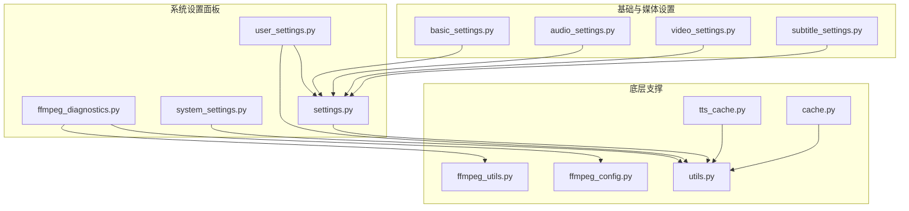
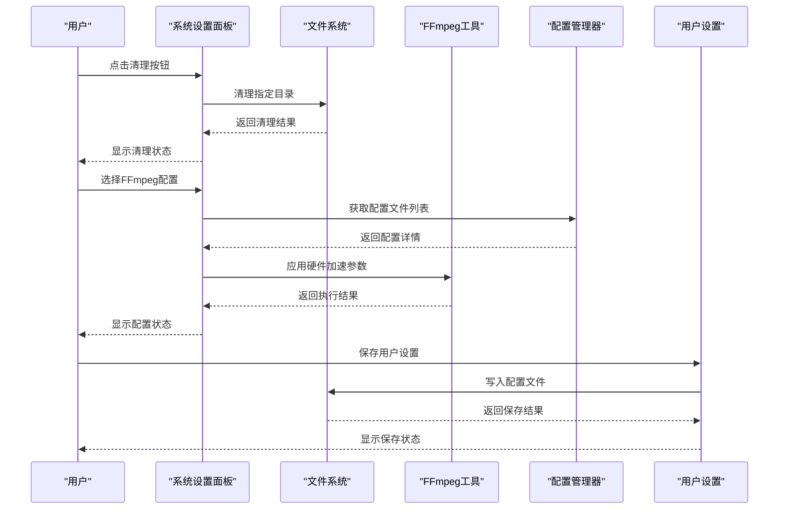
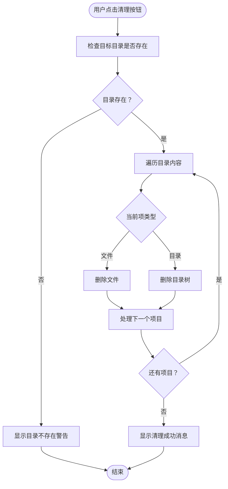
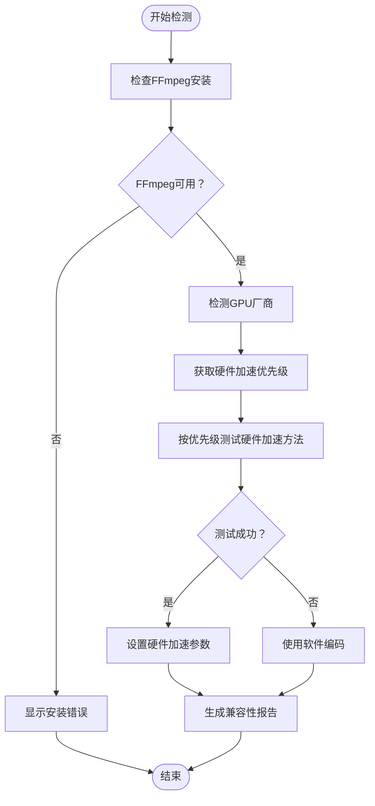
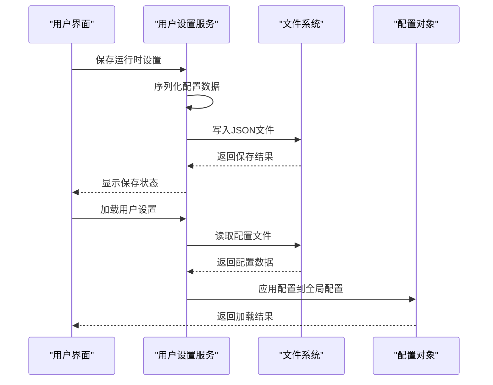
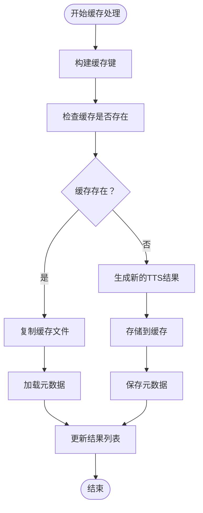
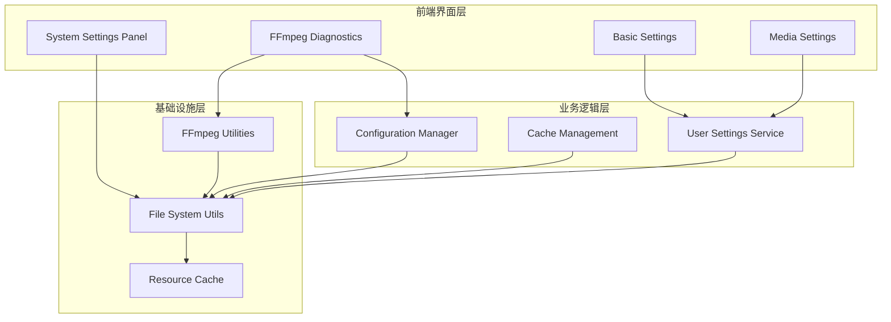

# 系统设置面板

<cite>
**本文档引用的文件**
- [system_settings.py](file://webui/components/system_settings.py)
- [ffmpeg_diagnostics.py](file://webui/components/ffmpeg_diagnostics.py)
- [ffmpeg_utils.py](file://app/utils/ffmpeg_utils.py)
- [ffmpeg_config.py](file://app/config/ffmpeg_config.py)
- [tts_cache.py](file://app/services/tts_cache.py)
- [settings.py](file://webui/config/settings.py)
- [user_settings.py](file://app/services/user_settings.py)
- [cache.py](file://webui/utils/cache.py)
- [utils.py](file://app/utils/utils.py)
- [basic_settings.py](file://webui/components/basic_settings.py)
- [audio_settings.py](file://webui/components/audio_settings.py)
- [video_settings.py](file://webui/components/video_settings.py)
- [subtitle_settings.py](file://webui/components/subtitle_settings.py)
</cite>

## 目录
1. [简介](#简介)
2. [项目结构](#项目结构)
3. [核心组件](#核心组件)
4. [架构概览](#架构概览)
5. [详细组件分析](#详细组件分析)
6. [依赖分析](#依赖分析)
7. [性能考虑](#性能考虑)
8. [故障排除指南](#故障排除指南)
9. [结论](#结论)
10. [附录](#附录)

## 简介
本指南详细介绍系统设置面板的功能与使用方法，涵盖系统管理与维护、缓存管理、日志系统配置、FFmpeg诊断工具以及性能监控优化等方面。通过直观的操作界面，用户可以轻松完成系统配置、缓存清理、硬件加速检测与优化、用户设置的持久化与备份恢复等任务。

## 项目结构
系统设置面板由多个组件协同构成，主要分为以下几类：
- 系统设置面板：提供缓存清理、任务管理等系统级操作入口
- FFmpeg诊断与配置：提供硬件加速检测、配置文件选择、兼容性报告等功能
- 用户设置与持久化：负责用户配置的保存、加载与跨会话应用
- 基础设置与媒体设置：提供语言、代理、模型、TTS引擎、字幕等配置项
- 缓存工具：提供字体、视频文件、歌曲等资源的缓存机制



**图表来源**
- [system_settings.py:30-46](file://webui/components/system_settings.py#L30-L46)
- [ffmpeg_diagnostics.py:20-281](file://webui/components/ffmpeg_diagnostics.py#L20-L281)
- [ffmpeg_utils.py:118-800](file://app/utils/ffmpeg_utils.py#L118-L800)
- [ffmpeg_config.py:27-285](file://app/config/ffmpeg_config.py#L27-L285)
- [user_settings.py:59-131](file://app/services/user_settings.py#L59-L131)
- [settings.py:52-175](file://webui/config/settings.py#L52-L175)
- [tts_cache.py:15-125](file://app/services/tts_cache.py#L15-L125)
- [cache.py:6-35](file://webui/utils/cache.py#L6-L35)
- [utils.py:76-118](file://app/utils/utils.py#L76-L118)

**章节来源**
- [system_settings.py:30-46](file://webui/components/system_settings.py#L30-L46)
- [ffmpeg_diagnostics.py:262-281](file://webui/components/ffmpeg_diagnostics.py#L262-L281)
- [settings.py:52-175](file://webui/config/settings.py#L52-L175)

## 核心组件
系统设置面板的核心组件包括：
- 系统设置面板：提供清理关键帧缓存、清理剪辑视频缓存、清理任务缓存等操作入口
- FFmpeg诊断与配置：提供硬件加速检测、配置文件选择、兼容性报告、故障排除指南等
- 用户设置与持久化：提供配置文件的保存、加载与跨会话应用
- 基础设置与媒体设置：提供语言、代理、模型、TTS引擎、字幕等配置项
- 缓存工具：提供字体、视频文件、歌曲等资源的缓存机制

**章节来源**
- [system_settings.py:9-46](file://webui/components/system_settings.py#L9-L46)
- [ffmpeg_diagnostics.py:20-281](file://webui/components/ffmpeg_diagnostics.py#L20-L281)
- [user_settings.py:59-131](file://app/services/user_settings.py#L59-L131)
- [basic_settings.py:142-160](file://webui/components/basic_settings.py#L142-L160)
- [audio_settings.py:83-153](file://webui/components/audio_settings.py#L83-L153)
- [video_settings.py:5-63](file://webui/components/video_settings.py#L5-L63)
- [subtitle_settings.py:9-45](file://webui/components/subtitle_settings.py#L9-L45)
- [cache.py:6-35](file://webui/utils/cache.py#L6-L35)

## 架构概览
系统设置面板采用分层架构设计，前端通过Streamlit组件提供用户交互，后端通过Python模块提供具体功能实现。各组件之间通过清晰的接口进行通信，确保系统的可维护性和扩展性。



**图表来源**
- [system_settings.py:9-28](file://webui/components/system_settings.py#L9-L28)
- [ffmpeg_diagnostics.py:110-199](file://webui/components/ffmpeg_diagnostics.py#L110-L199)
- [ffmpeg_config.py:142-242](file://app/config/ffmpeg_config.py#L142-L242)
- [user_settings.py:100-131](file://app/services/user_settings.py#L100-L131)

## 详细组件分析

### 系统设置面板
系统设置面板提供三个主要的清理功能：
- 清理关键帧缓存：删除临时目录下的关键帧缓存
- 清理剪辑视频缓存：删除临时目录下的剪辑视频缓存  
- 清理任务缓存：删除任务目录下的缓存文件



**图表来源**
- [system_settings.py:9-28](file://webui/components/system_settings.py#L9-L28)

**章节来源**
- [system_settings.py:9-46](file://webui/components/system_settings.py#L9-L46)

### FFmpeg诊断与配置
FFmpeg诊断组件提供完整的硬件加速检测与配置管理功能：

#### 硬件加速检测流程


**图表来源**
- [ffmpeg_utils.py:252-355](file://app/utils/ffmpeg_utils.py#L252-L355)
- [ffmpeg_config.py:98-141](file://app/config/ffmpeg_config.py#L98-L141)

#### 配置文件管理
系统内置多种预定义配置文件：
- 高性能配置：适用于现代NVIDIA/AMD独立显卡
- 兼容性配置：解决滤镜链问题，兼容性最高
- Windows NVIDIA优化配置：纯NVENC编码器方案
- macOS VideoToolbox优化配置：针对Apple Silicon优化
- 通用软件配置：最高兼容性，适用于所有平台

**章节来源**
- [ffmpeg_diagnostics.py:20-281](file://webui/components/ffmpeg_diagnostics.py#L20-L281)
- [ffmpeg_utils.py:118-800](file://app/utils/ffmpeg_utils.py#L118-L800)
- [ffmpeg_config.py:27-285](file://app/config/ffmpeg_config.py#L27-L285)

### 用户设置与持久化
用户设置系统提供完整的配置管理功能：

#### 配置文件结构
```mermaid
erDiagram
USER_SETTINGS {
string profile
json app
json ui
json proxy
}
APP_CONFIG {
string vision_llm_provider
string text_llm_provider
string tts_engine
string voice_name
float voice_rate
float voice_pitch
}
UI_CONFIG {
string language
}
PROXY_CONFIG {
boolean enabled
string http
string https
}
USER_SETTINGS }o|--|| APP_CONFIG : "包含"
USER_SETTINGS }o|--|| UI_CONFIG : "包含"
USER_SETTINGS }o|--|| PROXY_CONFIG : "包含"
```

**图表来源**
- [user_settings.py:59-97](file://app/services/user_settings.py#L59-L97)
- [settings.py:22-51](file://webui/config/settings.py#L22-L51)

#### 配置保存与加载流程


**图表来源**
- [user_settings.py:100-131](file://app/services/user_settings.py#L100-L131)
- [settings.py:98-144](file://webui/config/settings.py#L98-L144)

**章节来源**
- [user_settings.py:59-131](file://app/services/user_settings.py#L59-L131)
- [settings.py:52-175](file://webui/config/settings.py#L52-L175)

### 缓存管理
系统提供多层次的缓存管理机制：

#### TTS缓存机制


**图表来源**
- [tts_cache.py:45-94](file://app/services/tts_cache.py#L45-L94)
- [tts_cache.py:97-125](file://app/services/tts_cache.py#L97-L125)

#### 资源缓存机制
系统为字体、视频文件、歌曲等资源提供缓存功能：
- 字体缓存：扫描字体目录，缓存字体文件列表
- 视频文件缓存：扫描支持的视频格式，缓存文件路径
- 歌曲缓存：扫描MP3格式歌曲文件

**章节来源**
- [tts_cache.py:15-125](file://app/services/tts_cache.py#L15-L125)
- [cache.py:6-35](file://webui/utils/cache.py#L6-L35)

### 基础设置与媒体设置
系统提供全面的基础设置与媒体配置选项：

#### 语言与代理设置
- 语言选择：支持多语言切换，自动检测系统语言
- 代理配置：支持HTTP/HTTPS代理，动态环境变量设置

#### LLM模型配置
- 视觉模型设置：支持100+提供商，包括OpenAI、Gemini、Qwen等
- 文本模型设置：统一的LiteLLM配置接口
- 连接测试：内置连接测试功能，验证配置有效性

#### 媒体设置
- 视频设置：视频比例、画质、原声音量等
- 音频设置：多种TTS引擎支持，音色、语速、音调调节
- 字幕设置：字体、颜色、位置、样式等个性化配置

**章节来源**
- [basic_settings.py:142-727](file://webui/components/basic_settings.py#L142-L727)
- [audio_settings.py:83-782](file://webui/components/audio_settings.py#L83-L782)
- [video_settings.py:5-63](file://webui/components/video_settings.py#L5-L63)
- [subtitle_settings.py:9-165](file://webui/components/subtitle_settings.py#L9-L165)

## 依赖分析
系统设置面板的依赖关系呈现清晰的分层结构：



**图表来源**
- [system_settings.py:1-7](file://webui/components/system_settings.py#L1-L7)
- [ffmpeg_diagnostics.py:6-17](file://webui/components/ffmpeg_diagnostics.py#L6-L17)
- [user_settings.py:1-11](file://app/services/user_settings.py#L1-L11)
- [ffmpeg_utils.py:1-10](file://app/utils/ffmpeg_utils.py#L1-L10)
- [utils.py:1-16](file://app/utils/utils.py#L1-L16)

**章节来源**
- [system_settings.py:1-7](file://webui/components/system_settings.py#L1-L7)
- [ffmpeg_diagnostics.py:6-17](file://webui/components/ffmpeg_diagnostics.py#L6-L17)
- [user_settings.py:1-11](file://app/services/user_settings.py#L1-L11)

## 性能考虑
系统设置面板在设计时充分考虑了性能优化：

### 缓存策略
- Session级缓存：减少重复计算和文件扫描
- 文件系统缓存：避免频繁的目录遍历操作
- TTS缓存：通过MD5键值避免重复的语音合成

### 硬件加速优化
- 智能检测：根据GPU厂商和平台自动选择最优硬件加速方案
- 渐进式降级：硬件加速不可用时自动回退到软件编码
- 配置文件优化：针对不同硬件提供专门的优化配置

### 内存管理
- 流式处理：大文件处理采用流式方式，避免内存溢出
- 及时清理：临时文件和缓存及时清理，释放系统资源

## 故障排除指南
系统提供完善的故障排除功能：

### 常见问题与解决方案
- **关键帧提取失败**：滤镜链错误时，建议使用兼容性配置或强制禁用硬件加速
- **硬件加速不可用**：更新显卡驱动、安装必要的SDK或使用软件编码
- **处理速度慢**：启用硬件加速、选择高性能配置、降低视频质量设置
- **文件权限问题**：确保对输出目录有写入权限，检查磁盘空间

### 诊断工具
- 详细的兼容性报告：包含系统信息、硬件加速状态、配置建议
- 实时测试功能：验证FFmpeg安装和硬件加速可用性
- 故障排除向导：针对常见问题提供具体解决方案

**章节来源**
- [ffmpeg_diagnostics.py:201-259](file://webui/components/ffmpeg_diagnostics.py#L201-L259)

## 结论
系统设置面板通过模块化的架构设计，为用户提供了全面的系统管理与维护功能。其强大的缓存管理、灵活的配置选项、完善的故障排除工具，使得复杂的技术操作变得简单易用。无论是系统管理员还是普通用户，都能通过这个面板高效地完成各种系统配置和优化任务。

## 附录

### 配置文件格式
系统使用TOML格式存储配置信息，支持多层级嵌套结构，便于维护和扩展。

### API接口规范
- 配置读取：load_config() - 从文件加载配置
- 配置保存：save_config() - 保存配置到文件
- 配置更新：update_config() - 动态更新配置

### 最佳实践建议
- 定期清理缓存，保持系统性能
- 根据硬件条件选择合适的FFmpeg配置
- 建立配置备份，防止意外丢失
- 及时更新驱动程序，确保硬件加速正常工作