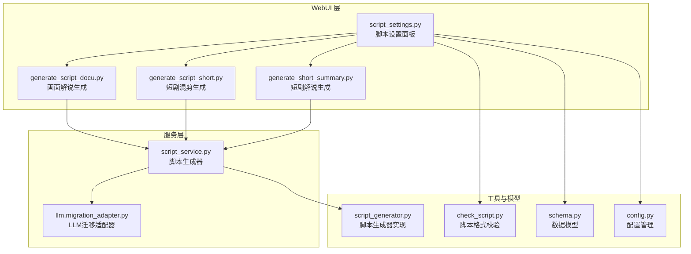
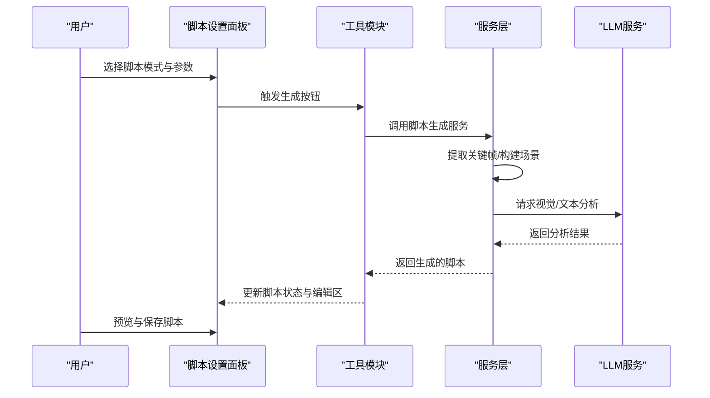
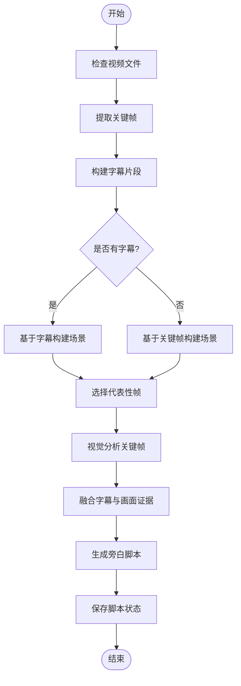
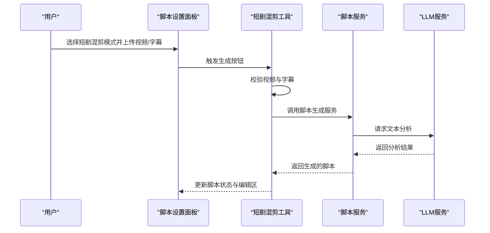
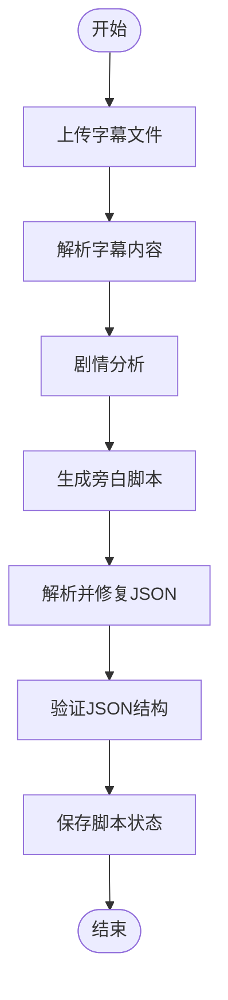
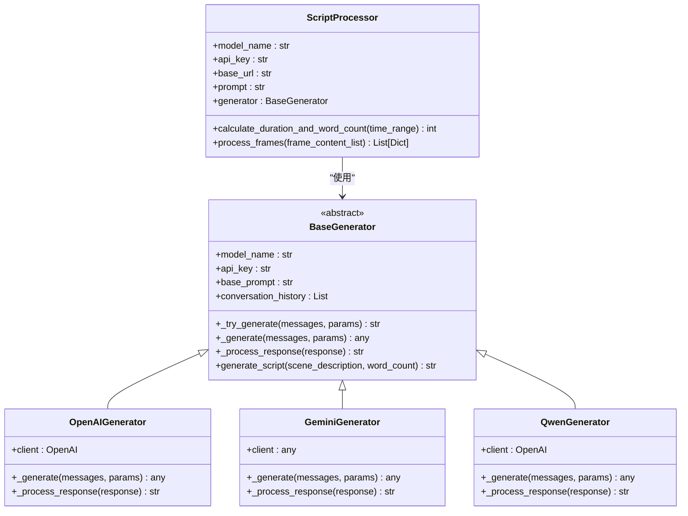
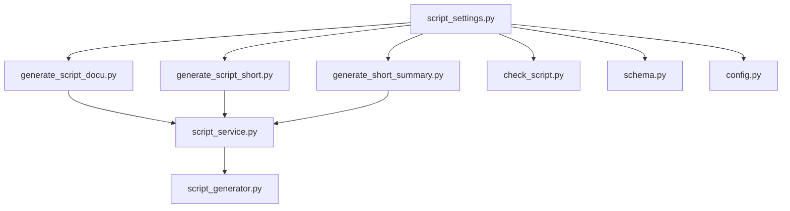

# 脚本设置面板

<cite>
**本文档引用的文件**
- [webui/components/script_settings.py](file://webui/components/script_settings.py)
- [webui/tools/generate_script_docu.py](file://webui/tools/generate_script_docu.py)
- [webui/tools/generate_script_short.py](file://webui/tools/generate_script_short.py)
- [webui/tools/generate_short_summary.py](file://webui/tools/generate_short_summary.py)
- [app/models/schema.py](file://app/models/schema.py)
- [app/utils/check_script.py](file://app/utils/check_script.py)
- [app/services/script_service.py](file://app/services/script_service.py)
- [app/utils/script_generator.py](file://app/utils/script_generator.py)
- [app/config/config.py](file://app/config/config.py)
- [README.md](file://README.md)
</cite>

## 目录
1. [简介](#简介)
2. [项目结构](#项目结构)
3. [核心组件](#核心组件)
4. [架构概览](#架构概览)
5. [详细组件分析](#详细组件分析)
6. [依赖关系分析](#依赖关系分析)
7. [性能考量](#性能考量)
8. [故障排除指南](#故障排除指南)
9. [结论](#结论)
10. [附录](#附录)

## 简介
脚本设置面板是视频生成工作流中的关键入口，负责管理脚本生成、编辑与预览。它提供三种主要脚本生成模式：
- 画面解说（纪录片风格）：基于视频关键帧与字幕/ASR进行脚本生成
- 短剧混剪：基于字幕与自定义片段数量生成短视频脚本
- 短剧解说：基于字幕内容生成剧情总结与旁白脚本

该面板还支持脚本文件的上传、加载、保存与格式校验，并与LLM服务进行交互以生成高质量的视频脚本。

## 项目结构
脚本设置面板位于WebUI层，通过工具模块调用后端服务完成脚本生成与处理。核心文件组织如下：
- WebUI组件：负责用户界面渲染与参数收集
- 工具模块：封装具体脚本生成逻辑（画面解说、短剧混剪、短剧解说）
- 服务层：提供脚本生成的核心算法与LLM集成
- 数据模型：定义脚本参数与状态的数据结构
- 工具函数：提供脚本格式校验与生成器实现

**图表来源**
- [webui/components/script_settings.py:18-552](file://webui/components/script_settings.py#L18-L552)
- [webui/tools/generate_script_docu.py:23-179](file://webui/tools/generate_script_docu.py#L23-L179)
- [webui/tools/generate_script_short.py:13-128](file://webui/tools/generate_script_short.py#L13-L128)
- [webui/tools/generate_short_summary.py:138-290](file://webui/tools/generate_short_summary.py#L138-L290)
- [app/services/script_service.py:15-324](file://app/services/script_service.py#L15-L324)
- [app/utils/script_generator.py:433-642](file://app/utils/script_generator.py#L433-L642)
- [app/utils/check_script.py:5-111](file://app/utils/check_script.py#L5-L111)
- [app/models/schema.py:160-209](file://app/models/schema.py#L160-L209)
- [app/config/config.py:24-95](file://app/config/config.py#L24-L95)

**章节来源**
- [webui/components/script_settings.py:18-552](file://webui/components/script_settings.py#L18-L552)
- [README.md:105-141](file://README.md#L105-L141)

## 核心组件
脚本设置面板由以下核心组件构成：
- 脚本文件选择器：支持从本地脚本文件、上传脚本或自动模式间切换
- 视频文件选择器：支持本地视频上传与历史文件选择
- 画面解说参数：视频主题、生成提示词、关键帧间隔、批处理大小
- 短剧混剪参数：自定义片段数量
- 短剧解说参数：字幕上传、视频主题、温度系数
- 脚本操作按钮：生成、加载、保存脚本
- 脚本编辑区：展示与编辑JSON格式脚本

这些组件通过状态管理与事件回调实现参数的实时更新与脚本生成流程的驱动。

**章节来源**
- [webui/components/script_settings.py:51-552](file://webui/components/script_settings.py#L51-L552)

## 架构概览
脚本设置面板采用“WebUI组件 + 工具模块 + 服务层”的分层架构。用户在面板中选择生成模式并配置参数，工具模块根据模式调用相应的生成逻辑，服务层负责关键帧提取、LLM分析与脚本生成，最终将结果回填至面板状态供预览与保存。

**图表来源**
- [webui/components/script_settings.py:404-448](file://webui/components/script_settings.py#L404-L448)
- [webui/tools/generate_script_docu.py:23-109](file://webui/tools/generate_script_docu.py#L23-L109)
- [webui/tools/generate_script_short.py:13-128](file://webui/tools/generate_script_short.py#L13-L128)
- [webui/tools/generate_short_summary.py:138-290](file://webui/tools/generate_short_summary.py#L138-L290)
- [app/services/script_service.py:20-75](file://app/services/script_service.py#L20-L75)

## 详细组件分析

### 画面解说（纪录片风格）生成流程
画面解说是基于视频关键帧与字幕/ASR的脚本生成方式。流程包括关键帧提取、字幕/ASR处理、场景构建、代表性帧选择、视觉分析、证据融合与旁白生成。

**图表来源**
- [webui/tools/generate_script_docu.py:23-109](file://webui/tools/generate_script_docu.py#L23-L109)
- [app/services/script_service.py:20-75](file://app/services/script_service.py#L20-L75)

**章节来源**
- [webui/tools/generate_script_docu.py:23-109](file://webui/tools/generate_script_docu.py#L23-L109)
- [app/services/script_service.py:15-324](file://app/services/script_service.py#L15-L324)

### 短剧混剪生成流程
短剧混剪需要用户提供视频与字幕文件，系统根据自定义片段数量生成短视频脚本。流程包括参数校验、字幕解析、脚本生成与结果回填。

**图表来源**
- [webui/tools/generate_script_short.py:13-128](file://webui/tools/generate_script_short.py#L13-L128)
- [app/services/script_service.py:120-246](file://app/services/script_service.py#L120-L246)

**章节来源**
- [webui/tools/generate_script_short.py:13-128](file://webui/tools/generate_script_short.py#L13-L128)

### 短剧解说生成流程
短剧解说是基于字幕内容的剧情总结与旁白生成。流程包括字幕解析、剧情分析、旁白生成与JSON结构校验。

**图表来源**
- [webui/tools/generate_short_summary.py:138-290](file://webui/tools/generate_short_summary.py#L138-L290)

**章节来源**
- [webui/tools/generate_short_summary.py:138-290](file://webui/tools/generate_short_summary.py#L138-L290)

### 脚本参数配置详解
- 视频主题：用于画面解说模式的视频主题描述
- 生成提示词：自定义LLM提示词，为空时使用默认提示词
- 关键帧间隔（秒）：关键帧提取的时间间隔，影响token消耗
- 批处理大小：视觉分析的批处理大小，影响token消耗
- 自定义片段数量：短剧混剪模式下的片段数量
- 字幕上传：短剧解说模式下的字幕文件上传
- 视频主题（短剧）：短剧名称
- 温度系数：短剧解说模式下的生成温度

这些参数通过状态管理在面板中实时更新，并在生成时传递给相应的工具模块与服务层。

**章节来源**
- [webui/components/script_settings.py:291-401](file://webui/components/script_settings.py#L291-L401)

### 脚本生成工具使用方法
- 快速生成：在面板中选择对应模式并点击生成按钮，系统自动完成参数校验与脚本生成
- 自定义编辑：在脚本编辑区手动修改JSON格式脚本，完成后点击保存并进行格式校验
- 预览与修改：生成后可在编辑区查看脚本内容，进行必要的调整与优化

**章节来源**
- [webui/components/script_settings.py:404-448](file://webui/components/script_settings.py#L404-L448)
- [app/utils/check_script.py:5-111](file://app/utils/check_script.py#L5-L111)

### 与LLM服务的交互方式
脚本生成过程涉及多种LLM提供商（如Gemini、OpenAI、Qwen等）。系统通过统一的迁移适配器与脚本生成器实现跨提供商的无缝集成，支持OpenAI兼容接口与原生Gemini API等多种模式。

**图表来源**
- [app/utils/script_generator.py:13-80](file://app/utils/script_generator.py#L13-L80)
- [app/utils/script_generator.py:82-134](file://app/utils/script_generator.py#L82-L134)
- [app/utils/script_generator.py:136-153](file://app/utils/script_generator.py#L136-L153)
- [app/utils/script_generator.py:316-350](file://app/utils/script_generator.py#L316-L350)
- [app/utils/script_generator.py:433-571](file://app/utils/script_generator.py#L433-L571)

**章节来源**
- [app/utils/script_generator.py:433-642](file://app/utils/script_generator.py#L433-L642)

## 依赖关系分析
脚本设置面板的依赖关系清晰，遵循“低耦合、高内聚”的设计原则。WebUI组件仅负责界面与状态管理，工具模块封装具体业务逻辑，服务层提供核心算法与LLM集成，工具函数与模型定义支撑数据校验与结构约束。

**图表来源**
- [webui/components/script_settings.py:13-15](file://webui/components/script_settings.py#L13-L15)
- [webui/tools/generate_script_docu.py:11-20](file://webui/tools/generate_script_docu.py#L11-L20)
- [webui/tools/generate_script_short.py:8-10](file://webui/tools/generate_script_short.py#L8-L10)
- [webui/tools/generate_short_summary.py:17-23](file://webui/tools/generate_short_summary.py#L17-L23)
- [app/services/script_service.py:10-12](file://app/services/script_service.py#L10-L12)
- [app/utils/script_generator.py:13-27](file://app/utils/script_generator.py#L13-L27)
- [app/utils/check_script.py:1-4](file://app/utils/check_script.py#L1-L4)
- [app/models/schema.py:160-209](file://app/models/schema.py#L160-L209)
- [app/config/config.py:24-44](file://app/config/config.py#L24-L44)

**章节来源**
- [webui/components/script_settings.py:1-552](file://webui/components/script_settings.py#L1-L552)
- [app/models/schema.py:160-209](file://app/models/schema.py#L160-L209)

## 性能考量
- 关键帧提取与视觉分析：关键帧间隔与批处理大小直接影响token消耗与生成成本，建议根据视频复杂度与预算进行权衡
- 字幕质量：高质量字幕能显著提升脚本生成质量，建议优先使用准确的字幕文件
- LLM提供商选择：不同提供商的响应速度与成本差异较大，可根据需求选择合适的提供商与模型
- 缓存机制：关键帧提取结果具备缓存能力，可减少重复计算

## 故障排除指南
- 脚本格式错误：使用内置格式校验工具检查JSON结构，确保必需字段完整且格式正确
- LLM请求失败：检查API密钥、模型名称与基础URL配置，确认网络连接正常
- 关键帧提取失败：确认视频文件可读且路径正确，检查磁盘空间与权限
- 字幕解析异常：确保字幕文件编码正确（支持UTF-8、UTF-16、GBK、GB2312），文件内容非空

**章节来源**
- [app/utils/check_script.py:5-111](file://app/utils/check_script.py#L5-L111)
- [webui/tools/generate_script_docu.py:103-109](file://webui/tools/generate_script_docu.py#L103-L109)
- [webui/tools/generate_script_short.py:124-128](file://webui/tools/generate_script_short.py#L124-L128)
- [webui/tools/generate_short_summary.py:283-290](file://webui/tools/generate_short_summary.py#L283-L290)

## 结论
脚本设置面板提供了完整的脚本生成与编辑能力，支持多种生成模式与LLM提供商。通过合理的参数配置与流程优化，用户可以在保证质量的前提下高效生成符合需求的视频脚本。建议在实际使用中结合场景特点选择合适的模式与参数，并充分利用格式校验与缓存机制提升整体效率。

## 附录
- 快速开始：参考项目README中的快速启动指南，完成环境配置与API密钥设置
- 配置文件：复制示例配置文件并根据实际环境调整各项参数
- 版本信息：项目提供版本号读取与更新机制，确保使用最新功能与修复

**章节来源**
- [README.md:105-141](file://README.md#L105-L141)
- [app/config/config.py:12-95](file://app/config/config.py#L12-L95)