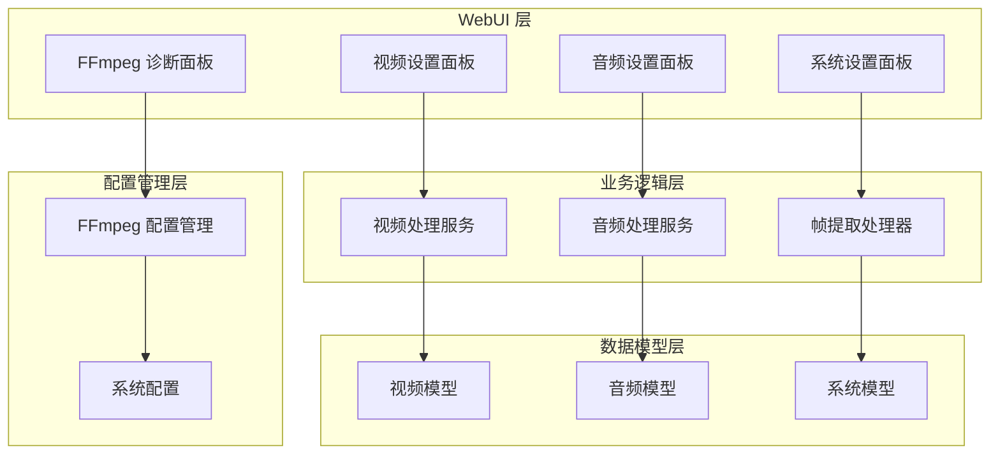
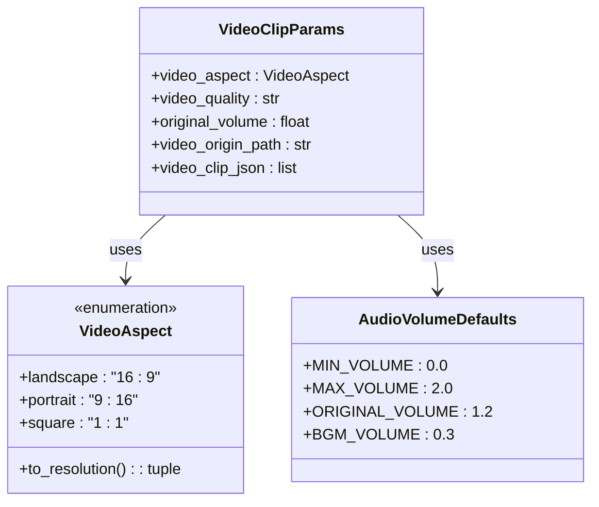
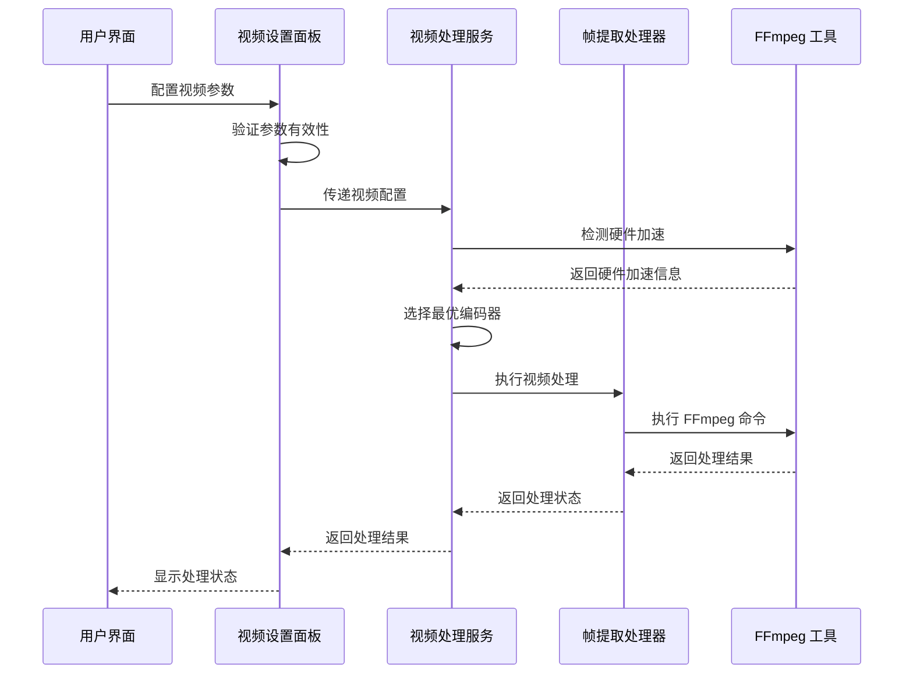
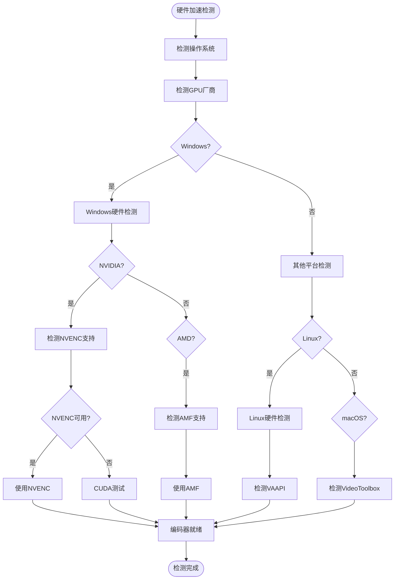
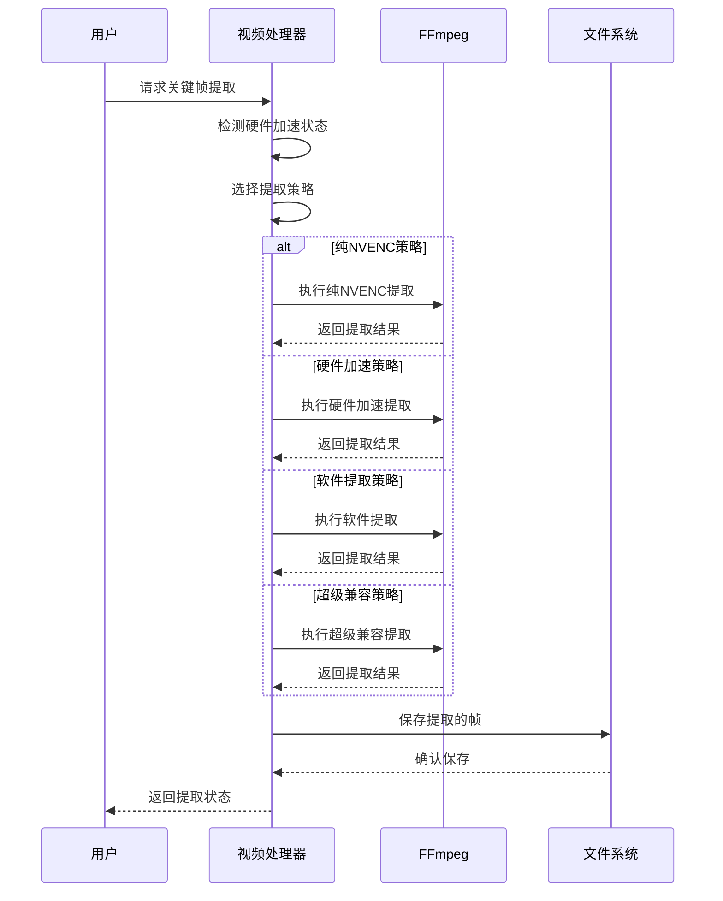
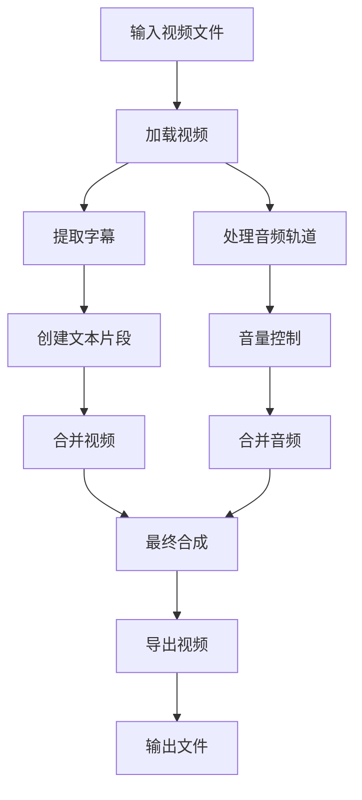
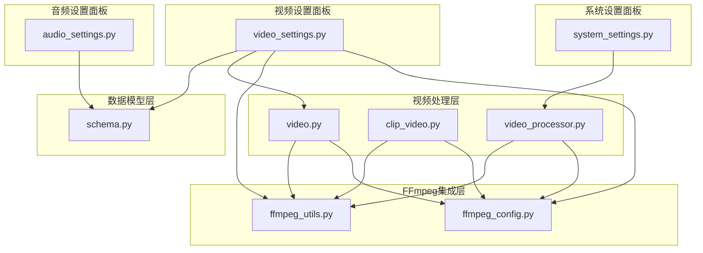
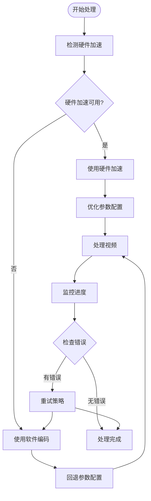

# 视频设置面板

<cite>
**本文档引用的文件**
- [webui/components/video_settings.py](file://webui/components/video_settings.py)
- [app/models/schema.py](file://app/models/schema.py)
- [app/services/video.py](file://app/services/video.py)
- [app/utils/video_processor.py](file://app/utils/video_processor.py)
- [app/utils/ffmpeg_utils.py](file://app/utils/ffmpeg_utils.py)
- [app/config/ffmpeg_config.py](file://app/config/ffmpeg_config.py)
- [app/services/clip_video.py](file://app/services/clip_video.py)
- [webui/components/ffmpeg_diagnostics.py](file://webui/components/ffmpeg_diagnostics.py)
- [webui/components/audio_settings.py](file://webui/components/audio_settings.py)
- [webui/components/system_settings.py](file://webui/components/system_settings.py)
</cite>

## 目录
1. [简介](#简介)
2. [项目结构](#项目结构)
3. [核心组件](#核心组件)
4. [架构概览](#架构概览)
5. [详细组件分析](#详细组件分析)
6. [依赖关系分析](#依赖关系分析)
7. [性能考虑](#性能考虑)
8. [故障排除指南](#故障排除指南)
9. [结论](#结论)
10. [附录](#附录)

## 简介

视频设置面板是 NarratoAI 视频处理系统的核心配置界面，负责管理视频参数配置、质量控制、格式支持和输出选项。该面板集成了完整的视频处理流程，从参数设置到最终输出，为用户提供直观易用的视频制作体验。

## 项目结构

视频设置面板位于 WebUI 层，通过 Streamlit 框架构建，与底层视频处理服务紧密集成：



**图表来源**
- [webui/components/video_settings.py:1-63](file://webui/components/video_settings.py#L1-L63)
- [app/services/video.py:1-418](file://app/services/video.py#L1-L418)
- [app/utils/video_processor.py:1-670](file://app/utils/video_processor.py#L1-L670)

**章节来源**
- [webui/components/video_settings.py:1-63](file://webui/components/video_settings.py#L1-L63)
- [app/models/schema.py:1-209](file://app/models/schema.py#L1-L209)

## 核心组件

### 视频设置面板主组件

视频设置面板采用模块化设计，包含以下核心功能模块：

- **视频比例配置**：支持多种视频比例选项
- **视频质量设置**：提供从 4K 到 SD 的多级质量选择
- **音量控制**：原声音量调节功能
- **参数状态管理**：通过 session_state 实现参数持久化

### 数据模型支持

系统使用 Pydantic 数据模型确保参数配置的一致性和有效性：



**图表来源**
- [app/models/schema.py:160-209](file://app/models/schema.py#L160-L209)

**章节来源**
- [app/models/schema.py:16-209](file://app/models/schema.py#L16-L209)
- [webui/components/video_settings.py:13-62](file://webui/components/video_settings.py#L13-L62)

## 架构概览

视频设置面板在整个系统架构中扮演着关键角色，连接用户界面与底层视频处理服务：



**图表来源**
- [app/services/video.py:370-409](file://app/services/video.py#L370-L409)
- [app/utils/ffmpeg_utils.py:252-355](file://app/utils/ffmpeg_utils.py#L252-L355)

## 详细组件分析

### 视频参数配置模块

#### 视频比例设置

视频比例配置支持多种常见的视频比例选项：

| 比例类型 | 比例值 | 适用场景 | 分辨率 |
|---------|--------|----------|--------|
| 纵向视频 | 9:16 | 社交媒体短视频 | 1080×1920 |
| 横向视频 | 16:9 | 传统电视/电影 | 1920×1080 |
| 正方形 | 1:1 | Instagram Stories | 1080×1080 |
| 4:3 | 4:3 | 传统电视 | 1440×1080 |

#### 视频质量配置

系统提供多级视频质量选择，满足不同场景需求：

```mermaid
flowchart TD
Start([开始配置]) --> QualitySelect[选择视频质量]
QualitySelect --> QualityOptions{
选择的质量级别
}
QualityOptions --> |4K (2160p)| Resolution4K[3840×2160<br/>8K像素]
QualityOptions --> |2K (1440p)| Resolution2K[2560×1440<br/>3.6K像素]
QualityOptions --> |Full HD (1080p)| Resolution1080[1920×1080<br/>2.1K像素]
QualityOptions --> |HD (720p)| Resolution720[1280×720<br>1K像素]
QualityOptions --> |SD (480p)| Resolution480[854×480<br>416K像素]
Resolution4K --> QualitySettings[设置质量参数]
Resolution2K --> QualitySettings
Resolution1080 --> QualitySettings
Resolution720 --> QualitySettings
Resolution480 --> QualitySettings
QualitySettings --> Output[生成视频参数]
Output --> End([配置完成])
```

**图表来源**
- [webui/components/video_settings.py:28-42](file://webui/components/video_settings.py#L28-L42)

#### 音量控制配置

音量控制系统提供精确的音频调节功能：

- **原声音量**：默认 120%，可调节范围 0-200%
- **背景音乐音量**：默认 30%，可调节范围 0-100%
- **语音音量**：默认 100%，可调节范围 0-200%

**章节来源**
- [webui/components/video_settings.py:13-62](file://webui/components/video_settings.py#L13-L62)
- [app/models/schema.py:16-35](file://app/models/schema.py#L16-L35)

### FFmpeg 集成模块

#### 硬件加速检测

系统具备智能的硬件加速检测和配置功能：



**图表来源**
- [app/utils/ffmpeg_utils.py:252-355](file://app/utils/ffmpeg_utils.py#L252-L355)

#### 编码器配置策略

系统根据硬件条件自动选择最优的编码器配置：

| 平台 | 推荐编码器 | 配置特点 | 性能等级 |
|------|------------|----------|----------|
| NVIDIA | h264_nvenc | 纯编码器模式，避免滤镜链问题 | ⭐⭐⭐⭐⭐ |
| AMD | h264_amf | AMD Media Foundation | ⭐⭐⭐⭐ |
| Intel | h264_qsv | Quick Sync Video | ⭐⭐⭐ |
| macOS | h264_videotoolbox | VideoToolbox | ⭐⭐⭐ |
| Linux | h264_vaapi | VAAPI硬件加速 | ⭐⭐⭐ |
| 软件编码 | libx264 | CPU软件编码 | ⭐⭐ |

**章节来源**
- [app/utils/ffmpeg_utils.py:252-355](file://app/utils/ffmpeg_utils.py#L252-L355)
- [app/config/ffmpeg_config.py:31-96](file://app/config/ffmpeg_config.py#L31-L96)

### 视频处理流程

#### 关键帧提取功能

系统提供高效的关键帧提取功能，支持多种提取策略：



**图表来源**
- [app/utils/video_processor.py:188-220](file://app/utils/video_processor.py#L188-L220)

#### 视频合并处理

视频合并功能支持多轨道合成，包括视频、字幕、背景音乐和解说音频：



**图表来源**
- [app/services/video.py:200-418](file://app/services/video.py#L200-L418)

**章节来源**
- [app/utils/video_processor.py:89-186](file://app/utils/video_processor.py#L89-L186)
- [app/services/video.py:200-418](file://app/services/video.py#L200-L418)

## 依赖关系分析

### 组件耦合关系

视频设置面板与其他组件之间存在清晰的依赖关系：



**图表来源**
- [webui/components/video_settings.py:1-63](file://webui/components/video_settings.py#L1-L63)
- [app/services/video.py:1-418](file://app/services/video.py#L1-L418)
- [app/utils/video_processor.py:1-670](file://app/utils/video_processor.py#L1-L670)

### 外部依赖管理

系统对外部依赖进行集中管理，确保兼容性和可维护性：

| 依赖类型 | 依赖名称 | 版本要求 | 用途 |
|----------|----------|----------|------|
| 视频处理 | FFmpeg | ≥4.0 | 视频编解码和处理 |
| 图像处理 | Pillow | ≥8.0 | 图像格式转换 |
| 音频处理 | MoviePy | ≥1.0 | 音频轨道处理 |
| 前端框架 | Streamlit | ≥1.0 | 用户界面构建 |
| 日志管理 | Loguru | ≥0.5 | 日志记录和管理 |

**章节来源**
- [webui/components/video_settings.py:1-63](file://webui/components/video_settings.py#L1-L63)
- [app/utils/ffmpeg_utils.py:1-1121](file://app/utils/ffmpeg_utils.py#L1-L1121)

## 性能考虑

### 硬件加速优化

系统通过智能硬件加速检测和配置实现性能优化：

#### 性能基准对比

| 配置方案 | 处理速度 | 质量影响 | 兼容性 |
|----------|----------|----------|--------|
| 纯NVENC | ⭐⭐⭐⭐⭐ | 优秀 | ⭐⭐⭐⭐ |
| AMD AMF | ⭐⭐⭐⭐ | 优秀 | ⭐⭐⭐⭐ |
| Intel QSV | ⭐⭐⭐ | 良好 | ⭐⭐⭐⭐⭐ |
| VideoToolbox | ⭐⭐⭐⭐ | 优秀 | ⭐⭐⭐⭐⭐ |
| 软件编码 | ⭐⭐ | 良好 | ⭐⭐⭐⭐⭐ |

#### 内存使用优化

系统采用流式处理和资源管理机制：

- **内存池管理**：视频片段资源自动释放
- **渐进式降级**：硬件加速失败时自动切换到软件编码
- **批量处理**：支持多视频并发处理

### 处理速度优化策略



**图表来源**
- [app/services/clip_video.py:230-302](file://app/services/clip_video.py#L230-L302)

## 故障排除指南

### 常见问题及解决方案

#### FFmpeg 安装问题

**问题症状**：FFmpeg 未安装或不在 PATH 中

**解决方案**：
1. 下载并安装 FFmpeg（版本 ≥4.0）
2. 将 FFmpeg 添加到系统 PATH 环境变量
3. 重启应用程序以重新检测

#### 硬件加速兼容性问题

**问题症状**：出现滤镜链错误或编码器错误

**解决方案**：
1. 在设置中选择兼容性配置
2. 点击"强制禁用硬件加速"
3. 重新尝试视频处理
4. 更新显卡驱动程序

#### 性能问题

**问题症状**：处理速度缓慢

**优化建议**：
1. 启用硬件加速（如果可用）
2. 选择高性能配置
3. 降低视频质量设置
4. 关闭其他占用 GPU 的程序

**章节来源**
- [webui/components/ffmpeg_diagnostics.py:201-281](file://webui/components/ffmpeg_diagnostics.py#L201-L281)
- [app/services/clip_video.py:304-342](file://app/services/clip_video.py#L304-L342)

### 系统清理功能

系统提供便捷的缓存清理功能：

| 清理项目 | 功能描述 | 存储位置 |
|----------|----------|----------|
| 关键帧缓存 | 清理提取的关键帧 | temp/keyframes |
| 视频片段缓存 | 清理生成的视频片段 | temp/clip_video |
| 任务缓存 | 清理已完成的任务 | tasks |

**章节来源**
- [webui/components/system_settings.py:9-46](file://webui/components/system_settings.py#L9-L46)

## 结论

视频设置面板作为 NarratoAI 的核心组件，通过模块化设计和智能配置管理，为用户提供了强大而易用的视频处理功能。系统具备以下优势：

1. **全面的功能覆盖**：从参数配置到最终输出的完整流程
2. **智能的硬件加速**：自动检测和配置最优的编码器
3. **强大的兼容性**：支持多种平台和硬件配置
4. **优秀的性能表现**：通过多策略优化确保处理效率
5. **完善的故障排除**：提供详细的诊断和解决方案

通过合理的参数配置和优化策略，用户可以在保证视频质量的同时，实现高效的视频处理流程。

## 附录

### 参数配置示例

#### 高质量视频配置
- 视频比例：16:9（横向）
- 视频质量：4K (2160p)
- 原声音量：120%
- 背景音乐：30%
- 编码器：自动选择最优硬件编码器

#### 移动端适配配置
- 视频比例：9:16（纵向）
- 视频质量：1080p
- 原声音量：120%
- 背景音乐：30%
- 编码器：h264_nvenc（NVIDIA）

#### 性能优化配置
- 视频比例：16:9
- 视频质量：720p
- 原声音量：120%
- 背景音乐：30%
- 编码器：软件编码（libx264）

### 性能优化建议

1. **硬件选择**：优先选择支持硬件加速的显卡
2. **内存配置**：确保有足够的系统内存处理高分辨率视频
3. **存储优化**：使用高速 SSD 存储中间文件
4. **网络配置**：对于在线服务，确保稳定的网络连接
5. **定期维护**：定期清理缓存和临时文件