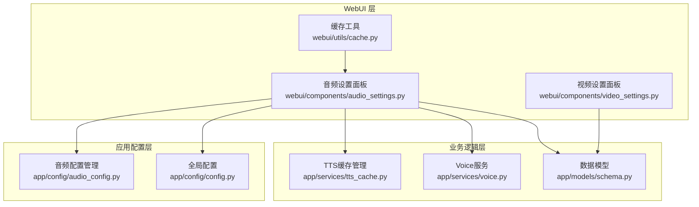
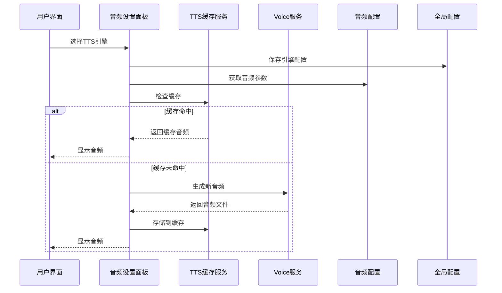
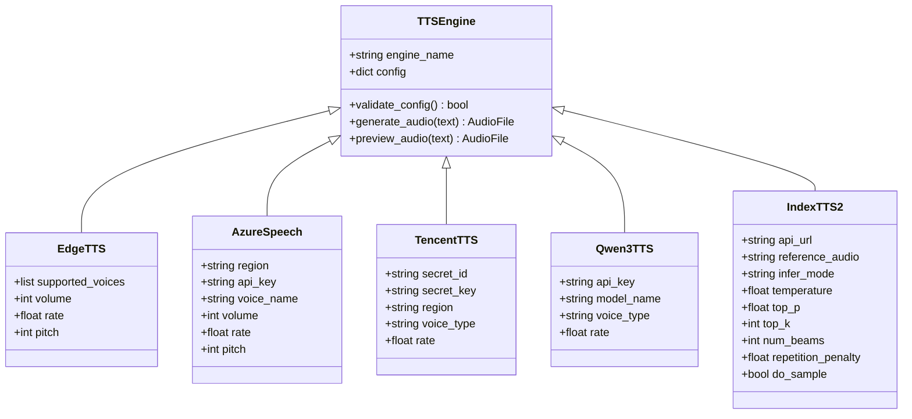
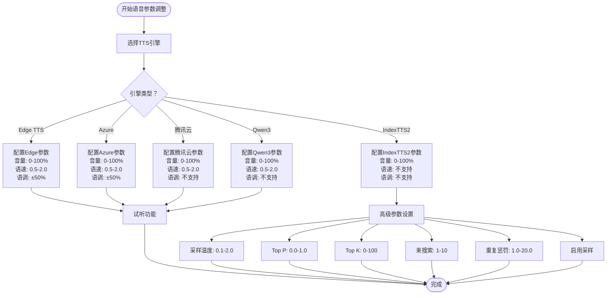
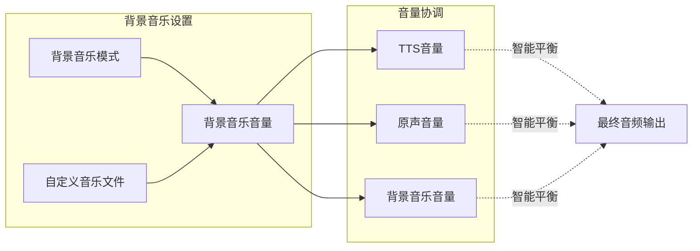
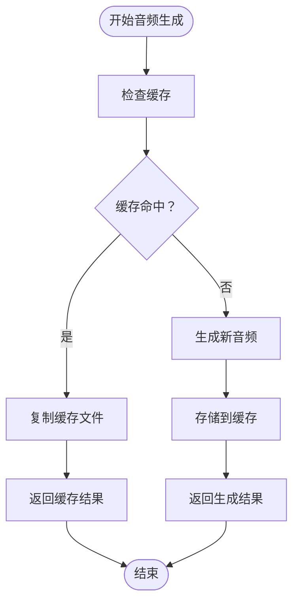
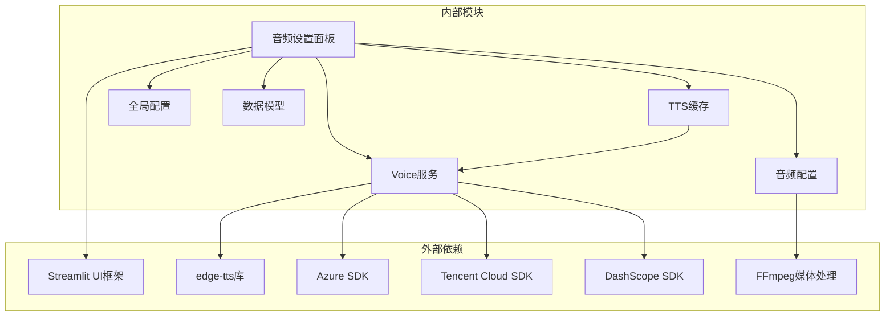

# 音频设置面板

<cite>
**本文档引用的文件**
- [audio_settings.py](file://webui/components/audio_settings.py)
- [audio_config.py](file://app/config/audio_config.py)
- [tts_cache.py](file://app/services/tts_cache.py)
- [voice.py](file://app/services/voice.py)
- [config.py](file://app/config/config.py)
- [schema.py](file://app/models/schema.py)
- [cache.py](file://webui/utils/cache.py)
- [video_settings.py](file://webui/components/video_settings.py)
</cite>

## 目录
1. [简介](#简介)
2. [项目结构](#项目结构)
3. [核心组件](#核心组件)
4. [架构概览](#架构概览)
5. [详细组件分析](#详细组件分析)
6. [依赖关系分析](#依赖关系分析)
7. [性能考虑](#性能考虑)
8. [故障排除指南](#故障排除指南)
9. [结论](#结论)

## 简介

音频设置面板是NarratoAI项目中的关键组件，负责管理整个音频处理流程中的各种配置选项。该面板提供了完整的TTS（文本转语音）引擎选择、语音参数调整、背景音乐配置以及音频缓存管理功能。

音频设置面板在整个音频处理流程中扮演着至关重要的角色：
- 作为用户界面入口，提供直观的音频配置体验
- 统一管理多种TTS引擎的配置参数
- 控制音频质量和处理流程
- 优化音频性能和资源使用

## 项目结构

音频设置面板位于WebUI组件层，与配置管理和业务逻辑层紧密集成：

**图表来源**
- [audio_settings.py:1-944](file://webui/components/audio_settings.py#L1-L944)
- [audio_config.py:1-221](file://app/config/audio_config.py#L1-L221)
- [tts_cache.py:1-125](file://app/services/tts_cache.py#L1-L125)

**章节来源**
- [audio_settings.py:1-944](file://webui/components/audio_settings.py#L1-L944)
- [audio_config.py:1-221](file://app/config/audio_config.py#L1-L221)
- [config.py:1-95](file://app/config/config.py#L1-L95)

## 核心组件

音频设置面板由以下核心组件构成：

### 1. TTS引擎选择器
支持多种TTS引擎，包括：
- Edge TTS（完全免费）
- Azure Speech Services（企业级）
- 腾讯云TTS（中文优化）
- 通义千问Qwen3 TTS（阿里云）
- IndexTTS2（语音克隆）

### 2. 语音参数控制系统
提供精确的语音参数调节：
- 音量控制（0-100%）
- 语速调节（0.5-2.0倍速）
- 语调调节（±50%）

### 3. 背景音乐管理系统
支持多种背景音乐模式：
- 无背景音乐
- 随机背景音乐
- 自定义背景音乐文件

### 4. 音频缓存机制
实现智能缓存管理，避免重复生成相同的音频内容。

**章节来源**
- [audio_settings.py:22-66](file://webui/components/audio_settings.py#L22-L66)
- [audio_settings.py:95-153](file://webui/components/audio_settings.py#L95-L153)
- [audio_settings.py:894-944](file://webui/components/audio_settings.py#L894-L944)

## 架构概览

音频设置面板采用分层架构设计，确保各组件间的松耦合和高内聚：

**图表来源**
- [audio_settings.py:706-782](file://webui/components/audio_settings.py#L706-L782)
- [tts_cache.py:45-94](file://app/services/tts_cache.py#L45-L94)
- [voice.py:1-800](file://app/services/voice.py#L1-L800)

## 详细组件分析

### TTS引擎选择与配置

#### Edge TTS引擎
Edge TTS是最简单的TTS选项，完全免费但功能有限：
- 支持中文和英文音色
- 音色选择相对简单
- 适合测试和轻量使用

#### Azure Speech Services
企业级TTS服务，提供稳定的服务质量：
- 需要API密钥和区域配置
- 支持多种语言和音色
- 适合生产环境使用

#### 腾讯云TTS
针对中文用户的优化TTS服务：
- 优秀的中文音质
- 多种中文音色选择
- 国内访问速度快

#### 通义千问Qwen3 TTS
阿里云提供的高质量中文TTS：
- 支持多种方言和口音
- 优秀的中文语音合成
- 适合中文内容创作

#### IndexTTS2语音克隆
先进的语音克隆技术：
- 零样本语音克隆
- 需要参考音频进行训练
- 高质量的个性化语音

**图表来源**
- [audio_settings.py:155-704](file://webui/components/audio_settings.py#L155-L704)
- [audio_settings.py:22-66](file://webui/components/audio_settings.py#L22-L66)

**章节来源**
- [audio_settings.py:22-66](file://webui/components/audio_settings.py#L22-L66)
- [audio_settings.py:155-704](file://webui/components/audio_settings.py#L155-L704)

### 语音参数调整

语音参数控制系统提供精细化的音频调节能力：

#### 音量控制
- 范围：0-100%
- 影响所有TTS引擎
- 实时预览功能

#### 语速调节
- 范围：0.5-2.0倍速
- 不同引擎支持不同的调节精度
- Edge TTS支持连续调节
- 其他引擎支持离散选项

#### 语调调节
- 范围：±50%
- 将百分比转换为比例值
- 不同引擎支持程度不同

**图表来源**
- [audio_settings.py:231-255](file://webui/components/audio_settings.py#L231-L255)
- [audio_settings.py:335-371](file://webui/components/audio_settings.py#L335-L371)
- [audio_settings.py:557-572](file://webui/components/audio_settings.py#L557-L572)
- [audio_settings.py:618-700](file://webui/components/audio_settings.py#L618-L700)

**章节来源**
- [audio_settings.py:231-255](file://webui/components/audio_settings.py#L231-L255)
- [audio_settings.py:335-371](file://webui/components/audio_settings.py#L335-L371)
- [audio_settings.py:557-572](file://webui/components/audio_settings.py#L557-L572)
- [audio_settings.py:618-700](file://webui/components/audio_settings.py#L618-L700)

### 背景音乐设置

背景音乐管理系统提供灵活的音频混合选项：

#### 背景音乐模式
- **无背景音乐**：仅使用TTS语音
- **随机背景音乐**：系统自动选择合适的背景音乐
- **自定义背景音乐**：用户指定特定的音乐文件

#### 音量控制
- 背景音乐音量独立控制
- 与TTS音量和原声音量协调
- 支持实时预览

**图表来源**
- [audio_settings.py:894-944](file://webui/components/audio_settings.py#L894-L944)

**章节来源**
- [audio_settings.py:894-944](file://webui/components/audio_settings.py#L894-L944)

### 音频缓存管理

音频缓存系统通过智能键值生成和文件组织实现高效的重复利用：

#### 缓存键值生成
缓存键值基于以下因素生成：
- 文本内容（narration）
- 语音名称（voice_name）
- 语速（voice_rate）
- 语调（voice_pitch）
- TTS引擎（tts_engine）

#### 缓存存储结构
每个缓存条目包含：
- `audio.mp3`：生成的音频文件
- `subtitle.srt`：可选的字幕文件
- `meta.json`：元数据信息（时长、时间戳等）

**图表来源**
- [tts_cache.py:45-94](file://app/services/tts_cache.py#L45-L94)
- [tts_cache.py:97-125](file://app/services/tts_cache.py#L97-L125)

**章节来源**
- [tts_cache.py:24-34](file://app/services/tts_cache.py#L24-L34)
- [tts_cache.py:45-94](file://app/services/tts_cache.py#L45-L94)
- [tts_cache.py:97-125](file://app/services/tts_cache.py#L97-L125)

### 音频质量参数

音频质量配置由专门的AudioConfig类管理，提供标准化的参数设置：

#### 采样率配置
- 默认：44100 Hz（CD质量）
- 支持更高采样率的扩展配置

#### 声道配置
- 默认：立体声（2声道）
- 支持单声道配置

#### 比特率配置
- 默认：128 kbps（平衡质量与文件大小）
- 可根据需求调整质量级别

#### 音频处理参数
- 智能音量调整：启用/禁用
- 音频标准化：响度归一化
- 目标响度：-20 LUFS
- 最大峰值：-1 dBFS

**章节来源**
- [audio_config.py:26-47](file://app/config/audio_config.py#L26-L47)

## 依赖关系分析

音频设置面板的依赖关系体现了清晰的分层架构：

**图表来源**
- [audio_settings.py:1-10](file://webui/components/audio_settings.py#L1-L10)
- [voice.py:1-25](file://app/services/voice.py#L1-L25)
- [config.py:60-70](file://app/config/config.py#L60-L70)

**章节来源**
- [audio_settings.py:1-10](file://webui/components/audio_settings.py#L1-L10)
- [voice.py:1-25](file://app/services/voice.py#L1-L25)
- [config.py:60-70](file://app/config/config.py#L60-L70)

## 性能考虑

### 缓存优化策略
1. **智能键值生成**：基于内容和参数的MD5哈希
2. **增量更新**：只重新生成缺失的部分
3. **内存缓存**：session_state中的临时缓存

### 并发处理
- 多线程音频生成
- 异步TTS引擎调用
- 非阻塞UI更新

### 资源管理
- 临时文件自动清理
- 内存使用监控
- 磁盘空间管理

## 故障排除指南

### 常见问题及解决方案

#### TTS引擎配置问题
**问题**：Azure Speech Services配置无效
**解决方案**：
1. 检查API密钥格式
2. 验证服务区域设置
3. 确认网络连接

#### 音频生成失败
**问题**：语音合成过程中断
**解决方案**：
1. 检查网络连接
2. 验证引擎配置
3. 查看日志错误信息

#### 缓存问题
**问题**：缓存文件损坏或过期
**解决方案**：
1. 清理缓存目录
2. 重新生成音频
3. 检查磁盘空间

**章节来源**
- [audio_settings.py:322-330](file://webui/components/audio_settings.py#L322-L330)
- [tts_cache.py:88-90](file://app/services/tts_cache.py#L88-L90)

## 结论

音频设置面板作为NarratoAI项目的核心组件，提供了完整而灵活的音频处理解决方案。通过支持多种TTS引擎、精细的参数控制、智能缓存管理和优化的性能架构，该面板能够满足从个人用户到企业级应用的各种音频处理需求。

关键优势包括：
- **多引擎支持**：覆盖主要TTS提供商
- **参数灵活性**：提供全面的音频调节选项
- **性能优化**：智能缓存和并发处理
- **用户体验**：直观的界面和实时预览

未来可以考虑的功能增强：
- 更多TTS引擎的支持
- AI驱动的参数优化
- 批量音频处理
- 高级音频效果处理