# 代码架构设计

<cite>
**本文档引用的文件**
- [schema.py](file://app/models/schema.py)
- [const.py](file://app/models/const.py)
- [state.py](file://app/services/state.py)
- [task.py](file://app/services/task.py)
- [config.py](file://app/config/config.py)
- [material.py](file://app/services/material.py)
- [video_service.py](file://app/services/video_service.py)
- [merger_video.py](file://app/services/merger_video.py)
- [audio_merger.py](file://app/services/audio_merger.py)
- [subtitle_merger.py](file://app/services/subtitle_merger.py)
- [generate_video.py](file://app/services/generate_video.py)
- [scene_builder.py](file://app/services/scene_builder.py)
- [subtitle_pipeline.py](file://app/services/subtitle_pipeline.py)
- [llm.py](file://app/services/llm.py)
- [voice.py](file://app/services/voice.py)
</cite>

## 目录
1. [引言](#引言)
2. [项目结构](#项目结构)
3. [核心组件](#核心组件)
4. [架构概览](#架构概览)
5. [详细组件分析](#详细组件分析)
6. [依赖分析](#依赖分析)
7. [性能考虑](#性能考虑)
8. [故障排除指南](#故障排除指南)
9. [结论](#结论)

## 引言

NarratoAI 是一个基于 Python 的视频生成和编辑系统，专注于自动化短视频内容创作。该系统采用分层架构设计，实现了表现层、业务层和数据层的有效分离，同时通过模块化组织策略和插件化设计思想，提供了高度可扩展的视频处理能力。

系统的核心设计理念包括：
- **分层架构**：清晰的三层架构分离关注点
- **模块化设计**：按功能域划分的独立模块
- **插件化扩展**：支持多种 LLM 提供商和音频引擎
- **状态管理**：统一的任务状态跟踪机制
- **数据驱动**：基于 Pydantic 的强类型数据模型

## 项目结构

NarratoAI 采用典型的分层项目结构，主要分为以下几个层次：

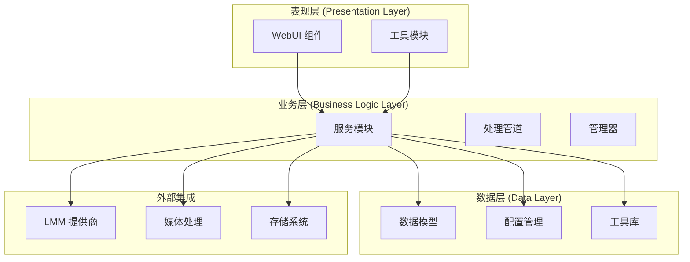

**图表来源**
- [config.py:1-95](file://app/config/config.py#L1-L95)
- [schema.py:1-209](file://app/models/schema.py#L1-L209)

**章节来源**
- [config.py:1-95](file://app/config/config.py#L1-L95)
- [schema.py:1-209](file://app/models/schema.py#L1-L209)

## 核心组件

### 数据模型体系

系统采用 Pydantic 构建了完整的数据模型体系，确保数据的类型安全和验证。

#### 核心数据模型

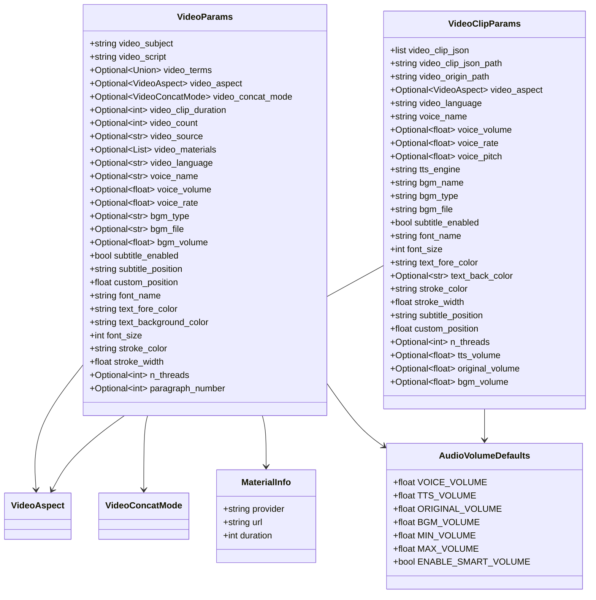

**图表来源**
- [schema.py:16-209](file://app/models/schema.py#L16-L209)

#### 枚举类型设计

系统定义了多个枚举类型来确保数据的一致性和有效性：

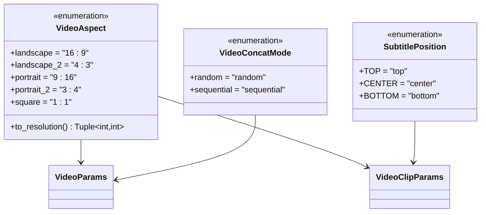

**图表来源**
- [schema.py:37-209](file://app/models/schema.py#L37-L209)

**章节来源**
- [schema.py:16-209](file://app/models/schema.py#L16-L209)
- [const.py:1-26](file://app/models/const.py#L1-L26)

### 状态管理系统

系统实现了灵活的状态管理机制，支持内存和 Redis 两种存储后端：

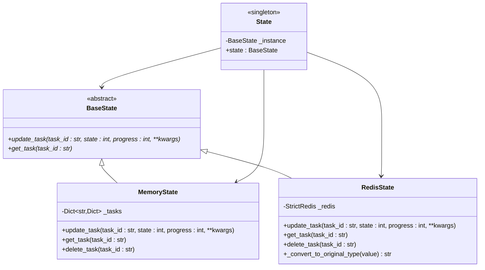

**图表来源**
- [state.py:8-123](file://app/services/state.py#L8-L123)

**章节来源**
- [state.py:8-123](file://app/services/state.py#L8-L123)

### 任务执行框架

系统采用统一的任务执行框架，封装了完整的视频处理流程：

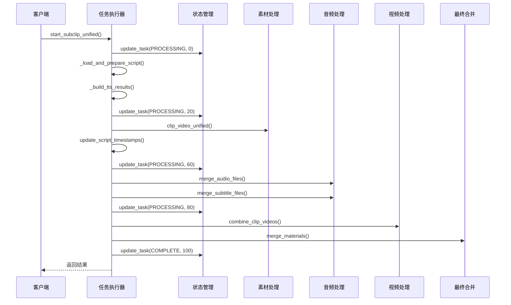

**图表来源**
- [task.py:195-247](file://app/services/task.py#L195-L247)

**章节来源**
- [task.py:1-272](file://app/services/task.py#L1-L272)

## 架构概览

NarratoAI 采用了经典的三层架构设计，实现了关注点的清晰分离：

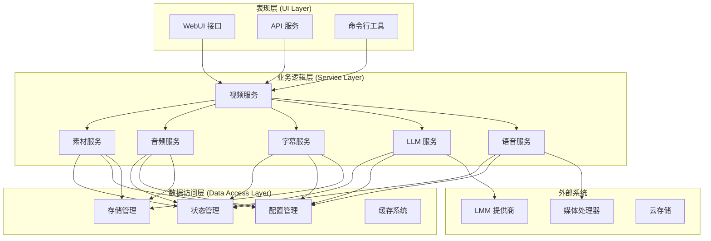

**图表来源**
- [video_service.py:9-56](file://app/services/video_service.py#L9-L56)
- [material.py:1-580](file://app/services/material.py#L1-L580)
- [llm.py:1-809](file://app/services/llm.py#L1-L809)

## 详细组件分析

### 视频素材管理模块

视频素材管理模块负责视频的搜索、下载、裁剪和合并等功能：

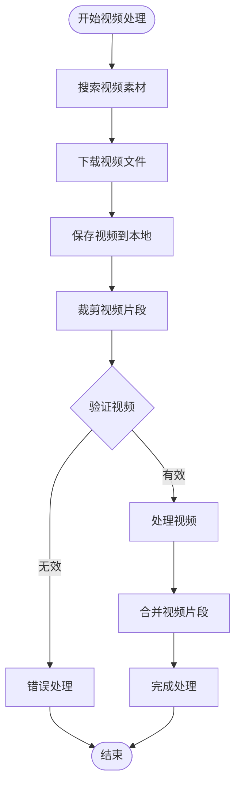

**图表来源**
- [material.py:190-254](file://app/services/material.py#L190-L254)

#### 核心功能实现

系统支持多种视频素材提供商，包括 Pexels 和 Pixabay：

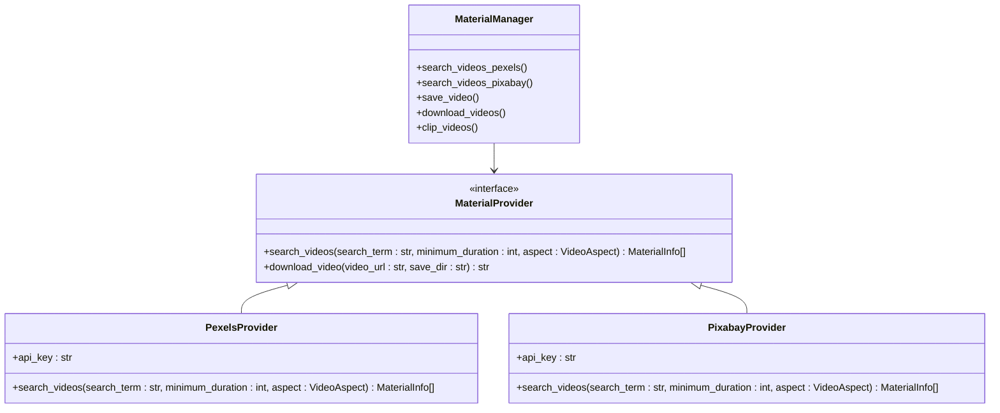

**图表来源**
- [material.py:39-254](file://app/services/material.py#L39-L254)

**章节来源**
- [material.py:1-580](file://app/services/material.py#L1-L580)

### 音频处理模块

音频处理模块实现了复杂的音频合成和音量管理功能：

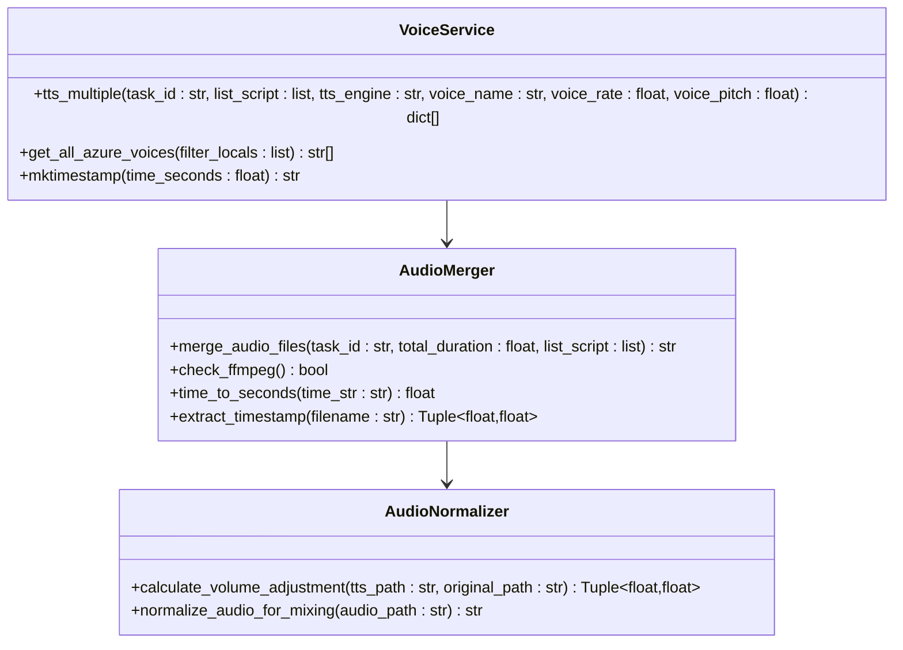

**图表来源**
- [audio_merger.py:21-172](file://app/services/audio_merger.py#L21-L172)
- [generate_video.py:66-510](file://app/services/generate_video.py#L66-L510)
- [voice.py:1-800](file://app/services/voice.py#L1-L800)

#### 音频合成流程

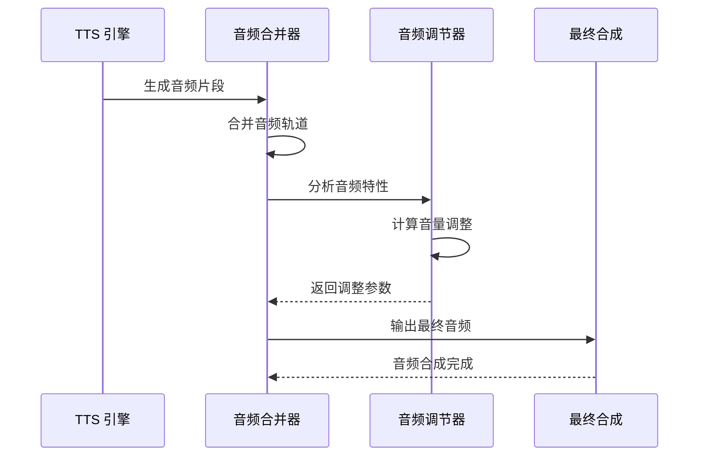

**图表来源**
- [audio_merger.py:21-77](file://app/services/audio_merger.py#L21-L77)
- [generate_video.py:196-230](file://app/services/generate_video.py#L196-L230)

**章节来源**
- [audio_merger.py:1-172](file://app/services/audio_merger.py#L1-L172)
- [generate_video.py:1-510](file://app/services/generate_video.py#L1-L510)
- [voice.py:1-800](file://app/services/voice.py#L1-L800)

### 字幕处理模块

字幕处理模块提供了完整的字幕生成、同步和合并功能：

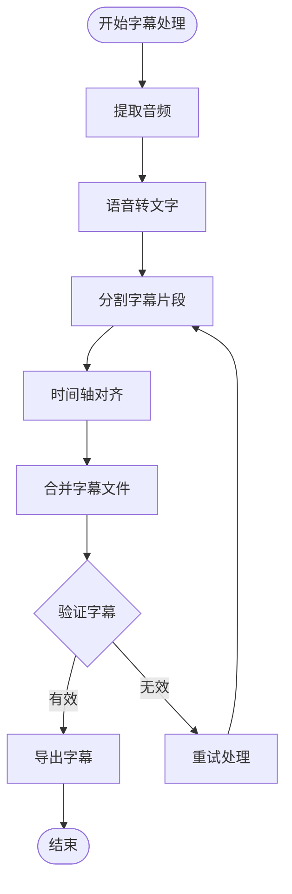

**图表来源**
- [subtitle_pipeline.py:33-64](file://app/services/subtitle_pipeline.py#L33-L64)

#### 字幕合并算法

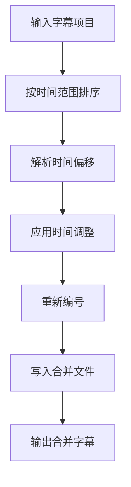

**图表来源**
- [subtitle_merger.py:62-186](file://app/services/subtitle_merger.py#L62-L186)

**章节来源**
- [subtitle_pipeline.py:1-64](file://app/services/subtitle_pipeline.py#L1-L64)
- [subtitle_merger.py:1-239](file://app/services/subtitle_merger.py#L1-L239)

### LLM 集成模块

LLM 集成模块支持多种大语言模型提供商，实现了灵活的插件化架构：

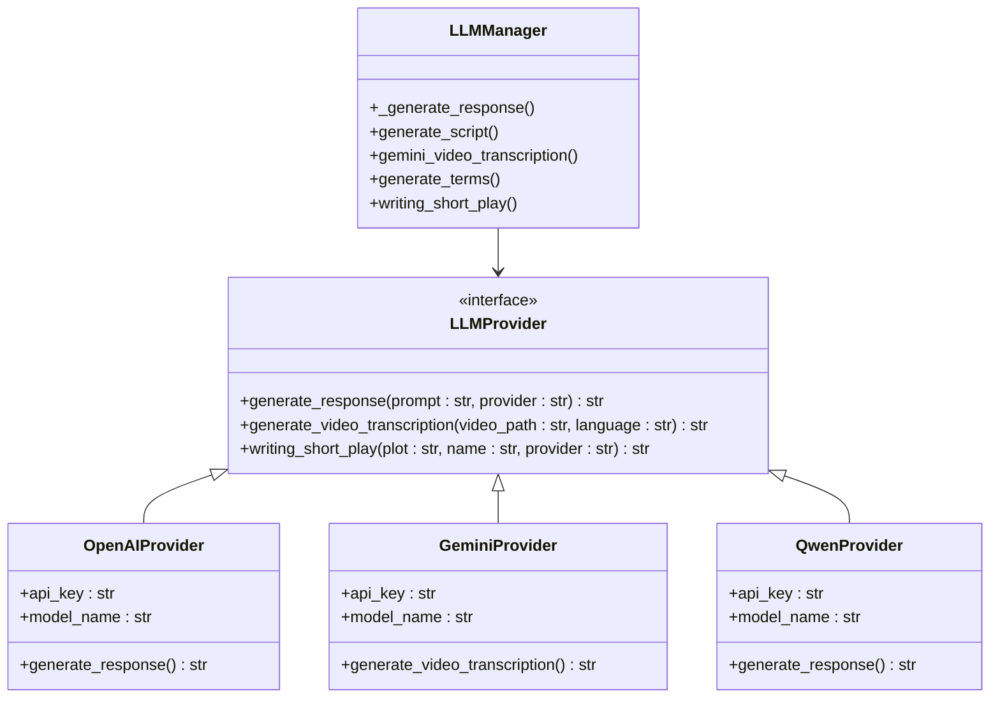

**图表来源**
- [llm.py:134-354](file://app/services/llm.py#L134-L354)

#### LLM 处理流程

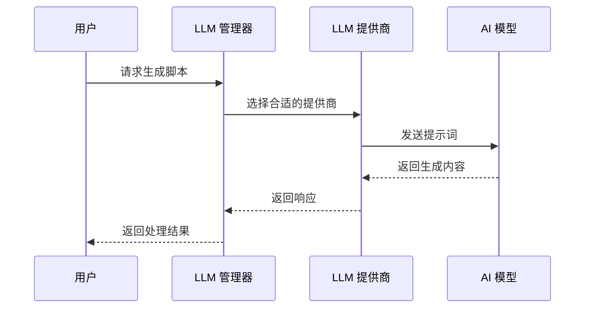

**图表来源**
- [llm.py:414-468](file://app/services/llm.py#L414-L468)

**章节来源**
- [llm.py:1-809](file://app/services/llm.py#L1-L809)

## 依赖分析

系统采用模块化设计，各组件之间的依赖关系清晰明确：

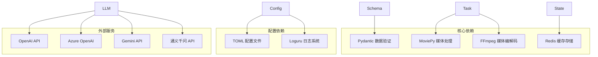

**图表来源**
- [schema.py:1-7](file://app/models/schema.py#L1-L7)
- [task.py:1-25](file://app/services/task.py#L1-L25)
- [config.py:1-10](file://app/config/config.py#L1-L10)

### 设计模式应用

系统在多个层面应用了经典的设计模式：

#### 工厂模式
用于创建不同类型的 LLM 提供商实例：

```python
# LLM 提供商工厂
def create_llm_provider(provider_name):
    providers = {
        'openai': OpenAIProvider(),
        'azure': AzureOpenAIProvider(),
        'gemini': GeminiProvider(),
        'qwen': QwenProvider()
    }
    return providers.get(provider_name.lower())
```

#### 策略模式
用于实现不同的视频处理策略：

```python
# 视频处理策略接口
class VideoProcessingStrategy:
    def process(self, video_path, params):
        raise NotImplementedError

# 具体策略实现
class HardwareAccelerationStrategy(VideoProcessingStrategy):
    def process(self, video_path, params):
        # 硬件加速处理逻辑

class SoftwareFallbackStrategy(VideoProcessingStrategy):
    def process(self, video_path, params):
        # 软件处理回退逻辑
```

#### 观察者模式
用于状态变更通知：

```python
# 任务状态观察者
class TaskObserver:
    def on_state_change(self, task_id, state, progress):
        # 处理状态变更事件

# 任务管理器
class TaskManager:
    def __init__(self):
        self.observers = []
    
    def register_observer(self, observer):
        self.observers.append(observer)
    
    def notify_observers(self, task_id, state, progress):
        for observer in self.observers:
            observer.on_state_change(task_id, state, progress)
```

**章节来源**
- [llm.py:144-227](file://app/services/llm.py#L144-L227)
- [merger_video.py:21-43](file://app/services/merger_video.py#L21-L43)
- [state.py:8-17](file://app/services/state.py#L8-L17)

## 性能考虑

### 并行处理优化

系统通过多线程和异步处理提升性能：

- **线程池管理**：视频处理支持可配置的线程数
- **异步 TTS**：Edge TTS 支持异步生成
- **批量操作**：音频和字幕的批量处理

### 缓存策略

- **TTS 结果缓存**：避免重复的语音合成
- **视频素材缓存**：本地存储下载的视频文件
- **配置缓存**：运行时配置的内存缓存

### 资源管理

- **内存优化**：及时释放处理过程中的中间结果
- **磁盘空间**：自动清理临时文件和中间产物
- **CPU 利用率**：根据系统负载动态调整并发度

## 故障排除指南

### 常见问题诊断

#### FFmpeg 相关问题
- **问题**：FFmpeg 未安装或路径错误
- **解决方案**：检查环境变量配置，确保 FFmpeg 在 PATH 中

#### LLM API 配置问题
- **问题**：API 密钥配置错误
- **解决方案**：验证配置文件中的 API 密钥设置

#### 音频处理失败
- **问题**：音频合成过程中出现格式不兼容
- **解决方案**：检查音频文件格式和采样率

### 调试技巧

1. **启用详细日志**：设置日志级别为 DEBUG
2. **检查中间文件**：验证各处理阶段的输出
3. **监控系统资源**：观察 CPU、内存和磁盘使用情况

**章节来源**
- [audio_merger.py:12-18](file://app/services/audio_merger.py#L12-L18)
- [merger_video.py:45-58](file://app/services/merger_video.py#L45-L58)
- [llm.py:215-227](file://app/services/llm.py#L215-L227)

## 结论

NarratoAI 的架构设计体现了现代 Python 应用的最佳实践，通过分层架构、模块化设计和插件化扩展，实现了高度可维护和可扩展的视频处理系统。系统的核心优势包括：

1. **清晰的架构分层**：表现层、业务层和数据层职责明确
2. **强类型数据模型**：基于 Pydantic 的数据验证确保数据质量
3. **灵活的状态管理**：支持多种存储后端的统一状态接口
4. **丰富的插件生态**：支持多种 LLM 提供商和媒体处理工具
5. **完善的错误处理**：全面的异常处理和恢复机制

该架构为后续的功能扩展和技术演进奠定了坚实的基础，能够适应不断变化的视频处理需求。