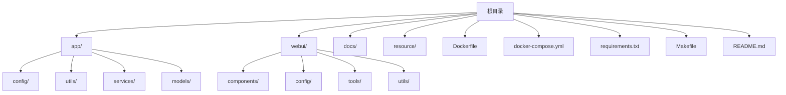
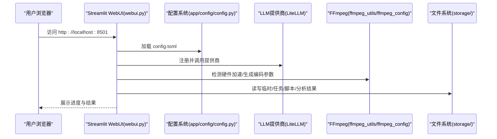
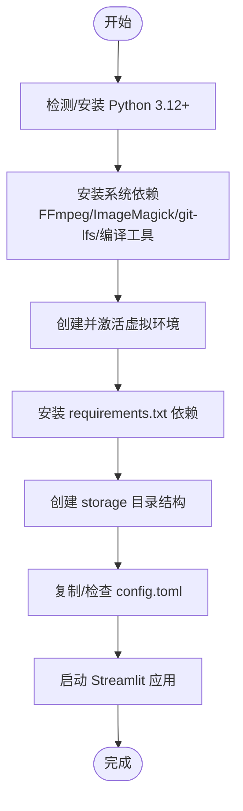
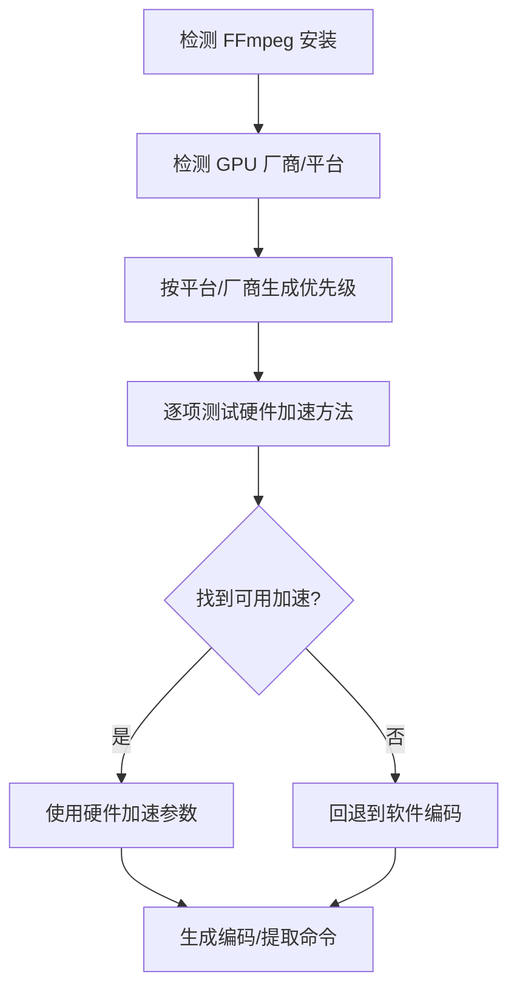
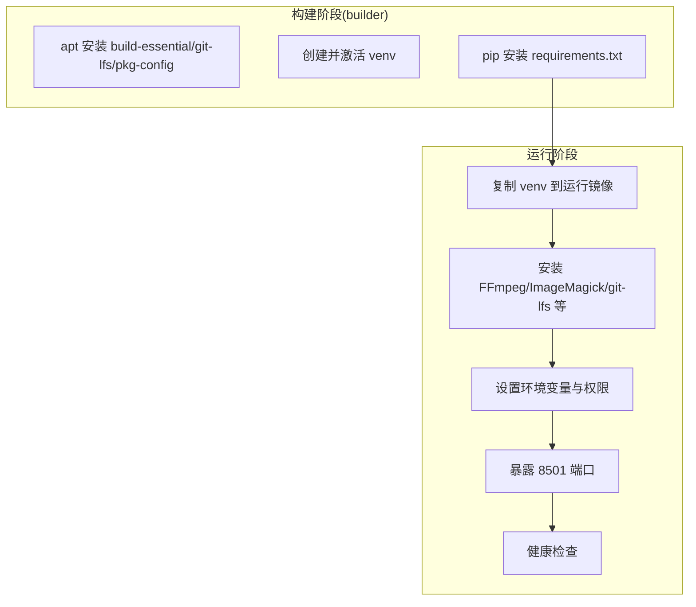
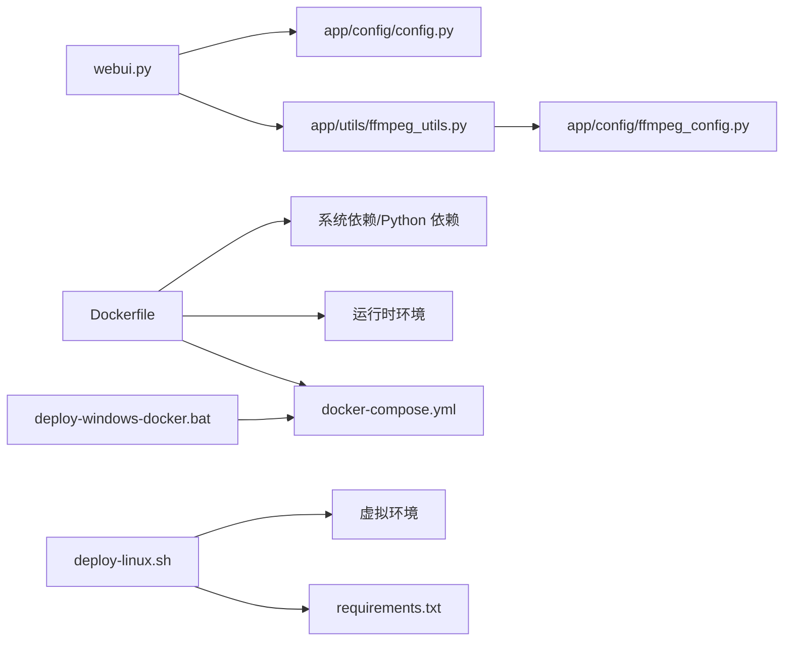

# 开发环境搭建

<cite>
**本文档引用的文件**
- [requirements.txt](file://requirements.txt)
- [Dockerfile](file://Dockerfile)
- [docker-compose.yml](file://docker-compose.yml)
- [Makefile](file://Makefile)
- [README.md](file://README.md)
- [webui.py](file://webui.py)
- [config.example.toml](file://config.example.toml)
- [app/config/config.py](file://app/config/config.py)
- [docker-entrypoint.sh](file://docker-entrypoint.sh)
- [app/config/ffmpeg_config.py](file://app/config/ffmpeg_config.py)
- [app/utils/ffmpeg_utils.py](file://app/utils/ffmpeg_utils.py)
- [app/utils/utils.py](file://app/utils/utils.py)
- [deploy-linux.sh](file://deploy-linux.sh)
- [deploy-windows-docker.bat](file://deploy-windows-docker.bat)
</cite>

## 目录
1. [简介](#简介)
2. [项目结构](#项目结构)
3. [核心组件](#核心组件)
4. [架构总览](#架构总览)
5. [详细组件分析](#详细组件分析)
6. [依赖关系分析](#依赖关系分析)
7. [性能考虑](#性能考虑)
8. [故障排除指南](#故障排除指南)
9. [结论](#结论)
10. [附录](#附录)

## 简介
本指南面向希望在本地或容器环境中搭建 NarratoAI 开发与运行环境的开发者。内容覆盖：
- Python 开发环境要求与虚拟环境创建
- 依赖包安装流程与顺序
- 关键依赖（LiteLLM、Streamlit、MoviePy、FFmpeg 等）的作用说明
- Docker 容器化开发环境的镜像构建、容器启动与端口映射
- IDE 配置建议（VS Code、PyCharm 等）
- 调试环境配置（断点、日志、健康检查）
- 常见环境问题排查与解决方案

## 项目结构
项目采用分层组织方式，核心入口为 WebUI 应用，配置与工具分布在 app/config、app/utils、webui 等目录中。Docker 相关文件位于根目录，便于容器化部署。

图表来源
- [Dockerfile:1-89](file://Dockerfile#L1-L89)
- [docker-compose.yml:1-30](file://docker-compose.yml#L1-L30)
- [requirements.txt:1-39](file://requirements.txt#L1-L39)

章节来源
- [README.md:105-141](file://README.md#L105-L141)
- [Dockerfile:1-89](file://Dockerfile#L1-L89)
- [docker-compose.yml:1-30](file://docker-compose.yml#L1-L30)

## 核心组件
- WebUI 应用入口：负责初始化日志、注册 LLM 提供商、检测 FFmpeg 硬件加速、渲染界面与任务执行。
- 配置系统：加载 TOML 配置，支持 LiteLLM、TTS、代理、视频处理等配置项。
- FFmpeg 管理：提供硬件加速检测、配置文件与命令生成，适配多平台。
- Docker 容器：多阶段构建，包含系统依赖与 Python 依赖，暴露 WebUI 端口并提供健康检查。
- 一键部署脚本：Linux 与 Windows Docker 一键部署脚本，简化环境准备与启动流程。

章节来源
- [webui.py:1-294](file://webui.py#L1-L294)
- [app/config/config.py:1-95](file://app/config/config.py#L1-L95)
- [app/config/ffmpeg_config.py:1-285](file://app/config/ffmpeg_config.py#L1-L285)
- [app/utils/ffmpeg_utils.py:1-800](file://app/utils/ffmpeg_utils.py#L1-L800)
- [Dockerfile:1-89](file://Dockerfile#L1-L89)
- [deploy-linux.sh:1-529](file://deploy-linux.sh#L1-L529)
- [deploy-windows-docker.bat:1-372](file://deploy-windows-docker.bat#L1-L372)

## 架构总览
下图展示从用户请求到视频生成的端到端流程，以及容器化运行时的关键组件。

图表来源
- [webui.py:227-294](file://webui.py#L227-L294)
- [app/config/config.py:24-95](file://app/config/config.py#L24-L95)
- [app/utils/ffmpeg_utils.py:252-355](file://app/utils/ffmpeg_utils.py#L252-L355)
- [app/config/ffmpeg_config.py:98-158](file://app/config/ffmpeg_config.py#L98-L158)

## 详细组件分析

### Python 开发环境与依赖安装
- Python 版本要求：Python 3.12+（项目文档明确要求）。
- 虚拟环境：推荐使用 venv 创建隔离环境，避免系统包冲突。
- 依赖安装顺序：
  1) 安装系统依赖（FFmpeg、ImageMagick、git-lfs、编译工具等）
  2) 创建并激活虚拟环境
  3) 安装 requirements.txt 中的 Python 依赖
  4) 初始化存储目录与配置文件
  5) 启动 Streamlit 应用

图表来源
- [deploy-linux.sh:83-304](file://deploy-linux.sh#L83-L304)
- [requirements.txt:1-39](file://requirements.txt#L1-L39)
- [README.md:122-141](file://README.md#L122-L141)

章节来源
- [README.md:145-147](file://README.md#L145-L147)
- [deploy-linux.sh:83-304](file://deploy-linux.sh#L83-L304)
- [requirements.txt:1-39](file://requirements.txt#L1-L39)

### 关键依赖作用与安装顺序
- 核心依赖
  - requests：HTTP 请求
  - moviepy：视频剪辑与合成
  - edge-tts：微软 Edge TTS
  - streamlit：WebUI 框架
  - watchdog：文件监控
  - loguru：结构化日志
  - tomli/tomli-w：TOML 读写
  - pydub/pysrt：音频与字幕处理
- AI 服务依赖
  - openai、litellm：统一 LLM 接口，支持多家供应商
  - google-generativeai：Gemini 调用
  - azure-cognitiveservices-speech：Azure TTS
  - tencentcloud-sdk-python：腾讯云 TTS
  - dashscope：通义千问相关能力
- 图像处理：Pillow
- 进度条与重试：tqdm、tenacity
- 可选依赖：faster-whisper、opencv-python、torch 系列（按需启用）

安装顺序建议：
1) 先安装系统依赖（FFmpeg、ImageMagick 等），确保媒体处理工具可用
2) 在虚拟环境中安装 requirements.txt
3) 如需本地语音识别或计算机视觉功能，再安装可选依赖

章节来源
- [requirements.txt:1-39](file://requirements.txt#L1-L39)
- [config.example.toml:1-177](file://config.example.toml#L1-L177)

### FFmpeg 配置与硬件加速
- 硬件加速检测：跨平台检测 CUDA、NVENC、VideoToolbox、QSV、VAAPI、AMF 等，自动选择最优方案
- 配置文件：提供高性能、兼容性、Windows NVIDIA、macOS VideoToolbox、通用软件等预设配置
- 命令生成：根据配置生成关键帧提取与编码命令，自动注入硬件加速参数

图表来源
- [app/utils/ffmpeg_utils.py:252-355](file://app/utils/ffmpeg_utils.py#L252-L355)
- [app/config/ffmpeg_config.py:98-158](file://app/config/ffmpeg_config.py#L98-L158)

章节来源
- [app/utils/ffmpeg_utils.py:118-136](file://app/utils/ffmpeg_utils.py#L118-L136)
- [app/config/ffmpeg_config.py:27-158](file://app/config/ffmpeg_config.py#L27-L158)

### Docker 容器化开发环境
- 多阶段构建：构建阶段安装系统依赖与 Python 依赖，运行阶段仅包含运行时所需组件
- 系统依赖：安装 FFmpeg、ImageMagick、git-lfs、curl 等
- 环境变量：设置 Python 路径、编码、缓冲等，确保稳定运行
- 健康检查：通过 Streamlit 内部健康端点进行探测
- 端口映射：容器内 8501 对应主机 8501
- 数据卷：挂载 storage、config.toml、resource

图表来源
- [Dockerfile:1-89](file://Dockerfile#L1-L89)
- [docker-compose.yml:1-30](file://docker-compose.yml#L1-L30)

章节来源
- [Dockerfile:1-89](file://Dockerfile#L1-L89)
- [docker-compose.yml:1-30](file://docker-compose.yml#L1-L30)
- [Makefile:23-55](file://Makefile#L23-L55)

### 一键部署脚本
- Linux 脚本：自动检测/安装 Python、系统依赖、创建虚拟环境、安装依赖、初始化目录与配置、生成 systemd 服务文件、启动应用
- Windows Docker 脚本：检查 Docker/Compose、构建镜像、启动容器、等待健康、自动打开浏览器

章节来源
- [deploy-linux.sh:460-529](file://deploy-linux.sh#L460-L529)
- [deploy-windows-docker.bat:342-372](file://deploy-windows-docker.bat#L342-L372)

### WebUI 日志与调试
- 日志初始化：使用 loguru，过滤噪声日志，美化输出格式
- 进度与状态：通过 Streamlit 进度条与状态文本反馈任务进度
- 健康检查：容器入口脚本与 Compose 健康检查共同保障服务可用性

章节来源
- [webui.py:35-110](file://webui.py#L35-L110)
- [docker-entrypoint.sh:130-145](file://docker-entrypoint.sh#L130-L145)
- [docker-compose.yml:23-29](file://docker-compose.yml#L23-L29)

## 依赖关系分析
- 应用入口依赖配置系统与工具模块
- FFmpeg 工具与配置相互协作，提供跨平台兼容性
- Dockerfile 与 docker-compose.yml 定义了镜像构建与运行时依赖
- 一键部署脚本串联了系统依赖、虚拟环境与应用启动

图表来源
- [webui.py:1-12](file://webui.py#L1-L12)
- [app/config/config.py:1-10](file://app/config/config.py#L1-L10)
- [app/utils/ffmpeg_utils.py:1-11](file://app/utils/ffmpeg_utils.py#L1-L11)
- [app/config/ffmpeg_config.py:1-28](file://app/config/ffmpeg_config.py#L1-L28)
- [Dockerfile:1-89](file://Dockerfile#L1-L89)
- [docker-compose.yml:1-30](file://docker-compose.yml#L1-L30)
- [deploy-linux.sh:217-266](file://deploy-linux.sh#L217-L266)
- [requirements.txt:1-39](file://requirements.txt#L1-L39)
- [deploy-windows-docker.bat:178-207](file://deploy-windows-docker.bat#L178-L207)

章节来源
- [webui.py:1-12](file://webui.py#L1-L12)
- [app/config/config.py:1-10](file://app/config/config.py#L1-L10)
- [app/utils/ffmpeg_utils.py:1-11](file://app/utils/ffmpeg_utils.py#L1-L11)
- [app/config/ffmpeg_config.py:1-28](file://app/config/ffmpeg_config.py#L1-L28)
- [Dockerfile:1-89](file://Dockerfile#L1-L89)
- [docker-compose.yml:1-30](file://docker-compose.yml#L1-L30)
- [deploy-linux.sh:217-266](file://deploy-linux.sh#L217-L266)
- [requirements.txt:1-39](file://requirements.txt#L1-L39)
- [deploy-windows-docker.bat:178-207](file://deploy-windows-docker.bat#L178-L207)

## 性能考虑
- 硬件加速：优先启用 CUDA/NVENC、VideoToolbox、QSV、VAAPI、AMF 等，自动降级至软件编码
- 编码参数：根据平台与 GPU 类型选择最优编码器与质量参数
- I/O 与缓存：合理使用 storage 目录，避免频繁磁盘 IO
- 并发与异步：WebUI 使用多线程执行任务，注意共享状态与锁

章节来源
- [app/utils/ffmpeg_utils.py:252-355](file://app/utils/ffmpeg_utils.py#L252-L355)
- [app/config/ffmpeg_config.py:98-158](file://app/config/ffmpeg_config.py#L98-L158)
- [webui.py:177-224](file://webui.py#L177-L224)

## 故障排除指南
- FFmpeg 未安装
  - 现象：日志报错“ffmpeg未安装或不在系统PATH中”
  - 处理：安装 FFmpeg 并确保在 PATH 中
- 硬件加速不可用
  - 现象：日志提示使用软件编码
  - 处理：更新显卡驱动，或切换到兼容性配置
- 端口占用
  - 现象：容器启动后健康检查失败
  - 处理：修改映射端口或释放 8501
- 权限问题
  - 现象：ImageMagick 读写受限
  - 处理：调整 policy.xml 或使用脚本修复
- 配置缺失
  - 现象：应用启动但缺少 API 密钥
  - 处理：复制 config.example.toml 为 config.toml 并填入密钥

章节来源
- [app/utils/ffmpeg_utils.py:118-136](file://app/utils/ffmpeg_utils.py#L118-L136)
- [docker-entrypoint.sh:64-90](file://docker-entrypoint.sh#L64-L90)
- [docker-compose.yml:9-11](file://docker-compose.yml#L9-L11)
- [config.example.toml:1-177](file://config.example.toml#L1-L177)

## 结论
通过本指南，您可以：
- 在本地快速搭建 Python 开发环境并安装项目依赖
- 使用 Docker 容器化方式稳定运行 WebUI
- 配置 FFmpeg 硬件加速以获得更好性能
- 使用一键部署脚本简化安装与启动流程
- 在遇到问题时快速定位并解决常见环境问题

## 附录

### IDE 配置建议
- VS Code
  - Python 解释器：指向虚拟环境中的 Python
  - 扩展：Python、Pylance、Black、isort
  - 设置：启用格式化、类型检查、单元测试集成
- PyCharm
  - 虚拟环境：指向 venv
  - 运行配置：Streamlit 运行参数与上传大小限制
  - 调试：断点设置在关键函数入口（如注册 LLM 提供商、任务执行）

### 调试与日志
- 断点设置：在 webui.py 的任务执行线程入口处设置断点
- 日志级别：默认 INFO，可按需调整
- 健康检查：容器健康检查与 WebUI 内部健康端点

章节来源
- [webui.py:35-110](file://webui.py#L35-L110)
- [webui.py:177-224](file://webui.py#L177-L224)
- [docker-entrypoint.sh:130-145](file://docker-entrypoint.sh#L130-L145)
- [docker-compose.yml:23-29](file://docker-compose.yml#L23-L29)