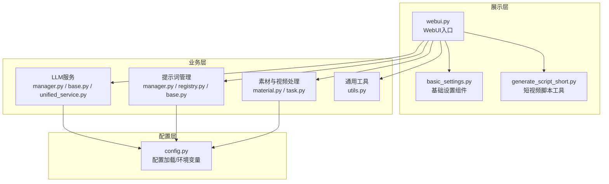
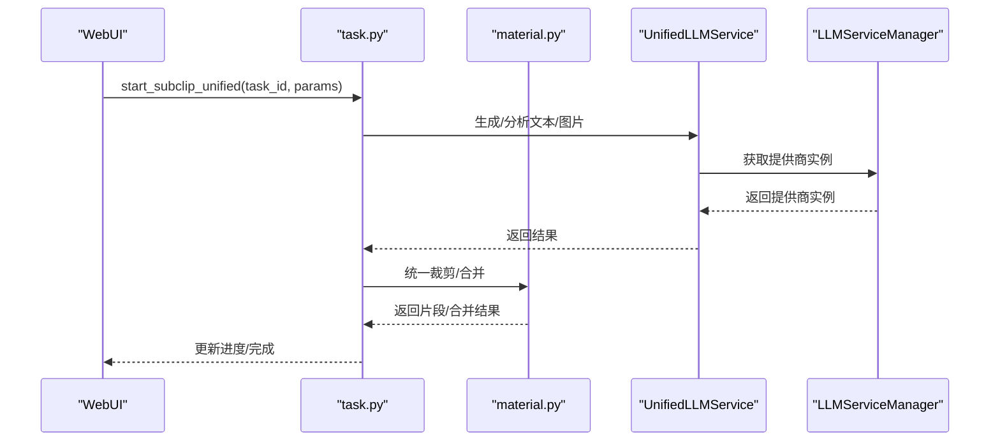
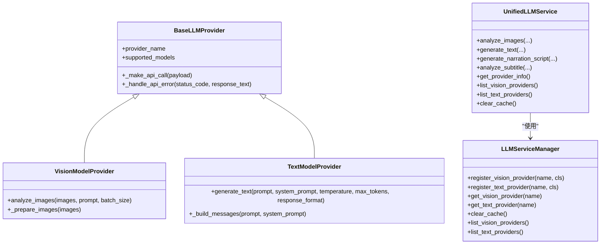
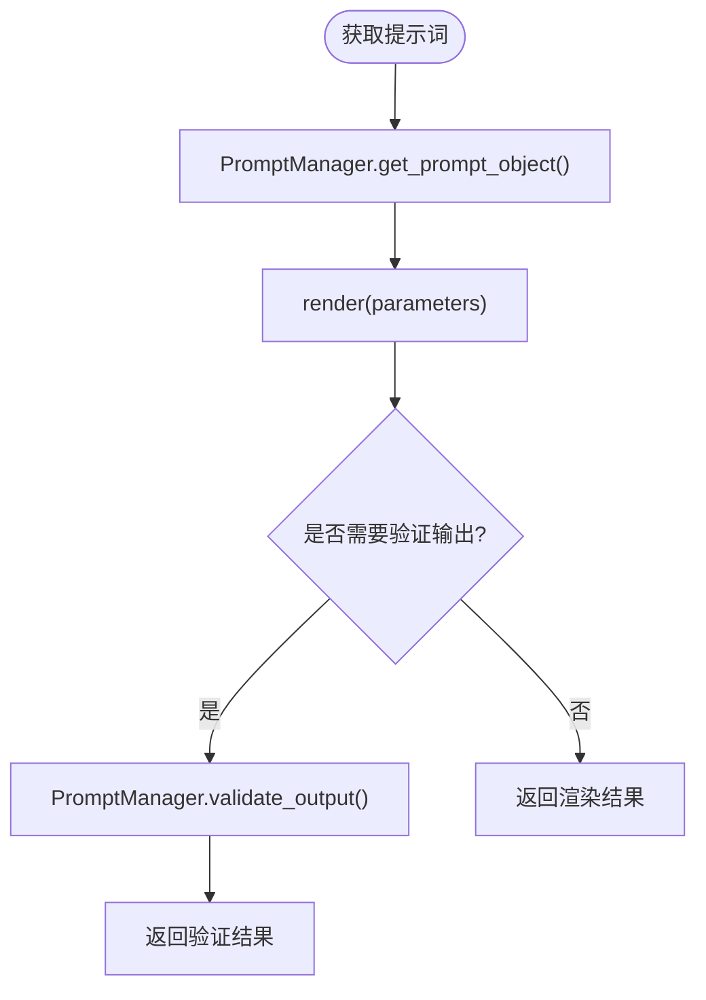
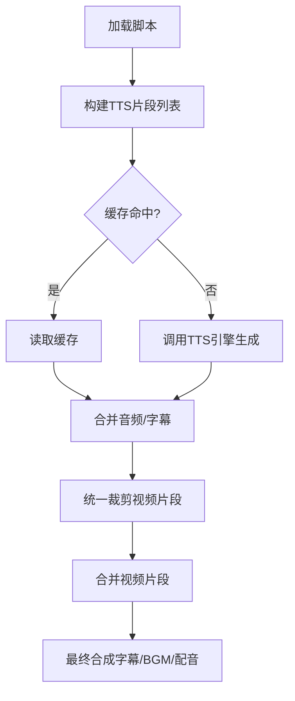
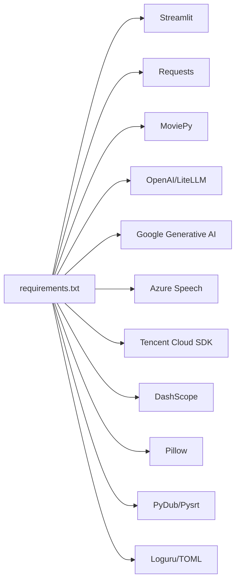

# 开发者指南

<cite>
**本文引用的文件**
- [README.md](file://README.md)
- [requirements.txt](file://requirements.txt)
- [webui.py](file://webui.py)
- [app/config/config.py](file://app/config/config.py)
- [app/models/schema.py](file://app/models/schema.py)
- [app/models/const.py](file://app/models/const.py)
- [app/services/llm/base.py](file://app/services/llm/base.py)
- [app/services/llm/manager.py](file://app/services/llm/manager.py)
- [app/services/llm/unified_service.py](file://app/services/llm/unified_service.py)
- [app/services/llm/providers/__init__.py](file://app/services/llm/providers/__init__.py)
- [app/services/prompts/base.py](file://app/services/prompts/base.py)
- [app/services/prompts/manager.py](file://app/services/prompts/manager.py)
- [app/services/prompts/registry.py](file://app/services/prompts/registry.py)
- [app/services/material.py](file://app/services/material.py)
- [app/services/task.py](file://app/services/task.py)
- [app/utils/utils.py](file://app/utils/utils.py)
- [webui/components/basic_settings.py](file://webui/components/basic_settings.py)
- [webui/tools/generate_script_short.py](file://webui/tools/generate_script_short.py)
</cite>

## 目录
1. [简介](#简介)
2. [项目结构](#项目结构)
3. [核心组件](#核心组件)
4. [架构总览](#架构总览)
5. [详细组件分析](#详细组件分析)
6. [依赖关系分析](#依赖关系分析)
7. [性能考虑](#性能考虑)
8. [故障排查指南](#故障排查指南)
9. [结论](#结论)
10. [附录](#附录)

## 简介
NarratoAI 是一个面向 AI 驱动的影视解说与自动化剪辑的综合工具，支持多 LLM 提供商、多模态提示词管理、统一的视频/音频/字幕处理流水线，以及 WebUI 交互界面。项目采用分层架构与模块化组织，结合插件化设计（LLM 提供商注册、提示词注册表），便于扩展与维护。

## 项目结构
项目采用“分层 + 模块化 + 插件化”的组织方式：
- 展示层：Streamlit WebUI（webui.py 及各组件）
- 业务层：服务模块（app/services），包含 LLM、提示词、素材下载、任务编排、媒体处理等
- 工具层：通用工具（app/utils）
- 配置层：配置加载与环境变量注入（app/config）

图表来源
- [webui.py:1-294](file://webui.py#L1-L294)
- [app/services/llm/manager.py:1-246](file://app/services/llm/manager.py#L1-L246)
- [app/services/prompts/manager.py:1-288](file://app/services/prompts/manager.py#L1-L288)
- [app/services/material.py:1-580](file://app/services/material.py#L1-L580)
- [app/utils/utils.py:1-675](file://app/utils/utils.py#L1-L675)
- [app/config/config.py:1-95](file://app/config/config.py#L1-L95)

章节来源
- [README.md:105-141](file://README.md#L105-L141)
- [requirements.txt:1-39](file://requirements.txt#L1-L39)

## 核心组件
- 配置系统：集中加载 TOML 配置、注入环境变量（如 FFmpeg、ImageMagick 路径）、版本号读取
- LLM 管理：统一提供商注册与实例缓存，支持 LiteLLM 统一接口
- 提示词系统：提示词注册表、模板渲染、输出校验、搜索与统计
- 素材与视频处理：视频检索/下载、统一裁剪、音频/字幕合并、最终合成
- WebUI：基础设置（LLM Provider、代理、语言）、短视频脚本生成工具

章节来源
- [app/config/config.py:24-95](file://app/config/config.py#L24-L95)
- [app/services/llm/manager.py:15-246](file://app/services/llm/manager.py#L15-L246)
- [app/services/prompts/manager.py:26-288](file://app/services/prompts/manager.py#L26-L288)
- [app/services/material.py:39-580](file://app/services/material.py#L39-L580)
- [webui.py:227-294](file://webui.py#L227-L294)

## 架构总览
系统采用“配置驱动 + 工厂/管理器 + 统一服务 + 流水线”的架构：
- 配置驱动：通过 config.toml 注入 LLM Provider、TTS、代理、FFmpeg 等参数
- 工厂/管理器：LLMServiceManager、PromptManager 负责提供商与提示词的注册、查找与缓存
- 统一服务：UnifiedLLMService 对外暴露统一接口，屏蔽底层提供商差异
- 流水线：task.py 组织脚本加载、TTS 生成、统一裁剪、音频/字幕合并、最终合成

图表来源
- [webui.py:177-224](file://webui.py#L177-L224)
- [app/services/task.py:195-256](file://app/services/task.py#L195-L256)
- [app/services/llm/unified_service.py:20-263](file://app/services/llm/unified_service.py#L20-L263)
- [app/services/llm/manager.py:68-209](file://app/services/llm/manager.py#L68-L209)

## 详细组件分析

### 配置系统（app/config/config.py）
- 职责：加载 config.toml，处理编码问题，注入环境变量（FFmpeg、ImageMagick），读取版本号
- 关键点：自动复制示例配置、兼容 utf-8-sig、环境变量注入、日志级别与监听配置

章节来源
- [app/config/config.py:24-95](file://app/config/config.py#L24-L95)

### LLM 抽象与管理（app/services/llm/base.py, manager.py, unified_service.py）
- 抽象层：BaseLLMProvider、VisionModelProvider、TextModelProvider 定义统一接口与错误处理
- 管理层：LLMServiceManager 提供注册、查找、缓存、列表、统计能力
- 统一服务：UnifiedLLMService 暴露统一 API（图片分析、文本生成、脚本生成、字幕分析）

图表来源
- [app/services/llm/base.py:16-190](file://app/services/llm/base.py#L16-L190)
- [app/services/llm/manager.py:15-246](file://app/services/llm/manager.py#L15-L246)
- [app/services/llm/unified_service.py:20-263](file://app/services/llm/unified_service.py#L20-L263)

章节来源
- [app/services/llm/base.py:16-190](file://app/services/llm/base.py#L16-L190)
- [app/services/llm/manager.py:15-246](file://app/services/llm/manager.py#L15-L246)
- [app/services/llm/unified_service.py:20-263](file://app/services/llm/unified_service.py#L20-L263)
- [app/services/llm/providers/__init__.py:12-44](file://app/services/llm/providers/__init__.py#L12-L44)

### 提示词系统（app/services/prompts/base.py, registry.py, manager.py）
- 基础类：BasePrompt、ModelType、OutputFormat、PromptMetadata
- 注册表：PromptRegistry 支持分类/名称/版本管理、默认版本、搜索、统计
- 管理器：PromptManager 统一获取、渲染、验证、导出、搜索提示词

图表来源
- [app/services/prompts/manager.py:26-288](file://app/services/prompts/manager.py#L26-L288)
- [app/services/prompts/registry.py:24-224](file://app/services/prompts/registry.py#L24-L224)
- [app/services/prompts/base.py:50-183](file://app/services/prompts/base.py#L50-L183)

章节来源
- [app/services/prompts/base.py:19-183](file://app/services/prompts/base.py#L19-L183)
- [app/services/prompts/registry.py:24-224](file://app/services/prompts/registry.py#L24-L224)
- [app/services/prompts/manager.py:26-288](file://app/services/prompts/manager.py#L26-L288)

### 素材与视频处理（app/services/material.py, app/services/task.py）
- 素材下载：Pexels/Pixabay 搜索与下载、缓存、校验
- 视频处理：统一裁剪（基于脚本/OST）、合并、FFmpeg 硬件加速检测与编码器选择
- 任务编排：task.py 组织脚本加载、TTS、统一裁剪、音频/字幕合并、最终合成

图表来源
- [app/services/task.py:195-256](file://app/services/task.py#L195-L256)
- [app/services/material.py:39-580](file://app/services/material.py#L39-L580)

章节来源
- [app/services/material.py:39-580](file://app/services/material.py#L39-L580)
- [app/services/task.py:195-256](file://app/services/task.py#L195-L256)

### WebUI 与工具（webui.py, webui/components/basic_settings.py, webui/tools/generate_script_short.py）
- webui.py：初始化日志、全局状态、LLM 提供商注册、FFmpeg 硬件加速检测、渲染 UI、生成按钮与任务轮询
- basic_settings.py：LLM Provider 配置（LiteLLM）、代理、语言、连通性测试、配置保存与缓存清理
- generate_script_short.py：短视频脚本生成工具，严格校验视频/字幕输入，调用后端生成脚本

章节来源
- [webui.py:227-294](file://webui.py#L227-L294)
- [webui/components/basic_settings.py:559-727](file://webui/components/basic_settings.py#L559-L727)
- [webui/tools/generate_script_short.py:13-128](file://webui/tools/generate_script_short.py#L13-L128)

## 依赖关系分析
- Python 依赖集中在 requirements.txt，核心包括：requests、moviepy、edge-tts、streamlit、loguru、tomli、pydub、pysrt、openai、litellm、google-generativeai、azure-cognitiveservices-speech、tencentcloud-sdk-python、dashscope、Pillow、tqdm、tenacity
- WebUI 通过 Streamlit 提供交互，后端通过服务模块与外部 API（LLM、视频素材库）交互
- 配置系统贯穿全链路，确保 LLM Provider、TTS、FFmpeg、代理等参数一致生效

图表来源
- [requirements.txt:1-39](file://requirements.txt#L1-L39)

章节来源
- [requirements.txt:1-39](file://requirements.txt#L1-L39)

## 性能考虑
- 硬件加速：检测 FFmpeg 硬件加速并选择最优编码器，减少 CPU 压力
- 并行与缓存：LLM 提供商实例缓存、TTS 结果缓存、关键帧缓存清理
- 线程与并发：视频处理参数支持多线程，合理设置线程数以平衡吞吐与稳定性
- I/O 优化：素材下载缓存、视频片段复用、合并阶段避免重复编码

章节来源
- [app/utils/utils.py:573-600](file://app/utils/utils.py#L573-L600)
- [app/services/material.py:311-434](file://app/services/material.py#L311-L434)
- [app/services/task.py:120-192](file://app/services/task.py#L120-L192)

## 故障排查指南
- LLM Provider 未注册：确认在应用启动时调用注册函数，检查配置项（API Key、模型名、Base URL）
- 连接失败：使用 basic_settings 的“测试连接”功能，检查代理、Base URL、API Key 格式
- 视频处理报错：检查 FFmpeg 是否可用、硬件加速是否可用、输入视频路径与字幕文件是否存在
- 日志定位：WebUI 启动后会设置过滤器，关注控制台日志与错误提示

章节来源
- [webui.py:232-246](file://webui.py#L232-L246)
- [webui/components/basic_settings.py:221-330](file://webui/components/basic_settings.py#L221-L330)
- [app/services/material.py:311-490](file://app/services/material.py#L311-L490)

## 结论
NarratoAI 通过清晰的分层架构、统一的 LLM 管理与提示词体系、可扩展的任务流水线，提供了从脚本生成到视频合成的完整能力。开发者可基于现有框架快速扩展新的 LLM 提供商、提示词模板与功能模块。

## 附录

### 开发环境搭建
- 克隆仓库、安装依赖、复制配置、启动 WebUI
- 配置 LLM Provider（LiteLLM）、代理、FFmpeg 路径
- 通过 WebUI 生成短视频脚本并进行视频合成

章节来源
- [README.md:105-141](file://README.md#L105-L141)
- [requirements.txt:1-39](file://requirements.txt#L1-L39)

### 核心数据模型
- VideoClipParams：视频/音频/字幕参数、音量、线程数等
- VideoParams：脚本生成参数、素材来源、语言、字幕样式等
- MaterialInfo：素材来源与时长信息

章节来源
- [app/models/schema.py:108-209](file://app/models/schema.py#L108-L209)
- [app/models/const.py:1-26](file://app/models/const.py#L1-L26)

### 扩展开发指南
- 新增 LLM 提供商：实现 BaseLLMProvider 子类，通过 LLMServiceManager.register_* 注册
- 新增提示词：继承 BasePrompt，使用 PromptManager.register 注册，支持版本与默认版本
- 新功能模块：在 app/services 下新增模块，通过 webui.py 组件接入 UI 或工具

章节来源
- [app/services/llm/base.py:16-190](file://app/services/llm/base.py#L16-L190)
- [app/services/llm/manager.py:28-66](file://app/services/llm/manager.py#L28-L66)
- [app/services/prompts/base.py:50-183](file://app/services/prompts/base.py#L50-L183)
- [app/services/prompts/manager.py:82-92](file://app/services/prompts/manager.py#L82-L92)

### 代码贡献流程与规范
- Fork 仓库、创建分支、提交 PR、编写变更说明与测试
- 遵循日志规范（loguru）、错误处理（统一异常）、配置注入（config.toml）

章节来源
- [README.md:149-154](file://README.md#L149-L154)