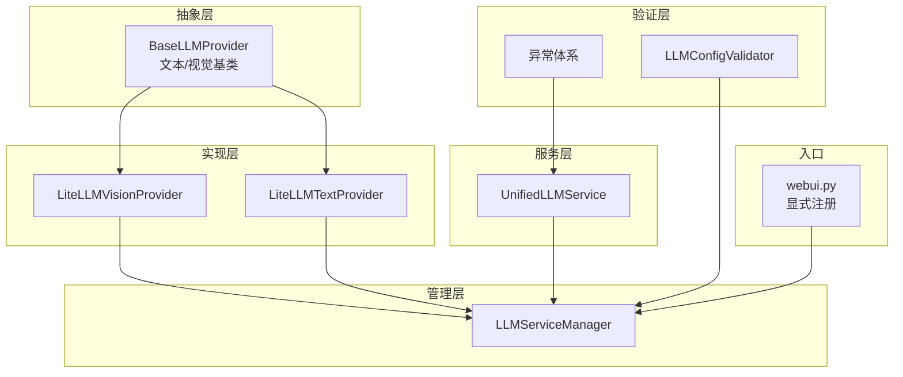
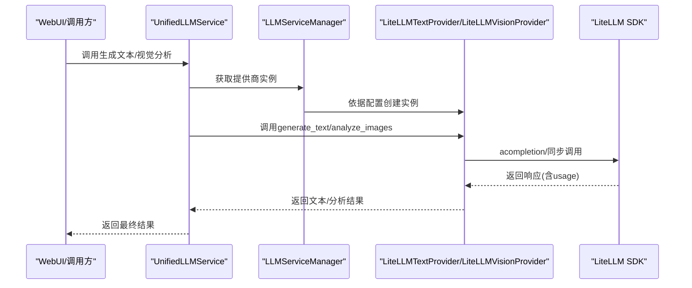
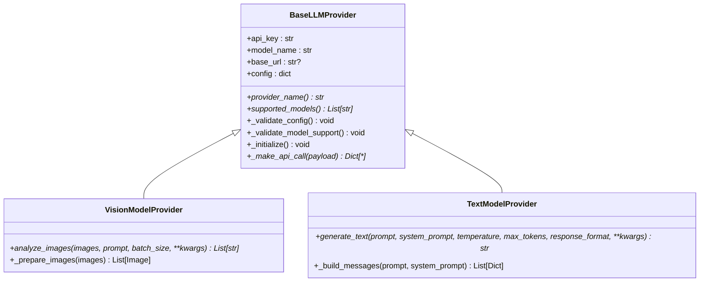
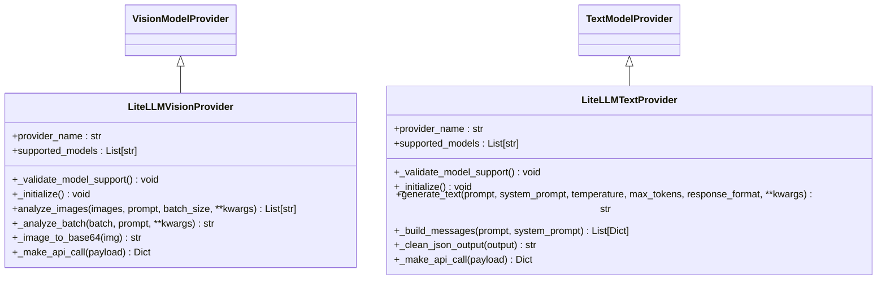
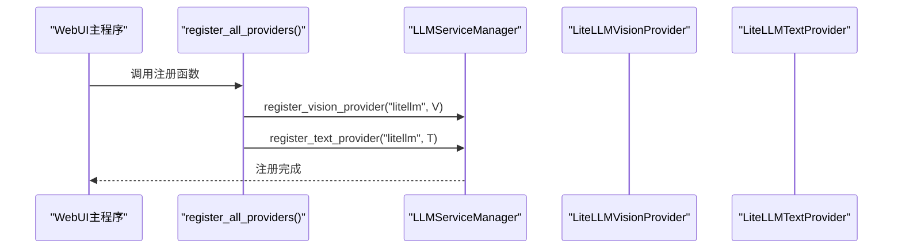
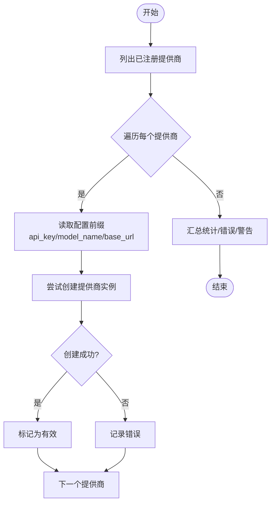
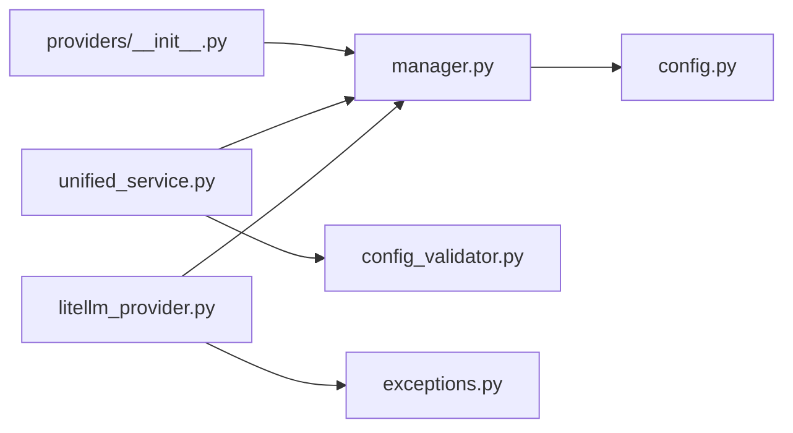

# LLM提供商扩展

<cite>
**本文引用的文件**
- [litellm_provider.py](file://app/services/llm/litellm_provider.py)
- [base.py](file://app/services/llm/base.py)
- [providers/__init__.py](file://app/services/llm/providers/__init__.py)
- [manager.py](file://app/services/llm/manager.py)
- [unified_service.py](file://app/services/llm/unified_service.py)
- [exceptions.py](file://app/services/llm/exceptions.py)
- [config_validator.py](file://app/services/llm/config_validator.py)
- [test_litellm_integration.py](file://app/services/llm/test_litellm_integration.py)
- [test_llm_service.py](file://app/services/llm/test_llm_service.py)
- [config.py](file://app/config/config.py)
- [webui.py](file://webui.py)
</cite>

## 目录
1. [简介](#简介)
2. [项目结构](#项目结构)
3. [核心组件](#核心组件)
4. [架构总览](#架构总览)
5. [详细组件分析](#详细组件分析)
6. [依赖关系分析](#依赖关系分析)
7. [性能与可靠性](#性能与可靠性)
8. [故障排查指南](#故障排查指南)
9. [结论](#结论)
10. [附录](#附录)

## 简介
本指南面向希望扩展或定制LLM提供商的开发者，围绕统一的LiteLLM接口实现，系统讲解如何：
- 实现新的LLM提供商类（继承统一基类）
- 使用LiteLLM统一接口对接多家模型供应商
- 完成提供商注册与配置验证
- 实现请求格式转换、响应解析、错误处理与成本追踪
- 设计配置验证规则与最佳实践（API密钥、超时、重试）
- 扩展现有LiteLLMVisionProvider与LiteLLMTextProvider
- 管理提供商生命周期、性能监控与日志记录
- 提供完整的集成测试方法与调试技巧

## 项目结构
LLM服务位于 app/services/llm 目录，采用“统一抽象 + 管理器 + 统一服务”的分层设计：
- 抽象层：定义统一的提供商接口（文本/视觉）
- 实现层：LiteLLM统一提供商
- 管理层：LLMServiceManager负责注册与实例化
- 服务层：UnifiedLLMService提供简化API
- 验证层：配置验证器与异常体系
- WebUI入口：在应用启动时显式注册提供商

图表来源
- [base.py:16-190](file://app/services/llm/base.py#L16-L190)
- [litellm_provider.py:59-491](file://app/services/llm/litellm_provider.py#L59-L491)
- [manager.py:15-246](file://app/services/llm/manager.py#L15-L246)
- [unified_service.py:20-263](file://app/services/llm/unified_service.py#L20-L263)
- [providers/__init__.py:12-44](file://app/services/llm/providers/__init__.py#L12-L44)
- [webui.py:227-245](file://webui.py#L227-L245)

章节来源
- [base.py:16-190](file://app/services/llm/base.py#L16-L190)
- [litellm_provider.py:59-491](file://app/services/llm/litellm_provider.py#L59-L491)
- [manager.py:15-246](file://app/services/llm/manager.py#L15-L246)
- [unified_service.py:20-263](file://app/services/llm/unified_service.py#L20-L263)
- [providers/__init__.py:12-44](file://app/services/llm/providers/__init__.py#L12-L44)
- [webui.py:227-245](file://webui.py#L227-L245)

## 核心组件
- 抽象基类：定义统一接口、配置校验、错误映射与消息构建
- LiteLLM提供商：实现文本/视觉模型的统一调用、参数适配、错误转换
- 管理器：注册提供商、按配置创建实例、缓存与查询
- 统一服务：对外暴露简洁API，封装调用与输出验证
- 配置验证器：批量校验提供商配置，输出报告与建议
- 异常体系：统一错误类型，便于上层捕获与处理

章节来源
- [base.py:16-190](file://app/services/llm/base.py#L16-L190)
- [litellm_provider.py:59-491](file://app/services/llm/litellm_provider.py#L59-L491)
- [manager.py:15-246](file://app/services/llm/manager.py#L15-L246)
- [unified_service.py:20-263](file://app/services/llm/unified_service.py#L20-L263)
- [config_validator.py:15-309](file://app/services/llm/config_validator.py#L15-L309)
- [exceptions.py:11-119](file://app/services/llm/exceptions.py#L11-L119)

## 架构总览
统一的调用链路如下：
- WebUI启动时显式注册提供商
- 统一服务接收外部调用
- 管理器按配置创建具体提供商实例
- LiteLLM提供商将请求转换为SDK调用，处理异常并返回结果

图表来源
- [unified_service.py:64-110](file://app/services/llm/unified_service.py#L64-L110)
- [manager.py:137-208](file://app/services/llm/manager.py#L137-L208)
- [litellm_provider.py:349-473](file://app/services/llm/litellm_provider.py#L349-L473)

章节来源
- [unified_service.py:20-263](file://app/services/llm/unified_service.py#L20-L263)
- [manager.py:15-246](file://app/services/llm/manager.py#L15-L246)
- [litellm_provider.py:59-491](file://app/services/llm/litellm_provider.py#L59-L491)

## 详细组件分析

### 抽象基类与标准实现模式
- BaseLLMProvider：统一构造、配置校验、模型支持校验、错误映射、抽象API调用接口
- VisionModelProvider：图片预处理、批处理、消息构建
- TextModelProvider：消息构建、JSON格式约束与清理

图表来源
- [base.py:16-190](file://app/services/llm/base.py#L16-L190)

章节来源
- [base.py:16-190](file://app/services/llm/base.py#L16-L190)

### LiteLLM统一提供商实现
- LiteLLMVisionProvider：图片转base64、批处理、SiliconFlow特殊适配、异常转换
- LiteLLMTextProvider：消息构建、JSON模式适配、SiliconFlow特殊适配、异常转换

图表来源
- [litellm_provider.py:59-491](file://app/services/llm/litellm_provider.py#L59-L491)

章节来源
- [litellm_provider.py:59-491](file://app/services/llm/litellm_provider.py#L59-L491)

### 提供商注册机制
- providers/__init__.py：延迟导入、显式注册LiteLLM提供商
- webui.py：应用启动时调用注册函数，确保LLM功能可用

图表来源
- [providers/__init__.py:12-44](file://app/services/llm/providers/__init__.py#L12-L44)
- [webui.py:234-239](file://webui.py#L234-L239)

章节来源
- [providers/__init__.py:12-44](file://app/services/llm/providers/__init__.py#L12-L44)
- [webui.py:227-245](file://webui.py#L227-L245)

### 配置验证流程
- LLMConfigValidator：逐个提供商验证API密钥、模型名、可创建实例；汇总错误与警告
- 统一服务与管理器配合：按配置前缀读取参数，创建实例并缓存

图表来源
- [config_validator.py:18-85](file://app/services/llm/config_validator.py#L18-L85)
- [manager.py:68-208](file://app/services/llm/manager.py#L68-L208)

章节来源
- [config_validator.py:15-309](file://app/services/llm/config_validator.py#L15-L309)
- [manager.py:15-246](file://app/services/llm/manager.py#L15-L246)

### 请求格式转换与响应解析
- 文本：构建messages列表，支持system_prompt；JSON模式通过response_format或提示词约束
- 视觉：将图片转为base64数据URL，拼装为多模态消息
- SiliconFlow适配：替换provider为openai并注入OPENAI_API_KEY与默认base_url

章节来源
- [litellm_provider.py:167-253](file://app/services/llm/litellm_provider.py#L167-L253)
- [litellm_provider.py:349-473](file://app/services/llm/litellm_provider.py#L349-L473)

### 错误处理与异常映射
- LiteLLM异常映射到统一异常类型（认证、速率限制、请求错误、内容过滤）
- 统一服务捕获异常并包装为LLMServiceError

章节来源
- [litellm_provider.py:235-252](file://app/services/llm/litellm_provider.py#L235-L252)
- [litellm_provider.py:438-472](file://app/services/llm/litellm_provider.py#L438-L472)
- [exceptions.py:11-119](file://app/services/llm/exceptions.py#L11-L119)
- [unified_service.py:60-62](file://app/services/llm/unified_service.py#L60-L62)

### 生命周期管理与缓存
- LLMServiceManager：按提供商名称与配置前缀缓存实例，避免重复创建
- clear_cache：清空缓存，便于配置变更后生效

章节来源
- [manager.py:24-216](file://app/services/llm/manager.py#L24-L216)

### 性能监控与日志记录
- LiteLLM全局配置：重试次数、超时时间
- Provider内部：对关键步骤记录info/warning/debug日志
- WebUI：统一日志格式与过滤，便于定位问题

章节来源
- [litellm_provider.py:38-56](file://app/services/llm/litellm_provider.py#L38-L56)
- [config.py:35-44](file://app/config/config.py#L35-L44)
- [webui.py:35-110](file://webui.py#L35-L110)

## 依赖关系分析
- providers/__init__.py 仅在运行时导入并注册LiteLLM提供商，避免循环依赖
- manager.py 依赖配置模块读取参数，依赖异常类型
- unified_service.py 依赖管理器与验证器
- litellm_provider.py 依赖LiteLLM SDK与异常类型

图表来源
- [providers/__init__.py:12-44](file://app/services/llm/providers/__init__.py#L12-L44)
- [manager.py:10-12](file://app/services/llm/manager.py#L10-L12)
- [unified_service.py:12-14](file://app/services/llm/unified_service.py#L12-L14)
- [litellm_provider.py:16-36](file://app/services/llm/litellm_provider.py#L16-L36)
- [config.py:1-95](file://app/config/config.py#L1-L95)

章节来源
- [providers/__init__.py:12-44](file://app/services/llm/providers/__init__.py#L12-L44)
- [manager.py:10-12](file://app/services/llm/manager.py#L10-L12)
- [unified_service.py:12-14](file://app/services/llm/unified_service.py#L12-L14)
- [litellm_provider.py:16-36](file://app/services/llm/litellm_provider.py#L16-L36)
- [config.py:1-95](file://app/config/config.py#L1-L95)

## 性能与可靠性
- 重试与超时：通过LiteLLM全局配置控制
- 批处理：视觉分析支持batch_size，降低API调用次数
- 图像预处理：缩放与格式统一，提升吞吐
- 缓存：管理器缓存实例，减少重复初始化开销
- 日志：分级记录，便于性能瓶颈定位

章节来源
- [litellm_provider.py:38-56](file://app/services/llm/litellm_provider.py#L38-L56)
- [litellm_provider.py:126-165](file://app/services/llm/litellm_provider.py#L126-L165)
- [manager.py:24-216](file://app/services/llm/manager.py#L24-L216)

## 故障排查指南
- 注册失败：确认WebUI启动时调用register_all_providers()，查看日志
- 配置缺失：使用LLMConfigValidator.validate_all_configs()获取详细报告
- API错误：捕获统一异常类型，结合日志定位原因
- 集成测试：运行test_litellm_integration.py与test_llm_service.py验证端到端

章节来源
- [webui.py:234-245](file://webui.py#L234-L245)
- [config_validator.py:18-85](file://app/services/llm/config_validator.py#L18-L85)
- [exceptions.py:11-119](file://app/services/llm/exceptions.py#L11-L119)
- [test_litellm_integration.py:188-229](file://app/services/llm/test_litellm_integration.py#L188-L229)
- [test_llm_service.py:205-264](file://app/services/llm/test_llm_service.py#L205-L264)

## 结论
通过LiteLLM统一接口，项目实现了“一次实现、多供应商接入”的目标。遵循本文档的扩展流程，即可快速新增或定制提供商，同时保持配置验证、错误处理、性能监控与日志记录的一致性。

## 附录

### 扩展新提供商的步骤清单
- 继承对应基类（文本/视觉），实现必需属性与方法
- 在providers/__init__.py中注册提供商
- 在WebUI启动时调用注册函数
- 使用LLMConfigValidator验证配置
- 编写集成测试与单元测试
- 在统一服务中提供调用入口

章节来源
- [base.py:16-190](file://app/services/llm/base.py#L16-L190)
- [providers/__init__.py:12-44](file://app/services/llm/providers/__init__.py#L12-L44)
- [webui.py:234-239](file://webui.py#L234-L239)
- [config_validator.py:18-85](file://app/services/llm/config_validator.py#L18-L85)
- [test_litellm_integration.py:188-229](file://app/services/llm/test_litellm_integration.py#L188-L229)
- [test_llm_service.py:205-264](file://app/services/llm/test_llm_service.py#L205-L264)

### 配置验证规则与最佳实践
- 必填项：api_key、model_name
- 可选项：base_url（建议配置）
- 示例：参考配置验证器提供的示例模型列表
- 建议：为每个提供商配置独立的API密钥与模型名，启用base_url以提升稳定性

章节来源
- [config_validator.py:107-142](file://app/services/llm/config_validator.py#L107-L142)
- [config_validator.py:162-199](file://app/services/llm/config_validator.py#L162-L199)
- [config_validator.py:251-278](file://app/services/llm/config_validator.py#L251-L278)

### 代码示例路径（不展示具体代码）
- 扩展LiteLLMVisionProvider：参考类定义与方法实现
  - [LiteLLMVisionProvider类:59-264](file://app/services/llm/litellm_provider.py#L59-L264)
- 扩展LiteLLMTextProvider：参考类定义与方法实现
  - [LiteLLMTextProvider类:266-491](file://app/services/llm/litellm_provider.py#L266-L491)
- 统一服务调用入口
  - [文本生成:64-110](file://app/services/llm/unified_service.py#L64-L110)
  - [视觉分析:20-63](file://app/services/llm/unified_service.py#L20-L63)
- 管理器注册与获取
  - [注册提供商:12-44](file://app/services/llm/providers/__init__.py#L12-L44)
  - [获取提供商实例:68-208](file://app/services/llm/manager.py#L68-L208)
- 配置验证
  - [批量验证:18-85](file://app/services/llm/config_validator.py#L18-L85)
  - [单项验证:87-199](file://app/services/llm/config_validator.py#L87-L199)
- 异常类型
  - [异常定义:11-119](file://app/services/llm/exceptions.py#L11-L119)