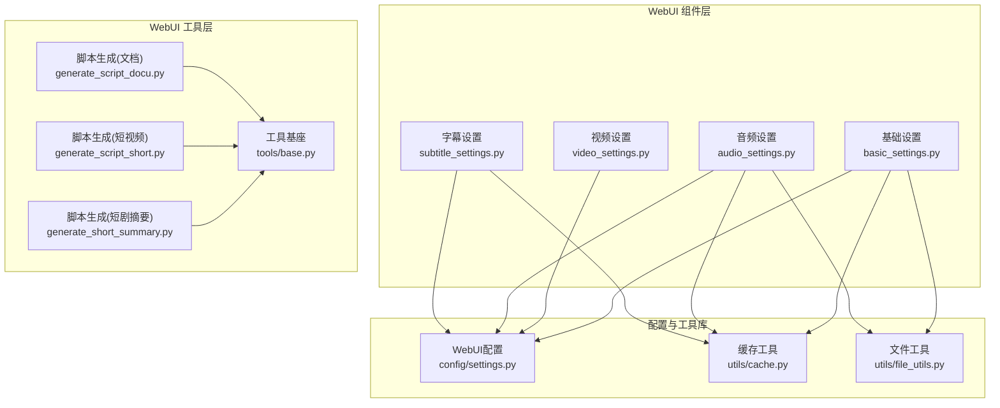
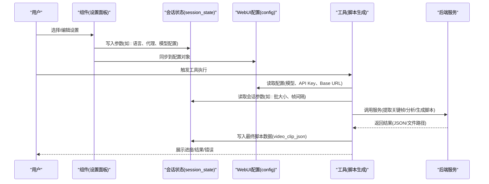
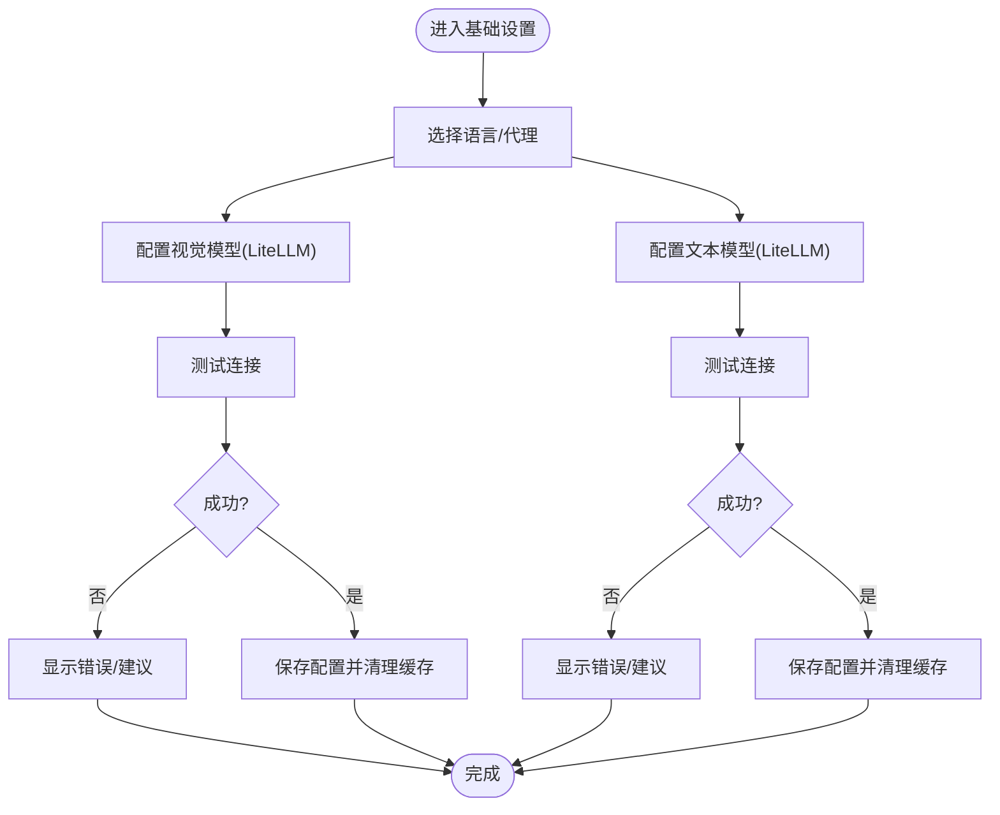
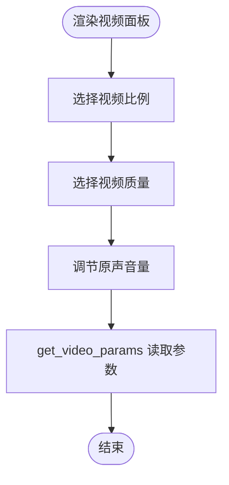
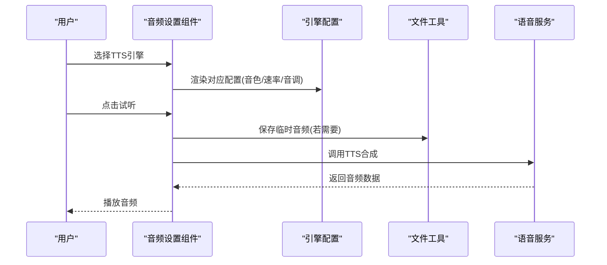
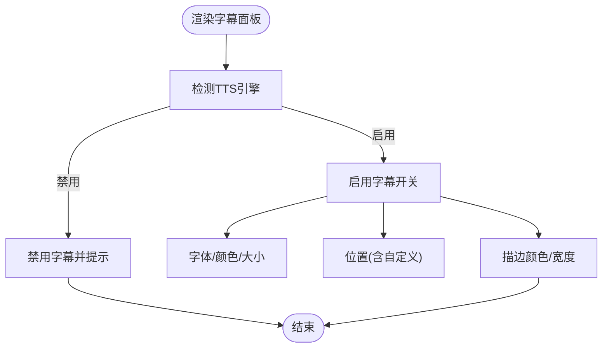
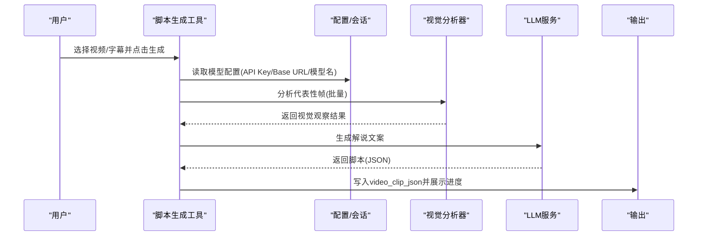
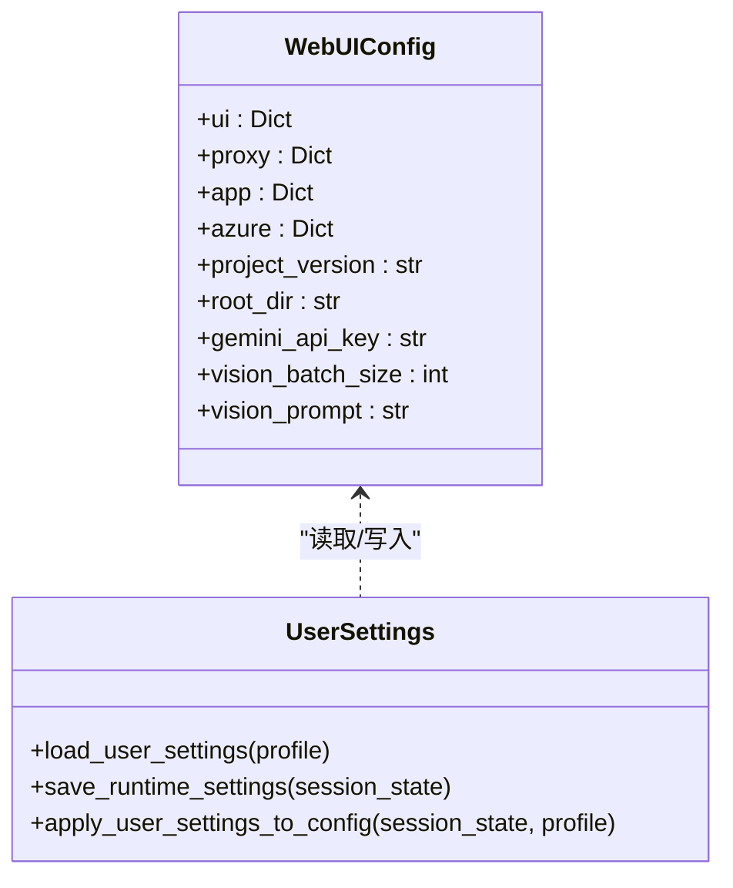
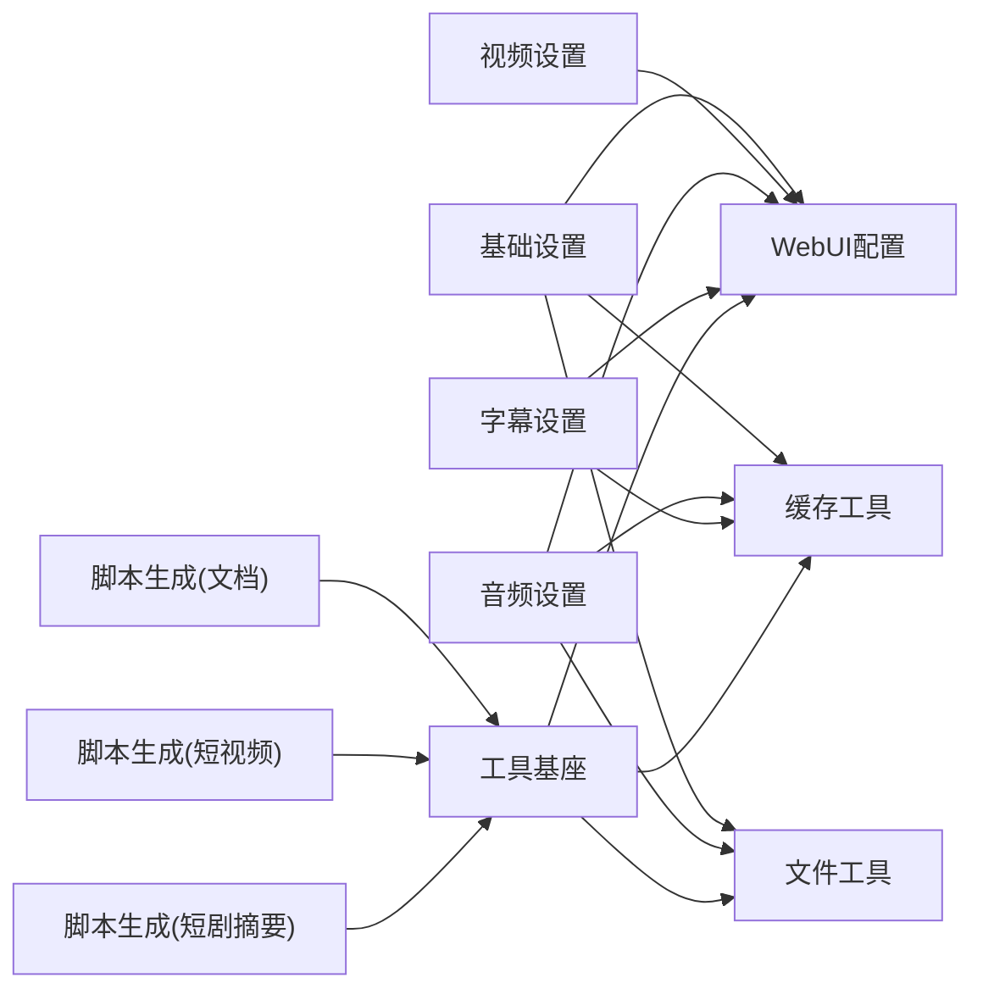

# WebUI组件扩展

<cite>
**本文引用的文件**
- [webui/__init__.py](file://webui/__init__.py)
- [webui/components/__init__.py](file://webui/components/__init__.py)
- [webui/components/basic_settings.py](file://webui/components/basic_settings.py)
- [webui/components/video_settings.py](file://webui/components/video_settings.py)
- [webui/components/audio_settings.py](file://webui/components/audio_settings.py)
- [webui/components/subtitle_settings.py](file://webui/components/subtitle_settings.py)
- [webui/config/settings.py](file://webui/config/settings.py)
- [webui/utils/cache.py](file://webui/utils/cache.py)
- [webui/utils/file_utils.py](file://webui/utils/file_utils.py)
- [webui/tools/base.py](file://webui/tools/base.py)
- [webui/tools/generate_script_docu.py](file://webui/tools/generate_script_docu.py)
- [webui/tools/generate_script_short.py](file://webui/tools/generate_script_short.py)
- [webui/tools/generate_short_summary.py](file://webui/tools/generate_short_summary.py)
- [webui/i18n/en.json](file://webui/i18n/en.json)
- [app/models/schema.py](file://app/models/schema.py)
- [app/services/user_settings.py](file://app/services/user_settings.py)
</cite>

## 目录
1. [简介](#简介)
2. [项目结构](#项目结构)
3. [核心组件](#核心组件)
4. [架构总览](#架构总览)
5. [详细组件分析](#详细组件分析)
6. [依赖分析](#依赖分析)
7. [性能考虑](#性能考虑)
8. [故障排查指南](#故障排查指南)
9. [结论](#结论)
10. [附录](#附录)

## 简介
本指南面向希望扩展 NarratoAI WebUI 的开发者，系统讲解如何基于现有 Streamlit 组件体系新增配置面板、工具界面与设置页面；如何在组件间传递数据与管理状态（参数绑定、事件处理、回调机制）；如何扩展 WebUI 工具系统（新工具类、参数校验、执行流程）；以及如何从界面设计到功能落地完成新 UI 组件的全生命周期开发。同时提供响应式设计与用户体验优化建议、前端测试与用户验收测试方法，以及性能优化策略。

## 项目结构
WebUI 采用“组件 + 工具 + 配置 + 工具库”的分层组织：
- 组件层：基础设置、视频设置、音频设置、字幕设置等，负责渲染 UI 并维护会话状态。
- 工具层：脚本生成工具（文档类、短视频、短剧摘要），封装业务流程与进度反馈。
- 配置层：WebUI 配置对象与持久化，支持用户配置快照与恢复。
- 工具库：通用工具（缓存、文件操作、视觉分析器工厂等）。

图表来源
- [webui/components/basic_settings.py](file://webui/components/basic_settings.py)
- [webui/components/video_settings.py](file://webui/components/video_settings.py)
- [webui/components/audio_settings.py](file://webui/components/audio_settings.py)
- [webui/components/subtitle_settings.py](file://webui/components/subtitle_settings.py)
- [webui/config/settings.py](file://webui/config/settings.py)
- [webui/utils/cache.py](file://webui/utils/cache.py)
- [webui/utils/file_utils.py](file://webui/utils/file_utils.py)
- [webui/tools/base.py](file://webui/tools/base.py)
- [webui/tools/generate_script_docu.py](file://webui/tools/generate_script_docu.py)
- [webui/tools/generate_script_short.py](file://webui/tools/generate_script_short.py)
- [webui/tools/generate_short_summary.py](file://webui/tools/generate_short_summary.py)

章节来源
- [webui/__init__.py](file://webui/__init__.py)
- [webui/components/__init__.py](file://webui/components/__init__.py)

## 核心组件
- WebUI 配置与持久化：集中管理 UI、代理、应用、Azure 等配置，支持加载、保存与动态更新，提供全局配置对象。
- 组件导出：统一导出各设置面板渲染函数，便于在入口处聚合使用。
- 工具基座：提供视觉分析器工厂、批量时间戳解析、批次文件切片等通用能力。
- 缓存与文件工具：为 UI 提供字体、视频、歌曲等资源的缓存与文件操作能力。
- 用户设置快照：支持将运行时配置快照化，按用户档案恢复。

章节来源
- [webui/config/settings.py](file://webui/config/settings.py)
- [webui/components/__init__.py](file://webui/components/__init__.py)
- [webui/tools/base.py](file://webui/tools/base.py)
- [webui/utils/cache.py](file://webui/utils/cache.py)
- [webui/utils/file_utils.py](file://webui/utils/file_utils.py)
- [app/services/user_settings.py](file://app/services/user_settings.py)

## 架构总览
WebUI 通过组件渲染配置项，利用会话状态在组件间共享参数；工具层通过配置与会话状态驱动后端服务，完成复杂业务流程；配置与工具库为组件与工具提供统一的基础设施。

图表来源
- [webui/components/basic_settings.py](file://webui/components/basic_settings.py)
- [webui/config/settings.py](file://webui/config/settings.py)
- [webui/tools/generate_script_docu.py](file://webui/tools/generate_script_docu.py)
- [webui/tools/generate_script_short.py](file://webui/tools/generate_script_short.py)
- [webui/tools/generate_short_summary.py](file://webui/tools/generate_short_summary.py)

## 详细组件分析

### 基础设置组件（LLM/Vision/TTS）
- 功能要点
  - 语言与代理设置：支持切换界面语言、启用/禁用代理并写入环境变量。
  - 视觉模型(LiteLLM)配置：统一提供商、模型名、API Key、Base URL，支持连通性测试与格式校验。
  - 文本模型(LiteLLM)配置：同上，支持连通性测试与格式校验。
  - 参数绑定与状态管理：通过会话状态与配置对象双向同步，保存时触发缓存清理与设置持久化。
- 关键流程（连通性测试）
  - 根据提供商选择不同测试路径（原生 Gemini、OpenAI 兼容、第三方 SDK）。
  - 对 LiteLLM 提供统一测试入口，自动注入环境变量并构造最小化测试请求。
- 错误处理与提示
  - 格式校验失败即时提示；测试失败根据错误类型给出友好提示（认证、模型不存在、限流等）。
- 代码片段路径
  - [render_basic_settings](file://webui/components/basic_settings.py)
  - [test_litellm_vision_model](file://webui/components/basic_settings.py)
  - [test_litellm_text_model](file://webui/components/basic_settings.py)
  - [normalize_litellm_model_name](file://webui/components/basic_settings.py)

图表来源
- [webui/components/basic_settings.py](file://webui/components/basic_settings.py)

章节来源
- [webui/components/basic_settings.py](file://webui/components/basic_settings.py)

### 视频设置组件
- 功能要点
  - 视频比例与质量选择，原声音量滑条。
  - 参数读取：提供统一的参数获取函数，从会话状态读取当前值。
- 代码片段路径
  - [render_video_panel](file://webui/components/video_settings.py)
  - [get_video_params](file://webui/components/video_settings.py)

图表来源
- [webui/components/video_settings.py](file://webui/components/video_settings.py)

章节来源
- [webui/components/video_settings.py](file://webui/components/video_settings.py)

### 音频设置组件（TTS 引擎与参数）
- 功能要点
  - 多引擎支持：Edge TTS、Azure Speech、腾讯云 TTS、Qwen3 TTS、IndexTTS2、SoulVoice。
  - 每个引擎渲染专属配置界面（音色、速率、音调、参数等）。
  - 试听功能：根据当前引擎与参数合成试听音频并播放。
  - 缓存与文件工具：字体缓存、视频/歌曲缓存、文件上传与清理。
- 代码片段路径
  - [render_audio_panel](file://webui/components/audio_settings.py)
  - [render_voice_preview_new](file://webui/components/audio_settings.py)
  - [get_fonts_cache](file://webui/utils/cache.py)
  - [save_uploaded_file](file://webui/utils/file_utils.py)

图表来源
- [webui/components/audio_settings.py](file://webui/components/audio_settings.py)
- [webui/utils/file_utils.py](file://webui/utils/file_utils.py)

章节来源
- [webui/components/audio_settings.py](file://webui/components/audio_settings.py)
- [webui/utils/cache.py](file://webui/utils/cache.py)
- [webui/utils/file_utils.py](file://webui/utils/file_utils.py)

### 字幕设置组件
- 功能要点
  - 开关控制：根据引擎类型决定是否启用字幕。
  - 字体、颜色、大小、描边、位置（含自定义百分比）。
  - 与音频设置联动：部分引擎禁用字幕生成。
- 代码片段路径
  - [render_subtitle_panel](file://webui/components/subtitle_settings.py)
  - [get_subtitle_params](file://webui/components/subtitle_settings.py)

图表来源
- [webui/components/subtitle_settings.py](file://webui/components/subtitle_settings.py)

章节来源
- [webui/components/subtitle_settings.py](file://webui/components/subtitle_settings.py)

### 工具系统扩展（脚本生成）
- 文档类脚本生成
  - 关键流程：准备关键帧 → 构建场景/字幕 → 代表性帧选择 → 视觉分析 → 融合证据 → 生成解说 → 保存中间结果 → 输出脚本。
  - 进度条与状态文本：实时反馈阶段进度。
  - 代码片段路径
    - [generate_script_docu](file://webui/tools/generate_script_docu.py)
    - [create_vision_analyzer](file://webui/tools/base.py)
- 短视频脚本生成
  - 严格输入校验：视频与字幕必填，扩展验证器保证文件存在与类型正确。
  - 读取用户上传字幕或文本内容，调用后端生成脚本。
  - 代码片段路径
    - [generate_script_short](file://webui/tools/generate_script_short.py)
- 短剧摘要脚本生成
  - 字幕解析与剧情总结 → 解说文案生成 → JSON 解析与修复 → 结果写入会话状态。
  - 代码片段路径
    - [generate_script_short_sunmmary](file://webui/tools/generate_short_summary.py)

图表来源
- [webui/tools/generate_script_docu.py](file://webui/tools/generate_script_docu.py)
- [webui/tools/generate_script_short.py](file://webui/tools/generate_script_short.py)
- [webui/tools/generate_short_summary.py](file://webui/tools/generate_short_summary.py)
- [webui/tools/base.py](file://webui/tools/base.py)

章节来源
- [webui/tools/generate_script_docu.py](file://webui/tools/generate_script_docu.py)
- [webui/tools/generate_script_short.py](file://webui/tools/generate_script_short.py)
- [webui/tools/generate_short_summary.py](file://webui/tools/generate_short_summary.py)
- [webui/tools/base.py](file://webui/tools/base.py)

### 配置与状态管理机制
- 配置对象与持久化
  - WebUIConfig：集中存储 UI、代理、应用、Azure 等配置，支持加载、保存与动态更新。
  - 用户设置快照：将运行时配置快照化，按用户档案恢复。
- 组件与会话状态
  - 组件通过会话状态写入/读取参数，工具层同样依赖会话状态与配置对象。
- 代码片段路径
  - [load_config/save_config/update_config](file://webui/config/settings.py)
  - [apply_user_settings_to_config/save_runtime_settings](file://app/services/user_settings.py)

图表来源
- [webui/config/settings.py](file://webui/config/settings.py)
- [app/services/user_settings.py](file://app/services/user_settings.py)

章节来源
- [webui/config/settings.py](file://webui/config/settings.py)
- [app/services/user_settings.py](file://app/services/user_settings.py)

### 数据模型与参数绑定
- 数据模型
  - VideoClipParams：统一承载视频参数（比例、语言、TTS/原声/BGM 音量、字幕样式等）。
  - VideoParams：面向生成视频的参数集合。
- 参数绑定与事件处理
  - 组件通过 Streamlit 控件绑定到会话状态；工具层从会话状态与配置对象读取参数，形成“控件→会话→工具→服务”的数据流。
- 代码片段路径
  - [VideoClipParams](file://app/models/schema.py)
  - [VideoParams](file://app/models/schema.py)

章节来源
- [app/models/schema.py](file://app/models/schema.py)

## 依赖分析
- 组件与配置
  - 组件读取/写入配置对象与会话状态，工具层同样依赖两者。
- 组件与工具库
  - 组件使用缓存工具与文件工具；工具层通过工具基座创建视觉分析器。
- 工具与服务
  - 工具层调用后端服务（关键帧提取、视觉分析、脚本生成等），并将结果写入会话状态。

图表来源
- [webui/components/basic_settings.py](file://webui/components/basic_settings.py)
- [webui/components/video_settings.py](file://webui/components/video_settings.py)
- [webui/components/audio_settings.py](file://webui/components/audio_settings.py)
- [webui/components/subtitle_settings.py](file://webui/components/subtitle_settings.py)
- [webui/config/settings.py](file://webui/config/settings.py)
- [webui/utils/cache.py](file://webui/utils/cache.py)
- [webui/utils/file_utils.py](file://webui/utils/file_utils.py)
- [webui/tools/base.py](file://webui/tools/base.py)
- [webui/tools/generate_script_docu.py](file://webui/tools/generate_script_docu.py)
- [webui/tools/generate_script_short.py](file://webui/tools/generate_script_short.py)
- [webui/tools/generate_short_summary.py](file://webui/tools/generate_short_summary.py)

章节来源
- [webui/components/basic_settings.py](file://webui/components/basic_settings.py)
- [webui/components/video_settings.py](file://webui/components/video_settings.py)
- [webui/components/audio_settings.py](file://webui/components/audio_settings.py)
- [webui/components/subtitle_settings.py](file://webui/components/subtitle_settings.py)
- [webui/config/settings.py](file://webui/config/settings.py)
- [webui/utils/cache.py](file://webui/utils/cache.py)
- [webui/utils/file_utils.py](file://webui/utils/file_utils.py)
- [webui/tools/base.py](file://webui/tools/base.py)
- [webui/tools/generate_script_docu.py](file://webui/tools/generate_script_docu.py)
- [webui/tools/generate_script_short.py](file://webui/tools/generate_script_short.py)
- [webui/tools/generate_short_summary.py](file://webui/tools/generate_short_summary.py)

## 性能考虑
- 批处理与并发
  - 视觉分析采用批处理（工具基座提供批次切片与时间戳解析），减少 API 调用次数与令牌消耗。
- 缓存策略
  - 字体、视频、歌曲列表缓存于会话状态，避免重复扫描与 IO。
- 资源清理
  - 临时文件定期清理，避免磁盘占用；音频试听后及时删除临时文件。
- 配置缓存失效
  - 更新模型配置后清理统一 LLM 服务缓存，确保新配置生效。
- 代码片段路径
  - [get_batch_files/get_batch_timestamps](file://webui/tools/base.py)
  - [get_fonts_cache/get_video_files_cache/get_songs_cache](file://webui/utils/cache.py)
  - [cleanup_temp_files](file://webui/utils/file_utils.py)
  - [UnifiedLLMService.clear_cache](file://webui/components/basic_settings.py)

章节来源
- [webui/tools/base.py](file://webui/tools/base.py)
- [webui/utils/cache.py](file://webui/utils/cache.py)
- [webui/utils/file_utils.py](file://webui/utils/file_utils.py)
- [webui/components/basic_settings.py](file://webui/components/basic_settings.py)

## 故障排查指南
- 连接测试失败
  - 检查 API Key、Base URL、模型名格式；根据提供商选择不同测试路径；查看错误分类（认证、模型不存在、限流）。
- 字幕/试听不可用
  - 某些引擎不支持字幕生成或试听，需切换引擎；确认相关参数（音色、速率、音调）合法。
- 文件上传/路径问题
  - 确认文件类型与路径存在；必要时使用文件工具进行保存与校验。
- 配置未生效
  - 保存后检查是否清理了相关缓存；确认用户设置快照已应用。
- 代码片段路径
  - [test_litellm_vision_model/test_litellm_text_model](file://webui/components/basic_settings.py)
  - [render_subtitle_panel](file://webui/components/subtitle_settings.py)
  - [save_uploaded_file](file://webui/utils/file_utils.py)
  - [apply_user_settings_to_config](file://app/services/user_settings.py)

章节来源
- [webui/components/basic_settings.py](file://webui/components/basic_settings.py)
- [webui/components/subtitle_settings.py](file://webui/components/subtitle_settings.py)
- [webui/utils/file_utils.py](file://webui/utils/file_utils.py)
- [app/services/user_settings.py](file://app/services/user_settings.py)

## 结论
通过统一的配置对象、会话状态与工具库，WebUI 实现了组件与工具之间的松耦合与高内聚。开发者可按本文流程新增设置面板与工具，确保参数绑定、事件处理与回调机制完善，配合缓存与清理策略，保障良好的用户体验与性能表现。

## 附录

### 新增 UI 组件开发流程（从界面到功能）
- 设计阶段
  - 明确参数集与交互行为，参考现有组件（如基础设置、视频设置、音频设置、字幕设置）。
- 组件实现
  - 在组件文件中渲染控件，将参数写入会话状态；提供参数读取函数以便工具层使用。
  - 如需外部资源，使用缓存工具；如需文件操作，使用文件工具。
- 配置与持久化
  - 将关键参数同步到配置对象；必要时扩展用户设置快照以支持多档案。
- 工具集成
  - 在工具层读取配置与会话状态，调用后端服务；提供进度反馈与错误提示。
- 国际化
  - 在 i18n 文件中添加翻译键值，组件中使用翻译函数渲染文本。
- 代码片段路径
  - [render_video_panel](file://webui/components/video_settings.py)
  - [get_video_params](file://webui/components/video_settings.py)
  - [render_audio_panel](file://webui/components/audio_settings.py)
  - [render_subtitle_panel](file://webui/components/subtitle_settings.py)
  - [load_config/save_config](file://webui/config/settings.py)
  - [apply_user_settings_to_config](file://app/services/user_settings.py)
  - [i18n(en)](file://webui/i18n/en.json)

章节来源
- [webui/components/video_settings.py](file://webui/components/video_settings.py)
- [webui/components/audio_settings.py](file://webui/components/audio_settings.py)
- [webui/components/subtitle_settings.py](file://webui/components/subtitle_settings.py)
- [webui/config/settings.py](file://webui/config/settings.py)
- [app/services/user_settings.py](file://app/services/user_settings.py)
- [webui/i18n/en.json](file://webui/i18n/en.json)

### 响应式设计与用户体验优化
- 布局调整
  - 使用 Streamlit 列布局与容器边框，提升信息密度与可读性。
- 交互反馈
  - 使用进度条、状态文本、Spinner 与成功/错误消息，明确告知用户当前状态。
- 错误提示
  - 区分格式校验与网络错误，提供具体修复建议。
- 代码片段路径
  - [render_video_panel](file://webui/components/video_settings.py)
  - [render_audio_panel](file://webui/components/audio_settings.py)
  - [render_subtitle_panel](file://webui/components/subtitle_settings.py)

章节来源
- [webui/components/video_settings.py](file://webui/components/video_settings.py)
- [webui/components/audio_settings.py](file://webui/components/audio_settings.py)
- [webui/components/subtitle_settings.py](file://webui/components/subtitle_settings.py)

### 测试与验收
- 前端测试
  - 使用 Streamlit 的 rerun 与状态断言验证控件行为；对关键流程（连通性测试、试听）编写最小化用例。
- 用户验收测试
  - 覆盖典型场景（文档类脚本、短视频脚本、短剧摘要），验证参数绑定、进度反馈、错误处理与输出一致性。
- 性能测试
  - 批处理与缓存命中率测试；临时文件清理策略验证。
- 代码片段路径
  - [test_litellm_vision_model/test_litellm_text_model](file://webui/components/basic_settings.py)
  - [render_voice_preview_new](file://webui/components/audio_settings.py)
  - [cleanup_temp_files](file://webui/utils/file_utils.py)

章节来源
- [webui/components/basic_settings.py](file://webui/components/basic_settings.py)
- [webui/components/audio_settings.py](file://webui/components/audio_settings.py)
- [webui/utils/file_utils.py](file://webui/utils/file_utils.py)