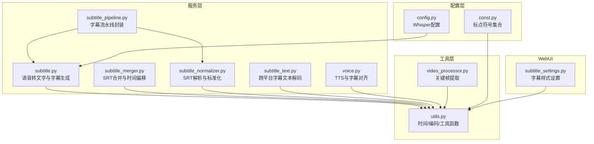
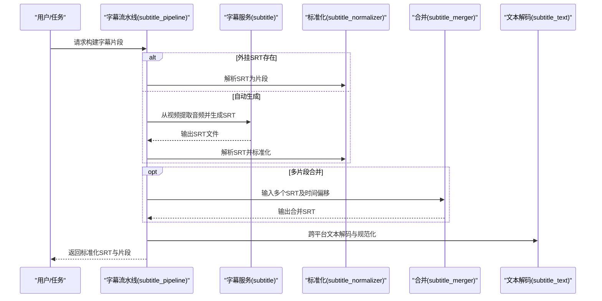
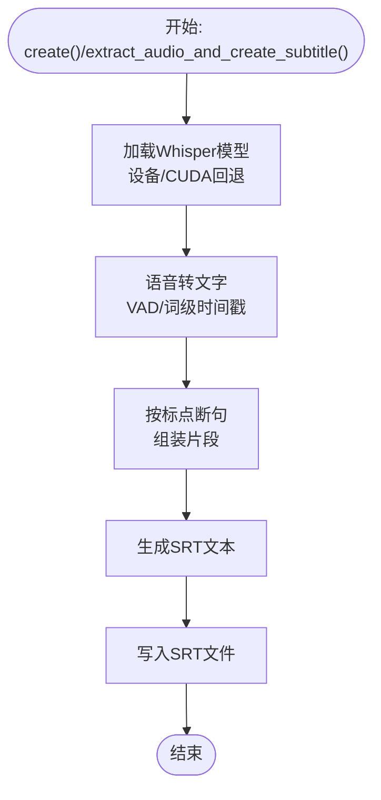
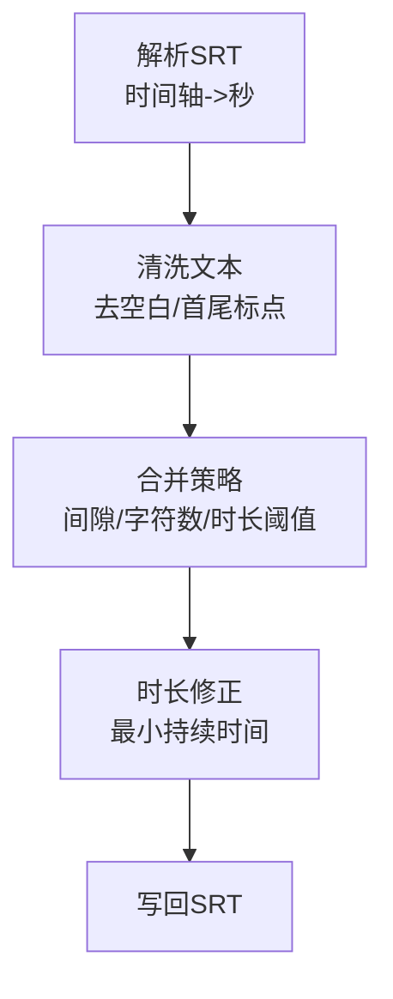
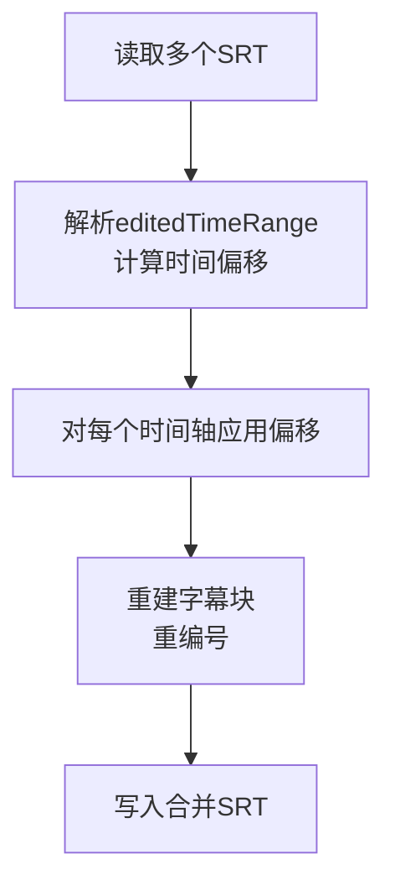
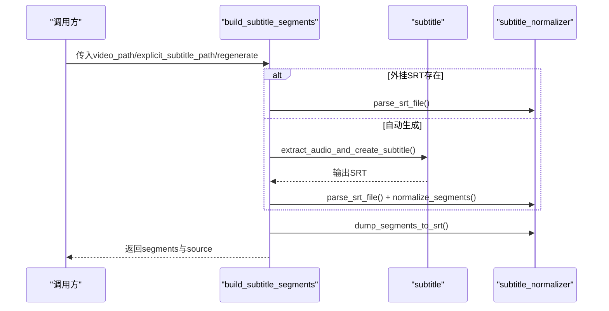
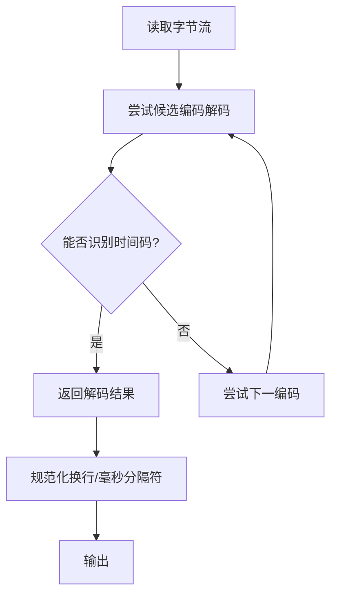
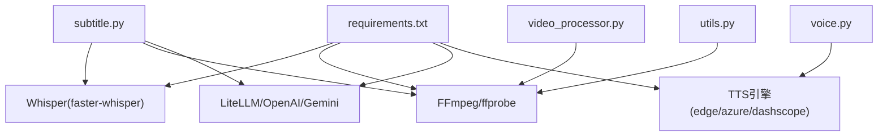

# 字幕处理功能扩展

<cite>
**本文引用的文件**
- [app/services/subtitle.py](file://app/services/subtitle.py)
- [app/services/subtitle_merger.py](file://app/services/subtitle_merger.py)
- [app/services/subtitle_normalizer.py](file://app/services/subtitle_normalizer.py)
- [app/services/subtitle_pipeline.py](file://app/services/subtitle_pipeline.py)
- [app/services/subtitle_text.py](file://app/services/subtitle_text.py)
- [app/utils/utils.py](file://app/utils/utils.py)
- [app/config/config.py](file://app/config/config.py)
- [webui/components/subtitle_settings.py](file://webui/components/subtitle_settings.py)
- [app/models/const.py](file://app/models/const.py)
- [requirements.txt](file://requirements.txt)
- [app/utils/video_processor.py](file://app/utils/video_processor.py)
- [app/services/voice.py](file://app/services/voice.py)
</cite>

## 目录
1. [简介](#简介)
2. [项目结构](#项目结构)
3. [核心组件](#核心组件)
4. [架构总览](#架构总览)
5. [详细组件分析](#详细组件分析)
6. [依赖分析](#依赖分析)
7. [性能考虑](#性能考虑)
8. [故障排查指南](#故障排查指南)
9. [结论](#结论)
10. [附录](#附录)

## 简介
本指南面向希望扩展字幕处理能力的开发者，系统讲解现有字幕生成、解析、合并与标准化的实现机制，并提供扩展新格式、同步算法、翻译技术、OCR识别、语音转文字、多语言支持以及质量评估与优化方法。文档覆盖从预处理、处理到后处理的完整流水线，帮助你在不破坏既有功能的前提下，安全地引入新特性。

## 项目结构
围绕字幕处理的相关模块分布如下：
- 服务层：字幕生成、解析、合并、标准化、流水线封装
- 工具层：通用工具、时间格式转换、标点与编码处理
- 配置层：Whisper模型与运行参数配置
- WebUI：字幕样式与位置设置入口
- 视频帧处理：为OCR/视觉分析提供关键帧提取能力

**图表来源**
- [app/services/subtitle.py:1-467](file://app/services/subtitle.py#L1-L467)
- [app/services/subtitle_merger.py:1-239](file://app/services/subtitle_merger.py#L1-L239)
- [app/services/subtitle_normalizer.py:1-154](file://app/services/subtitle_normalizer.py#L1-L154)
- [app/services/subtitle_pipeline.py:1-64](file://app/services/subtitle_pipeline.py#L1-L64)
- [app/services/subtitle_text.py:1-125](file://app/services/subtitle_text.py#L1-L125)
- [app/utils/utils.py:1-675](file://app/utils/utils.py#L1-L675)
- [app/config/config.py:1-95](file://app/config/config.py#L1-L95)
- [app/models/const.py:1-26](file://app/models/const.py#L1-L26)
- [webui/components/subtitle_settings.py:1-165](file://webui/components/subtitle_settings.py#L1-L165)
- [app/utils/video_processor.py:1-670](file://app/utils/video_processor.py#L1-L670)
- [app/services/voice.py:1357-1473](file://app/services/voice.py#L1357-L1473)

**章节来源**
- [app/services/subtitle.py:1-467](file://app/services/subtitle.py#L1-L467)
- [app/services/subtitle_merger.py:1-239](file://app/services/subtitle_merger.py#L1-L239)
- [app/services/subtitle_normalizer.py:1-154](file://app/services/subtitle_normalizer.py#L1-L154)
- [app/services/subtitle_pipeline.py:1-64](file://app/services/subtitle_pipeline.py#L1-L64)
- [app/services/subtitle_text.py:1-125](file://app/services/subtitle_text.py#L1-L125)
- [app/utils/utils.py:1-675](file://app/utils/utils.py#L1-L675)
- [app/config/config.py:1-95](file://app/config/config.py#L1-L95)
- [app/models/const.py:1-26](file://app/models/const.py#L1-L26)
- [webui/components/subtitle_settings.py:1-165](file://webui/components/subtitle_settings.py#L1-L165)
- [app/utils/video_processor.py:1-670](file://app/utils/video_processor.py#L1-L670)
- [app/services/voice.py:1357-1473](file://app/services/voice.py#L1357-L1473)

## 核心组件
- 语音转文字与字幕生成：基于Whisper模型的实时字幕生成，支持VAD降噪、词级时间戳与语言检测。
- 字幕解析与标准化：解析SRT时间轴，清洗文本，合并相邻片段，保证最小/最大时长约束。
- 字幕合并：按编辑时间范围对多个SRT进行时间偏移合并，输出统一SRT。
- 字幕流水线：封装“外挂字幕优先、否则自动生成”的策略，统一输出标准化SRT。
- 跨平台字幕文本解码：自动检测编码、规范化换行与毫秒分隔符。
- WebUI字幕样式：字体、颜色、描边、位置等样式参数。
- 关键帧提取：为OCR/视觉分析提供高质量关键帧，支撑画面驱动的字幕生成。

**章节来源**
- [app/services/subtitle.py:26-198](file://app/services/subtitle.py#L26-L198)
- [app/services/subtitle_normalizer.py:34-141](file://app/services/subtitle_normalizer.py#L34-L141)
- [app/services/subtitle_merger.py:62-185](file://app/services/subtitle_merger.py#L62-L185)
- [app/services/subtitle_pipeline.py:33-63](file://app/services/subtitle_pipeline.py#L33-L63)
- [app/services/subtitle_text.py:40-124](file://app/services/subtitle_text.py#L40-L124)
- [webui/components/subtitle_settings.py:9-165](file://webui/components/subtitle_settings.py#L9-L165)
- [app/utils/video_processor.py:89-186](file://app/utils/video_processor.py#L89-L186)

## 架构总览
下图展示了从视频到字幕的端到端流程，包括预处理（提取音频/关键帧）、处理（语音转文字、解析与标准化、合并）与后处理（写回SRT、样式应用）。

**图表来源**
- [app/services/subtitle_pipeline.py:33-63](file://app/services/subtitle_pipeline.py#L33-L63)
- [app/services/subtitle.py:383-431](file://app/services/subtitle.py#L383-L431)
- [app/services/subtitle_normalizer.py:34-141](file://app/services/subtitle_normalizer.py#L34-L141)
- [app/services/subtitle_merger.py:62-185](file://app/services/subtitle_merger.py#L62-L185)
- [app/services/subtitle_text.py:40-124](file://app/services/subtitle_text.py#L40-L124)

## 详细组件分析

### 组件A：语音转文字与字幕生成（subtitle.py）
- 功能要点
  - 模型懒加载与设备选择：优先CUDA，失败回退CPU；支持本地模型路径校验。
  - 语音转文字：启用VAD降噪、词级时间戳、beam搜索；内置初始提示词。
  - 字幕生成：按标点断句，生成SRT文本并落盘。
  - 视频到字幕：自动提取音频，再调用生成逻辑。
  - 替代方案：集成Gemini生成SRT。
- 扩展建议
  - 新格式：在生成后统一输出SRT格式，再由标准化模块适配。
  - 同步算法：结合TTS时间戳与脚本时间轴，实现对齐。
  - 多语言：通过语言检测与提示词切换，提升多语种识别质量。
  - OCR：结合关键帧提取，对画面字幕进行OCR识别并合并。

**图表来源**
- [app/services/subtitle.py:26-198](file://app/services/subtitle.py#L26-L198)
- [app/services/subtitle.py:383-431](file://app/services/subtitle.py#L383-L431)

**章节来源**
- [app/services/subtitle.py:26-198](file://app/services/subtitle.py#L26-L198)
- [app/services/subtitle.py:351-381](file://app/services/subtitle.py#L351-L381)
- [app/services/subtitle.py:383-431](file://app/services/subtitle.py#L383-L431)

### 组件B：字幕解析与标准化（subtitle_normalizer.py）
- 功能要点
  - 解析SRT时间轴，转换为秒级时间戳。
  - 文本清洗：去多余空白、去除首尾标点。
  - 合并策略：基于时间间隙、字符数、时长阈值合并相邻片段。
  - 时长修正：确保最小持续时间。
  - 导出：写回SRT。
- 扩展建议
  - 新格式：新增解析器，统一输出标准化结构，复用合并与导出。
  - 翻译：在标准化后插入翻译步骤，保持时间轴不变。
  - 样式：在导出前注入样式标签（需Web渲染层配合）。

**图表来源**
- [app/services/subtitle_normalizer.py:34-141](file://app/services/subtitle_normalizer.py#L34-L141)

**章节来源**
- [app/services/subtitle_normalizer.py:34-141](file://app/services/subtitle_normalizer.py#L34-L141)

### 组件C：字幕合并（subtitle_merger.py）
- 功能要点
  - 从editedTimeRange提取时间偏移，对各SRT时间轴进行统一偏移。
  - 按偏移时间排序合并，输出单一SRT。
  - 错误处理：跳过无效文件、空内容、解析失败。
- 扩展建议
  - 多轨对齐：结合TTS/脚本时间轴，动态计算偏移。
  - 格式兼容：支持ASS/ASS等格式输入，内部统一为SRT。

**图表来源**
- [app/services/subtitle_merger.py:62-185](file://app/services/subtitle_merger.py#L62-L185)

**章节来源**
- [app/services/subtitle_merger.py:62-185](file://app/services/subtitle_merger.py#L62-L185)

### 组件D：字幕流水线（subtitle_pipeline.py）
- 功能要点
  - 优先使用外挂SRT；否则自动生成并缓存。
  - 解析SRT、标准化、写回SRT。
  - 统一返回片段与来源信息。
- 扩展建议
  - 多来源融合：同时支持TTS字幕与ASR字幕，按相似度对齐合并。
  - 条件化生成：根据视频内容与语言自动选择模型/提示词。

**图表来源**
- [app/services/subtitle_pipeline.py:33-63](file://app/services/subtitle_pipeline.py#L33-L63)

**章节来源**
- [app/services/subtitle_pipeline.py:19-63](file://app/services/subtitle_pipeline.py#L19-L63)

### 组件E：跨平台字幕文本解码（subtitle_text.py）
- 功能要点
  - 自动检测常见编码（UTF-8/UTF-16/GBK等），优先能识别时间码的解码。
  - 规范化换行与毫秒分隔符（. → ,）。
  - 提供统一的解码接口，避免平台差异导致的解析失败。
- 扩展建议
  - 新格式：新增解析器，统一走此解码接口。
  - 错误恢复：最后采用替换不可解码字节的策略。

**图表来源**
- [app/services/subtitle_text.py:69-124](file://app/services/subtitle_text.py#L69-L124)

**章节来源**
- [app/services/subtitle_text.py:40-124](file://app/services/subtitle_text.py#L40-L124)

### 组件F：WebUI字幕样式设置（subtitle_settings.py）
- 功能要点
  - 字体、字号、颜色、描边宽度与位置（顶部/中部/底部/自定义百分比）。
  - 针对特定TTS引擎禁用字幕生成提示。
- 扩展建议
  - 增加样式模板、批量应用、预览功能。
  - 与字幕标准化导出对接，将样式信息写入SRT/ASS。

**章节来源**
- [webui/components/subtitle_settings.py:9-165](file://webui/components/subtitle_settings.py#L9-L165)

### 组件G：关键帧提取（video_processor.py）
- 功能要点
  - 多策略提取：软件解码、硬件加速、超级兼容性方案。
  - 针对Windows/MJPEG问题的特殊处理。
- 扩展建议
  - OCR字幕：将关键帧送入OCR模型，生成画面字幕并与TTS/ASR对齐。
  - 视觉分析：结合画面描述生成字幕脚本，再进入TTS流程。

**章节来源**
- [app/utils/video_processor.py:89-186](file://app/utils/video_processor.py#L89-L186)
- [app/utils/video_processor.py:495-584](file://app/utils/video_processor.py#L495-L584)

### 组件H：TTS与字幕对齐（voice.py）
- 功能要点
  - 多引擎支持：edge-tts、Azure、SoulVoice、DashScope等。
  - 字幕生成：将脚本按标点切分，结合TTS时间戳生成SRT。
  - 与脚本时间轴对齐：按脚本时长比例缩放TTS时间戳。
- 扩展建议
  - 翻译后对齐：在翻译后仍保持时间轴一致性。
  - 多语言：根据语言切换语音引擎与发音人。

**章节来源**
- [app/services/voice.py:1357-1473](file://app/services/voice.py#L1357-L1473)
- [app/services/voice.py:1745-1782](file://app/services/voice.py#L1745-L1782)

## 依赖分析
- 外部依赖
  - Whisper模型：faster-whisper（可选，需本地模型文件）。
  - FFmpeg：视频/音频处理与关键帧提取。
  - LLM/Gemini：替代语音转文字或字幕分析。
  - TTS引擎：edge-tts、Azure Speech、DashScope等。
- 内部依赖
  - utils：时间格式转换、编码处理、临时目录管理。
  - config：Whisper模型大小、设备、计算类型等配置。

**图表来源**
- [requirements.txt:1-39](file://requirements.txt#L1-L39)
- [app/services/subtitle.py:7-18](file://app/services/subtitle.py#L7-L18)
- [app/utils/video_processor.py:1-24](file://app/utils/video_processor.py#L1-L24)
- [app/utils/utils.py:1-24](file://app/utils/utils.py#L1-L24)

**章节来源**
- [requirements.txt:1-39](file://requirements.txt#L1-L39)
- [app/config/config.py:60-95](file://app/config/config.py#L60-L95)

## 性能考虑
- 设备选择与回退
  - 优先CUDA，失败回退CPU，避免启动阻塞。
  - 计算类型按设备选择（float16 vs int8）。
- 语音转文字
  - 启用VAD降噪与词级时间戳，减少后处理成本。
  - beam搜索参数平衡速度与准确率。
- 合并与标准化
  - 合并前先解析时间轴，避免重复转换。
  - 合并时按偏移时间排序，减少遍历成本。
- I/O与缓存
  - 字幕文件缓存到临时目录，避免重复生成。
  - 关键帧提取使用超级兼容性方案，减少失败重试。

**章节来源**
- [app/services/subtitle.py:37-102](file://app/services/subtitle.py#L37-L102)
- [app/services/subtitle.py:108-115](file://app/services/subtitle.py#L108-L115)
- [app/services/subtitle_merger.py:73-75](file://app/services/subtitle_merger.py#L73-L75)
- [app/services/subtitle_pipeline.py:45-51](file://app/services/subtitle_pipeline.py#L45-L51)
- [app/utils/video_processor.py:188-220](file://app/utils/video_processor.py#L188-L220)

## 故障排查指南
- Whisper模型缺失
  - 现象：无法加载模型，报错提示下载模型。
  - 处理：确认模型目录与bin文件存在，或按提示下载。
- CUDA加载失败
  - 现象：尝试CUDA失败后回退CPU。
  - 处理：检查显卡驱动与CUDA环境；必要时禁用CUDA。
- 字幕解析失败
  - 现象：SRT时间轴格式不规范。
  - 处理：使用跨平台解码模块规范化；确保毫秒分隔符为逗号。
- 合并失败
  - 现象：部分SRT为空或路径无效。
  - 处理：检查输入路径与内容；确认editedTimeRange格式。
- 关键帧提取失败
  - 现象：Windows系统MJPEG编码问题。
  - 处理：启用超级兼容性方案，或改用PNG中间格式。

**章节来源**
- [app/services/subtitle.py:39-49](file://app/services/subtitle.py#L39-L49)
- [app/services/subtitle.py:64-88](file://app/services/subtitle.py#L64-L88)
- [app/services/subtitle_text.py:78-111](file://app/services/subtitle_text.py#L78-L111)
- [app/services/subtitle_merger.py:81-91](file://app/services/subtitle_merger.py#L81-L91)
- [app/utils/video_processor.py:311-407](file://app/utils/video_processor.py#L311-L407)

## 结论
通过将“语音转文字”“解析与标准化”“合并”“跨平台解码”“关键帧提取”“TTS对齐”等能力模块化，本项目形成了可扩展的字幕处理流水线。开发者可在不破坏现有流程的前提下，按需引入新格式、同步算法、翻译与OCR能力，并通过统一的标准化与导出接口保障质量与兼容性。

## 附录

### 开发流程（新功能接入步骤）
- 语音转文字/OCR
  - 使用关键帧提取模块获取画面帧，接入OCR模型生成画面字幕。
  - 将OCR结果与TTS/ASR字幕统一为SRT格式。
- 同步算法
  - 以脚本时间轴为基准，计算TTS/ASR时间戳比例，动态缩放并断句。
- 翻译技术
  - 在标准化后插入翻译步骤，保持时间轴不变。
- 格式转换
  - 新格式解析器输出统一结构，复用标准化与导出模块。
- 样式定制
  - 通过WebUI参数或导出前样式注入，实现字体、颜色、描边与位置定制。

**章节来源**
- [app/utils/video_processor.py:495-584](file://app/utils/video_processor.py#L495-L584)
- [app/services/voice.py:1357-1473](file://app/services/voice.py#L1357-L1473)
- [app/services/subtitle_normalizer.py:82-141](file://app/services/subtitle_normalizer.py#L82-L141)
- [webui/components/subtitle_settings.py:47-165](file://webui/components/subtitle_settings.py#L47-L165)

### 精度优化技巧
- 时间对齐
  - 使用相似度匹配（如Levenshtein）对齐脚本与字幕，必要时合并/截断。
  - 依据脚本时长比例缩放TTS时间戳，避免漂移。
- 字符编码
  - 统一使用跨平台解码模块，规范化换行与毫秒分隔符。
- 格式兼容
  - 严格遵循SRT时间轴格式；合并前统一为秒级时间戳再偏移。
- 多语言支持
  - 语言检测与提示词切换；针对方言/口音调整VAD与beam参数。

**章节来源**
- [app/services/subtitle.py:257-349](file://app/services/subtitle.py#L257-L349)
- [app/services/subtitle_text.py:40-66](file://app/services/subtitle_text.py#L40-L66)
- [app/utils/utils.py:385-429](file://app/utils/utils.py#L385-L429)

### 质量评估与用户体验优化
- 质量评估
  - 与脚本相似度阈值（>0.8视为匹配）；统计合并/截断次数。
  - 时间偏差均值与方差；字符数与时长分布。
- 准确性测试
  - 人工抽样对比ASR/TTS/OCR结果；记录错误类型（漏识/误识/错位）。
- 用户体验
  - WebUI提供样式预览与一键应用；关键帧提取失败自动降级。
  - 生成进度与错误提示清晰，便于用户重试与修复。

**章节来源**
- [app/services/subtitle.py:257-349](file://app/services/subtitle.py#L257-L349)
- [webui/components/subtitle_settings.py:9-45](file://webui/components/subtitle_settings.py#L9-L45)
- [app/utils/video_processor.py:188-220](file://app/utils/video_processor.py#L188-L220)