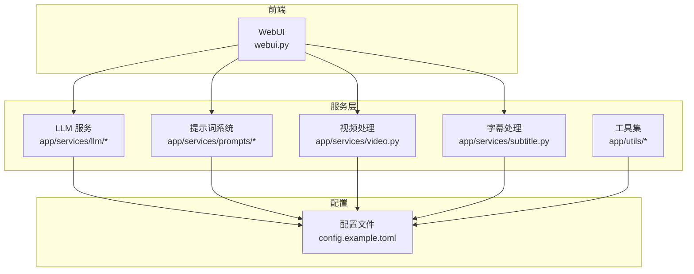
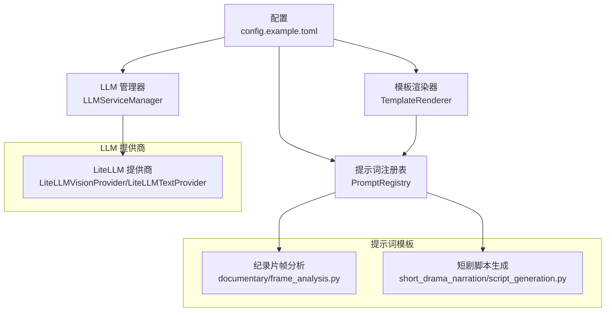
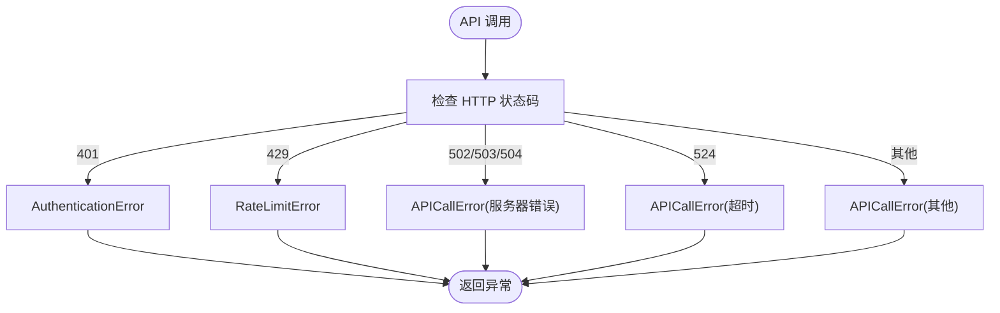
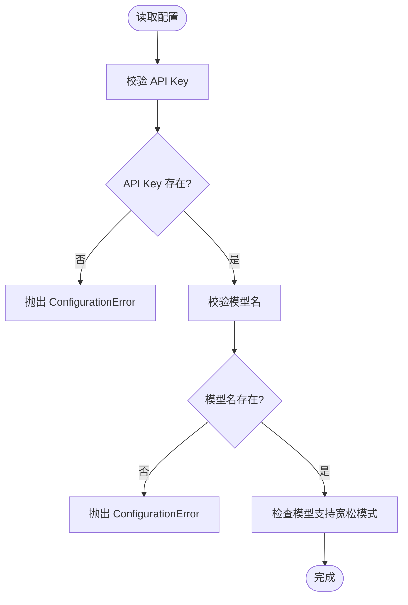
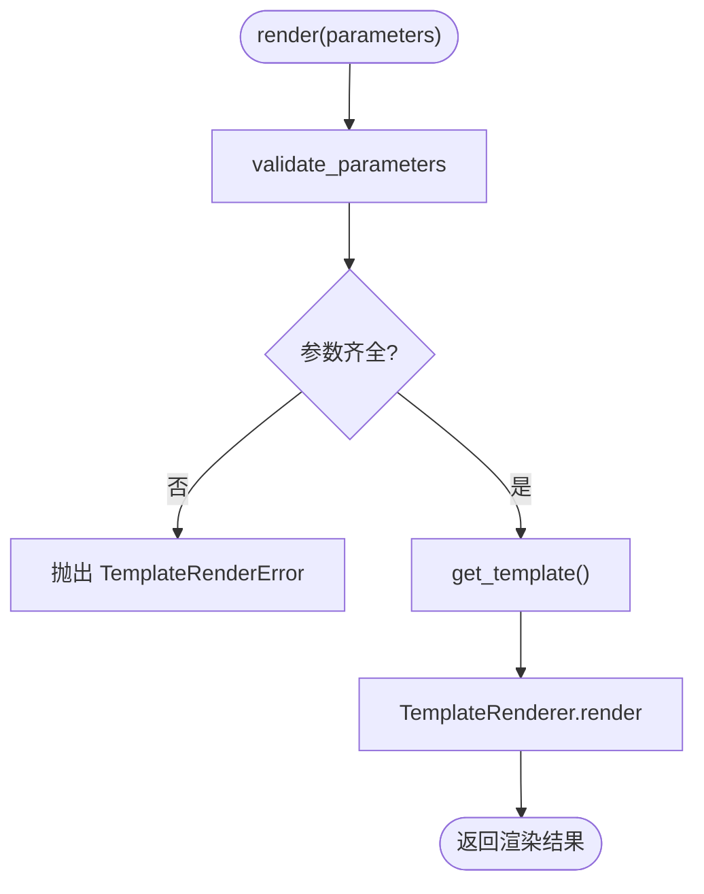
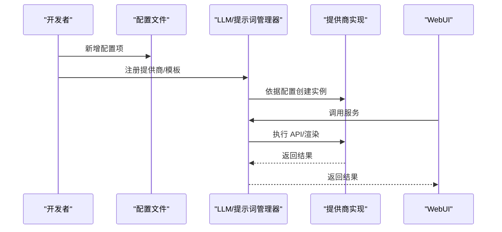
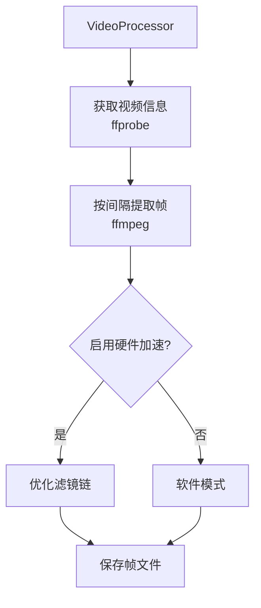
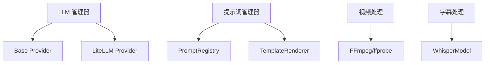

# 扩展开发指南

<cite>
**本文档引用的文件**
- [README.md](file://README.md)
- [webui.py](file://webui.py)
- [config.example.toml](file://config.example.toml)
- [app/services/llm/base.py](file://app/services/llm/base.py)
- [app/services/llm/manager.py](file://app/services/llm/manager.py)
- [app/services/llm/providers/__init__.py](file://app/services/llm/providers/__init__.py)
- [app/services/llm/litellm_provider.py](file://app/services/llm/litellm_provider.py)
- [app/services/prompts/base.py](file://app/services/prompts/base.py)
- [app/services/prompts/manager.py](file://app/services/prompts/manager.py)
- [app/services/prompts/registry.py](file://app/services/prompts/registry.py)
- [app/services/prompts/template.py](file://app/services/prompts/template.py)
- [app/services/prompts/documentary/frame_analysis.py](file://app/services/prompts/documentary/frame_analysis.py)
- [app/services/prompts/short_drama_narration/script_generation.py](file://app/services/prompts/short_drama_narration/script_generation.py)
- [app/services/video.py](file://app/services/video.py)
- [app/services/subtitle.py](file://app/services/subtitle.py)
- [app/utils/video_processor.py](file://app/utils/video_processor.py)
</cite>

## 目录
1. [简介](#简介)
2. [项目结构](#项目结构)
3. [核心组件](#核心组件)
4. [架构概览](#架构概览)
5. [详细组件分析](#详细组件分析)
6. [依赖分析](#依赖分析)
7. [性能考虑](#性能考虑)
8. [故障排除指南](#故障排除指南)
9. [结论](#结论)
10. [附录](#附录)

## 简介
本指南面向希望扩展 NarratoAI 的开发者，系统讲解如何：
- 添加新的 LLM 提供商（接口实现、配置验证、错误处理）
- 扩展提示词系统（新模板、验证规则、版本管理）
- 开发新功能模块（从需求到实现的完整流程）
- 修改现有功能（向后兼容、测试与文档）
- 扩展现有视频/音频/字幕处理模块
- 理解插件化架构的设计原理与扩展点

## 项目结构
NarratoAI 采用分层与功能模块化组织：
- app/services：核心业务服务（LLM、提示词、视频、音频、字幕、剪辑等）
- app/utils：通用工具（FFmpeg、视频处理、分析器等）
- webui：Streamlit 前端界面与组件
- config：配置管理（示例配置文件）

**图表来源**
- [webui.py:1-200](file://webui.py#L1-L200)
- [config.example.toml:1-177](file://config.example.toml#L1-L177)

**章节来源**
- [README.md:1-180](file://README.md#L1-L180)
- [webui.py:1-200](file://webui.py#L1-L200)
- [config.example.toml:1-177](file://config.example.toml#L1-L177)

## 核心组件
- LLM 服务管理器：统一注册与获取提供商实例，支持缓存与配置驱动
- 提示词系统：模板渲染、参数校验、版本管理、输出验证
- 视频/字幕处理：基于 MoviePy/FFmpeg 的视频处理与字幕生成
- 插件化注册：通过 providers/__init__.py 的注册函数集中注册提供商

**章节来源**
- [app/services/llm/manager.py:1-246](file://app/services/llm/manager.py#L1-L246)
- [app/services/prompts/manager.py:1-288](file://app/services/prompts/manager.py#L1-L288)
- [app/services/prompts/registry.py:1-224](file://app/services/prompts/registry.py#L1-L224)
- [app/services/prompts/template.py:1-181](file://app/services/prompts/template.py#L1-L181)
- [app/services/video.py:1-200](file://app/services/video.py#L1-L200)
- [app/services/subtitle.py:1-200](file://app/services/subtitle.py#L1-L200)
- [app/utils/video_processor.py:1-200](file://app/utils/video_processor.py#L1-L200)

## 架构概览
系统采用“配置驱动 + 工厂 + 注册表”的插件化架构：
- 配置驱动：通过 config.example.toml 提供提供商、模型、API Key、超时等参数
- 工厂模式：LLMServiceManager 提供统一入口，按提供商名称与配置创建实例
- 注册表：提示词系统通过 PromptRegistry 管理模板版本与默认版本
- 模板引擎：TemplateRenderer 提供参数替换与过滤器扩展

**图表来源**
- [config.example.toml:1-177](file://config.example.toml#L1-L177)
- [app/services/llm/manager.py:1-246](file://app/services/llm/manager.py#L1-L246)
- [app/services/llm/litellm_provider.py:1-491](file://app/services/llm/litellm_provider.py#L1-L491)
- [app/services/prompts/registry.py:1-224](file://app/services/prompts/registry.py#L1-L224)
- [app/services/prompts/template.py:1-181](file://app/services/prompts/template.py#L1-L181)
- [app/services/prompts/documentary/frame_analysis.py:1-68](file://app/services/prompts/documentary/frame_analysis.py#L1-L68)
- [app/services/prompts/short_drama_narration/script_generation.py:1-308](file://app/services/prompts/short_drama_narration/script_generation.py#L1-L308)

## 详细组件分析

### LLM 提供商扩展指南
目标：新增一个 LLM 提供商（以 LiteLLM 为例，展示如何对接新提供商）。

- 设计要点
  - 继承抽象基类：VisionModelProvider 或 TextModelProvider
  - 实现 provider_name、supported_models 属性与 _make_api_call/_initialize 等方法
  - 配置验证：在基类构造中完成 API Key、模型名等校验
  - 错误处理：统一映射到 LLMServiceError 子类
  - 注册：通过 providers/__init__.py 的 register_all_providers() 注册

- 关键步骤
  1) 定义提供商类
     - 参考路径：[app/services/llm/base.py:16-190](file://app/services/llm/base.py#L16-L190)
     - 参考实现：[app/services/llm/litellm_provider.py:59-491](file://app/services/llm/litellm_provider.py#L59-L491)
  2) 配置文件
     - 在 config.example.toml 中添加对应前缀的配置项
     - 参考路径：[config.example.toml:23-51](file://config.example.toml#L23-L51)
  3) 注册提供商
     - 在 providers/__init__.py 中导入并注册
     - 参考路径：[app/services/llm/providers/__init__.py:12-44](file://app/services/llm/providers/__init__.py#L12-L44)
  4) 管理器获取
     - LLMServiceManager 依据配置前缀读取参数并创建实例
     - 参考路径：[app/services/llm/manager.py:68-209](file://app/services/llm/manager.py#L68-L209)

- 错误处理映射

**图表来源**
- [app/services/llm/base.py:87-101](file://app/services/llm/base.py#L87-L101)

- 配置验证流程

**图表来源**
- [app/services/llm/base.py:56-77](file://app/services/llm/base.py#L56-L77)

**章节来源**
- [app/services/llm/base.py:16-190](file://app/services/llm/base.py#L16-L190)
- [app/services/llm/manager.py:15-246](file://app/services/llm/manager.py#L15-L246)
- [app/services/llm/providers/__init__.py:12-44](file://app/services/llm/providers/__init__.py#L12-L44)
- [app/services/llm/litellm_provider.py:38-56](file://app/services/llm/litellm_provider.py#L38-L56)
- [config.example.toml:23-51](file://config.example.toml#L23-L51)

### 提示词系统扩展指南
目标：新增一个提示词模板，包含参数校验、版本管理与输出验证。

- 设计要点
  - 定义 PromptMetadata（名称、分类、版本、模型类型、输出格式、标签、参数）
  - 继承 BasePrompt/TextPrompt/VisionPrompt/ParameterizedPrompt
  - 实现 get_template 与可选的 get_system_prompt/get_examples
  - 使用 TemplateRenderer 渲染，支持过滤器与变量提取
  - 通过 PromptRegistry 注册与版本管理

- 关键步骤
  1) 创建模板类
     - 参考路径：[app/services/prompts/base.py:50-183](file://app/services/prompts/base.py#L50-L183)
     - 示例模板：[app/services/prompts/documentary/frame_analysis.py:15-68](file://app/services/prompts/documentary/frame_analysis.py#L15-L68)
     - 示例模板：[app/services/prompts/short_drama_narration/script_generation.py:15-308](file://app/services/prompts/short_drama_narration/script_generation.py#L15-L308)
  2) 注册模板
     - 通过 PromptManager.register_prompt 注册，可设置默认版本
     - 参考路径：[app/services/prompts/manager.py:82-92](file://app/services/prompts/manager.py#L82-L92)
  3) 版本管理
     - PromptRegistry 支持默认版本、查询、删除、搜索
     - 参考路径：[app/services/prompts/registry.py:35-157](file://app/services/prompts/registry.py#L35-L157)
  4) 输出验证
     - PromptManager.validate_output 根据输出格式进行验证
     - 参考路径：[app/services/prompts/manager.py:164-202](file://app/services/prompts/manager.py#L164-L202)

- 参数校验与渲染流程

**图表来源**
- [app/services/prompts/base.py:97-133](file://app/services/prompts/base.py#L97-L133)
- [app/services/prompts/template.py:31-64](file://app/services/prompts/template.py#L31-L64)

**章节来源**
- [app/services/prompts/base.py:19-183](file://app/services/prompts/base.py#L19-L183)
- [app/services/prompts/manager.py:26-288](file://app/services/prompts/manager.py#L26-L288)
- [app/services/prompts/registry.py:24-224](file://app/services/prompts/registry.py#L24-L224)
- [app/services/prompts/template.py:20-181](file://app/services/prompts/template.py#L20-L181)
- [app/services/prompts/documentary/frame_analysis.py:15-68](file://app/services/prompts/documentary/frame_analysis.py#L15-L68)
- [app/services/prompts/short_drama_narration/script_generation.py:15-308](file://app/services/prompts/short_drama_narration/script_generation.py#L15-L308)

### 新功能模块开发流程
从需求到实现的完整流程：

**图表来源**
- [config.example.toml:1-177](file://config.example.toml#L1-L177)
- [app/services/llm/manager.py:68-209](file://app/services/llm/manager.py#L68-L209)
- [app/services/llm/providers/__init__.py:12-44](file://app/services/llm/providers/__init__.py#L12-L44)
- [app/services/prompts/manager.py:26-116](file://app/services/prompts/manager.py#L26-L116)

**章节来源**
- [config.example.toml:1-177](file://config.example.toml#L1-L177)
- [app/services/llm/manager.py:15-246](file://app/services/llm/manager.py#L15-L246)
- [app/services/prompts/manager.py:26-288](file://app/services/prompts/manager.py#L26-L288)

### 现有功能修改与向后兼容
- 向后兼容性
  - 保持接口签名稳定，新增参数使用默认值
  - 提示词版本管理确保旧模板仍可使用
- 测试覆盖
  - 为新增提供商补充单元测试与集成测试
  - 为提示词模板补充渲染与验证测试
- 文档更新
  - 更新配置示例与使用说明
  - 更新提示词模板文档与参数说明

[本节为通用指导，无需特定文件引用]

### 扩展现有视频/音频/字幕处理模块

#### 视频处理扩展
- 扩展点
  - 视频尺寸调整、字幕叠加、循环音频拼接等工具函数
  - VideoProcessor 帧提取（基于 FFmpeg）
- 实现建议
  - 在 app/services/video.py 中新增工具函数
  - 在 app/utils/video_processor.py 中扩展帧提取策略
  - 通过配置控制硬件加速与输出质量

**图表来源**
- [app/utils/video_processor.py:45-200](file://app/utils/video_processor.py#L45-L200)
- [app/services/video.py:108-200](file://app/services/video.py#L108-L200)

**章节来源**
- [app/utils/video_processor.py:26-200](file://app/utils/video_processor.py#L26-L200)
- [app/services/video.py:108-200](file://app/services/video.py#L108-L200)

#### 字幕处理扩展
- 扩展点
  - Whisper 模型加载与转录
  - 字幕格式转换与时间戳处理
- 实现建议
  - 在 app/services/subtitle.py 中扩展转录策略
  - 支持多模型与本地模型缓存

**章节来源**
- [app/services/subtitle.py:26-200](file://app/services/subtitle.py#L26-L200)

### 插件化架构设计原理
- 设计原则
  - 低耦合：通过抽象基类与工厂隔离具体实现
  - 可扩展：通过注册函数集中注册提供商与模板
  - 配置驱动：通过配置文件控制提供商、模型与参数
- 约束条件
  - 提供商需实现统一接口
  - 提示词模板需遵循元数据与渲染协议
  - 配置项命名需与管理器读取规则一致

**章节来源**
- [app/services/llm/providers/__init__.py:12-44](file://app/services/llm/providers/__init__.py#L12-L44)
- [app/services/llm/manager.py:15-246](file://app/services/llm/manager.py#L15-L246)
- [app/services/prompts/registry.py:24-224](file://app/services/prompts/registry.py#L24-L224)

## 依赖分析
- 组件耦合
  - LLM 管理器依赖配置与提供商实现
  - 提示词管理器依赖注册表与模板渲染器
  - 视频/字幕模块依赖 FFmpeg 与第三方库
- 外部依赖
  - LiteLLM、MoviePy、WhisperModel、FFmpeg 等

**图表来源**
- [app/services/llm/manager.py:15-246](file://app/services/llm/manager.py#L15-L246)
- [app/services/llm/litellm_provider.py:59-491](file://app/services/llm/litellm_provider.py#L59-L491)
- [app/services/prompts/manager.py:26-288](file://app/services/prompts/manager.py#L26-L288)
- [app/services/prompts/registry.py:24-224](file://app/services/prompts/registry.py#L24-L224)
- [app/services/prompts/template.py:20-181](file://app/services/prompts/template.py#L20-L181)
- [app/utils/video_processor.py:26-200](file://app/utils/video_processor.py#L26-L200)
- [app/services/subtitle.py:26-200](file://app/services/subtitle.py#L26-L200)

**章节来源**
- [app/services/llm/manager.py:15-246](file://app/services/llm/manager.py#L15-L246)
- [app/services/prompts/manager.py:26-288](file://app/services/prompts/manager.py#L26-L288)
- [app/utils/video_processor.py:26-200](file://app/utils/video_processor.py#L26-L200)
- [app/services/subtitle.py:26-200](file://app/services/subtitle.py#L26-L200)

## 性能考虑
- LLM 调用
  - 使用 LiteLLM 的自动重试与超时配置
  - 控制批处理大小与并发
- 视频处理
  - 启用硬件加速（FFmpeg）以提升帧提取性能
  - 合理设置帧间隔与输出分辨率
- 字幕处理
  - 优先使用 GPU 加速（CUDA）加载 Whisper 模型
  - 合理设置 VAD 参数与词级时间戳

[本节为通用指导，无需特定文件引用]

## 故障排除指南
- LLM 提供商未注册
  - 确认在应用启动时调用 register_all_providers()
  - 检查配置中的提供商名称与前缀
  - 参考路径：[app/services/llm/manager.py:83-88](file://app/services/llm/manager.py#L83-L88)
- API Key 或模型配置错误
  - 检查 config.example.toml 中对应前缀的配置项
  - 参考路径：[config.example.toml:23-51](file://config.example.toml#L23-L51)
- 提示词渲染失败
  - 检查必需参数是否齐全
  - 使用 validate_parameters 与 TemplateRenderer.validate_template
  - 参考路径：[app/services/prompts/base.py:97-133](file://app/services/prompts/base.py#L97-L133)
- 视频帧提取失败
  - 禁用硬件加速或检查 FFmpeg 配置
  - 参考路径：[app/utils/video_processor.py:188-200](file://app/utils/video_processor.py#L188-L200)
- 字幕转录异常
  - 确认 Whisper 模型已下载并放置在正确路径
  - 参考路径：[app/services/subtitle.py:37-50](file://app/services/subtitle.py#L37-L50)

**章节来源**
- [app/services/llm/manager.py:83-88](file://app/services/llm/manager.py#L83-L88)
- [config.example.toml:23-51](file://config.example.toml#L23-L51)
- [app/services/prompts/base.py:97-133](file://app/services/prompts/base.py#L97-L133)
- [app/utils/video_processor.py:188-200](file://app/utils/video_processor.py#L188-L200)
- [app/services/subtitle.py:37-50](file://app/services/subtitle.py#L37-L50)

## 结论
通过本指南，开发者可以：
- 快速添加新的 LLM 提供商并接入统一管理
- 扩展提示词系统并维护版本与验证
- 按照插件化架构扩展视频/音频/字幕处理模块
- 在修改现有功能时保证向后兼容与测试覆盖

[本节为总结，无需特定文件引用]

## 附录
- 配置示例参考：[config.example.toml:1-177](file://config.example.toml#L1-L177)
- WebUI 启动与初始化：[webui.py:1-200](file://webui.py#L1-L200)

[本节为补充信息，无需特定文件引用]