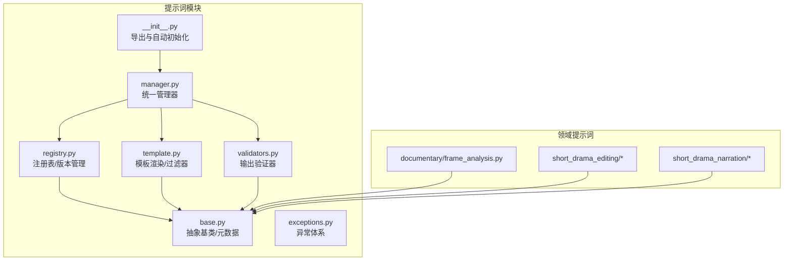
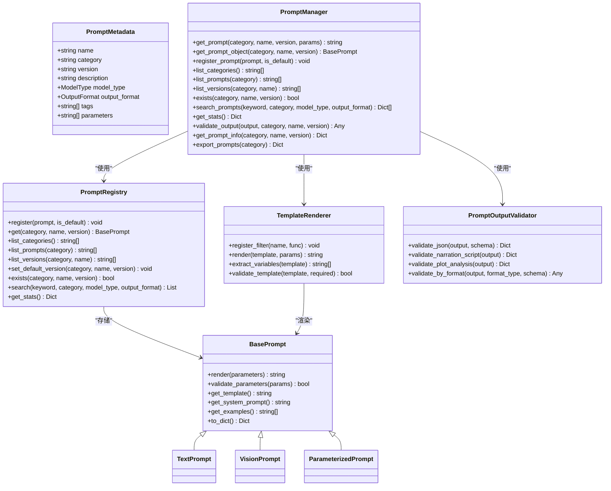
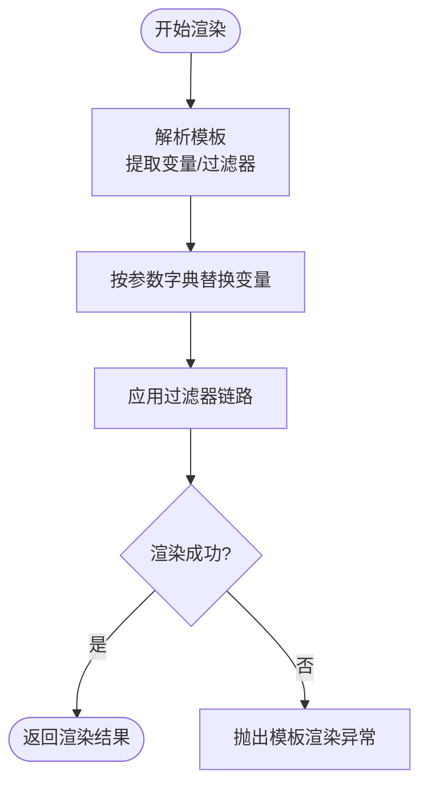
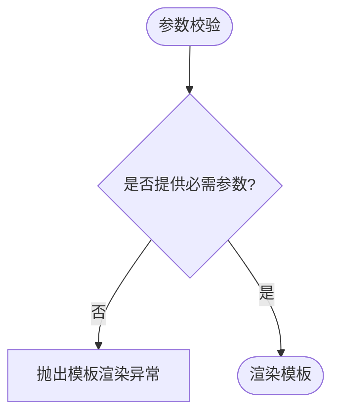
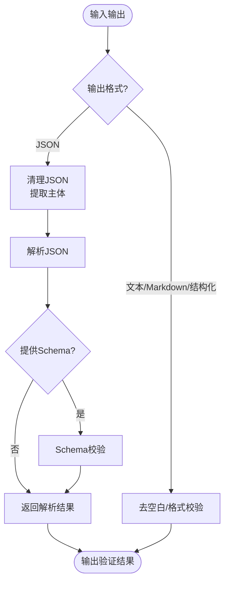
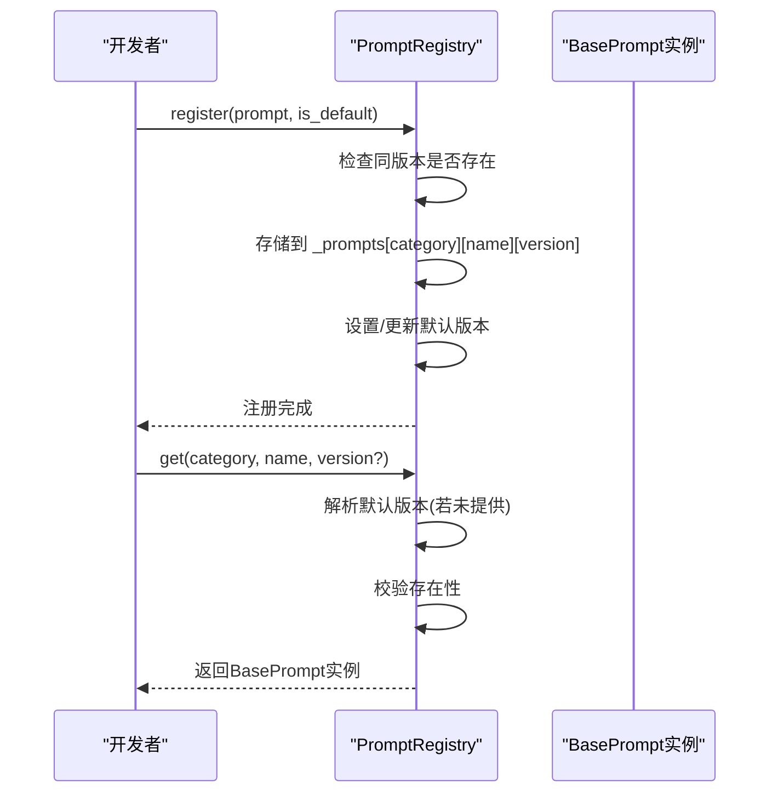
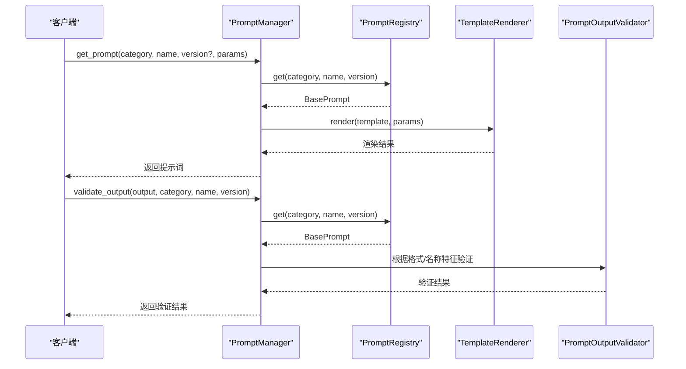
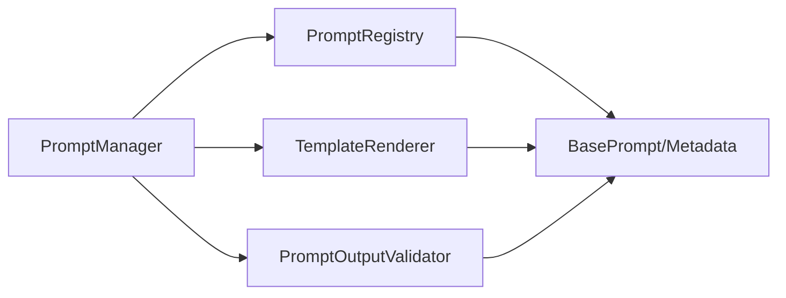

# 提示词系统扩展

<cite>
**本文引用的文件**
- [app/services/prompts/base.py](file://app/services/prompts/base.py)
- [app/services/prompts/template.py](file://app/services/prompts/template.py)
- [app/services/prompts/manager.py](file://app/services/prompts/manager.py)
- [app/services/prompts/validators.py](file://app/services/prompts/validators.py)
- [app/services/prompts/registry.py](file://app/services/prompts/registry.py)
- [app/services/prompts/exceptions.py](file://app/services/prompts/exceptions.py)
- [app/services/prompts/__init__.py](file://app/services/prompts/__init__.py)
- [app/services/prompts/short_drama_narration/script_generation.py](file://app/services/prompts/short_drama_narration/script_generation.py)
- [app/services/prompts/short_drama_narration/plot_analysis.py](file://app/services/prompts/short_drama_narration/plot_analysis.py)
- [app/services/prompts/short_drama_editing/plot_extraction.py](file://app/services/prompts/short_drama_editing/plot_extraction.py)
- [app/services/prompts/short_drama_editing/subtitle_analysis.py](file://app/services/prompts/short_drama_editing/subtitle_analysis.py)
- [app/services/prompts/documentary/frame_analysis.py](file://app/services/prompts/documentary/frame_analysis.py)
</cite>

## 目录
1. [简介](#简介)
2. [项目结构](#项目结构)
3. [核心组件](#核心组件)
4. [架构总览](#架构总览)
5. [详细组件分析](#详细组件分析)
6. [依赖关系分析](#依赖关系分析)
7. [性能与优化](#性能与优化)
8. [故障排查指南](#故障排查指南)
9. [结论](#结论)
10. [附录](#附录)

## 简介
本指南面向希望扩展与深度使用提示词系统的开发者与产品人员，系统性讲解提示词模板的设计原理、实现方法与最佳实践，涵盖模板语法、变量替换、过滤器、参数校验、输出验证、版本管理、多模态支持、性能优化与错误处理，并提供可直接落地的开发与测试流程。

## 项目结构
提示词系统位于 app/services/prompts 目录下，采用“按功能域分包 + 统一管理”的组织方式：
- base.py：抽象基类与元数据模型
- template.py：模板渲染引擎与过滤器
- registry.py：提示词注册表与版本管理
- manager.py：统一管理器，对外提供便捷接口
- validators.py：输出验证器，支持JSON/文本/Markdown/结构化
- exceptions.py：统一异常体系
- 各领域子包：documentary、short_drama_editing、short_drama_narration，分别提供具体提示词实现

图表来源
- [app/services/prompts/__init__.py:1-69](file://app/services/prompts/__init__.py#L1-L69)
- [app/services/prompts/manager.py:1-288](file://app/services/prompts/manager.py#L1-L288)
- [app/services/prompts/registry.py:1-224](file://app/services/prompts/registry.py#L1-L224)
- [app/services/prompts/template.py:1-181](file://app/services/prompts/template.py#L1-L181)
- [app/services/prompts/validators.py:1-251](file://app/services/prompts/validators.py#L1-L251)
- [app/services/prompts/base.py:1-183](file://app/services/prompts/base.py#L1-L183)
- [app/services/prompts/documentary/frame_analysis.py:1-68](file://app/services/prompts/documentary/frame_analysis.py#L1-L68)
- [app/services/prompts/short_drama_editing/plot_extraction.py:1-141](file://app/services/prompts/short_drama_editing/plot_extraction.py#L1-L141)
- [app/services/prompts/short_drama_editing/subtitle_analysis.py:1-118](file://app/services/prompts/short_drama_editing/subtitle_analysis.py#L1-L118)
- [app/services/prompts/short_drama_narration/script_generation.py:1-308](file://app/services/prompts/short_drama_narration/script_generation.py#L1-L308)
- [app/services/prompts/short_drama_narration/plot_analysis.py:1-91](file://app/services/prompts/short_drama_narration/plot_analysis.py#L1-L91)

章节来源
- [app/services/prompts/__init__.py:1-69](file://app/services/prompts/__init__.py#L1-L69)

## 核心组件
- 抽象基类与元数据
  - BasePrompt：定义模板获取、系统提示、示例、参数校验与渲染流程
  - PromptMetadata：承载名称、分类、版本、描述、模型类型、输出格式、标签、参数列表等
  - 模型类型与输出格式枚举：支持文本、视觉、多模态与多种输出格式
- 模板渲染引擎
  - TemplateRenderer：提供变量替换、过滤器链路、变量提取、模板验证
  - 内置过滤器：大小写、标题、去空白、截断、JSON序列化
- 注册表与版本管理
  - PromptRegistry：按分类/名称/版本存储，支持默认版本、查询、搜索、统计
- 统一管理器
  - PromptManager：封装获取、注册、搜索、导出、统计、输出验证等
- 输出验证器
  - PromptOutputValidator：支持JSON清理、Schema校验、特定业务格式（解说脚本、剧情分析）校验
- 异常体系
  - PromptError、PromptNotFoundError、PromptValidationError、TemplateRenderError、PromptRegistrationError、PromptVersionError

章节来源
- [app/services/prompts/base.py:19-183](file://app/services/prompts/base.py#L19-L183)
- [app/services/prompts/template.py:20-181](file://app/services/prompts/template.py#L20-L181)
- [app/services/prompts/registry.py:24-224](file://app/services/prompts/registry.py#L24-L224)
- [app/services/prompts/manager.py:26-288](file://app/services/prompts/manager.py#L26-L288)
- [app/services/prompts/validators.py:21-251](file://app/services/prompts/validators.py#L21-L251)
- [app/services/prompts/exceptions.py:13-80](file://app/services/prompts/exceptions.py#L13-L80)

## 架构总览
提示词系统采用“注册表 + 管理器 + 渲染器 + 验证器”的分层架构，对外提供统一入口，内部通过注册表维护版本与默认版本，渲染器负责模板替换与过滤，验证器保障输出质量。

图表来源
- [app/services/prompts/base.py:50-183](file://app/services/prompts/base.py#L50-L183)
- [app/services/prompts/template.py:20-181](file://app/services/prompts/template.py#L20-L181)
- [app/services/prompts/registry.py:24-224](file://app/services/prompts/registry.py#L24-L224)
- [app/services/prompts/manager.py:26-288](file://app/services/prompts/manager.py#L26-L288)
- [app/services/prompts/validators.py:21-251](file://app/services/prompts/validators.py#L21-L251)

## 详细组件分析

### 模板语法与渲染流程
- 变量替换
  - 支持 ${var} 与 $var 两种形式，按参数字典进行替换
  - 渲染失败时抛出模板渲染异常
- 过滤器语法
  - ${var|filter} 形式，内置大小写、标题、去空白、截断、JSON序列化等
  - 过滤器缺失或执行异常会回退为原文本
- 模板验证
  - 提取变量并校验必需参数
  - 使用占位参数尝试渲染，捕获异常并返回布尔结果

图表来源
- [app/services/prompts/template.py:31-91](file://app/services/prompts/template.py#L31-L91)
- [app/services/prompts/base.py:112-133](file://app/services/prompts/base.py#L112-L133)

章节来源
- [app/services/prompts/template.py:20-181](file://app/services/prompts/template.py#L20-L181)
- [app/services/prompts/base.py:97-133](file://app/services/prompts/base.py#L97-L133)

### 参数校验与模板校验
- 参数校验
  - 基于元数据中的 parameters 列表进行缺失参数检查
  - 缺少必填参数时抛出模板渲染异常
- 模板校验
  - 提取模板变量并与所需参数对比
  - 使用测试参数尝试渲染，捕获异常

图表来源
- [app/services/prompts/base.py:97-111](file://app/services/prompts/base.py#L97-L111)
- [app/services/prompts/template.py:99-124](file://app/services/prompts/template.py#L99-L124)

章节来源
- [app/services/prompts/base.py:97-111](file://app/services/prompts/base.py#L97-L111)
- [app/services/prompts/template.py:99-124](file://app/services/prompts/template.py#L99-L124)

### 输出验证器
- JSON清理与解析
  - 去除代码块标记与前后空白，提取JSON主体
  - 支持Schema校验
- 业务格式验证
  - 解说脚本：校验 items 数组、字段存在性、时间戳格式、OST取值范围等
  - 剧情分析：校验 summary 与 plot_points、时间戳格式（多种）

图表来源
- [app/services/prompts/validators.py:24-240](file://app/services/prompts/validators.py#L24-L240)

章节来源
- [app/services/prompts/validators.py:21-251](file://app/services/prompts/validators.py#L21-L251)

### 版本管理与注册表
- 存储结构
  - 三层嵌套字典：分类 → 名称 → 版本 → 实例
  - 默认版本映射：分类 → 名称 → 默认版本
- 操作
  - 注册：同名同版本冲突检测；首次或显式默认版本设置
  - 获取：支持默认版本解析；不存在抛出未找到异常
  - 删除：支持删除全部或指定版本；删除默认版本时自动选择新默认版本
  - 搜索：关键词、模型类型、输出格式过滤
  - 统计：分类数、提示词数、版本数

图表来源
- [app/services/prompts/registry.py:35-92](file://app/services/prompts/registry.py#L35-L92)

章节来源
- [app/services/prompts/registry.py:24-224](file://app/services/prompts/registry.py#L24-L224)

### 统一管理器接口
- 获取提示词
  - 通过注册表获取实例并调用 render(parameters)
- 注册提示词
  - 直接委托给注册表
- 搜索与统计
  - 支持关键词、模型类型、输出格式过滤
- 输出验证
  - 根据输出格式与提示词名称特征选择验证策略

图表来源
- [app/services/prompts/manager.py:34-202](file://app/services/prompts/manager.py#L34-L202)

章节来源
- [app/services/prompts/manager.py:26-288](file://app/services/prompts/manager.py#L26-L288)

### 多模态提示词模板示例
- 纪录片关键帧分析（视觉模型）
  - 模型类型：视觉
  - 输出格式：JSON
  - 关键点：时间戳、画面描述、场景类型、关键元素、视觉质量
- 短剧剧情分析（文本模型）
  - 模型类型：文本
  - 输出格式：文本
  - 关键点：整体概括、分段解析、时间戳定位
- 短剧脚本生成（文本/多模态）
  - 模型类型：文本
  - 输出格式：JSON
  - 关键点：黄金开场、爽点放大、个性吐槽、卡点配合、时间戳管理
- 短剧爆点提取（文本模型）
  - 模型类型：文本
  - 输出格式：JSON
  - 关键点：连贯性原则、时间段技术规范、过渡片段策略

章节来源
- [app/services/prompts/documentary/frame_analysis.py:15-68](file://app/services/prompts/documentary/frame_analysis.py#L15-L68)
- [app/services/prompts/short_drama_narration/plot_analysis.py:15-91](file://app/services/prompts/short_drama_narration/plot_analysis.py#L15-L91)
- [app/services/prompts/short_drama_narration/script_generation.py:15-308](file://app/services/prompts/short_drama_narration/script_generation.py#L15-L308)
- [app/services/prompts/short_drama_editing/plot_extraction.py:15-141](file://app/services/prompts/short_drama_editing/plot_extraction.py#L15-L141)

## 依赖关系分析
- 模块耦合
  - PromptManager 依赖 PromptRegistry、TemplateRenderer、PromptOutputValidator
  - PromptRegistry 仅依赖基础类与异常
  - TemplateRenderer 依赖基础类与异常
  - Validators 依赖基础类与异常
- 外部依赖
  - 渲染器使用字符串模板替换与正则
  - 验证器使用 JSON 解析与正则校验
- 循环依赖
  - 无循环依赖，职责清晰

图表来源
- [app/services/prompts/manager.py:15-23](file://app/services/prompts/manager.py#L15-L23)
- [app/services/prompts/registry.py:16-21](file://app/services/prompts/registry.py#L16-L21)
- [app/services/prompts/template.py:17-17](file://app/services/prompts/template.py#L17-L17)
- [app/services/prompts/validators.py:17-18](file://app/services/prompts/validators.py#L17-L18)

章节来源
- [app/services/prompts/manager.py:15-23](file://app/services/prompts/manager.py#L15-L23)
- [app/services/prompts/registry.py:16-21](file://app/services/prompts/registry.py#L16-L21)
- [app/services/prompts/template.py:17-17](file://app/services/prompts/template.py#L17-L17)
- [app/services/prompts/validators.py:17-18](file://app/services/prompts/validators.py#L17-L18)

## 性能与优化
- 渲染性能
  - 模板变量替换为线性扫描，复杂度 O(N*M)，N为模板长度，M为参数数量
  - 过滤器链路按序执行，建议减少不必要的过滤器组合
- 缓存策略
  - 当前未实现模板/渲染结果缓存
  - 建议：对静态模板与固定参数组合进行LRU缓存；对频繁使用的提示词对象进行进程内缓存
- 并发与日志
  - 日志使用异步友好库，注意在高并发场景下避免日志风暴
- 错误快速失败
  - 参数缺失与模板渲染异常尽早抛出，避免无效计算

[本节为通用性能讨论，无需源码引用]

## 故障排查指南
- 常见异常
  - 提示词未找到：检查分类/名称/版本是否存在
  - 模板渲染失败：检查变量是否齐全、过滤器是否注册、模板语法是否正确
  - 输出验证失败：检查输出格式与业务规则，查看验证器异常消息
- 排查步骤
  - 使用管理器的 get_prompt_info 获取元数据与模板预览
  - 使用 validate_output 对输出进行针对性验证
  - 使用 search_prompts 按关键词/模型类型/输出格式筛选
  - 使用 export_prompts 导出配置用于离线核对

章节来源
- [app/services/prompts/exceptions.py:18-80](file://app/services/prompts/exceptions.py#L18-L80)
- [app/services/prompts/manager.py:204-237](file://app/services/prompts/manager.py#L204-L237)
- [app/services/prompts/manager.py:118-147](file://app/services/prompts/manager.py#L118-L147)
- [app/services/prompts/manager.py:240-271](file://app/services/prompts/manager.py#L240-L271)

## 结论
该提示词系统以清晰的分层设计实现了模板渲染、参数校验、输出验证与版本管理，具备良好的扩展性与可维护性。建议在生产环境中补充缓存、批量渲染优化与更完善的测试覆盖，以进一步提升稳定性与性能。

[本节为总结，无需源码引用]

## 附录

### 新提示词模板创建流程
- 定义元数据
  - 指定名称、分类、版本、描述、模型类型、输出格式、标签、必需参数
- 继承基类
  - 文本/视觉/多模态专用基类或 ParameterizedPrompt
- 实现模板
  - 在 get_template 中返回模板字符串，必要时设置系统提示与示例
- 注册与默认版本
  - 通过管理器注册，必要时设置默认版本
- 参数校验与模板校验
  - 在渲染前由基类自动校验参数；可使用模板验证工具进行静态校验
- 输出验证
  - 使用管理器的 validate_output 或验证器进行格式与业务规则校验

章节来源
- [app/services/prompts/base.py:50-183](file://app/services/prompts/base.py#L50-L183)
- [app/services/prompts/manager.py:82-92](file://app/services/prompts/manager.py#L82-L92)
- [app/services/prompts/template.py:99-124](file://app/services/prompts/template.py#L99-L124)
- [app/services/prompts/validators.py:21-251](file://app/services/prompts/validators.py#L21-L251)

### 提示词验证器编写要点
- 数据类型检查
  - 使用验证器的类型判断与异常抛出
- 范围与格式验证
  - 时间戳格式、数值范围、枚举值等
- 业务规则约束
  - 解说脚本的 items、OST、时间戳连续性与非重叠
  - 剧情分析的摘要与情节点结构

章节来源
- [app/services/prompts/validators.py:55-215](file://app/services/prompts/validators.py#L55-L215)

### 版本管理与回滚策略
- 版本控制
  - 通过注册表按版本存储；默认版本用于未指定版本的获取
- 回滚策略
  - 删除当前默认版本后自动选择最高可用版本；或手动 set_default_version
- 兼容性保证
  - 保持元数据 parameters 的向后兼容；新增参数需提供默认值或可选

章节来源
- [app/services/prompts/registry.py:114-157](file://app/services/prompts/registry.py#L114-L157)

### 多模态提示词模板示例路径
- 纪录片关键帧分析
  - [app/services/prompts/documentary/frame_analysis.py:15-68](file://app/services/prompts/documentary/frame_analysis.py#L15-L68)
- 短剧剧情分析
  - [app/services/prompts/short_drama_narration/plot_analysis.py:15-91](file://app/services/prompts/short_drama_narration/plot_analysis.py#L15-L91)
- 短剧脚本生成
  - [app/services/prompts/short_drama_narration/script_generation.py:15-308](file://app/services/prompts/short_drama_narration/script_generation.py#L15-L308)
- 短剧爆点提取
  - [app/services/prompts/short_drama_editing/plot_extraction.py:15-141](file://app/services/prompts/short_drama_editing/plot_extraction.py#L15-L141)
- 短剧字幕分析
  - [app/services/prompts/short_drama_editing/subtitle_analysis.py:15-118](file://app/services/prompts/short_drama_editing/subtitle_analysis.py#L15-L118)

### 测试与集成建议
- 单元测试
  - 模板渲染：构造最小模板与参数，验证变量替换与过滤器
  - 参数校验：缺失参数触发异常，多余参数不影响
  - 输出验证：构造边界数据与非法数据，验证异常抛出
- 集成测试
  - 通过管理器获取提示词并调用 LLM 生成输出，再用验证器校验
  - 导出/导入流程：export_prompts 后 to_dict 校验一致性
- 性能测试
  - 批量渲染与缓存命中率测试，评估过滤器链路开销

[本节为通用测试建议，无需源码引用]