# 视频处理功能扩展

<cite>
**本文档引用的文件**
- [app/services/video.py](file://app/services/video.py)
- [app/utils/video_processor.py](file://app/utils/video_processor.py)
- [app/config/ffmpeg_config.py](file://app/config/ffmpeg_config.py)
- [app/utils/ffmpeg_utils.py](file://app/utils/ffmpeg_utils.py)
- [app/services/clip_video.py](file://app/services/clip_video.py)
- [app/services/merger_video.py](file://app/services/merger_video.py)
- [app/models/schema.py](file://app/models/schema.py)
- [app/services/generate_video.py](file://app/services/generate_video.py)
- [webui/components/ffmpeg_diagnostics.py](file://webui/components/ffmpeg_diagnostics.py)
- [requirements.txt](file://requirements.txt)
- [README.md](file://README.md)
</cite>

## 目录
1. [简介](#简介)
2. [项目结构](#项目结构)
3. [核心组件](#核心组件)
4. [架构概览](#架构概览)
5. [详细组件分析](#详细组件分析)
6. [依赖分析](#依赖分析)
7. [性能考虑](#性能考虑)
8. [故障排除指南](#故障排除指南)
9. [结论](#结论)
10. [附录](#附录)

## 简介

NarratoAI 是一个基于 AI 的影视解说和自动化剪辑工具，专注于提供一站式的视频内容创作解决方案。本项目的核心在于视频处理功能的扩展，包括视频剪辑、合并、转码、特效处理等多个方面。

项目采用模块化架构设计，通过 FFmpeg 工具集实现高效的视频处理能力，同时提供了丰富的配置管理和诊断功能。系统支持多种硬件加速技术，能够根据不同平台和硬件条件自动选择最优的处理方案。

## 项目结构

项目采用清晰的分层架构，主要分为以下几个层次：

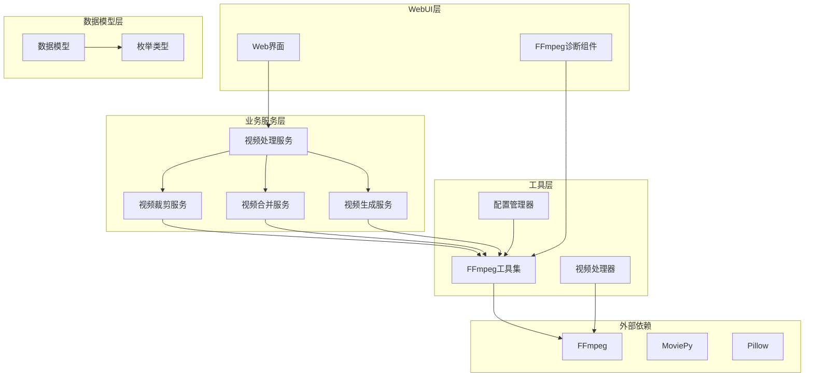

**图表来源**
- [app/services/video.py:1-418](file://app/services/video.py#L1-L418)
- [app/utils/video_processor.py:1-670](file://app/utils/video_processor.py#L1-L670)
- [app/config/ffmpeg_config.py:1-285](file://app/config/ffmpeg_config.py#L1-L285)

**章节来源**
- [README.md:105-141](file://README.md#L105-L141)
- [requirements.txt:1-39](file://requirements.txt#L1-L39)

## 核心组件

### 视频处理服务架构

系统的核心视频处理能力由多个相互协作的服务组成，每个服务都有明确的职责分工：

#### 视频处理主服务
- **功能**：提供统一的视频处理接口
- **特性**：支持多种视频格式、字幕处理、音效合成
- **集成**：与 MoviePy 和 FFmpeg 工具集深度集成

#### 视频帧提取工具
- **功能**：从视频中提取关键帧
- **特性**：支持硬件加速、多种输出格式、进度监控
- **兼容性**：针对不同平台和硬件提供优化方案

#### FFmpeg 配置管理器
- **功能**：管理 FFmpeg 的配置和参数
- **特性**：支持多种配置文件、自动推荐、兼容性报告
- **优化**：针对不同硬件和平台提供最优配置

**章节来源**
- [app/services/video.py:200-418](file://app/services/video.py#L200-L418)
- [app/utils/video_processor.py:26-670](file://app/utils/video_processor.py#L26-L670)
- [app/config/ffmpeg_config.py:27-96](file://app/config/ffmpeg_config.py#L27-L96)

## 架构概览

系统采用分层架构设计，确保各组件之间的松耦合和高内聚：

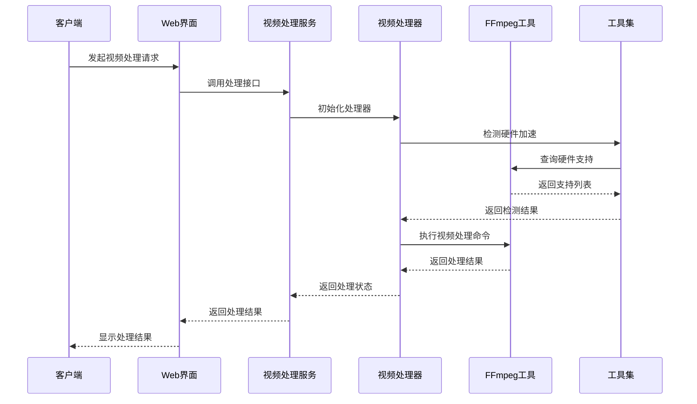

**图表来源**
- [app/utils/ffmpeg_utils.py:252-355](file://app/utils/ffmpeg_utils.py#L252-L355)
- [app/utils/video_processor.py:464-494](file://app/utils/video_processor.py#L464-L494)

### 处理流程架构

系统支持多种视频处理流程，每种流程都有特定的适用场景：

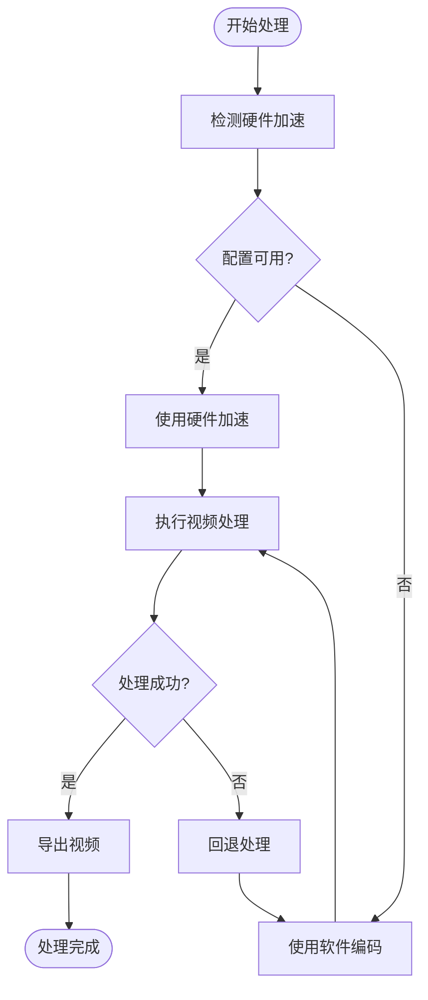

**图表来源**
- [app/services/merger_video.py:130-326](file://app/services/merger_video.py#L130-L326)
- [app/services/clip_video.py:230-302](file://app/services/clip_video.py#L230-L302)

## 详细组件分析

### 视频帧提取组件

视频帧提取是视频处理的基础功能，系统提供了强大的帧提取能力：

#### 核心功能特性
- **多策略提取**：支持纯软件、硬件加速、兼容性模式
- **进度监控**：实时显示提取进度和成功率
- **错误处理**：自动检测和处理提取失败的情况
- **格式支持**：支持多种输出格式（JPG、PNG等）

#### 提取策略优化

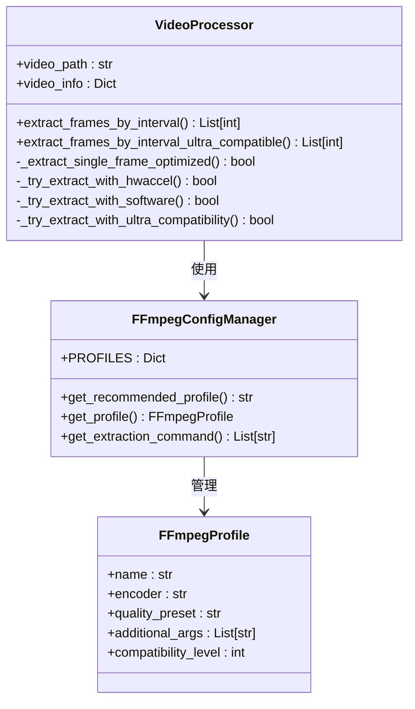

**图表来源**
- [app/utils/video_processor.py:26-670](file://app/utils/video_processor.py#L26-L670)
- [app/config/ffmpeg_config.py:13-96](file://app/config/ffmpeg_config.py#L13-L96)

**章节来源**
- [app/utils/video_processor.py:89-187](file://app/utils/video_processor.py#L89-L187)
- [app/config/ffmpeg_config.py:160-232](file://app/config/ffmpeg_config.py#L160-L232)

### FFmpeg 工具集

FFmpeg 工具集是系统的核心处理引擎，提供了完整的视频处理能力：

#### 硬件加速检测机制

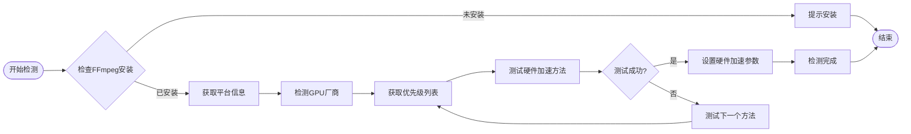

**图表来源**
- [app/utils/ffmpeg_utils.py:252-355](file://app/utils/ffmpeg_utils.py#L252-L355)

#### 配置管理策略

系统提供了多种预定义的配置文件，针对不同的硬件和平台进行优化：

| 配置文件 | 平台 | 硬件加速 | 编码器 | 兼容性等级 |
|---------|------|----------|--------|------------|
| high_performance | Windows/macOS/Linux | 自动检测 | h264_nvenc/h264_amf/h264_qsv | 2 |
| compatibility | 所有平台 | 禁用 | libx264 | 5 |
| windows_nvidia | Windows NVIDIA | nvenc_pure | h264_nvenc | 3 |
| macos_videotoolbox | macOS | videotoolbox | h264_videotoolbox | 3 |
| universal_software | 所有平台 | 禁用 | libx264 | 5 |

**章节来源**
- [app/utils/ffmpeg_utils.py:778-800](file://app/utils/ffmpeg_utils.py#L778-L800)
- [app/config/ffmpeg_config.py:31-96](file://app/config/ffmpeg_config.py#L31-L96)

### 视频剪辑组件

视频剪辑功能支持多种剪辑模式和质量控制：

#### 剪辑模式支持

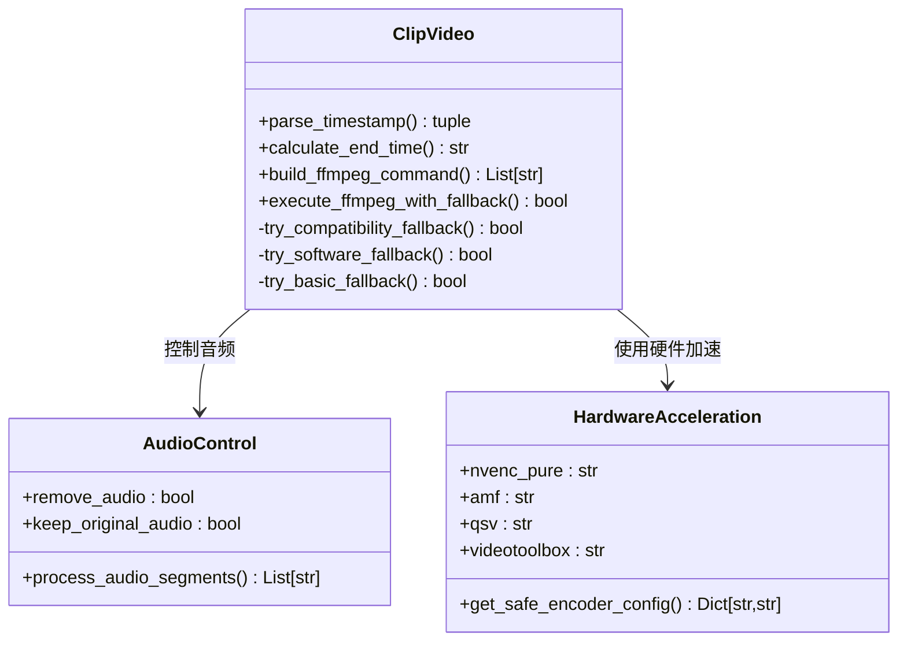

**图表来源**
- [app/services/clip_video.py:143-228](file://app/services/clip_video.py#L143-L228)

#### 错误处理机制

系统实现了多层次的错误处理机制，确保在各种情况下都能提供稳定的处理能力：

| 错误类型 | 检测方法 | 处理策略 | 适用场景 |
|---------|---------|---------|---------|
| 滤镜链错误 | 关键字匹配 | 兼容性模式 | CUDA硬件解码问题 |
| 硬件加速错误 | 设备检测 | 软件编码 | GPU驱动问题 |
| 编码器错误 | 参数验证 | 基本编码 | 编码器不支持 |
| 文件访问错误 | 权限检查 | 通用回退 | 文件权限问题 |

**章节来源**
- [app/services/clip_video.py:304-343](file://app/services/clip_video.py#L304-L343)
- [app/services/clip_video.py:345-546](file://app/services/clip_video.py#L345-L546)

### 视频合并组件

视频合并功能支持复杂的多轨道音频混合和视频同步：

#### 合并流程设计

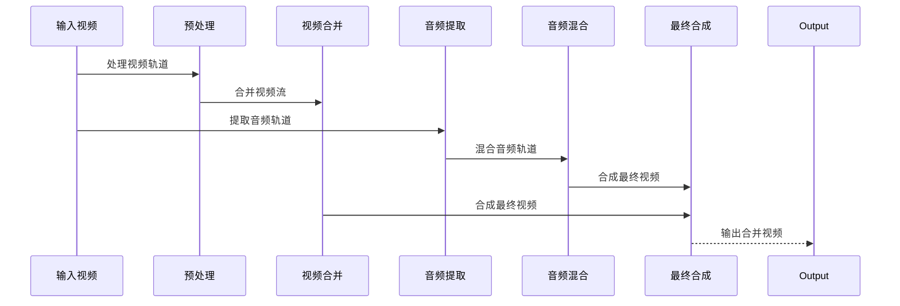

**图表来源**
- [app/services/merger_video.py:467-621](file://app/services/merger_video.py#L467-L621)

#### 音频混合策略

系统采用了先进的音频混合技术，支持多轨道音频的精确同步和音量控制：

| 音频轨道 | 处理方式 | 音量控制 | 同步机制 |
|---------|---------|---------|---------|
| 原声轨道 | 提取并延迟 | 自动调整 | 时间戳对齐 |
| TTS轨道 | 直接混合 | 智能补偿 | 延迟补偿 |
| 背景音乐 | 循环播放 | 淡入淡出 | 持续时间对齐 |
| 静音轨道 | 生成静音 | 固定音量 | 总时长对齐 |

**章节来源**
- [app/services/merger_video.py:494-621](file://app/services/merger_video.py#L494-L621)

### 视频生成组件

视频生成组件提供了完整的视频合成能力，包括字幕、音效、特效等：

#### 字幕处理流程

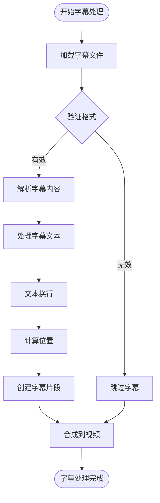

**图表来源**
- [app/services/generate_video.py:355-385](file://app/services/generate_video.py#L355-L385)

#### 音频处理策略

系统实现了智能的音频处理策略，确保最终输出的音频质量：

| 音频类型 | 处理方式 | 参数设置 | 质量控制 |
|---------|---------|---------|---------|
| 原声音频 | 提取并调整 | 音量倍数 | 保真处理 |
| TTS音频 | 直接应用 | 音量控制 | 适配处理 |
| 背景音乐 | 循环播放 | 淡入淡出 | 音量平衡 |
| 智能音量 | 分析对比 | 自动调整 | 动态平衡 |

**章节来源**
- [app/services/generate_video.py:196-271](file://app/services/generate_video.py#L196-L271)

## 依赖分析

系统采用模块化依赖管理，确保各组件之间的清晰边界和低耦合：

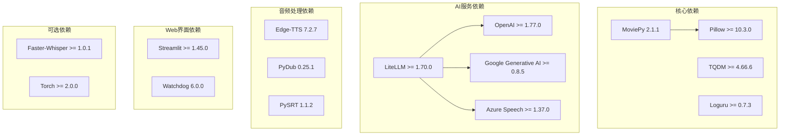

**图表来源**
- [requirements.txt:1-39](file://requirements.txt#L1-L39)

### 外部工具依赖

系统对外部工具的依赖主要体现在视频处理能力上：

| 工具 | 版本要求 | 用途 | 必需性 |
|------|---------|------|-------|
| FFmpeg | 最新版本 | 视频处理核心 | 必需 |
| FFprobe | 随FFmpeg | 视频信息探测 | 必需 |
| NVENC | NVIDIA显卡 | 硬件编码加速 | 可选 |
| VAAPI | Linux显卡 | 硬件编码加速 | 可选 |
| VideoToolbox | macOS | 硬件编码加速 | 可选 |

**章节来源**
- [requirements.txt:1-39](file://requirements.txt#L1-L39)

## 性能考虑

系统在设计时充分考虑了性能优化，提供了多种性能提升策略：

### 硬件加速优化

系统实现了智能的硬件加速检测和使用机制：

#### 硬件加速优先级

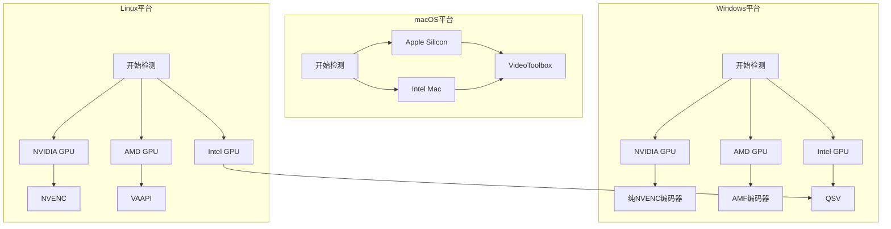

**图表来源**
- [app/utils/ffmpeg_utils.py:28-48](file://app/utils/ffmpeg_utils.py#L28-L48)

### 内存管理优化

系统采用了多种内存管理策略来优化内存使用：

#### 内存使用优化策略

| 优化策略 | 实现方式 | 效果 |
|---------|---------|------|
| 资源及时释放 | 使用上下文管理器 | 防止内存泄漏 |
| 分块处理 | 大文件分块读取 | 降低内存峰值 |
| 进度条监控 | 实时监控内存使用 | 预防内存溢出 |
| 缓存机制 | 临时文件缓存 | 减少重复计算 |

### 并行处理能力

系统支持多线程并行处理，提升整体处理效率：

#### 并行处理架构

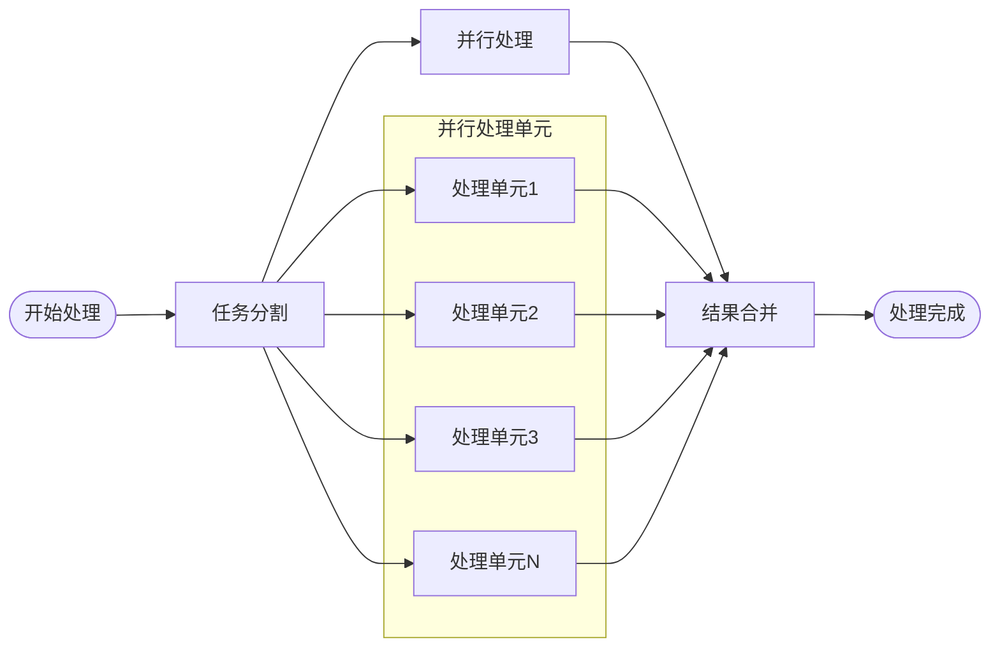

**章节来源**
- [app/services/merger_video.py:334-335](file://app/services/merger_video.py#L334-L335)
- [app/services/generate_video.py:392-394](file://app/services/generate_video.py#L392-L394)

## 故障排除指南

系统提供了完善的故障排除机制和诊断工具：

### 常见问题诊断

#### FFmpeg兼容性问题

| 问题类型 | 症状描述 | 解决方案 | 预防措施 |
|---------|---------|---------|---------|
| 滤镜链错误 | "Impossible to convert between the formats" | 使用兼容性配置 | 避免硬件解码滤镜链 |
| 硬件加速不可用 | GPU驱动过旧或FFmpeg不支持 | 更新驱动或使用软件编码 | 定期检查硬件兼容性 |
| 处理速度慢 | 硬件加速未启用或配置不当 | 启用硬件加速或优化配置 | 使用推荐配置文件 |
| 文件权限问题 | 无法写入输出目录 | 检查目录权限和磁盘空间 | 确保足够的磁盘空间 |

#### WebUI诊断功能

系统提供了专门的诊断组件来帮助用户排查问题：

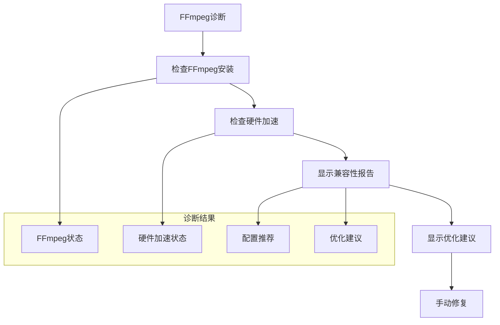

**图表来源**
- [webui/components/ffmpeg_diagnostics.py:20-108](file://webui/components/ffmpeg_diagnostics.py#L20-L108)

### 错误恢复机制

系统实现了多层次的错误恢复机制：

#### 错误恢复策略

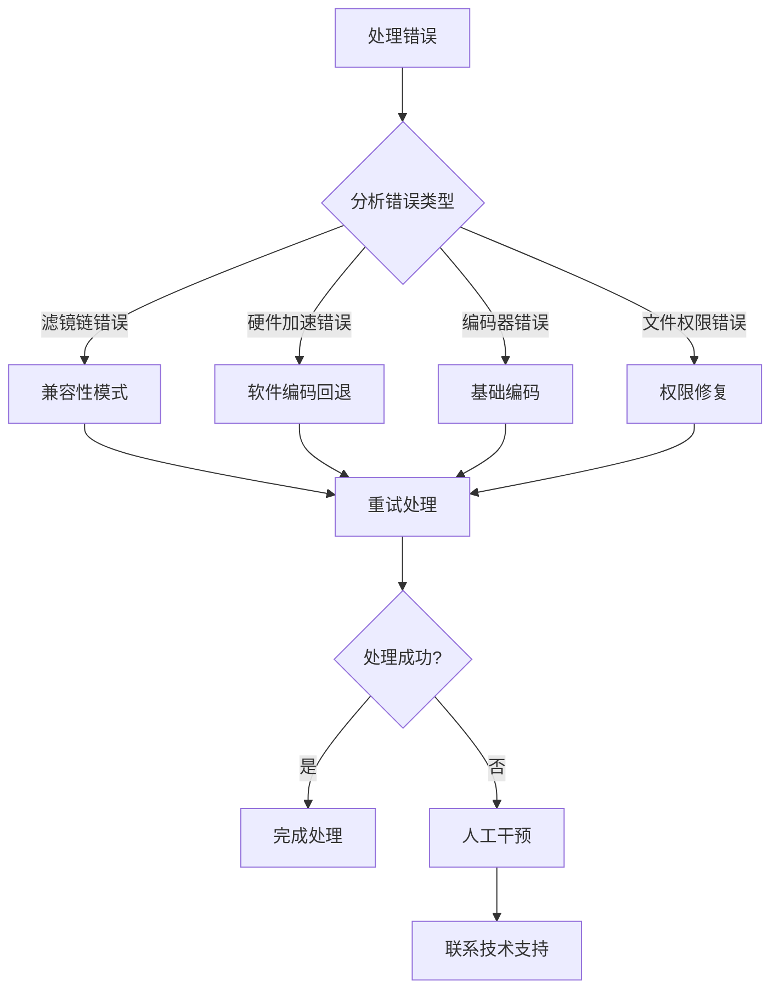

**图表来源**
- [app/services/clip_video.py:286-298](file://app/services/clip_video.py#L286-L298)

**章节来源**
- [webui/components/ffmpeg_diagnostics.py:201-260](file://webui/components/ffmpeg_diagnostics.py#L201-L260)
- [app/services/clip_video.py:230-302](file://app/services/clip_video.py#L230-L302)

## 结论

NarratoAI 的视频处理功能扩展展现了现代视频处理系统的设计理念和技术实现。通过模块化架构、智能硬件加速检测、多层次错误处理等技术手段，系统能够在保证处理质量的同时提供优秀的用户体验。

### 主要优势

1. **架构设计优秀**：清晰的分层架构确保了系统的可维护性和可扩展性
2. **硬件加速优化**：智能的硬件加速检测和使用机制提升了处理性能
3. **错误处理完善**：多层次的错误处理和恢复机制保证了系统的稳定性
4. **跨平台兼容**：针对不同平台和硬件提供了优化的处理方案
5. **用户友好**：提供了直观的诊断工具和故障排除指南

### 技术特色

- **智能配置管理**：自动检测硬件环境并推荐最优配置
- **多策略处理**：针对不同场景提供多种处理策略
- **实时监控**：提供详细的处理进度和状态监控
- **灵活扩展**：模块化设计便于功能扩展和定制

## 附录

### 开发流程指南

#### 新功能开发流程

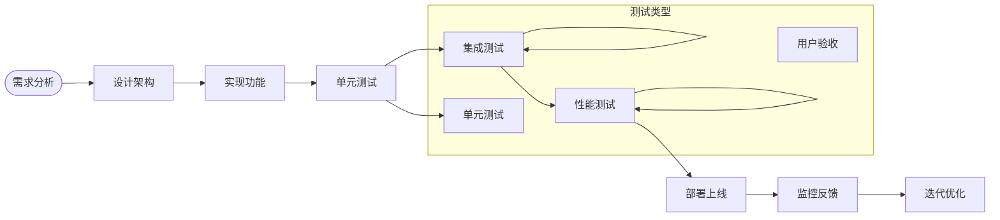

#### 代码示例路径

以下是一些关键功能的代码示例路径，可用于学习和参考：

- **视频帧提取**：[app/utils/video_processor.py:89-187](file://app/utils/video_processor.py#L89-L187)
- **FFmpeg配置管理**：[app/config/ffmpeg_config.py:160-232](file://app/config/ffmpeg_config.py#L160-L232)
- **视频剪辑**：[app/services/clip_video.py:143-228](file://app/services/clip_video.py#L143-L228)
- **视频合并**：[app/services/merger_video.py:467-621](file://app/services/merger_video.py#L467-L621)
- **视频生成**：[app/services/generate_video.py:355-385](file://app/services/generate_video.py#L355-L385)

### 性能基准测试

系统提供了多种性能测试方法：

#### 基准测试指标

| 测试项目 | 测试方法 | 评估指标 | 期望结果 |
|---------|---------|---------|---------|
| 处理速度 | 大批量视频处理 | 处理时间、吞吐量 | 符合硬件规格 |
| 内存使用 | 长时间运行监控 | 内存峰值、增长率 | 稳定增长 |
| 硬件加速效果 | 启用/禁用对比 | 性能提升比例 | 显著提升 |
| 错误恢复 | 故障注入测试 | 恢复时间、成功率 | 高成功率 |

#### 测试工具和方法

- **单元测试**：使用Python unittest框架进行功能测试
- **集成测试**：模拟真实使用场景进行端到端测试
- **性能测试**：使用性能分析工具监控系统表现
- **兼容性测试**：在不同平台和硬件环境下验证功能

**章节来源**
- [app/services/llm/test_llm_service.py:205-255](file://app/services/llm/test_llm_service.py#L205-L255)
- [app/services/llm/test_litellm_integration.py:188-229](file://app/services/llm/test_litellm_integration.py#L188-L229)