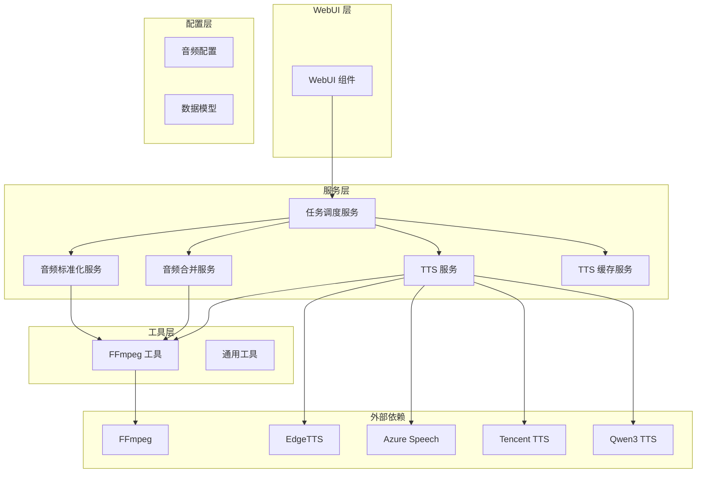
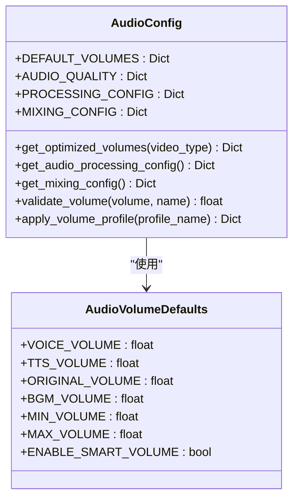
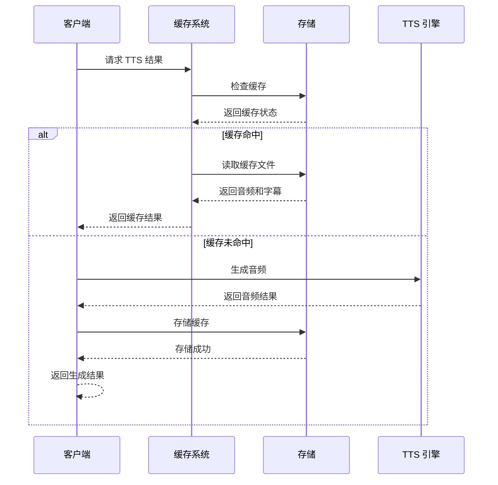
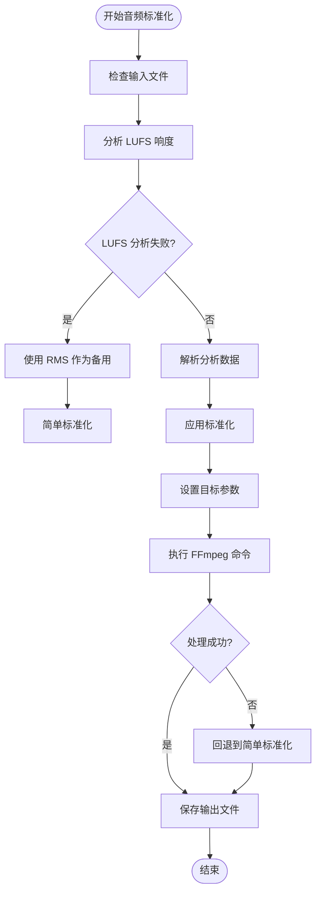
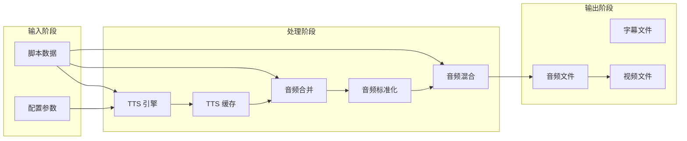
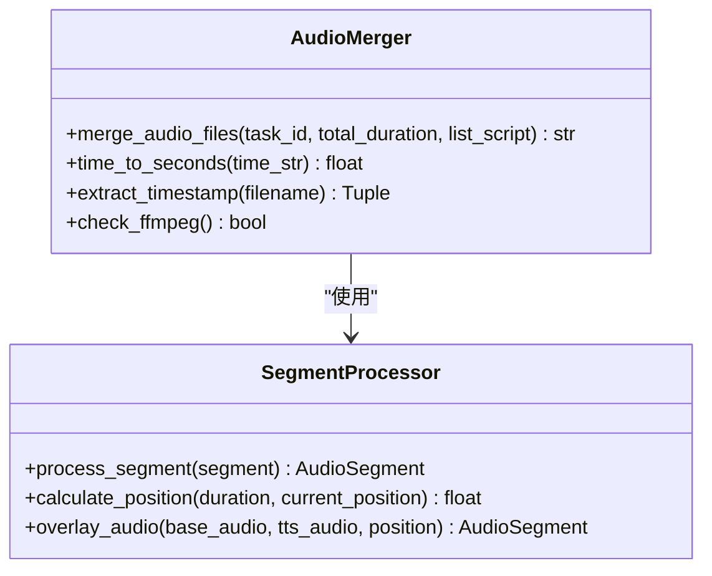
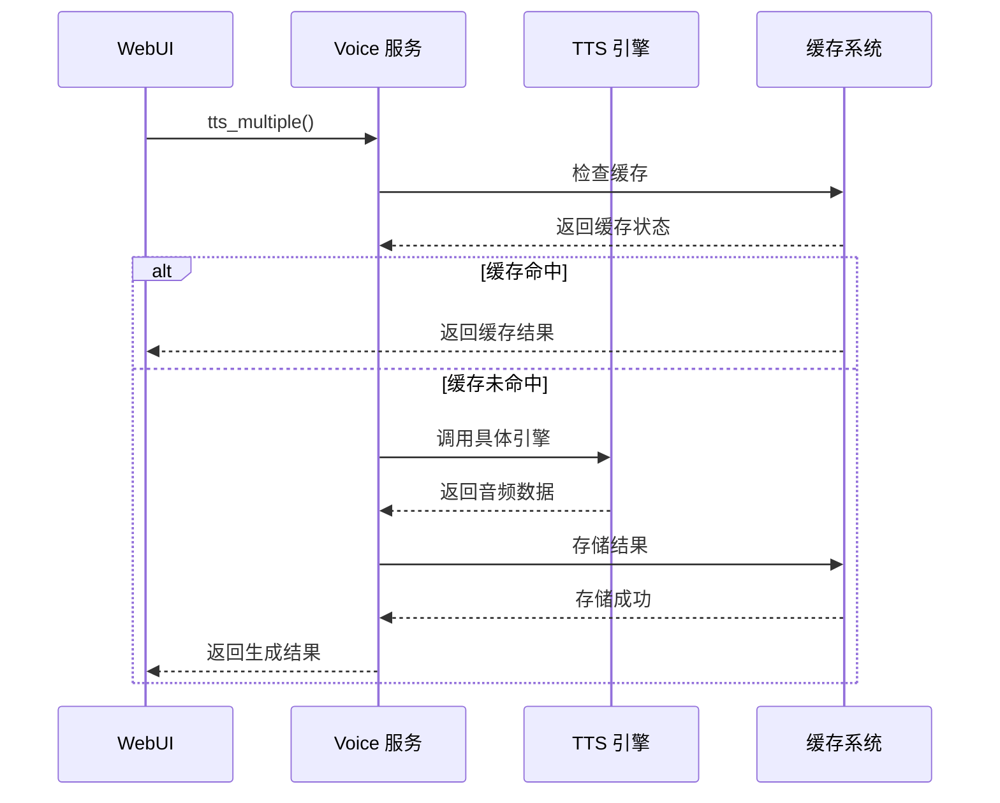
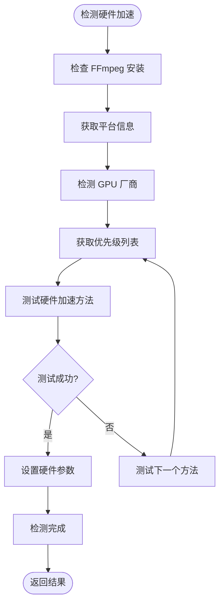
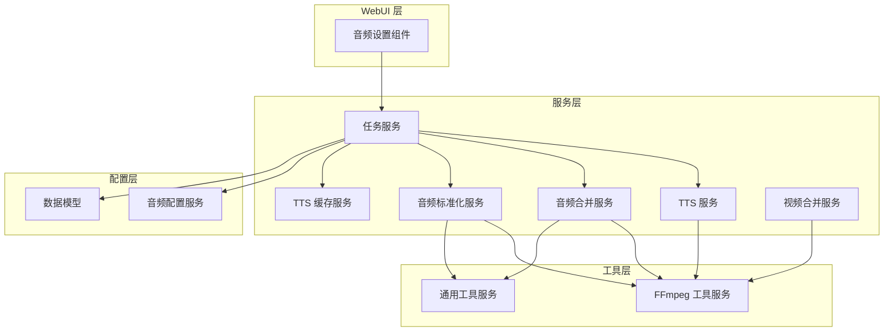

# 音频处理功能扩展

<cite>
**本文档引用的文件**
- [audio_config.py](file://app/config/audio_config.py)
- [audio_merger.py](file://app/services/audio_merger.py)
- [audio_normalizer.py](file://app/services/audio_normalizer.py)
- [tts_cache.py](file://app/services/tts_cache.py)
- [ffmpeg_utils.py](file://app/utils/ffmpeg_utils.py)
- [voice.py](file://app/services/voice.py)
- [task.py](file://app/services/task.py)
- [utils.py](file://app/utils/utils.py)
- [merger_video.py](file://app/services/merger_video.py)
- [audio_settings.py](file://webui/components/audio_settings.py)
- [schema.py](file://app/models/schema.py)
</cite>

## 目录
1. [简介](#简介)
2. [项目结构](#项目结构)
3. [核心组件](#核心组件)
4. [架构概览](#架构概览)
5. [详细组件分析](#详细组件分析)
6. [依赖关系分析](#依赖关系分析)
7. [性能考虑](#性能考虑)
8. [故障排除指南](#故障排除指南)
9. [结论](#结论)
10. [附录](#附录)

## 简介

NarratoAI 是一个基于 Python 的视频生成和编辑平台，专注于自动化视频制作流程。本文档详细介绍了音频处理功能的扩展开发指南，涵盖了音频效果扩展、混音技术、格式转换、TTS 引擎集成、音频处理服务架构以及性能优化等方面。

该项目采用模块化设计，通过清晰的组件分离实现了音频处理的可扩展性和可维护性。系统支持多种音频处理算法，包括响度分析、音频标准化、智能音量调节、音频混合等核心功能。

## 项目结构

项目采用分层架构设计，主要分为以下层次：

**图表来源**
- [audio_config.py:16-47](file://app/config/audio_config.py#L16-L47)
- [task.py:10-24](file://app/services/task.py#L10-L24)
- [ffmpeg_utils.py:12-25](file://app/utils/ffmpeg_utils.py#L12-L25)

**章节来源**
- [audio_config.py:1-221](file://app/config/audio_config.py#L1-L221)
- [task.py:1-272](file://app/services/task.py#L1-L272)

## 核心组件

### 音频配置管理系统

音频配置管理系统提供了统一的音频参数管理和验证机制：

**图表来源**
- [audio_config.py:16-165](file://app/config/audio_config.py#L16-L165)
- [schema.py:16-35](file://app/models/schema.py#L16-L35)

音频配置系统支持多种预设配置文件，包括平衡模式、语音聚焦模式、原声聚焦模式等，每种模式都有特定的音量比例设置。

**章节来源**
- [audio_config.py:16-165](file://app/config/audio_config.py#L16-L165)
- [schema.py:16-35](file://app/models/schema.py#L16-L35)

### TTS 缓存系统

TTS 缓存系统实现了智能的音频结果缓存机制，显著提高了重复任务的处理效率：

**图表来源**
- [tts_cache.py:45-94](file://app/services/tts_cache.py#L45-L94)
- [tts_cache.py:97-125](file://app/services/tts_cache.py#L97-L125)

**章节来源**
- [tts_cache.py:1-125](file://app/services/tts_cache.py#L1-L125)

### 音频标准化系统

音频标准化系统提供了专业的响度分析和标准化功能，确保音频输出的一致性和专业性：

**图表来源**
- [audio_normalizer.py:122-205](file://app/services/audio_normalizer.py#L122-L205)
- [audio_normalizer.py:207-234](file://app/services/audio_normalizer.py#L207-L234)

**章节来源**
- [audio_normalizer.py:22-315](file://app/services/audio_normalizer.py#L22-L315)

## 架构概览

系统采用流水线式的音频处理架构，通过模块化的组件协作实现高效的音频处理流程：

**图表来源**
- [task.py:53-91](file://app/services/task.py#L53-L91)
- [task.py:120-133](file://app/services/task.py#L120-L133)
- [task.py:159-192](file://app/services/task.py#L159-L192)

**章节来源**
- [task.py:195-247](file://app/services/task.py#L195-L247)

## 详细组件分析

### 音频合并服务

音频合并服务负责将多个音频片段按照时间轴进行精确对齐和混合：

**图表来源**
- [audio_merger.py:21-76](file://app/services/audio_merger.py#L21-L76)
- [audio_merger.py:79-134](file://app/services/audio_merger.py#L79-L134)

音频合并服务支持多种时间戳格式解析，包括 HH:MM:SS,mmm、MM:SS,mmm、SS,mmm 等格式，并能够处理空音频片段的间隔保留。

**章节来源**
- [audio_merger.py:1-172](file://app/services/audio_merger.py#L1-L172)

### TTS 引擎集成

系统支持多种 TTS 引擎的集成，包括 Edge TTS、Azure Speech、腾讯云 TTS、通义千问 Qwen3 TTS 等：

**图表来源**
- [voice.py:1127-1153](file://app/services/voice.py#L1127-L1153)
- [task.py:69-86](file://app/services/task.py#L69-L86)

**章节来源**
- [voice.py:1127-1153](file://app/services/voice.py#L1127-L1153)
- [audio_settings.py:22-66](file://webui/components/audio_settings.py#L22-L66)

### FFmpeg 集成

FFmpeg 工具模块提供了跨平台的硬件加速检测和智能降级机制：

**图表来源**
- [ffmpeg_utils.py:252-355](file://app/utils/ffmpeg_utils.py#L252-L355)

**章节来源**
- [ffmpeg_utils.py:1-800](file://app/utils/ffmpeg_utils.py#L1-L800)

## 依赖关系分析

系统各组件之间的依赖关系呈现清晰的层次结构：

**图表来源**
- [task.py:10-24](file://app/services/task.py#L10-L24)
- [audio_settings.py:1-944](file://webui/components/audio_settings.py#L1-L944)

**章节来源**
- [task.py:1-272](file://app/services/task.py#L1-L272)
- [audio_settings.py:1-944](file://webui/components/audio_settings.py#L1-L944)

## 性能考虑

### 硬件加速优化

系统实现了智能的硬件加速检测和降级机制，确保在不同硬件环境下都能获得最佳性能：

- **NVIDIA GPU**: 优先使用 NVENC 编码器，支持纯编码器方案避免滤镜链问题
- **AMD GPU**: 支持 AMF 编码器和 VAAPI 解码
- **Intel GPU**: 支持 QSV 编码器和 VAAPI 解码
- **Apple Silicon**: 使用 VideoToolbox 硬件加速

### 内存优化策略

- **流式处理**: TTS 服务采用异步流式处理，避免大文件内存占用
- **分块处理**: 音频处理采用分块策略，支持大文件的渐进式处理
- **缓存管理**: 智能缓存系统减少重复计算和 I/O 操作

### 并行处理机制

系统支持多线程并行处理，通过合理的线程池管理和任务调度实现高效的批量处理能力。

## 故障排除指南

### 常见问题诊断

1. **FFmpeg 未安装**: 系统会自动检测 FFmpeg 安装状态，未安装时提供明确的错误提示
2. **硬件加速失败**: 系统会自动进行降级处理，优先使用软件编码
3. **TTS 引擎连接超时**: 提供重试机制和代理配置选项
4. **音频格式不兼容**: 自动进行格式转换和重新编码

### 日志记录和监控

系统采用结构化的日志记录机制，每个关键操作都有详细的日志信息，便于问题诊断和性能监控。

**章节来源**
- [ffmpeg_utils.py:118-136](file://app/utils/ffmpeg_utils.py#L118-L136)
- [voice.py:1198-1229](file://app/services/voice.py#L1198-L1229)

## 结论

NarratoAI 的音频处理功能扩展展现了现代音频处理系统的设计理念，通过模块化架构、智能缓存、硬件加速和标准化处理实现了高性能、高可靠性的音频处理能力。系统不仅支持多种音频处理算法，还提供了完善的 TTS 引擎集成和配置管理机制。

未来扩展方向包括：
- 支持更多音频效果插件
- 实现更精细的音频分析算法
- 增强实时音频处理能力
- 优化移动端音频处理性能

## 附录

### 开发最佳实践

1. **模块化设计**: 保持组件职责单一，便于测试和维护
2. **错误处理**: 实现完善的异常处理和回退机制
3. **性能监控**: 建立性能指标监控和告警机制
4. **文档规范**: 保持代码注释和文档的同步更新

### 扩展开发流程

1. **需求分析**: 明确功能需求和性能要求
2. **架构设计**: 设计模块接口和数据流
3. **实现开发**: 按照设计实现核心功能
4. **测试验证**: 进行单元测试和集成测试
5. **性能优化**: 根据测试结果进行性能调优
6. **部署上线**: 完成部署和监控配置