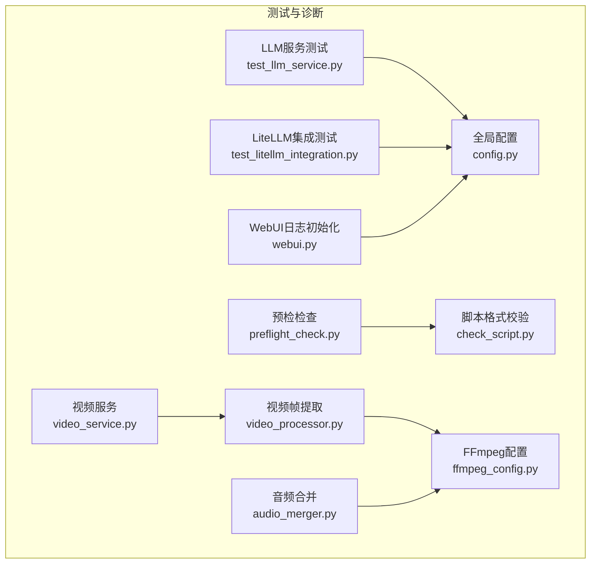
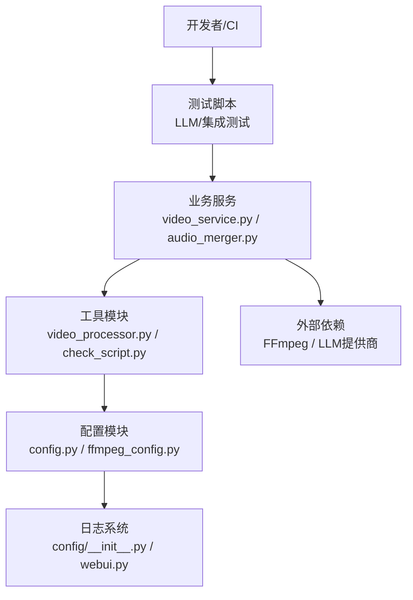
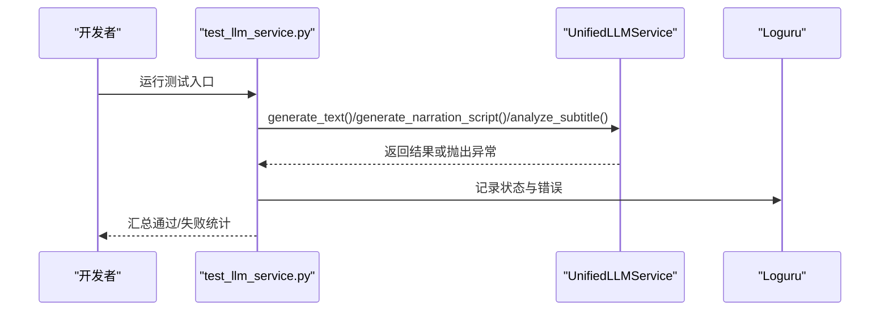
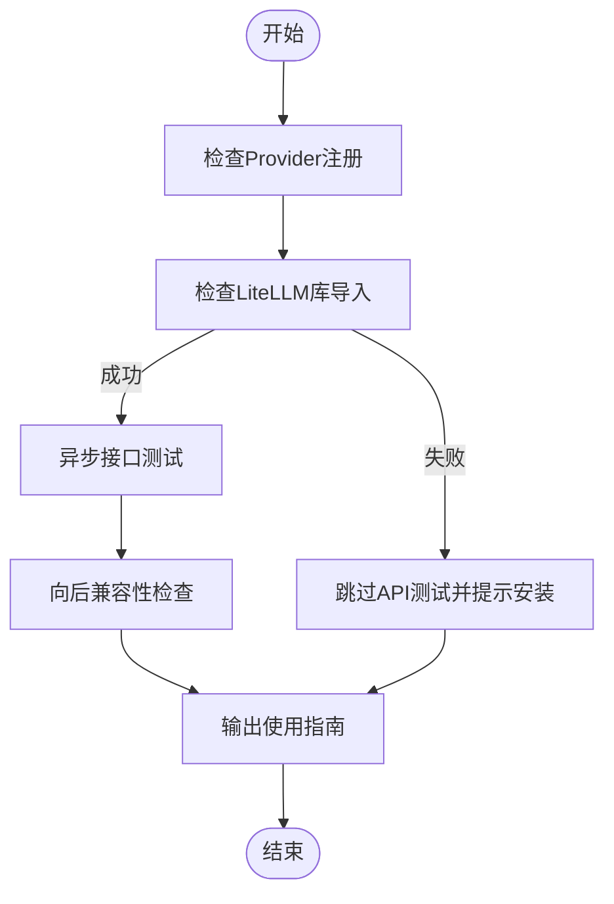
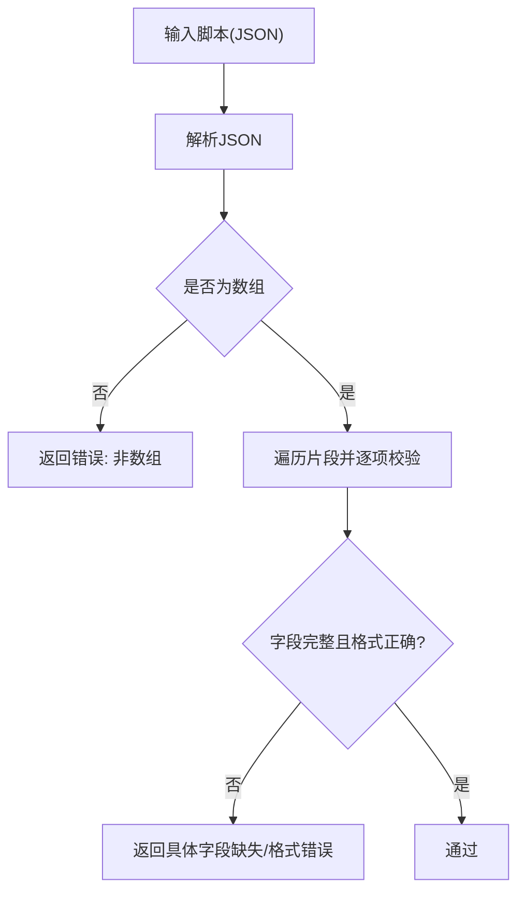
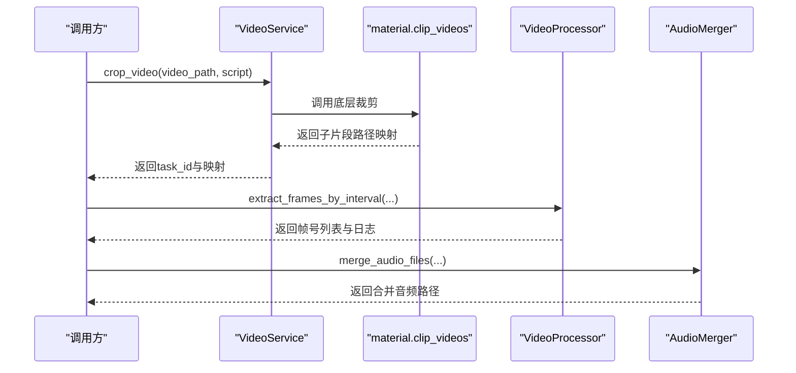
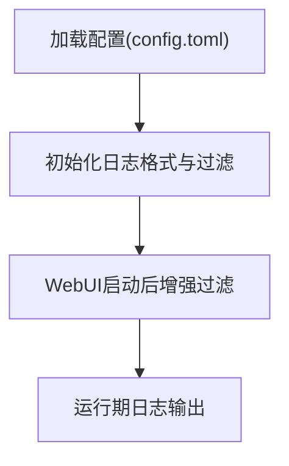

# 测试与调试

<cite>
**本文引用的文件**
- [app/services/llm/test_llm_service.py](file://app/services/llm/test_llm_service.py)
- [app/services/llm/test_litellm_integration.py](file://app/services/llm/test_litellm_integration.py)
- [app/services/preflight_check.py](file://app/services/preflight_check.py)
- [app/utils/check_script.py](file://app/utils/check_script.py)
- [app/services/video_service.py](file://app/services/video_service.py)
- [app/services/audio_merger.py](file://app/services/audio_merger.py)
- [app/utils/video_processor.py](file://app/utils/video_processor.py)
- [app/config/config.py](file://app/config/config.py)
- [app/config/audio_config.py](file://app/config/audio_config.py)
- [app/config/ffmpeg_config.py](file://app/config/ffmpeg_config.py)
- [requirements.txt](file://requirements.txt)
- [webui.py](file://webui.py)
- [README.md](file://README.md)
</cite>

## 目录
1. [简介](#简介)
2. [项目结构](#项目结构)
3. [核心组件](#核心组件)
4. [架构总览](#架构总览)
5. [详细组件分析](#详细组件分析)
6. [依赖分析](#依赖分析)
7. [性能考虑](#性能考虑)
8. [故障排查指南](#故障排查指南)
9. [结论](#结论)
10. [附录](#附录)

## 简介
本指南面向开发者，系统讲解本项目的测试与调试实践，覆盖单元测试与集成测试方法、Mock技巧、调试工具与日志策略、预检检查机制、常见问题排查以及质量保障与覆盖率建议。内容结合仓库现有测试脚本与工具模块，帮助你在开发过程中快速定位问题、稳定交付。

## 项目结构
围绕“测试与调试”主题，本项目的关键测试与诊断相关文件分布如下：
- LLM服务测试：app/services/llm/test_llm_service.py、app/services/llm/test_litellm_integration.py
- 预检检查：app/services/preflight_check.py、app/utils/check_script.py
- 视频处理与诊断：app/services/video_service.py、app/utils/video_processor.py、app/services/audio_merger.py、app/config/ffmpeg_config.py
- 日志与配置：app/config/config.py、webui.py
- 依赖与运行：requirements.txt、README.md

**图示来源**
- [app/services/llm/test_llm_service.py:1-264](file://app/services/llm/test_llm_service.py#L1-L264)
- [app/services/llm/test_litellm_integration.py:1-229](file://app/services/llm/test_litellm_integration.py#L1-L229)
- [app/services/preflight_check.py:1-31](file://app/services/preflight_check.py#L1-L31)
- [app/utils/check_script.py:1-111](file://app/utils/check_script.py#L1-L111)
- [app/services/video_service.py:1-56](file://app/services/video_service.py#L1-L56)
- [app/utils/video_processor.py:1-670](file://app/utils/video_processor.py#L1-L670)
- [app/services/audio_merger.py:1-172](file://app/services/audio_merger.py#L1-L172)
- [app/config/config.py:1-95](file://app/config/config.py#L1-L95)
- [app/config/ffmpeg_config.py:1-285](file://app/config/ffmpeg_config.py#L1-L285)
- [webui.py:41-109](file://webui.py#L41-L109)

**章节来源**
- [app/services/llm/test_llm_service.py:1-264](file://app/services/llm/test_llm_service.py#L1-L264)
- [app/services/llm/test_litellm_integration.py:1-229](file://app/services/llm/test_litellm_integration.py#L1-L229)
- [app/services/preflight_check.py:1-31](file://app/services/preflight_check.py#L1-L31)
- [app/utils/check_script.py:1-111](file://app/utils/check_script.py#L1-L111)
- [app/services/video_service.py:1-56](file://app/services/video_service.py#L1-L56)
- [app/utils/video_processor.py:1-670](file://app/utils/video_processor.py#L1-L670)
- [app/services/audio_merger.py:1-172](file://app/services/audio_merger.py#L1-L172)
- [app/config/config.py:1-95](file://app/config/config.py#L1-L95)
- [app/config/ffmpeg_config.py:1-285](file://app/config/ffmpeg_config.py#L1-L285)
- [webui.py:41-109](file://webui.py#L41-L109)

## 核心组件
- LLM服务测试套件：覆盖文本生成、JSON生成、字幕分析、脚本生成、提供商信息与配置验证等端到端能力。
- LiteLLM集成测试：验证Provider注册、库可用性、接口可调用性与向后兼容性。
- 预检检查：对脚本数据结构与TTS结果进行前置校验，提前暴露缺失字段与依赖问题。
- 视频处理与诊断：视频裁剪、帧提取、音频合并、FFmpeg配置与兼容性策略。
- 日志与配置：统一日志格式化与过滤、WebUI日志初始化、全局配置加载。

**章节来源**
- [app/services/llm/test_llm_service.py:25-264](file://app/services/llm/test_llm_service.py#L25-L264)
- [app/services/llm/test_litellm_integration.py:20-229](file://app/services/llm/test_litellm_integration.py#L20-L229)
- [app/services/preflight_check.py:11-31](file://app/services/preflight_check.py#L11-L31)
- [app/utils/check_script.py:5-111](file://app/utils/check_script.py#L5-L111)
- [app/services/video_service.py:9-56](file://app/services/video_service.py#L9-L56)
- [app/utils/video_processor.py:26-670](file://app/utils/video_processor.py#L26-L670)
- [app/services/audio_merger.py:21-172](file://app/services/audio_merger.py#L21-L172)
- [app/config/config.py:24-95](file://app/config/config.py#L24-L95)
- [webui.py:41-109](file://webui.py#L41-L109)

## 架构总览
下图展示测试与调试在系统中的位置与交互关系，重点体现“测试脚本—服务—配置—外部依赖”的闭环。

**图示来源**
- [app/services/llm/test_llm_service.py:1-264](file://app/services/llm/test_llm_service.py#L1-L264)
- [app/services/llm/test_litellm_integration.py:1-229](file://app/services/llm/test_litellm_integration.py#L1-L229)
- [app/services/video_service.py:1-56](file://app/services/video_service.py#L1-L56)
- [app/services/audio_merger.py:1-172](file://app/services/audio_merger.py#L1-L172)
- [app/utils/video_processor.py:1-670](file://app/utils/video_processor.py#L1-L670)
- [app/utils/check_script.py:1-111](file://app/utils/check_script.py#L1-L111)
- [app/config/config.py:1-95](file://app/config/config.py#L1-L95)
- [app/config/ffmpeg_config.py:1-285](file://app/config/ffmpeg_config.py#L1-L285)
- [webui.py:41-109](file://webui.py#L41-L109)

## 详细组件分析

### LLM服务测试（test_llm_service.py）
- 测试目标：验证UnifiedLLMService在文本生成、JSON生成、字幕分析、脚本生成、提供商信息与配置验证等方面的功能。
- 关键点：
  - 使用异步接口测试文本/JSON/脚本/字幕分析。
  - 通过配置验证器对提供商有效性进行批量校验。
  - 使用日志记录器输出测试过程与结果。
- 建议：
  - 将LLM调用封装为可注入的接口，便于在单元测试中注入Mock实现。
  - 对异常路径增加断言，确保错误传播与日志一致性。

**图示来源**
- [app/services/llm/test_llm_service.py:25-264](file://app/services/llm/test_llm_service.py#L25-L264)

**章节来源**
- [app/services/llm/test_llm_service.py:25-264](file://app/services/llm/test_llm_service.py#L25-L264)

### LiteLLM集成测试（test_litellm_integration.py）
- 测试目标：验证LiteLLM Provider注册、库可用性、接口可调用性与向后兼容性。
- 关键点：
  - 断言LiteLLM在文本/视觉提供商列表中注册。
  - 检查LiteLLM库是否安装并记录版本。
  - 通过异步接口测试确保调用路径可用。
  - 输出迁移与使用指南，辅助团队决策。
- 建议：
  - 在CI中固定LiteLLM版本，避免上游变更导致的不稳定。
  - 对Provider注册流程增加幂等性与回滚策略的测试。

**图示来源**
- [app/services/llm/test_litellm_integration.py:20-229](file://app/services/llm/test_litellm_integration.py#L20-L229)

**章节来源**
- [app/services/llm/test_litellm_integration.py:20-229](file://app/services/llm/test_litellm_integration.py#L20-L229)

### 预检检查与脚本校验
- 预检检查（preflight_check.py）：
  - 校验脚本片段必需字段与非空约束。
  - 校验TTS结果完整性，确保后续统一裁剪流程可用。
- 脚本格式校验（check_script.py）：
  - JSON结构、字段存在性、类型与格式校验（如_id为正整数、timestamp格式、narration非空、OST取值）。
  - 对异常进行结构化返回，便于前端或CLI展示。

**图示来源**
- [app/utils/check_script.py:5-111](file://app/utils/check_script.py#L5-L111)
- [app/services/preflight_check.py:11-31](file://app/services/preflight_check.py#L11-L31)

**章节来源**
- [app/services/preflight_check.py:11-31](file://app/services/preflight_check.py#L11-L31)
- [app/utils/check_script.py:5-111](file://app/utils/check_script.py#L5-L111)

### 视频处理与诊断（视频服务、帧提取、音频合并）
- 视频服务（video_service.py）：
  - 裁剪视频并返回子片段路径映射，异常时记录详细日志并抛出。
- 视频帧提取（video_processor.py）：
  - 多策略提取：软件解码、硬件加速、超级兼容性方案（PNG→JPG、MJPEG/BMP回退）。
  - 带进度条与成功率统计，失败时给出兼容性建议。
- 音频合并（audio_merger.py）：
  - 检查FFmpeg可用性，按脚本片段时长叠加overlay，保留静默间隔。
  - 对异常片段跳过并继续，保证整体流程稳健。

**图示来源**
- [app/services/video_service.py:9-56](file://app/services/video_service.py#L9-L56)
- [app/utils/video_processor.py:26-670](file://app/utils/video_processor.py#L26-L670)
- [app/services/audio_merger.py:21-172](file://app/services/audio_merger.py#L21-L172)

**章节来源**
- [app/services/video_service.py:9-56](file://app/services/video_service.py#L9-L56)
- [app/utils/video_processor.py:89-494](file://app/utils/video_processor.py#L89-L494)
- [app/services/audio_merger.py:21-172](file://app/services/audio_merger.py#L21-L172)

### 日志与配置（统一格式化与过滤）
- 全局配置（config.py）：
  - 加载config.toml，支持UTF-8-SIG回退；设置日志级别、主机/端口、版本号等。
- WebUI日志初始化（webui.py）：
  - 格式化日志输出，过滤无关噪音（如CUDA初始化等），并在启动后延迟设置更严格的过滤器。
- 日志模块（config/__init__.py）：
  - 统一日志格式，相对路径显示，过滤DEBUG噪音。

**图示来源**
- [app/config/config.py:24-95](file://app/config/config.py#L24-L95)
- [webui.py:41-109](file://webui.py#L41-L109)
- [app/config/__init__.py:10-77](file://app/config/__init__.py#L10-L77)

**章节来源**
- [app/config/config.py:24-95](file://app/config/config.py#L24-L95)
- [webui.py:41-109](file://webui.py#L41-L109)
- [app/config/__init__.py:10-77](file://app/config/__init__.py#L10-L77)

## 依赖分析
- 核心依赖：requests、moviepy、edge-tts、streamlit、loguru、tomli、pydub、pysrt、openai、litellm、google-generativeai、azure-cognitiveservices-speech、dashscope、Pillow、tqdm、tenacity。
- 可选依赖：faster-whisper、opencv-python、torch系列（CUDA支持）。
- 与测试/调试相关：
  - pytest未在仓库中直接出现，但可通过Python内置unittest或直接运行测试脚本进行执行。
  - LiteLLM作为统一LLM接口，减少Provider差异带来的测试复杂度。

**章节来源**
- [requirements.txt:1-39](file://requirements.txt#L1-L39)
- [README.md:105-141](file://README.md#L105-L141)

## 性能考虑
- 视频帧提取：
  - 采用多策略回退（软件解码、硬件加速、PNG→JPG、MJPEG/BMP），在Windows NVIDIA环境下优先纯编码器方案，避免滤镜链问题。
  - 使用进度条与成功率统计，便于监控与优化。
- 音频合并：
  - overlay叠加时长与静默间隔，异常片段跳过并继续，保证整体吞吐。
- FFmpeg配置：
  - 按平台与GPU厂商自动推荐配置文件，兼顾性能与兼容性，并提供兼容性报告与建议。

**章节来源**
- [app/utils/video_processor.py:188-407](file://app/utils/video_processor.py#L188-L407)
- [app/utils/video_processor.py:495-651](file://app/utils/video_processor.py#L495-L651)
- [app/services/audio_merger.py:21-77](file://app/services/audio_merger.py#L21-L77)
- [app/config/ffmpeg_config.py:98-141](file://app/config/ffmpeg_config.py#L98-L141)
- [app/config/ffmpeg_config.py:244-285](file://app/config/ffmpeg_config.py#L244-L285)

## 故障排查指南

### 配置错误
- 症状：配置文件缺失或格式异常。
- 排查步骤：
  - 确认config.toml是否存在，若不存在则复制示例文件。
  - 若加载失败，尝试UTF-8-SIG编码读取。
  - 检查日志级别与环境变量（如FFmpeg路径）是否正确设置。
- 相关文件：
  - [app/config/config.py:24-44](file://app/config/config.py#L24-L44)
  - [app/config/config.py:86-94](file://app/config/config.py#L86-L94)

**章节来源**
- [app/config/config.py:24-44](file://app/config/config.py#L24-L44)
- [app/config/config.py:86-94](file://app/config/config.py#L86-L94)

### 依赖冲突与缺失
- 症状：FFmpeg不可用、LiteLLM未安装、第三方库版本不兼容。
- 排查步骤：
  - 在集成测试中先检查FFmpeg可用性与LiteLLM导入。
  - 使用requirements.txt核对依赖版本，必要时锁定版本。
- 相关文件：
  - [app/services/llm/test_litellm_integration.py:45-58](file://app/services/llm/test_litellm_integration.py#L45-L58)
  - [app/services/audio_merger.py:12-18](file://app/services/audio_merger.py#L12-L18)
  - [requirements.txt:1-39](file://requirements.txt#L1-L39)

**章节来源**
- [app/services/llm/test_litellm_integration.py:45-58](file://app/services/llm/test_litellm_integration.py#L45-L58)
- [app/services/audio_merger.py:12-18](file://app/services/audio_merger.py#L12-L18)
- [requirements.txt:1-39](file://requirements.txt#L1-L39)

### 性能瓶颈
- 症状：视频帧提取失败率高、CPU/GPU占用异常。
- 排查步骤：
  - 查看兼容性报告，确认推荐配置与硬件加速状态。
  - 在Windows NVIDIA环境下优先纯编码器方案，避免滤镜链问题。
  - 降低帧提取间隔或关闭硬件加速以验证瓶颈来源。
- 相关文件：
  - [app/config/ffmpeg_config.py:244-285](file://app/config/ffmpeg_config.py#L244-L285)
  - [app/utils/video_processor.py:188-220](file://app/utils/video_processor.py#L188-L220)

**章节来源**
- [app/config/ffmpeg_config.py:244-285](file://app/config/ffmpeg_config.py#L244-L285)
- [app/utils/video_processor.py:188-220](file://app/utils/video_processor.py#L188-L220)

### 调试技巧与工具
- Python调试器：在测试脚本中设置断点，逐步检查LLM调用参数与返回值。
- 日志分析：统一格式化输出，过滤噪音日志，聚焦关键路径。
- 性能分析：结合进度条与成功率统计，定位慢点与失败点。
- Mock对象：将LLM与外部API封装为可替换接口，单元测试中注入Mock，隔离网络波动。

**章节来源**
- [webui.py:41-109](file://webui.py#L41-L109)
- [app/config/__init__.py:10-77](file://app/config/__init__.py#L10-L77)
- [app/utils/video_processor.py:132-168](file://app/utils/video_processor.py#L132-L168)

## 结论
本项目在测试与调试方面具备完善的端到端测试脚本、预检检查与日志体系，配合FFmpeg配置与多策略视频处理，能够有效支撑复杂场景（LLM服务、视频处理、音频合成）的稳定性与可维护性。建议在现有基础上引入单元测试框架与覆盖率统计，持续完善Mock策略与回归测试矩阵，进一步提升质量与交付效率。

## 附录

### 单元测试与Mock建议
- 使用可注入接口替代硬编码LLM调用，便于在单元测试中替换为Mock实现。
- 对异常路径进行断言，确保错误传播与日志一致性。
- 将测试脚本改造为pytest风格，利用夹具与参数化提升复用性。

### 集成测试策略
- LLM服务集成测试：覆盖文本/JSON/脚本/字幕分析与提供商信息。
- LiteLLM集成测试：验证注册、库可用性、接口可调用性与向后兼容性。
- 视频处理集成测试：覆盖帧提取多策略、音频合并与错误恢复。

### 预检检查清单
- 脚本格式：JSON数组、必需字段、类型与格式。
- TTS结果：按片段ID校验音频文件存在性与完整性。
- 外部依赖：FFmpeg/LiteLLM可用性与版本。

### 质量保证与覆盖率
- 建议引入pytest与覆盖率工具，设定阈值（如函数/分支/行覆盖率），在CI中强制执行。
- 对关键路径（LLM调用、视频帧提取、音频合并）进行重点覆盖。