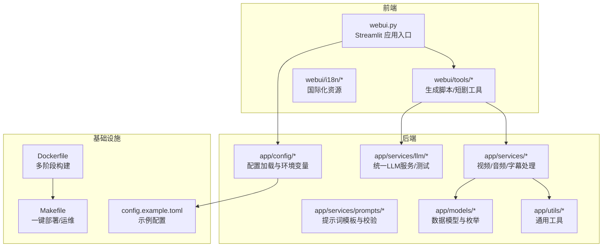
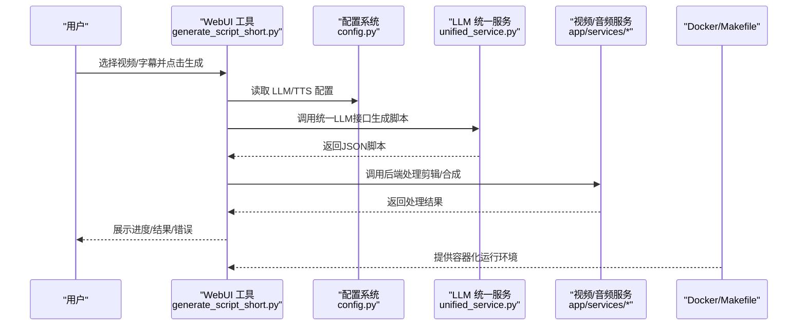
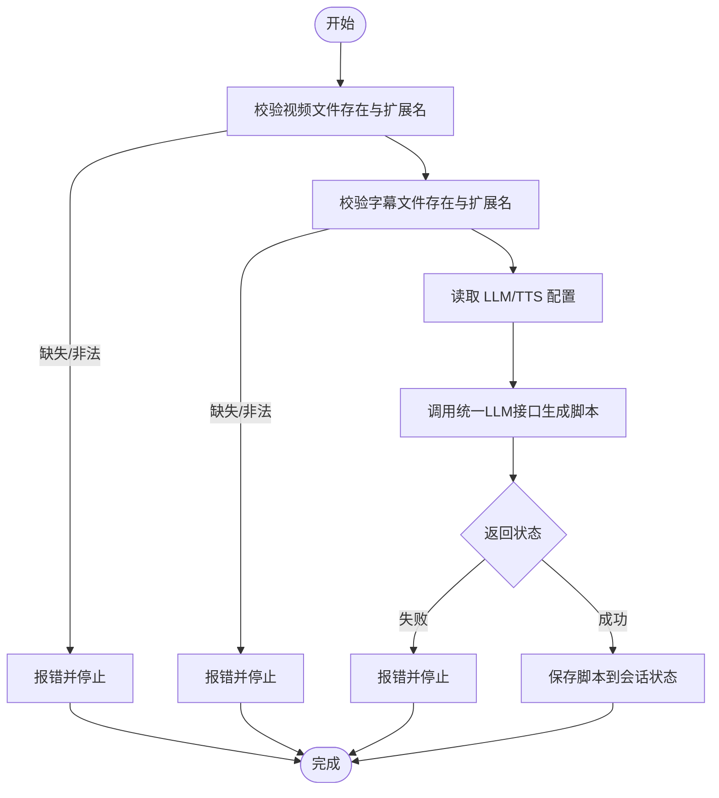
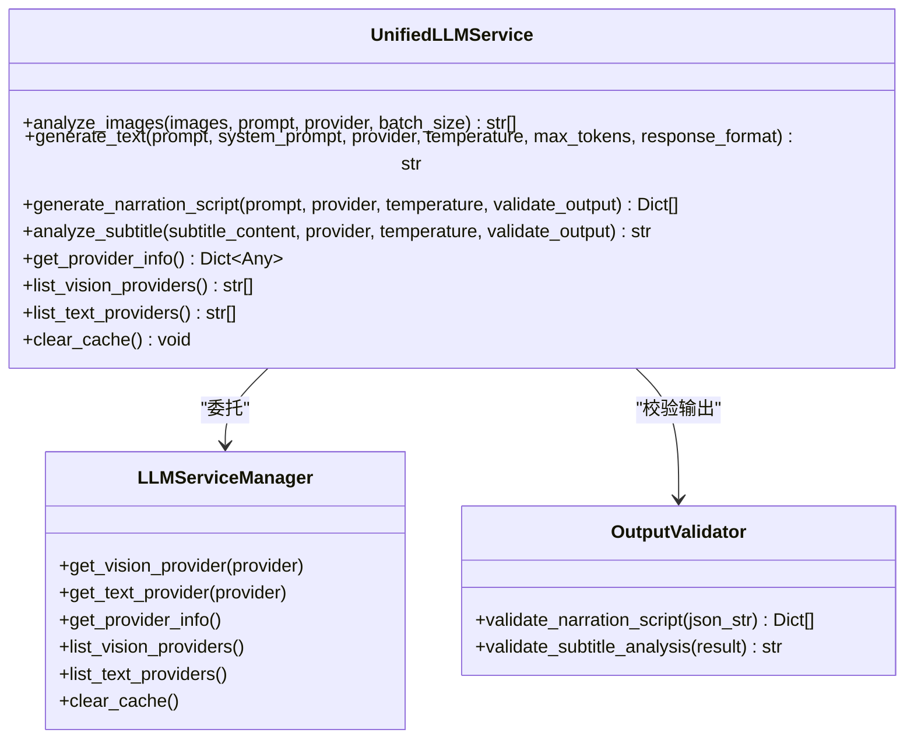
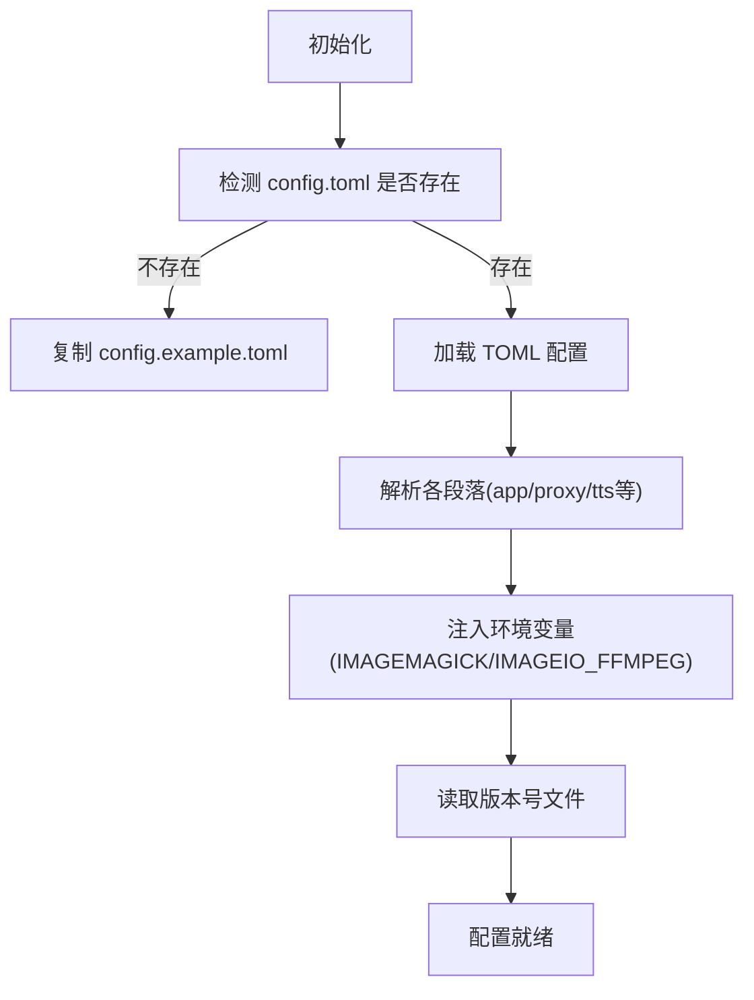
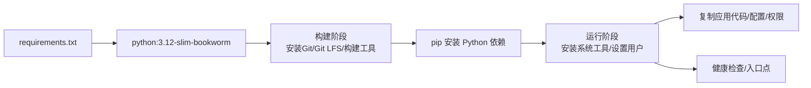

# 贡献指南

<cite>
**本文引用的文件**
- [README.md](file://README.md)
- [README-en.md](file://README-en.md)
- [requirements.txt](file://requirements.txt)
- [Dockerfile](file://Dockerfile)
- [Makefile](file://Makefile)
- [config.example.toml](file://config.example.toml)
- [app/config/config.py](file://app/config/config.py)
- [.github/release-drafter.yml](file://.github/release-drafter.yml)
- [app/models/schema.py](file://app/models/schema.py)
- [app/services/llm/unified_service.py](file://app/services/llm/unified_service.py)
- [app/services/llm/test_llm_service.py](file://app/services/llm/test_llm_service.py)
- [webui/tools/generate_script_short.py](file://webui/tools/generate_script_short.py)
</cite>

## 目录
1. [简介](#简介)
2. [项目结构](#项目结构)
3. [核心组件](#核心组件)
4. [架构总览](#架构总览)
5. [详细组件分析](#详细组件分析)
6. [依赖关系分析](#依赖关系分析)
7. [性能考虑](#性能考虑)
8. [故障排查指南](#故障排查指南)
9. [结论](#结论)
10. [附录](#附录)

## 简介
本指南面向希望参与 NarratoAI 项目的贡献者，覆盖从 Fork 仓库、创建分支、提交代码、发起 Pull Request 的全流程；明确代码规范与风格要求；规范提交信息格式与最佳实践；说明代码审查流程与合并标准；提供 Issue 报告模板与文档贡献方法；并给出社区行为准则与沟通规范，帮助营造良好的开源协作环境。

## 项目结构
NarratoAI 是一个基于 LLM 的影视解说与自动化剪辑工具，前端采用 Streamlit，后端模块化组织，包含配置管理、LLM 统一服务、提示词模板、视频/音频处理、WebUI 工具集等。项目提供 Docker 化部署与一键 Makefile 管理命令，便于本地开发与测试。

图表来源
- [Dockerfile:1-89](file://Dockerfile#L1-L89)
- [Makefile:1-64](file://Makefile#L1-L64)
- [config.example.toml:1-177](file://config.example.toml#L1-L177)
- [app/config/config.py:1-95](file://app/config/config.py#L1-L95)
- [app/services/llm/unified_service.py:1-263](file://app/services/llm/unified_service.py#L1-L263)
- [webui/tools/generate_script_short.py:1-128](file://webui/tools/generate_script_short.py#L1-L128)

章节来源
- [README.md:105-141](file://README.md#L105-L141)
- [Dockerfile:1-89](file://Dockerfile#L1-L89)
- [Makefile:1-64](file://Makefile#L1-L64)
- [config.example.toml:1-177](file://config.example.toml#L1-L177)

## 核心组件
- 配置系统：集中加载 TOML 配置，支持多种 LLM/TTS 提供商与代理设置，自动回退与容错处理。
- LLM 统一服务：封装文本/视觉模型调用、输出校验、提供商信息查询与缓存清理。
- WebUI 工具：短剧脚本生成流程，包含输入校验、进度反馈、错误处理与日志记录。
- 数据模型：视频参数、字幕位置、音量默认值等，保证前后端数据一致性。
- 部署与运维：Dockerfile 多阶段构建、Makefile 一键命令、健康检查与权限隔离。

章节来源
- [app/config/config.py:24-95](file://app/config/config.py#L24-L95)
- [app/services/llm/unified_service.py:20-243](file://app/services/llm/unified_service.py#L20-L243)
- [webui/tools/generate_script_short.py:13-128](file://webui/tools/generate_script_short.py#L13-L128)
- [app/models/schema.py:16-209](file://app/models/schema.py#L16-L209)

## 架构总览
下图展示从 WebUI 到 LLM 服务再到视频/音频处理的整体流程，以及配置与部署层的支撑作用。

图表来源
- [webui/tools/generate_script_short.py:84-103](file://webui/tools/generate_script_short.py#L84-L103)
- [app/config/config.py:24-95](file://app/config/config.py#L24-L95)
- [app/services/llm/unified_service.py:112-159](file://app/services/llm/unified_service.py#L112-L159)

## 详细组件分析

### WebUI 短剧脚本生成流程
该流程负责接收用户输入、校验文件合法性、调用后端生成脚本并处理结果。

图表来源
- [webui/tools/generate_script_short.py:32-107](file://webui/tools/generate_script_short.py#L32-L107)

章节来源
- [webui/tools/generate_script_short.py:13-128](file://webui/tools/generate_script_short.py#L13-L128)

### LLM 统一服务接口
统一服务封装文本/视觉模型调用、输出校验与提供商信息查询，便于迁移与维护。

图表来源
- [app/services/llm/unified_service.py:20-243](file://app/services/llm/unified_service.py#L20-L243)

章节来源
- [app/services/llm/unified_service.py:20-263](file://app/services/llm/unified_service.py#L20-L263)

### 配置加载与环境变量
配置系统负责加载 TOML 配置、版本号读取、环境变量注入（如 ImageMagick/FFmpeg 路径），并提供保存能力。

图表来源
- [app/config/config.py:24-95](file://app/config/config.py#L24-L95)
- [config.example.toml:1-177](file://config.example.toml#L1-L177)

章节来源
- [app/config/config.py:24-95](file://app/config/config.py#L24-L95)
- [config.example.toml:1-177](file://config.example.toml#L1-L177)

## 依赖关系分析
- 运行时依赖：requests、moviepy、edge-tts、streamlit、loguru、tomli、pydub、pysrt、openai、litellm、google-generativeai、azure-cognitiveservices-speech、dashscope、Pillow、tqdm、tenacity 等。
- 可选依赖：faster-whisper、opencv-python、torch 等，按需启用。
- Docker 构建链路：多阶段构建，先安装 Git/Git LFS、构建虚拟环境并安装依赖，再复制到运行阶段，安装 ImageMagick/FFmpeg 等系统工具，设置非 root 用户与健康检查。

图表来源
- [requirements.txt:1-39](file://requirements.txt#L1-L39)
- [Dockerfile:1-89](file://Dockerfile#L1-L89)

章节来源
- [requirements.txt:1-39](file://requirements.txt#L1-L39)
- [Dockerfile:1-89](file://Dockerfile#L1-L89)

## 性能考虑
- 并发与批处理：LLM 统一服务支持批量图片分析与可配置批大小，有利于提升吞吐。
- 线程与资源：视频处理参数包含线程数配置，合理设置可提升处理速度。
- 缓存与重试：依赖 tenacity 实现重试机制，结合 LiteLLM 的自动重试与成本追踪，提升稳定性。
- 容器化与资源隔离：Docker 非 root 用户运行、健康检查与最小化系统依赖，降低资源占用与安全风险。

章节来源
- [app/services/llm/unified_service.py:24-62](file://app/services/llm/unified_service.py#L24-L62)
- [app/models/schema.py:194-198](file://app/models/schema.py#L194-L198)
- [requirements.txt:25-26](file://requirements.txt#L25-L26)
- [Dockerfile:51-88](file://Dockerfile#L51-L88)

## 故障排查指南
- 配置问题：确认 config.toml 是否存在且格式正确；必要时复制示例配置；检查 LLM/TTS 提供商 API Key 与模型名称。
- 日志与错误：统一使用 loguru 记录；WebUI 工具中对异常进行捕获并记录堆栈；查看容器日志定位问题。
- 依赖与环境：确保 Python 版本满足要求；Docker 构建阶段安装 Git LFS 与系统工具；FFmpeg/ImageMagick 路径正确。
- LLM 服务：使用测试脚本验证文本生成、JSON 生成、字幕分析与提供商信息获取；检查网络与代理配置。

章节来源
- [app/config/config.py:24-95](file://app/config/config.py#L24-L95)
- [webui/tools/generate_script_short.py:124-128](file://webui/tools/generate_script_short.py#L124-L128)
- [app/services/llm/test_llm_service.py:205-264](file://app/services/llm/test_llm_service.py#L205-L264)

## 结论
通过本指南，贡献者可以快速理解项目结构与关键流程，遵循统一的代码规范与提交规范，高质量地完成代码贡献与问题反馈。建议在提交前先运行测试脚本与本地部署验证，确保变更不会破坏现有功能。

## 附录

### 代码贡献流程
- Fork 项目至个人仓库
- 创建功能/修复分支（建议使用清晰的前缀，如 feature/、fix/、docs/）
- 编写代码与单元/集成测试
- 提交前运行测试脚本与本地部署验证
- 提交信息格式建议：类型(scope): 概要；正文说明动机与影响；引用 Issue 编号
- 发起 Pull Request，等待代码审查与合并

章节来源
- [README.md:149-156](file://README.md#L149-L156)
- [README-en.md:91-98](file://README-en.md#L91-L98)

### 代码规范与风格
- Python 风格：遵循 PEP 8 基本原则，命名采用下划线命名法；函数/类/模块结构清晰；避免过长函数与过深嵌套。
- 注释与文档：公共接口与复杂逻辑添加清晰注释；模块顶部说明用途与关键参数；错误处理处补充说明。
- 类型提示：优先使用类型提示，提升可读性与静态检查友好性。
- 日志：使用 loguru 记录 INFO/WARNING/ERROR 级别日志，避免 print；错误时记录上下文与堆栈。
- 配置：敏感信息通过环境变量或配置文件管理，避免硬编码；提供示例配置文件。

章节来源
- [app/services/llm/unified_service.py:1-15](file://app/services/llm/unified_service.py#L1-L15)
- [app/config/config.py:1-10](file://app/config/config.py#L1-L10)

### 提交信息格式与最佳实践
- 格式：type(scope): subject
- 类型：feat、fix、docs、style、refactor、perf、test、build、ci、chore、revert
- 主题简洁明了，正文说明动机、变更内容与潜在影响；引用相关 Issue 编号
- 避免一次性提交过多无关改动，拆分为多个小提交更易审查

章节来源
- [.github/release-drafter.yml:21](file://.github/release-drafter.yml#L21)

### 代码审查流程与标准
- 审查要点：功能正确性、边界条件、错误处理、性能影响、安全性、可维护性、测试覆盖
- 反馈处理：及时响应评论，逐条回复并修改；必要时补充测试或文档
- 合并条件：至少一名维护者批准；CI 通过；无重大阻塞性问题；提交信息清晰可追溯

章节来源
- [README.md:149-156](file://README.md#L149-L156)
- [README-en.md:91-98](file://README-en.md#L91-L98)

### Issue 报告模板
- 标题：简洁描述问题
- 环境信息：操作系统、Python 版本、Docker/本地运行方式
- 复现步骤：最小可复现步骤与预期/实际结果
- 日志与截图：附带关键日志与截图
- 配置信息：提供 config.toml 关键配置片段（隐藏敏感信息）

章节来源
- [README.md:149-156](file://README.md#L149-L156)
- [README-en.md:91-98](file://README-en.md#L91-L98)

### 文档贡献方法
- 文档更新：README、README-en、docs 目录下的说明文件
- 示例与教程：新增使用示例、配置示例、常见问题解答
- 翻译工作：README-en、webui/i18n 资源文件
- 提交方式：与代码贡献相同，遵循提交信息规范与审查流程

章节来源
- [README.md:1-30](file://README.md#L1-L30)
- [README-en.md:1-33](file://README-en.md#L1-L33)

### 社区行为准则与沟通规范
- 尊重与包容：尊重不同观点与背景，避免人身攻击
- 清晰表达：提问与反馈尽量具体、可复现；提供必要上下文
- 积极协作：及时响应与协助他人；建设性地提出建议
- 遵守法律：不传播侵权、违法或不当内容

章节来源
- [README.md:23](file://README.md#L23)
- [README-en.md:22](file://README-en.md#L22)