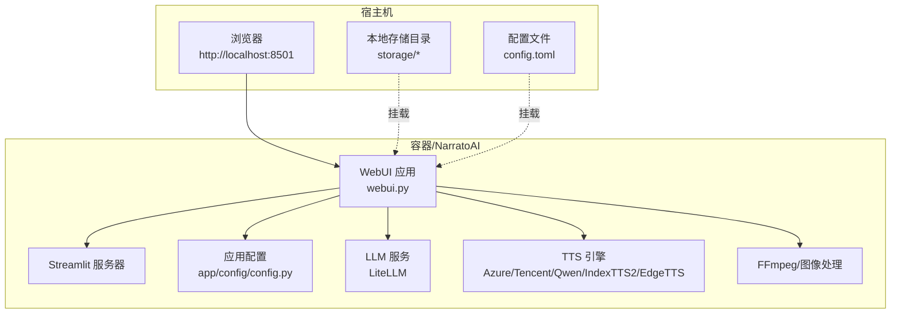
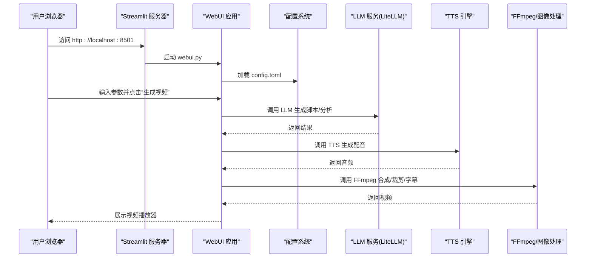
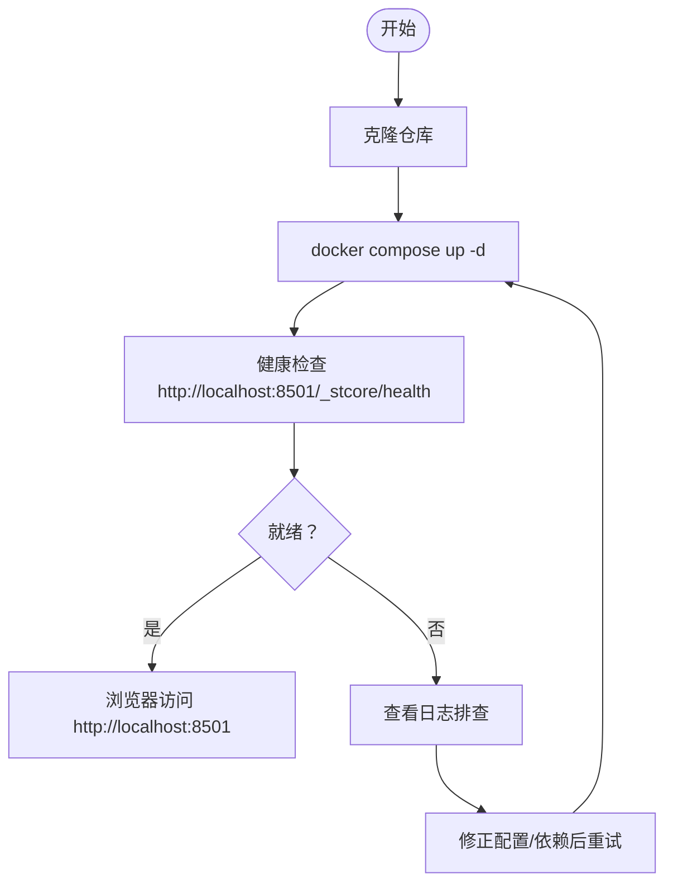
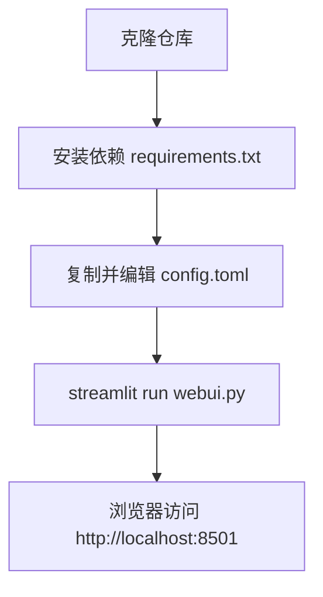
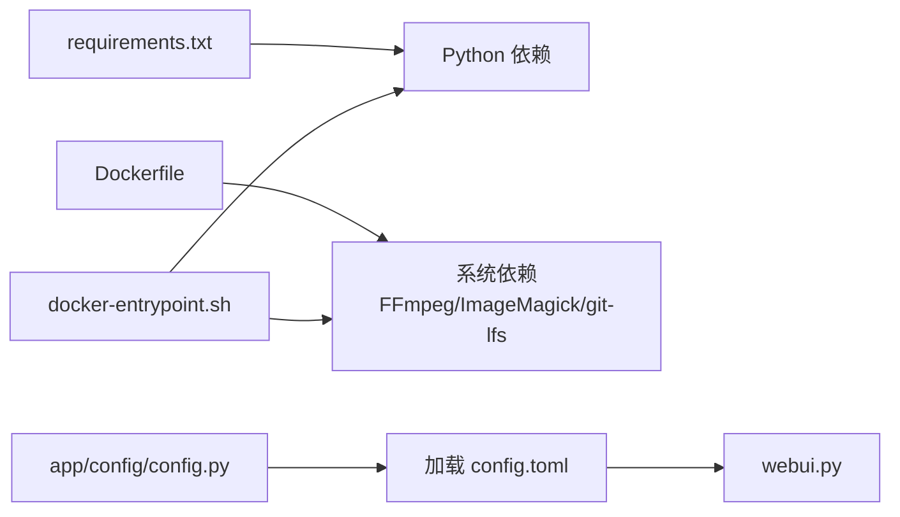

# 快速开始

<cite>
**本文引用的文件列表**
- [README.md](file://README.md)
- [config.example.toml](file://config.example.toml)
- [requirements.txt](file://requirements.txt)
- [Dockerfile](file://Dockerfile)
- [docker-compose.yml](file://docker-compose.yml)
- [docker-entrypoint.sh](file://docker-entrypoint.sh)
- [deploy-linux.sh](file://deploy-linux.sh)
- [deploy-windows-docker.bat](file://deploy-windows-docker.bat)
- [webui.py](file://webui.py)
- [app/config/config.py](file://app/config/config.py)
</cite>

## 目录
1. [简介](#简介)
2. [项目结构](#项目结构)
3. [核心组件](#核心组件)
4. [架构总览](#架构总览)
5. [详细组件分析](#详细组件分析)
6. [依赖关系分析](#依赖关系分析)
7. [性能与资源建议](#性能与资源建议)
8. [故障排查指南](#故障排查指南)
9. [结论](#结论)
10. [附录](#附录)

## 简介
NarratoAI 是一个自动化影视解说工具，基于大模型（LLM）实现文案撰写、自动化视频剪辑、配音与字幕生成的一站式流程。本“快速开始”指南面向首次使用者，提供环境要求、三种部署方式（Docker 部署、整合包部署、本地部署）的完整步骤，解释配置文件参数，并给出常见问题排查与解决方案。

## 项目结构
- 应用入口为 Web UI，基于 Streamlit 提供图形界面。
- 核心业务逻辑位于 app/ 目录，包含配置、服务、模型、工具等模块。
- 配置文件采用 TOML 格式，支持 LLM、TTS、代理、视频处理等多类参数。
- 提供 Dockerfile、docker-compose.yml 与多平台一键部署脚本，便于快速上线。

图表来源
- [webui.py:1-294](file://webui.py#L1-L294)
- [app/config/config.py:1-95](file://app/config/config.py#L1-L95)
- [Dockerfile:1-89](file://Dockerfile#L1-L89)
- [docker-compose.yml:1-30](file://docker-compose.yml#L1-L30)

章节来源
- [README.md:105-141](file://README.md#L105-L141)
- [webui.py:1-294](file://webui.py#L1-L294)
- [app/config/config.py:1-95](file://app/config/config.py#L1-L95)

## 核心组件
- WebUI 应用：负责界面展示、参数收集、任务调度与进度反馈。
- 配置系统：加载并解析 config.toml，支持 LLM、TTS、代理、视频处理等配置。
- Docker 容器：封装 Python 运行时、系统依赖（FFmpeg、ImageMagick）、应用代码与入口脚本。
- 一键部署脚本：提供 Linux/macOS 本地部署与 Windows Docker 部署的自动化流程。

章节来源
- [webui.py:1-294](file://webui.py#L1-L294)
- [app/config/config.py:1-95](file://app/config/config.py#L1-L95)
- [Dockerfile:1-89](file://Dockerfile#L1-L89)
- [docker-compose.yml:1-30](file://docker-compose.yml#L1-L30)

## 架构总览
NarratoAI 的运行时由“容器/本地环境”承载，WebUI 通过 Streamlit 提供前端交互，后端通过 LiteLLM 统一对接多家 LLM 提供商，TTS 引擎支持多种厂商与本地服务，视频处理依赖 FFmpeg 与相关工具链。

图表来源
- [webui.py:132-224](file://webui.py#L132-L224)
- [app/config/config.py:24-44](file://app/config/config.py#L24-L44)
- [Dockerfile:80-89](file://Dockerfile#L80-L89)

## 详细组件分析

### 环境要求
- 硬件建议
  - CPU：建议 4 核或以上
  - 内存：建议 8GB 或以上
  - 显卡：非必需，但硬件加速可显著提升视频处理性能
- 操作系统
  - Windows 10/11 或 macOS 11.0 及以上
- 软件环境
  - Python 3.12+
  - Docker Desktop（Docker 部署场景）

章节来源
- [README.md:143-147](file://README.md#L143-L147)

### 配置文件 config.toml 参数说明
- 应用与 LLM
  - app.llm_vision_timeout / app.llm_text_timeout：视觉/文本模型请求超时（秒）
  - app.llm_max_retries：API 重试次数（由 LiteLLM 统一处理）
  - app.vision_llm_provider / text_llm_provider：统一使用 LiteLLM
  - app.vision_litellm_model_name / text_litellm_model_name：模型名称（provider/model）
  - app.vision_litellm_api_key / text_litellm_api_key：对应提供商的 API Key
  - app.vision_litellm_base_url / text_litellm_base_url：可选自定义 Base URL
- TTS 引擎
  - azure.*：Azure Speech 配置
  - tencent.*：腾讯云 TTS 配置
  - soulvoice.*：SoulVoice TTS 配置
  - tts_qwen.*：通义千问 Qwen3 TTS 配置
  - indextts2.*：IndexTTS2 语音克隆配置（本地部署）
  - ui.tts_engine：界面选择的 TTS 引擎（edge_tts/azure_speech/soulvoice/tencent_tts/tts_qwen）
  - ui.edge_* / ui.azure_*：各引擎的语音参数（音色、音量、语速、音高）
- 代理与网络
  - proxy.http / proxy.https / proxy.enabled：HTTP/HTTPS 代理配置
- 视频处理
  - frames.frame_interval_input：提取关键帧间隔（秒）
  - frames.vision_batch_size：单次视觉模型处理的关键帧数量

章节来源
- [config.example.toml:1-177](file://config.example.toml#L1-L177)

### 部署方式一：Docker 部署（macOS 推荐）
- 适用场景
  - macOS 用户优先推荐，隔离性强、依赖一致、便于维护
- 步骤
  1) 克隆仓库并进入目录
  2) 一键部署：docker compose up -d
  3) 访问应用：http://localhost:8501
- 关键文件
  - Dockerfile：多阶段构建，安装 Python 3.12、系统依赖（FFmpeg、ImageMagick）、复制应用与入口脚本
  - docker-compose.yml：映射端口 8501、挂载 storage 与 config.toml、设置时区与健康检查
  - docker-entrypoint.sh：容器启动时检查/安装依赖、创建必要目录、启动 Streamlit

图表来源
- [README.md:107-118](file://README.md#L107-L118)
- [docker-compose.yml:1-30](file://docker-compose.yml#L1-L30)
- [Dockerfile:1-89](file://Dockerfile#L1-L89)
- [docker-entrypoint.sh:1-145](file://docker-entrypoint.sh#L1-L145)

章节来源
- [README.md:107-118](file://README.md#L107-L118)
- [Dockerfile:1-89](file://Dockerfile#L1-L89)
- [docker-compose.yml:1-30](file://docker-compose.yml#L1-L30)
- [docker-entrypoint.sh:1-145](file://docker-entrypoint.sh#L1-L145)

### 部署方式二：整合包部署（Windows 推荐）
- 适用场景
  - Windows 用户优先推荐，开箱即用，无需安装 Python/Docker
- 步骤
  1) 克隆仓库并进入目录
  2) 双击运行 deploy-windows-docker.bat（或命令行执行）
  3) 自动检查 Docker、构建镜像、启动容器、等待健康检查
  4) 访问应用：http://localhost:8501
- 关键脚本
  - deploy-windows-docker.bat：检查 Docker/Docker Compose、构建镜像、启动容器、等待健康检查、自动打开浏览器

章节来源
- [README.md:119-120](file://README.md#L119-L120)
- [deploy-windows-docker.bat:1-372](file://deploy-windows-docker.bat#L1-L372)

### 部署方式三：本地部署
- 适用场景
  - 需要深度定制、调试或离线开发
- 步骤
  1) 克隆仓库并进入目录
  2) 安装依赖：pip install -r requirements.txt
  3) 复制配置：cp config.example.toml config.toml
  4) 编辑 config.toml，配置 LLM/TTS/代理等参数
  5) 启动应用：streamlit run webui.py --server.maxUploadSize=2048
  6) 访问应用：http://localhost:8501
- 关键文件
  - requirements.txt：核心依赖（requests、moviepy、edge-tts、streamlit、litellm、google-generativeai、azure-cognitiveservices-speech、tencentcloud-sdk-python、dashscope、Pillow、tqdm、tenacity 等）
  - webui.py：Streamlit 应用入口，初始化日志、注册 LLM 提供商、检测 FFmpeg 硬件加速、渲染 UI 并处理生成任务
  - app/config/config.py：加载 config.toml，支持 UTF-8-SIG 兼容读取、环境变量注入（IMAGEMAGICK_BINARY、IMAGEIO_FFMPEG_EXE）

图表来源
- [README.md:122-141](file://README.md#L122-L141)
- [requirements.txt:1-39](file://requirements.txt#L1-L39)
- [webui.py:1-294](file://webui.py#L1-L294)
- [app/config/config.py:1-95](file://app/config/config.py#L1-L95)

章节来源
- [README.md:122-141](file://README.md#L122-L141)
- [requirements.txt:1-39](file://requirements.txt#L1-L39)
- [webui.py:1-294](file://webui.py#L1-L294)
- [app/config/config.py:1-95](file://app/config/config.py#L1-L95)

### 访问应用与基本使用
- 访问地址：http://localhost:8501
- 基本流程
  1) 在左侧基础设置中选择语言与上传素材
  2) 在脚本/视频/音频/字幕设置中调整参数
  3) 点击“生成视频”，观察进度条与状态文本
  4) 成功后可在页面中预览生成的视频
- 注意事项
  - 首次使用需在 Web 界面或 config.toml 中配置 LLM/TTS API Key
  - 若启用代理，请在 config.toml 的 proxy 段落中配置

章节来源
- [README.md:117-118](file://README.md#L117-L118)
- [webui.py:227-294](file://webui.py#L227-L294)

## 依赖关系分析
- 运行时依赖
  - Python 3.12、Streamlit、LiteLLM、FFmpeg、ImageMagick、Pillow、requests、pydub、pysrt、tqdm、tenacity 等
- 容器内依赖安装
  - Dockerfile 使用多阶段构建，先安装系统依赖（FFmpeg、ImageMagick、git-lfs 等），再安装 Python 依赖
  - docker-entrypoint.sh 在容器启动时检查并安装运行时依赖，确保腾讯云 SDK 等组件可用
- 配置加载
  - app/config/config.py 会在 config.toml 缺失时自动从 config.example.toml 复制，并支持 UTF-8-SIG 编码读取

图表来源
- [requirements.txt:1-39](file://requirements.txt#L1-L39)
- [Dockerfile:1-89](file://Dockerfile#L1-L89)
- [docker-entrypoint.sh:1-145](file://docker-entrypoint.sh#L1-L145)
- [app/config/config.py:1-95](file://app/config/config.py#L1-L95)
- [webui.py:1-294](file://webui.py#L1-L294)

章节来源
- [requirements.txt:1-39](file://requirements.txt#L1-L39)
- [Dockerfile:1-89](file://Dockerfile#L1-L89)
- [docker-entrypoint.sh:1-145](file://docker-entrypoint.sh#L1-L145)
- [app/config/config.py:1-95](file://app/config/config.py#L1-L95)
- [webui.py:1-294](file://webui.py#L1-L294)

## 性能与资源建议
- 硬件建议
  - CPU：4 核及以上，内存 8GB 及以上
  - 显卡：非必需，但具备 NVIDIA CUDA 或 VAAPI/QSV 硬件加速可显著提升视频处理速度
- 软件建议
  - 使用 Docker 部署可避免本地环境差异带来的性能波动
  - 在 config.toml 中合理设置 LLM 超时与重试次数，避免长时间阻塞
  - 若启用代理，确保代理稳定，避免影响 LLM/TTS 请求
- 视频处理建议
  - FFmpeg 硬件加速检测：WebUI 启动时会检测并记录硬件加速可用性，若不可用将回退至软件编码
  - 合理设置 frames.frame_interval_input 与 frames.vision_batch_size，平衡处理速度与质量

章节来源
- [README.md:143-147](file://README.md#L143-L147)
- [webui.py:247-257](file://webui.py#L247-L257)
- [config.example.toml:171-177](file://config.example.toml#L171-L177)

## 故障排查指南
- Docker 部署常见问题
  - Docker Desktop 未运行：脚本会尝试启动并等待，若超时请手动启动
  - Docker Compose 不可用：确保安装最新版 Docker Desktop（内置 Compose）
  - 镜像构建失败：检查网络与 Dockerfile 配置，必要时使用 --no-cache 重新构建
  - 容器启动后无法访问：使用 docker compose logs -f 查看日志，确认健康检查通过
- Windows 整合包部署问题
  - 首次启动慢：容器首次构建与依赖安装需要时间，耐心等待健康检查
  - 自动打开浏览器失败：可手动访问 http://localhost:8501
- 本地部署常见问题
  - Python 版本不符：确保使用 Python 3.12+，requirements.txt 中包含所需依赖
  - FFmpeg 未安装：请安装 FFmpeg 并确保在 PATH 中，否则视频处理功能受限
  - 配置文件缺失：cp config.example.toml config.toml 后再启动
  - LLM/TTS 401/403：检查 config.toml 中 API Key 与 Base URL 是否正确
- 通用排查步骤
  - 查看健康检查：http://localhost:8501/_stcore/health
  - 查看日志：Docker 场景使用 docker compose logs -f；本地场景查看终端输出
  - 重试与重建：必要时执行 docker compose down && up -d 或重新运行一键脚本

章节来源
- [deploy-windows-docker.bat:78-142](file://deploy-windows-docker.bat#L78-L142)
- [deploy-windows-docker.bat:178-207](file://deploy-windows-docker.bat#L178-L207)
- [deploy-windows-docker.bat:210-237](file://deploy-windows-docker.bat#L210-L237)
- [deploy-linux.sh:47-64](file://deploy-linux.sh#L47-L64)
- [deploy-linux.sh:246-266](file://deploy-linux.sh#L246-L266)
- [docker-entrypoint.sh:8-62](file://docker-entrypoint.sh#L8-L62)
- [webui.py:132-224](file://webui.py#L132-L224)

## 结论
通过本快速开始指南，您可以根据操作系统与技术偏好选择合适的部署方式：macOS 推荐 Docker 部署，Windows 推荐整合包部署，需要深度定制则选择本地部署。完成部署后，按照配置文件参数指引配置 LLM/TTS，即可在 Web 界面中完成从素材到成品视频的全流程自动化。

## 附录
- 常用命令
  - Docker：docker compose up -d / down / logs -f / restart
  - Windows：双击 deploy-windows-docker.bat 或使用命令行参数（stop/status/logs/restart/rebuild）
  - Linux：./deploy-linux.sh run / stop / status / rebuild
- 配置文件位置
  - Docker：容器内 /NarratoAI/config.toml（可通过卷挂载 host/config.toml）
  - 本地：项目根目录 config.toml（如无则从 config.example.toml 复制）