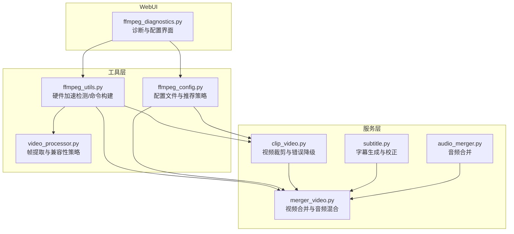
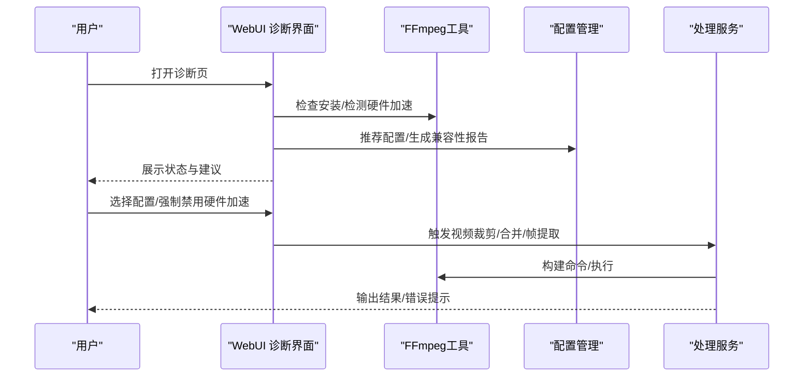
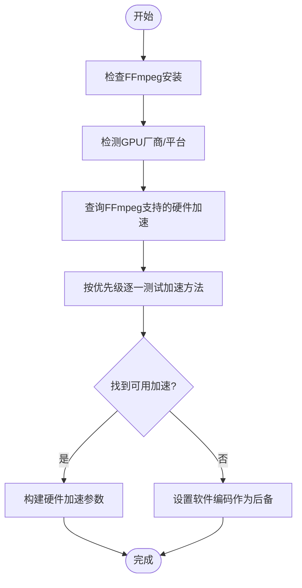
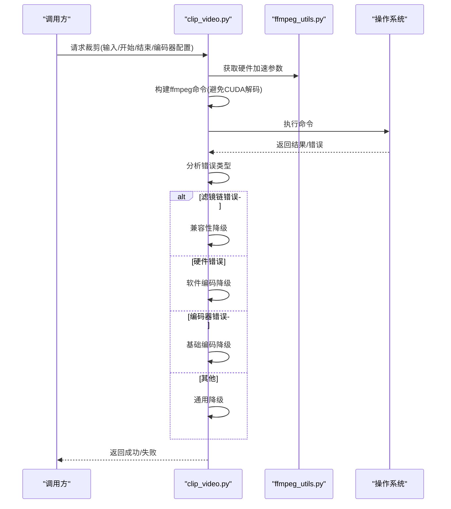
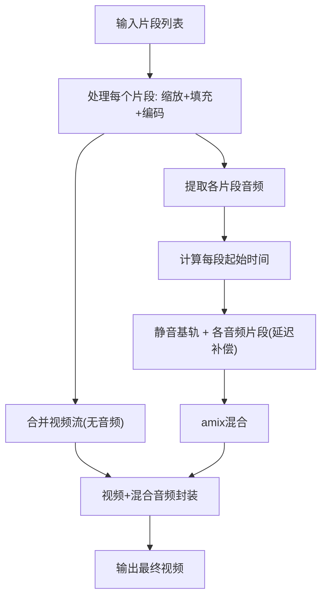
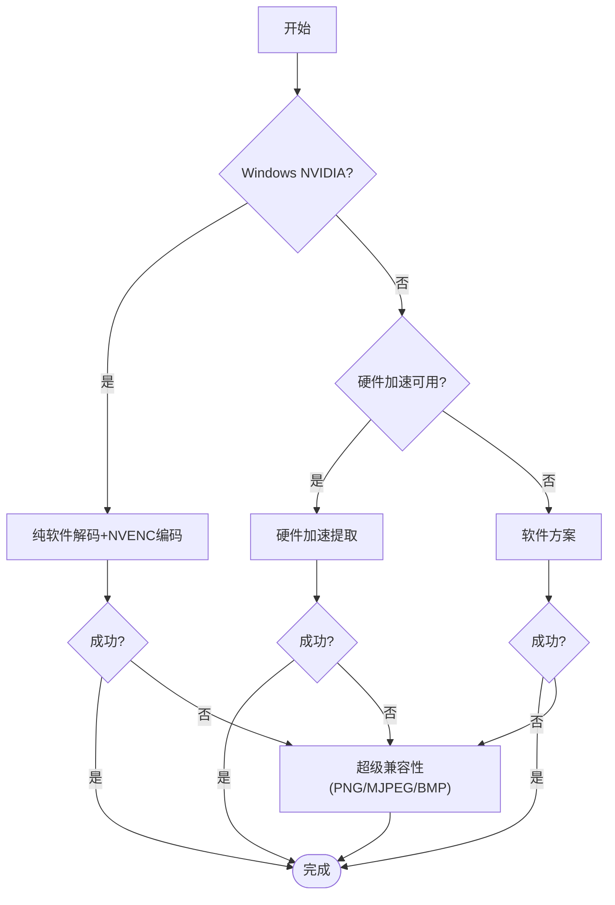
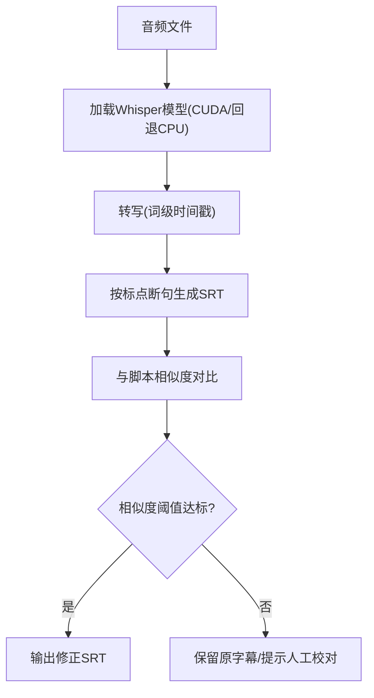
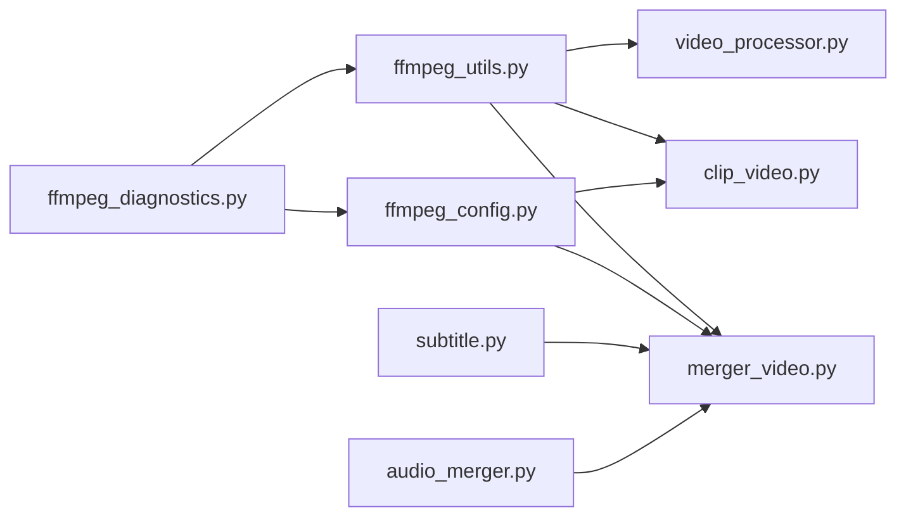

# 媒体处理问题

<cite>
**本文引用的文件**
- [ffmpeg_utils.py](file://app/utils/ffmpeg_utils.py)
- [ffmpeg_config.py](file://app/config/ffmpeg_config.py)
- [clip_video.py](file://app/services/clip_video.py)
- [merger_video.py](file://app/services/merger_video.py)
- [video_processor.py](file://app/utils/video_processor.py)
- [subtitle.py](file://app/services/subtitle.py)
- [audio_merger.py](file://app/services/audio_merger.py)
- [ffmpeg_diagnostics.py](file://webui/components/ffmpeg_diagnostics.py)
- [preflight_check.py](file://app/services/preflight_check.py)
</cite>

## 目录
1. [简介](#简介)
2. [项目结构](#项目结构)
3. [核心组件](#核心组件)
4. [架构总览](#架构总览)
5. [详细组件分析](#详细组件分析)
6. [依赖关系分析](#依赖关系分析)
7. [性能考量](#性能考量)
8. [故障排除指南](#故障排除指南)
9. [结论](#结论)
10. [附录](#附录)

## 简介
本指南面向NarratoAI媒体处理流程中的专业用户与运维人员，聚焦FFmpeg相关问题的系统化排查与修复。内容覆盖：
- FFmpeg编解码问题：格式不支持、编解码器缺失、硬件加速失败
- 视频剪辑与拼接：裁剪错误、片段拼接失败、时序不匹配
- 音频处理：音轨合并失败、采样率转换错误、音频同步问题
- 字幕处理：格式转换失败、编码错误、显示异常
- 媒体完整性检查、格式兼容性测试、转换质量评估
- 常见媒体格式支持列表与替代方案

## 项目结构
NarratoAI围绕“脚本-素材-生成”的主流程组织，媒体处理相关代码集中在以下模块：
- 工具层：FFmpeg检测、配置管理、帧提取
- 服务层：视频裁剪、视频合并、字幕生成、音频合并
- WebUI层：FFmpeg诊断与配置界面

图示来源
- [ffmpeg_diagnostics.py:1-281](file://webui/components/ffmpeg_diagnostics.py#L1-L281)
- [ffmpeg_utils.py:1-1121](file://app/utils/ffmpeg_utils.py#L1-L1121)
- [ffmpeg_config.py:1-285](file://app/config/ffmpeg_config.py#L1-L285)
- [video_processor.py:1-670](file://app/utils/video_processor.py#L1-L670)
- [clip_video.py:1-1108](file://app/services/clip_video.py#L1-L1108)
- [merger_video.py:1-678](file://app/services/merger_video.py#L1-L678)
- [subtitle.py:1-467](file://app/services/subtitle.py#L1-L467)
- [audio_merger.py:1-172](file://app/services/audio_merger.py#L1-L172)

章节来源
- [ffmpeg_diagnostics.py:1-281](file://webui/components/ffmpeg_diagnostics.py#L1-L281)
- [ffmpeg_utils.py:1-1121](file://app/utils/ffmpeg_utils.py#L1-L1121)
- [ffmpeg_config.py:1-285](file://app/config/ffmpeg_config.py#L1-L285)
- [video_processor.py:1-670](file://app/utils/video_processor.py#L1-L670)
- [clip_video.py:1-1108](file://app/services/clip_video.py#L1-L1108)
- [merger_video.py:1-678](file://app/services/merger_video.py#L1-L678)
- [subtitle.py:1-467](file://app/services/subtitle.py#L1-L467)
- [audio_merger.py:1-172](file://app/services/audio_merger.py#L1-L172)

## 核心组件
- FFmpeg工具与配置
  - 硬件加速检测与降级：自动识别GPU厂商、优先级、设备参数、备用方案
  - 配置文件与推荐策略：按平台/硬件自动选择高性能/兼容性/Windows NVIDIA优化/Apple VideoToolbox等配置
- 视频处理
  - 裁剪：时间戳解析、滤镜链错误分析与多级降级（兼容性/软件/基础/通用）
  - 合并：分步合并视频流与音频流，避免复杂滤镜；静音轨道与amix混合
- 帧提取
  - 多策略提取：纯软件解码+NVENC编码、硬件加速、软件方案、超级兼容性（PNG/MJPEG/BMP）
- 字幕与音频
  - 字幕：Whisper模型加载、SRT生成、与脚本相似度校正
  - 音频：TTS与原声混合、响度LUFS/RMS分析、音量系数计算

章节来源
- [ffmpeg_utils.py:1-1121](file://app/utils/ffmpeg_utils.py#L1-L1121)
- [ffmpeg_config.py:1-285](file://app/config/ffmpeg_config.py#L1-L285)
- [clip_video.py:1-1108](file://app/services/clip_video.py#L1-L1108)
- [merger_video.py:1-678](file://app/services/merger_video.py#L1-L678)
- [video_processor.py:1-670](file://app/utils/video_processor.py#L1-L670)
- [subtitle.py:1-467](file://app/services/subtitle.py#L1-L467)
- [audio_merger.py:1-172](file://app/services/audio_merger.py#L1-L172)

## 架构总览
下图展示媒体处理关键路径：WebUI触发诊断与配置，工具层提供FFmpeg能力，服务层执行具体任务。

图示来源
- [ffmpeg_diagnostics.py:20-281](file://webui/components/ffmpeg_diagnostics.py#L20-L281)
- [ffmpeg_utils.py:118-355](file://app/utils/ffmpeg_utils.py#L118-L355)
- [ffmpeg_config.py:98-141](file://app/config/ffmpeg_config.py#L98-L141)
- [clip_video.py:230-301](file://app/services/clip_video.py#L230-L301)
- [merger_video.py:328-647](file://app/services/merger_video.py#L328-L647)

## 详细组件分析

### FFmpeg工具与配置
- 硬件加速检测
  - 逐项测试CUDA/QSV/VAAPI/AMF/D3D11VA/DXVA2/VideoToolbox，结合平台与GPU厂商优先级
  - 发现Windows NVIDIA场景下CUDA硬件解码易引发滤镜链错误，优先采用“纯NVENC编码器”方案
- 配置文件
  - 高性能/兼容性/Windows NVIDIA优化/macOS VideoToolbox/通用软件编码
  - 自动选择：依据系统与硬件加速可用性，给出推荐配置与兼容性等级

图示来源
- [ffmpeg_utils.py:252-355](file://app/utils/ffmpeg_utils.py#L252-L355)
- [ffmpeg_config.py:98-141](file://app/config/ffmpeg_config.py#L98-L141)

章节来源
- [ffmpeg_utils.py:118-355](file://app/utils/ffmpeg_utils.py#L118-L355)
- [ffmpeg_config.py:27-96](file://app/config/ffmpeg_config.py#L27-L96)

### 视频裁剪（剪辑错误、滤镜链问题）
- 时间戳解析与结束时间计算
- 命令构建：按编码器类型选择参数（NVENC/CUQI/QSV/VT等），避免CUDA硬件解码导致的格式转换错误
- 多级降级：滤镜链错误→兼容性模式→软件编码→基础编码→通用降级

图示来源
- [clip_video.py:143-227](file://app/services/clip_video.py#L143-L227)
- [clip_video.py:230-342](file://app/services/clip_video.py#L230-L342)
- [clip_video.py:345-545](file://app/services/clip_video.py#L345-L545)

章节来源
- [clip_video.py:21-74](file://app/services/clip_video.py#L21-L74)
- [clip_video.py:143-227](file://app/services/clip_video.py#L143-L227)
- [clip_video.py:230-342](file://app/services/clip_video.py#L230-L342)
- [clip_video.py:345-545](file://app/services/clip_video.py#L345-L545)

### 视频合并（拼接失败、时序不匹配）
- 分步合并：先合并视频流（无音频），再提取各片段音频，构造静音基轨，使用amix按时间轴混合
- 音频混合：为每个音频片段添加延迟补偿，避免amix音量稀释
- 备用方案：若复杂滤镜失败，回退到“无音频合并”

图示来源
- [merger_video.py:410-647](file://app/services/merger_video.py#L410-L647)

章节来源
- [merger_video.py:130-326](file://app/services/merger_video.py#L130-L326)
- [merger_video.py:328-647](file://app/services/merger_video.py#L328-L647)

### 帧提取（格式不支持、编码异常）
- 多策略提取：纯软件解码+NVENC编码、硬件加速、软件方案、超级兼容性（PNG/MJPEG/BMP）
- 超级兼容性：优先PNG，失败再尝试MJPEG/BMP，最后回退到最简参数

图示来源
- [video_processor.py:188-220](file://app/utils/video_processor.py#L188-L220)
- [video_processor.py:495-584](file://app/utils/video_processor.py#L495-L584)

章节来源
- [video_processor.py:89-186](file://app/utils/video_processor.py#L89-L186)
- [video_processor.py:188-220](file://app/utils/video_processor.py#L188-L220)
- [video_processor.py:495-584](file://app/utils/video_processor.py#L495-L584)

### 字幕处理（格式转换失败、编码错误、显示异常）
- Whisper模型加载：优先CUDA，失败回退CPU；本地模型路径校验
- SRT生成：词级别时间戳、标点断句、输出SRT
- 与脚本相似度校正：合并相邻字幕、阈值过滤、输出修正后的SRT

图示来源
- [subtitle.py:26-102](file://app/services/subtitle.py#L26-L102)
- [subtitle.py:108-197](file://app/services/subtitle.py#L108-L197)
- [subtitle.py:257-348](file://app/services/subtitle.py#L257-L348)

章节来源
- [subtitle.py:26-102](file://app/services/subtitle.py#L26-L102)
- [subtitle.py:108-197](file://app/services/subtitle.py#L108-L197)
- [subtitle.py:257-348](file://app/services/subtitle.py#L257-L348)

### 音频处理（合并失败、采样率转换、同步问题）
- TTS与原声混合：overlay叠加、按脚本duration对齐
- 响度标准化：LUFS/RMS分析，计算TTS与原声的音量系数，限制放大范围
- WebUI诊断：显示FFmpeg状态、硬件加速、推荐配置与建议

章节来源
- [audio_merger.py:21-76](file://app/services/audio_merger.py#L21-L76)
- [audio_merger.py:236-273](file://app/services/audio_merger.py#L236-L273)
- [ffmpeg_diagnostics.py:20-107](file://webui/components/ffmpeg_diagnostics.py#L20-L107)

## 依赖关系分析
- 组件耦合
  - clip_video/merger_video均依赖ffmpeg_utils进行硬件加速检测与参数构建
  - ffmpeg_config提供配置文件与推荐策略，被裁剪/合并/帧提取间接使用
  - WebUI通过ffmpeg_diagnostics展示诊断与建议
- 外部依赖
  - FFmpeg/ffprobe、CUDA/AMF/QSV/VAAPI/VideoToolbox驱动
  - Whisper模型（faster-whisper）

图示来源
- [ffmpeg_diagnostics.py:11-17](file://webui/components/ffmpeg_diagnostics.py#L11-L17)
- [ffmpeg_utils.py:1-1121](file://app/utils/ffmpeg_utils.py#L1-L1121)
- [ffmpeg_config.py:1-285](file://app/config/ffmpeg_config.py#L1-L285)
- [clip_video.py:1-1108](file://app/services/clip_video.py#L1-L1108)
- [merger_video.py:1-678](file://app/services/merger_video.py#L1-L678)
- [video_processor.py:1-670](file://app/utils/video_processor.py#L1-L670)
- [subtitle.py:1-467](file://app/services/subtitle.py#L1-L467)
- [audio_merger.py:1-172](file://app/services/audio_merger.py#L1-L172)

## 性能考量
- 硬件加速优先：NVIDIA NVENC、AMD AMF、Intel QSV、VAAPI、VideoToolbox
- Windows NVIDIA优化：纯NVENC编码器（无硬件解码），兼顾性能与兼容性
- 质量与速度权衡：CRF/CQP/Preset参数随编码器调整
- 合并策略：分步合并减少滤镜复杂度，提升稳定性

## 故障排除指南

### FFmpeg安装与可用性
- 症状：诊断界面提示未安装或不在PATH
- 处理：安装FFmpeg并确保加入系统PATH；重启应用后重试

章节来源
- [ffmpeg_diagnostics.py:40-46](file://webui/components/ffmpeg_diagnostics.py#L40-L46)
- [ffmpeg_utils.py:118-135](file://app/utils/ffmpeg_utils.py#L118-L135)

### 硬件加速不可用
- 症状：硬件加速不可用或报GPU/设备相关错误
- 处理：
  - 更新显卡驱动
  - 安装对应SDK（NVIDIA CUDA、AMD AMF、Intel Media SDK）
  - 在设置中“强制禁用硬件加速”，改用软件编码
  - “重置硬件加速检测”，重新评估

章节来源
- [ffmpeg_diagnostics.py:160-176](file://webui/components/ffmpeg_diagnostics.py#L160-L176)
- [ffmpeg_utils.py:252-355](file://app/utils/ffmpeg_utils.py#L252-L355)

### 关键帧提取失败（滤镜链错误）
- 症状：出现“格式转换错误”类提示
- 处理：
  - 选择“兼容性配置”或“Windows NVIDIA优化配置”
  - 强制禁用硬件加速
  - 使用“超级兼容性方案”（PNG/MJPEG/BMP）
  - 若仍失败，更新驱动或更换编码器

章节来源
- [ffmpeg_diagnostics.py:208-217](file://webui/components/ffmpeg_diagnostics.py#L208-L217)
- [video_processor.py:188-220](file://app/utils/video_processor.py#L188-L220)
- [video_processor.py:311-407](file://app/utils/video_processor.py#L311-L407)

### 视频裁剪失败
- 症状：滤镜链错误、硬件加速错误、编码器错误、文件访问错误
- 处理：
  - 自动降级：兼容性模式→软件编码→基础编码→通用降级
  - Windows NVIDIA场景：避免CUDA硬件解码，使用纯NVENC编码器
  - 检查输入路径与权限

章节来源
- [clip_video.py:304-342](file://app/services/clip_video.py#L304-L342)
- [clip_video.py:345-545](file://app/services/clip_video.py#L345-L545)

### 视频合并失败（拼接失败、时序不匹配）
- 症状：复杂滤镜失败、音频混合异常
- 处理：
  - 分步合并：先合并视频流，再提取/混合音频
  - 静音基轨+amix混合，按时间轴补偿延迟
  - 备用：无音频合并回退

章节来源
- [merger_video.py:467-647](file://app/services/merger_video.py#L467-L647)

### 字幕处理异常
- 症状：模型加载失败、SRT生成异常、显示异常
- 处理：
  - 确认模型路径存在且包含必要文件
  - CUDA不可用时自动回退CPU
  - 使用相似度校正，阈值不达标的片段提示人工校对

章节来源
- [subtitle.py:26-102](file://app/services/subtitle.py#L26-L102)
- [subtitle.py:108-197](file://app/services/subtitle.py#L108-L197)
- [subtitle.py:257-348](file://app/services/subtitle.py#L257-L348)

### 音频处理异常
- 症状：TTS与原声混合失败、响度不一致、采样率/声道不匹配
- 处理：
  - 使用响度分析计算音量系数，限制放大范围
  - 统一采样率与声道（如44100Hz/双声道）
  - overlay叠加时按脚本duration对齐

章节来源
- [audio_merger.py:236-273](file://app/services/audio_merger.py#L236-L273)
- [audio_merger.py:21-76](file://app/services/audio_merger.py#L21-L76)

### 媒体文件完整性检查与格式兼容性测试
- 完整性检查
  - 输出文件存在且大于0字节
  - ffprobe探测视频信息（宽高、帧率、时长）
- 兼容性测试
  - WebUI“生成兼容性报告”查看推荐配置与建议
  - “测试FFmpeg兼容性”进行基础连通性验证

章节来源
- [clip_video.py:269-275](file://app/services/clip_video.py#L269-L275)
- [video_processor.py:45-87](file://app/utils/video_processor.py#L45-L87)
- [ffmpeg_diagnostics.py:93-107](file://webui/components/ffmpeg_diagnostics.py#L93-L107)
- [ffmpeg_diagnostics.py:181-198](file://webui/components/ffmpeg_diagnostics.py#L181-L198)

### 脚本与素材前置校验
- 脚本字段校验：_id、timestamp、picture、narration、OST
- TTS结果校验：缺失ID提示，需补齐或调整OST模式

章节来源
- [preflight_check.py:11-30](file://app/services/preflight_check.py#L11-L30)

## 结论
NarratoAI通过“硬件加速检测+多级降级+分步合并+响度标准化”的策略，显著提升了媒体处理的稳定性与兼容性。遇到问题时，优先使用WebUI诊断与配置，结合工具层的降级与回退策略，通常可在不改变输入素材的前提下解决问题。

## 附录

### 常见媒体格式支持与替代方案
- 视频容器与编码
  - H.264 (libx264/h264_nvenc/h264_amf/h264_qsv/h264_videotoolbox)
  - MP4/MOV封装
- 音频编码
  - AAC（44100Hz/双声道）
- 字幕
  - SRT（词级时间戳生成与校正）
- 替代方案
  - 当前编码器不可用时，自动回退至libx264/libx264（软件编码）
  - Windows NVIDIA场景优先NVENC编码器（无硬件解码）
  - PNG/MJPEG/BMP三路兼容性提取策略

章节来源
- [ffmpeg_config.py:31-96](file://app/config/ffmpeg_config.py#L31-L96)
- [clip_video.py:87-140](file://app/services/clip_video.py#L87-L140)
- [merger_video.py:212-235](file://app/services/merger_video.py#L212-L235)
- [video_processor.py:322-376](file://app/utils/video_processor.py#L322-L376)