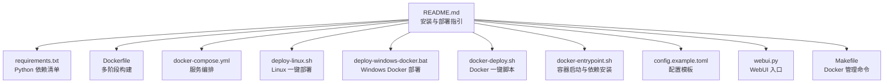
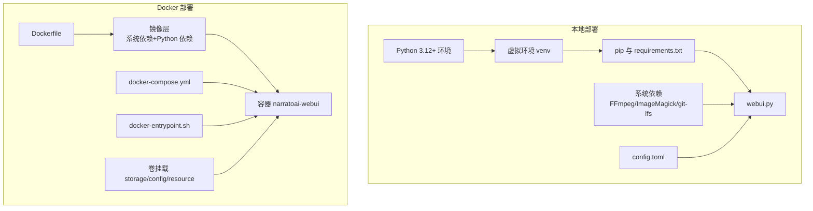
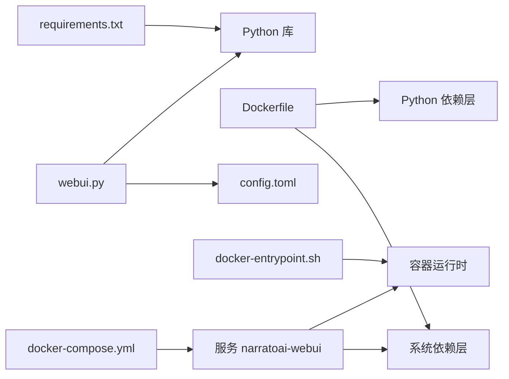

# 安装部署问题

<cite>
**本文引用的文件**   
- [README.md](file://README.md)
- [requirements.txt](file://requirements.txt)
- [Dockerfile](file://Dockerfile)
- [docker-compose.yml](file://docker-compose.yml)
- [deploy-linux.sh](file://deploy-linux.sh)
- [deploy-windows-docker.bat](file://deploy-windows-docker.bat)
- [docker-deploy.sh](file://docker-deploy.sh)
- [docker-entrypoint.sh](file://docker-entrypoint.sh)
- [config.example.toml](file://config.example.toml)
- [webui.py](file://webui.py)
- [Makefile](file://Makefile)
- [app/services/llm/exceptions.py](file://app/services/llm/exceptions.py)
</cite>

## 目录
1. [简介](#简介)
2. [项目结构](#项目结构)
3. [核心组件](#核心组件)
4. [架构总览](#架构总览)
5. [详细组件分析](#详细组件分析)
6. [依赖关系分析](#依赖关系分析)
7. [性能与稳定性考量](#性能与稳定性考量)
8. [故障排除指南](#故障排除指南)
9. [结论](#结论)
10. [附录](#附录)

## 简介
本指南聚焦于 NarratoAI 的安装与部署问题排查，覆盖以下场景：
- Python 环境问题（版本兼容性、依赖冲突）
- pip 安装失败与镜像源问题
- 虚拟环境创建问题
- Docker 部署常见问题（镜像构建失败、容器启动异常、端口冲突、权限问题）
- Windows 与 Linux 平台特定问题
- 依赖包版本冲突的解决思路
- 网络代理设置与离线安装思路
- 错误代码对照与快速修复步骤

## 项目结构
NarratoAI 提供多套安装与部署方式：
- 本地 Python 运行（Streamlit WebUI）
- Docker Compose 一键部署（Linux/macOS/WSL2）
- Windows Docker 一键部署批处理脚本
- Linux 一键部署脚本（含 systemd 服务）

**图表来源**
- [README.md:105-141](file://README.md#L105-L141)
- [requirements.txt:1-39](file://requirements.txt#L1-L39)
- [Dockerfile:1-89](file://Dockerfile#L1-L89)
- [docker-compose.yml:1-30](file://docker-compose.yml#L1-L30)
- [deploy-linux.sh:1-529](file://deploy-linux.sh#L1-L529)
- [deploy-windows-docker.bat:1-372](file://deploy-windows-docker.bat#L1-L372)
- [docker-deploy.sh:1-185](file://docker-deploy.sh#L1-L185)
- [docker-entrypoint.sh:1-145](file://docker-entrypoint.sh#L1-L145)
- [config.example.toml:1-177](file://config.example.toml#L1-L177)
- [webui.py:1-294](file://webui.py#L1-L294)
- [Makefile:1-64](file://Makefile#L1-L64)

**章节来源**
- [README.md:105-141](file://README.md#L105-L141)
- [requirements.txt:1-39](file://requirements.txt#L1-L39)
- [Dockerfile:1-89](file://Dockerfile#L1-L89)
- [docker-compose.yml:1-30](file://docker-compose.yml#L1-L30)
- [deploy-linux.sh:1-529](file://deploy-linux.sh#L1-L529)
- [deploy-windows-docker.bat:1-372](file://deploy-windows-docker.bat#L1-L372)
- [docker-deploy.sh:1-185](file://docker-deploy.sh#L1-L185)
- [docker-entrypoint.sh:1-145](file://docker-entrypoint.sh#L1-L145)
- [config.example.toml:1-177](file://config.example.toml#L1-L177)
- [webui.py:1-294](file://webui.py#L1-L294)
- [Makefile:1-64](file://Makefile#L1-L64)

## 核心组件
- Python 依赖与版本约束：通过 requirements.txt 明确核心库与可选依赖，建议使用 Python 3.12+。
- Docker 镜像与运行时：Dockerfile 使用多阶段构建，分层安装系统依赖与 Python 依赖，并在容器启动时自动安装运行时依赖。
- 配置管理：config.toml 作为运行时配置，支持 LLM/TTS/代理/视频处理等模块。
- WebUI 启动：webui.py 作为 Streamlit 入口，负责页面渲染与任务调度。
- 一键部署脚本：Linux 与 Windows 提供自动化安装、依赖安装、服务管理与健康检查。

**章节来源**
- [requirements.txt:1-39](file://requirements.txt#L1-L39)
- [Dockerfile:1-89](file://Dockerfile#L1-L89)
- [config.example.toml:1-177](file://config.example.toml#L1-L177)
- [webui.py:1-294](file://webui.py#L1-L294)
- [deploy-linux.sh:1-529](file://deploy-linux.sh#L1-L529)
- [deploy-windows-docker.bat:1-372](file://deploy-windows-docker.bat#L1-L372)

## 架构总览
下图展示本地与 Docker 两种部署路径的组件交互：

**图表来源**
- [Dockerfile:1-89](file://Dockerfile#L1-L89)
- [docker-compose.yml:1-30](file://docker-compose.yml#L1-L30)
- [docker-entrypoint.sh:1-145](file://docker-entrypoint.sh#L1-L145)
- [webui.py:1-294](file://webui.py#L1-L294)
- [config.example.toml:1-177](file://config.example.toml#L1-L177)

## 详细组件分析

### Python 依赖与版本兼容性
- 版本要求：项目明确建议使用 Python 3.12+。
- 核心依赖：requests、moviepy、edge-tts、streamlit、watchdog、loguru、tomli/tomli-w、pydub、pysrt、openai、litellm、google-generativeai、azure-cognitiveservices-speech、dashscope、Pillow、tqdm、tenacity 等。
- 可选依赖：faster-whisper、opencv-python、torch/torchvision/torchaudio（按需启用）。

建议：
- 使用 Python 3.12.x，避免低于 3.10 或高于 3.13 的不稳定版本。
- 若遇到依赖冲突，优先锁定兼容版本，或使用隔离虚拟环境。

**章节来源**
- [README.md:146-147](file://README.md#L146-L147)
- [requirements.txt:1-39](file://requirements.txt#L1-L39)

### pip 安装失败与镜像源问题
- Linux 脚本支持通过环境变量切换 pip 镜像源，默认使用官方源，可指定阿里云等镜像。
- Dockerfile 中使用清华镜像源安装依赖，减少网络波动影响。
- 容器启动时入口脚本会尝试 sudo 安装，失败则回退到用户级安装并追加用户 bin 路径。

常见原因与对策：
- 网络不稳定：切换国内镜像源或使用离线包。
- 权限不足：在容器内无需 sudo，若宿主机 pip 失败，使用用户级安装。
- 代理环境：在宿主机配置 HTTP/HTTPS 代理，或在容器内设置环境变量。

**章节来源**
- [deploy-linux.sh:28-50](file://deploy-linux.sh#L28-L50)
- [deploy-linux.sh:242-266](file://deploy-linux.sh#L242-L266)
- [Dockerfile:27](file://Dockerfile#L27)
- [docker-entrypoint.sh:22-42](file://docker-entrypoint.sh#L22-L42)

### 虚拟环境创建问题
- Linux 脚本会检测 Python 3.10–3.13，优先使用 3.12；若缺失则尝试安装。
- venv 创建失败时，脚本会尝试安装对应发行版的 python3-venv 包后再创建。
- 激活虚拟环境后会升级 pip、setuptools、wheel。

排查要点：
- 确认系统已安装 python3-venv（Ubuntu/Debian）或相应包（CentOS/RHEL/Fedora/macOS）。
- 若仍失败，手动创建并激活虚拟环境，再执行依赖安装。

**章节来源**
- [deploy-linux.sh:84-151](file://deploy-linux.sh#L84-L151)
- [deploy-linux.sh:217-244](file://deploy-linux.sh#L217-L244)

### Docker 部署常见问题

#### 镜像构建失败
- 症状：docker compose build 报错，日志显示网络或包安装失败。
- 排查：
  - 检查网络连通性与代理设置。
  - 使用 --no-cache 强制重建。
  - 在宿主机配置镜像源或使用离线包。
- Dockerfile 已内置系统依赖安装与镜像源配置，必要时可调整。

**章节来源**
- [Dockerfile:11-16](file://Dockerfile#L11-L16)
- [Dockerfile:51-62](file://Dockerfile#L51-L62)
- [docker-deploy.sh:81-91](file://docker-deploy.sh#L81-L91)

#### 容器启动异常
- 症状：容器启动后立即退出或健康检查失败。
- 排查：
  - 查看容器日志：docker compose logs -f。
  - 检查端口 8501 是否被占用。
  - 确认 config.toml 是否存在且配置正确。
  - 容器入口脚本会在启动前检查并创建必要目录与配置。

**章节来源**
- [docker-compose.yml:23-29](file://docker-compose.yml#L23-L29)
- [docker-entrypoint.sh:92-113](file://docker-entrypoint.sh#L92-L113)
- [docker-entrypoint.sh:64-90](file://docker-entrypoint.sh#L64-L90)

#### 端口冲突
- 症状：启动失败或健康检查失败。
- 排查：修改 docker-compose.yml 中的 host:container 端口映射，或在宿主机释放 8501 端口。
- 容器入口脚本会检测端口占用并发出警告。

**章节来源**
- [docker-compose.yml:9-11](file://docker-compose.yml#L9-L11)
- [docker-entrypoint.sh:96-101](file://docker-entrypoint.sh#L96-L101)

#### 权限问题
- 症状：FFmpeg/ImageMagick 策略限制导致图片处理失败。
- 排查：Dockerfile 已修复 ImageMagick 策略；Linux 脚本也会尝试修复策略文件。
- 容器内使用非 root 用户运行，确保挂载卷权限正确。

**章节来源**
- [Dockerfile:59](file://Dockerfile#L59)
- [deploy-linux.sh:210-214](file://deploy-linux.sh#L210-L214)
- [Dockerfile:61-75](file://Dockerfile#L61-L75)

### Windows 与 Linux 平台特定问题

#### Windows Docker 一键脚本
- 前置要求：Docker Desktop、WSL2 后端、Docker Compose 可用。
- 自动检查 Docker 与 Compose 状态，尝试启动 Docker Desktop。
- 支持 stop/status/logs/restart/rebuild 等子命令。

**章节来源**
- [deploy-windows-docker.bat:48-75](file://deploy-windows-docker.bat#L48-L75)
- [deploy-windows-docker.bat:77-142](file://deploy-windows-docker.bat#L77-L142)
- [deploy-windows-docker.bat:193-207](file://deploy-windows-docker.bat#L193-L207)

#### Linux 一键脚本
- 自动检测 OS、安装系统依赖（FFmpeg、ImageMagick、git-lfs 等）。
- 创建并激活虚拟环境，安装 Python 依赖，生成 systemd 服务文件。
- 支持 run/stop/status 模式与环境变量定制。

**章节来源**
- [deploy-linux.sh:66-81](file://deploy-linux.sh#L66-L81)
- [deploy-linux.sh:153-215](file://deploy-linux.sh#L153-L215)
- [deploy-linux.sh:306-347](file://deploy-linux.sh#L306-L347)
- [deploy-linux.sh:422-457](file://deploy-linux.sh#L422-L457)

### 依赖包版本冲突的解决方法
- 使用隔离虚拟环境，避免系统级包污染。
- 固定关键依赖版本，避免 pip 自动升级破坏兼容性。
- 在容器内优先使用用户级安装，避免权限问题。
- 对于可选依赖（如 opencv、torch），按需启用，减少冲突面。

**章节来源**
- [requirements.txt:28-39](file://requirements.txt#L28-L39)
- [docker-entrypoint.sh:33-42](file://docker-entrypoint.sh#L33-L42)

### 网络代理设置与离线安装
- 代理设置：config.toml 的 proxy 节点提供 HTTP/HTTPS 代理开关与地址；也可在宿主机设置系统代理。
- 离线安装：准备 requirements.txt 对应的 whl/tar.gz 包，使用 pip install -f/--find-links 指向本地路径；Dockerfile 中可替换镜像源为内网镜像。

**章节来源**
- [config.example.toml:160-166](file://config.example.toml#L160-L166)
- [Dockerfile:27](file://Dockerfile#L27)

## 依赖关系分析

**图表来源**
- [requirements.txt:1-39](file://requirements.txt#L1-L39)
- [Dockerfile:1-89](file://Dockerfile#L1-L89)
- [docker-compose.yml:1-30](file://docker-compose.yml#L1-L30)
- [docker-entrypoint.sh:1-145](file://docker-entrypoint.sh#L1-L145)
- [webui.py:1-294](file://webui.py#L1-L294)
- [config.example.toml:1-177](file://config.example.toml#L1-L177)

**章节来源**
- [requirements.txt:1-39](file://requirements.txt#L1-L39)
- [Dockerfile:1-89](file://Dockerfile#L1-L89)
- [docker-compose.yml:1-30](file://docker-compose.yml#L1-L30)
- [docker-entrypoint.sh:1-145](file://docker-entrypoint.sh#L1-L145)
- [webui.py:1-294](file://webui.py#L1-L294)
- [config.example.toml:1-177](file://config.example.toml#L1-L177)

## 性能与稳定性考量
- 端口与上传大小：WebUI 启动参数包含 server.maxUploadSize，合理设置可避免大文件上传失败。
- 日志级别：默认 INFO，可按需调整；容器入口脚本会记录依赖安装与健康检查状态。
- 健康检查：Compose 与 Dockerfile 均配置健康检查，便于自动化运维。

**章节来源**
- [webui.py:104-110](file://webui.py#L104-L110)
- [docker-entrypoint.sh:130-140](file://docker-entrypoint.sh#L130-L140)
- [docker-compose.yml:23-29](file://docker-compose.yml#L23-L29)
- [Dockerfile:83-85](file://Dockerfile#L83-L85)

## 故障排除指南

### 通用排查步骤
- 确认 Python 版本满足要求（3.12+）。
- 确认系统依赖（FFmpeg、ImageMagick、git-lfs）已安装。
- 确认 config.toml 存在并完成必要配置。
- 查看日志定位具体错误位置。

**章节来源**
- [README.md:146-147](file://README.md#L146-L147)
- [deploy-linux.sh:202-208](file://deploy-linux.sh#L202-L208)
- [config.example.toml:1-177](file://config.example.toml#L1-L177)

### Python 环境问题
- 症状：import 报错、版本不兼容。
- 处理：
  - 使用 Python 3.12.x。
  - 在隔离虚拟环境中安装依赖。
  - 如遇依赖冲突，固定版本或删除冲突包后重装。

**章节来源**
- [requirements.txt:1-39](file://requirements.txt#L1-L39)
- [deploy-linux.sh:84-151](file://deploy-linux.sh#L84-L151)

### pip 安装失败
- 症状：安装中断、超时、包冲突。
- 处理：
  - 切换镜像源（Linux 脚本支持 PIP_MIRROR）。
  - 使用 --no-cache-dir。
  - 容器内回退到用户级安装（~/.local/bin）。

**章节来源**
- [deploy-linux.sh:242-266](file://deploy-linux.sh#L242-L266)
- [Dockerfile:27](file://Dockerfile#L27)
- [docker-entrypoint.sh:22-42](file://docker-entrypoint.sh#L22-L42)

### 虚拟环境创建失败
- 症状：venv 创建失败、找不到 python3-venv。
- 处理：
  - 安装发行版对应的 python3-venv 包。
  - 手动创建并激活虚拟环境后重试。

**章节来源**
- [deploy-linux.sh:224-236](file://deploy-linux.sh#L224-L236)

### Docker 镜像构建失败
- 症状：apt/pip 安装失败、网络超时。
- 处理：
  - 使用 --no-cache。
  - 配置代理或更换镜像源。
  - 离线环境下准备依赖包并使用 -f/--find-links。

**章节来源**
- [docker-deploy.sh:81-91](file://docker-deploy.sh#L81-L91)
- [Dockerfile:27](file://Dockerfile#L27)

### 容器启动异常
- 症状：容器退出、健康检查失败。
- 处理：
  - docker compose logs -f 查看日志。
  - 检查端口占用与 config.toml。
  - 重新构建镜像并启动。

**章节来源**
- [docker-compose.yml:23-29](file://docker-compose.yml#L23-L29)
- [docker-entrypoint.sh:92-113](file://docker-entrypoint.sh#L92-L113)

### 端口冲突
- 症状：服务无法启动或访问失败。
- 处理：
  - 修改 docker-compose.yml 端口映射。
  - 释放宿主机 8501 端口。

**章节来源**
- [docker-compose.yml:9-11](file://docker-compose.yml#L9-L11)
- [docker-entrypoint.sh:96-101](file://docker-entrypoint.sh#L96-L101)

### 权限问题
- 症状：图片处理失败、写入权限不足。
- 处理：
  - Dockerfile 已修复 ImageMagick 策略。
  - Linux 脚本尝试修复策略文件。
  - 容器内非 root 用户运行，确保卷权限正确。

**章节来源**
- [Dockerfile:59](file://Dockerfile#L59)
- [deploy-linux.sh:210-214](file://deploy-linux.sh#L210-L214)
- [Dockerfile:61-75](file://Dockerfile#L61-L75)

### Windows 平台问题
- 症状：Docker Desktop 未运行、Compose 不可用。
- 处理：
  - 按脚本提示安装并启用 WSL2。
  - 确保 Docker Desktop 启动后再执行部署。

**章节来源**
- [deploy-windows-docker.bat:77-142](file://deploy-windows-docker.bat#L77-L142)

### Linux 平台问题
- 症状：系统包安装失败、FFmpeg 未就绪。
- 处理：
  - 检查发行版仓库可用性。
  - 手动安装 FFmpeg 与 ImageMagick。
  - 使用 systemd 服务实现开机自启。

**章节来源**
- [deploy-linux.sh:153-215](file://deploy-linux.sh#L153-L215)
- [deploy-linux.sh:306-347](file://deploy-linux.sh#L306-L347)

### LLM/TTS 配置相关错误
- 症状：API 密钥无效、模型不支持、速率限制。
- 处理：
  - 按 config.toml 提示配置各提供商密钥与模型名称。
  - 使用 LiteLLM 统一接口，避免多 Provider 适配复杂度。
  - 遇到速率限制，等待冷却或降低并发。

**章节来源**
- [config.example.toml:23-64](file://config.example.toml#L23-L64)
- [config.example.toml:93-138](file://config.example.toml#L93-L138)
- [app/services/llm/exceptions.py:111-118](file://app/services/llm/exceptions.py#L111-L118)

### 错误代码对照与快速修复步骤
- 常见错误类型与含义（基于异常定义）：
  - PROVIDER_NOT_FOUND：供应商未找到，检查供应商名称与可用性。
  - CONFIGURATION_ERROR：配置错误，检查 config.toml 对应键值。
  - API_CALL_ERROR：API 调用失败，检查密钥、URL、网络。
  - VALIDATION_ERROR：输出验证失败，检查输入数据格式。
  - MODEL_NOT_SUPPORTED：模型不被供应商支持，更换模型或供应商。
  - RATE_LIMIT_ERROR：频率限制，等待冷却或降低请求频率。
  - AUTHENTICATION_ERROR：认证失败，检查密钥有效性。
  - CONTENT_FILTER_ERROR：内容被过滤，检查敏感词或合规设置。

快速修复步骤（示例）：
- 供应商未找到：确认供应商名称拼写与可用列表一致。
- 配置错误：核对 config.toml 中对应字段，确保非空。
- API 调用失败：检查网络连通性与代理设置，重试请求。
- 输出验证失败：缩小输入范围，逐步定位问题字段。
- 模型不支持：切换至供应商支持的模型或更换供应商。
- 速率限制：增加延时或降低并发，或升级账户额度。
- 认证失败：重新申请密钥并更新配置。
- 内容过滤：去除敏感内容或调整过滤策略。

**章节来源**
- [app/services/llm/exceptions.py:11-118](file://app/services/llm/exceptions.py#L11-L118)

## 结论
通过统一的依赖清单、容器化部署与一键脚本，NarratoAI 在不同平台提供了较为稳定的安装与运行路径。遇到问题时，建议按“环境—依赖—配置—日志”的顺序逐层排查，并结合本文提供的快速修复步骤与错误对照表定位根因。

## 附录

### 安装与部署命令速查
- 本地运行（Streamlit）：pip 安装依赖后，复制并编辑 config.toml，使用 streamlit 运行 webui.py。
- Docker Compose：docker compose up -d 启动，访问 http://localhost:8501。
- Linux 一键脚本：./deploy-linux.sh（完整安装），./deploy-linux.sh run（启动），./deploy-linux.sh stop/status。
- Windows Docker 一键脚本：双击运行或执行 deploy-windows-docker.bat（支持 stop/status/logs/restart/rebuild）。
- Makefile：make deploy/build/up/down/restart/logs/shell/ps/clean/config。

**章节来源**
- [README.md:123-141](file://README.md#L123-L141)
- [docker-compose.yml:1-30](file://docker-compose.yml#L1-L30)
- [deploy-linux.sh:459-529](file://deploy-linux.sh#L459-L529)
- [deploy-windows-docker.bat:341-372](file://deploy-windows-docker.bat#L341-L372)
- [Makefile:17-64](file://Makefile#L17-L64)