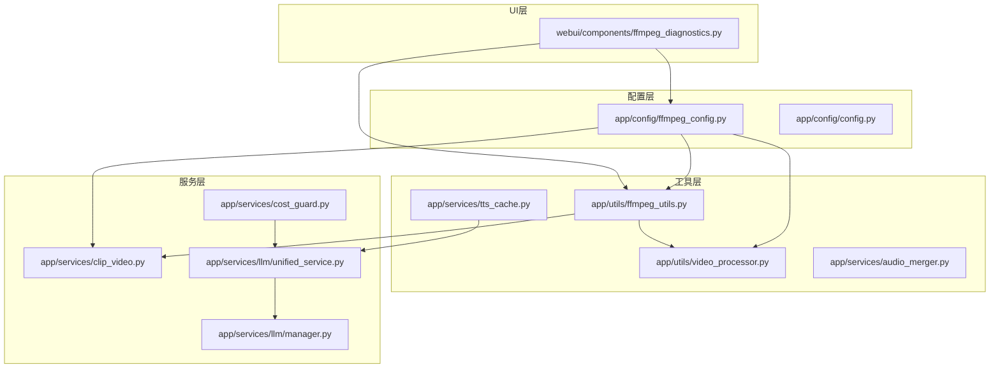
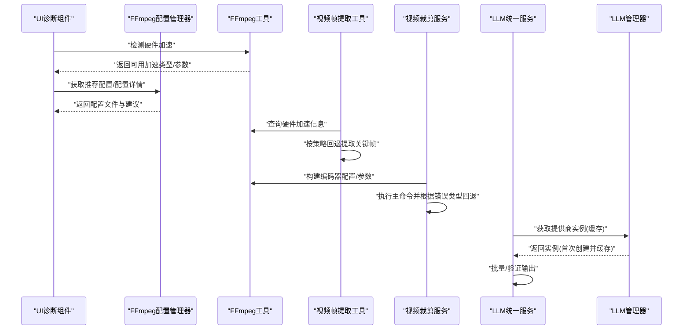
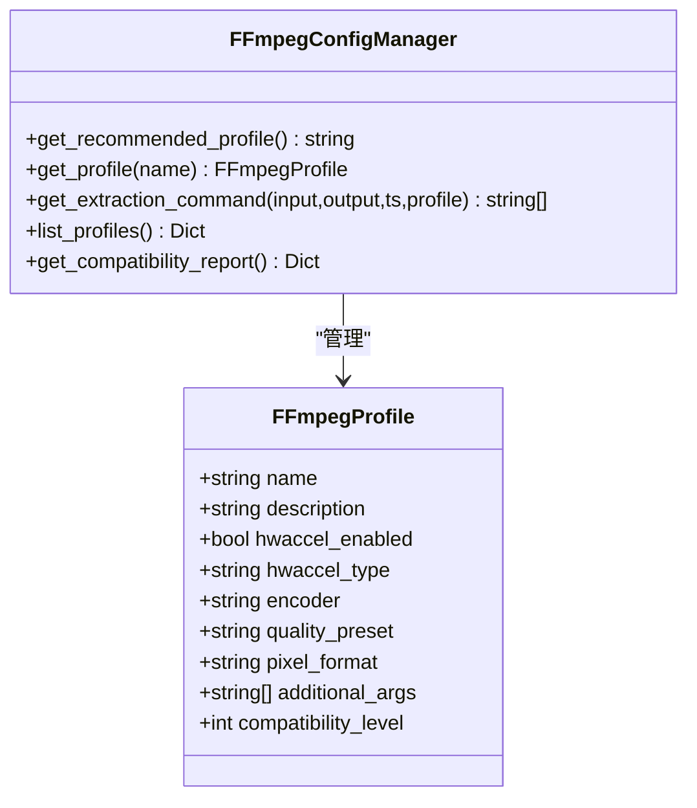
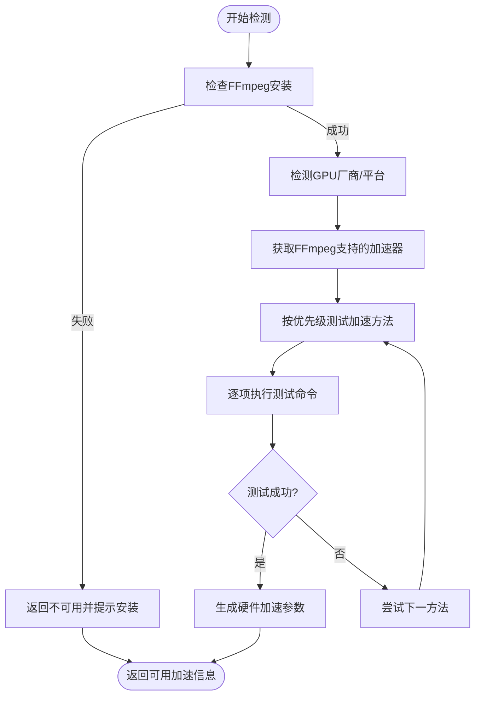
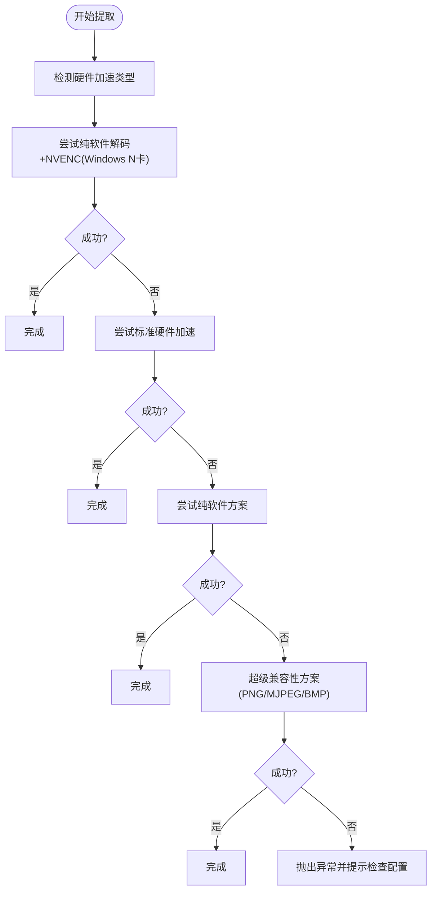
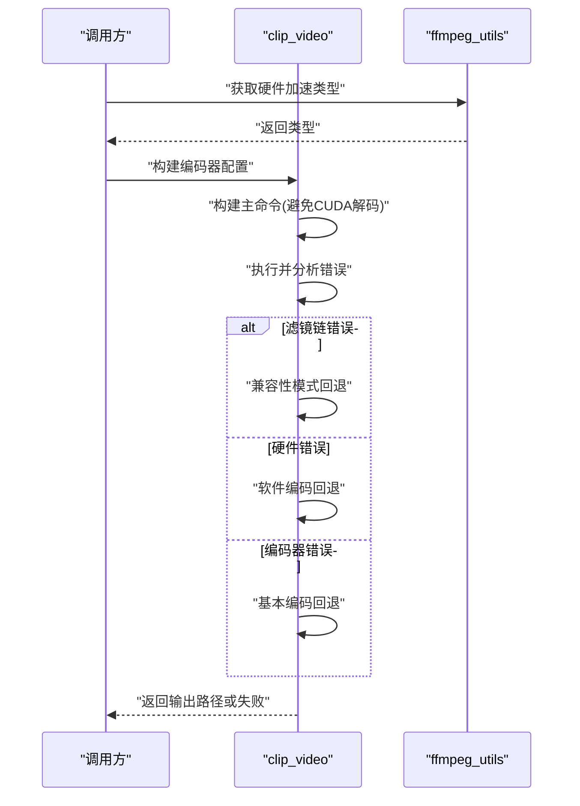
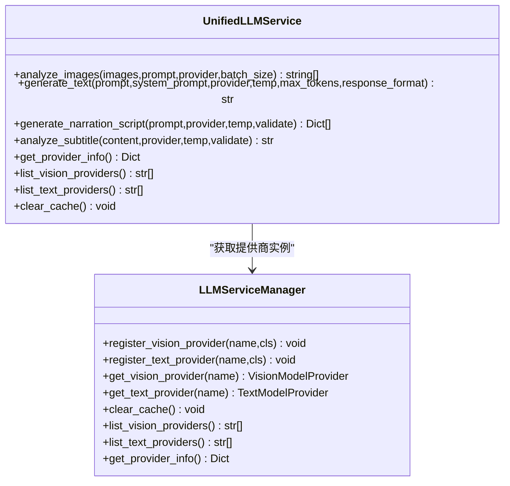
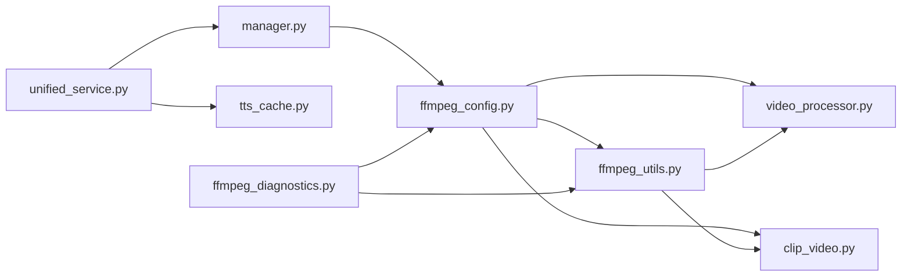

# 性能问题

<cite>
**本文引用的文件**
- [app/config/ffmpeg_config.py](file://app/config/ffmpeg_config.py)
- [app/utils/ffmpeg_utils.py](file://app/utils/ffmpeg_utils.py)
- [app/utils/video_processor.py](file://app/utils/video_processor.py)
- [app/services/clip_video.py](file://app/services/clip_video.py)
- [webui/components/ffmpeg_diagnostics.py](file://webui/components/ffmpeg_diagnostics.py)
- [app/services/llm/unified_service.py](file://app/services/llm/unified_service.py)
- [app/services/llm/manager.py](file://app/services/llm/manager.py)
- [app/services/tts_cache.py](file://app/services/tts_cache.py)
- [app/services/cost_guard.py](file://app/services/cost_guard.py)
- [app/services/audio_merger.py](file://app/services/audio_merger.py)
- [app/config/config.py](file://app/config/config.py)
</cite>

## 目录
1. [简介](#简介)
2. [项目结构](#项目结构)
3. [核心组件](#核心组件)
4. [架构总览](#架构总览)
5. [详细组件分析](#详细组件分析)
6. [依赖分析](#依赖分析)
7. [性能考量](#性能考量)
8. [故障排除指南](#故障排除指南)
9. [结论](#结论)
10. [附录](#附录)

## 简介
本指南聚焦于NarratoAI在视频处理与大模型调用场景下的性能问题诊断与优化。内容覆盖CPU使用率过高、内存泄漏、磁盘I/O瓶颈的识别与缓解；FFmpeg性能优化（硬件加速、编解码器选择、并发策略）；LLM调用优化（批处理、缓存、成本控制）；视频处理调优（分辨率/帧率/压缩参数）；以及性能监控、基准测试与回归检测方法。文档同时给出资源使用最佳实践与容量规划建议。

## 项目结构
NarratoAI采用“配置-工具-服务-UI”分层组织，关键性能相关模块集中在：
- 配置层：FFmpeg配置管理与全局配置加载
- 工具层：FFmpeg硬件加速检测、视频帧提取、TTS缓存与音频合并
- 服务层：视频裁剪、LLM统一服务、成本控制
- UI层：FFmpeg诊断与配置组件

**图表来源**
- [app/config/ffmpeg_config.py:27-158](file://app/config/ffmpeg_config.py#L27-L158)
- [app/utils/ffmpeg_utils.py:252-356](file://app/utils/ffmpeg_utils.py#L252-L356)
- [app/utils/video_processor.py:26-44](file://app/utils/video_processor.py#L26-L44)
- [app/services/clip_video.py:143-228](file://app/services/clip_video.py#L143-L228)
- [webui/components/ffmpeg_diagnostics.py:20-108](file://webui/components/ffmpeg_diagnostics.py#L20-L108)

**章节来源**
- [app/config/ffmpeg_config.py:27-158](file://app/config/ffmpeg_config.py#L27-L158)
- [app/utils/ffmpeg_utils.py:252-356](file://app/utils/ffmpeg_utils.py#L252-L356)
- [app/utils/video_processor.py:26-44](file://app/utils/video_processor.py#L26-L44)
- [app/services/clip_video.py:143-228](file://app/services/clip_video.py#L143-L228)
- [webui/components/ffmpeg_diagnostics.py:20-108](file://webui/components/ffmpeg_diagnostics.py#L20-L108)

## 核心组件
- FFmpeg配置管理器：提供多档位配置文件（高性能/兼容性/Windows NVIDIA/macOS VideoToolbox/通用软件），自动推荐并生成命令。
- FFmpeg硬件加速检测：跨平台检测GPU厂商、编码器可用性、硬件加速参数，支持降级与回退。
- 视频帧提取工具：按时间间隔提取关键帧，内置多策略回退（纯软解+NVENC、硬件加速、软件方案、超级兼容性）。
- 视频裁剪服务：基于OST类型统一裁剪策略，避免滤镜链错误，提供多级回退。
- LLM统一服务与管理器：统一文本/视觉模型调用入口，支持批处理、缓存与提供商实例缓存。
- TTS缓存：按文本+语音参数构建缓存键，命中即复制音频/字幕，显著减少重复生成。
- 成本控制：估算视觉token与成本，按场景分布限制帧数，平衡质量与成本。
- 音频合并：基于脚本时间轴叠加TTS音频，保障时序与总时长。
- UI诊断组件：展示FFmpeg状态、硬件加速信息、推荐配置与故障排除。

**章节来源**
- [app/config/ffmpeg_config.py:27-158](file://app/config/ffmpeg_config.py#L27-L158)
- [app/utils/ffmpeg_utils.py:252-356](file://app/utils/ffmpeg_utils.py#L252-L356)
- [app/utils/video_processor.py:89-187](file://app/utils/video_processor.py#L89-L187)
- [app/services/clip_video.py:143-228](file://app/services/clip_video.py#L143-L228)
- [app/services/llm/unified_service.py:20-160](file://app/services/llm/unified_service.py#L20-L160)
- [app/services/llm/manager.py:15-135](file://app/services/llm/manager.py#L15-L135)
- [app/services/tts_cache.py:24-95](file://app/services/tts_cache.py#L24-L95)
- [app/services/cost_guard.py:13-98](file://app/services/cost_guard.py#L13-L98)
- [app/services/audio_merger.py:21-77](file://app/services/audio_merger.py#L21-L77)
- [webui/components/ffmpeg_diagnostics.py:20-108](file://webui/components/ffmpeg_diagnostics.py#L20-L108)

## 架构总览
下图展示性能相关模块之间的交互与数据流，重点体现FFmpeg硬件加速检测、配置生成、视频处理与LLM调用的关键路径。

**图表来源**
- [webui/components/ffmpeg_diagnostics.py:20-108](file://webui/components/ffmpeg_diagnostics.py#L20-L108)
- [app/config/ffmpeg_config.py:98-158](file://app/config/ffmpeg_config.py#L98-L158)
- [app/utils/ffmpeg_utils.py:252-356](file://app/utils/ffmpeg_utils.py#L252-L356)
- [app/utils/video_processor.py:89-187](file://app/utils/video_processor.py#L89-L187)
- [app/services/clip_video.py:230-302](file://app/services/clip_video.py#L230-L302)
- [app/services/llm/unified_service.py:20-160](file://app/services/llm/unified_service.py#L20-L160)
- [app/services/llm/manager.py:69-135](file://app/services/llm/manager.py#L69-L135)

## 详细组件分析

### FFmpeg配置与硬件加速
- 配置文件档位：高性能、兼容性、Windows NVIDIA、macOS VideoToolbox、通用软件。每档包含硬件加速开关、编码器、质量预设、像素格式与附加参数。
- 推荐策略：按平台与GPU厂商自动选择；若检测不到硬件加速，则回退到软件编码并提示更新驱动。
- 命令生成：根据配置拼接硬件加速参数、编码器、质量参数与像素格式，确保跨平台兼容。

**图表来源**
- [app/config/ffmpeg_config.py:13-96](file://app/config/ffmpeg_config.py#L13-L96)
- [app/config/ffmpeg_config.py:98-158](file://app/config/ffmpeg_config.py#L98-L158)

**章节来源**
- [app/config/ffmpeg_config.py:27-158](file://app/config/ffmpeg_config.py#L27-L158)

### FFmpeg硬件加速检测与回退
- 检测流程：安装检查→平台/GPU厂商识别→FFmpeg支持列表→按优先级逐一测试→记录可用加速类型与编码器→生成参数。
- 回退策略：若CUDA硬件解码导致滤镜链错误，优先纯NVENC编码器；否则尝试软件编码或基本编码。
- UI诊断：展示系统信息、FFmpeg状态、硬件加速详情与推荐配置，支持强制禁用硬件加速与重置检测。

**图表来源**
- [app/utils/ffmpeg_utils.py:252-356](file://app/utils/ffmpeg_utils.py#L252-L356)
- [webui/components/ffmpeg_diagnostics.py:20-108](file://webui/components/ffmpeg_diagnostics.py#L20-L108)

**章节来源**
- [app/utils/ffmpeg_utils.py:183-356](file://app/utils/ffmpeg_utils.py#L183-L356)
- [webui/components/ffmpeg_diagnostics.py:20-108](file://webui/components/ffmpeg_diagnostics.py#L20-L108)

### 视频帧提取与关键帧提取
- 功能：按固定时间间隔提取关键帧，支持硬件加速与多策略回退。
- 策略顺序：纯软件解码+NVENC（Windows N卡兼容性优先）、标准硬件加速、纯软件、超级兼容性（PNG→JPG/MJPEG/BMP）。
- 错误处理：超时/子进程异常均回退，最终失败时抛出异常并提示检查配置。

**图表来源**
- [app/utils/video_processor.py:188-220](file://app/utils/video_processor.py#L188-L220)
- [app/utils/video_processor.py:495-585](file://app/utils/video_processor.py#L495-L585)

**章节来源**
- [app/utils/video_processor.py:89-187](file://app/utils/video_processor.py#L89-L187)
- [app/utils/video_processor.py:188-220](file://app/utils/video_processor.py#L188-L220)
- [app/utils/video_processor.py:495-585](file://app/utils/video_processor.py#L495-L585)

### 视频裁剪与滤镜链兼容性
- 统一策略：根据OST类型（0=纯解说、1=纯原声、2=混合）分别处理，避免二次裁剪与时长不一致。
- 关键优化：视频裁剪场景避免CUDA硬件解码，改用纯NVENC编码器，消除滤镜链格式转换错误。
- 回退机制：按错误类型（滤镜链/硬件/编码器/文件）选择兼容性模式、软件编码或基本编码。

**图表来源**
- [app/services/clip_video.py:143-228](file://app/services/clip_video.py#L143-L228)
- [app/services/clip_video.py:230-302](file://app/services/clip_video.py#L230-L302)
- [app/services/clip_video.py:345-384](file://app/services/clip_video.py#L345-L384)

**章节来源**
- [app/services/clip_video.py:143-228](file://app/services/clip_video.py#L143-L228)
- [app/services/clip_video.py:230-302](file://app/services/clip_video.py#L230-L302)
- [app/services/clip_video.py:345-384](file://app/services/clip_video.py#L345-L384)

### LLM调用与缓存优化
- 统一入口：UnifiedLLMService封装图片分析、文本生成、解说文案生成与字幕分析，统一错误处理。
- 管理器：LLMServiceManager负责提供商注册、实例缓存与配置读取，避免重复初始化。
- 批处理与缓存：统一服务支持批量图片分析；TTS缓存按文本+语音参数生成稳定键，命中即复制音频/字幕。
- 成本控制：估算视觉token与成本，按场景分布限制帧数，兼顾质量与成本。

**图表来源**
- [app/services/llm/unified_service.py:20-160](file://app/services/llm/unified_service.py#L20-L160)
- [app/services/llm/manager.py:15-135](file://app/services/llm/manager.py#L15-L135)

**章节来源**
- [app/services/llm/unified_service.py:20-160](file://app/services/llm/unified_service.py#L20-L160)
- [app/services/llm/manager.py:69-135](file://app/services/llm/manager.py#L69-L135)
- [app/services/tts_cache.py:24-95](file://app/services/tts_cache.py#L24-L95)
- [app/services/cost_guard.py:13-98](file://app/services/cost_guard.py#L13-L98)

### 音频合并与时序对齐
- 合并策略：基于脚本片段的duration字段，将各TTS音频按时间轴叠加，形成连续音频。
- FFmpeg前置检查：若未安装FFmpeg则直接报错，避免后续失败。
- 时间戳解析：支持多种时间格式，确保起止时间准确转换。

**章节来源**
- [app/services/audio_merger.py:21-77](file://app/services/audio_merger.py#L21-L77)

## 依赖分析
- 配置与工具：FFmpeg配置管理器依赖工具层的硬件加速检测；视频处理与裁剪均依赖工具层的检测与参数生成。
- LLM链路：统一服务依赖管理器获取提供商实例，管理器从配置读取API密钥与模型名，统一服务负责批处理与输出验证。
- UI诊断：依赖配置与工具模块，展示FFmpeg状态、推荐配置与故障排除。

**图表来源**
- [app/config/ffmpeg_config.py:27-158](file://app/config/ffmpeg_config.py#L27-L158)
- [app/utils/ffmpeg_utils.py:252-356](file://app/utils/ffmpeg_utils.py#L252-L356)
- [app/utils/video_processor.py:26-44](file://app/utils/video_processor.py#L26-L44)
- [app/services/clip_video.py:143-228](file://app/services/clip_video.py#L143-L228)
- [app/services/llm/unified_service.py:20-160](file://app/services/llm/unified_service.py#L20-L160)
- [app/services/llm/manager.py:15-135](file://app/services/llm/manager.py#L15-L135)
- [app/services/tts_cache.py:24-95](file://app/services/tts_cache.py#L24-L95)
- [webui/components/ffmpeg_diagnostics.py:20-108](file://webui/components/ffmpeg_diagnostics.py#L20-L108)

**章节来源**
- [app/config/ffmpeg_config.py:27-158](file://app/config/ffmpeg_config.py#L27-L158)
- [app/utils/ffmpeg_utils.py:252-356](file://app/utils/ffmpeg_utils.py#L252-L356)
- [app/utils/video_processor.py:26-44](file://app/utils/video_processor.py#L26-L44)
- [app/services/clip_video.py:143-228](file://app/services/clip_video.py#L143-L228)
- [app/services/llm/unified_service.py:20-160](file://app/services/llm/unified_service.py#L20-L160)
- [app/services/llm/manager.py:15-135](file://app/services/llm/manager.py#L15-L135)
- [app/services/tts_cache.py:24-95](file://app/services/tts_cache.py#L24-L95)
- [webui/components/ffmpeg_diagnostics.py:20-108](file://webui/components/ffmpeg_diagnostics.py#L20-L108)

## 性能考量
- CPU使用率过高
  - 优先启用硬件加速（NVENC/AMF/QSV/VideoToolbox），避免纯软件编码。
  - 视频裁剪避免CUDA硬件解码，改用纯NVENC编码器，减少滤镜链转换开销。
  - 关键帧提取采用多策略回退，失败时自动切换至兼容性更强的方案。
- 内存泄漏
  - 视频处理与LLM调用均使用一次性子进程执行，结束后释放资源；建议在上层调用完成后及时清理中间文件与缓存。
  - TTS缓存命中后直接复制文件，避免重复生成与内存占用。
- 磁盘I/O瓶颈
  - 关键帧提取与视频裁剪输出路径明确，建议使用SSD存储；合并音频前检查FFmpeg安装，避免多次失败重试。
  - 成本控制模块限制帧数，减少不必要的视觉token与文件生成。

[本节为通用指导，无需具体文件分析]

## 故障排除指南
- 关键帧提取失败（滤镜链错误）
  - 使用兼容性配置或Windows NVIDIA优化配置；强制禁用硬件加速；更新显卡驱动。
- 硬件加速不可用
  - 更新驱动；NVIDIA安装CUDA工具包；AMD安装AMD Media SDK；使用软件编码作为备用。
- 处理速度慢
  - 启用硬件加速；选择高性能配置；降低质量设置；增加关键帧提取间隔；关闭占用GPU的程序。
- 文件权限问题
  - 确保输出目录有写入权限；以管理员身份运行（Windows）；检查磁盘空间；避免使用包含特殊字符的文件路径。

**章节来源**
- [webui/components/ffmpeg_diagnostics.py:201-260](file://webui/components/ffmpeg_diagnostics.py#L201-L260)

## 结论
通过系统化的FFmpeg配置与硬件加速检测、多策略回退的视频处理、统一的LLM调用与缓存、成本控制与音频合并优化，NarratoAI能够在不同硬件环境下实现稳定且高性能的视频与文本处理。建议在生产环境中结合UI诊断组件定期评估硬件加速状态，按需调整配置与批处理策略，以获得最佳性能与成本平衡。

[本节为总结，无需具体文件分析]

## 附录
- 性能监控与基准测试
  - 使用系统自带的CPU/内存/磁盘监控工具观察关键阶段（帧提取、视频裁剪、LLM调用、音频合并）的资源占用。
  - 基准测试：固定视频集与脚本，记录各阶段耗时与资源曲线，建立回归基线。
- 性能回归检测
  - 将关键测试用例纳入CI，对比前后版本的耗时与资源指标，发现异常立即告警。
- 资源使用最佳实践
  - 优先使用硬件加速；合理设置FFmpeg质量参数；控制帧数与分辨率；利用缓存与批处理；及时清理中间文件。
- 容量规划建议
  - 依据峰值并发与平均时长估算CPU/内存/磁盘吞吐；为硬件加速预留额外资源；为LLM调用预留网络与令牌预算。

[本节为通用指导，无需具体文件分析]