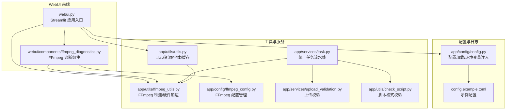
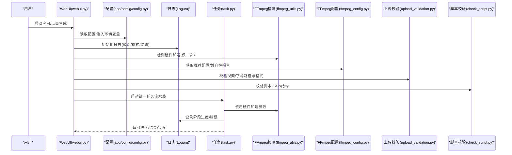
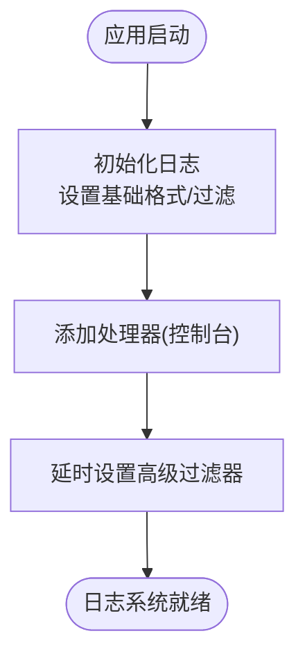
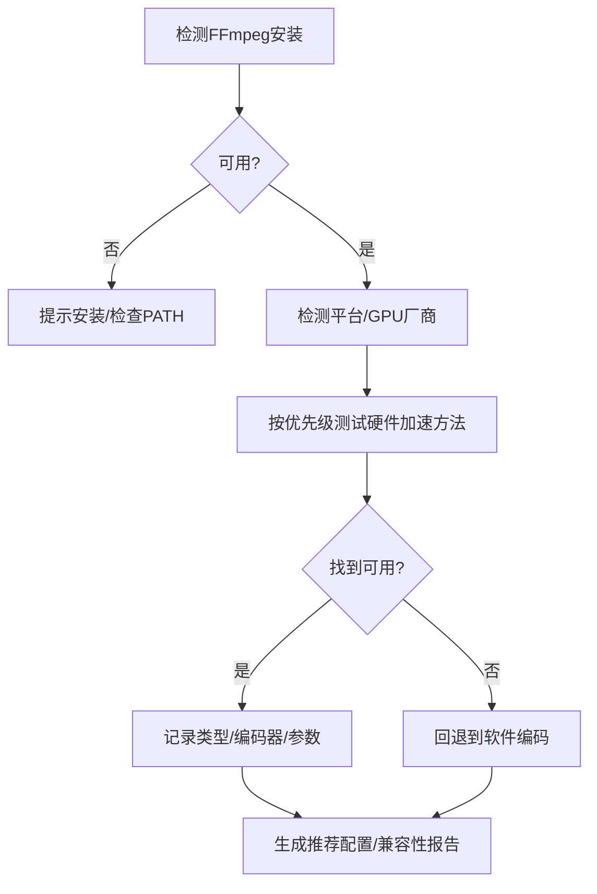
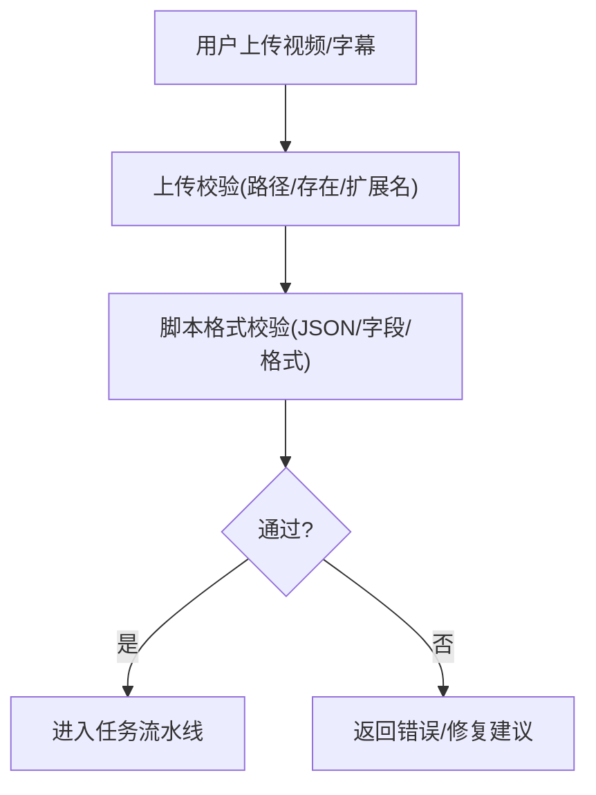
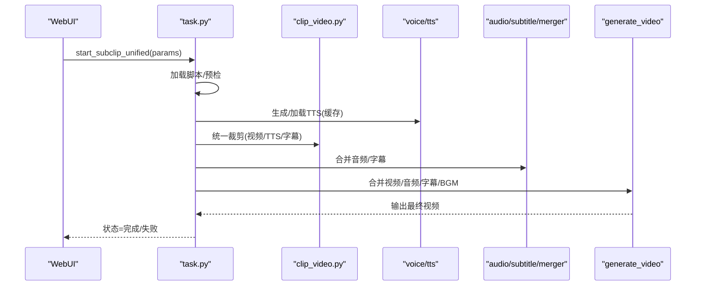
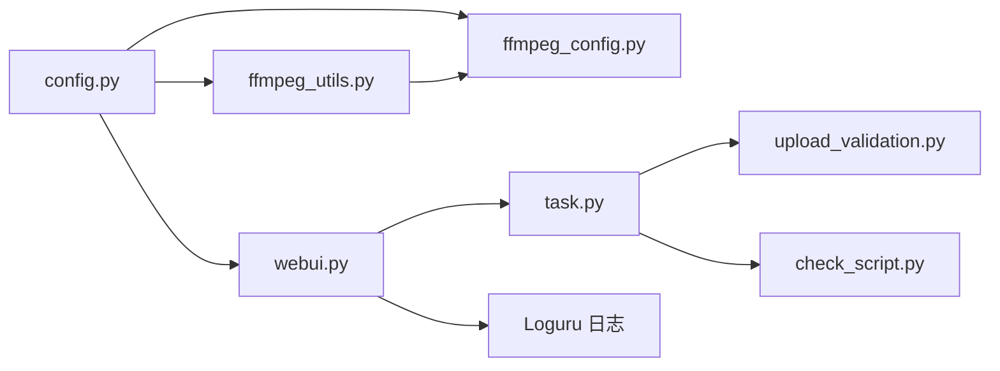

# 故障排除

<cite>
**本文引用的文件**
- [README.md](file://README.md)
- [webui.py](file://webui.py)
- [app/config/config.py](file://app/config/config.py)
- [config.example.toml](file://config.example.toml)
- [app/utils/ffmpeg_utils.py](file://app/utils/ffmpeg_utils.py)
- [app/config/ffmpeg_config.py](file://app/config/ffmpeg_config.py)
- [webui/components/ffmpeg_diagnostics.py](file://webui/components/ffmpeg_diagnostics.py)
- [app/services/upload_validation.py](file://app/services/upload_validation.py)
- [app/services/task.py](file://app/services/task.py)
- [app/utils/check_script.py](file://app/utils/check_script.py)
- [app/models/exception.py](file://app/models/exception.py)
- [app/utils/utils.py](file://app/utils/utils.py)
- [webui/tools/generate_script_short.py](file://webui/tools/generate_script_short.py)
- [deploy-windows-docker.bat](file://deploy-windows-docker.bat)
</cite>

## 目录
1. [简介](#简介)
2. [项目结构](#项目结构)
3. [核心组件](#核心组件)
4. [架构总览](#架构总览)
5. [详细组件分析](#详细组件分析)
6. [依赖分析](#依赖分析)
7. [性能考虑](#性能考虑)
8. [故障排除指南](#故障排除指南)
9. [结论](#结论)
10. [附录](#附录)

## 简介
本指南面向使用 NarratoAI 的用户与运维人员，聚焦于安装部署、配置校验、运行异常、日志分析、性能诊断、FFmpeg 故障排除、网络连接问题、用户上传问题以及紧急情况处理与数据恢复。文档结合代码中的日志体系、配置加载机制、FFmpeg 检测与配置、上传校验与脚本校验等模块，提供可操作的排障步骤与建议。

## 项目结构
NarratoAI 采用前后端分离的 WebUI 架构，前端基于 Streamlit，后端由 Python 服务与若干业务服务组成。关键目录与职责概览：
- app/config：配置加载与环境变量注入（含 FFmpeg 路径、日志级别等）
- app/utils：通用工具（日志、资源初始化、FFmpeg 检测、脚本解析等）
- app/services：业务服务（任务编排、视频裁剪、音频/字幕合并、TTS、LLM 等）
- webui：Streamlit 前端界面与组件（设置面板、诊断页面、工具入口）
- resource：公共资源（字体、视频、字幕等）
- storage：运行期产物（任务、临时文件、缓存）

图表来源
- [webui.py:227-294](file://webui.py#L227-L294)
- [app/config/config.py:24-95](file://app/config/config.py#L24-L95)
- [app/utils/ffmpeg_utils.py:118-355](file://app/utils/ffmpeg_utils.py#L118-L355)
- [app/config/ffmpeg_config.py:27-140](file://app/config/ffmpeg_config.py#L27-L140)
- [webui/components/ffmpeg_diagnostics.py:20-108](file://webui/components/ffmpeg_diagnostics.py#L20-L108)
- [app/services/task.py:195-247](file://app/services/task.py#L195-L247)
- [app/services/upload_validation.py:21-61](file://app/services/upload_validation.py#L21-L61)
- [app/utils/check_script.py:5-111](file://app/utils/check_script.py#L5-L111)

章节来源
- [README.md:105-141](file://README.md#L105-L141)
- [webui.py:227-294](file://webui.py#L227-L294)
- [app/config/config.py:24-95](file://app/config/config.py#L24-L95)

## 核心组件
- 配置加载与环境注入：负责读取配置文件、注入 FFmpeg 路径、设置日志级别与监听地址。
- 日志系统：统一使用 Loguru，提供格式化输出、过滤噪声、控制台输出与延迟高级过滤。
- FFmpeg 检测与配置：自动检测硬件加速、生成推荐配置、提供兼容性报告与强制软件编码能力。
- 上传与脚本校验：严格校验用户上传的视频/字幕路径与格式，校验脚本 JSON 结构与字段完整性。
- 任务流水线：统一编排 TTS、裁剪、音频/字幕合并、视频合成与最终合并，支持进度与状态上报。

章节来源
- [app/config/config.py:24-95](file://app/config/config.py#L24-L95)
- [webui.py:35-110](file://webui.py#L35-L110)
- [app/utils/ffmpeg_utils.py:118-355](file://app/utils/ffmpeg_utils.py#L118-L355)
- [app/config/ffmpeg_config.py:27-140](file://app/config/ffmpeg_config.py#L27-L140)
- [app/services/upload_validation.py:21-61](file://app/services/upload_validation.py#L21-L61)
- [app/utils/check_script.py:5-111](file://app/utils/check_script.py#L5-L111)
- [app/services/task.py:195-247](file://app/services/task.py#L195-L247)

## 架构总览
下图展示从 WebUI 到后端服务与外部工具（FFmpeg/TTS/LLM）的交互路径，以及关键错误处理与日志落点。

图表来源
- [webui.py:227-294](file://webui.py#L227-L294)
- [app/config/config.py:24-95](file://app/config/config.py#L24-L95)
- [app/utils/ffmpeg_utils.py:118-355](file://app/utils/ffmpeg_utils.py#L118-L355)
- [app/config/ffmpeg_config.py:27-140](file://app/config/ffmpeg_config.py#L27-L140)
- [app/services/upload_validation.py:21-61](file://app/services/upload_validation.py#L21-L61)
- [app/utils/check_script.py:5-111](file://app/utils/check_script.py#L5-L111)
- [app/services/task.py:195-247](file://app/services/task.py#L195-L247)

## 详细组件分析

### 日志系统与级别
- 控制台日志：启动时设置基础格式与过滤规则，避免无关噪音；启动后延迟应用更严格的过滤器。
- 日志级别：默认 INFO，可通过配置文件设置；WebUI 启动时会读取配置并应用。
- 过滤策略：忽略特定启动噪音（如 CUDA 初始化相关），便于快速定位问题。

图表来源
- [webui.py:35-110](file://webui.py#L35-L110)
- [app/config/__init__.py:10-77](file://app/config/__init__.py#L10-L77)

章节来源
- [webui.py:35-110](file://webui.py#L35-L110)
- [app/config/__init__.py:10-77](file://app/config/__init__.py#L10-L77)

### FFmpeg 检测与配置
- 自动检测：按平台与 GPU 厂商优先级测试硬件加速方法，支持 CUDA/NVENC/VAAPI/QSV/AMF/VideoToolbox 等。
- 推荐配置：根据系统与硬件自动选择高性能/兼容性/平台优化配置，并生成兼容性报告与优化建议。
- 强制软件编码：在 UI 中可强制禁用硬件加速，或重置检测状态。
- 关键帧提取：根据配置生成命令，包含硬件加速参数、像素格式、质量预设等。

图表来源
- [app/utils/ffmpeg_utils.py:118-355](file://app/utils/ffmpeg_utils.py#L118-L355)
- [app/config/ffmpeg_config.py:98-140](file://app/config/ffmpeg_config.py#L98-L140)
- [webui/components/ffmpeg_diagnostics.py:20-108](file://webui/components/ffmpeg_diagnostics.py#L20-L108)

章节来源
- [app/utils/ffmpeg_utils.py:118-355](file://app/utils/ffmpeg_utils.py#L118-L355)
- [app/config/ffmpeg_config.py:27-140](file://app/config/ffmpeg_config.py#L27-L140)
- [webui/components/ffmpeg_diagnostics.py:20-108](file://webui/components/ffmpeg_diagnostics.py#L20-L108)

### 上传与脚本校验
- 上传校验：确保视频/字幕文件存在、为文件、扩展名合法；字幕输入支持内容或文件路径二选一。
- 脚本校验：校验 JSON 数组、必需字段、格式与类型，给出明确错误信息与修复建议。

图表来源
- [app/services/upload_validation.py:21-108](file://app/services/upload_validation.py#L21-L108)
- [app/utils/check_script.py:5-111](file://app/utils/check_script.py#L5-L111)

章节来源
- [app/services/upload_validation.py:21-108](file://app/services/upload_validation.py#L21-L108)
- [app/utils/check_script.py:5-111](file://app/utils/check_script.py#L5-L111)

### 统一任务流水线
- 脚本加载与预检：读取脚本、形状规整、字段校验。
- TTS 生成与缓存：按需生成并缓存，校验时长与音频有效性。
- 统一裁剪：根据 OST 类型统一处理视频裁剪，更新脚本时间轴。
- 合成阶段：合并音频/字幕、合并视频片段、最终合并字幕/BGM/配音/视频。
- 状态与进度：通过状态机更新任务状态与进度，失败时记录错误。

图表来源
- [app/services/task.py:195-247](file://app/services/task.py#L195-L247)

章节来源
- [app/services/task.py:195-247](file://app/services/task.py#L195-L247)

## 依赖分析
- 配置依赖：WebUI 启动时读取配置文件，注入 FFmpeg 路径与日志级别；配置变更影响日志输出与运行行为。
- 工具依赖：FFmpeg 检测依赖系统命令与平台信息；配置管理依赖检测结果与平台特性。
- 服务依赖：任务流水线依赖上传校验与脚本校验；FFmpeg 参数来自检测结果；日志贯穿全流程。

图表来源
- [app/config/config.py:24-95](file://app/config/config.py#L24-L95)
- [webui.py:227-294](file://webui.py#L227-L294)
- [app/utils/ffmpeg_utils.py:118-355](file://app/utils/ffmpeg_utils.py#L118-L355)
- [app/config/ffmpeg_config.py:27-140](file://app/config/ffmpeg_config.py#L27-L140)
- [app/services/task.py:195-247](file://app/services/task.py#L195-L247)
- [app/services/upload_validation.py:21-61](file://app/services/upload_validation.py#L21-L61)
- [app/utils/check_script.py:5-111](file://app/utils/check_script.py#L5-L111)

章节来源
- [app/config/config.py:24-95](file://app/config/config.py#L24-L95)
- [webui.py:227-294](file://webui.py#L227-L294)

## 性能考虑
- 硬件加速优先：优先启用 CUDA/NVENC/VAAPI/QSV/AMF/VideoToolbox 等，显著提升关键帧提取与视频编码性能。
- 推荐配置：根据平台与 GPU 自动选择“高性能/兼容性/平台优化”配置；必要时切换到“通用软件编码”以保证稳定性。
- 资源清理：提供关键帧缓存清理、临时文件清理等工具，释放磁盘与内存压力。
- 线程与并发：视频合成阶段支持线程参数，合理设置可提升吞吐。

章节来源
- [app/utils/ffmpeg_utils.py:118-355](file://app/utils/ffmpeg_utils.py#L118-L355)
- [app/config/ffmpeg_config.py:27-140](file://app/config/ffmpeg_config.py#L27-L140)
- [app/utils/utils.py:573-600](file://app/utils/utils.py#L573-L600)

## 故障排除指南

### 1. 安装与部署问题
- Docker 部署失败
  - 现象：镜像构建失败、服务启动失败、健康检查超时。
  - 排查步骤：
    - 检查 Docker 环境与网络连通性。
    - 查看构建日志与容器日志，确认依赖下载与端口占用。
    - 使用提供的 Windows 部署脚本进行一键部署与状态查询。
  - 参考
    - [README.md:107-118](file://README.md#L107-L118)
    - [deploy-windows-docker.bat:179-237](file://deploy-windows-docker.bat#L179-L237)

- 本地运行依赖缺失
  - 现象：启动时报错或功能不可用。
  - 排查步骤：
    - 确认 Python 版本满足要求。
    - 安装依赖并复制配置文件，检查 API Key 与代理设置。
  - 参考
    - [README.md:122-141](file://README.md#L122-L141)
    - [config.example.toml:1-177](file://config.example.toml#L1-L177)

章节来源
- [README.md:107-141](file://README.md#L107-L141)
- [deploy-windows-docker.bat:179-237](file://deploy-windows-docker.bat#L179-L237)
- [config.example.toml:1-177](file://config.example.toml#L1-L177)

### 2. 配置错误
- 配置文件未生成或读取失败
  - 现象：启动后日志提示配置读取异常或默认版本号。
  - 排查步骤：
    - 确认 config.toml 是否存在；若不存在，复制示例配置文件。
    - 检查文件编码（UTF-8/UTF-8-sig）与 TOML 语法。
  - 参考
    - [app/config/config.py:24-44](file://app/config/config.py#L24-L44)

- FFmpeg 路径未生效
  - 现象：日志提示未检测到硬件加速或使用软件编码。
  - 排查步骤：
    - 在配置中设置 ffmpeg_path，确保可执行文件存在。
    - WebUI 启动时会注入环境变量，确认生效。
  - 参考
    - [app/config/config.py:86-95](file://app/config/config.py#L86-L95)
    - [app/utils/ffmpeg_utils.py:118-136](file://app/utils/ffmpeg_utils.py#L118-L136)

- 日志级别与输出
  - 现象：日志过多或过少。
  - 排查步骤：
    - 在配置中设置 log_level；WebUI 启动时会读取并应用。
    - 启动后延迟应用高级过滤器，减少噪音。
  - 参考
    - [app/config/config.py:74-84](file://app/config/config.py#L74-L84)
    - [webui.py:35-110](file://webui.py#L35-L110)

章节来源
- [app/config/config.py:24-44](file://app/config/config.py#L24-L44)
- [app/config/config.py:74-95](file://app/config/config.py#L74-L95)
- [webui.py:35-110](file://webui.py#L35-L110)

### 3. 运行异常
- 任务失败/状态异常
  - 现象：任务状态停留在处理中或失败。
  - 排查步骤：
    - 查看任务状态机与进度更新，定位失败阶段。
    - 检查 TTS 生成、裁剪、合并等环节的日志与错误。
  - 参考
    - [app/services/task.py:195-247](file://app/services/task.py#L195-L247)
    - [app/models/exception.py:7-29](file://app/models/exception.py#L7-L29)

- 生成脚本失败
  - 现象：脚本生成报错或无输出。
  - 排查步骤：
    - 确认视频与字幕上传路径有效且格式正确。
    - 检查 LLM Provider 配置与 API Key。
  - 参考
    - [webui/tools/generate_script_short.py:32-127](file://webui/tools/generate_script_short.py#L32-L127)
    - [app/services/upload_validation.py:21-108](file://app/services/upload_validation.py#L21-L108)

章节来源
- [app/services/task.py:195-247](file://app/services/task.py#L195-L247)
- [app/models/exception.py:7-29](file://app/models/exception.py#L7-L29)
- [webui/tools/generate_script_short.py:32-127](file://webui/tools/generate_script_short.py#L32-L127)

### 4. 日志分析方法
- 日志级别与格式
  - 使用 INFO 级别输出，启动后延迟应用高级过滤器，屏蔽无关噪音。
  - 日志包含时间、级别、文件路径、函数与消息，便于定位。
- 关键信息定位
  - FFmpeg 硬件加速检测结果、编码器类型、是否独立显卡。
  - 任务阶段进度与错误堆栈，快速定位失败环节。
- 错误信息解读
  - HttpException：包含状态码、任务 ID、消息与堆栈，按级别区分警告/错误。
  - 上传/脚本校验异常：明确指出缺失字段、格式错误或路径问题。

章节来源
- [webui.py:35-110](file://webui.py#L35-L110)
- [app/models/exception.py:7-29](file://app/models/exception.py#L7-L29)
- [app/utils/ffmpeg_utils.py:252-355](file://app/utils/ffmpeg_utils.py#L252-L355)

### 5. 性能诊断与优化
- 硬件加速检测与配置
  - 使用 FFmpeg 诊断组件查看可用加速类型与编码器，生成兼容性报告。
  - 在 UI 中强制禁用硬件加速或重置检测，验证软件编码稳定性。
- 资源使用监控
  - 合理设置线程数与关键帧间隔，避免过度占用 CPU/GPU。
  - 定期清理关键帧缓存与临时文件，释放磁盘空间。
- 优化建议
  - 选择“高性能配置”，必要时切换到“兼容性配置”。
  - 降低视频质量或增加关键帧提取间隔以提升速度。

章节来源
- [webui/components/ffmpeg_diagnostics.py:20-108](file://webui/components/ffmpeg_diagnostics.py#L20-L108)
- [app/config/ffmpeg_config.py:244-284](file://app/config/ffmpeg_config.py#L244-L284)
- [app/utils/utils.py:573-600](file://app/utils/utils.py#L573-L600)

### 6. FFmpeg 相关故障排除
- 常见问题
  - 关键帧提取失败（滤镜链错误）：切换到兼容性配置或强制软件编码。
  - 硬件加速不可用：更新驱动、安装对应运行库（CUDA/AMF/VAAPI 等）。
  - 处理速度慢：启用硬件加速、选择高性能配置、关闭其他占用 GPU 的程序。
- 诊断步骤
  - 在 WebUI 中运行 FFmpeg 诊断，查看硬件加速详情与推荐配置。
  - 生成兼容性报告，按建议调整配置或驱动。
- 参考
  - [webui/components/ffmpeg_diagnostics.py:200-277](file://webui/components/ffmpeg_diagnostics.py#L200-L277)
  - [app/config/ffmpeg_config.py:244-284](file://app/config/ffmpeg_config.py#L244-L284)

章节来源
- [webui/components/ffmpeg_diagnostics.py:200-277](file://webui/components/ffmpeg_diagnostics.py#L200-L277)
- [app/config/ffmpeg_config.py:244-284](file://app/config/ffmpeg_config.py#L244-L284)

### 7. 网络连接问题
- 代理设置
  - 在 UI 中启用/配置 HTTP/HTTPS 代理，环境变量同步更新。
  - 若启用代理后仍无法访问，检查代理地址与认证。
- LLM/TTS 网络
  - 检查 API Key、Base URL 与网络连通性。
  - 参考示例配置中的 Provider 与 Key 获取地址。
- 参考
  - [webui/components/basic_settings.py:189-218](file://webui/components/basic_settings.py#L189-L218)
  - [config.example.toml:52-64](file://config.example.toml#L52-L64)

章节来源
- [webui/components/basic_settings.py:189-218](file://webui/components/basic_settings.py#L189-L218)
- [config.example.toml:52-64](file://config.example.toml#L52-L64)

### 8. 用户上传问题排查
- 视频/字幕路径无效
  - 现象：提示文件不存在、非文件或扩展名不支持。
  - 排查步骤：确认路径存在、为文件、扩展名符合要求（视频：.mp4/.mov/.avi/.flv/.mkv；字幕：.srt）。
- 字幕输入冲突
  - 现象：同时提供内容与文件路径或均未提供。
  - 排查步骤：二选一，确保内容非空或文件存在且为 .srt。
- 参考
  - [app/services/upload_validation.py:21-108](file://app/services/upload_validation.py#L21-L108)
  - [webui/tools/generate_script_short.py:32-127](file://webui/tools/generate_script_short.py#L32-L127)

章节来源
- [app/services/upload_validation.py:21-108](file://app/services/upload_validation.py#L21-L108)
- [webui/tools/generate_script_short.py:32-127](file://webui/tools/generate_script_short.py#L32-L127)

### 9. 紧急情况处理与数据恢复
- 任务中断/失败
  - 保存任务状态与进度，定位失败阶段后重试。
  - 清理临时文件与缓存，避免残留影响后续任务。
- 数据恢复
  - 脚本与中间产物位于 storage 目录，备份关键文件。
  - 使用 TTS 缓存与关键帧缓存清理工具，释放空间并重试。
- 参考
  - [app/services/task.py:195-247](file://app/services/task.py#L195-L247)
  - [app/utils/utils.py:573-600](file://app/utils/utils.py#L573-L600)

章节来源
- [app/services/task.py:195-247](file://app/services/task.py#L195-L247)
- [app/utils/utils.py:573-600](file://app/utils/utils.py#L573-L600)

### 10. 社区支持与问题反馈
- 反馈渠道
  - 提交 Issue/Pull Request、加入社区交流群、关注公众号获取资讯。
- 参考
  - [README.md:149-156](file://README.md#L149-L156)

章节来源
- [README.md:149-156](file://README.md#L149-L156)

## 结论
本指南围绕配置、日志、FFmpeg、上传与脚本校验、任务流水线等关键模块，提供了从安装部署到运行维护的完整排障路径。建议在日常使用中：
- 启动后优先运行 FFmpeg 诊断，确认硬件加速可用；
- 严格校验上传文件与脚本格式；
- 合理设置日志级别与过滤，快速定位问题；
- 遇到性能瓶颈时，切换到兼容性配置或优化系统驱动与线程设置；
- 使用内置清理工具释放资源，保障稳定运行。

## 附录
- 常用命令与路径
  - Docker 部署：一键构建、启动、等待就绪、查看日志与状态。
  - 本地运行：安装依赖、复制配置、编辑 API Key、启动 WebUI。
- 参考
  - [README.md:107-141](file://README.md#L107-L141)
  - [deploy-windows-docker.bat:179-237](file://deploy-windows-docker.bat#L179-L237)

章节来源
- [README.md:107-141](file://README.md#L107-L141)
- [deploy-windows-docker.bat:179-237](file://deploy-windows-docker.bat#L179-L237)