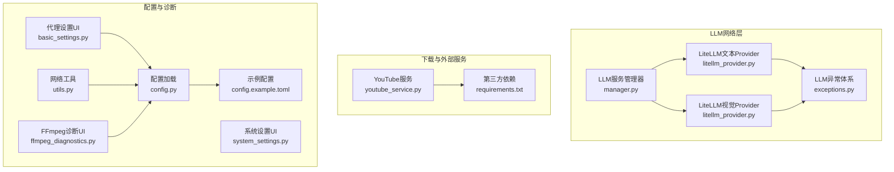
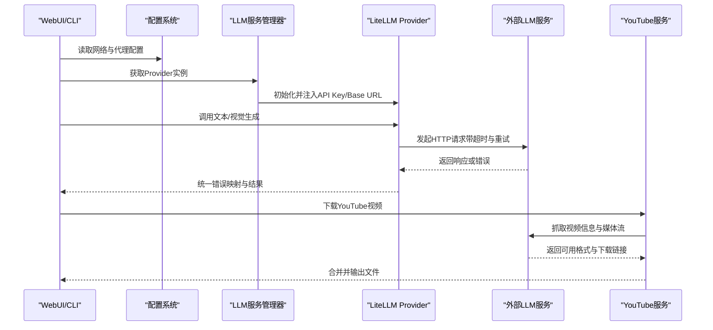
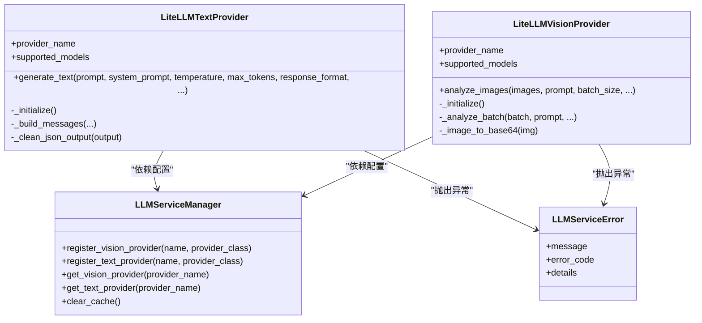
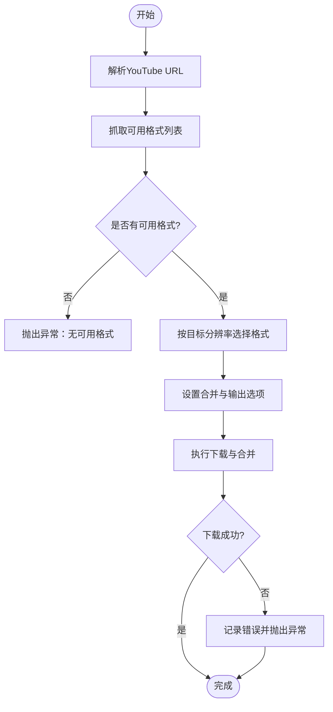
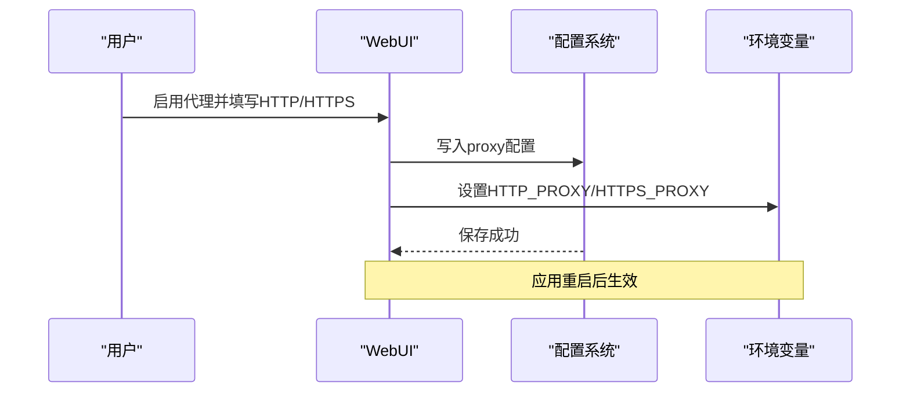
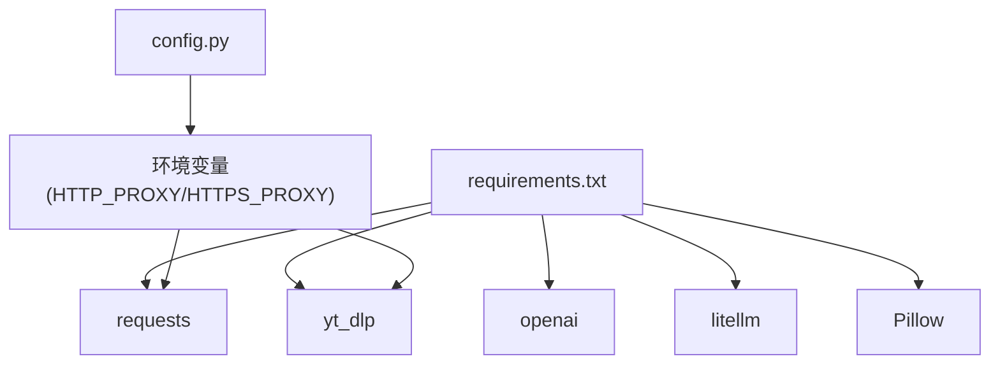

# 网络连接问题

<cite>
**本文引用的文件**   
- [litellm_provider.py](file://app/services/llm/litellm_provider.py)
- [manager.py](file://app/services/llm/manager.py)
- [exceptions.py](file://app/services/llm/exceptions.py)
- [youtube_service.py](file://app/services/youtube_service.py)
- [config.py](file://app/config/config.py)
- [config.example.toml](file://config.example.toml)
- [requirements.txt](file://requirements.txt)
- [test_litellm_integration.py](file://app/services/llm/test_litellm_integration.py)
- [test_llm_service.py](file://app/services/llm/test_llm_service.py)
- [utils.py](file://app/utils/utils.py)
- [basic_settings.py](file://webui/components/basic_settings.py)
- [system_settings.py](file://webui/components/system_settings.py)
- [ffmpeg_diagnostics.py](file://webui/components/ffmpeg_diagnostics.py)
</cite>

## 目录
1. [简介](#简介)
2. [项目结构](#项目结构)
3. [核心组件](#核心组件)
4. [架构总览](#架构总览)
5. [详细组件分析](#详细组件分析)
6. [依赖分析](#依赖分析)
7. [性能考虑](#性能考虑)
8. [故障排除指南](#故障排除指南)
9. [结论](#结论)
10. [附录](#附录)

## 简介
本指南聚焦NarratoAI中的网络连接问题，覆盖LLM提供商API连接失败、认证错误、速率限制、代理与防火墙、DNS解析、YouTube下载服务网络异常、云存储与CDN访问异常等。同时提供网络诊断工具使用方法、连接测试脚本、替代方案配置以及离线与本地部署的网络需求说明。

## 项目结构
与网络相关的核心模块分布如下：
- LLM统一接入层：LiteLLM Provider、LLM服务管理器、异常体系
- YouTube下载服务：yt_dlp封装
- 配置与环境：配置加载、代理设置、超时与重试
- 工具与诊断：通用网络工具、WebUI诊断组件
- 测试脚本：LLM集成与服务测试

**图表来源**
- [manager.py:15-246](file://app/services/llm/manager.py#L15-L246)
- [litellm_provider.py:59-491](file://app/services/llm/litellm_provider.py#L59-L491)
- [exceptions.py:11-119](file://app/services/llm/exceptions.py#L11-L119)
- [youtube_service.py:11-147](file://app/services/youtube_service.py#L11-L147)
- [config.py:24-95](file://app/config/config.py#L24-L95)
- [config.example.toml:1-177](file://config.example.toml#L1-L177)
- [requirements.txt:1-39](file://requirements.txt#L1-L39)
- [utils.py:361-383](file://app/utils/utils.py#L361-L383)
- [basic_settings.py:189-217](file://webui/components/basic_settings.py#L189-L217)
- [ffmpeg_diagnostics.py:20-280](file://webui/components/ffmpeg_diagnostics.py#L20-L280)

**章节来源**
- [manager.py:15-246](file://app/services/llm/manager.py#L15-L246)
- [litellm_provider.py:38-56](file://app/services/llm/litellm_provider.py#L38-L56)
- [youtube_service.py:11-147](file://app/services/youtube_service.py#L11-L147)
- [config.py:24-95](file://app/config/config.py#L24-L95)
- [config.example.toml:1-177](file://config.example.toml#L1-L177)
- [requirements.txt:1-39](file://requirements.txt#L1-L39)
- [utils.py:361-383](file://app/utils/utils.py#L361-L383)
- [basic_settings.py:189-217](file://webui/components/basic_settings.py#L189-L217)
- [ffmpeg_diagnostics.py:20-280](file://webui/components/ffmpeg_diagnostics.py#L20-L280)

## 核心组件
- LiteLLM Provider：统一文本与视觉模型调用，内置重试、超时、错误映射
- LLM服务管理器：注册与实例化Provider，读取配置并缓存实例
- YouTube服务：基于yt_dlp的视频抓取与合并，涉及网络下载与格式解析
- 配置系统：加载config.toml，支持代理、超时、重试等网络相关参数
- WebUI诊断：代理开关、网络连通性测试、FFmpeg诊断

**章节来源**
- [litellm_provider.py:38-56](file://app/services/llm/litellm_provider.py#L38-L56)
- [manager.py:68-209](file://app/services/llm/manager.py#L68-L209)
- [youtube_service.py:52-147](file://app/services/youtube_service.py#L52-L147)
- [config.py:24-95](file://app/config/config.py#L24-L95)
- [config.example.toml:1-177](file://config.example.toml#L1-L177)
- [basic_settings.py:189-217](file://webui/components/basic_settings.py#L189-L217)

## 架构总览

**图表来源**
- [manager.py:68-209](file://app/services/llm/manager.py#L68-L209)
- [litellm_provider.py:388-472](file://app/services/llm/litellm_provider.py#L388-L472)
- [youtube_service.py:15-147](file://app/services/youtube_service.py#L15-L147)

## 详细组件分析

### LLM提供商网络层（LiteLLM Provider）
- 超时与重试：全局配置重试次数与请求超时；具体调用由SDK自动处理
- 认证与Base URL：支持通过环境变量或动态参数传入API Key与自定义Base URL
- 错误映射：将底层异常映射为统一的业务异常（认证、速率限制、内容过滤、API调用错误）

**图表来源**
- [litellm_provider.py:266-491](file://app/services/llm/litellm_provider.py#L266-L491)
- [litellm_provider.py:59-264](file://app/services/llm/litellm_provider.py#L59-L264)
- [manager.py:15-246](file://app/services/llm/manager.py#L15-L246)
- [exceptions.py:11-119](file://app/services/llm/exceptions.py#L11-L119)

**章节来源**
- [litellm_provider.py:38-56](file://app/services/llm/litellm_provider.py#L38-L56)
- [litellm_provider.py:130-264](file://app/services/llm/litellm_provider.py#L130-L264)
- [litellm_provider.py:266-491](file://app/services/llm/litellm_provider.py#L266-L491)
- [manager.py:68-209](file://app/services/llm/manager.py#L68-L209)
- [exceptions.py:48-119](file://app/services/llm/exceptions.py#L48-L119)

### YouTube下载服务网络层
- 视频格式解析：通过yt_dlp抓取可用格式列表
- 下载与合并：根据目标分辨率选择最佳格式并合并音视频
- 异常处理：网络错误、格式不支持、输出目录不可写等

**图表来源**
- [youtube_service.py:15-147](file://app/services/youtube_service.py#L15-L147)

**章节来源**
- [youtube_service.py:15-147](file://app/services/youtube_service.py#L15-L147)

### 配置与代理设置
- 配置加载：自动复制示例配置、支持UTF-8-SIG编码、读取应用与代理配置
- 代理开关：WebUI中可启用/禁用HTTP/HTTPS代理，写入环境变量
- 超时与重试：LLM文本/视觉超时、最大重试次数在配置中集中管理

**图表来源**
- [basic_settings.py:189-217](file://webui/components/basic_settings.py#L189-L217)
- [config.py:24-95](file://app/config/config.py#L24-L95)
- [config.example.toml:157-166](file://config.example.toml#L157-L166)

**章节来源**
- [basic_settings.py:189-217](file://webui/components/basic_settings.py#L189-L217)
- [config.py:24-95](file://app/config/config.py#L24-L95)
- [config.example.toml:157-166](file://config.example.toml#L157-L166)

## 依赖分析
- 第三方网络依赖：requests、yt_dlp、openai、litellm等
- 代理与网络：requests遵循HTTP_PROXY/HTTPS_PROXY环境变量
- FFmpeg：视频处理链路中的网络下载与本地处理

**图表来源**
- [requirements.txt:1-39](file://requirements.txt#L1-L39)
- [config.py:24-95](file://app/config/config.py#L24-L95)

**章节来源**
- [requirements.txt:1-39](file://requirements.txt#L1-L39)
- [config.py:24-95](file://app/config/config.py#L24-L95)

## 性能考虑
- 超时与重试：合理设置LLM超时与重试次数，避免长时间阻塞
- 批处理与并发：视觉分析支持批处理，合理控制批大小
- CDN与直连：优先使用官方直连，必要时通过代理绕过网络限制
- FFmpeg硬件加速：在诊断界面中提供硬件加速与性能优化建议

[本节为通用指导，不直接分析具体文件]

## 故障排除指南

### 一、LLM提供商API连接失败
- 症状
  - 超时、连接失败、空响应
  - 认证失败、API密钥无效
  - 速率限制、频繁重试
- 诊断步骤
  - 检查配置：确认模型名称、API Key、Base URL正确
  - 超时与重试：调整app.llm_text_timeout、llm_vision_timeout、llm_max_retries
  - 代理：在WebUI中启用代理并设置HTTP/HTTPS代理地址
  - 日志：查看统一异常映射（认证、速率限制、内容过滤、API调用错误）
- 替代方案
  - 切换至其他支持的provider或模型
  - 使用OpenAI兼容的Gemini代理端点进行连通性测试
  - 降级为本地推理（如具备条件）

**章节来源**
- [config.example.toml:4-7](file://config.example.toml#L4-L7)
- [config.example.toml:23-51](file://config.example.toml#L23-L51)
- [basic_settings.py:189-217](file://webui/components/basic_settings.py#L189-L217)
- [exceptions.py:48-119](file://app/services/llm/exceptions.py#L48-L119)
- [litellm_provider.py:422-472](file://app/services/llm/litellm_provider.py#L422-L472)
- [test_litellm_integration.py:125-184](file://app/services/llm/test_litellm_integration.py#L125-L184)

### 二、认证错误（AuthenticationError）
- 症状：返回认证失败或权限不足
- 诊断
  - 确认API Key是否正确设置（环境变量或动态参数）
  - 检查provider对应的环境变量名映射
  - 使用连通性测试接口验证
- 处理
  - 重新生成或更新API Key
  - 使用OpenAI兼容端点进行代理连通性测试

**章节来源**
- [litellm_provider.py:107-123](file://app/services/llm/litellm_provider.py#L107-L123)
- [litellm_provider.py:438-440](file://app/services/llm/litellm_provider.py#L438-L440)
- [basic_settings.py:266-289](file://webui/components/basic_settings.py#L266-L289)

### 三、速率限制（RateLimitError）
- 症状：频繁触发限流、响应被拒绝
- 诊断
  - 查看统一异常中的retry_after信息
  - 检查当前provider的配额与用量
- 处理
  - 降低请求频率或增加重试间隔
  - 切换至更高配额的账户或provider
  - 使用代理或CDN优化网络路径

**章节来源**
- [exceptions.py:90-99](file://app/services/llm/exceptions.py#L90-L99)
- [litellm_provider.py:441-443](file://app/services/llm/litellm_provider.py#L441-L443)

### 四、代理服务器配置
- 在WebUI中启用代理并填写HTTP/HTTPS代理地址
- 环境变量生效范围：requests、yt_dlp均会读取HTTP_PROXY/HTTPS_PROXY
- 注意：代理不可用或错误会导致所有外部请求失败

**章节来源**
- [basic_settings.py:189-217](file://webui/components/basic_settings.py#L189-L217)
- [config.py:24-95](file://app/config/config.py#L24-L95)

### 五、防火墙与DNS解析问题
- 症状：域名无法解析、连接被拦截、超时
- 诊断
  - 使用系统ping/dig/nslookup验证DNS
  - 临时关闭防火墙/杀软验证
  - 更换DNS（如114.114.114.114、8.8.8.8）
- 处理
  - 配置企业代理白名单
  - 使用CDN或就近节点
  - 本地hosts绕过解析问题

[本节为通用指导，不直接分析具体文件]

### 六、YouTube下载服务网络问题
- 症状：视频获取失败、网络超时、地区限制
- 诊断
  - 检查URL有效性与公开性
  - 确认目标分辨率存在且非无视频流
  - 查看输出目录权限与磁盘空间
- 处理
  - 使用代理或更换网络环境
  - 选择更低分辨率或无损音频格式
  - 等待平台恢复或使用替代站点

**章节来源**
- [youtube_service.py:52-147](file://app/services/youtube_service.py#L52-L147)

### 七、云存储服务与CDN访问异常
- 症状：上传/下载失败、超时、鉴权错误
- 诊断
  - 检查网络连通性与代理设置
  - 核对凭证与权限范围
  - 验证CDN域名可用性
- 处理
  - 切换CDN节点或回退直连
  - 使用代理或企业网络
  - 本地缓存与离线模式

[本节为通用指导，不直接分析具体文件]

### 八、网络诊断工具与连接测试
- 连接测试脚本
  - LLM集成测试：检查Provider注册、库导入、接口可用性
  - LLM服务测试：文本生成、JSON生成、字幕分析、提供商信息
- WebUI诊断
  - 代理设置：启用/禁用代理并写入环境变量
  - FFmpeg诊断：安装检测、配置建议、性能优化
  - 系统设置：清理临时目录与任务缓存

**章节来源**
- [test_litellm_integration.py:188-229](file://app/services/llm/test_litellm_integration.py#L188-L229)
- [test_llm_service.py:205-264](file://app/services/llm/test_llm_service.py#L205-L264)
- [basic_settings.py:189-217](file://webui/components/basic_settings.py#L189-L217)
- [ffmpeg_diagnostics.py:20-280](file://webui/components/ffmpeg_diagnostics.py#L20-L280)
- [system_settings.py:9-46](file://webui/components/system_settings.py#L9-L46)

### 九、离线模式与本地部署的网络需求
- 离线模式
  - 仅使用本地模型与资源，避免外部网络请求
  - 本地FFmpeg、图像处理工具需正确安装与配置
- 本地部署
  - 配置本地服务端点与鉴权
  - 通过代理或内网穿透实现访问
  - 本地缓存与资源镜像减少对外部依赖

[本节为通用指导，不直接分析具体文件]

## 结论
通过统一的LLM接入层、完善的异常映射、可配置的超时与重试、以及WebUI提供的代理与诊断能力，NarratoAI能够较好地应对常见的网络连接问题。建议在部署初期即完善代理与超时配置，并结合测试脚本与诊断界面快速定位与解决问题。

## 附录

### A. 关键配置项速查
- LLM超时与重试：app.llm_text_timeout、llm_vision_timeout、llm_max_retries
- LLM Provider配置：vision_llm_provider、text_llm_provider、对应api_key与base_url
- 代理配置：proxy.http、proxy.https、proxy.enabled

**章节来源**
- [config.example.toml:4-7](file://config.example.toml#L4-L7)
- [config.example.toml:23-51](file://config.example.toml#L23-L51)
- [config.example.toml:157-166](file://config.example.toml#L157-L166)

### B. 常见错误与对应异常
- 认证失败：AuthenticationError
- 速率限制：RateLimitError
- 内容过滤：ContentFilterError
- API调用错误：APICallError

**章节来源**
- [exceptions.py:101-119](file://app/services/llm/exceptions.py#L101-L119)