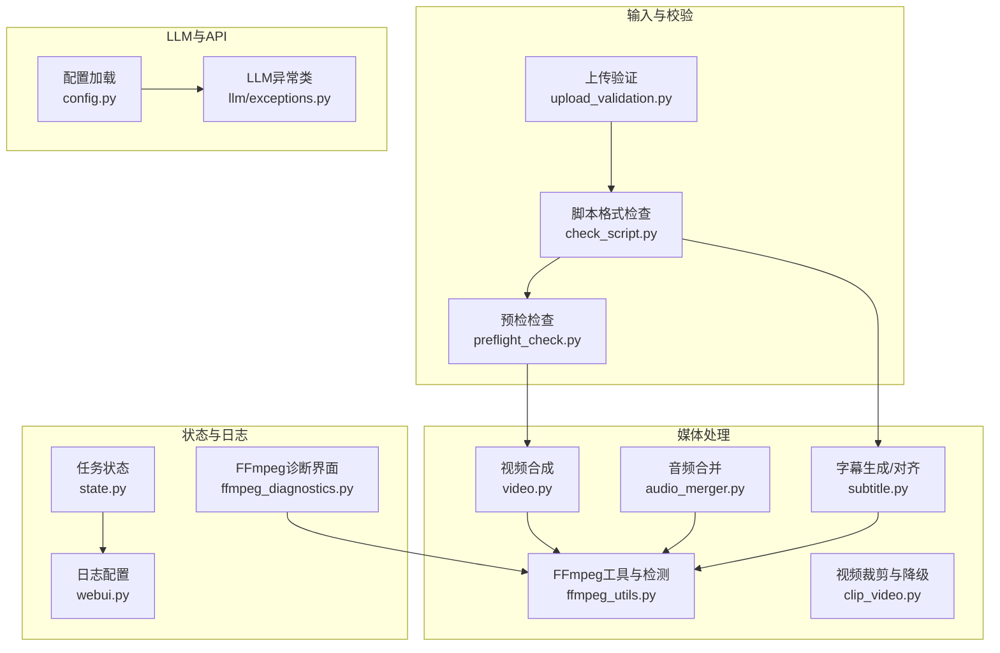
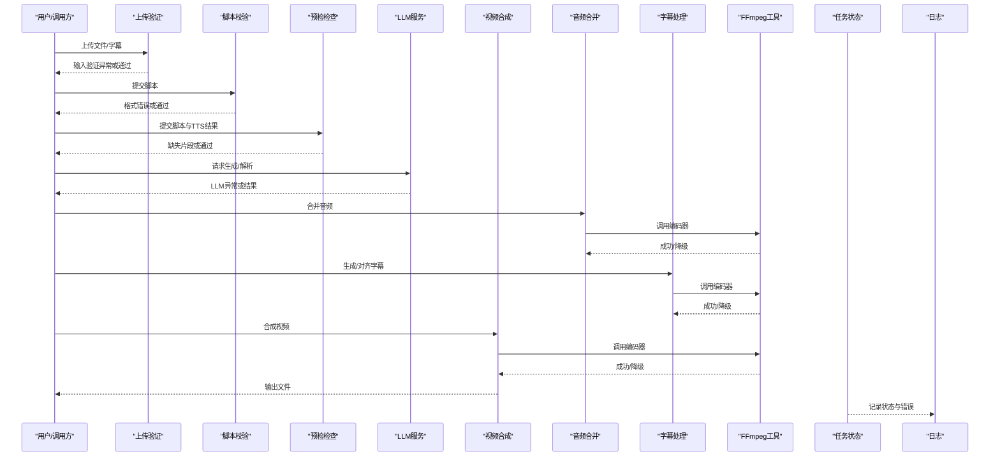
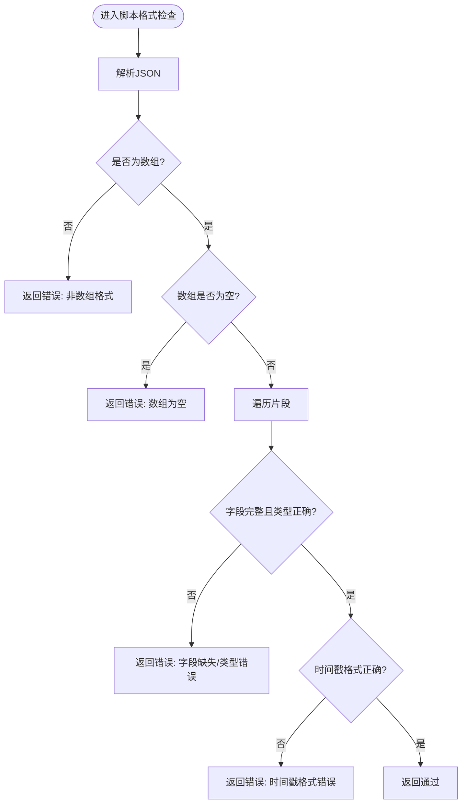
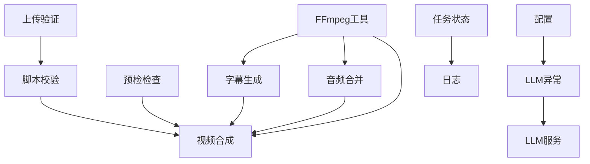

# 运行时错误

<cite>
**本文引用的文件**
- [app/models/exception.py](file://app/models/exception.py)
- [app/services/llm/exceptions.py](file://app/services/llm/exceptions.py)
- [app/services/preflight_check.py](file://app/services/preflight_check.py)
- [app/services/upload_validation.py](file://app/services/upload_validation.py)
- [app/utils/check_script.py](file://app/utils/check_script.py)
- [app/services/video.py](file://app/services/video.py)
- [app/services/audio_merger.py](file://app/services/audio_merger.py)
- [app/utils/ffmpeg_utils.py](file://app/utils/ffmpeg_utils.py)
- [app/services/subtitle.py](file://app/services/subtitle.py)
- [webui/components/ffmpeg_diagnostics.py](file://webui/components/ffmpeg_diagnostics.py)
- [app/services/state.py](file://app/services/state.py)
- [app/utils/utils.py](file://app/utils/utils.py)
- [app/config/config.py](file://app/config/config.py)
- [webui.py](file://webui.py)
- [app/services/clip_video.py](file://app/services/clip_video.py)
</cite>

## 目录
1. [简介](#简介)
2. [项目结构](#项目结构)
3. [核心组件](#核心组件)
4. [架构总览](#架构总览)
5. [详细组件分析](#详细组件分析)
6. [依赖分析](#依赖分析)
7. [性能考虑](#性能考虑)
8. [故障排除指南](#故障排除指南)
9. [结论](#结论)
10. [附录](#附录)

## 简介
本指南聚焦NarratoAI在运行时可能遇到的各类错误，覆盖脚本格式校验、预检检查、文件上传验证、LLM调用异常、API响应错误与超时、视频与音频处理错误、字幕同步问题、进度状态异常等。文档提供错误日志分析方法、调试模式启用、错误码对照、异常恢复与数据回滚策略，帮助开发者与运维人员快速定位与解决问题。

## 项目结构
NarratoAI采用模块化设计，围绕“脚本-素材-字幕-视频”流水线组织代码。关键运行时错误主要分布在以下模块：
- 脚本与预检：脚本格式校验、预检检查、上传输入验证
- LLM与API：统一LLM服务异常、供应商与配置错误、速率限制、鉴权、内容过滤
- 媒体处理：视频合成、音频合并、字幕生成与对齐、FFmpeg硬件加速检测与降级
- 状态与日志：任务状态持久化、日志格式化与过滤、WebUI诊断界面

**图表来源**
- [app/services/upload_validation.py:16-108](file://app/services/upload_validation.py#L16-L108)
- [app/utils/check_script.py:5-111](file://app/utils/check_script.py#L5-L111)
- [app/services/preflight_check.py:4-31](file://app/services/preflight_check.py#L4-L31)
- [app/services/llm/exceptions.py:11-119](file://app/services/llm/exceptions.py#L11-L119)
- [app/config/config.py:24-95](file://app/config/config.py#L24-L95)
- [app/services/video.py:200-418](file://app/services/video.py#L200-L418)
- [app/services/audio_merger.py:21-172](file://app/services/audio_merger.py#L21-L172)
- [app/services/subtitle.py:26-467](file://app/services/subtitle.py#L26-L467)
- [app/utils/ffmpeg_utils.py:252-356](file://app/utils/ffmpeg_utils.py#L252-L356)
- [app/services/clip_video.py:294-519](file://app/services/clip_video.py#L294-L519)
- [app/services/state.py:18-123](file://app/services/state.py#L18-L123)
- [webui.py:41-109](file://webui.py#L41-L109)
- [webui/components/ffmpeg_diagnostics.py:20-281](file://webui/components/ffmpeg_diagnostics.py#L20-L281)

**章节来源**
- [app/services/upload_validation.py:16-108](file://app/services/upload_validation.py#L16-L108)
- [app/utils/check_script.py:5-111](file://app/utils/check_script.py#L5-L111)
- [app/services/preflight_check.py:4-31](file://app/services/preflight_check.py#L4-L31)
- [app/services/llm/exceptions.py:11-119](file://app/services/llm/exceptions.py#L11-L119)
- [app/services/video.py:200-418](file://app/services/video.py#L200-L418)
- [app/services/audio_merger.py:21-172](file://app/services/audio_merger.py#L21-L172)
- [app/services/subtitle.py:26-467](file://app/services/subtitle.py#L26-L467)
- [app/utils/ffmpeg_utils.py:252-356](file://app/utils/ffmpeg_utils.py#L252-L356)
- [app/services/clip_video.py:294-519](file://app/services/clip_video.py#L294-L519)
- [app/services/state.py:18-123](file://app/services/state.py#L18-L123)
- [webui.py:41-109](file://webui.py#L41-L109)
- [webui/components/ffmpeg_diagnostics.py:20-281](file://webui/components/ffmpeg_diagnostics.py#L20-L281)

## 核心组件
- 上传与输入验证：确保文件存在、扩展名合法、字幕输入唯一且有效；为空或重复输入将触发输入验证异常。
- 脚本格式校验：严格校验JSON结构、片段字段完整性、字段类型与格式（如时间戳）、必要字段非空。
- 预检检查：校验脚本片段完整性与TTS结果匹配，缺失片段会阻断统一裁剪流程。
- LLM异常体系：统一LLM服务异常类型，便于区分供应商未找到、配置错误、API调用错误、输出验证失败、模型不支持、速率限制、鉴权失败、内容过滤等。
- FFmpeg工具与检测：跨平台硬件加速检测与降级，提供编码器选择、参数优化与错误分析。
- 媒体处理：视频合成（字幕叠加、音轨混合、编码导出）、音频合并（overlay拼接）、字幕生成与对齐。
- 任务状态与日志：内存或Redis状态持久化，日志格式化与过滤，WebUI诊断界面展示硬件加速与兼容性。

**章节来源**
- [app/services/upload_validation.py:16-108](file://app/services/upload_validation.py#L16-L108)
- [app/utils/check_script.py:5-111](file://app/utils/check_script.py#L5-L111)
- [app/services/preflight_check.py:4-31](file://app/services/preflight_check.py#L4-L31)
- [app/services/llm/exceptions.py:11-119](file://app/services/llm/exceptions.py#L11-L119)
- [app/utils/ffmpeg_utils.py:252-356](file://app/utils/ffmpeg_utils.py#L252-L356)
- [app/services/video.py:200-418](file://app/services/video.py#L200-L418)
- [app/services/audio_merger.py:21-172](file://app/services/audio_merger.py#L21-L172)
- [app/services/subtitle.py:26-467](file://app/services/subtitle.py#L26-L467)
- [app/services/state.py:18-123](file://app/services/state.py#L18-L123)
- [webui.py:41-109](file://webui.py#L41-L109)

## 架构总览
运行时错误贯穿输入、LLM、媒体处理与输出阶段。系统通过异常类与日志统一上报，FFmpeg工具链负责硬件加速与编码降级，WebUI提供诊断与配置入口。

**图表来源**
- [app/services/upload_validation.py:16-108](file://app/services/upload_validation.py#L16-L108)
- [app/utils/check_script.py:5-111](file://app/utils/check_script.py#L5-L111)
- [app/services/preflight_check.py:4-31](file://app/services/preflight_check.py#L4-L31)
- [app/services/llm/exceptions.py:11-119](file://app/services/llm/exceptions.py#L11-L119)
- [app/services/audio_merger.py:21-172](file://app/services/audio_merger.py#L21-L172)
- [app/services/subtitle.py:26-467](file://app/services/subtitle.py#L26-L467)
- [app/services/video.py:200-418](file://app/services/video.py#L200-L418)
- [app/utils/ffmpeg_utils.py:252-356](file://app/utils/ffmpeg_utils.py#L252-L356)
- [app/services/state.py:18-123](file://app/services/state.py#L18-L123)
- [webui.py:41-109](file://webui.py#L41-L109)

## 详细组件分析

### 脚本格式验证
- 功能要点
  - JSON有效性与数组结构校验
  - 片段对象字段完整性与类型校验
  - 时间戳格式校验（HH:MM:SS,mmm-HH:MM:SS,mmm）
  - 必需字段非空校验（_id、timestamp、picture、narration、OST）
- 常见错误
  - JSON语法错误、数组为空、片段非对象、字段缺失、_id非正整数、timestamp格式不符、picture/narration为空、OST非整数
- 处理策略
  - 格式检查失败时返回结构化结果，包含success/message/details
  - 上游应拒绝失败的脚本并提示修正

**图表来源**
- [app/utils/check_script.py:5-111](file://app/utils/check_script.py#L5-L111)

**章节来源**
- [app/utils/check_script.py:5-111](file://app/utils/check_script.py#L5-L111)

### 预检检查与TTS结果匹配
- 功能要点
  - 校验脚本片段必需字段与非空
  - 根据OST标志筛选需要TTS结果的片段，检查对应TTS音频文件是否存在
- 常见错误
  - 脚本片段字段缺失或narration为空
  - OST=0/2的片段缺少TTS音频文件导致统一裁剪无法继续
- 处理策略
  - 发现缺失片段时抛出预检错误，提示检查TTS执行状态或切换OST模式

**章节来源**
- [app/services/preflight_check.py:4-31](file://app/services/preflight_check.py#L4-L31)

### 文件上传验证
- 功能要点
  - 路径存在性与文件有效性检查
  - 扩展名白名单校验
  - 字幕输入来源唯一性校验（内容或文件路径二选一）
- 常见错误
  - 路径为空/不存在/非文件
  - 扩展名不支持
  - 同时提供内容与文件路径，或均未提供
- 处理策略
  - 抛出输入验证异常，提示修正输入来源与格式

**章节来源**
- [app/services/upload_validation.py:16-108](file://app/services/upload_validation.py#L16-L108)

### LLM调用异常与API响应
- 异常类型
  - 供应商未找到、配置错误、API调用错误、输出验证失败、模型不支持、速率限制、鉴权错误、内容过滤错误
- 常见错误
  - 供应商/模型配置缺失或错误
  - API返回非200、400/403参数/权限问题、429限流
  - 内容被安全过滤器拦截
- 处理策略
  - 捕获LLM异常类，区分错误类型并重试/降级
  - 限流时等待后重试，鉴权失败提示检查密钥
  - 安全过滤时提示内容合规性

**章节来源**
- [app/services/llm/exceptions.py:11-119](file://app/services/llm/exceptions.py#L11-L119)

### 视频处理错误
- 功能要点
  - 视频加载、字幕解析与渲染、音轨混合、编码导出
  - 自动选择硬件加速编码器，失败时降级为软件编码
- 常见错误
  - 视频文件不存在、字幕为空/解析失败、音轨缺失、编码器失败
- 处理策略
  - 编码失败时自动降级为libx264并记录警告
  - 字幕为空/解析异常时跳过并记录告警

**章节来源**
- [app/services/video.py:200-418](file://app/services/video.py#L200-L418)
- [app/utils/ffmpeg_utils.py:252-356](file://app/utils/ffmpeg_utils.py#L252-L356)

### 音频处理错误
- 功能要点
  - FFmpeg可用性检查、音频片段overlay拼接、时间戳解析
- 常见错误
  - FFmpeg未安装、音频片段缺失或无法加载、overlay失败
- 处理策略
  - FFmpeg缺失时返回None并记录错误
  - 片段处理异常时继续推进，确保总时长计算正确

**章节来源**
- [app/services/audio_merger.py:21-172](file://app/services/audio_merger.py#L21-L172)

### 字幕处理与同步
- 功能要点
  - Whisper模型加载（CUDA/CPU自动回退）、字幕生成、SRT写出
  - 与脚本文本相似度对齐与纠正
- 常见错误
  - 模型目录缺失、CUDA加载失败、音频无音轨、转录失败
- 处理策略
  - 模型缺失时提示下载与放置路径
  - CUDA失败回退CPU；音频无音轨时终止并提示

**章节来源**
- [app/services/subtitle.py:26-467](file://app/services/subtitle.py#L26-L467)

### FFmpeg诊断与降级
- 功能要点
  - 跨平台硬件加速检测（NVIDIA/AMD/Intel/macOS）、编码器映射、参数优化
  - 失败时自动降级为软件编码，提供诊断界面与配置建议
- 常见错误
  - 硬件加速不可用、滤镜链错误、编码器不支持
- 处理策略
  - 诊断界面展示可用加速类型与建议配置
  - 视频导出失败时自动回退libx264

**章节来源**
- [app/utils/ffmpeg_utils.py:252-356](file://app/utils/ffmpeg_utils.py#L252-L356)
- [webui/components/ffmpeg_diagnostics.py:20-281](file://webui/components/ffmpeg_diagnostics.py#L20-L281)

### 任务状态与日志
- 功能要点
  - 内存或Redis状态持久化，进度与状态上报
  - 日志格式化与过滤，减少噪音，突出关键错误
- 常见问题
  - 状态丢失、日志过多影响定位
- 处理策略
  - 启用Redis提升分布式稳定性
  - 启用调试级别并使用过滤器聚焦错误

**章节来源**
- [app/services/state.py:18-123](file://app/services/state.py#L18-L123)
- [webui.py:41-109](file://webui.py#L41-L109)

## 依赖分析
- 组件耦合
  - 视频合成依赖FFmpeg工具链与字幕模块
  - 音频合并依赖FFmpeg与脚本片段时长
  - 字幕生成依赖Whisper模型与配置
  - LLM异常类与配置模块解耦，便于扩展新供应商
- 外部依赖
  - FFmpeg、CUDA/AMF/QSV/VAAPI、Whisper模型、Redis、WebUI

**图表来源**
- [app/utils/check_script.py:5-111](file://app/utils/check_script.py#L5-L111)
- [app/services/upload_validation.py:16-108](file://app/services/upload_validation.py#L16-L108)
- [app/services/preflight_check.py:4-31](file://app/services/preflight_check.py#L4-L31)
- [app/services/video.py:200-418](file://app/services/video.py#L200-L418)
- [app/services/audio_merger.py:21-172](file://app/services/audio_merger.py#L21-L172)
- [app/services/subtitle.py:26-467](file://app/services/subtitle.py#L26-L467)
- [app/utils/ffmpeg_utils.py:252-356](file://app/utils/ffmpeg_utils.py#L252-L356)
- [app/services/llm/exceptions.py:11-119](file://app/services/llm/exceptions.py#L11-L119)
- [app/config/config.py:24-95](file://app/config/config.py#L24-L95)
- [app/services/state.py:18-123](file://app/services/state.py#L18-L123)
- [webui.py:41-109](file://webui.py#L41-L109)

**章节来源**
- [app/utils/check_script.py:5-111](file://app/utils/check_script.py#L5-L111)
- [app/services/upload_validation.py:16-108](file://app/services/upload_validation.py#L16-L108)
- [app/services/preflight_check.py:4-31](file://app/services/preflight_check.py#L4-L31)
- [app/services/video.py:200-418](file://app/services/video.py#L200-L418)
- [app/services/audio_merger.py:21-172](file://app/services/audio_merger.py#L21-L172)
- [app/services/subtitle.py:26-467](file://app/services/subtitle.py#L26-L467)
- [app/utils/ffmpeg_utils.py:252-356](file://app/utils/ffmpeg_utils.py#L252-L356)
- [app/services/llm/exceptions.py:11-119](file://app/services/llm/exceptions.py#L11-L119)
- [app/config/config.py:24-95](file://app/config/config.py#L24-L95)
- [app/services/state.py:18-123](file://app/services/state.py#L18-L123)
- [webui.py:41-109](file://webui.py#L41-L109)

## 性能考虑
- 硬件加速优先：根据平台与GPU厂商选择最优编码器，失败时自动降级
- 编码参数优化：按编码器类型设置预设与CRF，兼顾质量与速度
- 资源管理：视频/音频片段生命周期管理，及时关闭与释放
- 日志级别：生产环境建议INFO以上，DEBUG仅在排障时开启

[本节为通用指导，无需引用具体文件]

## 故障排除指南

### 1. 脚本格式验证错误
- 症状
  - 提交脚本后报“JSON格式错误/数组为空/字段缺失/类型错误/时间戳格式错误”
- 排查步骤
  - 使用脚本格式检查接口确认details
  - 逐片段核对必需字段与类型
  - 修正时间戳格式为“HH:MM:SS,mmm-HH:MM:SS,mmm”
- 恢复建议
  - 修复后重新提交，直至check返回success

**章节来源**
- [app/utils/check_script.py:5-111](file://app/utils/check_script.py#L5-L111)

### 2. 预检检查失败
- 症状
  - 报“脚本数组不能为空/片段缺少字段/片段narration为空/缺少TTS结果”
- 排查步骤
  - 检查脚本片段是否为空、字段是否齐全
  - 对OST=0/2的片段确认TTS结果是否存在
- 恢复建议
  - 填充缺失字段或修正narration
  - 确保TTS成功生成或切换OST模式

**章节来源**
- [app/services/preflight_check.py:4-31](file://app/services/preflight_check.py#L4-L31)

### 3. 文件上传验证问题
- 症状
  - 报“文件不存在/不是有效文件/格式不支持/必须提供字幕内容或文件路径/只能提供一种输入”
- 排查步骤
  - 确认文件路径存在且可读
  - 检查扩展名是否在允许列表内
  - 确保字幕输入来源唯一
- 恢复建议
  - 修正路径与扩展名，或仅提供一种输入

**章节来源**
- [app/services/upload_validation.py:16-108](file://app/services/upload_validation.py#L16-L108)

### 4. LLM调用异常
- 症状
  - 供应商未找到、配置错误、API调用失败、输出验证失败、模型不支持、速率限制、鉴权失败、内容过滤
- 排查步骤
  - 检查供应商与模型配置是否正确
  - 核对API密钥与权限
  - 观察限流响应并等待重试
  - 若被安全过滤，调整内容或提示合规
- 恢复建议
  - 修正配置与密钥
  - 实现指数退避重试
  - 替换供应商或模型

**章节来源**
- [app/services/llm/exceptions.py:11-119](file://app/services/llm/exceptions.py#L11-L119)

### 5. API响应错误与超时
- 症状
  - 400参数错误、403权限不足、429限流、非200响应、超时
- 排查步骤
  - 检查请求参数与鉴权头
  - 观察响应体与状态码
  - 增加重试与超时配置
- 恢复建议
  - 429时按提示等待或降低频率
  - 400/403修正参数与密钥
  - 超时增加timeout并重试

**章节来源**
- [app/utils/script_generator.py:249-301](file://app/utils/script_generator.py#L249-L301)
- [app/utils/gemini_analyzer.py:115-146](file://app/utils/gemini_analyzer.py#L115-L146)

### 6. 视频处理错误
- 症状
  - 视频文件不存在、字幕解析失败、音轨缺失、编码器失败
- 排查步骤
  - 确认视频路径与字幕文件存在
  - 检查FFmpeg硬件加速可用性
  - 查看导出日志与编码器选择
- 恢复建议
  - 字幕为空/解析异常时跳过并记录
  - 编码失败自动降级为libx264

**章节来源**
- [app/services/video.py:200-418](file://app/services/video.py#L200-L418)
- [app/utils/ffmpeg_utils.py:252-356](file://app/utils/ffmpeg_utils.py#L252-L356)

### 7. 音频处理错误
- 症状
  - FFmpeg未安装、音频片段缺失、overlay失败
- 排查步骤
  - 检查FFmpeg是否安装与可用
  - 确认脚本片段的audio字段与duration
- 恢复建议
  - 安装FFmpeg或修正PATH
  - 跳过缺失片段并继续推进

**章节来源**
- [app/services/audio_merger.py:21-172](file://app/services/audio_merger.py#L21-L172)

### 8. 字幕同步问题
- 症状
  - 字幕与脚本不一致、相似度低、对齐失败
- 排查步骤
  - 使用Whisper生成SRT并与脚本对比
  - 检查时间戳解析与格式
- 恢复建议
  - 基于相似度合并/纠正字幕
  - 修正时间戳格式与内容

**章节来源**
- [app/services/subtitle.py:257-349](file://app/services/subtitle.py#L257-L349)

### 9. 进度状态异常
- 症状
  - 进度停滞、状态丢失、Redis不可用
- 排查步骤
  - 检查Redis配置与连通性
  - 查看状态更新与获取逻辑
- 恢复建议
  - 启用Redis或回退内存状态
  - 修复连接问题或重启服务

**章节来源**
- [app/services/state.py:18-123](file://app/services/state.py#L18-L123)

### 10. FFmpeg诊断与降级
- 症状
  - 硬件加速不可用、滤镜链错误、编码失败
- 排查步骤
  - 使用WebUI诊断界面查看硬件加速信息
  - 选择兼容配置或强制禁用硬件加速
- 恢复建议
  - 选择推荐配置或软件编码
  - 更新驱动或更换编码器

**章节来源**
- [webui/components/ffmpeg_diagnostics.py:20-281](file://webui/components/ffmpeg_diagnostics.py#L20-L281)
- [app/utils/ffmpeg_utils.py:252-356](file://app/utils/ffmpeg_utils.py#L252-L356)

### 11. 错误日志分析与调试模式
- 日志格式
  - 相对路径显示、时间戳、级别、文件与行号、函数名、消息
- 调试模式
  - 启用DEBUG级别并使用过滤器减少噪音
  - WebUI中可查看FFmpeg兼容性报告与建议
- 建议
  - 生产环境使用INFO以上级别
  - 排障时临时开启DEBUG并观察关键错误

**章节来源**
- [webui.py:41-109](file://webui.py#L41-L109)
- [webui/components/ffmpeg_diagnostics.py:20-281](file://webui/components/ffmpeg_diagnostics.py#L20-L281)

### 12. 异常恢复与数据回滚策略
- 恢复机制
  - FFmpeg导出失败自动降级为软件编码
  - 视频裁剪失败时尝试通用fallback方案
  - LLM请求失败时重试与限流处理
- 数据回滚
  - 任务状态持久化（内存/Redis），异常时保持状态一致性
  - 临时文件清理（音频提取、关键帧缓存等）
- 建议
  - 在关键节点记录checkpoint
  - 失败时清理中间产物并通知用户

**章节来源**
- [app/services/video.py:389-409](file://app/services/video.py#L389-L409)
- [app/services/clip_video.py:294-519](file://app/services/clip_video.py#L294-L519)
- [app/utils/utils.py:573-600](file://app/utils/utils.py#L573-L600)
- [app/services/state.py:18-123](file://app/services/state.py#L18-L123)

## 结论
本指南提供了从输入校验到媒体处理的全流程运行时错误排查方法。通过统一的异常体系、完善的日志与诊断界面、以及FFmpeg的硬件加速与降级策略，系统能够在复杂环境下稳定运行并快速恢复。建议在生产环境中启用Redis状态持久化、合理设置日志级别，并定期使用WebUI诊断界面评估硬件加速与兼容性。

[本节为总结，无需引用具体文件]

## 附录

### A. 错误码对照表
- HTTP错误
  - 400：参数错误
  - 403：权限不足/密钥无效
  - 429：请求过于频繁（限流）
- LLM异常
  - PROVIDER_NOT_FOUND：供应商未找到
  - CONFIGURATION_ERROR：配置错误
  - API_CALL_ERROR：API调用失败
  - VALIDATION_ERROR：输出验证失败
  - MODEL_NOT_SUPPORTED：模型不支持
  - RATE_LIMIT_ERROR：速率限制
  - AUTHENTICATION_ERROR：鉴权失败
  - CONTENT_FILTER_ERROR：内容被过滤

**章节来源**
- [app/models/exception.py:7-25](file://app/models/exception.py#L7-L25)
- [app/services/llm/exceptions.py:26-119](file://app/services/llm/exceptions.py#L26-L119)

### B. FFmpeg错误类型识别
- 滤镜链错误：impossible to convert between formats、filter chain、format/scale
- 硬件加速错误：cuda、nvenc、amf、qsv、d3d11va、dxva2、videotoolbox、hardware
- 编码器错误：encoder、codec、h264、libx264、bitrate、preset

**章节来源**
- [app/services/clip_video.py:304-339](file://app/services/clip_video.py#L304-L339)