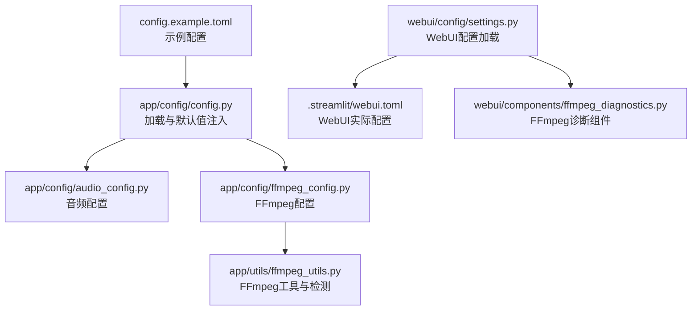
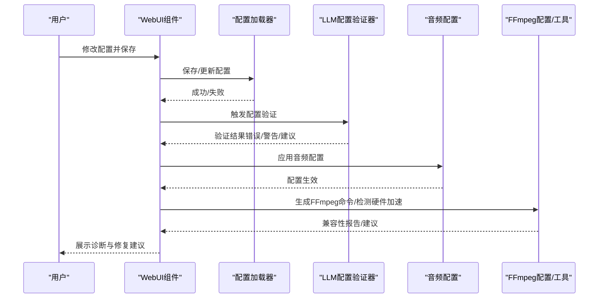
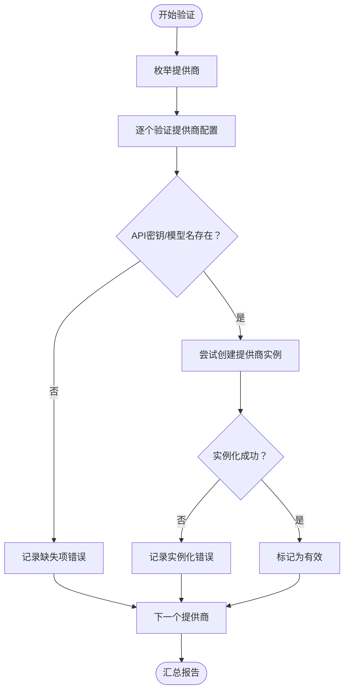
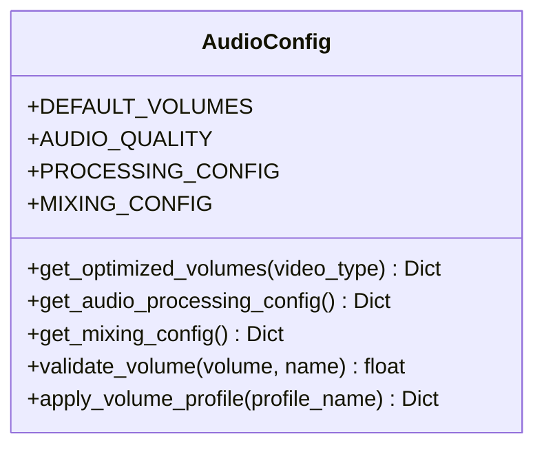
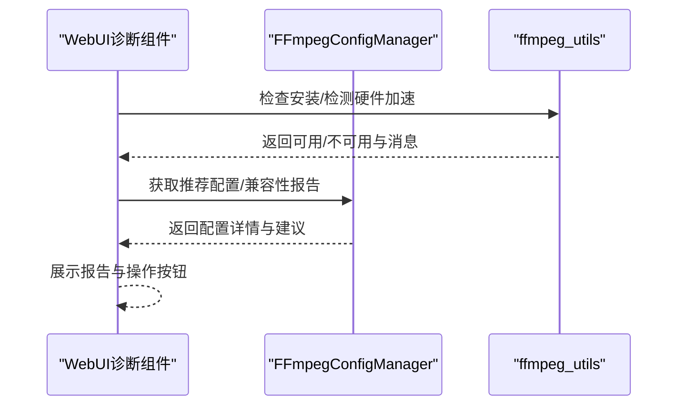
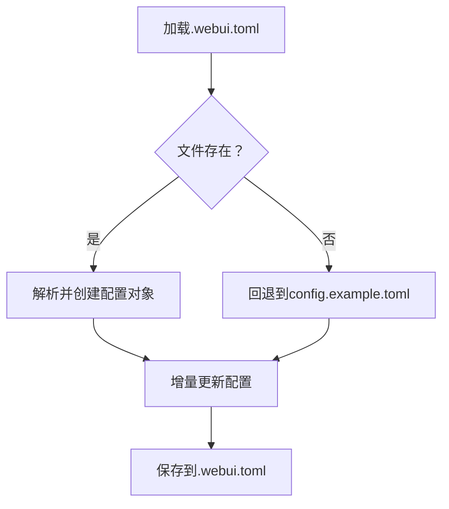
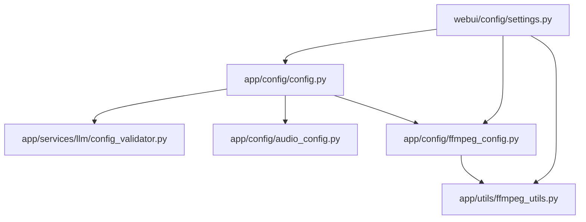

# 配置错误问题

<cite>
**本文引用的文件**
- [config.example.toml](file://config.example.toml)
- [app/config/config.py](file://app/config/config.py)
- [app/config/audio_config.py](file://app/config/audio_config.py)
- [app/config/ffmpeg_config.py](file://app/config/ffmpeg_config.py)
- [webui/config/settings.py](file://webui/config/settings.py)
- [app/services/llm/config_validator.py](file://app/services/llm/config_validator.py)
- [app/services/llm/exceptions.py](file://app/services/llm/exceptions.py)
- [app/utils/ffmpeg_utils.py](file://app/utils/ffmpeg_utils.py)
- [webui/components/ffmpeg_diagnostics.py](file://webui/components/ffmpeg_diagnostics.py)
- [app/services/user_settings.py](file://app/services/user_settings.py)
- [app/services/state.py](file://app/services/state.py)
- [webui/components/system_settings.py](file://webui/components/system_settings.py)
</cite>

## 目录
1. [简介](#简介)
2. [项目结构](#项目结构)
3. [核心组件](#核心组件)
4. [架构总览](#架构总览)
5. [详细组件分析](#详细组件分析)
6. [依赖分析](#依赖分析)
7. [性能考虑](#性能考虑)
8. [故障排除指南](#故障排除指南)
9. [结论](#结论)
10. [附录](#附录)

## 简介
本指南聚焦NarratoAI在配置层面的常见错误与排查方法，覆盖以下方面：
- config.example.toml配置文件的语法、字段缺失、值格式问题
- LLM提供商配置错误（API密钥、超时、模型名、base_url）
- 音频配置问题（采样率、声道、比特率、音量、响度）
- FFmpeg配置问题（路径、硬件加速、编码器选择、兼容性）
- WebUI界面配置问题（代理、语言、TTS引擎）
- 配置文件验证方法、默认值检查、配置迁移策略
- 配置热更新与重启策略

## 项目结构
NarratoAI的配置体系由三部分组成：
- 核心配置：config.example.toml（示例配置），app/config/config.py负责加载与默认值注入
- WebUI配置：webui/config/settings.py负责WebUI专用配置（.streamlit/webui.toml）
- 专项配置：音频（audio_config.py）、FFmpeg（ffmpeg_config.py、ffmpeg_utils.py）

图表来源
- [config.example.toml](file://config.example.toml)
- [app/config/config.py](file://app/config/config.py)
- [app/config/audio_config.py](file://app/config/audio_config.py)
- [app/config/ffmpeg_config.py](file://app/config/ffmpeg_config.py)
- [webui/config/settings.py](file://webui/config/settings.py)
- [app/utils/ffmpeg_utils.py](file://app/utils/ffmpeg_utils.py)
- [webui/components/ffmpeg_diagnostics.py](file://webui/components/ffmpeg_diagnostics.py)

章节来源
- [config.example.toml](file://config.example.toml)
- [app/config/config.py](file://app/config/config.py)
- [webui/config/settings.py](file://webui/config/settings.py)

## 核心组件
- 配置加载与默认值
  - app/config/config.py负责加载config.toml，若不存在则复制config.example.toml；支持UTF-8-BOM回退解析；注入全局app/ui/proxy等命名空间；处理ImageMagick与FFmpeg路径环境变量。
- LLM配置验证
  - app/services/llm/config_validator.py提供LLM提供商配置验证，检查API密钥、模型名、base_url等，并给出建议与汇总报告。
- 音频配置
  - app/config/audio_config.py定义默认采样率、声道、比特率、响度目标、动态范围压缩等；提供音量校验与配置文件应用。
- FFmpeg配置
  - app/config/ffmpeg_config.py提供多套预设配置（高性能、兼容性、Windows NVIDIA、macOS VideoToolbox、通用软件）；根据系统与硬件自动推荐；生成关键帧提取命令。
  - app/utils/ffmpeg_utils.py提供FFmpeg安装检测、GPU厂商识别、硬件加速方法测试、参数生成与降级策略。
- WebUI配置
  - webui/config/settings.py加载.webui.toml（不存在则回退到config.example.toml），提供保存与更新接口；webui/components/ffmpeg_diagnostics.py提供诊断与故障排除界面。

章节来源
- [app/config/config.py](file://app/config/config.py)
- [app/services/llm/config_validator.py](file://app/services/llm/config_validator.py)
- [app/config/audio_config.py](file://app/config/audio_config.py)
- [app/config/ffmpeg_config.py](file://app/config/ffmpeg_config.py)
- [app/utils/ffmpeg_utils.py](file://app/utils/ffmpeg_utils.py)
- [webui/config/settings.py](file://webui/config/settings.py)
- [webui/components/ffmpeg_diagnostics.py](file://webui/components/ffmpeg_diagnostics.py)

## 架构总览
配置错误的典型传播路径：配置文件 → 加载器 → 业务模块（LLM/音频/FFmpeg/WebUI）→ 错误抛出与日志记录 → WebUI诊断与修复建议。

图表来源
- [webui/config/settings.py](file://webui/config/settings.py)
- [app/services/llm/config_validator.py](file://app/services/llm/config_validator.py)
- [app/config/audio_config.py](file://app/config/audio_config.py)
- [app/config/ffmpeg_config.py](file://app/config/ffmpeg_config.py)
- [app/utils/ffmpeg_utils.py](file://app/utils/ffmpeg_utils.py)

## 详细组件分析

### LLM配置验证器（config_validator.py）
- 验证范围
  - 视觉/文本提供商：检查API密钥、模型名、base_url是否存在；尝试实例化提供商；未配置base_url时给出警告。
- 输出
  - 汇总统计（总数/有效数）、错误列表、警告列表、逐提供商配置快照与建议。
- 建议
  - 为每个提供商列出必填/可选配置项与示例模型名；推荐使用统一的LiteLLM接口。

图表来源
- [app/services/llm/config_validator.py](file://app/services/llm/config_validator.py)

章节来源
- [app/services/llm/config_validator.py](file://app/services/llm/config_validator.py)
- [app/services/llm/exceptions.py](file://app/services/llm/exceptions.py)

### 音频配置（audio_config.py）
- 默认值
  - 采样率、声道、比特率；默认音量（TTS/原声/BGM）；响度目标、峰值限制；交叉淡化、BGM淡出、动态范围压缩。
- 校验与应用
  - 音量值限制在合理区间；按视频类型/内容类型推荐音量；支持预设音量配置文件。
- 常见问题
  - 音量超出范围导致异常或静音；响度目标与峰值限制不合理造成削波或过弱；比特率过低影响音质。

图表来源
- [app/config/audio_config.py](file://app/config/audio_config.py)

章节来源
- [app/config/audio_config.py](file://app/config/audio_config.py)

### FFmpeg配置与诊断（ffmpeg_config.py + ffmpeg_utils.py）
- 配置文件
  - 高性能、兼容性、Windows NVIDIA、macOS VideoToolbox、通用软件五种预设；自动推荐；生成关键帧提取命令。
- 硬件加速检测
  - 按平台与GPU厂商优先级测试CUDA/NVENC/VAAPI/QSV/AMF/VideoToolbox；支持降级与备用编码器；记录测试方法与消息。
- WebUI诊断
  - 展示系统信息、FFmpeg状态、硬件加速检测、推荐配置、兼容性报告与优化建议；提供强制禁用硬件加速、重置检测等操作。

图表来源
- [app/config/ffmpeg_config.py](file://app/config/ffmpeg_config.py)
- [app/utils/ffmpeg_utils.py](file://app/utils/ffmpeg_utils.py)
- [webui/components/ffmpeg_diagnostics.py](file://webui/components/ffmpeg_diagnostics.py)

章节来源
- [app/config/ffmpeg_config.py](file://app/config/ffmpeg_config.py)
- [app/utils/ffmpeg_utils.py](file://app/utils/ffmpeg_utils.py)
- [webui/components/ffmpeg_diagnostics.py](file://webui/components/ffmpeg_diagnostics.py)

### WebUI配置（settings.py）
- 加载逻辑
  - 优先加载.webui.toml；不存在则回退到config.example.toml；保存时写入指定字段，不保存版本号。
- 更新与持久化
  - 支持增量更新（ui/proxy/app/azure）；保存到.webui.toml。
- 与系统设置联动
  - 清理缓存目录（关键帧、剪辑视频、任务）等系统设置入口。

图表来源
- [webui/config/settings.py](file://webui/config/settings.py)
- [webui/components/system_settings.py](file://webui/components/system_settings.py)

章节来源
- [webui/config/settings.py](file://webui/config/settings.py)
- [webui/components/system_settings.py](file://webui/components/system_settings.py)

## 依赖分析
- 配置加载依赖
  - app/config/config.py依赖toml解析与文件系统；注入环境变量（ImageMagick/FFmpeg路径）。
- LLM配置验证依赖
  - 依赖LLM服务管理器（列举提供商）、app/config.config.app命名空间读取配置。
- FFmpeg依赖
  - ffmpeg_config.py依赖ffmpeg_utils进行硬件加速检测与参数生成；WebUI诊断组件依赖两者。
- WebUI配置依赖
  - 依赖tomli/tomli_w进行二进制读取与写入；依赖app/config/config.py的全局配置。

图表来源
- [app/config/config.py](file://app/config/config.py)
- [app/services/llm/config_validator.py](file://app/services/llm/config_validator.py)
- [app/config/audio_config.py](file://app/config/audio_config.py)
- [app/config/ffmpeg_config.py](file://app/config/ffmpeg_config.py)
- [app/utils/ffmpeg_utils.py](file://app/utils/ffmpeg_utils.py)
- [webui/config/settings.py](file://webui/config/settings.py)

章节来源
- [app/config/config.py](file://app/config/config.py)
- [app/services/llm/config_validator.py](file://app/services/llm/config_validator.py)
- [app/config/ffmpeg_config.py](file://app/config/ffmpeg_config.py)
- [app/utils/ffmpeg_utils.py](file://app/utils/ffmpeg_utils.py)
- [webui/config/settings.py](file://webui/config/settings.py)

## 性能考虑
- FFmpeg性能
  - 优先硬件加速（CUDA/NVENC/VAAPI/QSV/AMF/VideoToolbox）；Windows NVIDIA优先纯NVENC编码器以提升兼容性；macOS优先VideoToolbox。
- 音频性能
  - 合理设置采样率与比特率；启用响度归一化与动态范围压缩可改善听感一致性。
- LLM性能
  - 正确设置超时与重试；为每个提供商配置base_url以减少连接失败；使用LiteLLM统一接口提升稳定性。

## 故障排除指南

### 1. 配置文件常见错误与修复
- 语法错误
  - 症状：加载配置时报错或解析失败。
  - 修复：使用在线TOML校验工具检查；确认键名与值类型匹配；避免多余的逗号或引号不闭合。
- 字段缺失
  - 症状：LLM验证器提示缺少API密钥/模型名；WebUI无法保存配置。
  - 修复：对照config.example.toml补齐必填字段；LLM需同时提供api_key与model_name；WebUI保存时仅写入允许字段。
- 值格式不正确
  - 症状：音频配置音量越界；FFmpeg命令参数无效。
  - 修复：使用audio_config.py的音量校验；FFmpeg配置使用预设或自动推荐。

章节来源
- [config.example.toml](file://config.example.toml)
- [app/config/config.py](file://app/config/config.py)
- [webui/config/settings.py](file://webui/config/settings.py)
- [app/config/audio_config.py](file://app/config/audio_config.py)
- [app/config/ffmpeg_config.py](file://app/config/ffmpeg_config.py)

### 2. LLM提供商配置错误
- API密钥无效
  - 症状：认证错误异常；验证器报错。
  - 修复：核对各提供商API密钥；确保未过期；在config.example.toml中查看示例密钥位置。
- 超时设置不当
  - 症状：视觉/文本模型请求超时。
  - 修复：调整app/llm_vision_timeout与llm_text_timeout；结合llm_max_retries使用。
- 模型名与base_url
  - 症状：模型不支持或连接失败。
  - 修复：使用验证器建议的示例模型名；为不稳定网络配置base_url。

章节来源
- [app/services/llm/config_validator.py](file://app/services/llm/config_validator.py)
- [app/services/llm/exceptions.py](file://app/services/llm/exceptions.py)
- [config.example.toml](file://config.example.toml)

### 3. 音频配置问题
- 采样率/比特率/声道
  - 症状：音频失真或播放异常。
  - 修复：使用默认值；必要时调整至44100Hz/128k/立体声。
- 音量与响度
  - 症状：TTS过小/原声过大/削波。
  - 修复：使用音量校验与推荐配置；设置合理的响度目标与峰值限制。

章节来源
- [app/config/audio_config.py](file://app/config/audio_config.py)

### 4. FFmpeg配置问题
- 路径设置
  - 症状：FFmpeg未安装或不在PATH。
  - 修复：安装FFmpeg并加入PATH；或在app/config/config.py中设置环境变量指向可执行文件。
- 硬件加速
  - 症状：滤镜链错误、性能差。
  - 修复：使用WebUI诊断组件生成兼容性报告；选择兼容性配置；必要时强制禁用硬件加速。
- 编解码器选择
  - 症状：编码失败或兼容性差。
  - 修复：按平台与GPU厂商选择预设；Windows NVIDIA优先纯NVENC；macOS优先VideoToolbox。

章节来源
- [app/utils/ffmpeg_utils.py](file://app/utils/ffmpeg_utils.py)
- [app/config/ffmpeg_config.py](file://app/config/ffmpeg_config.py)
- [webui/components/ffmpeg_diagnostics.py](file://webui/components/ffmpeg_diagnostics.py)

### 5. WebUI界面配置问题
- 代理配置
  - 症状：访问外部API失败。
  - 修复：在WebUI中启用代理并填写HTTP/HTTPS地址。
- 语言与TTS引擎
  - 症状：界面语言不生效或TTS异常。
  - 修复：在WebUI中切换语言；选择合适的TTS引擎并在config.toml中配置相应参数。

章节来源
- [webui/config/settings.py](file://webui/config/settings.py)
- [config.example.toml](file://config.example.toml)

### 6. 配置验证方法与默认值检查
- 使用验证器
  - 在控制台或日志中查看LLM配置验证报告，定位缺失项与错误。
- 默认值检查
  - app/config/config.py会在缺少配置时复制示例文件并注入默认值；检查全局命名空间（app/ui/proxy等）是否被覆盖。

章节来源
- [app/services/llm/config_validator.py](file://app/services/llm/config_validator.py)
- [app/config/config.py](file://app/config/config.py)

### 7. 配置迁移指南
- 从传统配置迁移到LiteLLM
  - 将传统提供商配置替换为统一的vision_litellm_*与text_litellm_*字段；保留API密钥与base_url。
- WebUI配置迁移
  - .webui.toml与config.example.toml字段差异：WebUI保存时仅写入允许字段；版本号不再保存。

章节来源
- [config.example.toml](file://config.example.toml)
- [webui/config/settings.py](file://webui/config/settings.py)

### 8. 配置热更新与重启策略
- 热更新
  - WebUI支持增量更新（ui/proxy/app/azure）；用户设置（user_settings.json）可保存运行时配置并应用到全局config。
- 重启策略
  - 更改FFmpeg路径或硬件加速设置后，建议重启服务以使环境变量与检测结果生效。
  - WebUI重启：通过入口脚本或容器健康检查确认服务状态。

章节来源
- [webui/config/settings.py](file://webui/config/settings.py)
- [app/services/user_settings.py](file://app/services/user_settings.py)
- [app/services/state.py](file://app/services/state.py)

## 结论
- 配置错误多源于语法、字段缺失与值格式不正确；LLM配置需关注API密钥、模型名与超时设置；音频与FFmpeg配置需遵循默认值与平台特性。
- 建议流程：先用验证器与诊断组件定位问题，再依据建议修改配置，最后重启服务验证。
- 长期维护：优先使用LiteLLM统一接口；通过WebUI与用户设置实现热更新；定期生成兼容性报告优化性能。

## 附录

### A. 常见配置字段清单与建议
- LLM（LiteLLM）
  - 视觉：vision_litellm_model_name、vision_litellm_api_key、vision_litellm_base_url
  - 文本：text_litellm_model_name、text_litellm_api_key、text_litellm_base_url
  - 超时与重试：llm_vision_timeout、llm_text_timeout、llm_max_retries
- 音频
  - 采样率、声道、比特率；音量（tts/original/bgm）；响度目标与峰值限制
- FFmpeg
  - 路径环境变量；硬件加速类型；编码器选择；像素格式与质量预设
- WebUI
  - 代理（http/https/enabled）；语言；TTS引擎与参数

章节来源
- [config.example.toml](file://config.example.toml)
- [app/config/audio_config.py](file://app/config/audio_config.py)
- [app/config/ffmpeg_config.py](file://app/config/ffmpeg_config.py)
- [webui/config/settings.py](file://webui/config/settings.py)