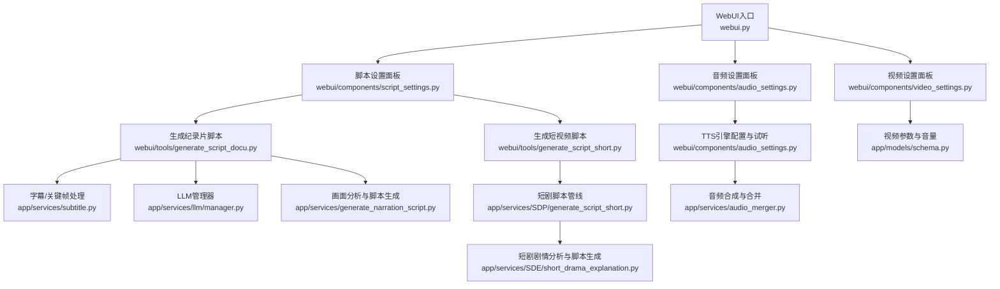
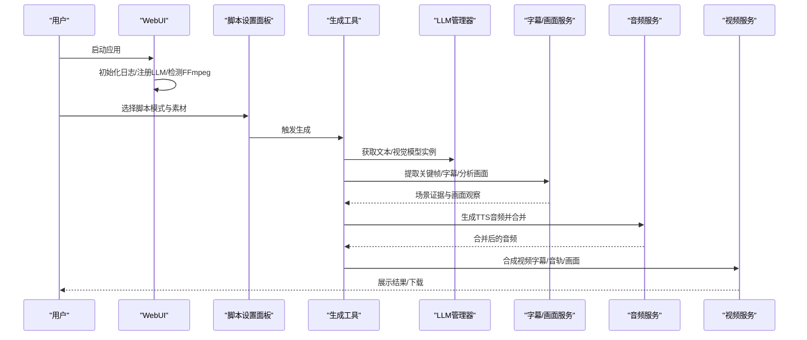
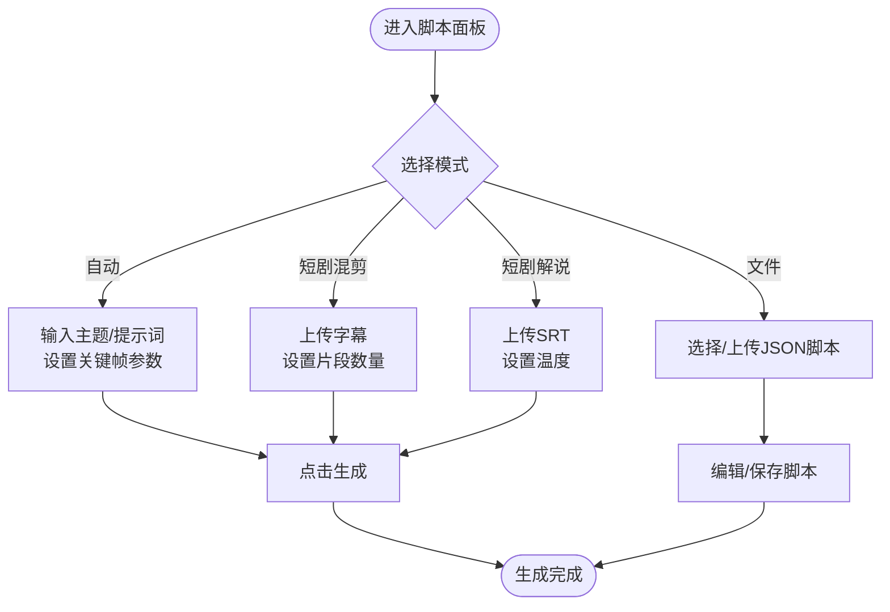
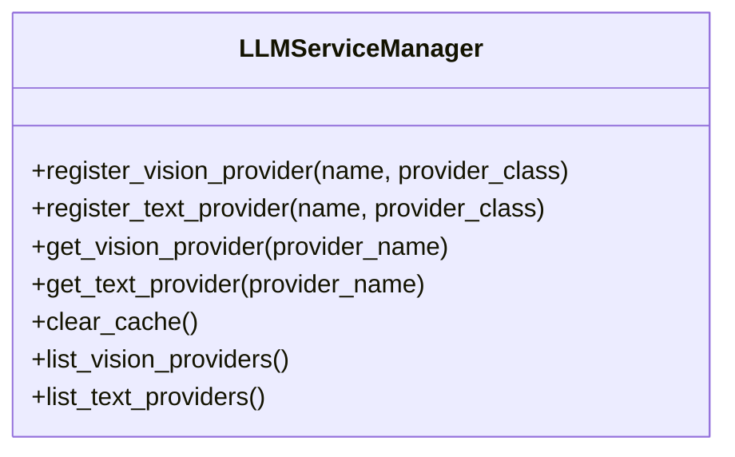
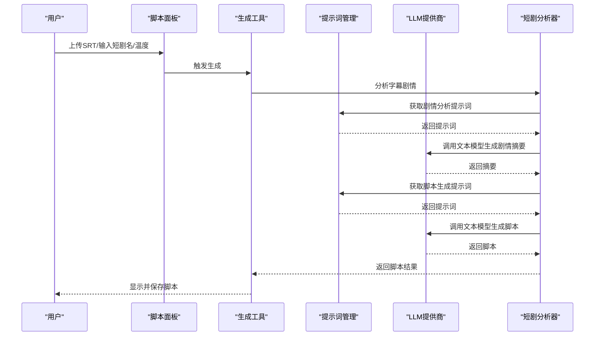
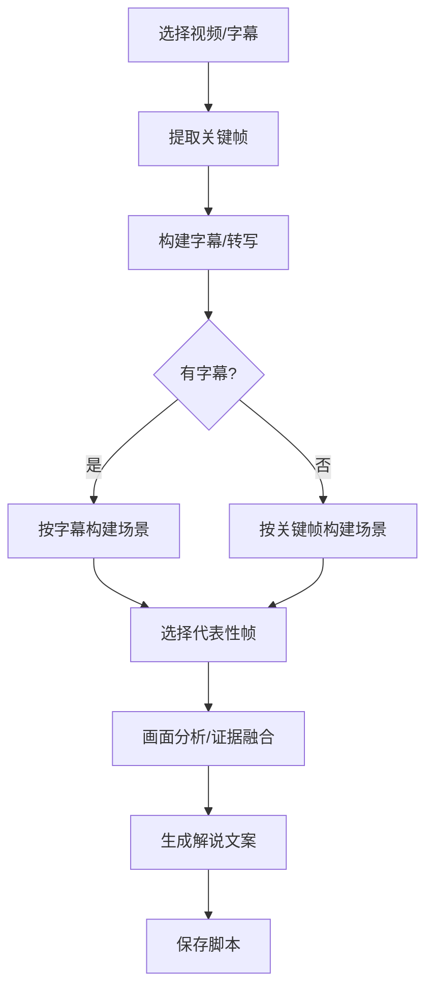
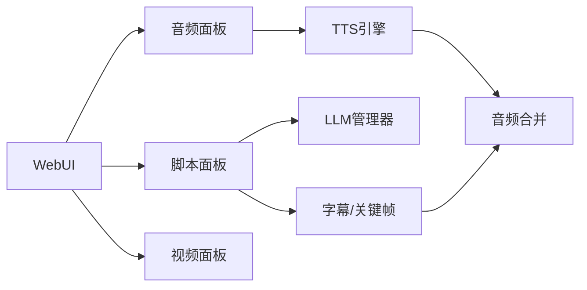

# 使用技巧

<cite>
**本文引用的文件**
- [README.md](file://README.md)
- [webui.py](file://webui.py)
- [app/services/llm/manager.py](file://app/services/llm/manager.py)
- [app/services/SDE/short_drama_explanation.py](file://app/services/SDE/short_drama_explanation.py)
- [app/services/SDP/generate_script_short.py](file://app/services/SDP/generate_script_short.py)
- [webui/components/script_settings.py](file://webui/components/script_settings.py)
- [webui/components/audio_settings.py](file://webui/components/audio_settings.py)
- [webui/components/video_settings.py](file://webui/components/video_settings.py)
- [app/services/subtitle.py](file://app/services/subtitle.py)
- [app/services/audio_merger.py](file://app/services/audio_merger.py)
- [webui/tools/generate_script_docu.py](file://webui/tools/generate_script_docu.py)
- [webui/tools/generate_script_short.py](file://webui/tools/generate_script_short.py)
- [app/models/schema.py](file://app/models/schema.py)
</cite>

## 目录
1. [简介](#简介)
2. [项目结构](#项目结构)
3. [核心组件](#核心组件)
4. [架构总览](#架构总览)
5. [详细组件解析](#详细组件解析)
6. [依赖关系分析](#依赖关系分析)
7. [性能与参数优化](#性能与参数优化)
8. [故障排查指南](#故障排查指南)
9. [结论](#结论)
10. [附录](#附录)

## 简介
本指南面向希望高效使用NarratoAI进行AI影视解说与自动化剪辑的创作者。内容覆盖素材准备、参数设置、脚本生成技巧、不同场景的最佳流程、界面操作要点（含快捷键与批量处理思路）、模型与TTS引擎选择建议、字幕同步与音频混合等高级功能，并提供可复现的操作步骤与案例。

## 项目结构
NarratoAI采用WebUI + 服务层的分层设计：Streamlit作为前端入口，组件负责参数收集与可视化；服务层封装LLM、字幕、音频、视频处理等能力；模型层通过统一管理器对接多家供应商。

图示来源
- [webui.py:227-294](file://webui.py#L227-L294)
- [webui/components/script_settings.py:18-552](file://webui/components/script_settings.py#L18-L552)
- [webui/components/audio_settings.py:83-944](file://webui/components/audio_settings.py#L83-L944)
- [webui/components/video_settings.py:5-63](file://webui/components/video_settings.py#L5-L63)
- [webui/tools/generate_script_docu.py:23-179](file://webui/tools/generate_script_docu.py#L23-L179)
- [webui/tools/generate_script_short.py:13-128](file://webui/tools/generate_script_short.py#L13-L128)
- [app/services/SDP/generate_script_short.py:12-126](file://app/services/SDP/generate_script_short.py#L12-L126)
- [app/services/SDE/short_drama_explanation.py:625-778](file://app/services/SDE/short_drama_explanation.py#L625-L778)
- [app/services/subtitle.py:26-467](file://app/services/subtitle.py#L26-L467)
- [app/services/audio_merger.py:21-172](file://app/services/audio_merger.py#L21-L172)
- [app/models/schema.py:160-209](file://app/models/schema.py#L160-L209)

章节来源
- [webui.py:227-294](file://webui.py#L227-L294)
- [README.md:105-141](file://README.md#L105-L141)

## 核心组件
- WebUI入口与状态管理：负责页面初始化、日志过滤、LLM提供商注册、FFmpeg检测、全局状态与生成按钮渲染。
- 脚本设置面板：支持“文件/自动/短剧混剪/短剧解说”四种模式，提供脚本上传、编辑、保存与生成。
- 音频设置面板：统一管理TTS引擎（Edge TTS、Azure、腾讯云、Qwen3、IndexTTS2等），提供试听与参数调节。
- 视频设置面板：视频比例、画质、原声音量等参数。
- LLM管理器：集中注册与获取文本/视觉模型提供商实例，支持缓存与配置校验。
- 字幕与画面分析：Whisper转写、Gemini转写、关键帧提取、画面观察与证据融合。
- 短剧脚本管线：短剧剧情分析、片段合并与脚本生成。
- 音频合并：基于脚本时间轴叠加TTS音频，生成最终音频。

章节来源
- [webui.py:112-294](file://webui.py#L112-L294)
- [webui/components/script_settings.py:18-552](file://webui/components/script_settings.py#L18-L552)
- [webui/components/audio_settings.py:83-944](file://webui/components/audio_settings.py#L83-L944)
- [webui/components/video_settings.py:5-63](file://webui/components/video_settings.py#L5-L63)
- [app/services/llm/manager.py:15-246](file://app/services/llm/manager.py#L15-L246)
- [app/services/subtitle.py:26-467](file://app/services/subtitle.py#L26-L467)
- [app/services/SDE/short_drama_explanation.py:625-778](file://app/services/SDE/short_drama_explanation.py#L625-L778)
- [app/services/SDP/generate_script_short.py:12-126](file://app/services/SDP/generate_script_short.py#L12-L126)
- [app/services/audio_merger.py:21-172](file://app/services/audio_merger.py#L21-L172)

## 架构总览
NarratoAI的生成流程围绕“脚本生成 → 音频合成 → 字幕同步 → 视频合成”的主线展开。WebUI负责参数收集与进度反馈，服务层负责具体算法与第三方集成。

图示来源
- [webui.py:227-294](file://webui.py#L227-L294)
- [webui/components/script_settings.py:404-437](file://webui/components/script_settings.py#L404-L437)
- [webui/tools/generate_script_docu.py:23-179](file://webui/tools/generate_script_docu.py#L23-L179)
- [app/services/llm/manager.py:68-209](file://app/services/llm/manager.py#L68-L209)
- [app/services/subtitle.py:383-467](file://app/services/subtitle.py#L383-L467)
- [app/services/audio_merger.py:21-77](file://app/services/audio_merger.py#L21-L77)

## 详细组件解析

### 脚本生成与参数设置
- 模式选择
  - 文件模式：直接加载本地JSON脚本，支持上传与历史脚本列表。
  - 自动模式：基于画面与字幕生成纪录片风格脚本，支持主题与提示词定制。
  - 短剧混剪：基于字幕与自定义片段数生成短视频脚本。
  - 短剧解说：上传SRT字幕后，进行剧情分析与脚本生成。
- 参数收集
  - 视频文件与脚本文件选择、视频主题与提示词、关键帧间隔与批大小、短剧片段数量、温度系数等。
- 保存与校验
  - 支持脚本格式校验与保存，失败时给出示例格式与错误说明。

图示来源
- [webui/components/script_settings.py:18-552](file://webui/components/script_settings.py#L18-L552)

章节来源
- [webui/components/script_settings.py:18-552](file://webui/components/script_settings.py#L18-L552)

### LLM提供商管理与模型选择
- 统一注册与获取：应用启动时显式注册提供商，随后通过管理器按名称获取实例，支持缓存与配置校验。
- 视觉/文本模型分离：分别维护提供商字典与实例缓存，避免重复初始化。
- 适配多供应商：支持Gemini、OpenAI兼容接口等，便于切换与扩展。

图示来源
- [app/services/llm/manager.py:15-246](file://app/services/llm/manager.py#L15-L246)

章节来源
- [app/services/llm/manager.py:15-246](file://app/services/llm/manager.py#L15-L246)
- [webui.py:232-246](file://webui.py#L232-L246)

### 短剧脚本生成（剧情分析+脚本生成）
- 输入：字幕文件或字幕内容，短剧名称，温度系数。
- 流程：剧情分析 → 解说脚本生成 → 保存结果。
- 输出：可直接用于视频合成的JSON脚本。

图示来源
- [webui/tools/generate_script_short.py:13-128](file://webui/tools/generate_script_short.py#L13-L128)
- [app/services/SDE/short_drama_explanation.py:625-778](file://app/services/SDE/short_drama_explanation.py#L625-L778)
- [app/services/SDP/generate_script_short.py:12-126](file://app/services/SDP/generate_script_short.py#L12-L126)

章节来源
- [webui/tools/generate_script_short.py:13-128](file://webui/tools/generate_script_short.py#L13-L128)
- [app/services/SDE/short_drama_explanation.py:625-778](file://app/services/SDE/short_drama_explanation.py#L625-L778)
- [app/services/SDP/generate_script_short.py:12-126](file://app/services/SDP/generate_script_short.py#L12-L126)

### 纪录片脚本生成（字幕优先）
- 输入：视频文件（可选字幕），关键帧参数，字幕/转写来源。
- 流程：关键帧提取 → 字幕/转写 → 场景构建 → 代表性帧选择 → 画面分析 → 证据融合 → 解说文案生成 → 保存脚本。
- 优势：字幕主链更稳定，成本更低；无字幕时退回视觉主导模式。

图示来源
- [webui/tools/generate_script_docu.py:23-179](file://webui/tools/generate_script_docu.py#L23-L179)
- [app/services/subtitle.py:383-467](file://app/services/subtitle.py#L383-L467)

章节来源
- [webui/tools/generate_script_docu.py:23-179](file://webui/tools/generate_script_docu.py#L23-L179)
- [app/services/subtitle.py:26-467](file://app/services/subtitle.py#L26-L467)

### 音频与TTS引擎配置
- 引擎选择：Edge TTS、Azure Speech、腾讯云TTS、Qwen3 TTS、IndexTTS2（语音克隆）。
- 参数调节：音量、语速、语调（部分引擎支持），并提供试听功能。
- 语音克隆：IndexTTS2需准备参考音频，支持推理模式与高级采样参数。

章节来源
- [webui/components/audio_settings.py:83-944](file://webui/components/audio_settings.py#L83-L944)

### 字幕同步与音频混合
- 字幕生成：支持Whisper本地模型与Gemini在线模型；可从视频提取音频后转写。
- 字幕修正：基于脚本相似度合并/对齐，减少人工修正工作量。
- 音频混合：按脚本时间轴叠加TTS音频，生成最终音频文件。

章节来源
- [app/services/subtitle.py:26-467](file://app/services/subtitle.py#L26-L467)
- [app/services/audio_merger.py:21-172](file://app/services/audio_merger.py#L21-L172)

## 依赖关系分析
- 组件耦合
  - WebUI与组件：松耦合，通过session_state传递参数。
  - 组件与服务：组件仅负责UI与参数收集，业务逻辑集中在服务层。
  - 服务层内部：LLM管理器集中化，避免重复初始化；字幕/画面/音频模块职责清晰。
- 外部依赖
  - FFmpeg：音频/视频处理与合并依赖。
  - Whisper/Gemini：字幕与画面分析依赖。
  - TTS引擎：多种供应商可选，便于成本与质量权衡。

图示来源
- [webui.py:227-294](file://webui.py#L227-L294)
- [webui/components/script_settings.py:18-552](file://webui/components/script_settings.py#L18-L552)
- [webui/components/audio_settings.py:83-944](file://webui/components/audio_settings.py#L83-L944)
- [webui/components/video_settings.py:5-63](file://webui/components/video_settings.py#L5-L63)
- [app/services/subtitle.py:26-467](file://app/services/subtitle.py#L26-L467)
- [app/services/audio_merger.py:21-172](file://app/services/audio_merger.py#L21-L172)
- [app/services/llm/manager.py:15-246](file://app/services/llm/manager.py#L15-L246)

## 性能与参数优化
- 关键帧与批大小
  - 关键帧间隔越小，画面分析越精细但成本越高；批大小影响并发与吞吐。
  - 建议：短剧混剪场景可适当增大批大小；纪录片场景根据预算调整间隔与总帧数上限。
- LLM温度与模型
  - 温度越高创意越丰富但稳定性下降；短剧解说可适度提高以增强故事性。
  - 文本/视觉模型建议使用同一供应商以减少网络往返与格式差异。
- TTS与音量
  - 原声音量可略高于TTS以平衡音轨；背景音乐音量建议保持在较低水平以免掩盖旁白。
- FFmpeg与硬件加速
  - 若检测到硬件加速，优先使用GPU编码以提升视频合成速度；否则回退CPU。

章节来源
- [webui/tools/generate_script_docu.py:54-102](file://webui/tools/generate_script_docu.py#L54-L102)
- [webui/components/audio_settings.py:381-944](file://webui/components/audio_settings.py#L381-L944)
- [webui.py:247-258](file://webui.py#L247-L258)

## 故障排查指南
- LLM提供商未注册
  - 现象：初始化阶段报“提供商未注册”。
  - 处理：确认应用启动时已调用注册函数；检查配置项是否正确。
- FFmpeg缺失
  - 现象：音频/视频合并失败。
  - 处理：安装FFmpeg并确保环境变量生效。
- 字幕/视频文件无效
  - 现象：生成脚本报错“请选择视频/上传字幕”。
  - 处理：确认文件存在、格式正确、编码兼容（SRT支持UTF-8/UTF-16/GBK等）。
- IndexTTS2参考音频问题
  - 现象：语音克隆失败或音质不佳。
  - 处理：使用3-10秒清晰音频，避免背景噪音；调整采样参数以平衡质量与速度。

章节来源
- [app/services/llm/manager.py:84-135](file://app/services/llm/manager.py#L84-L135)
- [app/services/audio_merger.py:12-37](file://app/services/audio_merger.py#L12-L37)
- [webui/components/script_settings.py:348-394](file://webui/components/script_settings.py#L348-L394)
- [webui/components/audio_settings.py:574-704](file://webui/components/audio_settings.py#L574-L704)

## 结论
通过合理的素材准备、参数优化与流程选择，NarratoAI可在短视频、纪录片与短剧等多种场景下高效产出高质量视频。建议优先使用字幕主链生成脚本，结合合适的LLM与TTS引擎，配合字幕同步与音频混合，最终完成视频合成。

## 附录

### 不同场景最佳操作流程

- 短视频制作（剧情向）
  - 步骤
    1) 准备SRT字幕文件，上传至“短剧解说”模式。
    2) 设置短剧名称与温度系数，点击生成。
    3) 生成脚本后，进入“短剧混剪”模式，设置片段数量，再次生成。
    4) 下载脚本，进入生成按钮流程，等待视频完成。
  - 关键点
    - 字幕质量直接影响脚本质量；短剧场景可适度提高温度以增强故事性。
    - 片段数量根据目标平台节奏调整（如抖音/快手建议更短）。

- 纪录片/知识类视频
  - 步骤
    1) 选择“自动”模式，上传视频（可选字幕）。
    2) 设置关键帧间隔与批大小，点击生成。
    3) 查看生成脚本，必要时进行微调。
  - 关键点
    - 有字幕时优先走字幕主链；无字幕时退回视觉主导模式，成本更高但更稳健。

- 剧情分析与深度解读
  - 步骤
    1) 使用“短剧解说”模式，上传SRT并设置温度。
    2) 生成剧情摘要与脚本，保存以便二次加工。
  - 关键点
    - 温度可设为较高值以激发创意；若追求客观性可降低温度。

章节来源
- [webui/components/script_settings.py:325-401](file://webui/components/script_settings.py#L325-L401)
- [webui/tools/generate_script_short.py:13-128](file://webui/tools/generate_script_short.py#L13-L128)
- [webui/tools/generate_script_docu.py:23-179](file://webui/tools/generate_script_docu.py#L23-L179)

### 界面操作技巧
- 快捷键与批量处理
  - 当前版本未内置快捷键，建议通过“分段控制”与“参数复用”提升效率：在“自动/短剧混剪/短剧解说”模式间切换时，尽量复用上次的参数（如关键帧间隔、批大小、温度）。
- 模板应用
  - 脚本面板支持保存脚本为JSON，便于后续“文件模式”直接加载与二次编辑。
- 试听与预览
  - 音频面板提供“试听语音合成”，可快速验证TTS效果与参数设置。

章节来源
- [webui/components/script_settings.py:438-538](file://webui/components/script_settings.py#L438-L538)
- [webui/components/audio_settings.py:706-782](file://webui/components/audio_settings.py#L706-L782)

### 字幕同步与音频混合
- 字幕生成与修正
  - Whisper本地模型：需提前下载模型文件；支持VAD降噪与词级别时间戳。
  - Gemini在线模型：适合少量试用或补充场景。
  - 字幕修正：基于脚本相似度自动合并/对齐，减少人工干预。
- 音频混合
  - 按脚本时间轴叠加TTS音频，保留无音频片段的静音间隔，最终导出MP3。

章节来源
- [app/services/subtitle.py:26-467](file://app/services/subtitle.py#L26-L467)
- [app/services/audio_merger.py:21-172](file://app/services/audio_merger.py#L21-L172)

### 模型与TTS引擎选择建议
- LLM
  - 文档/剧情分析：优先选择支持JSON输出的模型；温度0.7左右平衡创意与稳定性。
  - 视觉分析：与文本模型同源可减少跨供应商适配成本。
- TTS
  - Edge TTS：免费但稳定性一般，适合轻量测试。
  - Azure/Qwen3/Tencent：音质与稳定性更好，适合正式发布。
  - IndexTTS2：零样本语音克隆，适合品牌化旁白；需准备高质量参考音频。

章节来源
- [app/services/llm/manager.py:68-209](file://app/services/llm/manager.py#L68-L209)
- [webui/components/audio_settings.py:22-66](file://webui/components/audio_settings.py#L22-L66)