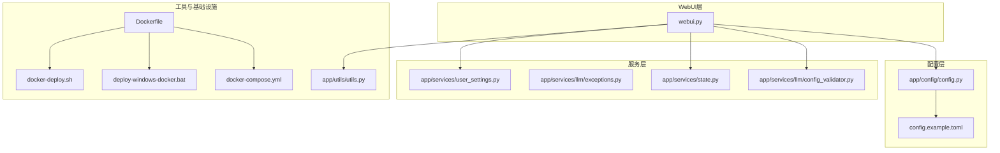
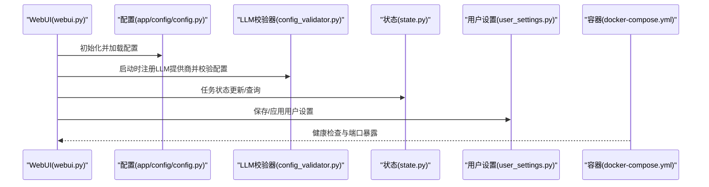
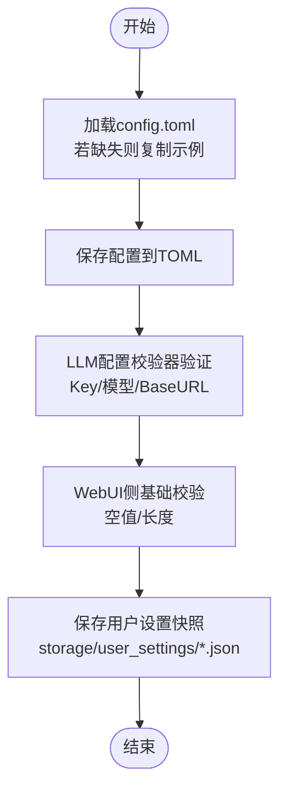
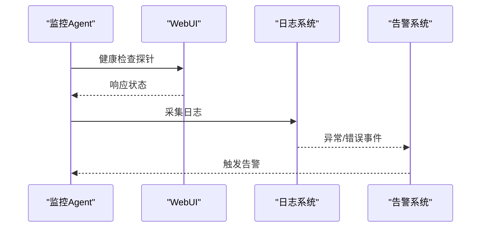
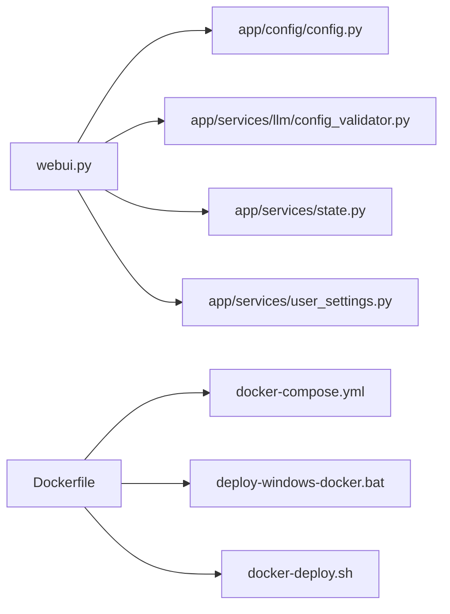

# 安全防护

<cite>
**本文引用的文件**
- [README.md](file://README.md)
- [config.example.toml](file://config.example.toml)
- [app/config/config.py](file://app/config/config.py)
- [webui.py](file://webui.py)
- [app/services/llm/config_validator.py](file://app/services/llm/config_validator.py)
- [app/services/llm/exceptions.py](file://app/services/llm/exceptions.py)
- [app/utils/utils.py](file://app/utils/utils.py)
- [app/services/state.py](file://app/services/state.py)
- [app/services/user_settings.py](file://app/services/user_settings.py)
- [docker-compose.yml](file://docker-compose.yml)
- [Dockerfile](file://Dockerfile)
- [deploy-windows-docker.bat](file://deploy-windows-docker.bat)
- [docker-deploy.sh](file://docker-deploy.sh)
</cite>

## 目录
1. [简介](#简介)
2. [项目结构](#项目结构)
3. [核心组件](#核心组件)
4. [架构总览](#架构总览)
5. [详细组件分析](#详细组件分析)
6. [依赖关系分析](#依赖关系分析)
7. [性能与安全特性](#性能与安全特性)
8. [故障排查指南](#故障排查指南)
9. [结论](#结论)
10. [附录](#附录)

## 简介
本指南面向NarratoAI的安全运营与运维团队，围绕API密钥与敏感信息管理、数据保护、访问控制与权限、网络安全、安全审计与监控、合规与最佳实践以及安全配置检查清单与风险评估方法，提供系统化的落地建议。文档严格基于仓库现有实现与配置文件进行分析，避免臆测。

## 项目结构
NarratoAI采用WebUI前端（Streamlit）+ 后端服务模块的组织方式，配置集中于TOML文件并通过Python模块加载；容器化部署通过Dockerfile与docker-compose实现。关键安全相关位置如下：
- 配置与密钥：config.example.toml（示例配置）、app/config/config.py（加载与保存配置）
- WebUI入口与日志：webui.py（页面初始化、日志过滤）
- LLM配置校验：app/services/llm/config_validator.py（配置有效性与建议）
- 异常与错误分类：app/services/llm/exceptions.py（认证、速率限制、内容过滤等）
- 状态与会话：app/services/state.py（任务状态存储）、app/services/user_settings.py（用户配置持久化）
- 容器与部署：Dockerfile、docker-compose.yml、部署脚本（deploy-windows-docker.bat、docker-deploy.sh）

**图表来源**
- [webui.py:1-294](file://webui.py#L1-L294)
- [app/config/config.py:1-95](file://app/config/config.py#L1-L95)
- [config.example.toml:1-177](file://config.example.toml#L1-L177)
- [app/services/llm/config_validator.py:1-309](file://app/services/llm/config_validator.py#L1-L309)
- [app/services/llm/exceptions.py:81-118](file://app/services/llm/exceptions.py#L81-L118)
- [app/services/state.py:1-123](file://app/services/state.py#L1-L123)
- [app/services/user_settings.py:1-131](file://app/services/user_settings.py#L1-L131)
- [Dockerfile:1-89](file://Dockerfile#L1-L89)
- [docker-compose.yml:1-30](file://docker-compose.yml#L1-L30)
- [deploy-windows-docker.bat:111-152](file://deploy-windows-docker.bat#L111-L152)
- [docker-deploy.sh:110-184](file://docker-deploy.sh#L110-L184)

**章节来源**
- [README.md:105-141](file://README.md#L105-L141)
- [config.example.toml:1-177](file://config.example.toml#L1-L177)
- [app/config/config.py:24-58](file://app/config/config.py#L24-L58)
- [webui.py:15-294](file://webui.py#L15-L294)
- [Dockerfile:1-89](file://Dockerfile#L1-L89)
- [docker-compose.yml:1-30](file://docker-compose.yml#L1-L30)

## 核心组件
- 配置加载与保存：负责从config.toml读取配置，必要时复制示例配置；保存时写回多段配置。
- LLM配置校验器：对视觉/文本提供商的API Key、模型名、Base URL进行验证，并给出建议。
- 异常体系：对认证失败、速率限制、内容过滤等进行分类，便于定位与告警。
- 状态管理：支持内存态与Redis态的任务状态存储，便于跨进程/容器的状态共享。
- 用户设置持久化：将运行时配置快照保存至storage/user_settings目录，支持多配置文件。
- 日志与健康检查：WebUI侧进行日志格式化与过滤；容器侧提供健康检查与端口暴露。

**章节来源**
- [app/config/config.py:24-58](file://app/config/config.py#L24-L58)
- [app/services/llm/config_validator.py:19-85](file://app/services/llm/config_validator.py#L19-L85)
- [app/services/llm/exceptions.py:81-118](file://app/services/llm/exceptions.py#L81-L118)
- [app/services/state.py:109-122](file://app/services/state.py#L109-L122)
- [app/services/user_settings.py:100-131](file://app/services/user_settings.py#L100-L131)
- [webui.py:35-110](file://webui.py#L35-L110)
- [docker-compose.yml:24-29](file://docker-compose.yml#L24-L29)

## 架构总览
下图展示WebUI、配置、LLM校验、状态与用户设置之间的交互关系，以及容器化部署与健康检查。

**图表来源**
- [webui.py:227-246](file://webui.py#L227-L246)
- [app/config/config.py:24-58](file://app/config/config.py#L24-L58)
- [app/services/llm/config_validator.py:19-85](file://app/services/llm/config_validator.py#L19-L85)
- [app/services/state.py:18-46](file://app/services/state.py#L18-L46)
- [app/services/user_settings.py:100-131](file://app/services/user_settings.py#L100-L131)
- [docker-compose.yml:24-29](file://docker-compose.yml#L24-L29)

## 详细组件分析

### API密钥与敏感信息管理
- 配置文件与密钥存放
  - 示例配置文件包含各类API Key字段（如LLM、TTS等），建议在生产环境中替换为真实密钥。
  - 配置加载逻辑会在缺失时复制示例文件，避免因文件不存在导致的启动失败。
- 配置保存与覆盖
  - 保存函数将多段配置写回TOML文件，注意保存前应确保敏感字段已正确填充。
- WebUI侧密钥校验
  - 基础校验包括空值与长度检查，可作为前端提示与二次确认的基础。
- 用户设置持久化
  - 用户设置快照保存在storage/user_settings目录，包含允许的敏感键集合，便于后续审计与迁移。

**图表来源**
- [app/config/config.py:24-58](file://app/config/config.py#L24-L58)
- [config.example.toml:34-50](file://config.example.toml#L34-L50)
- [app/services/llm/config_validator.py:105-142](file://app/services/llm/config_validator.py#L105-L142)
- [webui.py:60-69](file://webui.py#L60-L69)
- [app/services/user_settings.py:100-131](file://app/services/user_settings.py#L100-L131)

**章节来源**
- [config.example.toml:34-50](file://config.example.toml#L34-L50)
- [app/config/config.py:24-58](file://app/config/config.py#L24-L58)
- [app/services/llm/config_validator.py:105-142](file://app/services/llm/config_validator.py#L105-L142)
- [webui.py:60-69](file://webui.py#L60-L69)
- [app/services/user_settings.py:100-131](file://app/services/user_settings.py#L100-L131)

### 数据保护措施
- 传输安全
  - 配置文件与用户设置均为本地文件，未见TLS/HTTPS传输逻辑；建议在容器外通过只读挂载或受限权限控制访问。
- 存储安全
  - 容器卷挂载storage与resource目录，需结合文件系统权限与最小权限原则进行加固。
- 日志与敏感信息
  - 日志过滤器会屏蔽部分噪声；建议在生产环境关闭DEBUG级别或增加更严格的脱敏规则。

**章节来源**
- [docker-compose.yml:12-16](file://docker-compose.yml#L12-L16)
- [webui.py:55-109](file://webui.py#L55-L109)

### 访问控制与权限管理
- 认证与会话
  - WebUI未内置用户认证与会话管理逻辑；当前实现为无状态界面。
- 权限验证
  - 未见细粒度权限控制；建议在部署层通过反向代理或网关实现访问控制与鉴权。
- 任务状态
  - 支持内存态与Redis态；Redis态需谨慎配置密码与网络隔离。

**章节来源**
- [webui.py:227-246](file://webui.py#L227-L246)
- [app/services/state.py:49-88](file://app/services/state.py#L49-L88)

### 网络安全建议
- 代理与网络
  - 配置文件支持HTTP/HTTPS代理开关与地址；建议在容器内通过环境变量或代理服务统一出口。
- 防火墙与端口
  - 容器暴露8501端口，建议仅对可信网段开放；结合反向代理实现TLS终止与WAF。
- 网络隔离
  - 建议将LLM/TTS提供商域名加入白名单，限制出站访问；容器网络与主机网络隔离。

**章节来源**
- [config.example.toml:160-166](file://config.example.toml#L160-L166)
- [docker-compose.yml:9-11](file://docker-compose.yml#L9-L11)
- [Dockerfile:80-82](file://Dockerfile#L80-L82)

### 安全审计与监控
- 日志
  - WebUI侧设置日志格式与过滤器；建议启用文件落盘与轮转策略。
- 健康检查
  - 容器健康检查通过WebUI内部端点探测，可用于Kubernetes滚动升级与自愈。
- 异常与错误
  - LLM异常体系区分认证、速率限制、内容过滤等，便于告警与恢复。

**图表来源**
- [webui.py:35-110](file://webui.py#L35-L110)
- [docker-compose.yml:24-29](file://docker-compose.yml#L24-L29)
- [app/services/llm/exceptions.py:81-118](file://app/services/llm/exceptions.py#L81-L118)

**章节来源**
- [webui.py:35-110](file://webui.py#L35-L110)
- [docker-compose.yml:24-29](file://docker-compose.yml#L24-L29)
- [app/services/llm/exceptions.py:81-118](file://app/services/llm/exceptions.py#L81-L118)

### 合规性与最佳实践
- 数据隐私
  - 未见内置数据去标识化或加密存储逻辑；建议在存储层引入文件级加密与访问控制。
- 第三方服务安全
  - LLM/TTS提供商API Key需最小权限与轮换策略；建议通过密钥管理服务（如Vault/KMS）集中管理。
- 配置与密钥
  - 避免将密钥提交至版本库；使用环境注入或密钥管理服务；定期轮换。

**章节来源**
- [config.example.toml:52-63](file://config.example.toml#L52-L63)
- [app/services/llm/config_validator.py:202-249](file://app/services/llm/config_validator.py#L202-L249)

## 依赖关系分析
- 组件耦合
  - WebUI依赖配置模块与LLM校验器；状态与用户设置模块独立，通过配置进行初始化。
- 外部依赖
  - 容器镜像包含ffmpeg、imagemagick等多媒体工具；Dockerfile中对ImageMagick策略进行了调整以支持写入。
- 部署依赖
  - docker-compose定义了卷挂载与健康检查；部署脚本负责环境准备与服务启动。

**图表来源**
- [webui.py:15-294](file://webui.py#L15-L294)
- [app/config/config.py:1-95](file://app/config/config.py#L1-L95)
- [app/services/llm/config_validator.py:1-309](file://app/services/llm/config_validator.py#L1-L309)
- [app/services/state.py:1-123](file://app/services/state.py#L1-123)
- [app/services/user_settings.py:1-131](file://app/services/user_settings.py#L1-L131)
- [Dockerfile:1-89](file://Dockerfile#L1-L89)
- [docker-compose.yml:1-30](file://docker-compose.yml#L1-L30)
- [deploy-windows-docker.bat:111-152](file://deploy-windows-docker.bat#L111-L152)
- [docker-deploy.sh:110-184](file://docker-deploy.sh#L110-L184)

**章节来源**
- [Dockerfile:51-62](file://Dockerfile#L51-L62)
- [docker-compose.yml:12-16](file://docker-compose.yml#L12-L16)

## 性能与安全特性
- 性能
  - FFmpeg硬件加速检测与日志记录，有助于在具备GPU的环境中提升处理性能。
- 安全
  - 日志过滤与健康检查；容器内非root用户运行；ImageMagick策略调整以支持写入。

**章节来源**
- [webui.py:247-258](file://webui.py#L247-L258)
- [Dockerfile:77-78](file://Dockerfile#L77-L78)
- [Dockerfile:59](file://Dockerfile#L59)

## 故障排查指南
- 配置加载失败
  - 检查config.toml是否存在与可读；若缺失将自动复制示例文件。
- LLM配置校验失败
  - 核对API Key、模型名与Base URL；查看校验器输出的错误与警告。
- 任务状态异常
  - 若启用Redis态，检查Redis连接参数与网络连通性；否则确认内存态是否被意外重置。
- 日志与健康检查
  - 关注WebUI日志过滤后的输出；容器健康检查失败时检查WebUI内部端点可达性。

**章节来源**
- [app/config/config.py:24-58](file://app/config/config.py#L24-L58)
- [app/services/llm/config_validator.py:280-309](file://app/services/llm/config_validator.py#L280-L309)
- [app/services/state.py:109-122](file://app/services/state.py#L109-L122)
- [webui.py:55-109](file://webui.py#L55-L109)
- [docker-compose.yml:24-29](file://docker-compose.yml#L24-L29)

## 结论
本指南基于仓库现有实现，总结了配置加载、LLM校验、日志与健康检查、状态与用户设置等关键安全相关路径，并结合容器化部署提出网络安全与合规建议。建议在生产环境中补充密钥管理、访问控制、日志脱敏与文件系统加密等纵深防御措施。

## 附录

### 安全配置检查清单
- 配置与密钥
  - [ ] config.toml已存在且包含所有必需API Key
  - [ ] 示例配置未被提交至版本库
  - [ ] 用户设置快照仅保存在受控目录
- 网络与容器
  - [ ] 仅对可信网段开放8501端口
  - [ ] 代理配置按需启用并验证
  - [ ] 容器以非root用户运行
- 日志与监控
  - [ ] 日志过滤生效，敏感信息未泄露
  - [ ] 健康检查端点可用
  - [ ] 异常分类清晰，具备告警通道
- 合规与审计
  - [ ] 密钥轮换策略已制定并演练
  - [ ] 第三方服务API Key最小权限
  - [ ] 审计日志保留与备份策略明确

### 风险评估方法
- 风险识别
  - API Key泄露、配置文件未加密、容器权限过大、日志含敏感信息、网络未隔离。
- 影响度与概率
  - 对业务影响高、发生概率中等；建议优先处理。
- 控制措施
  - 密钥管理服务、只读挂载、最小权限、日志脱敏、网络ACL与WAF。
- 持续改进
  - 定期渗透测试、配置扫描、变更审计与演练。