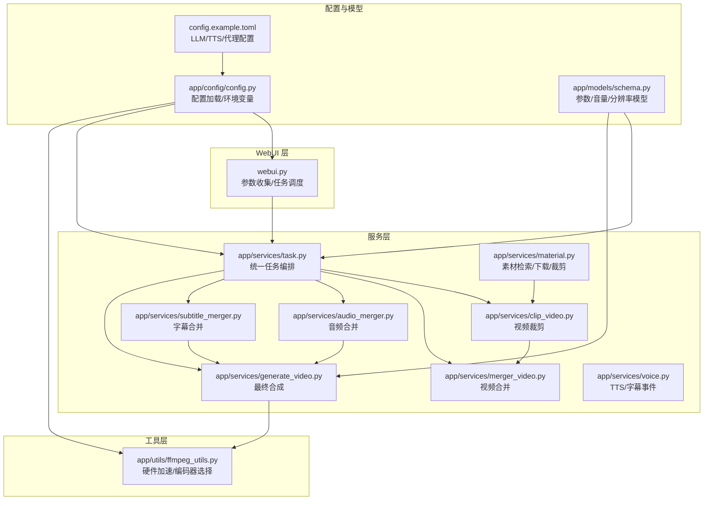
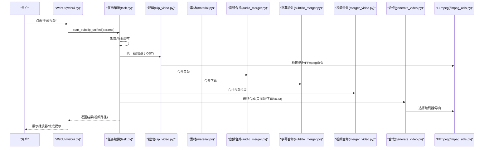
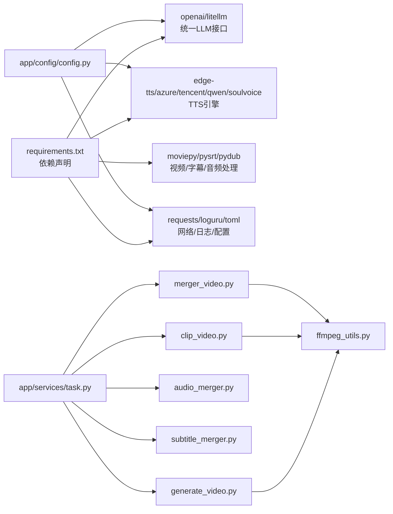

# 工作流程优化

<cite>
**本文引用的文件**
- [README.md](file://README.md)
- [webui.py](file://webui.py)
- [app/config/config.py](file://app/config/config.py)
- [config.example.toml](file://config.example.toml)
- [requirements.txt](file://requirements.txt)
- [app/services/task.py](file://app/services/task.py)
- [app/models/schema.py](file://app/models/schema.py)
- [app/utils/ffmpeg_utils.py](file://app/utils/ffmpeg_utils.py)
- [app/services/material.py](file://app/services/material.py)
- [app/services/clip_video.py](file://app/services/clip_video.py)
- [app/services/merger_video.py](file://app/services/merger_video.py)
- [app/services/audio_merger.py](file://app/services/audio_merger.py)
- [app/services/subtitle_merger.py](file://app/services/subtitle_merger.py)
- [app/services/generate_video.py](file://app/services/generate_video.py)
- [app/services/voice.py](file://app/services/voice.py)
</cite>

## 目录
1. [简介](#简介)
2. [项目结构](#项目结构)
3. [核心组件](#核心组件)
4. [架构总览](#架构总览)
5. [详细组件分析](#详细组件分析)
6. [依赖关系分析](#依赖关系分析)
7. [性能考量](#性能考量)
8. [故障排查指南](#故障排查指南)
9. [结论](#结论)
10. [附录](#附录)

## 简介
本指南面向内容创作者、短视频制作者与影视解说从业者，围绕 NarratoAI 的自动化视频生成能力，系统讲解如何建立高效的工作流程：从素材整理、自动剪辑、批量导出，到模板化流程设计、角色化工作建议、外部工具整合、项目与版本管理以及效率提升技巧。文档结合代码级架构与实际文件路径，帮助读者快速落地并稳定复用。

## 项目结构
NarratoAI 采用“WebUI + 服务层 + 工具层”的分层架构：
- WebUI 层：Streamlit 页面负责参数收集与任务调度
- 服务层：任务编排、脚本处理、TTS、剪辑、合并、字幕与音视频合成
- 工具层：FFmpeg 硬件加速检测与命令构建、媒体探测、资源管理

图示来源
- [webui.py:227-294](file://webui.py#L227-L294)
- [app/services/task.py:195-247](file://app/services/task.py#L195-L247)
- [app/services/clip_video.py:143-200](file://app/services/clip_video.py#L143-L200)
- [app/services/merger_video.py:101-128](file://app/services/merger_video.py#L101-L128)
- [app/services/audio_merger.py:21-77](file://app/services/audio_merger.py#L21-L77)
- [app/services/subtitle_merger.py:62-185](file://app/services/subtitle_merger.py#L62-L185)
- [app/services/generate_video.py:66-404](file://app/services/generate_video.py#L66-L404)
- [app/utils/ffmpeg_utils.py:252-355](file://app/utils/ffmpeg_utils.py#L252-L355)
- [app/config/config.py:24-95](file://app/config/config.py#L24-L95)
- [app/models/schema.py:160-209](file://app/models/schema.py#L160-L209)
- [config.example.toml:1-177](file://config.example.toml#L1-L177)

章节来源
- [README.md:105-141](file://README.md#L105-L141)
- [webui.py:227-294](file://webui.py#L227-L294)
- [app/config/config.py:24-95](file://app/config/config.py#L24-L95)

## 核心组件
- 任务编排器：统一调度脚本准备、TTS、视频裁剪、音频/字幕合并、视频合并与最终合成
- 视频处理管线：FFmpeg 硬件加速检测与编码器选择、裁剪、合并、最终合成
- 素材管理：在线素材检索、下载、本地缓存与片段裁剪
- 音频/字幕合并：按时间轴对齐与拼接
- WebUI：参数面板、生成按钮、状态轮询与结果展示

章节来源
- [app/services/task.py:195-247](file://app/services/task.py#L195-L247)
- [app/services/generate_video.py:66-404](file://app/services/generate_video.py#L66-L404)
- [app/services/material.py:190-254](file://app/services/material.py#L190-L254)
- [app/services/audio_merger.py:21-77](file://app/services/audio_merger.py#L21-L77)
- [app/services/subtitle_merger.py:62-185](file://app/services/subtitle_merger.py#L62-L185)
- [webui.py:132-224](file://webui.py#L132-L224)

## 架构总览
统一任务流程从 WebUI 收集参数，进入任务编排器，依次完成脚本校验、TTS 生成与缓存、统一裁剪、音频/字幕合并、视频合并与最终合成，最后输出成品视频。

图示来源
- [webui.py:132-224](file://webui.py#L132-L224)
- [app/services/task.py:195-247](file://app/services/task.py#L195-L247)
- [app/services/clip_video.py:143-200](file://app/services/clip_video.py#L143-L200)
- [app/services/merger_video.py:101-128](file://app/services/merger_video.py#L101-L128)
- [app/services/audio_merger.py:21-77](file://app/services/audio_merger.py#L21-L77)
- [app/services/subtitle_merger.py:62-185](file://app/services/subtitle_merger.py#L62-L185)
- [app/services/generate_video.py:159-192](file://app/services/generate_video.py#L159-L192)
- [app/utils/ffmpeg_utils.py:778-800](file://app/utils/ffmpeg_utils.py#L778-L800)

## 详细组件分析

### WebUI 与参数收集
- 初始化日志、UI 语言、全局状态
- 渲染基础/脚本/音频/视频/字幕/系统设置面板
- 生成按钮触发统一任务流程，轮询任务状态并展示结果

章节来源
- [webui.py:35-122](file://webui.py#L35-L122)
- [webui.py:132-224](file://webui.py#L132-L224)
- [webui.py:227-294](file://webui.py#L227-L294)

### 任务编排器（统一流水线）
- 加载并校验脚本 JSON，确保时序与 TTS 结果一致性
- 构建 TTS 片段与缓存命中，缺失部分实时生成并落盘缓存
- 统一视频裁剪（基于 OST 类型），更新脚本时间轴并对齐音频时长
- 合并音频与字幕，生成最终视频片段集合
- 最终合成：合并视频、字幕、BGM 与配音，输出成品

章节来源
- [app/services/task.py:31-91](file://app/services/task.py#L31-L91)
- [app/services/task.py:195-247](file://app/services/task.py#L195-L247)

### 视频裁剪与合并
- 裁剪：解析时间戳、FFmpeg 命令构建、硬件加速参数注入、兼容性处理（避免滤镜链格式转换错误）
- 合并：逐个处理视频（分辨率/帧率/像素格式）、生成 concat 列表、执行合并

章节来源
- [app/services/clip_video.py:21-74](file://app/services/clip_video.py#L21-L74)
- [app/services/clip_video.py:143-200](file://app/services/clip_video.py#L143-L200)
- [app/services/merger_video.py:101-128](file://app/services/merger_video.py#L101-L128)
- [app/services/merger_video.py:130-200](file://app/services/merger_video.py#L130-L200)

### 素材检索与下载
- 支持 Pexels/Pixabay 视频检索与下载，按目标分辨率与时长筛选
- 本地缓存与去重，支持任务级素材目录
- 提供片段裁剪与保存，支持时间戳格式校验与边界保护

章节来源
- [app/services/material.py:39-90](file://app/services/material.py#L39-L90)
- [app/services/material.py:93-146](file://app/services/material.py#L93-L146)
- [app/services/material.py:190-254](file://app/services/material.py#L190-L254)
- [app/services/material.py:323-490](file://app/services/material.py#L323-L490)

### 音频与字幕合并
- 音频：按脚本时间轴叠加，生成总时长的静音背景，覆盖 TTS 片段
- 字幕：按 editedTimeRange 偏移合并，重建索引与时间轴

章节来源
- [app/services/audio_merger.py:21-77](file://app/services/audio_merger.py#L21-L77)
- [app/services/subtitle_merger.py:62-185](file://app/services/subtitle_merger.py#L62-L185)

### 最终合成与字幕渲染
- 合成：视频轨道 + 多音频轨道（配音/原声/BGM）+ 字幕 TextClip
- 字体/描边/位置/背景色等样式参数化
- 智能音量：根据原声与 TTS 的响度差异进行自适应调整

章节来源
- [app/services/generate_video.py:66-404](file://app/services/generate_video.py#L66-L404)
- [app/models/schema.py:16-35](file://app/models/schema.py#L16-L35)

### FFmpeg 硬件加速与编码器选择
- 自动检测平台与 GPU 厂商，按优先级测试可用硬件加速
- 提供编码器映射与参数组合，避免滤镜链格式转换错误
- 跨平台兼容：Windows/NVIDIA/AMD/Intel/macOS/Linux

章节来源
- [app/utils/ffmpeg_utils.py:252-355](file://app/utils/ffmpeg_utils.py#L252-L355)
- [app/utils/ffmpeg_utils.py:470-637](file://app/utils/ffmpeg_utils.py#L470-L637)
- [app/utils/ffmpeg_utils.py:778-800](file://app/utils/ffmpeg_utils.py#L778-L800)

### 配置与模型
- 配置加载：读取 config.toml，支持版本号、日志级别、监听端口、外部工具路径
- 示例配置：LLM（LiteLLM 统一接口）、TTS（Azure/腾讯/通义/索魂/EdgeTTS/IndexTTS2）、代理与网络
- 参数模型：视频比例/分辨率、音量默认值、字幕样式、线程数等

章节来源
- [app/config/config.py:24-95](file://app/config/config.py#L24-L95)
- [config.example.toml:1-177](file://config.example.toml#L1-L177)
- [app/models/schema.py:16-35](file://app/models/schema.py#L16-L35)
- [app/models/schema.py:160-209](file://app/models/schema.py#L160-L209)

## 依赖关系分析

图示来源
- [requirements.txt:1-39](file://requirements.txt#L1-L39)
- [app/config/config.py:24-95](file://app/config/config.py#L24-L95)
- [app/services/task.py:10-25](file://app/services/task.py#L10-L25)
- [app/utils/ffmpeg_utils.py:252-355](file://app/utils/ffmpeg_utils.py#L252-L355)

章节来源
- [requirements.txt:1-39](file://requirements.txt#L1-L39)
- [app/config/config.py:24-95](file://app/config/config.py#L24-L95)

## 性能考量
- 硬件加速优先：根据平台与 GPU 自动选择 NVENC/AMF/QSV/VideoToolbox/libx264，避免滤镜链格式转换错误
- 编码器参数：针对不同编码器设置预设、质量参数与像素格式，兼顾质量与兼容性
- 线程与并发：通过 n_threads 控制导出线程数，合理分配 CPU/GPU 资源
- 智能音量：自动分析原声与 TTS 响度差异，动态调整音量，减少人工微调
- 缓存策略：TTS 结果缓存与素材缓存，显著降低重复任务耗时

章节来源
- [app/utils/ffmpeg_utils.py:252-355](file://app/utils/ffmpeg_utils.py#L252-L355)
- [app/models/schema.py:16-35](file://app/models/schema.py#L16-L35)
- [app/services/task.py:53-91](file://app/services/task.py#L53-L91)
- [app/services/material.py:190-254](file://app/services/material.py#L190-L254)

## 故障排查指南
- FFmpeg 安装与可用性：确认系统 PATH 中存在 ffmpeg，必要时设置 IMAGEIO_FFMPEG_EXE 环境变量
- 硬件加速不可用：查看日志中硬件加速检测结果，确认驱动与编码器支持情况
- 视频裁剪报错（滤镜链格式转换）：避免在涉及滤镜处理时使用 CUDA 硬件解码，优先使用纯 NVENC 编码器
- 字幕/音频合并失败：检查字幕文件是否为空或时间戳格式，确认 editedTimeRange 与脚本时长一致
- TTS 生成异常：检查各 TTS 引擎 API Key 与网络代理配置，必要时启用重试与降级策略

章节来源
- [app/utils/ffmpeg_utils.py:118-136](file://app/utils/ffmpeg_utils.py#L118-L136)
- [app/services/clip_video.py:143-200](file://app/services/clip_video.py#L143-L200)
- [app/services/subtitle_merger.py:62-185](file://app/services/subtitle_merger.py#L62-L185)
- [config.example.toml:90-177](file://config.example.toml#L90-L177)

## 结论
NarratoAI 通过统一的任务编排、完善的硬件加速适配与参数化配置，实现了从素材到成品的自动化流水线。结合模板化工作流与角色化建议，可显著提升内容生产效率与一致性。建议在实际落地中重视配置管理、缓存策略与监控告警，以保障大规模批量生产的稳定性与可维护性。

## 附录

### 批量处理流程建议
- 素材整理
  - 使用在线素材检索（Pexels/Pixabay）按主题与分辨率筛选，设定最小时长与目标比例
  - 下载至任务级目录，启用去重与缓存，避免重复下载
- 自动剪辑
  - 统一裁剪：根据 OST 类型自动裁剪视频片段，生成 TTS 与字幕文件
  - 合并：按脚本时间轴合并音频与字幕，确保时序对齐
- 批量导出
  - 通过任务编排器循环执行多个脚本，统一合成参数与输出命名规则
  - 使用线程池/队列管理并发，避免资源争用

章节来源
- [app/services/material.py:190-254](file://app/services/material.py#L190-L254)
- [app/services/task.py:195-247](file://app/services/task.py#L195-L247)
- [app/models/schema.py:160-209](file://app/models/schema.py#L160-L209)

### 模板化工作流程设计
- 预设参数模板：视频比例、字幕样式、音量、线程数、TTS 引擎与语音
- 标准化流程：脚本 → TTS → 裁剪 → 合并 → 合成 → 归档
- 快速复用：将常用参数封装为配置文件片段，按角色/项目复用

章节来源
- [config.example.toml:1-177](file://config.example.toml#L1-L177)
- [app/models/schema.py:160-209](file://app/models/schema.py#L160-L209)

### 角色化工作建议
- 内容创作者：侧重脚本生成与字幕质量，使用高质量 TTS 与自然语速
- 短视频制作者：强调节奏感与时长控制，使用紧凑比例与高对比字幕
- 影视解说者：注重原声音量与配音平衡，启用智能音量与背景音乐淡入淡出

章节来源
- [app/models/schema.py:16-35](file://app/models/schema.py#L16-L35)
- [app/services/generate_video.py:159-192](file://app/services/generate_video.py#L159-L192)

### 外部工具与服务整合
- LLM：通过 LiteLLM 统一接口对接多家模型供应商，支持自动重试与成本统计
- TTS：支持 Azure/腾讯/通义/索魂/EdgeTTS/IndexTTS2，按需切换与灰度
- 代理与网络：统一代理配置，便于跨地区与合规访问
- 云存储与 CDN：可扩展至对象存储与分发网络，配合 WebUI 与任务编排进行远程素材与结果归档

章节来源
- [config.example.toml:1-177](file://config.example.toml#L1-L177)
- [app/config/config.py:24-95](file://app/config/config.py#L24-L95)

### 项目管理与版本控制
- 素材版本管理：以任务 ID 为根目录，按时间戳与哈希组织素材与中间产物
- 配置版本控制：将 config.toml 与模板化配置纳入版本库，区分环境与密钥
- 输出归档：统一命名规范与目录结构，便于检索与二次编辑

章节来源
- [app/services/material.py:190-254](file://app/services/material.py#L190-L254)
- [app/services/task.py:195-247](file://app/services/task.py#L195-L247)

### 效率提升工具与技巧
- 快捷操作：参数面板一键保存/恢复，生成按钮与进度轮询
- 批量操作：任务编排器支持多脚本串行/并行执行，线程数可调
- 智能推荐：基于内容类型自动推荐音量与编码器参数，减少试错成本

章节来源
- [webui.py:132-224](file://webui.py#L132-L224)
- [app/models/schema.py:16-35](file://app/models/schema.py#L16-L35)
- [app/utils/ffmpeg_utils.py:252-355](file://app/utils/ffmpeg_utils.py#L252-L355)