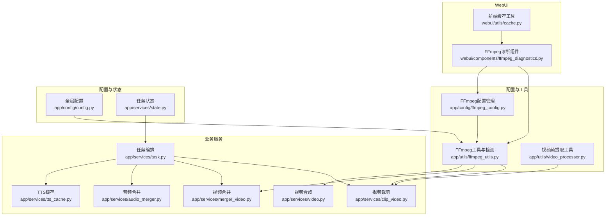
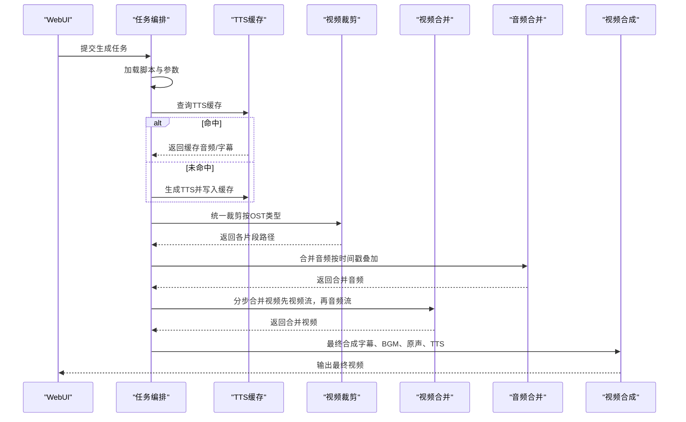
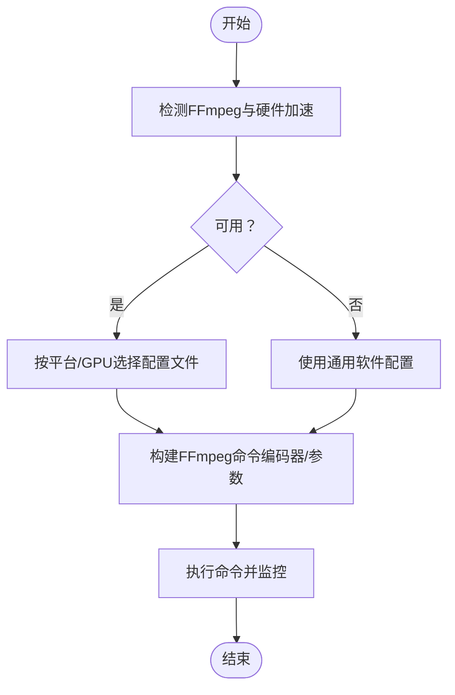
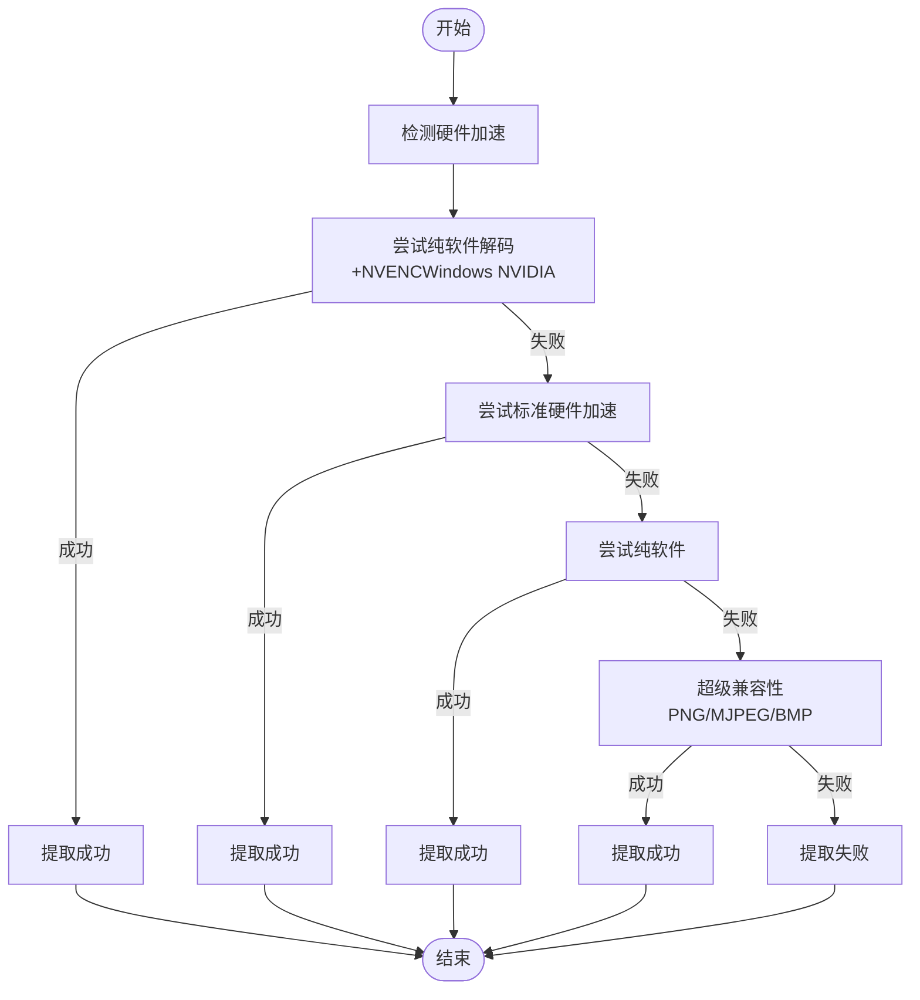
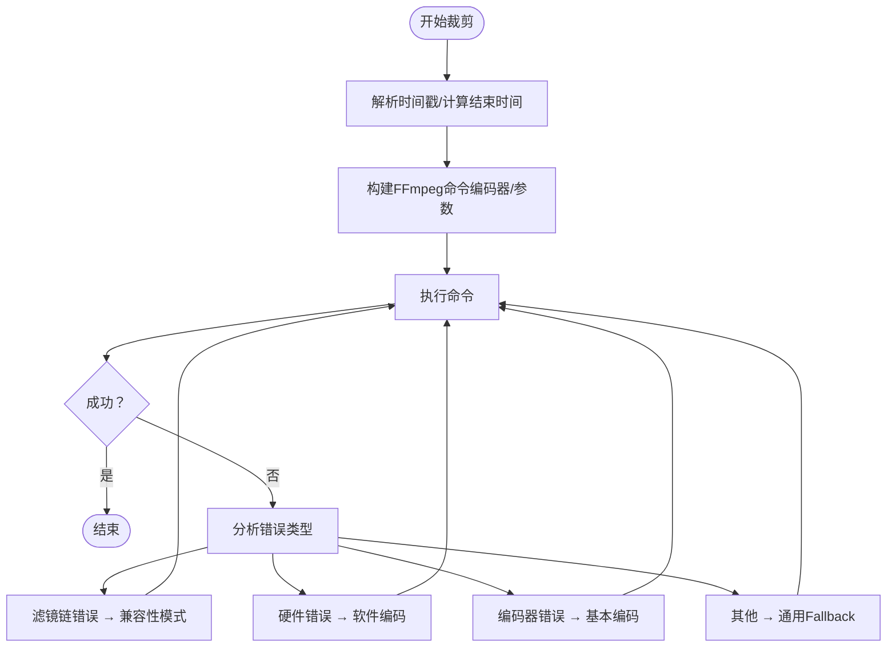
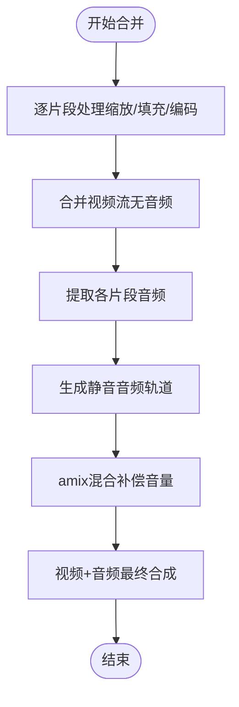
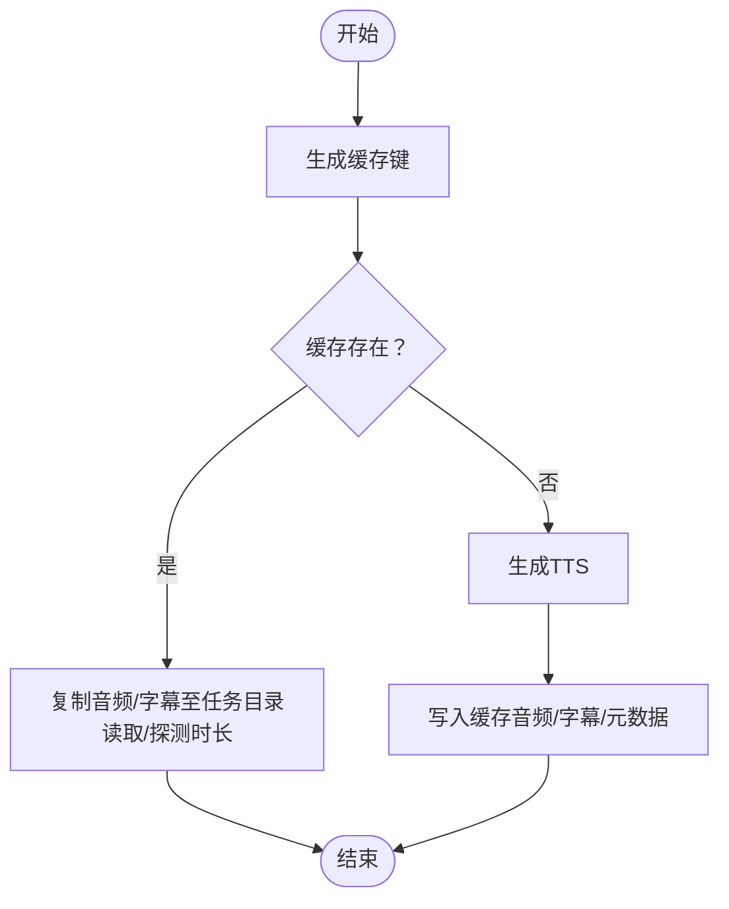
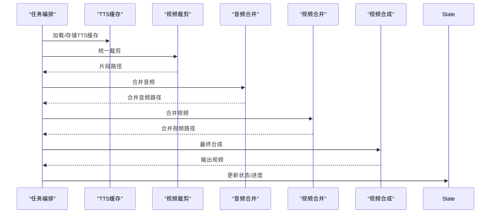
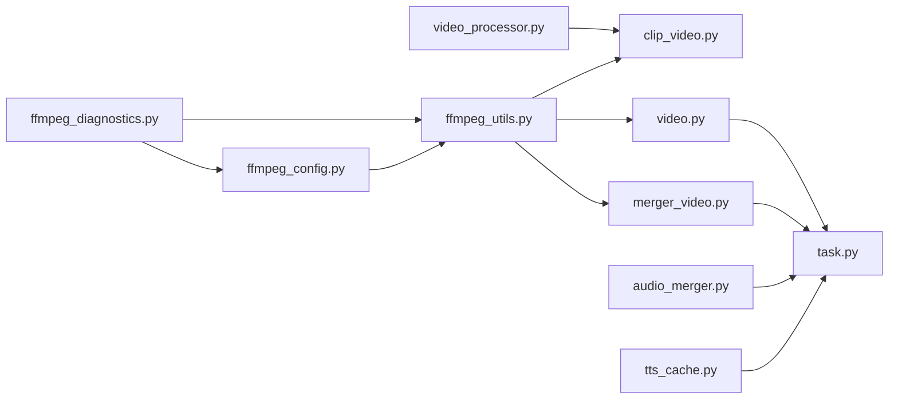

# 性能优化

<cite>
**本文引用的文件**
- [app/config/ffmpeg_config.py](file://app/config/ffmpeg_config.py)
- [app/utils/ffmpeg_utils.py](file://app/utils/ffmpeg_utils.py)
- [app/services/clip_video.py](file://app/services/clip_video.py)
- [app/services/video.py](file://app/services/video.py)
- [app/utils/video_processor.py](file://app/utils/video_processor.py)
- [app/services/tts_cache.py](file://app/services/tts_cache.py)
- [app/services/task.py](file://app/services/task.py)
- [app/services/audio_merger.py](file://app/services/audio_merger.py)
- [app/services/merger_video.py](file://app/services/merger_video.py)
- [webui/components/ffmpeg_diagnostics.py](file://webui/components/ffmpeg_diagnostics.py)
- [webui/utils/cache.py](file://webui/utils/cache.py)
- [app/config/config.py](file://app/config/config.py)
- [app/models/const.py](file://app/models/const.py)
- [app/services/state.py](file://app/services/state.py)
</cite>

## 目录
1. [简介](#简介)
2. [项目结构](#项目结构)
3. [核心组件](#核心组件)
4. [架构总览](#架构总览)
5. [详细组件分析](#详细组件分析)
6. [依赖分析](#依赖分析)
7. [性能考量](#性能考量)
8. [故障排查指南](#故障排查指南)
9. [结论](#结论)
10. [附录](#附录)

## 简介
本指南聚焦于NarratoAI的视频处理性能优化，覆盖FFmpeg参数调优、硬件加速配置、内存与I/O优化、缓存策略、并发与批处理、不同硬件配置下的调优建议、监控与调试工具使用、性能瓶颈识别与解决方法，并提供参数调整示例与效果对比思路，帮助用户在不同环境下稳定高效地生成视频。

## 项目结构
NarratoAI围绕“脚本-素材-生成”的流水线组织，关键模块包括：
- 配置与工具层：FFmpeg配置管理、硬件加速检测、通用视频处理工具
- 业务服务层：视频裁剪、音频合并、视频合并、字幕合并、TTS缓存、任务编排
- WebUI层：FFmpeg诊断界面、前端缓存工具
- 配置与状态：全局配置、任务状态持久化

图表来源
- [app/config/ffmpeg_config.py:27-158](file://app/config/ffmpeg_config.py#L27-L158)
- [app/utils/ffmpeg_utils.py:252-355](file://app/utils/ffmpeg_utils.py#L252-L355)
- [app/utils/video_processor.py:26-88](file://app/utils/video_processor.py#L26-L88)
- [app/services/clip_video.py:780-800](file://app/services/clip_video.py#L780-L800)
- [app/services/merger_video.py:328-363](file://app/services/merger_video.py#L328-L363)
- [app/services/audio_merger.py:21-37](file://app/services/audio_merger.py#L21-L37)
- [app/services/video.py:200-418](file://app/services/video.py#L200-L418)
- [app/services/tts_cache.py:45-95](file://app/services/tts_cache.py#L45-L95)
- [app/services/task.py:195-247](file://app/services/task.py#L195-L247)
- [webui/components/ffmpeg_diagnostics.py:20-108](file://webui/components/ffmpeg_diagnostics.py#L20-L108)
- [webui/utils/cache.py:6-35](file://webui/utils/cache.py#L6-L35)
- [app/config/config.py:24-44](file://app/config/config.py#L24-L44)
- [app/services/state.py:116-122](file://app/services/state.py#L116-L122)

章节来源
- [app/config/ffmpeg_config.py:27-158](file://app/config/ffmpeg_config.py#L27-L158)
- [app/utils/ffmpeg_utils.py:252-355](file://app/utils/ffmpeg_utils.py#L252-L355)
- [app/utils/video_processor.py:26-88](file://app/utils/video_processor.py#L26-L88)
- [app/services/clip_video.py:780-800](file://app/services/clip_video.py#L780-L800)
- [app/services/merger_video.py:328-363](file://app/services/merger_video.py#L328-L363)
- [app/services/audio_merger.py:21-37](file://app/services/audio_merger.py#L21-L37)
- [app/services/video.py:200-418](file://app/services/video.py#L200-L418)
- [app/services/tts_cache.py:45-95](file://app/services/tts_cache.py#L45-L95)
- [app/services/task.py:195-247](file://app/services/task.py#L195-L247)
- [webui/components/ffmpeg_diagnostics.py:20-108](file://webui/components/ffmpeg_diagnostics.py#L20-L108)
- [webui/utils/cache.py:6-35](file://webui/utils/cache.py#L6-L35)
- [app/config/config.py:24-44](file://app/config/config.py#L24-L44)
- [app/services/state.py:116-122](file://app/services/state.py#L116-L122)

## 核心组件
- FFmpeg配置管理：提供多档位配置文件（高性能、兼容性、Windows NVIDIA、macOS VideoToolbox、通用软件），自动推荐与兼容性报告，便于按平台与硬件选择最优参数。
- FFmpeg工具与检测：集中式硬件加速检测与降级策略，支持CUDA/NVENC/AMF/QSV/VAAPI/VideoToolbox等，提供编码器映射、设备探测、超时与错误处理。
- 视频处理工具：视频帧提取（关键帧）、进度条、兼容性降级方案（PNG/JPG/MJPEG/BMP回退）、超时保护。
- 视频裁剪：统一裁剪策略，避免滤镜链格式转换错误，针对Windows NVIDIA场景采用“纯NVENC编码器”避免硬件解码导致的滤镜链问题。
- 视频合并：分步合并（先视频流、再音频流），避免复杂滤镜；支持静音轨道与amix混合，兼容不同OST组合。
- 音频合并：基于时长叠加的音频拼接，FFmpeg前置校验，异常时跳过并继续。
- TTS缓存：以文本+语音参数为键，缓存音频与字幕，命中即复制，显著减少重复TTS成本。
- 任务编排：脚本加载、TTS结果构建、统一裁剪、音频/字幕合并、视频合并、最终合成，状态更新与进度上报。
- WebUI诊断：FFmpeg安装与硬件加速检测、配置推荐、兼容性报告、故障排除建议。
- 前端缓存：字体、视频、歌曲等资源缓存，减少UI侧重复扫描。

章节来源
- [app/config/ffmpeg_config.py:27-158](file://app/config/ffmpeg_config.py#L27-L158)
- [app/utils/ffmpeg_utils.py:252-355](file://app/utils/ffmpeg_utils.py#L252-L355)
- [app/utils/video_processor.py:89-187](file://app/utils/video_processor.py#L89-L187)
- [app/services/clip_video.py:143-228](file://app/services/clip_video.py#L143-L228)
- [app/services/merger_video.py:467-621](file://app/services/merger_video.py#L467-L621)
- [app/services/audio_merger.py:21-77](file://app/services/audio_merger.py#L21-L77)
- [app/services/tts_cache.py:45-125](file://app/services/tts_cache.py#L45-L125)
- [app/services/task.py:195-247](file://app/services/task.py#L195-L247)
- [webui/components/ffmpeg_diagnostics.py:20-108](file://webui/components/ffmpeg_diagnostics.py#L20-L108)
- [webui/utils/cache.py:6-35](file://webui/utils/cache.py#L6-L35)

## 架构总览
整体流程从脚本到视频，贯穿TTS、裁剪、合并与最终合成，关键优化点在于：
- 硬件加速检测与参数选择
- 裁剪阶段避免滤镜链格式转换错误
- 分步合并视频与音频，降低复杂滤镜风险
- TTS缓存与前端缓存减少重复I/O
- 任务状态与进度上报，便于监控

图表来源
- [app/services/task.py:195-247](file://app/services/task.py#L195-L247)
- [app/services/tts_cache.py:45-125](file://app/services/tts_cache.py#L45-L125)
- [app/services/clip_video.py:780-800](file://app/services/clip_video.py#L780-L800)
- [app/services/merger_video.py:467-621](file://app/services/merger_video.py#L467-L621)
- [app/services/audio_merger.py:21-77](file://app/services/audio_merger.py#L21-L77)
- [app/services/video.py:200-418](file://app/services/video.py#L200-L418)

## 详细组件分析

### FFmpeg配置与硬件加速
- 配置文件档位：高性能（NVIDIA/AMD独显）、兼容性（滤镜链问题）、Windows NVIDIA（纯NVENC）、macOS VideoToolbox、通用软件。
- 推荐策略：按平台与GPU厂商自动选择；若检测失败或不可用，提供降级与建议。
- 硬件加速检测：按平台优先级逐项测试，支持CUDA/NVENC/AMF/QSV/VAAPI/VideoToolbox，返回编码器映射与参数。
- 裁剪与合并中的应用：裁剪阶段避免CUDA硬件解码导致的滤镜链错误，采用“纯NVENC编码器”；合并阶段按编码器类型设置特定参数。

图表来源
- [app/config/ffmpeg_config.py:98-158](file://app/config/ffmpeg_config.py#L98-L158)
- [app/utils/ffmpeg_utils.py:252-355](file://app/utils/ffmpeg_utils.py#L252-L355)
- [app/services/clip_video.py:143-228](file://app/services/clip_video.py#L143-L228)
- [app/services/merger_video.py:211-250](file://app/services/merger_video.py#L211-L250)

章节来源
- [app/config/ffmpeg_config.py:27-158](file://app/config/ffmpeg_config.py#L27-L158)
- [app/utils/ffmpeg_utils.py:252-355](file://app/utils/ffmpeg_utils.py#L252-L355)
- [app/services/clip_video.py:143-228](file://app/services/clip_video.py#L143-L228)
- [app/services/merger_video.py:211-250](file://app/services/merger_video.py#L211-L250)

### 视频帧提取与兼容性降级
- 按时间间隔提取关键帧，支持进度条与统计。
- 降级策略：纯软件解码+NVENC（Windows NVIDIA优先）、标准硬件加速、纯软件、超级兼容性（PNG/MJPEG/BMP回退）。
- 超时保护与输出校验，失败时记录并继续。

图表来源
- [app/utils/video_processor.py:188-408](file://app/utils/video_processor.py#L188-L408)

章节来源
- [app/utils/video_processor.py:89-187](file://app/utils/video_processor.py#L89-L187)
- [app/utils/video_processor.py:188-408](file://app/utils/video_processor.py#L188-L408)

### 视频裁剪：滤镜链兼容性与参数选择
- 统一裁剪策略：根据OST类型（0纯TTS、1纯原声、2混合）分别处理。
- 关键优化：避免CUDA硬件解码导致的滤镜链格式转换错误，采用“纯NVENC编码器”（无硬件解码）。
- 多级回退：兼容性模式、软件编码、基本编码、通用Fallback，结合错误类型分析选择策略。

图表来源
- [app/services/clip_video.py:143-228](file://app/services/clip_video.py#L143-L228)
- [app/services/clip_video.py:230-298](file://app/services/clip_video.py#L230-L298)
- [app/services/clip_video.py:304-343](file://app/services/clip_video.py#L304-L343)

章节来源
- [app/services/clip_video.py:548-693](file://app/services/clip_video.py#L548-L693)
- [app/services/clip_video.py:780-800](file://app/services/clip_video.py#L780-L800)

### 视频合并：分步合并与音频混合
- 分步合并：先合并视频流（无音频），再提取各片段音频，创建静音轨道，按时间位置叠加amix混合，避免复杂滤镜。
- 音频混合：静音轨道+各片段音频，补偿amix音量稀释，最终与视频流复用。
- 备用方案：若复杂滤镜失败，回退到“无音频合并”。

图表来源
- [app/services/merger_video.py:410-460](file://app/services/merger_video.py#L410-L460)
- [app/services/merger_video.py:467-621](file://app/services/merger_video.py#L467-L621)

章节来源
- [app/services/merger_video.py:328-363](file://app/services/merger_video.py#L328-L363)
- [app/services/merger_video.py:467-621](file://app/services/merger_video.py#L467-L621)

### 音频合并：时长叠加与FFmpeg前置校验
- 基于脚本时长叠加，overlay合成，异常片段跳过并继续。
- FFmpeg前置校验，失败时报错并终止。

章节来源
- [app/services/audio_merger.py:21-77](file://app/services/audio_merger.py#L21-L77)

### TTS缓存：命中复制与元数据持久化
- 键：文本+语音参数（名称/速率/音高/引擎）。
- 命中：复制音频与字幕至任务输出目录，读取或探测时长。
- 未命中：生成后写入缓存（音频、字幕、元数据）。

图表来源
- [app/services/tts_cache.py:24-95](file://app/services/tts_cache.py#L24-L95)
- [app/services/tts_cache.py:97-125](file://app/services/tts_cache.py#L97-L125)

章节来源
- [app/services/tts_cache.py:45-125](file://app/services/tts_cache.py#L45-L125)

### 任务编排：脚本-裁剪-合并-合成
- 加载脚本与参数，构建TTS结果（缓存命中/生成），统一裁剪，合并音频/字幕，合并视频，最终合成。
- 状态更新与进度上报，支持MemoryState/RedisState两种后端。

图表来源
- [app/services/task.py:195-247](file://app/services/task.py#L195-L247)
- [app/services/state.py:116-122](file://app/services/state.py#L116-L122)

章节来源
- [app/services/task.py:195-247](file://app/services/task.py#L195-L247)
- [app/services/state.py:116-122](file://app/services/state.py#L116-L122)

## 依赖分析
- 组件耦合：视频处理链路强依赖FFmpeg工具与检测模块；裁剪与合并均依赖硬件加速检测结果；TTS缓存贯穿生成流程。
- 外部依赖：FFmpeg、ffprobe、系统驱动（CUDA/AMF/QSV/VAAPI/VideoToolbox）。
- 可能的循环依赖：未发现直接循环；状态模块按配置选择后端，避免循环。

图表来源
- [app/utils/ffmpeg_utils.py:252-355](file://app/utils/ffmpeg_utils.py#L252-L355)
- [app/config/ffmpeg_config.py:27-158](file://app/config/ffmpeg_config.py#L27-L158)
- [app/utils/video_processor.py:26-88](file://app/utils/video_processor.py#L26-L88)
- [app/services/clip_video.py:780-800](file://app/services/clip_video.py#L780-L800)
- [app/services/merger_video.py:328-363](file://app/services/merger_video.py#L328-L363)
- [app/services/video.py:200-418](file://app/services/video.py#L200-L418)
- [app/services/tts_cache.py:45-125](file://app/services/tts_cache.py#L45-L125)
- [app/services/audio_merger.py:21-77](file://app/services/audio_merger.py#L21-L77)
- [app/services/task.py:195-247](file://app/services/task.py#L195-L247)
- [webui/components/ffmpeg_diagnostics.py:20-108](file://webui/components/ffmpeg_diagnostics.py#L20-L108)

章节来源
- [app/utils/ffmpeg_utils.py:252-355](file://app/utils/ffmpeg_utils.py#L252-L355)
- [app/config/ffmpeg_config.py:27-158](file://app/config/ffmpeg_config.py#L27-L158)
- [app/utils/video_processor.py:26-88](file://app/utils/video_processor.py#L26-L88)
- [app/services/clip_video.py:780-800](file://app/services/clip_video.py#L780-L800)
- [app/services/merger_video.py:328-363](file://app/services/merger_video.py#L328-L363)
- [app/services/video.py:200-418](file://app/services/video.py#L200-L418)
- [app/services/tts_cache.py:45-125](file://app/services/tts_cache.py#L45-L125)
- [app/services/audio_merger.py:21-77](file://app/services/audio_merger.py#L21-L77)
- [app/services/task.py:195-247](file://app/services/task.py#L195-L247)
- [webui/components/ffmpeg_diagnostics.py:20-108](file://webui/components/ffmpeg_diagnostics.py#L20-L108)

## 性能考量
- FFmpeg参数调优
  - 裁剪：避免CUDA硬件解码导致的滤镜链错误，优先“纯NVENC编码器（无硬件解码）”，配合-avoid_negative_ts、-movflags +faststart。
  - 合并：视频流先合并（libx264/libx264_videotoolbox等），音频分步提取与amix混合，避免复杂滤镜链。
  - 编码器参数：NVENC使用-CQ/-preset；AMF使用-quality/-qp_i；QSV使用-preset/-global_quality；VideoToolbox使用-profile；软件编码使用-preset/-crf。
- 硬件加速配置
  - Windows NVIDIA：优先“纯NVENC编码器（无硬件解码）”以规避滤镜链问题；若需硬件解码，谨慎使用CUDA并做好降级。
  - Linux：CUDA（NVIDIA）、VAAPI（AMD/Intel独显）、QSV（Intel集成/独显）；优先按平台与GPU厂商选择。
  - macOS：VideoToolbox为主，注意独立GPU与集成GPU差异。
- 内存与I/O优化
  - 视频帧提取：PNG→JPG回退，避免MJPEG编码问题；超时保护与输出校验。
  - 音频合并：overlay按时间戳叠加，异常片段跳过，避免长时间阻塞。
  - TTS缓存：命中即复制，减少重复TTS与磁盘I/O。
- 并发与批处理
  - 任务编排中各阶段串行推进，避免共享资源竞争；可在外部通过任务队列调度多个任务实例。
  - WebUI前端缓存（字体/视频/歌曲）减少重复扫描，提升交互体验。
- 不同硬件配置建议
  - 高性能（独显）：NVENC/AMF/QSV/VAAPI；选择高性能配置文件。
  - 兼容性（老硬件/驱动）：使用兼容性配置文件，禁用硬件加速，或回退到软件编码。
  - Windows NVIDIA：优先纯NVENC编码器；若出现滤镜链错误，切换兼容性模式。
  - Linux：CUDA优先（NVIDIA），否则VAAPI；Intel优先QSV。
  - macOS：VideoToolbox；Apple Silicon通常为集成GPU，注意与独显区分。
- 监控与调试
  - WebUI诊断：FFmpeg安装、硬件加速检测、配置推荐、兼容性报告、故障排除。
  - 日志：DEBUG级别过滤敏感信息，STDOUT输出；可扩展文件日志。
  - 任务状态：MemoryState/RedisState，支持进度与状态持久化。

章节来源
- [app/services/clip_video.py:143-228](file://app/services/clip_video.py#L143-L228)
- [app/services/merger_video.py:211-250](file://app/services/merger_video.py#L211-L250)
- [app/utils/video_processor.py:311-408](file://app/utils/video_processor.py#L311-L408)
- [app/services/audio_merger.py:21-77](file://app/services/audio_merger.py#L21-L77)
- [app/services/tts_cache.py:45-125](file://app/services/tts_cache.py#L45-L125)
- [webui/components/ffmpeg_diagnostics.py:20-108](file://webui/components/ffmpeg_diagnostics.py#L20-L108)
- [app/config/config.py:24-44](file://app/config/config.py#L24-L44)
- [app/services/state.py:116-122](file://app/services/state.py#L116-L122)

## 故障排查指南
- 关键帧提取失败（滤镜链错误）
  - 使用兼容性配置或Windows NVIDIA优化配置；强制禁用硬件加速；重置检测。
- 硬件加速不可用
  - 更新显卡驱动；安装对应SDK（CUDA/AMF/QSV/VAAPI）；使用软件编码。
- 处理速度慢
  - 启用硬件加速；选择高性能配置；降低质量；增加关键帧提取间隔；关闭占用GPU程序。
- 文件权限问题
  - 确认输出目录写入权限；以管理员运行（Windows）；检查磁盘空间；避免特殊字符路径。
- 裁剪滤镜链错误
  - 使用“纯NVENC编码器（无硬件解码）”；切换兼容性模式；查看错误类型并选择对应回退策略。
- 音频/字幕合并异常
  - 检查FFmpeg安装；确认脚本字段完整性；异常片段跳过并继续。

章节来源
- [webui/components/ffmpeg_diagnostics.py:201-260](file://webui/components/ffmpeg_diagnostics.py#L201-L260)
- [app/services/clip_video.py:230-298](file://app/services/clip_video.py#L230-L298)
- [app/services/clip_video.py:304-343](file://app/services/clip_video.py#L304-L343)

## 结论
通过集中式FFmpeg配置与检测、裁剪阶段的滤镜链规避、分步合并与音频混合、TTS缓存与前端缓存，以及WebUI诊断与任务状态管理，NarratoAI在不同硬件环境下实现了稳定高效的视频生成。建议优先启用硬件加速并按平台选择最优配置，遇到兼容性问题时使用内置回退策略与诊断工具快速定位与修复。

## 附录
- 参数调整示例与效果对比（思路）
  - 裁剪：CUDA硬件解码 vs 纯NVENC编码器（无硬件解码）；对比成功率与稳定性。
  - 合并：复杂滤镜 vs 分步合并；对比耗时与成功率。
  - 质量：CRF/CQ/Quality参数变化；对比体积与清晰度。
  - 缓存：开启/关闭TTS缓存；对比总时长与重复生成成本。
- 监控与调试
  - 使用WebUI诊断页面生成兼容性报告；结合任务状态查看进度与错误；必要时启用文件日志。