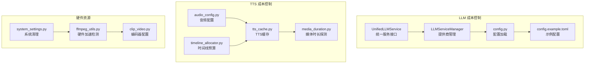
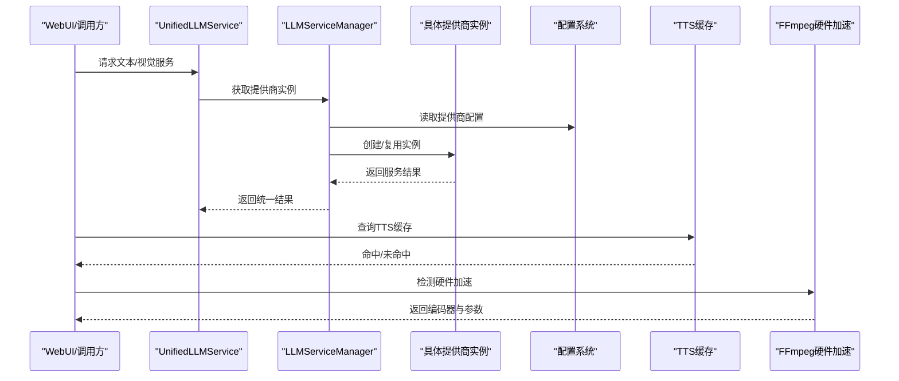
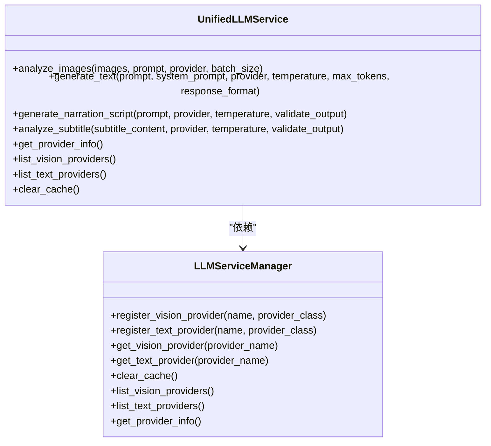
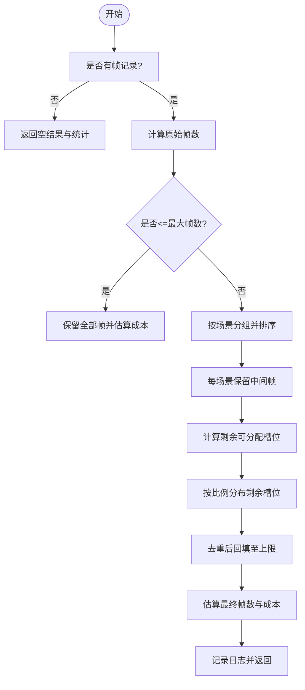
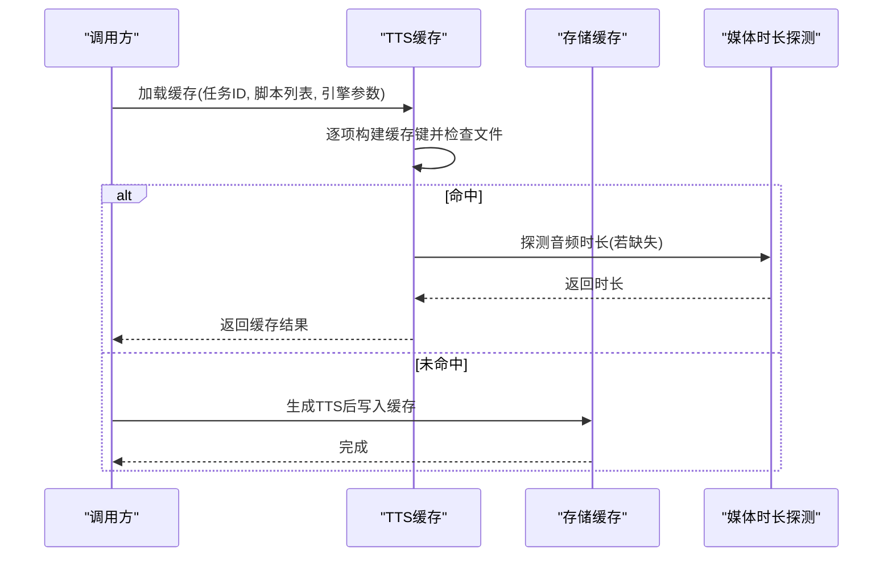
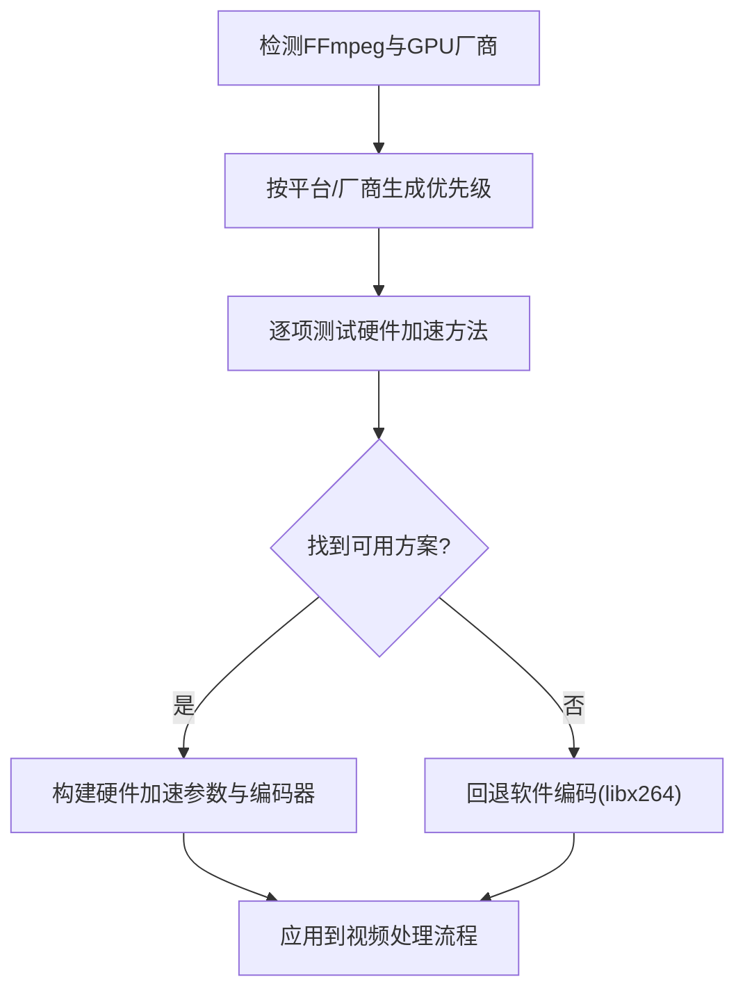
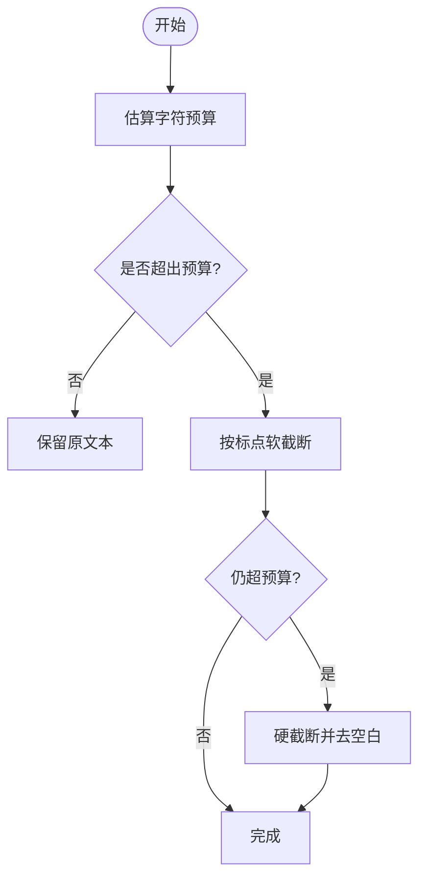
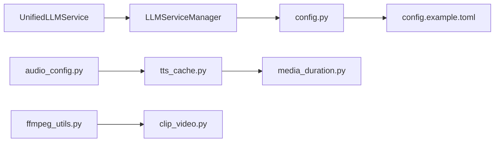

# 成本控制

<cite>
**本文引用的文件**
- [cost_guard.py](file://app/services/cost_guard.py)
- [tts_cache.py](file://app/services/tts_cache.py)
- [audio_config.py](file://app/config/audio_config.py)
- [unified_service.py](file://app/services/llm/unified_service.py)
- [manager.py](file://app/services/llm/manager.py)
- [config.py](file://app/config/config.py)
- [config.example.toml](file://config.example.toml)
- [utils.py](file://app/utils/utils.py)
- [media_duration.py](file://app/services/media_duration.py)
- [timeline_allocator.py](file://app/services/timeline_allocator.py)
- [ffmpeg_utils.py](file://app/utils/ffmpeg_utils.py)
- [clip_video.py](file://app/services/clip_video.py)
- [system_settings.py](file://webui/components/system_settings.py)
- [gemini_analyzer.py](file://app/utils/gemini_analyzer.py)
- [qwenvl_analyzer.py](file://app/utils/qwenvl_analyzer.py)
- [test_litellm_integration.py](file://app/services/llm/test_litellm_integration.py)
- [basic_settings.py](file://webui/components/basic_settings.py)
</cite>

## 目录
1. [简介](#简介)
2. [项目结构](#项目结构)
3. [核心组件](#核心组件)
4. [架构总览](#架构总览)
5. [详细组件分析](#详细组件分析)
6. [依赖分析](#依赖分析)
7. [性能与成本考量](#性能与成本考量)
8. [故障排查指南](#故障排查指南)
9. [结论](#结论)
10. [附录](#附录)

## 简介
本指南面向使用 NarratoAI 的用户与运维人员，围绕“成本控制”目标，系统梳理 LLM 使用成本、TTS 服务成本、硬件资源成本以及预算与预测方法。文档结合代码实现，给出可操作的优化策略与最佳实践，帮助在保证质量的前提下降低总体开销。

## 项目结构
- LLM 成本控制与模型选择：通过统一服务与提供商管理，结合 LiteLLM 的统一接口与成本追踪能力，实现跨提供商的成本优化与用量统计。
- TTS 成本控制：通过缓存机制与配置化参数，减少重复调用与不必要的生成，同时支持多引擎选择与批量处理。
- 硬件资源成本：通过 FFmpeg 硬件加速检测与编码器选择，提升视频处理效率，降低 CPU 占用与能耗。
- 配置与预算：通过配置文件与 WebUI 设置项，集中管理 API Key、模型与 TTS 引擎，便于成本分摊与预算管理。

**图表来源**
- [unified_service.py:1-263](file://app/services/llm/unified_service.py#L1-L263)
- [manager.py:1-246](file://app/services/llm/manager.py#L1-L246)
- [config.py:1-95](file://app/config/config.py#L1-L95)
- [config.example.toml:1-177](file://config.example.toml#L1-L177)
- [tts_cache.py:1-125](file://app/services/tts_cache.py#L1-L125)
- [audio_config.py:1-221](file://app/config/audio_config.py#L1-L221)
- [media_duration.py:1-30](file://app/services/media_duration.py#L1-L30)
- [timeline_allocator.py:1-35](file://app/services/timeline_allocator.py#L1-L35)
- [ffmpeg_utils.py:1-800](file://app/utils/ffmpeg_utils.py#L1-L800)
- [clip_video.py:120-161](file://app/services/clip_video.py#L120-L161)
- [system_settings.py:1-46](file://webui/components/system_settings.py#L1-L46)

**章节来源**
- [unified_service.py:1-263](file://app/services/llm/unified_service.py#L1-L263)
- [manager.py:1-246](file://app/services/llm/manager.py#L1-L246)
- [config.py:1-95](file://app/config/config.py#L1-L95)
- [config.example.toml:1-177](file://config.example.toml#L1-L177)
- [tts_cache.py:1-125](file://app/services/tts_cache.py#L1-L125)
- [audio_config.py:1-221](file://app/config/audio_config.py#L1-L221)
- [media_duration.py:1-30](file://app/services/media_duration.py#L1-L30)
- [timeline_allocator.py:1-35](file://app/services/timeline_allocator.py#L1-L35)
- [ffmpeg_utils.py:1-800](file://app/utils/ffmpeg_utils.py#L1-L800)
- [clip_video.py:120-161](file://app/services/clip_video.py#L120-L161)
- [system_settings.py:1-46](file://webui/components/system_settings.py#L1-L46)

## 核心组件
- LLM 统一服务与提供商管理：通过统一接口屏蔽不同提供商差异，便于切换与成本对比；提供商管理负责实例缓存与配置校验，减少重复初始化与配置错误带来的隐性成本。
- 视觉帧预算控制：对关键帧进行上限控制与代表性采样，估算 token 用量与成本，避免过度分析导致的 API 费用飙升。
- TTS 缓存与配置：通过缓存命中复用音频与字幕，减少重复 TTS 调用；音频配置提供音量、采样率、声道等参数，影响生成质量与资源消耗。
- 硬件加速与编码器：自动检测平台与 GPU 的硬件加速能力，选择最优编码器，降低 CPU 占用与能耗，间接节省云资源成本。
- 时间线预算：根据时长估算字符预算并截断文本，减少 LLM 输入长度，从而降低 token 消耗与成本。

**章节来源**
- [unified_service.py:1-263](file://app/services/llm/unified_service.py#L1-L263)
- [manager.py:1-246](file://app/services/llm/manager.py#L1-L246)
- [cost_guard.py:1-98](file://app/services/cost_guard.py#L1-L98)
- [tts_cache.py:1-125](file://app/services/tts_cache.py#L1-L125)
- [audio_config.py:1-221](file://app/config/audio_config.py#L1-L221)
- [ffmpeg_utils.py:1-800](file://app/utils/ffmpeg_utils.py#L1-L800)
- [timeline_allocator.py:1-35](file://app/services/timeline_allocator.py#L1-L35)

## 架构总览
下图展示成本控制相关模块之间的交互关系，重点体现“统一服务—提供商管理—配置—缓存/预算—硬件加速”的闭环。

**图表来源**
- [unified_service.py:1-263](file://app/services/llm/unified_service.py#L1-L263)
- [manager.py:1-246](file://app/services/llm/manager.py#L1-L246)
- [config.py:1-95](file://app/config/config.py#L1-L95)
- [tts_cache.py:1-125](file://app/services/tts_cache.py#L1-L125)
- [ffmpeg_utils.py:1-800](file://app/utils/ffmpeg_utils.py#L1-L800)

## 详细组件分析

### LLM 成本控制与模型选择
- 统一服务接口：封装文本生成、图片分析、脚本生成等能力，隐藏提供商差异，便于切换与成本对比。
- 提供商管理：集中注册与缓存提供商实例，读取配置中的 API Key、模型名与 Base URL，避免重复初始化与配置错误。
- 配置与迁移：示例配置文件提供 LiteLLM 的统一入口与多家提供商示例，便于快速切换与成本评估。

**图表来源**
- [unified_service.py:1-263](file://app/services/llm/unified_service.py#L1-L263)
- [manager.py:1-246](file://app/services/llm/manager.py#L1-L246)

**章节来源**
- [unified_service.py:1-263](file://app/services/llm/unified_service.py#L1-L263)
- [manager.py:1-246](file://app/services/llm/manager.py#L1-L246)
- [config.example.toml:1-177](file://config.example.toml#L1-L177)

### 视觉帧预算控制（降低 LLM 视觉分析成本）
- 估算与封顶：根据帧数估算 token 数量与成本，设定最大帧数上限，避免过度采样。
- 代表性采样：按场景保留至少一帧，剩余帧按时间分布均匀采样，兼顾代表性与成本控制。

**图表来源**
- [cost_guard.py:1-98](file://app/services/cost_guard.py#L1-L98)

**章节来源**
- [cost_guard.py:1-98](file://app/services/cost_guard.py#L1-L98)

### TTS 成本优化（缓存、引擎与批量）
- 缓存机制：基于文本、音色、语速、音高与引擎构建稳定缓存键，命中即复制音频与字幕，避免重复生成。
- 存储与恢复：缓存目录结构清晰，元数据包含时长与时间戳，便于后续统计与复用。
- 引擎与参数：配置文件提供多引擎选择与默认参数，结合音频配置可进一步优化音质与时长，降低生成成本。

**图表来源**
- [tts_cache.py:1-125](file://app/services/tts_cache.py#L1-L125)
- [media_duration.py:1-30](file://app/services/media_duration.py#L1-L30)

**章节来源**
- [tts_cache.py:1-125](file://app/services/tts_cache.py#L1-L125)
- [media_duration.py:1-30](file://app/services/media_duration.py#L1-L30)
- [audio_config.py:1-221](file://app/config/audio_config.py#L1-L221)
- [config.example.toml:90-177](file://config.example.toml#L90-L177)

### 硬件资源成本控制（FFmpeg 硬件加速与编码器）
- 自动检测：根据平台与 GPU 厂商，按优先级测试硬件加速方法，返回可用编码器与参数。
- 编码器选择：针对不同平台与 GPU 提供 NVENC、VAAPI、QSV、VideoToolbox 等方案，必要时回退软件编码。
- 视频处理优化：在视频裁剪等场景中，优先纯编码器方案以保证兼容性与稳定性。

**图表来源**
- [ffmpeg_utils.py:1-800](file://app/utils/ffmpeg_utils.py#L1-L800)
- [clip_video.py:120-161](file://app/services/clip_video.py#L120-L161)

**章节来源**
- [ffmpeg_utils.py:1-800](file://app/utils/ffmpeg_utils.py#L1-L800)
- [clip_video.py:120-161](file://app/services/clip_video.py#L120-L161)

### 时间线预算与文本截断（降低 LLM 输入成本）
- 字符预算：按时长与速率估算字符预算，预留比例避免超限。
- 截断策略：优先在标点处截断，确保语义完整；超出预算时以省略号收尾。

**图表来源**
- [timeline_allocator.py:1-35](file://app/services/timeline_allocator.py#L1-L35)

**章节来源**
- [timeline_allocator.py:1-35](file://app/services/timeline_allocator.py#L1-L35)

## 依赖分析
- 统一服务依赖提供商管理器，后者依赖配置系统读取 API Key、模型名与 Base URL。
- TTS 缓存依赖存储目录与媒体时长探测，音频配置影响生成质量与资源消耗。
- 硬件加速检测贯穿视频处理流程，决定编码器与参数，影响 CPU 占用与能耗。

**图表来源**
- [unified_service.py:1-263](file://app/services/llm/unified_service.py#L1-L263)
- [manager.py:1-246](file://app/services/llm/manager.py#L1-L246)
- [config.py:1-95](file://app/config/config.py#L1-L95)
- [config.example.toml:1-177](file://config.example.toml#L1-L177)
- [tts_cache.py:1-125](file://app/services/tts_cache.py#L1-L125)
- [media_duration.py:1-30](file://app/services/media_duration.py#L1-L30)
- [audio_config.py:1-221](file://app/config/audio_config.py#L1-L221)
- [ffmpeg_utils.py:1-800](file://app/utils/ffmpeg_utils.py#L1-L800)
- [clip_video.py:120-161](file://app/services/clip_video.py#L120-L161)

**章节来源**
- [unified_service.py:1-263](file://app/services/llm/unified_service.py#L1-L263)
- [manager.py:1-246](file://app/services/llm/manager.py#L1-L246)
- [config.py:1-95](file://app/config/config.py#L1-L95)
- [config.example.toml:1-177](file://config.example.toml#L1-L177)
- [tts_cache.py:1-125](file://app/services/tts_cache.py#L1-L125)
- [media_duration.py:1-30](file://app/services/media_duration.py#L1-L30)
- [audio_config.py:1-221](file://app/config/audio_config.py#L1-L221)
- [ffmpeg_utils.py:1-800](file://app/utils/ffmpeg_utils.py#L1-L800)
- [clip_video.py:120-161](file://app/services/clip_video.py#L120-L161)

## 性能与成本考量
- LLM 成本优化要点
  - 选择合适提供商与模型：示例配置提供多家提供商与模型示例，便于成本对比与切换。
  - 控制输入规模：通过视觉帧封顶与时间线预算，显著降低 token 消耗。
  - 统一接口与缓存：统一服务与提供商缓存减少重复初始化与错误重试成本。
- TTS 成本优化要点
  - 缓存命中优先：通过稳定缓存键与持久化存储，最大化复用率。
  - 引擎与参数：合理设置音色、语速、音高与引擎，平衡质量与时长。
- 硬件资源优化要点
  - 自动检测与最优编码器：根据 GPU 厂商与平台选择 NVENC/VAAPI/QSV/VideoToolbox 等，必要时回退软件编码。
  - 视频处理策略：在裁剪等场景优先纯编码器方案，兼顾性能与兼容性。

**章节来源**
- [config.example.toml:1-177](file://config.example.toml#L1-L177)
- [cost_guard.py:1-98](file://app/services/cost_guard.py#L1-L98)
- [timeline_allocator.py:1-35](file://app/services/timeline_allocator.py#L1-L35)
- [tts_cache.py:1-125](file://app/services/tts_cache.py#L1-L125)
- [audio_config.py:1-221](file://app/config/audio_config.py#L1-L221)
- [ffmpeg_utils.py:1-800](file://app/utils/ffmpeg_utils.py#L1-L800)
- [clip_video.py:120-161](file://app/services/clip_video.py#L120-L161)

## 故障排查指南
- LLM 连接与配额
  - WebUI 提供文本模型连通性测试，可快速定位 API Key、Base URL 与模型名称问题。
  - Gemini 原生 API 对配额与安全过滤有明确错误码，需根据返回信息调整。
- TTS 缓存异常
  - 缓存读取失败会自动回退到重新生成，注意检查缓存目录权限与磁盘空间。
- 硬件加速不可用
  - 若未检测到硬件加速，系统将回退软件编码；可通过重置检测或更换编码器解决。

**章节来源**
- [basic_settings.py:728-921](file://webui/components/basic_settings.py#L728-L921)
- [gemini_analyzer.py:115-146](file://app/utils/gemini_analyzer.py#L115-L146)
- [qwenvl_analyzer.py:149-175](file://app/utils/qwenvl_analyzer.py#L149-L175)
- [tts_cache.py:88-94](file://app/services/tts_cache.py#L88-L94)
- [ffmpeg_utils.py:252-355](file://app/utils/ffmpeg_utils.py#L252-L355)

## 结论
通过统一服务与提供商管理、视觉帧预算控制、TTS 缓存与配置优化、硬件加速检测与编码器选择，以及时间线预算与文本截断策略，NarratoAI 在保障质量的同时实现了显著的成本控制。建议在生产环境中启用缓存、合理选择模型与引擎、充分利用硬件加速，并结合配置文件与 WebUI 设置进行持续的成本监控与优化。

## 附录
- 配置与迁移建议
  - 使用 LiteLLM 统一接口，支持 100+ 提供商，便于成本对比与切换。
  - 示例配置文件提供多家提供商与模型示例，建议在测试充分后再切换生产环境。
- 系统维护
  - 定期清理临时目录与任务缓存，释放磁盘空间，避免隐性成本上升。

**章节来源**
- [test_litellm_integration.py:143-195](file://app/services/llm/test_litellm_integration.py#L143-L195)
- [config.example.toml:1-177](file://config.example.toml#L1-L177)
- [system_settings.py:1-46](file://webui/components/system_settings.py#L1-L46)