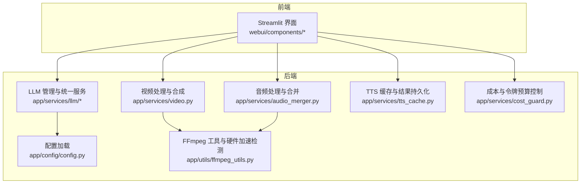
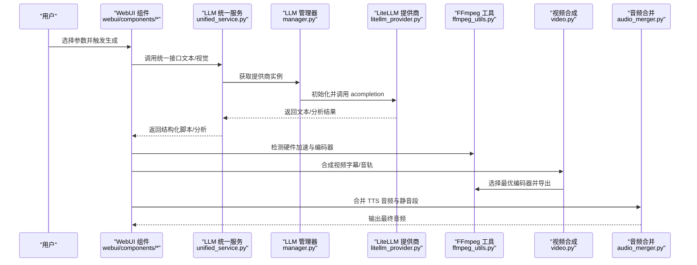
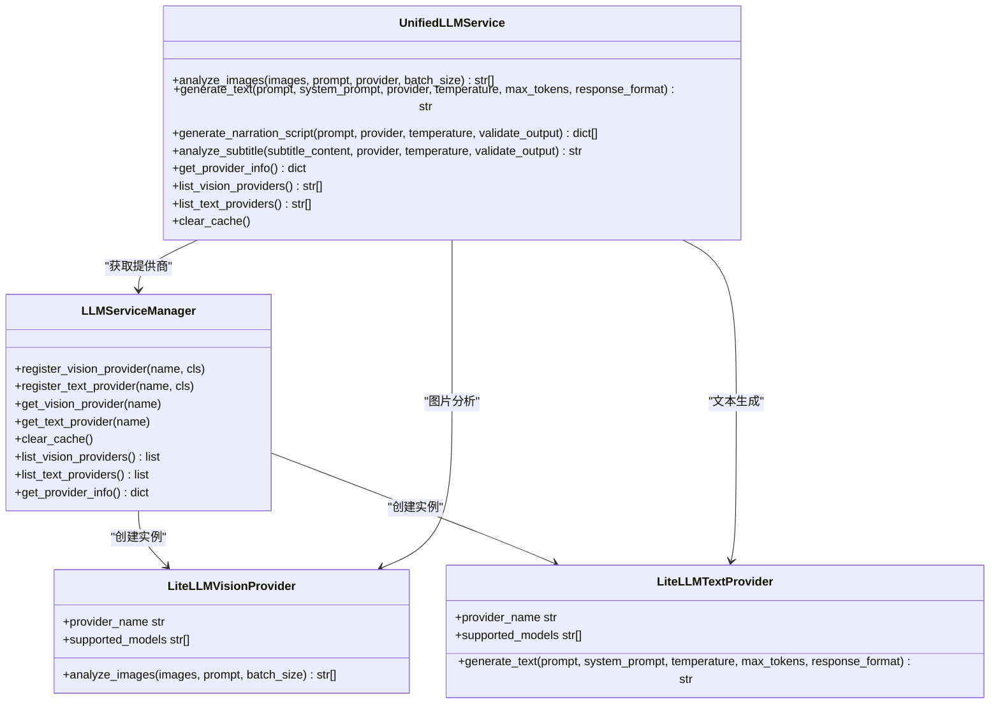
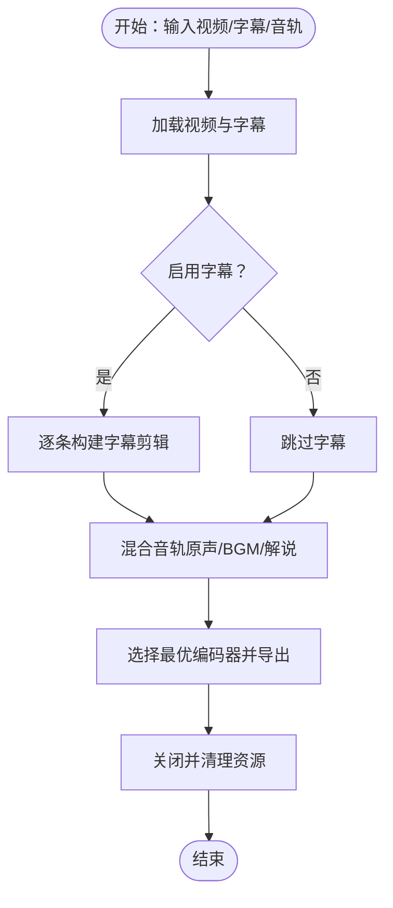
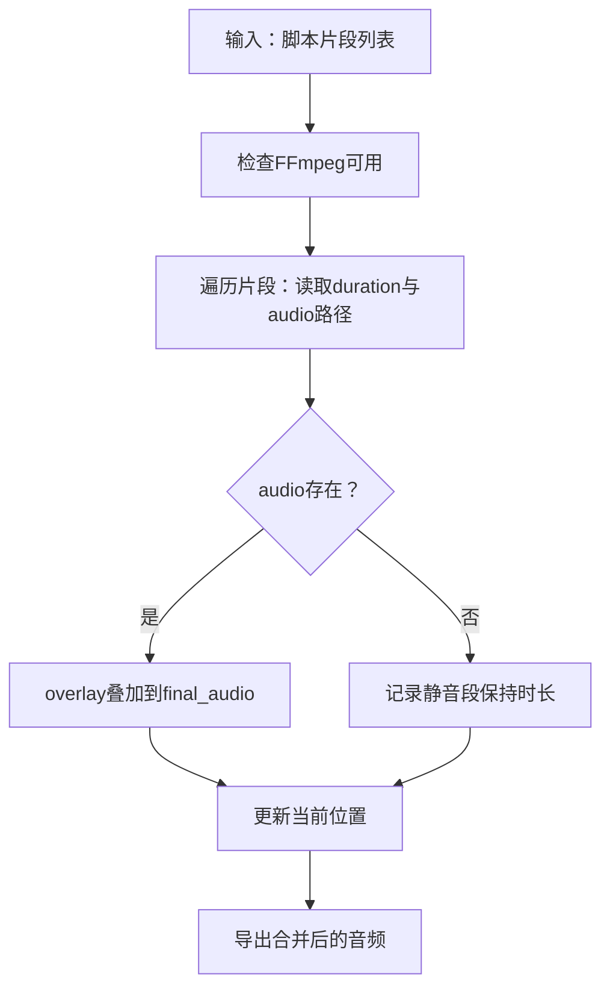
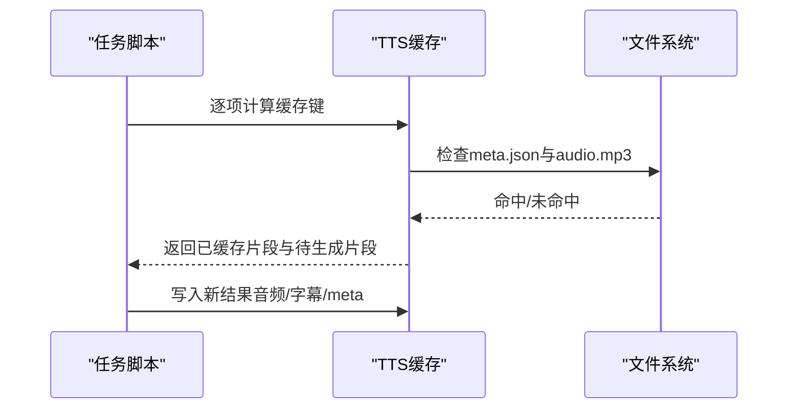
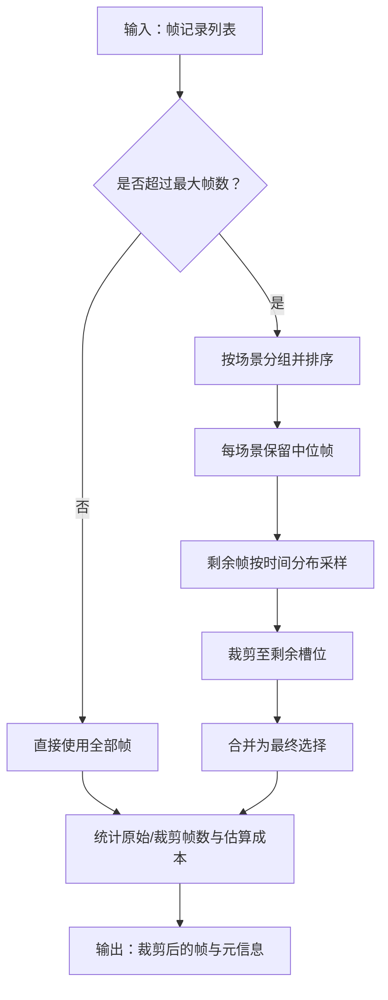
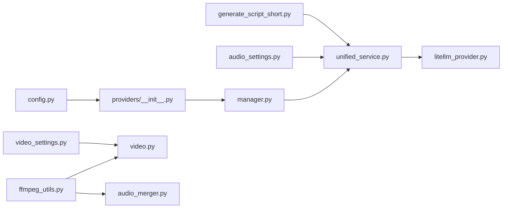

# 最佳实践

<cite>
**本文引用的文件**
- [README.md](file://README.md)
- [config.example.toml](file://config.example.toml)
- [app/config/config.py](file://app/config/config.py)
- [app/services/llm/manager.py](file://app/services/llm/manager.py)
- [app/services/llm/unified_service.py](file://app/services/llm/unified_service.py)
- [app/services/llm/providers/__init__.py](file://app/services/llm/providers/__init__.py)
- [app/services/llm/litellm_provider.py](file://app/services/llm/litellm_provider.py)
- [app/utils/ffmpeg_utils.py](file://app/utils/ffmpeg_utils.py)
- [app/services/video.py](file://app/services/video.py)
- [app/services/audio_merger.py](file://app/services/audio_merger.py)
- [app/services/tts_cache.py](file://app/services/tts_cache.py)
- [app/services/cost_guard.py](file://app/services/cost_guard.py)
- [webui/components/audio_settings.py](file://webui/components/audio_settings.py)
- [webui/components/video_settings.py](file://webui/components/video_settings.py)
- [webui/tools/generate_script_short.py](file://webui/tools/generate_script_short.py)
- [app/models/schema.py](file://app/models/schema.py)
- [app/services/preflight_check.py](file://app/services/preflight_check.py)
</cite>

## 目录
1. [简介](#简介)
2. [项目结构](#项目结构)
3. [核心组件](#核心组件)
4. [架构总览](#架构总览)
5. [详细组件分析](#详细组件分析)
6. [依赖关系分析](#依赖关系分析)
7. [性能考虑](#性能考虑)
8. [故障排查指南](#故障排查指南)
9. [结论](#结论)
10. [附录](#附录)

## 简介
本指南面向使用 NarratoAI 的创作者与运维人员，围绕“LLM 提供商选择”“视频处理效果优化”“音频质量提升”“性能优化”“安全与合规”“工作流与成本控制”“集成与反馈”等方面，结合代码实现给出可操作的最佳实践建议。文档同时提供可视化图示帮助理解关键流程。

## 项目结构
NarratoAI 采用模块化设计，前端通过 Streamlit 提供交互界面，后端以服务层为核心，围绕 LLM、视频、音频、TTS、字幕、成本控制等能力组织。关键目录与职责概览：
- app/config：配置加载与环境变量注入
- app/services：业务服务层（LLM、视频、音频、字幕、剪辑、成本控制等）
- app/utils：通用工具（FFmpeg 检测、媒体处理等）
- webui：前端组件与工具（音频/TTS 设置、视频参数、脚本生成工具）
- resource：公共资源（字体、模板等）

图表来源
- [app/config/config.py:24-95](file://app/config/config.py#L24-L95)
- [app/services/llm/manager.py:15-246](file://app/services/llm/manager.py#L15-L246)
- [app/services/video.py:200-418](file://app/services/video.py#L200-L418)
- [app/services/audio_merger.py:21-172](file://app/services/audio_merger.py#L21-L172)
- [app/services/tts_cache.py:45-125](file://app/services/tts_cache.py#L45-L125)
- [app/services/cost_guard.py:13-98](file://app/services/cost_guard.py#L13-L98)
- [app/utils/ffmpeg_utils.py:252-356](file://app/utils/ffmpeg_utils.py#L252-L356)

章节来源
- [README.md:105-141](file://README.md#L105-L141)

## 核心组件
- LLM 管理与统一服务：通过 LiteLLM 统一接入多家提供商，支持自动重试、成本统计与令牌监控。
- 视频处理与合成：封装 FFmpeg 编码器选择、字幕渲染、音量混合与导出流程。
- 音频处理与合并：基于 pydub 的音频叠加与静音段落处理。
- TTS 缓存：以脚本片段与 TTS 参数为键，缓存音频与字幕，显著降低重复合成成本。
- 成本与令牌预算：对视觉分析帧数进行上限控制与估算，辅助成本预算。
- FFmpeg 工具：跨平台硬件加速检测与编码器选择，保障导出性能与兼容性。
- 前置校验：脚本完整性与 TTS 结果校验，避免后续流程中断。

章节来源
- [app/services/llm/manager.py:15-246](file://app/services/llm/manager.py#L15-L246)
- [app/services/llm/unified_service.py:20-263](file://app/services/llm/unified_service.py#L20-L263)
- [app/services/video.py:200-418](file://app/services/video.py#L200-L418)
- [app/services/audio_merger.py:21-172](file://app/services/audio_merger.py#L21-L172)
- [app/services/tts_cache.py:45-125](file://app/services/tts_cache.py#L45-L125)
- [app/services/cost_guard.py:13-98](file://app/services/cost_guard.py#L13-L98)
- [app/utils/ffmpeg_utils.py:252-356](file://app/utils/ffmpeg_utils.py#L252-L356)
- [app/services/preflight_check.py:11-31](file://app/services/preflight_check.py#L11-L31)

## 架构总览
下图展示从前端到后端的关键交互与数据流，突出 LLM 统一接口、FFmpeg 硬件加速与 TTS 缓存的作用。

图表来源
- [app/services/llm/unified_service.py:20-263](file://app/services/llm/unified_service.py#L20-L263)
- [app/services/llm/manager.py:68-209](file://app/services/llm/manager.py#L68-L209)
- [app/services/llm/litellm_provider.py:130-264](file://app/services/llm/litellm_provider.py#L130-L264)
- [app/utils/ffmpeg_utils.py:252-356](file://app/utils/ffmpeg_utils.py#L252-L356)
- [app/services/video.py:200-418](file://app/services/video.py#L200-L418)
- [app/services/audio_merger.py:21-77](file://app/services/audio_merger.py#L21-L77)

## 详细组件分析

### LLM 提供商选择与统一接口
- 选择策略
  - 推荐使用 LiteLLM 统一接口，覆盖 100+ 提供商，便于切换与成本对比。
  - 文本/视觉模型分别配置，支持自定义 base_url 与 API Key 环境变量映射。
- 统一服务
  - 提供图片分析、文本生成、解说脚本生成、字幕分析等统一入口，内置输出校验与错误包装。
- 管理器
  - 基于名称注册提供商，支持缓存与实例复用，避免重复初始化。

图表来源
- [app/services/llm/manager.py:15-246](file://app/services/llm/manager.py#L15-L246)
- [app/services/llm/unified_service.py:20-263](file://app/services/llm/unified_service.py#L20-L263)
- [app/services/llm/litellm_provider.py:59-491](file://app/services/llm/litellm_provider.py#L59-L491)
- [app/services/llm/providers/__init__.py:12-44](file://app/services/llm/providers/__init__.py#L12-L44)

章节来源
- [config.example.toml:9-64](file://config.example.toml#L9-L64)
- [app/services/llm/manager.py:68-209](file://app/services/llm/manager.py#L68-L209)
- [app/services/llm/unified_service.py:20-263](file://app/services/llm/unified_service.py#L20-L263)
- [app/services/llm/litellm_provider.py:38-56](file://app/services/llm/litellm_provider.py#L38-L56)

### 视频处理与导出优化
- 字幕渲染与位置计算：支持枚举与百分比两种位置方式，自动计算文本高度并定位。
- 音轨混合：原声、BGM、解说音轨分别设置音量，支持不足时循环扩展。
- 编码器选择：自动检测硬件加速（CUDA/NVENC、VideoToolbox、QSV、VAAPI 等），失败时降级至 libx264。
- 资源管理：使用上下文管理器确保剪辑对象及时释放。

图表来源
- [app/services/video.py:200-418](file://app/services/video.py#L200-L418)
- [app/utils/ffmpeg_utils.py:252-356](file://app/utils/ffmpeg_utils.py#L252-L356)

章节来源
- [app/services/video.py:200-418](file://app/services/video.py#L200-L418)
- [app/utils/ffmpeg_utils.py:252-356](file://app/utils/ffmpeg_utils.py#L252-L356)

### 音频质量与合并策略
- FFmpeg 检测：启动前检查 ffmpeg 是否可用，避免运行时失败。
- 静音段处理：脚本中无音频片段时保留时长，避免跳步导致的时间错位。
- 时间戳解析：支持多种 SRT 时间格式，确保精确对齐。
- 合并策略：基于脚本片段时长叠加，使用 overlay 精确对齐。

图表来源
- [app/services/audio_merger.py:21-77](file://app/services/audio_merger.py#L21-L77)

章节来源
- [app/services/audio_merger.py:21-172](file://app/services/audio_merger.py#L21-L172)

### TTS 缓存与重复利用
- 缓存键：以脚本片段文本、音色、语速、语调、TTS 引擎组合生成 MD5，确保幂等。
- 存储：将音频与字幕复制到任务目录，meta 记录时长与时间戳。
- 命中：遍历脚本，命中则直接拷贝，缺失项交由 TTS 引擎生成。

图表来源
- [app/services/tts_cache.py:45-125](file://app/services/tts_cache.py#L45-L125)

章节来源
- [app/services/tts_cache.py:45-125](file://app/services/tts_cache.py#L45-L125)

### 成本控制与令牌预算
- 视觉分析帧数上限：按场景保留中位帧，剩余按时间分布采样，避免过度消费。
- 令牌估算：按每帧固定令牌数估算输入成本，便于预算控制与告警。

图表来源
- [app/services/cost_guard.py:26-98](file://app/services/cost_guard.py#L26-L98)

章节来源
- [app/services/cost_guard.py:13-98](file://app/services/cost_guard.py#L13-L98)

### 前置校验与健壮性
- 脚本完整性：校验必需字段与 narration 非空。
- TTS 结果：确保需要 TTS 的片段均已生成音频，避免后续流程中断。

章节来源
- [app/services/preflight_check.py:11-31](file://app/services/preflight_check.py#L11-L31)

## 依赖关系分析
- 配置加载：app/config/config.py 负责读取 config.toml，注入环境变量（如 FFmpeg 路径、IMAGEMAGICK_BINARY），并提供全局配置。
- LLM 层：通过 providers/__init__.py 注册 LiteLLM 提供商，manager.py 统一管理实例与缓存。
- 视频/音频：video.py 与 audio_merger.py 依赖 ffmpeg_utils.py 的编码器选择与硬件加速参数。
- WebUI：audio_settings.py 与 video_settings.py 提供参数面板，generate_script_short.py 调用后端脚本生成工具。

图表来源
- [app/config/config.py:24-95](file://app/config/config.py#L24-L95)
- [app/services/llm/providers/__init__.py:12-44](file://app/services/llm/providers/__init__.py#L12-L44)
- [app/services/llm/manager.py:15-246](file://app/services/llm/manager.py#L15-L246)
- [app/services/llm/unified_service.py:20-263](file://app/services/llm/unified_service.py#L20-L263)
- [app/services/llm/litellm_provider.py:59-491](file://app/services/llm/litellm_provider.py#L59-L491)
- [app/utils/ffmpeg_utils.py:252-356](file://app/utils/ffmpeg_utils.py#L252-L356)
- [app/services/video.py:200-418](file://app/services/video.py#L200-L418)
- [app/services/audio_merger.py:21-172](file://app/services/audio_merger.py#L21-L172)
- [webui/components/audio_settings.py:22-150](file://webui/components/audio_settings.py#L22-L150)
- [webui/components/video_settings.py:5-63](file://webui/components/video_settings.py#L5-L63)
- [webui/tools/generate_script_short.py:13-128](file://webui/tools/generate_script_short.py#L13-L128)

章节来源
- [app/config/config.py:24-95](file://app/config/config.py#L24-L95)
- [app/services/llm/providers/__init__.py:12-44](file://app/services/llm/providers/__init__.py#L12-L44)
- [app/services/llm/manager.py:15-246](file://app/services/llm/manager.py#L15-L246)
- [app/services/llm/unified_service.py:20-263](file://app/services/llm/unified_service.py#L20-L263)
- [app/services/llm/litellm_provider.py:59-491](file://app/services/llm/litellm_provider.py#L59-L491)
- [app/utils/ffmpeg_utils.py:252-356](file://app/utils/ffmpeg_utils.py#L252-L356)
- [app/services/video.py:200-418](file://app/services/video.py#L200-L418)
- [app/services/audio_merger.py:21-172](file://app/services/audio_merger.py#L21-L172)
- [webui/components/audio_settings.py:22-150](file://webui/components/audio_settings.py#L22-L150)
- [webui/components/video_settings.py:5-63](file://webui/components/video_settings.py#L5-L63)
- [webui/tools/generate_script_short.py:13-128](file://webui/tools/generate_script_short.py#L13-L128)

## 性能考虑
- 资源分配
  - 视频线程数：VideoClipParams.n_threads 控制并发度，建议根据 CPU 核心数与内存容量调整。
  - FFmpeg 硬件加速：优先使用 NVENC/CUDA（NVIDIA）、VideoToolbox（macOS）、QSV/VAAPI（Intel/AMD），自动降级至 libx264。
- 缓存策略
  - TTS 缓存：对相同文本/音色/语速/语调组合复用结果，显著降低重复合成成本。
  - 视觉帧采样：cap_frame_records 限制帧数并保留场景代表性帧，降低 LLM 调用频率。
- 并发处理
  - LLM 批处理：LiteLLMTextProvider/LiteLLMVisionProvider 支持批处理，合理设置 batch_size。
  - 音频合并：按脚本顺序叠加，注意异常片段的容错与位置补偿。
- 导出优化
  - 编码器参数：根据检测到的硬件加速类型设置 preset/profile 等参数，兼顾速度与质量。
  - 音量平衡：AudioVolumeDefaults 提供默认值，结合原声音量与 TTS 音量进行智能调整。

章节来源
- [app/models/schema.py:16-35](file://app/models/schema.py#L16-L35)
- [app/utils/ffmpeg_utils.py:252-356](file://app/utils/ffmpeg_utils.py#L252-L356)
- [app/services/tts_cache.py:45-125](file://app/services/tts_cache.py#L45-L125)
- [app/services/cost_guard.py:26-98](file://app/services/cost_guard.py#L26-L98)
- [app/services/llm/litellm_provider.py:130-166](file://app/services/llm/litellm_provider.py#L130-L166)

## 故障排查指南
- LLM 认证/速率限制
  - 现象：抛出认证或速率限制异常。
  - 处理：检查 config.toml 中对应 provider 的 API Key 与 base_url；适当降低并发与批大小；启用重试。
- FFmpeg 未安装
  - 现象：音频合并失败或导出报错。
  - 处理：安装并配置 ffmpeg，确保 PATH 正确；必要时通过 config 注入 IMAGEMAGICK_BINARY 与 IMAGEIO_FFMPEG_EXE。
- 字幕/脚本不完整
  - 现象：生成脚本后无法继续剪辑。
  - 处理：使用 Preflight 校验脚本完整性与 TTS 结果，补齐缺失片段或切换为不依赖 TTS 的模式。
- 编码器不兼容
  - 现象：硬件加速失败或导出异常。
  - 处理：自动降级至 libx264；检查驱动与权限；必要时手动指定编码器参数。

章节来源
- [app/services/llm/litellm_provider.py:235-252](file://app/services/llm/litellm_provider.py#L235-L252)
- [app/services/audio_merger.py:12-37](file://app/services/audio_merger.py#L12-L37)
- [app/services/preflight_check.py:11-31](file://app/services/preflight_check.py#L11-L31)
- [app/utils/ffmpeg_utils.py:344-356](file://app/utils/ffmpeg_utils.py#L344-L356)

## 结论
通过统一的 LLM 接口、完善的硬件加速检测、TTS 缓存与成本预算控制，NarratoAI 能在保证质量的同时显著提升生产效率。建议在实际使用中结合场景选择合适的提供商与参数，并建立标准化的工作流与监控体系，持续优化性能与成本。

## 附录

### 使用技巧与经验总结
- LLM 提供商选择
  - 优先选择支持 JSON Mode 的模型，便于稳定解析脚本结构。
  - 对于视觉分析，选择速度快、成本低的轻量模型；对关键帧抽取与推理需求高的场景，可选用更高精度模型。
- 视频处理效果
  - 字幕位置建议使用百分比方式，便于适配不同分辨率。
  - 原声音量建议适度提升以平衡 TTS，避免音量不均。
- 音频质量
  - 合并前确保各片段时长与时间戳准确，静音段保留时长避免错位。
  - 使用 FFmpeg 硬件加速导出，显著缩短时间。

章节来源
- [config.example.toml:9-64](file://config.example.toml#L9-L64)
- [app/services/video.py:200-418](file://app/services/video.py#L200-L418)
- [app/services/audio_merger.py:21-172](file://app/services/audio_merger.py#L21-L172)
- [app/utils/ffmpeg_utils.py:252-356](file://app/utils/ffmpeg_utils.py#L252-L356)

### 安全注意事项与防护措施
- API 密钥管理
  - 通过环境变量注入（如 GEMINI_API_KEY、OPENAI_API_KEY 等），避免硬编码在代码中。
  - 使用 LiteLLM 的动态参数传递能力，按需传入 api_key/base_url。
- 数据保护
  - 仅在本地存储必要的中间文件与缓存，定期清理临时目录。
  - 对外部服务调用增加超时与重试策略，防止阻塞。
- 访问控制
  - WebUI 默认未暴露敏感配置项，建议在生产环境中隐藏或限制访问。

章节来源
- [app/services/llm/litellm_provider.py:107-128](file://app/services/llm/litellm_provider.py#L107-L128)
- [config.example.toml:93-139](file://config.example.toml#L93-L139)

### 工作流优化建议
- 批量处理
  - 使用 LLM 的批处理能力与 TTS 缓存，减少重复调用。
- 自动化脚本
  - 通过 generate_script_short.py 的流程封装，实现一键生成脚本与剪辑。
- 定时任务
  - 结合任务队列与缓存清理策略，定期维护资源占用。

章节来源
- [webui/tools/generate_script_short.py:13-128](file://webui/tools/generate_script_short.py#L13-L128)
- [app/services/tts_cache.py:45-125](file://app/services/tts_cache.py#L45-L125)

### 成本控制与预算管理
- 令牌预算：使用 cap_frame_records 限制视觉分析帧数，结合 estimate_visual_cost_cny 估算成本。
- 重试与超时：合理设置 llm_max_retries 与 llm_text_timeout，避免无效重试造成浪费。
- 供应商切换：通过 LiteLLM 统一接口快速切换，比较不同提供商的价格与性能。

章节来源
- [app/services/cost_guard.py:13-98](file://app/services/cost_guard.py#L13-L98)
- [config.example.toml:4-7](file://config.example.toml#L4-L7)
- [app/services/llm/litellm_provider.py:38-56](file://app/services/llm/litellm_provider.py#L38-L56)

### 不同使用场景的最佳配置
- 短视频脚本生成：启用严格校验，确保字幕与视频均上传；选择性价比高的文本模型。
- 高质量长视频：提升 n_threads 与帧采样质量；启用硬件加速导出。
- 语音克隆：使用 IndexTTS2，准备高质量参考音频并调整高级参数。

章节来源
- [webui/tools/generate_script_short.py:32-66](file://webui/tools/generate_script_short.py#L32-L66)
- [webui/components/audio_settings.py:574-704](file://webui/components/audio_settings.py#L574-L704)
- [app/models/schema.py:194-198](file://app/models/schema.py#L194-L198)

### 与其他工具和服务的集成
- FFmpeg：通过环境变量 IMAGEIO_FFMPEG_EXE 与 IMAGEMAGICK_BINARY 注入路径，确保跨平台兼容。
- TTS 引擎：支持 Edge TTS、Azure、腾讯云、Qwen、IndexTTS2 等，按需选择并配置。
- LLM 提供商：通过 LiteLLM 统一接口对接 OpenAI、Gemini、Qwen、DeepSeek、SiliconFlow 等。

章节来源
- [app/config/config.py:86-94](file://app/config/config.py#L86-L94)
- [webui/components/audio_settings.py:22-66](file://webui/components/audio_settings.py#L22-L66)
- [config.example.toml:9-64](file://config.example.toml#L9-L64)

### 用户反馈与改进建议收集
- 日志与指标：利用 loguru 记录关键步骤与错误，结合 LiteLLM 的使用统计进行成本与性能分析。
- 前置校验：在关键节点执行校验，提前发现并提示问题，减少失败重试。
- 配置引导：通过 WebUI 的参数面板与说明，帮助用户选择合适配置。

章节来源
- [app/services/preflight_check.py:11-31](file://app/services/preflight_check.py#L11-L31)
- [webui/components/audio_settings.py:128-134](file://webui/components/audio_settings.py#L128-L134)
- [app/services/llm/litellm_provider.py:422-472](file://app/services/llm/litellm_provider.py#L422-L472)