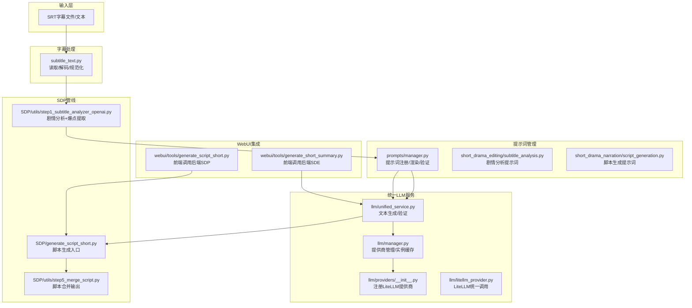
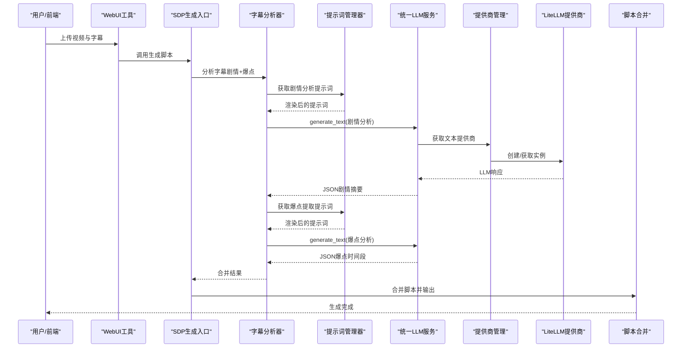
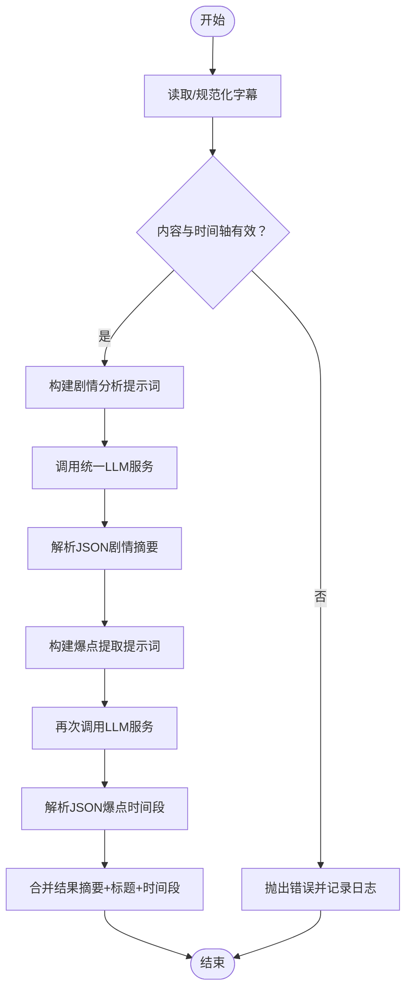
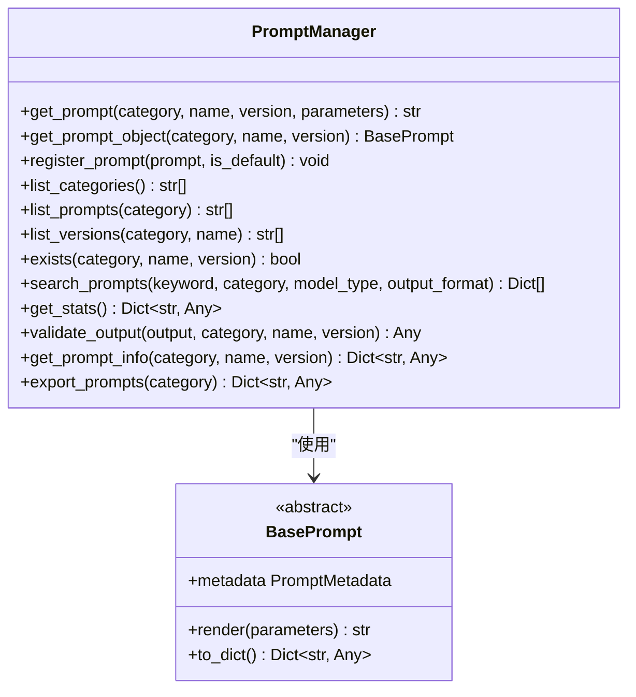
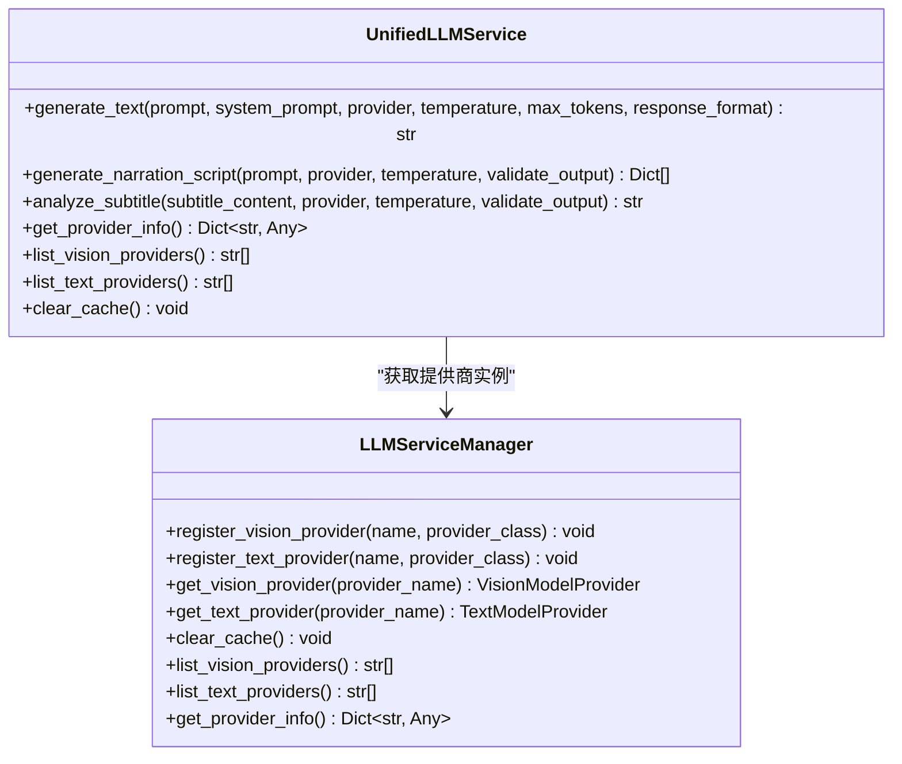
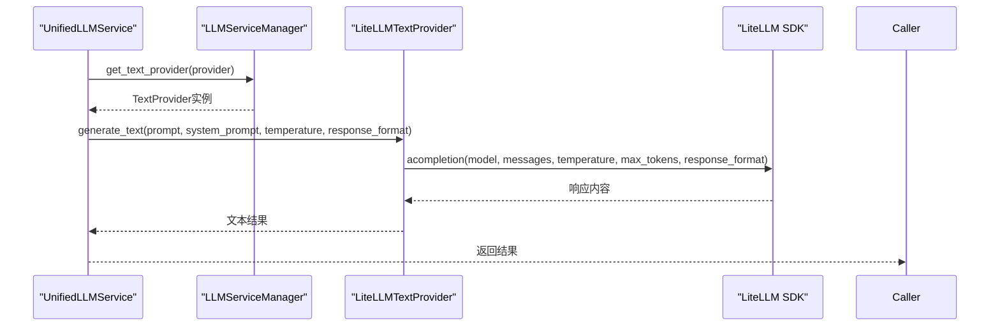
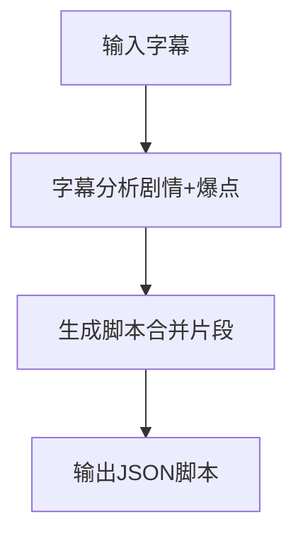
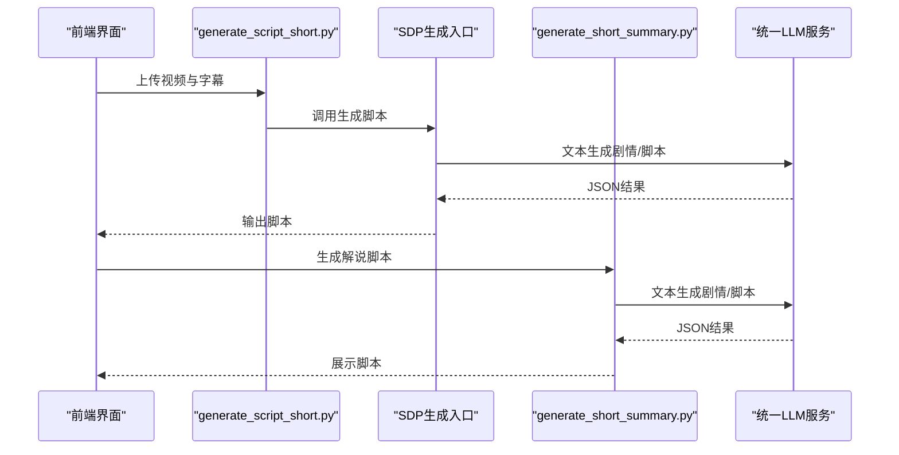
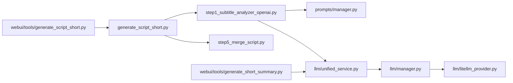

# AI影视解说系统

<cite>
**本文引用的文件**
- [app/services/SDP/utils/step1_subtitle_analyzer_openai.py](file://app/services/SDP/utils/step1_subtitle_analyzer_openai.py)
- [app/services/SDP/generate_script_short.py](file://app/services/SDP/generate_script_short.py)
- [app/services/prompts/short_drama_narration/script_generation.py](file://app/services/prompts/short_drama_narration/script_generation.py)
- [app/services/prompts/short_drama_editing/subtitle_analysis.py](file://app/services/prompts/short_drama_editing/subtitle_analysis.py)
- [app/services/llm/unified_service.py](file://app/services/llm/unified_service.py)
- [app/services/prompts/manager.py](file://app/services/prompts/manager.py)
- [app/services/SDP/utils/step5_merge_script.py](file://app/services/SDP/utils/step5_merge_script.py)
- [app/services/llm/providers/__init__.py](file://app/services/llm/providers/__init__.py)
- [webui/tools/generate_script_short.py](file://webui/tools/generate_script_short.py)
- [app/services/subtitle_text.py](file://app/services/subtitle_text.py)
- [app/services/SDP/utils/utils.py](file://app/services/SDP/utils/utils.py)
- [webui/tools/generate_short_summary.py](file://webui/tools/generate_short_summary.py)
- [app/services/llm/litellm_provider.py](file://app/services/llm/litellm_provider.py)
- [app/services/llm/manager.py](file://app/services/llm/manager.py)
- [app/services/prompts/base.py](file://app/services/prompts/base.py)
</cite>

## 目录
1. [简介](#简介)
2. [项目结构](#项目结构)
3. [核心组件](#核心组件)
4. [架构总览](#架构总览)
5. [详细组件分析](#详细组件分析)
6. [依赖关系分析](#依赖关系分析)
7. [性能考量](#性能考量)
8. [故障排查指南](#故障排查指南)
9. [结论](#结论)
10. [附录](#附录)

## 简介
本文件面向NarratoAI的AI影视解说系统，聚焦短剧剧情分析器SubtitleAnalyzer的工作原理与脚本生成流程，系统性阐述：
- 字幕内容分析、剧情提取、JSON格式化输出
- 从剧情分析到解说文案生成的完整链路
- 多提供商支持机制（原生Gemini与OpenAI兼容API）
- 提示词管理系统在影视解说中的设计与应用
- 实际使用示例、错误处理机制、性能优化与最佳实践

## 项目结构
系统围绕“短剧编辑（SDP）”与“短剧解说（SDE）”两条主线组织，核心模块包括：
- 字幕处理与标准化：统一读取、解码、规范化字幕文本，确保跨平台兼容
- 提示词管理：按分类与版本管理提示词模板，支持参数化渲染与输出验证
- 统一LLM服务：抽象文本/视觉模型调用，屏蔽具体提供商差异
- 多提供商适配：通过LiteLLM统一接口支持100+提供商（含Gemini/OpenAI/Qwen等）
- 脚本生成管线：从字幕分析到最终脚本合并输出

**图表来源**
- [app/services/SDP/utils/step1_subtitle_analyzer_openai.py:1-173](file://app/services/SDP/utils/step1_subtitle_analyzer_openai.py#L1-L173)
- [app/services/SDP/generate_script_short.py:1-126](file://app/services/SDP/generate_script_short.py#L1-L126)
- [app/services/prompts/manager.py:1-288](file://app/services/prompts/manager.py#L1-L288)
- [app/services/prompts/short_drama_editing/subtitle_analysis.py:1-118](file://app/services/prompts/short_drama_editing/subtitle_analysis.py#L1-L118)
- [app/services/prompts/short_drama_narration/script_generation.py:1-308](file://app/services/prompts/short_drama_narration/script_generation.py#L1-L308)
- [app/services/llm/unified_service.py:1-263](file://app/services/llm/unified_service.py#L1-L263)
- [app/services/llm/manager.py:1-246](file://app/services/llm/manager.py#L1-L246)
- [app/services/llm/providers/__init__.py:1-44](file://app/services/llm/providers/__init__.py#L1-L44)
- [app/services/llm/litellm_provider.py:1-491](file://app/services/llm/litellm_provider.py#L1-L491)
- [app/services/SDP/utils/step5_merge_script.py:1-49](file://app/services/SDP/utils/step5_merge_script.py#L1-L49)
- [webui/tools/generate_script_short.py:1-128](file://webui/tools/generate_script_short.py#L1-L128)
- [webui/tools/generate_short_summary.py:1-290](file://webui/tools/generate_short_summary.py#L1-L290)

**章节来源**
- [app/services/SDP/utils/step1_subtitle_analyzer_openai.py:1-173](file://app/services/SDP/utils/step1_subtitle_analyzer_openai.py#L1-L173)
- [app/services/SDP/generate_script_short.py:1-126](file://app/services/SDP/generate_script_short.py#L1-L126)
- [app/services/prompts/manager.py:1-288](file://app/services/prompts/manager.py#L1-L288)
- [app/services/llm/unified_service.py:1-263](file://app/services/llm/unified_service.py#L1-L263)
- [app/services/llm/manager.py:1-246](file://app/services/llm/manager.py#L1-L246)
- [app/services/llm/providers/__init__.py:1-44](file://app/services/llm/providers/__init__.py#L1-L44)
- [app/services/llm/litellm_provider.py:1-491](file://app/services/llm/litellm_provider.py#L1-L491)
- [app/services/SDP/utils/step5_merge_script.py:1-49](file://app/services/SDP/utils/step5_merge_script.py#L1-L49)
- [webui/tools/generate_script_short.py:1-128](file://webui/tools/generate_script_short.py#L1-L128)
- [webui/tools/generate_short_summary.py:1-290](file://webui/tools/generate_short_summary.py#L1-L290)

## 核心组件
- 字幕分析器（SubtitleAnalyzer）：负责读取、规范化字幕，构建剧情分析与爆点提取提示词，调用统一LLM服务生成结构化JSON结果
- 提示词管理器（PromptManager）：集中注册、渲染与验证提示词，支持参数化模板与输出格式约束
- 统一LLM服务（UnifiedLLMService）：抽象文本生成、图片分析、脚本生成与字幕分析，内置输出验证与错误处理
- 多提供商适配（LiteLLMProvider）：通过统一接口适配100+提供商，自动处理认证、超时、重试与JSON模式差异
- 脚本生成管线（SDP）：串联字幕分析、爆点提取与脚本合并，输出最终剪辑脚本

**章节来源**
- [app/services/SDP/utils/step1_subtitle_analyzer_openai.py:17-173](file://app/services/SDP/utils/step1_subtitle_analyzer_openai.py#L17-L173)
- [app/services/prompts/manager.py:26-288](file://app/services/prompts/manager.py#L26-L288)
- [app/services/llm/unified_service.py:20-263](file://app/services/llm/unified_service.py#L20-L263)
- [app/services/llm/litellm_provider.py:266-491](file://app/services/llm/litellm_provider.py#L266-L491)
- [app/services/SDP/utils/step5_merge_script.py:9-49](file://app/services/SDP/utils/step5_merge_script.py#L9-L49)

## 架构总览
系统采用“提示词驱动 + 统一LLM服务 + 多提供商适配”的分层架构：
- 输入层：SRT字幕文件或文本内容
- 处理层：字幕标准化、提示词渲染、LLM调用
- 输出层：结构化剧情摘要、爆点时间段、最终脚本

**图表来源**
- [webui/tools/generate_script_short.py:13-128](file://webui/tools/generate_script_short.py#L13-L128)
- [app/services/SDP/generate_script_short.py:12-126](file://app/services/SDP/generate_script_short.py#L12-L126)
- [app/services/SDP/utils/step1_subtitle_analyzer_openai.py:17-173](file://app/services/SDP/utils/step1_subtitle_analyzer_openai.py#L17-L173)
- [app/services/prompts/manager.py:34-61](file://app/services/prompts/manager.py#L34-L61)
- [app/services/llm/unified_service.py:65-110](file://app/services/llm/unified_service.py#L65-L110)
- [app/services/llm/manager.py:137-208](file://app/services/llm/manager.py#L137-L208)
- [app/services/llm/litellm_provider.py:349-473](file://app/services/llm/litellm_provider.py#L349-L473)
- [app/services/SDP/utils/step5_merge_script.py:9-49](file://app/services/SDP/utils/step5_merge_script.py#L9-L49)

## 详细组件分析

### 字幕分析器（SubtitleAnalyzer）工作原理
- 输入处理：支持直接传入字幕文本或SRT文件路径；自动检测编码、规范化换行与毫秒分隔符
- 校验与错误处理：确保内容非空、包含有效时间轴；提供详细错误信息
- 提示词构建：通过提示词管理器获取“剧情分析”与“爆点提取”模板，注入参数（如字幕内容、片段数量）
- LLM调用：使用统一LLM服务生成文本，解析并修复JSON输出
- 结果合并：整合剧情摘要、情节点标题与爆点时间段，返回结构化结果

**图表来源**
- [app/services/SDP/utils/step1_subtitle_analyzer_openai.py:17-173](file://app/services/SDP/utils/step1_subtitle_analyzer_openai.py#L17-L173)
- [app/services/subtitle_text.py:33-125](file://app/services/subtitle_text.py#L33-L125)
- [app/services/prompts/manager.py:34-61](file://app/services/prompts/manager.py#L34-L61)
- [app/services/llm/unified_service.py:65-110](file://app/services/llm/unified_service.py#L65-L110)

**章节来源**
- [app/services/SDP/utils/step1_subtitle_analyzer_openai.py:17-173](file://app/services/SDP/utils/step1_subtitle_analyzer_openai.py#L17-L173)
- [app/services/subtitle_text.py:33-125](file://app/services/subtitle_text.py#L33-L125)

### 提示词管理系统（PromptManager）
- 设计要点：统一元数据、模板渲染、参数校验与输出验证
- 分类与版本：按类别（如short_drama_editing、short_drama_narration）与版本管理提示词
- 输出验证：针对不同提示词自动选择JSON/文本等验证策略，保证下游解析稳定性

**图表来源**
- [app/services/prompts/manager.py:26-288](file://app/services/prompts/manager.py#L26-L288)
- [app/services/prompts/base.py:50-183](file://app/services/prompts/base.py#L50-L183)

**章节来源**
- [app/services/prompts/manager.py:26-288](file://app/services/prompts/manager.py#L26-L288)
- [app/services/prompts/base.py:1-183](file://app/services/prompts/base.py#L1-L183)

### 统一LLM服务（UnifiedLLMService）
- 功能：文本生成、图片分析、脚本生成、字幕分析；统一响应格式与错误处理
- 验证：对JSON输出进行结构与字段校验，必要时回退解析
- 缓存：提供商实例缓存，减少重复初始化开销

**图表来源**
- [app/services/llm/unified_service.py:20-263](file://app/services/llm/unified_service.py#L20-L263)
- [app/services/llm/manager.py:15-246](file://app/services/llm/manager.py#L15-L246)

**章节来源**
- [app/services/llm/unified_service.py:20-263](file://app/services/llm/unified_service.py#L20-L263)
- [app/services/llm/manager.py:15-246](file://app/services/llm/manager.py#L15-L246)

### 多提供商支持机制（LiteLLM）
- 适配范围：支持OpenAI、Gemini、Qwen、DeepSeek、SiliconFlow等100+提供商
- 统一接口：通过LiteLLM自动映射API Key、Base URL与模型名称
- 容错处理：认证失败、速率限制、内容过滤、请求错误等异常统一转换为内部异常类型

**图表来源**
- [app/services/llm/litellm_provider.py:266-491](file://app/services/llm/litellm_provider.py#L266-L491)
- [app/services/llm/manager.py:137-208](file://app/services/llm/manager.py#L137-L208)
- [app/services/llm/providers/__init__.py:12-44](file://app/services/llm/providers/__init__.py#L12-L44)

**章节来源**
- [app/services/llm/litellm_provider.py:1-491](file://app/services/llm/litellm_provider.py#L1-L491)
- [app/services/llm/providers/__init__.py:1-44](file://app/services/llm/providers/__init__.py#L1-L44)

### 脚本生成流程（SDP）
- 输入：字幕文本或文件路径
- 步骤：剧情分析 → 爆点提取 → 脚本合并 → 输出JSON
- 输出：包含时间戳、画面描述、旁白与OST标记的剪辑脚本

**图表来源**
- [app/services/SDP/generate_script_short.py:12-126](file://app/services/SDP/generate_script_short.py#L12-L126)
- [app/services/SDP/utils/step1_subtitle_analyzer_openai.py:17-173](file://app/services/SDP/utils/step1_subtitle_analyzer_openai.py#L17-L173)
- [app/services/SDP/utils/step5_merge_script.py:9-49](file://app/services/SDP/utils/step5_merge_script.py#L9-L49)

**章节来源**
- [app/services/SDP/generate_script_short.py:1-126](file://app/services/SDP/generate_script_short.py#L1-L126)
- [app/services/SDP/utils/step5_merge_script.py:1-49](file://app/services/SDP/utils/step5_merge_script.py#L1-L49)

### WebUI集成与使用示例
- SDP：前端上传视频与字幕，调用后端生成脚本，支持进度反馈与错误提示
- SDE：前端调用新的LLM服务架构进行剧情分析与脚本生成，具备回退机制

**图表来源**
- [webui/tools/generate_script_short.py:13-128](file://webui/tools/generate_script_short.py#L13-L128)
- [webui/tools/generate_short_summary.py:138-290](file://webui/tools/generate_short_summary.py#L138-L290)
- [app/services/SDP/generate_script_short.py:12-126](file://app/services/SDP/generate_script_short.py#L12-L126)
- [app/services/llm/unified_service.py:65-110](file://app/services/llm/unified_service.py#L65-L110)

**章节来源**
- [webui/tools/generate_script_short.py:1-128](file://webui/tools/generate_script_short.py#L1-L128)
- [webui/tools/generate_short_summary.py:1-290](file://webui/tools/generate_short_summary.py#L1-L290)

## 依赖关系分析
- 组件耦合：字幕分析器依赖提示词管理器与统一LLM服务；统一LLM服务依赖提供商管理器与LiteLLM提供商
- 外部依赖：LiteLLM库、pysrt（SDP工具）、Streamlit（WebUI）
- 循环依赖规避：提供商类延迟导入，避免模块级循环

**图表来源**
- [app/services/SDP/utils/step1_subtitle_analyzer_openai.py:1-173](file://app/services/SDP/utils/step1_subtitle_analyzer_openai.py#L1-L173)
- [app/services/prompts/manager.py:1-288](file://app/services/prompts/manager.py#L1-L288)
- [app/services/llm/unified_service.py:1-263](file://app/services/llm/unified_service.py#L1-L263)
- [app/services/llm/manager.py:1-246](file://app/services/llm/manager.py#L1-L246)
- [app/services/llm/litellm_provider.py:1-491](file://app/services/llm/litellm_provider.py#L1-L491)
- [app/services/SDP/generate_script_short.py:1-126](file://app/services/SDP/generate_script_short.py#L1-L126)
- [app/services/SDP/utils/step5_merge_script.py:1-49](file://app/services/SDP/utils/step5_merge_script.py#L1-L49)
- [webui/tools/generate_script_short.py:1-128](file://webui/tools/generate_script_short.py#L1-L128)
- [webui/tools/generate_short_summary.py:1-290](file://webui/tools/generate_short_summary.py#L1-L290)

**章节来源**
- [app/services/SDP/utils/step1_subtitle_analyzer_openai.py:1-173](file://app/services/SDP/utils/step1_subtitle_analyzer_openai.py#L1-L173)
- [app/services/SDP/generate_script_short.py:1-126](file://app/services/SDP/generate_script_short.py#L1-L126)
- [app/services/llm/unified_service.py:1-263](file://app/services/llm/unified_service.py#L1-L263)
- [app/services/llm/manager.py:1-246](file://app/services/llm/manager.py#L1-L246)
- [app/services/llm/litellm_provider.py:1-491](file://app/services/llm/litellm_provider.py#L1-L491)
- [app/services/prompts/manager.py:1-288](file://app/services/prompts/manager.py#L1-L288)
- [app/services/SDP/utils/step5_merge_script.py:1-49](file://app/services/SDP/utils/step5_merge_script.py#L1-L49)
- [webui/tools/generate_script_short.py:1-128](file://webui/tools/generate_script_short.py#L1-L128)
- [webui/tools/generate_short_summary.py:1-290](file://webui/tools/generate_short_summary.py#L1-L290)

## 性能考量
- 提示词渲染与LLM调用：尽量减少不必要的重复渲染与调用，利用统一LLM服务的实例缓存
- 字幕处理：优先使用内存中的字幕文本，避免重复I/O；确保时间轴规范化一次即可
- JSON解析与修复：在WebUI侧提供稳健的解析与修复策略，降低失败率
- 并发与批处理：LiteLLM支持自动重试与超时控制，合理设置重试次数与超时时间
- 输出验证：在统一LLM服务中启用输出验证，减少下游处理成本

[本节为通用指导，无需特定文件引用]

## 故障排查指南
- 字幕读取失败
  - 检查文件编码与时间轴格式；使用字幕标准化工具进行规范化
  - 参考：[app/services/subtitle_text.py:69-125](file://app/services/subtitle_text.py#L69-L125)
- LLM调用异常
  - 认证失败：确认API Key与提供商名称正确
  - 速率限制：降低并发或调整重试策略
  - 内容过滤：检查提示词是否触发安全策略
  - 参考：[app/services/llm/litellm_provider.py:438-472](file://app/services/llm/litellm_provider.py#L438-L472)
- JSON解析失败
  - 使用WebUI侧的解析与修复函数，捕获并记录错误
  - 参考：[webui/tools/generate_short_summary.py:26-136](file://webui/tools/generate_short_summary.py#L26-L136)
- 提供商未注册
  - 确保在应用启动时调用提供商注册函数
  - 参考：[app/services/llm/providers/__init__.py:12-44](file://app/services/llm/providers/__init__.py#L12-L44)

**章节来源**
- [app/services/subtitle_text.py:69-125](file://app/services/subtitle_text.py#L69-L125)
- [app/services/llm/litellm_provider.py:438-472](file://app/services/llm/litellm_provider.py#L438-L472)
- [webui/tools/generate_short_summary.py:26-136](file://webui/tools/generate_short_summary.py#L26-L136)
- [app/services/llm/providers/__init__.py:12-44](file://app/services/llm/providers/__init__.py#L12-L44)

## 结论
NarratoAI的AI影视解说系统通过“提示词驱动 + 统一LLM服务 + 多提供商适配”的架构，实现了从字幕到脚本的自动化生产。该架构具备良好的扩展性与稳定性，支持多种提供商与输出格式，适用于短视频混剪与解说场景。

[本节为总结性内容，无需特定文件引用]

## 附录

### 实际使用示例（步骤说明）
- 分析字幕文件
  - 通过WebUI上传SRT文件或粘贴字幕文本
  - 调用SDP生成入口，返回结构化剧情摘要与爆点时间段
  - 参考：[webui/tools/generate_script_short.py:84-103](file://webui/tools/generate_script_short.py#L84-L103)
- 生成剧情摘要
  - 使用提示词管理器渲染“剧情分析”模板
  - 调用统一LLM服务生成JSON摘要
  - 参考：[app/services/prompts/manager.py:34-61](file://app/services/prompts/manager.py#L34-L61)、[app/services/llm/unified_service.py:65-110](file://app/services/llm/unified_service.py#L65-L110)
- 创建解说脚本
  - 使用“脚本生成”提示词，结合剧情与字幕生成JSON脚本
  - 参考：[app/services/prompts/short_drama_narration/script_generation.py:15-308](file://app/services/prompts/short_drama_narration/script_generation.py#L15-L308)
- 合并脚本并输出
  - 将爆点时间段合并为最终剪辑脚本，保存为JSON
  - 参考：[app/services/SDP/utils/step5_merge_script.py:9-49](file://app/services/SDP/utils/step5_merge_script.py#L9-L49)

**章节来源**
- [webui/tools/generate_script_short.py:84-103](file://webui/tools/generate_script_short.py#L84-L103)
- [app/services/prompts/manager.py:34-61](file://app/services/prompts/manager.py#L34-L61)
- [app/services/llm/unified_service.py:65-110](file://app/services/llm/unified_service.py#L65-L110)
- [app/services/prompts/short_drama_narration/script_generation.py:15-308](file://app/services/prompts/short_drama_narration/script_generation.py#L15-L308)
- [app/services/SDP/utils/step5_merge_script.py:9-49](file://app/services/SDP/utils/step5_merge_script.py#L9-L49)