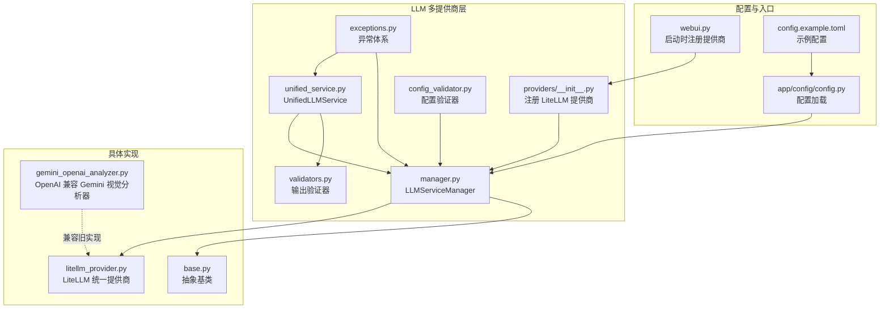
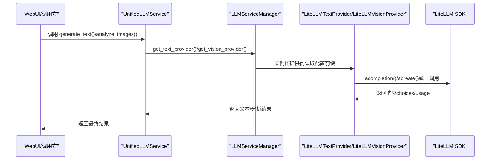
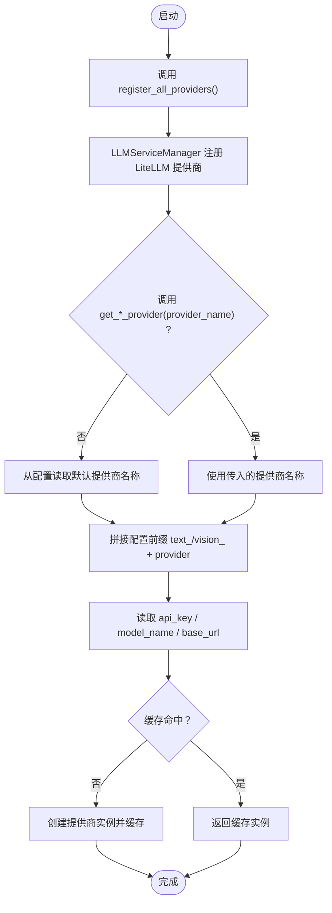
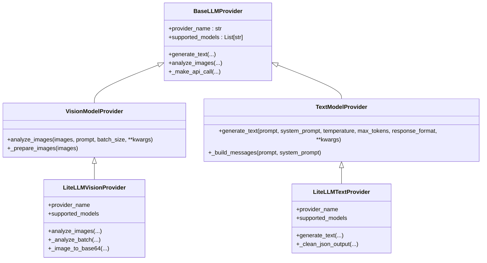
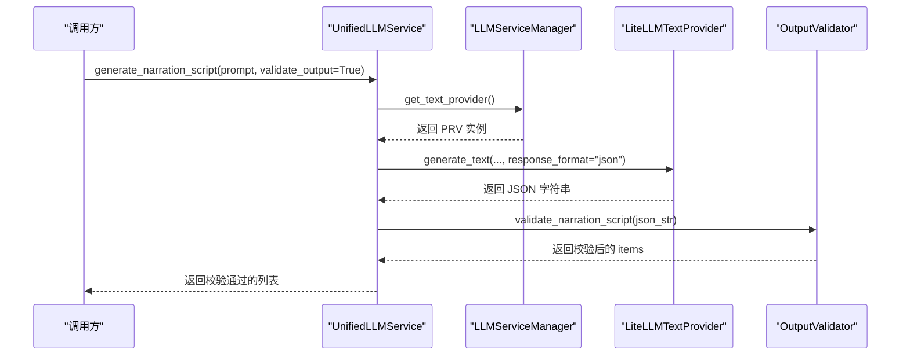
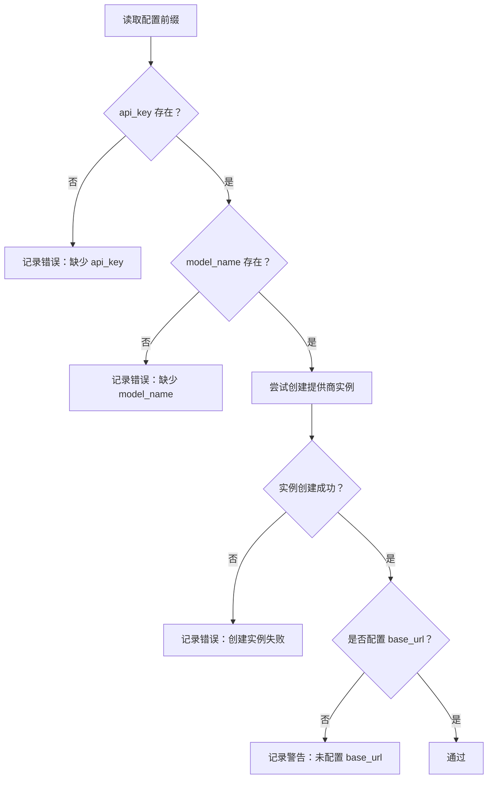
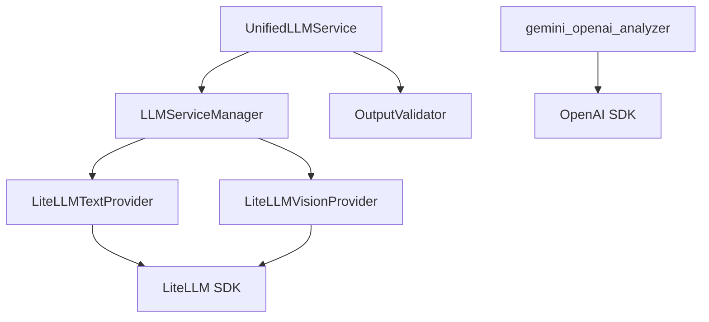

# 多提供商支持

<cite>
**本文引用的文件**   
- [app/services/llm/providers/__init__.py](file://app/services/llm/providers/__init__.py)
- [app/services/llm/manager.py](file://app/services/llm/manager.py)
- [app/services/llm/litellm_provider.py](file://app/services/llm/litellm_provider.py)
- [app/services/llm/unified_service.py](file://app/services/llm/unified_service.py)
- [app/services/llm/base.py](file://app/services/llm/base.py)
- [app/services/llm/exceptions.py](file://app/services/llm/exceptions.py)
- [app/services/llm/validators.py](file://app/services/llm/validators.py)
- [app/services/llm/config_validator.py](file://app/services/llm/config_validator.py)
- [app/services/llm/test_litellm_integration.py](file://app/services/llm/test_litellm_integration.py)
- [app/services/llm/test_llm_service.py](file://app/services/llm/test_llm_service.py)
- [webui.py](file://webui.py)
- [config.example.toml](file://config.example.toml)
- [app/config/config.py](file://app/config/config.py)
- [app/utils/gemini_openai_analyzer.py](file://app/utils/gemini_openai_analyzer.py)
</cite>

## 目录
1. [简介](#简介)
2. [项目结构](#项目结构)
3. [核心组件](#核心组件)
4. [架构总览](#架构总览)
5. [详细组件分析](#详细组件分析)
6. [依赖分析](#依赖分析)
7. [性能考虑](#性能考虑)
8. [故障排查指南](#故障排查指南)
9. [结论](#结论)
10. [附录](#附录)

## 简介
本文件面向“多提供商支持机制”，系统性阐述基于 LiteLLM 的统一接口设计，覆盖以下主题：
- 原生 Gemini API 与 OpenAI 兼容 API 的调用差异与适配策略
- 提供商检测与自动识别、切换机制
- API 密钥管理、基础 URL 配置、模型选择等关键参数处理
- 安全过滤机制与响应验证
- 配置示例与最佳实践
- 故障转移策略、性能对比与成本优化建议

## 项目结构
围绕 LLM 多提供商支持的相关模块主要位于 app/services/llm 下，采用“统一接口 + 管理器 + 验证器”的分层设计：
- providers/__init__.py：集中注册 LiteLLM 提供商实现
- manager.py：LLM 服务管理器，负责提供商注册、实例化与缓存
- litellm_provider.py：LiteLLM 统一提供商实现，覆盖文本与视觉两类能力
- unified_service.py：统一服务入口，封装常用业务流程（如生成解说文案、字幕分析）
- base.py、exceptions.py、validators.py、config_validator.py：抽象基类、异常体系、输出验证与配置验证
- test_*：集成测试与功能测试脚本
- webui.py：WebUI 启动时显式注册提供商，确保 LLM 功能可用
- config.example.toml：示例配置，展示 LiteLLM 的统一配置方式
- app/config/config.py：配置加载与保存
- app/utils/gemini_openai_analyzer.py：OpenAI 兼容的 Gemini 视觉分析器（兼容旧实现）

**图表来源**
- [app/services/llm/providers/__init__.py:12-44](file://app/services/llm/providers/__init__.py#L12-L44)
- [app/services/llm/manager.py:15-246](file://app/services/llm/manager.py#L15-L246)
- [app/services/llm/litellm_provider.py:59-491](file://app/services/llm/litellm_provider.py#L59-L491)
- [app/services/llm/unified_service.py:20-263](file://app/services/llm/unified_service.py#L20-L263)
- [app/services/llm/validators.py:15-201](file://app/services/llm/validators.py#L15-L201)
- [app/services/llm/config_validator.py:15-309](file://app/services/llm/config_validator.py#L15-L309)
- [webui.py:227-246](file://webui.py#L227-L246)
- [config.example.toml:1-177](file://config.example.toml#L1-L177)
- [app/config/config.py:24-95](file://app/config/config.py#L24-L95)
- [app/utils/gemini_openai_analyzer.py:22-178](file://app/utils/gemini_openai_analyzer.py#L22-L178)

**章节来源**
- [app/services/llm/providers/__init__.py:12-44](file://app/services/llm/providers/__init__.py#L12-L44)
- [app/services/llm/manager.py:15-246](file://app/services/llm/manager.py#L15-L246)
- [app/services/llm/litellm_provider.py:59-491](file://app/services/llm/litellm_provider.py#L59-L491)
- [app/services/llm/unified_service.py:20-263](file://app/services/llm/unified_service.py#L20-L263)
- [app/services/llm/validators.py:15-201](file://app/services/llm/validators.py#L15-L201)
- [app/services/llm/config_validator.py:15-309](file://app/services/llm/config_validator.py#L15-L309)
- [webui.py:227-246](file://webui.py#L227-L246)
- [config.example.toml:1-177](file://config.example.toml#L1-L177)
- [app/config/config.py:24-95](file://app/config/config.py#L24-L95)
- [app/utils/gemini_openai_analyzer.py:22-178](file://app/utils/gemini_openai_analyzer.py#L22-L178)

## 核心组件
- 抽象基类与异常体系
  - BaseLLMProvider、VisionModelProvider、TextModelProvider 定义统一接口与通用行为
  - 统一异常体系（ProviderNotFoundError、ConfigurationError、APICallError、RateLimitError、AuthenticationError、ContentFilterError、ValidationError 等）
- LiteLLM 统一提供商
  - LiteLLMVisionProvider/LiteLLMTextProvider：通过 LiteLLM SDK 统一调用 100+ 提供商，自动处理重试、超时、错误映射与 JSON 模式
  - 支持 SiliconFlow 等特殊场景的参数适配（替换 provider、设置 api_base、同步 api_key 环境变量）
- LLMServiceManager
  - 注册/获取提供商实例，支持缓存与配置前缀解析（text_*、vision_*）
  - 提供查询与诊断接口（列出提供商、获取提供商信息、清空缓存）
- UnifiedLLMService
  - 统一入口：图片分析、文本生成、JSON 格式生成、字幕分析、解说文案生成
  - 内置输出验证与日志
- 配置与验证
  - config.example.toml：示例配置，强调 LiteLLM 统一配置方式
  - LLMConfigValidator：逐项校验提供商配置，输出报告与建议
  - OutputValidator：严格 JSON Schema 验证与格式清理
- WebUI 启动流程
  - 启动时显式注册提供商，确保 LLM 功能可用

**章节来源**
- [app/services/llm/base.py:16-190](file://app/services/llm/base.py#L16-L190)
- [app/services/llm/exceptions.py:11-119](file://app/services/llm/exceptions.py#L11-L119)
- [app/services/llm/litellm_provider.py:59-491](file://app/services/llm/litellm_provider.py#L59-L491)
- [app/services/llm/manager.py:15-246](file://app/services/llm/manager.py#L15-L246)
- [app/services/llm/unified_service.py:20-263](file://app/services/llm/unified_service.py#L20-L263)
- [app/services/llm/validators.py:15-201](file://app/services/llm/validators.py#L15-L201)
- [app/services/llm/config_validator.py:15-309](file://app/services/llm/config_validator.py#L15-L309)
- [webui.py:227-246](file://webui.py#L227-L246)
- [config.example.toml:1-177](file://config.example.toml#L1-L177)

## 架构总览
多提供商支持采用“统一接口 + 管理器 + 验证器”的分层架构，核心流程如下：

**图表来源**
- [app/services/llm/unified_service.py:20-263](file://app/services/llm/unified_service.py#L20-L263)
- [app/services/llm/manager.py:68-208](file://app/services/llm/manager.py#L68-L208)
- [app/services/llm/litellm_provider.py:167-472](file://app/services/llm/litellm_provider.py#L167-L472)

## 详细组件分析

### 组件A：提供商注册与检测机制
- 注册机制
  - 通过 providers/__init__.py 的 register_all_providers() 在应用启动时集中注册 LiteLLM 提供商
  - LLMServiceManager.register_vision_provider()/register_text_provider() 将提供商类注册到字典中
- 检测与切换
  - LLMServiceManager.get_vision_provider()/get_text_provider() 依据配置前缀（vision_* 或 text_*）解析提供商名称与模型
  - 支持缓存，避免重复实例化
  - 未注册或配置缺失时抛出明确异常（ProviderNotFoundError、ConfigurationError）
- WebUI 启动时显式注册，便于定位问题

**图表来源**
- [app/services/llm/providers/__init__.py:12-44](file://app/services/llm/providers/__init__.py#L12-L44)
- [app/services/llm/manager.py:68-208](file://app/services/llm/manager.py#L68-L208)
- [webui.py:227-246](file://webui.py#L227-L246)

**章节来源**
- [app/services/llm/providers/__init__.py:12-44](file://app/services/llm/providers/__init__.py#L12-L44)
- [app/services/llm/manager.py:68-208](file://app/services/llm/manager.py#L68-L208)
- [webui.py:227-246](file://webui.py#L227-L246)

### 组件B：LiteLLM 统一提供商（文本与视觉）
- 文本生成（LiteLLMTextProvider）
  - 消息构建：支持 system_prompt + user prompt
  - JSON 模式：优先使用 response_format=json；若提供商不支持，则在提示词中约束输出格式，并二次清理
  - SiliconFlow 特殊处理：替换 provider 为 openai，设置 api_base，同步 OPENAI_API_KEY
  - 错误映射：认证、速率限制、请求错误、API 错误、内容过滤等
- 视觉分析（LiteLLMVisionProvider）
  - 图片预处理：统一转为 PIL.Image，尺寸压缩至 1024×1024 以内
  - 批处理：按 batch_size 分批，每批 base64 编码后发送
  - SiliconFlow 特殊处理：同上
  - 错误映射：与文本一致
- 配置与环境变量
  - 根据 provider 自动设置环境变量（如 GEMINI_API_KEY、OPENAI_API_KEY 等）
  - 支持自定义 base_url，通过 api_base 传入 LiteLLM

**图表来源**
- [app/services/llm/base.py:16-190](file://app/services/llm/base.py#L16-L190)
- [app/services/llm/litellm_provider.py:59-491](file://app/services/llm/litellm_provider.py#L59-L491)

**章节来源**
- [app/services/llm/litellm_provider.py:59-491](file://app/services/llm/litellm_provider.py#L59-L491)
- [app/services/llm/base.py:16-190](file://app/services/llm/base.py#L16-L190)

### 组件C：统一服务与业务流程
- UnifiedLLMService
  - generate_text：封装温度、最大 token、JSON 模式等参数
  - analyze_images：封装批处理、错误兜底
  - generate_narration_script：强制 JSON 输出并通过 OutputValidator 校验
  - analyze_subtitle：内置系统提示词，支持输出验证
- OutputValidator
  - validate_json_output：清理 markdown 代码块标记，支持 schema 校验
  - validate_narration_script：严格校验 items 数组与字段
  - validate_subtitle_analysis：基础长度与关键词校验

**图表来源**
- [app/services/llm/unified_service.py:111-160](file://app/services/llm/unified_service.py#L111-L160)
- [app/services/llm/validators.py:90-144](file://app/services/llm/validators.py#L90-L144)
- [app/services/llm/manager.py:137-208](file://app/services/llm/manager.py#L137-L208)

**章节来源**
- [app/services/llm/unified_service.py:20-263](file://app/services/llm/unified_service.py#L20-L263)
- [app/services/llm/validators.py:15-201](file://app/services/llm/validators.py#L15-L201)

### 组件D：配置与验证
- 配置前缀规范
  - 视觉：vision_{provider}_api_key、vision_{provider}_model_name、vision_{provider}_base_url
  - 文本：text_{provider}_api_key、text_{provider}_model_name、text_{provider}_base_url
- LLMConfigValidator
  - 逐项校验配置有效性，尝试创建提供商实例
  - 输出错误与警告清单，提供通用建议
- 示例配置
  - config.example.toml 强调使用 LiteLLM 统一配置（vision_llm_provider = "litellm" 等）

**图表来源**
- [app/services/llm/config_validator.py:87-199](file://app/services/llm/config_validator.py#L87-L199)
- [app/services/llm/manager.py:105-116](file://app/services/llm/manager.py#L105-L116)
- [config.example.toml:23-51](file://config.example.toml#L23-L51)

**章节来源**
- [app/services/llm/config_validator.py:15-309](file://app/services/llm/config_validator.py#L15-L309)
- [app/services/llm/manager.py:105-116](file://app/services/llm/manager.py#L105-L116)
- [config.example.toml:1-177](file://config.example.toml#L1-L177)

### 组件E：安全过滤与响应验证
- 内容安全过滤
  - LiteLLMTextProvider/LiteLLMVisionProvider 对 LiteLLMAPIError/ContentFilterError 进行捕获并映射为 ContentFilterError
  - 错误信息中包含“SAFETY”或“content_filter”关键字时触发
- 输出验证
  - OutputValidator.validate_json_output：清理 markdown 代码块标记，支持 schema 校验
  - validate_narration_script：严格校验 items 结构与字段
  - validate_subtitle_analysis：长度与关键词校验

**章节来源**
- [app/services/llm/litellm_provider.py:235-252](file://app/services/llm/litellm_provider.py#L235-L252)
- [app/services/llm/litellm_provider.py:444-469](file://app/services/llm/litellm_provider.py#L444-L469)
- [app/services/llm/validators.py:15-201](file://app/services/llm/validators.py#L15-L201)

### 组件F：OpenAI 兼容的 Gemini 视觉分析器（兼容旧实现）
- 通过 OpenAI 兼容接口调用 Gemini 代理端点
- 支持 base64 图片编码、批量处理、重试机制
- 适用于需要直接使用 OpenAI SDK 的场景（与 LiteLLM 统一接口互补）

**章节来源**
- [app/utils/gemini_openai_analyzer.py:22-178](file://app/utils/gemini_openai_analyzer.py#L22-L178)

## 依赖分析
- 组件耦合
  - LLMServiceManager 与 LiteLLMTextProvider/LiteLLMVisionProvider：松耦合，通过注册机制解耦
  - UnifiedLLMService 依赖 LLMServiceManager 与 OutputValidator，职责清晰
  - BaseLLMProvider 为抽象层，降低具体提供商差异
- 外部依赖
  - LiteLLM：统一 SDK、自动重试、错误映射、成本追踪
  - OpenAI SDK：兼容旧实现（gemini_openai_analyzer）
- 潜在风险
  - 配置缺失或 provider 名称不匹配会导致实例化失败
  - SiliconFlow 等特殊 provider 需要正确设置 api_base 与 api_key 环境变量

**图表来源**
- [app/services/llm/manager.py:15-246](file://app/services/llm/manager.py#L15-L246)
- [app/services/llm/unified_service.py:20-263](file://app/services/llm/unified_service.py#L20-L263)
- [app/services/llm/litellm_provider.py:59-491](file://app/services/llm/litellm_provider.py#L59-L491)
- [app/utils/gemini_openai_analyzer.py:22-178](file://app/utils/gemini_openai_analyzer.py#L22-L178)

**章节来源**
- [app/services/llm/manager.py:15-246](file://app/services/llm/manager.py#L15-L246)
- [app/services/llm/unified_service.py:20-263](file://app/services/llm/unified_service.py#L20-L263)
- [app/services/llm/litellm_provider.py:59-491](file://app/services/llm/litellm_provider.py#L59-L491)
- [app/utils/gemini_openai_analyzer.py:22-178](file://app/utils/gemini_openai_analyzer.py#L22-L178)

## 性能考虑
- 批处理与图片压缩
  - 视觉分析默认批大小为 10，图片压缩至 1024×1024 以内，兼顾速度与质量
- 超时与重试
  - LiteLLM 全局超时与重试次数由配置控制，减少网络抖动影响
- 成本与 Token 统计
  - LiteLLM 内置成本追踪与 usage 统计，便于成本优化
- 并发与缓存
  - LLMServiceManager 对提供商实例进行缓存，避免重复初始化

**章节来源**
- [app/services/llm/litellm_provider.py:130-165](file://app/services/llm/litellm_provider.py#L130-L165)
- [app/services/llm/base.py:126-150](file://app/services/llm/base.py#L126-L150)
- [app/services/llm/manager.py:24-27](file://app/services/llm/manager.py#L24-L27)
- [config.example.toml:4-7](file://config.example.toml#L4-L7)

## 故障排查指南
- 常见错误与定位
  - ProviderNotFoundError：检查提供商名称是否正确、是否已注册
  - ConfigurationError：检查配置前缀（text_* 或 vision_*）下的 api_key、model_name、base_url 是否齐全
  - APICallError/RateLimitError/AuthenticationError：检查 API 密钥、配额与速率限制
  - ContentFilterError：检查提示词与内容安全策略
- 配置验证
  - 使用 LLMConfigValidator.validate_all_configs() 输出详细报告
  - 参考 config.example.toml 的示例配置修正
- 单元测试与集成测试
  - test_llm_service.py：覆盖文本生成、JSON 生成、字幕分析、解说文案生成等
  - test_litellm_integration.py：验证注册、向后兼容性与使用指南

**章节来源**
- [app/services/llm/exceptions.py:11-119](file://app/services/llm/exceptions.py#L11-L119)
- [app/services/llm/config_validator.py:15-309](file://app/services/llm/config_validator.py#L15-L309)
- [app/services/llm/test_llm_service.py:1-264](file://app/services/llm/test_llm_service.py#L1-L264)
- [app/services/llm/test_litellm_integration.py:1-229](file://app/services/llm/test_litellm_integration.py#L1-L229)

## 结论
本多提供商支持机制以 LiteLLM 为核心，实现了：
- 统一接口与错误处理，显著降低维护成本
- 灵活的提供商切换与配置管理
- 严格的安全过滤与输出验证
- 完善的配置验证与测试保障

对于新项目，推荐直接使用 LiteLLM 统一配置；对于旧项目，可在保证测试充分的前提下逐步迁移。

## 附录
- 配置示例与最佳实践
  - 视觉模型：vision_llm_provider = "litellm"，vision_litellm_model_name = "gemini/gemini-2.0-flash-lite"，配置对应 API Key
  - 文本模型：text_llm_provider = "litellm"，text_litellm_model_name = "deepseek/deepseek-chat"，配置对应 API Key
  - 建议为每个提供商配置 base_url 以提升稳定性
- 故障转移策略
  - 多提供商配置：在配置中为同一类型配置多个提供商，通过缓存与异常回退策略实现自动切换
  - 降级策略：当某提供商触发 RateLimitError 或 ContentFilterError 时，切换到备用提供商
- 性能对比与成本优化
  - LiteLLM 内置成本追踪与 usage 统计，便于对比不同提供商的成本与性能
  - 通过批处理、图片压缩与合理的超时/重试配置优化整体吞吐与成本

**章节来源**
- [config.example.toml:23-51](file://config.example.toml#L23-L51)
- [app/services/llm/litellm_provider.py:39-56](file://app/services/llm/litellm_provider.py#L39-L56)
- [app/services/llm/manager.py:210-216](file://app/services/llm/manager.py#L210-L216)