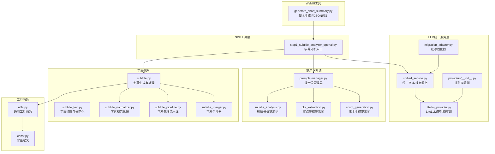
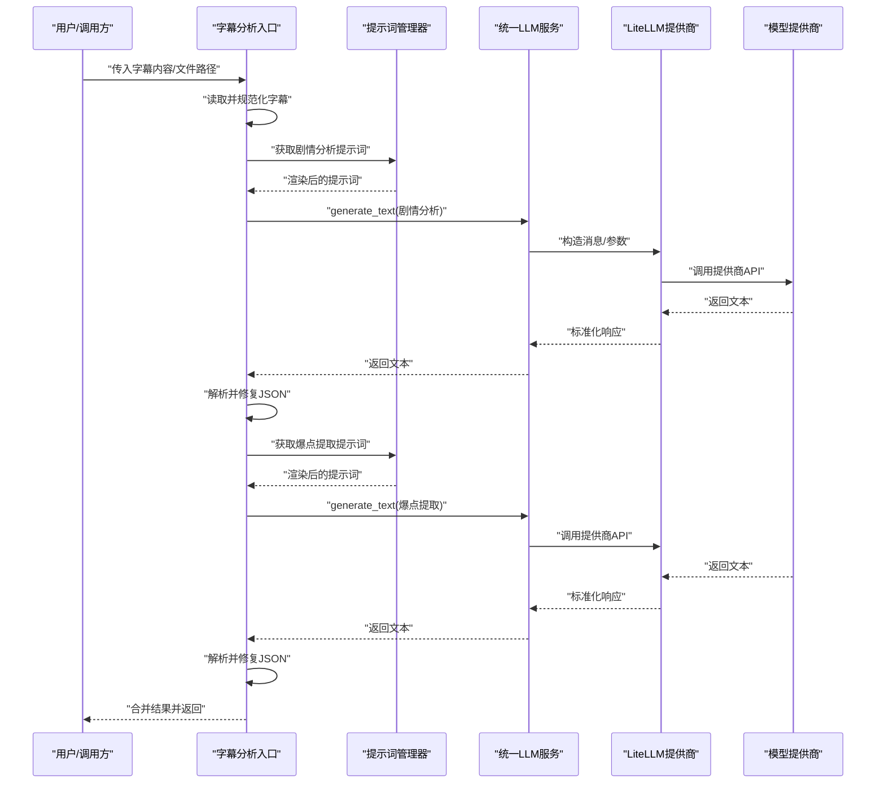
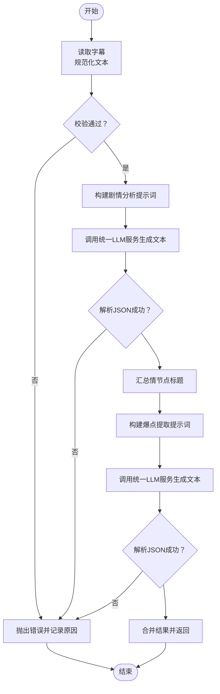
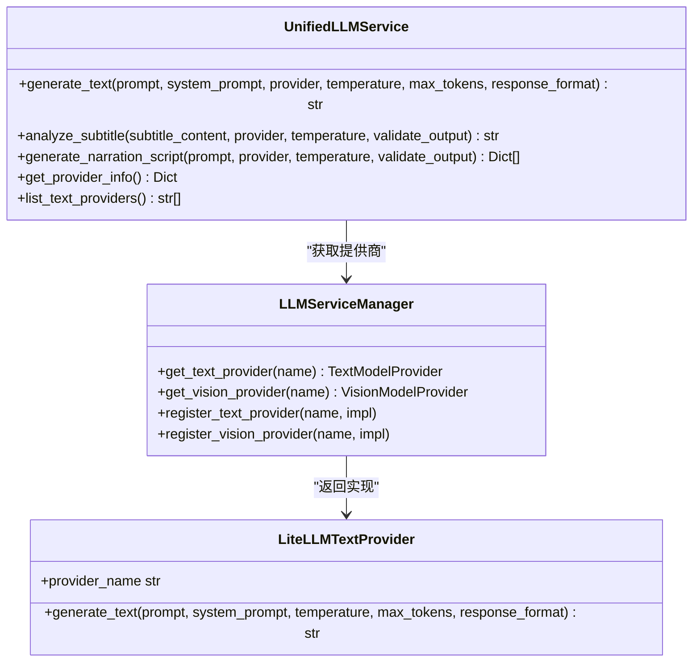
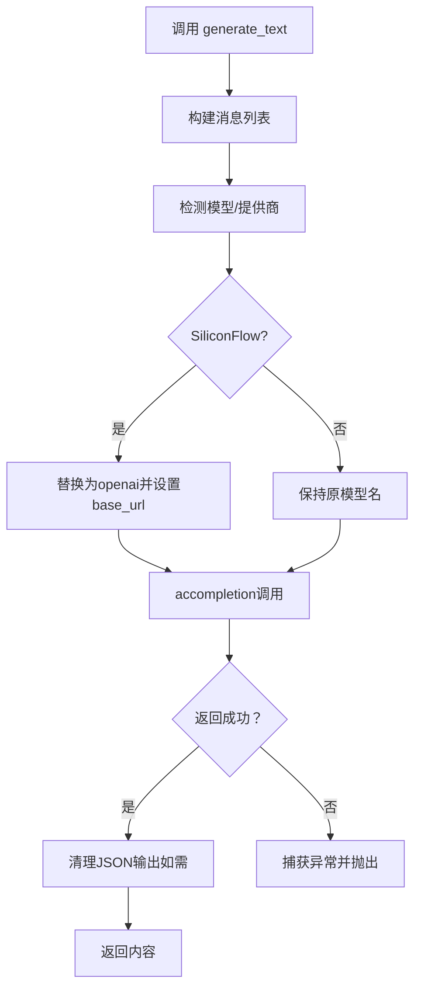
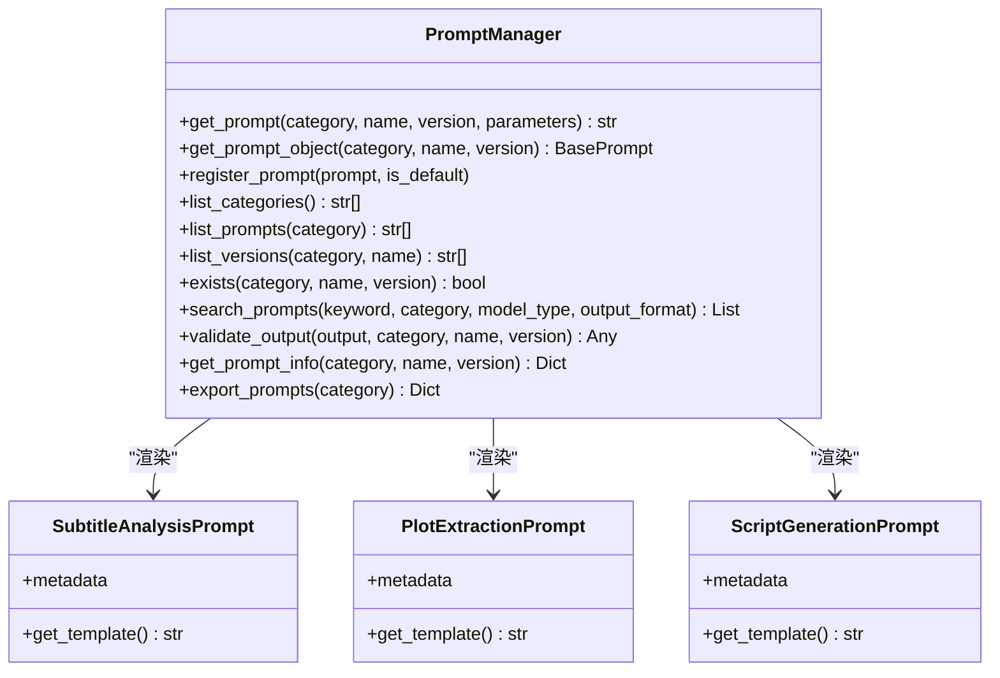
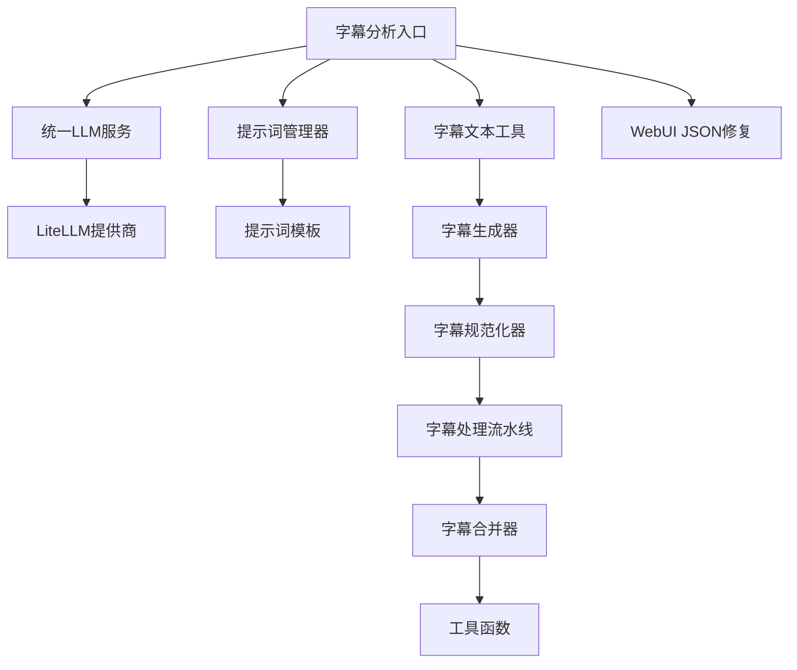

# 字幕分析器

<cite>
**本文引用的文件**
- [app/services/SDP/utils/step1_subtitle_analyzer_openai.py](file://app/services/SDP/utils/step1_subtitle_analyzer_openai.py)
- [app/services/llm/unified_service.py](file://app/services/llm/unified_service.py)
- [app/services/llm/litellm_provider.py](file://app/services/llm/litellm_provider.py)
- [app/services/llm/providers/__init__.py](file://app/services/llm/providers/__init__.py)
- [app/services/llm/migration_adapter.py](file://app/services/llm/migration_adapter.py)
- [app/services/prompts/manager.py](file://app/services/prompts/manager.py)
- [app/services/prompts/short_drama_editing/subtitle_analysis.py](file://app/services/prompts/short_drama_editing/subtitle_analysis.py)
- [app/services/prompts/short_drama_editing/plot_extraction.py](file://app/services/prompts/short_drama_editing/plot_extraction.py)
- [app/services/prompts/short_drama_narration/script_generation.py](file://app/services/prompts/short_drama_narration/script_generation.py)
- [app/services/subtitle_text.py](file://app/services/subtitle_text.py)
- [app/services/subtitle.py](file://app/services/subtitle.py)
- [app/services/subtitle_normalizer.py](file://app/services/subtitle_normalizer.py)
- [app/services/subtitle_pipeline.py](file://app/services/subtitle_pipeline.py)
- [app/services/subtitle_merger.py](file://app/services/subtitle_merger.py)
- [app/utils/utils.py](file://app/utils/utils.py)
- [app/models/const.py](file://app/models/const.py)
- [webui/tools/generate_short_summary.py](file://webui/tools/generate_short_summary.py)
- [config.example.toml](file://config.example.toml)
</cite>

## 目录
1. [简介](#简介)
2. [项目结构](#项目结构)
3. [核心组件](#核心组件)
4. [架构总览](#架构总览)
5. [详细组件分析](#详细组件分析)
6. [依赖分析](#依赖分析)
7. [性能考量](#性能考量)
8. [故障排查指南](#故障排查指南)
9. [结论](#结论)
10. [附录](#附录)

## 简介
本文件面向"字幕分析器"的使用者与维护者，系统性阐述SubtitleAnalyzer类（以及其适配器与统一服务层）的核心功能、初始化参数、多提供商支持机制、分析流程、错误处理与性能优化建议。重点覆盖：
- 字幕内容读取与规范化
- 剧情提取与JSON格式化输出
- 统一LLM服务与LiteLLM提供商集成
- 原生Gemini API与OpenAI兼容API的调用差异
- 从字幕文件到剧情分析的完整工作流
- 实际使用示例与最佳实践

## 项目结构
围绕字幕分析器的相关模块主要分布在以下位置：
- SDP工具层：负责字幕分析入口与提示词组装
- LLM统一服务层：封装文本生成、图片分析、提供商管理
- 提示词系统：集中管理各类提示词模板与渲染
- 字幕文本工具：跨平台字幕读取与时间码规范化
- 字幕处理流水线：完整的字幕生成、规范化和合并流程
- WebUI工具：面向前端的脚本生成与错误修复

**图表来源**
- [app/services/SDP/utils/step1_subtitle_analyzer_openai.py:1-173](file://app/services/SDP/utils/step1_subtitle_analyzer_openai.py#L1-L173)
- [app/services/llm/unified_service.py:1-263](file://app/services/llm/unified_service.py#L1-L263)
- [app/services/llm/litellm_provider.py:1-491](file://app/services/llm/litellm_provider.py#L1-L491)
- [app/services/llm/providers/__init__.py:1-44](file://app/services/llm/providers/__init__.py#L1-L44)
- [app/services/llm/migration_adapter.py:1-342](file://app/services/llm/migration_adapter.py#L1-L342)
- [app/services/prompts/manager.py:1-288](file://app/services/prompts/manager.py#L1-L288)
- [app/services/prompts/short_drama_editing/subtitle_analysis.py:1-118](file://app/services/prompts/short_drama_editing/subtitle_analysis.py#L1-L118)
- [app/services/prompts/short_drama_editing/plot_extraction.py:1-141](file://app/services/prompts/short_drama_editing/plot_extraction.py#L1-L141)
- [app/services/prompts/short_drama_narration/script_generation.py:1-308](file://app/services/prompts/short_drama_narration/script_generation.py#L1-L308)
- [app/services/subtitle_text.py:1-125](file://app/services/subtitle_text.py#L1-L125)
- [app/services/subtitle.py:1-467](file://app/services/subtitle.py#L1-L467)
- [app/services/subtitle_normalizer.py:1-154](file://app/services/subtitle_normalizer.py#L1-L154)
- [app/services/subtitle_pipeline.py:1-64](file://app/services/subtitle_pipeline.py#L1-L64)
- [app/services/subtitle_merger.py:1-239](file://app/services/subtitle_merger.py#L1-L239)
- [app/utils/utils.py:1-675](file://app/utils/utils.py#L1-L675)
- [app/models/const.py:1-26](file://app/models/const.py#L1-L26)
- [webui/tools/generate_short_summary.py:1-290](file://webui/tools/generate_short_summary.py#L1-L290)

**章节来源**
- [app/services/SDP/utils/step1_subtitle_analyzer_openai.py:1-173](file://app/services/SDP/utils/step1_subtitle_analyzer_openai.py#L1-L173)
- [app/services/llm/unified_service.py:1-263](file://app/services/llm/unified_service.py#L1-L263)
- [app/services/llm/litellm_provider.py:1-491](file://app/services/llm/litellm_provider.py#L1-L491)
- [app/services/llm/providers/__init__.py:1-44](file://app/services/llm/providers/__init__.py#L1-L44)
- [app/services/llm/migration_adapter.py:1-342](file://app/services/llm/migration_adapter.py#L1-L342)
- [app/services/prompts/manager.py:1-288](file://app/services/prompts/manager.py#L1-L288)
- [app/services/prompts/short_drama_editing/subtitle_analysis.py:1-118](file://app/services/prompts/short_drama_editing/subtitle_analysis.py#L1-L118)
- [app/services/prompts/short_drama_editing/plot_extraction.py:1-141](file://app/services/prompts/short_drama_editing/plot_extraction.py#L1-L141)
- [app/services/prompts/short_drama_narration/script_generation.py:1-308](file://app/services/prompts/short_drama_narration/script_generation.py#L1-L308)
- [app/services/subtitle_text.py:1-125](file://app/services/subtitle_text.py#L1-L125)
- [app/services/subtitle.py:1-467](file://app/services/subtitle.py#L1-L467)
- [app/services/subtitle_normalizer.py:1-154](file://app/services/subtitle_normalizer.py#L1-L154)
- [app/services/subtitle_pipeline.py:1-64](file://app/services/subtitle_pipeline.py#L1-L64)
- [app/services/subtitle_merger.py:1-239](file://app/services/subtitle_merger.py#L1-L239)
- [app/utils/utils.py:1-675](file://app/utils/utils.py#L1-L675)
- [app/models/const.py:1-26](file://app/models/const.py#L1-L26)
- [webui/tools/generate_short_summary.py:1-290](file://webui/tools/generate_short_summary.py#L1-L290)

## 核心组件
- 字幕分析入口（step1_subtitle_analyzer_openai）
  - 负责读取字幕、规范化文本、校验时间码、选择提示词、调用统一LLM服务、解析JSON并合并结果。
- 统一LLM服务（UnifiedLLMService）
  - 提供generate_text、analyze_subtitle、generate_narration_script等统一接口，屏蔽提供商差异。
- LiteLLM提供商（LiteLLMTextProvider）
  - 支持100+提供商，自动处理认证、重试、JSON模式、不同提供商的响应差异。
- 提示词管理器（PromptManager）
  - 统一注册、渲染、校验提示词，支持版本与参数化模板。
- 字幕文本工具（subtitle_text）
  - 跨平台读取与规范化，保证时间码一致性与编码兼容。
- 字幕处理流水线（subtitle_pipeline）
  - 完整的字幕生成、规范化和合并流程，支持多种字幕源。
- 字幕规范化器（subtitle_normalizer）
  - 提供字幕段落的清洗、合并和格式化功能。
- 字幕合并器（subtitle_merger）
  - 支持多字幕文件的时间偏移和内容合并。
- 工具函数（utils）
  - 提供SRT格式转换、标点符号检测、字符串分割等通用功能。
- 迁移适配器（SubtitleAnalyzerAdapter）
  - 为旧实现提供向后兼容接口，逐步迁移到统一服务。

**章节来源**
- [app/services/SDP/utils/step1_subtitle_analyzer_openai.py:17-173](file://app/services/SDP/utils/step1_subtitle_analyzer_openai.py#L17-L173)
- [app/services/llm/unified_service.py:20-263](file://app/services/llm/unified_service.py#L20-L263)
- [app/services/llm/litellm_provider.py:266-491](file://app/services/llm/litellm_provider.py#L266-L491)
- [app/services/prompts/manager.py:26-288](file://app/services/prompts/manager.py#L26-L288)
- [app/services/subtitle_text.py:21-125](file://app/services/subtitle_text.py#L21-L125)
- [app/services/subtitle_pipeline.py:33-64](file://app/services/subtitle_pipeline.py#L33-L64)
- [app/services/subtitle_normalizer.py:82-141](file://app/services/subtitle_normalizer.py#L82-L141)
- [app/services/subtitle_merger.py:62-185](file://app/services/subtitle_merger.py#L62-L185)
- [app/utils/utils.py:221-275](file://app/utils/utils.py#L221-L275)
- [app/services/llm/migration_adapter.py:207-342](file://app/services/llm/migration_adapter.py#L207-L342)

## 架构总览
字幕分析器采用"提示词驱动 + 统一LLM服务 + LiteLLM提供商"的分层架构：
- 输入层：字幕文件或字幕文本
- 规范化层：时间码与编码规范化
- 提示词层：剧情分析 → 爆点提取 → 脚本生成
- 服务层：统一文本生成接口
- 提供商层：LiteLLM抽象OpenAI/Gemini/Qwen等多家提供商
- 输出层：结构化JSON（剧情梗概、关键情节点、时间段）

**图表来源**
- [app/services/SDP/utils/step1_subtitle_analyzer_openai.py:90-173](file://app/services/SDP/utils/step1_subtitle_analyzer_openai.py#L90-L173)
- [app/services/prompts/manager.py:34-61](file://app/services/prompts/manager.py#L34-L61)
- [app/services/llm/unified_service.py:65-110](file://app/services/llm/unified_service.py#L65-L110)
- [app/services/llm/litellm_provider.py:349-472](file://app/services/llm/litellm_provider.py#L349-L472)

## 详细组件分析

### 字幕分析入口（step1_subtitle_analyzer_openai）
- 功能要点
  - 读取字幕：支持直接传入字幕文本或文件路径
  - 规范化：统一换行、去除BOM、规范化时间码毫秒分隔符
  - 校验：必须包含有效时间码；内容长度需满足阈值
  - 提示词：使用提示词管理器获取"剧情分析"和"爆点提取"模板
  - 统一服务：通过迁移适配器调用UnifiedLLMService生成文本
  - JSON解析：使用WebUI工具中的解析器修复LLM输出
  - 结果合并：整合剧情梗概、情节点与时间段
- 初始化参数
  - model_name：模型名称（如 deepseek/..., gpt-4o, gemini-2.0-flash）
  - api_key：提供商API密钥
  - base_url：提供商基础URL（可选）
  - custom_clips：提取的关键情节点数量
  - provider：提供商名称（如 openai, gemini, deepseek），可自动推断
  - srt_path / subtitle_content：二者择一
- 错误处理
  - 参数缺失、内容为空、无时间码、解析失败均抛出异常并记录详细原因

**图表来源**
- [app/services/SDP/utils/step1_subtitle_analyzer_openai.py:17-173](file://app/services/SDP/utils/step1_subtitle_analyzer_openai.py#L17-L173)
- [webui/tools/generate_short_summary.py:26-136](file://webui/tools/generate_short_summary.py#L26-L136)

**章节来源**
- [app/services/SDP/utils/step1_subtitle_analyzer_openai.py:17-173](file://app/services/SDP/utils/step1_subtitle_analyzer_openai.py#L17-L173)
- [app/services/subtitle_text.py:33-125](file://app/services/subtitle_text.py#L33-L125)
- [webui/tools/generate_short_summary.py:26-136](file://webui/tools/generate_short_summary.py#L26-L136)

### 统一LLM服务（UnifiedLLMService）
- 功能要点
  - generate_text：通用文本生成接口，支持system_prompt、temperature、max_tokens、response_format
  - analyze_subtitle：专门的字幕分析接口，内置系统提示词与输出校验
  - generate_narration_script：生成解说脚本，支持JSON校验
  - 提供商透明：通过LLMServiceManager获取文本/视觉提供商
- 关键参数
  - provider：提供商名称（如 litellm/openai/gemini）
  - temperature：采样温度
  - max_tokens：最大token数
  - response_format：JSON模式（如 "json"）

**图表来源**
- [app/services/llm/unified_service.py:20-263](file://app/services/llm/unified_service.py#L20-L263)
- [app/services/llm/litellm_provider.py:266-491](file://app/services/llm/litellm_provider.py#L266-L491)
- [app/services/llm/providers/__init__.py:12-34](file://app/services/llm/providers/__init__.py#L12-L34)

**章节来源**
- [app/services/llm/unified_service.py:20-263](file://app/services/llm/unified_service.py#L20-L263)
- [app/services/llm/providers/__init__.py:12-34](file://app/services/llm/providers/__init__.py#L12-L34)

### LiteLLM提供商（LiteLLMTextProvider）
- 功能要点
  - 自动设置API Key与Base URL（映射到各提供商环境变量）
  - JSON模式兼容：对不支持response_format的模型进行降级处理
  - 错误处理：认证失败、速率限制、内容过滤、API错误等
  - SiliconFlow特殊处理：替换provider为openai并设置base_url
- 调用差异
  - OpenAI兼容：使用chat.completions接口
  - 原生Gemini：使用REST API端点（另有原生Gemini分析器）
- 性能特性
  - 自动重试、超时配置、token统计

**图表来源**
- [app/services/llm/litellm_provider.py:349-472](file://app/services/llm/litellm_provider.py#L349-L472)

**章节来源**
- [app/services/llm/litellm_provider.py:1-491](file://app/services/llm/litellm_provider.py#L1-L491)

### 提示词系统（PromptManager与模板）
- 功能要点
  - 注册与搜索：按分类、名称、版本检索提示词
  - 渲染：将模板与参数渲染为最终提示词
  - 校验：针对不同提示词类型（JSON/文本）进行输出校验
  - 版本管理：支持多版本并行与默认版本切换
- 模板类别
  - short_drama_editing：剧情分析、爆点提取
  - short_drama_narration：脚本生成
- 关键模板
  - 剧情分析：提取完整叙事结构、关键情节点、分析细节
  - 爆点提取：定位时间段、上下文说明、衔接说明
  - 脚本生成：黄金开场、爽点放大、原声片段使用规范

**图表来源**
- [app/services/prompts/manager.py:26-288](file://app/services/prompts/manager.py#L26-L288)
- [app/services/prompts/short_drama_editing/subtitle_analysis.py:15-118](file://app/services/prompts/short_drama_editing/subtitle_analysis.py#L15-L118)
- [app/services/prompts/short_drama_editing/plot_extraction.py:15-141](file://app/services/prompts/short_drama_editing/plot_extraction.py#L15-L141)
- [app/services/prompts/short_drama_narration/script_generation.py:15-308](file://app/services/prompts/short_drama_narration/script_generation.py#L15-L308)

**章节来源**
- [app/services/prompts/manager.py:26-288](file://app/services/prompts/manager.py#L26-L288)
- [app/services/prompts/short_drama_editing/subtitle_analysis.py:1-118](file://app/services/prompts/short_drama_editing/subtitle_analysis.py#L1-L118)
- [app/services/prompts/short_drama_editing/plot_extraction.py:1-141](file://app/services/prompts/short_drama_editing/plot_extraction.py#L1-L141)
- [app/services/prompts/short_drama_narration/script_generation.py:1-308](file://app/services/prompts/short_drama_narration/script_generation.py#L1-L308)

### 字幕文本工具（subtitle_text）
- 功能要点
  - has_timecodes：快速检测时间码
  - normalize_subtitle_text：统一换行、去除BOM、规范化毫秒分隔符
  - decode_subtitle_bytes：尝试多种编码并优先选择包含时间码的解码
  - read_subtitle_text：从磁盘读取并返回文本与编码信息
- 兼容性
  - 支持UTF-8/UTF-16/GBK/GB2312等常见编码
  - 自动处理Windows下SRT文件的编码与换行问题

**章节来源**
- [app/services/subtitle_text.py:21-125](file://app/services/subtitle_text.py#L21-L125)

### 字幕处理流水线（subtitle_pipeline）
- 功能要点
  - 解析显式字幕路径：支持多种字幕文件属性
  - 构建字幕段落：从外挂字幕或自动生成的字幕创建段落
  - 标准化处理：应用字幕规范化器清洗和合并段落
  - 持久化输出：将标准化后的字幕写回SRT文件
- 关键流程
  - 路径解析：优先使用显式提供的字幕路径
  - 生成逻辑：当字幕不存在或需要重新生成时自动创建
  - 标准化：应用清洗、合并和格式化规则
  - 回写：将结果持久化到文件系统

**章节来源**
- [app/services/subtitle_pipeline.py:19-64](file://app/services/subtitle_pipeline.py#L19-L64)

### 字幕规范化器（subtitle_normalizer）
- 功能要点
  - 时间码转换：SRT时间格式与秒数之间的双向转换
  - SRT解析：从文件中解析字幕块为结构化数据
  - 段落清洗：去除空白字符、标点符号处理
  - 段落合并：智能合并相邻且符合条件的字幕段
  - 格式化输出：将结构化数据转换回SRT格式
- 参数配置
  - max_chars：每段最大字符数，默认42
  - max_duration：每段最大持续时间，默认8.0秒
  - min_duration：每段最小持续时间，默认0.35秒
  - merge_gap：合并间隙阈值，默认0.45秒

**章节来源**
- [app/services/subtitle_normalizer.py:14-154](file://app/services/subtitle_normalizer.py#L14-L154)

### 字幕合并器（subtitle_merger）
- 功能要点
  - 时间偏移处理：根据editedTimeRange为字幕应用时间偏移
  - 多文件合并：支持多个SRT文件的合并和去重
  - 内容验证：检查字幕文件的有效性和完整性
  - 格式转换：确保合并后的字幕格式正确
- 时间处理
  - 解析时间字符串为timedelta对象
  - 格式化timedelta对象为SRT时间字符串
  - 解析editedTimeRange提取时间范围

**章节来源**
- [app/services/subtitle_merger.py:16-185](file://app/services/subtitle_merger.py#L16-L185)

### 工具函数（utils）
- 功能要点
  - SRT格式转换：text_to_srt将索引、消息和时间转换为SRT格式
  - 标点符号检测：str_contains_punctuation判断字符串是否包含标点符号
  - 字符串分割：split_string_by_punctuations按标点符号分割字符串
  - 常量定义：PUNCTUATIONS包含中英文标点符号集合
- 性能优化
  - 使用const.PUNCTUATIONS避免重复定义
  - 优化字符串处理算法提高处理效率

**章节来源**
- [app/utils/utils.py:221-275](file://app/utils/utils.py#L221-L275)
- [app/models/const.py:1-26](file://app/models/const.py#L1-L26)

### 迁移适配器（SubtitleAnalyzerAdapter）
- 功能要点
  - analyze_subtitle：调用统一服务并返回兼容结构
  - generate_narration_script：构建脚本生成提示词并返回JSON字符串
  - _run_async_safely：在不同事件循环环境下安全运行异步协程
  - _clean_json_output：清理Markdown代码块等格式干扰
- 价值
  - 为旧实现提供向后兼容接口，平滑过渡到统一服务

**章节来源**
- [app/services/llm/migration_adapter.py:207-342](file://app/services/llm/migration_adapter.py#L207-L342)

### 字幕生成与处理（subtitle）
- 功能要点
  - Whisper模型集成：支持faster-whisper大型模型的本地部署
  - CUDA/CPU自动选择：根据硬件能力自动选择最优计算设备
  - VAD过滤：使用语音活动检测减少静音段
  - 字幕段落生成：智能断句和时间戳对齐
  - 字幕修正：基于脚本相似度的字幕纠正功能
  - 多提供商支持：支持Whisper和Gemini两种字幕生成方式
- 新增功能（增强）
  - **更新** 改进了字幕规范化和处理能力，新增44行代码
  - **更新** 增强了字幕生成的准确性，特别是在标点符号处理方面
  - **更新** 优化了字幕段落的断句逻辑，提高了字幕质量

**章节来源**
- [app/services/subtitle.py:26-467](file://app/services/subtitle.py#L26-L467)

## 依赖分析
- 组件耦合
  - 字幕分析入口依赖提示词管理器与统一LLM服务
  - 统一LLM服务依赖提供商注册与LiteLLM实现
  - 提示词系统独立于LLM实现，通过渲染接口耦合
  - 字幕处理流水线依赖字幕生成器、规范化器和合并器
- 外部依赖
  - LiteLLM：统一多家提供商接口
  - OpenAI兼容端点：支持OpenAI/Gemini代理
  - Whisper模型：本地语音识别
  - WebUI工具：JSON解析与修复

**图表来源**
- [app/services/SDP/utils/step1_subtitle_analyzer_openai.py:1-173](file://app/services/SDP/utils/step1_subtitle_analyzer_openai.py#L1-L173)
- [app/services/llm/unified_service.py:1-263](file://app/services/llm/unified_service.py#L1-L263)
- [app/services/llm/litellm_provider.py:1-491](file://app/services/llm/litellm_provider.py#L1-L491)
- [app/services/prompts/manager.py:1-288](file://app/services/prompts/manager.py#L1-L288)
- [app/services/subtitle_text.py:1-125](file://app/services/subtitle_text.py#L1-L125)
- [app/services/subtitle.py:1-467](file://app/services/subtitle.py#L1-L467)
- [app/services/subtitle_normalizer.py:1-154](file://app/services/subtitle_normalizer.py#L1-L154)
- [app/services/subtitle_pipeline.py:1-64](file://app/services/subtitle_pipeline.py#L1-L64)
- [app/services/subtitle_merger.py:1-239](file://app/services/subtitle_merger.py#L1-L239)
- [app/utils/utils.py:1-675](file://app/utils/utils.py#L1-L675)
- [webui/tools/generate_short_summary.py:1-290](file://webui/tools/generate_short_summary.py#L1-L290)

**章节来源**
- [app/services/SDP/utils/step1_subtitle_analyzer_openai.py:1-173](file://app/services/SDP/utils/step1_subtitle_analyzer_openai.py#L1-L173)
- [app/services/llm/unified_service.py:1-263](file://app/services/llm/unified_service.py#L1-L263)
- [app/services/llm/litellm_provider.py:1-491](file://app/services/llm/litellm_provider.py#L1-L491)
- [app/services/prompts/manager.py:1-288](file://app/services/prompts/manager.py#L1-L288)
- [app/services/subtitle_text.py:1-125](file://app/services/subtitle_text.py#L1-L125)
- [app/services/subtitle.py:1-467](file://app/services/subtitle.py#L1-L467)
- [app/services/subtitle_normalizer.py:1-154](file://app/services/subtitle_normalizer.py#L1-L154)
- [app/services/subtitle_pipeline.py:1-64](file://app/services/subtitle_pipeline.py#L1-L64)
- [app/services/subtitle_merger.py:1-239](file://app/services/subtitle_merger.py#L1-L239)
- [app/utils/utils.py:1-675](file://app/utils/utils.py#L1-L675)
- [webui/tools/generate_short_summary.py:1-290](file://webui/tools/generate_short_summary.py#L1-L290)

## 性能考量
- 超时与重试
  - 文本模型基础超时与最大重试次数由配置文件统一设定
  - LiteLLM自动处理重试与速率限制
- 批量与并发
  - 视觉分析支持批处理（batch_size），建议根据提供商限额调整
  - 统一服务层对提供商实例进行缓存管理
- JSON解析与修复
  - WebUI工具提供多策略修复，降低因LLM输出格式不一致导致的失败率
- 模型选择
  - 文本模型建议选择具备JSON模式支持或可降级处理的模型
  - 视觉模型建议优先选择速度快、成本低的轻量模型
- 设备选择优化
  - **新增** Whisper模型自动选择CUDA或CPU，最大化计算性能
  - **新增** 模型加载失败时自动回退到CPU模式，确保稳定性

**章节来源**
- [config.example.toml:4-7](file://config.example.toml#L4-L7)
- [config.example.toml:23-51](file://config.example.toml#L23-L51)
- [app/services/llm/litellm_provider.py:38-56](file://app/services/llm/litellm_provider.py#L38-L56)
- [webui/tools/generate_short_summary.py:26-136](file://webui/tools/generate_short_summary.py#L26-L136)
- [app/services/subtitle.py:56-100](file://app/services/subtitle.py#L56-L100)

## 故障排查指南
- 常见错误与定位
  - "必须提供 srt_path 或 subtitle_content 参数"：检查输入参数
  - "字幕来源内容为空或过短"：确认文件编码与内容
  - "未检测到有效时间码"：检查字幕格式与时序
  - "无法解析LLM返回的JSON数据"：启用WebUI工具的修复策略
  - "提供商认证失败/速率限制/内容过滤"：检查API Key、限额与提示词合规性
  - "Whisper模型加载失败"：检查模型文件完整性与CUDA可用性
- 建议步骤
  - 使用字幕文本工具先行规范化与校验
  - 通过提示词管理器确认模板可用与参数正确
  - 在统一服务层开启日志，定位提供商调用异常
  - 使用迁移适配器回退到旧实现进行对比测试
  - **新增** 检查CUDA环境配置，确保GPU加速正常工作

**章节来源**
- [app/services/SDP/utils/step1_subtitle_analyzer_openai.py:40-173](file://app/services/SDP/utils/step1_subtitle_analyzer_openai.py#L40-L173)
- [app/services/subtitle_text.py:33-125](file://app/services/subtitle_text.py#L33-L125)
- [app/services/llm/litellm_provider.py:235-252](file://app/services/llm/litellm_provider.py#L235-L252)
- [webui/tools/generate_short_summary.py:26-136](file://webui/tools/generate_short_summary.py#L26-L136)
- [app/services/subtitle.py:42-49](file://app/services/subtitle.py#L42-L49)

## 结论
字幕分析器通过"提示词驱动 + 统一LLM服务 + LiteLLM提供商"的架构，实现了对多提供商的统一接入与高效利用。其核心优势在于：
- 易用性：统一接口与参数化提示词，降低使用门槛
- 可靠性：完善的错误处理、重试与JSON修复机制
- 可扩展性：LiteLLM抽象带来对100+提供商的支持
- 可维护性：提示词系统与迁移适配器保障平滑演进
- **新增** 性能优化：自动设备选择、模型回退机制提升稳定性
- **新增** 完整流水线：从字幕生成到处理的全流程自动化

## 附录

### 初始化参数与配置
- 字幕分析入口参数
  - model_name：模型名称
  - api_key：提供商API密钥
  - base_url：提供商基础URL
  - custom_clips：提取的关键情节点数量
  - provider：提供商名称（可自动推断）
  - srt_path / subtitle_content：二者择一
- 配置文件关键项
  - 文本模型：text_llm_provider、text_litellm_model_name、text_litellm_api_key、text_litellm_base_url
  - 视觉模型：vision_llm_provider、vision_litellm_model_name、vision_litellm_api_key、vision_litellm_base_url
  - 超时与重试：llm_text_timeout、llm_vision_timeout、llm_max_retries
  - Whisper模型：whisper.model_size、whisper.device、whisper.compute_type

**章节来源**
- [app/services/SDP/utils/step1_subtitle_analyzer_openai.py:17-39](file://app/services/SDP/utils/step1_subtitle_analyzer_openai.py#L17-L39)
- [config.example.toml:1-177](file://config.example.toml#L1-L177)

### 多提供商支持机制
- LiteLLM统一接口
  - 自动映射API Key与Base URL
  - JSON模式兼容与降级处理
  - 错误类型细分与日志记录
- 原生Gemini与OpenAI兼容差异
  - 原生Gemini：REST API端点与安全过滤
  - OpenAI兼容：OpenAI SDK chat.completions接口
- 适配器与注册
  - 提供商注册集中在providers/__init__.py
  - 运行时通过LLMServiceManager获取实现

**章节来源**
- [app/services/llm/litellm_provider.py:107-129](file://app/services/llm/litellm_provider.py#L107-L129)
- [app/services/llm/providers/__init__.py:12-34](file://app/services/llm/providers/__init__.py#L12-L34)

### 字幕分析流程（从文件到剧情摘要）
- 步骤
  - 读取并规范化字幕
  - 校验时间码与内容长度
  - 构建"剧情分析"提示词并生成文本
  - 解析并修复JSON，汇总情节点标题
  - 构建"爆点提取"提示词并生成文本
  - 解析并修复JSON，合并结果
- 输出
  - summary：剧情梗概
  - plot_titles：关键情节点
  - plot_points：时间段与上下文说明

**章节来源**
- [app/services/SDP/utils/step1_subtitle_analyzer_openai.py:90-173](file://app/services/SDP/utils/step1_subtitle_analyzer_openai.py#L90-L173)
- [webui/tools/generate_short_summary.py:26-136](file://webui/tools/generate_short_summary.py#L26-L136)

### 实际使用示例（概念性说明）
- 分析字幕文件
  - 传入srt_path或subtitle_content
  - 指定model_name、api_key、base_url、provider
  - 调用字幕分析入口，获取包含summary、plot_titles、plot_points的结果
- 生成剧情摘要
  - 使用提示词管理器获取"剧情分析"模板
  - 通过统一LLM服务生成文本并解析JSON
- 生成解说脚本
  - 使用提示词管理器获取"脚本生成"模板
  - 通过统一LLM服务生成JSON格式的脚本

**章节来源**
- [app/services/SDP/utils/step1_subtitle_analyzer_openai.py:17-173](file://app/services/SDP/utils/step1_subtitle_analyzer_openai.py#L17-L173)
- [app/services/prompts/manager.py:34-61](file://app/services/prompts/manager.py#L34-L61)
- [app/services/llm/unified_service.py:112-159](file://app/services/llm/unified_service.py#L112-L159)

### 字幕处理增强功能
- **新增** 字幕规范化改进
  - 增强了标点符号处理逻辑，提高断句准确性
  - 优化了字幕段落的合并策略，减少不必要的分割
  - 改进了时间戳对齐算法，提升字幕同步精度
- **新增** 性能优化
  - Whisper模型自动设备选择，充分利用硬件资源
  - 模型加载失败时的智能回退机制
  - 优化的VAD过滤参数，减少静音段影响
- **新增** 错误处理增强
  - 更详细的日志记录和错误报告
  - 增强的异常处理机制，提高系统稳定性
  - 改进的字幕修正算法，提高与脚本的匹配度

**章节来源**
- [app/services/subtitle.py:124-175](file://app/services/subtitle.py#L124-L175)
- [app/services/subtitle.py:257-348](file://app/services/subtitle.py#L257-L348)
- [app/services/subtitle.py:56-100](file://app/services/subtitle.py#L56-L100)