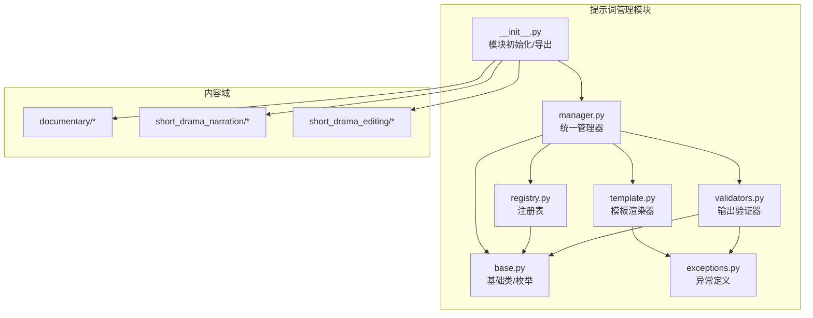
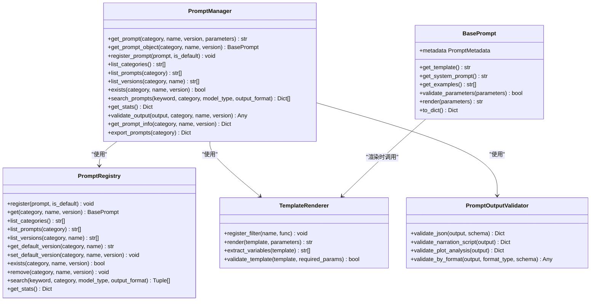
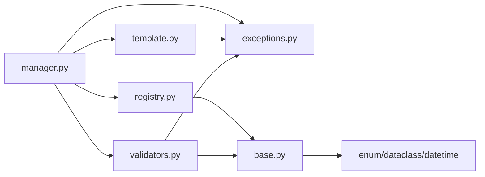

# 提示词管理系统

<cite>
**本文档引用的文件**
- [app/services/prompts/__init__.py](file://app/services/prompts/__init__.py)
- [app/services/prompts/manager.py](file://app/services/prompts/manager.py)
- [app/services/prompts/registry.py](file://app/services/prompts/registry.py)
- [app/services/prompts/template.py](file://app/services/prompts/template.py)
- [app/services/prompts/base.py](file://app/services/prompts/base.py)
- [app/services/prompts/validators.py](file://app/services/prompts/validators.py)
- [app/services/prompts/exceptions.py](file://app/services/prompts/exceptions.py)
- [app/services/prompts/documentary/frame_analysis.py](file://app/services/prompts/documentary/frame_analysis.py)
- [app/services/prompts/documentary/narration_generation.py](file://app/services/prompts/documentary/narration_generation.py)
- [app/services/prompts/short_drama_narration/script_generation.py](file://app/services/prompts/short_drama_narration/script_generation.py)
- [app/services/prompts/short_drama_narration/plot_analysis.py](file://app/services/prompts/short_drama_narration/plot_analysis.py)
- [app/services/prompts/short_drama_editing/subtitle_analysis.py](file://app/services/prompts/short_drama_editing/subtitle_analysis.py)
- [app/services/prompts/short_drama_editing/plot_extraction.py](file://app/services/prompts/short_drama_editing/plot_extraction.py)
</cite>

## 目录
1. [简介](#简介)
2. [项目结构](#项目结构)
3. [核心组件](#核心组件)
4. [架构总览](#架构总览)
5. [详细组件分析](#详细组件分析)
6. [依赖关系分析](#依赖关系分析)
7. [性能考量](#性能考量)
8. [故障排查指南](#故障排查指南)
9. [结论](#结论)
10. [附录](#附录)

## 简介
本文件面向“提示词管理系统”的使用者与维护者，系统性阐述提示词在影视解说场景中的应用设计与实现，涵盖剧情分析提示词与脚本生成提示词的设计原理；详细说明提示词模板的注册机制、版本控制与参数化配置；阐述提示词的动态加载与缓存策略（通过全局注册表与渲染器实现）、与SubtitleAnalyzer的集成方式；介绍提示词的验证规则与格式要求，确保输出内容符合预期格式；提供提示词定制指南，展示如何根据不同的内容类型调整提示词参数；并给出提示词优化策略、性能考虑与最佳实践建议。

## 项目结构
提示词管理模块位于 app/services/prompts 目录下，采用“按功能域分包 + 统一入口”的组织方式：
- 按内容类型分包：documentary（纪录片）、short_drama_narration（短剧解说）、short_drama_editing（短剧混剪）
- 核心基础设施：manager（统一管理器）、registry（注册表）、template（模板渲染）、validators（输出验证）、base（基础类与枚举）、exceptions（异常定义）
- 初始化流程：模块自动初始化，扫描并注册各域的提示词

图表来源
- [app/services/prompts/__init__.py:55-69](file://app/services/prompts/__init__.py#L55-L69)
- [app/services/prompts/manager.py:26-288](file://app/services/prompts/manager.py#L26-L288)
- [app/services/prompts/registry.py:24-224](file://app/services/prompts/registry.py#L24-L224)
- [app/services/prompts/template.py:20-181](file://app/services/prompts/template.py#L20-L181)
- [app/services/prompts/validators.py:21-251](file://app/services/prompts/validators.py#L21-L251)
- [app/services/prompts/base.py:19-183](file://app/services/prompts/base.py#L19-L183)
- [app/services/prompts/exceptions.py:13-80](file://app/services/prompts/exceptions.py#L13-L80)

章节来源
- [app/services/prompts/__init__.py:12-69](file://app/services/prompts/__init__.py#L12-L69)

## 核心组件
- PromptManager：统一入口，提供获取提示词、获取提示词对象、注册提示词、查询与统计、输出验证、导出配置等功能
- PromptRegistry：全局注册表，负责提示词的注册、版本管理、默认版本设置、查询与搜索、统计
- TemplateRenderer：模板渲染器，支持参数替换与自定义过滤器，提供变量提取与模板校验
- PromptOutputValidator：输出验证器，针对不同输出格式（尤其是JSON）进行结构与字段校验
- BasePrompt/派生类：定义提示词元数据、渲染流程、参数校验、系统提示词与示例管理
- 异常体系：集中定义提示词相关异常，便于统一捕获与处理

章节来源
- [app/services/prompts/manager.py:26-288](file://app/services/prompts/manager.py#L26-L288)
- [app/services/prompts/registry.py:24-224](file://app/services/prompts/registry.py#L24-L224)
- [app/services/prompts/template.py:20-181](file://app/services/prompts/template.py#L20-L181)
- [app/services/prompts/validators.py:21-251](file://app/services/prompts/validators.py#L21-L251)
- [app/services/prompts/base.py:19-183](file://app/services/prompts/base.py#L19-L183)
- [app/services/prompts/exceptions.py:13-80](file://app/services/prompts/exceptions.py#L13-L80)

## 架构总览
提示词系统围绕“注册表 + 渲染器 + 管理器 + 验证器”构建，模块初始化时自动扫描并注册各域提示词，运行期通过管理器统一调度。

图表来源
- [app/services/prompts/manager.py:26-288](file://app/services/prompts/manager.py#L26-L288)
- [app/services/prompts/registry.py:24-224](file://app/services/prompts/registry.py#L24-L224)
- [app/services/prompts/template.py:20-181](file://app/services/prompts/template.py#L20-L181)
- [app/services/prompts/validators.py:21-251](file://app/services/prompts/validators.py#L21-L251)
- [app/services/prompts/base.py:50-183](file://app/services/prompts/base.py#L50-L183)

## 详细组件分析

### PromptManager：统一管理器
- 功能要点
  - 获取渲染后的提示词字符串（支持参数注入）
  - 获取提示词对象（便于进一步操作）
  - 注册提示词（可选设为默认版本）
  - 查询与搜索（按关键词、分类、模型类型、输出格式）
  - 统计信息与导出配置
  - 输出验证（按提示词元数据的输出格式进行校验）
- 影视解说应用
  - 短剧脚本生成：通过 ScriptGenerationPrompt 的参数化配置，结合剧情分析与字幕内容生成脚本
  - 纪录片画面分析：通过 FrameAnalysisPrompt 与 NarrationGenerationPrompt 的组合，先分析画面再生成解说文案
  - 短剧混剪：通过 SubtitleAnalysisPrompt、PlotExtractionPrompt 等提示词提取关键情节点并定位时间段

章节来源
- [app/services/prompts/manager.py:26-288](file://app/services/prompts/manager.py#L26-L288)

### PromptRegistry：注册表与版本控制
- 功能要点
  - 注册提示词并维护默认版本映射
  - 按分类/名称/版本检索
  - 列表与搜索（支持关键词、模型类型、输出格式过滤）
  - 删除与默认版本切换（移除默认版本时自动选择最新版本）
  - 统计信息（分类数、提示词数、版本数）
- 版本控制
  - 同名提示词不可重复注册同一版本
  - 默认版本缺失时抛出未找到异常
  - 支持显式设置默认版本

章节来源
- [app/services/prompts/registry.py:24-224](file://app/services/prompts/registry.py#L24-L224)

### TemplateRenderer：模板渲染与过滤器
- 功能要点
  - 参数替换：支持 ${key} 与 $key 两种占位符
  - 过滤器：内置 upper/lower/title/strip/truncate/json 等，支持自定义过滤器注册
  - 变量提取与模板校验：用于发现缺失参数并进行预渲染测试
- 性能与健壮性
  - 渲染失败统一抛出模板渲染异常
  - 过滤器执行失败时回退原始文本，避免中断

章节来源
- [app/services/prompts/template.py:20-181](file://app/services/prompts/template.py#L20-L181)

### PromptOutputValidator：输出验证与格式要求
- 功能要点
  - JSON清理与解析：移除代码块标记、提取JSON主体
  - 通用JSON校验：可选Schema校验
  - 解说脚本校验：强制字段、时间戳格式、片段连贯性
  - 剧情分析校验：强制字段、时间戳格式（支持多种格式）
  - 按格式验证：TEXT/MARKDOWN/STRUCTURED分别处理
- 影视解说应用
  - 短剧脚本：严格校验时间戳连续与不重叠、片段结构、原声/解说比例
  - 纪录片脚本：校验JSON结构与字段完整性

章节来源
- [app/services/prompts/validators.py:21-251](file://app/services/prompts/validators.py#L21-L251)

### BasePrompt 与派生类：参数化与模型类型
- 功能要点
  - PromptMetadata：名称、分类、版本、描述、模型类型、输出格式、标签、参数列表
  - BasePrompt：模板渲染、参数校验、系统提示词、示例管理、序列化
  - TextPrompt/VisionPrompt：限定适用模型类型
  - ParameterizedPrompt：扩展参数列表，自动去重
- 影视解说应用
  - 短剧脚本生成：要求 drama_name 与 plot_analysis 为必需参数
  - 纪录片画面分析：支持自定义指令与主题参数

章节来源
- [app/services/prompts/base.py:19-183](file://app/services/prompts/base.py#L19-L183)

### 内容域提示词：剧情分析与脚本生成
- 纪录片
  - FrameAnalysisPrompt：面向视觉模型，输出JSON，包含画面描述、场景类型、关键元素、视觉质量等
  - NarrationGenerationPrompt：面向文本模型，输出JSON，包含解说片段列表，严格遵循时间戳与画面匹配
- 短剧解说
  - PlotAnalysisPrompt：文本模型，输出纯文本，提供剧情分段与时间戳定位
  - ScriptGenerationPrompt：参数化提示词，输出JSON，包含黄金开场、爽点放大、个性吐槽、悬念预埋等专业技巧
- 短剧混剪
  - SubtitleAnalysisPrompt：文本模型，输出JSON，提取叙事结构、关键情节点、分析细节
  - PlotExtractionPrompt：文本模型，输出JSON，定位时间段并保证连贯性与不重叠

章节来源
- [app/services/prompts/documentary/frame_analysis.py:15-68](file://app/services/prompts/documentary/frame_analysis.py#L15-L68)
- [app/services/prompts/documentary/narration_generation.py:15-114](file://app/services/prompts/documentary/narration_generation.py#L15-L114)
- [app/services/prompts/short_drama_narration/plot_analysis.py:15-91](file://app/services/prompts/short_drama_narration/plot_analysis.py#L15-L91)
- [app/services/prompts/short_drama_narration/script_generation.py:15-308](file://app/services/prompts/short_drama_narration/script_generation.py#L15-L308)
- [app/services/prompts/short_drama_editing/subtitle_analysis.py:15-118](file://app/services/prompts/short_drama_editing/subtitle_analysis.py#L15-L118)
- [app/services/prompts/short_drama_editing/plot_extraction.py:15-141](file://app/services/prompts/short_drama_editing/plot_extraction.py#L15-L141)

### 与SubtitleAnalyzer的集成方式
- 数据输入
  - 短剧脚本生成：通过 ScriptGenerationPrompt 的 subtitle_content 参数传入字幕内容
  - 短剧混剪：通过 SubtitleAnalysisPrompt/PlotExtractionPrompt 的 subtitle_content 传入字幕内容
- 输出对接
  - 所有提示词均输出JSON结构，便于与字幕解析与剪辑流程对接
  - 时间戳格式与字幕严格一致，确保剪辑精度

章节来源
- [app/services/prompts/short_drama_narration/script_generation.py:33-50](file://app/services/prompts/short_drama_narration/script_generation.py#L33-L50)
- [app/services/prompts/short_drama_editing/subtitle_analysis.py:33-43](file://app/services/prompts/short_drama_editing/subtitle_analysis.py#L33-L43)
- [app/services/prompts/short_drama_editing/plot_extraction.py:33-55](file://app/services/prompts/short_drama_editing/plot_extraction.py#L33-L55)

### 提示词定制指南
- 参数化配置
  - 在提示词元数据中声明 parameters，使用 ParameterizedPrompt 并在构造时扩展必需参数
  - 通过 PromptManager.get_prompt 注入参数字典，TemplateRenderer 会进行替换与过滤器处理
- 模型类型与输出格式
  - 根据任务选择 TEXT/VISION/MULTIMODAL 与 TEXT/JSON/MARKDOWN/STRUCTURED
- 模板设计
  - 明确必需参数与可选参数，使用过滤器进行格式化
  - 输出格式严格约束，避免多余文本与代码块标记

章节来源
- [app/services/prompts/base.py:97-133](file://app/services/prompts/base.py#L97-L133)
- [app/services/prompts/template.py:31-64](file://app/services/prompts/template.py#L31-L64)
- [app/services/prompts/short_drama_narration/script_generation.py:18-30](file://app/services/prompts/short_drama_narration/script_generation.py#L18-L30)

### 提示词验证规则与格式要求
- JSON输出
  - 清理代码块标记与多余文本，提取JSON主体
  - 字段完整性校验（如 items、plot_points 等）
  - 时间戳格式校验（支持多种格式）
- 解说脚本
  - 强制字段：_id、timestamp、picture、narration（可选 OST）
  - 时间戳连续且不重叠，片段数量与顺序正确
- 剧情分析
  - 强制字段：summary、plot_points
  - 情节点时间戳格式与内容校验

章节来源
- [app/services/prompts/validators.py:24-53](file://app/services/prompts/validators.py#L24-L53)
- [app/services/prompts/validators.py:54-121](file://app/services/prompts/validators.py#L54-L121)
- [app/services/prompts/validators.py:152-215](file://app/services/prompts/validators.py#L152-L215)

### 动态加载与缓存策略
- 动态加载
  - 模块初始化时自动扫描并注册各域提示词（documentary、short_drama_narration、short_drama_editing）
- 缓存策略
  - 全局注册表与渲染器实例为单例，避免重复创建
  - 提示词对象在注册表中缓存，按需渲染模板

章节来源
- [app/services/prompts/__init__.py:55-69](file://app/services/prompts/__init__.py#L55-L69)
- [app/services/prompts/registry.py:27-34](file://app/services/prompts/registry.py#L27-L34)
- [app/services/prompts/template.py:23-29](file://app/services/prompts/template.py#L23-L29)

## 依赖关系分析
- 模块内依赖
  - manager 依赖 registry、template、validators、exceptions
  - registry 依赖 base、exceptions
  - template 依赖 exceptions
  - validators 依赖 base、exceptions
  - base 依赖 enum、dataclass、datetime
- 外部依赖
  - loguru（日志）
  - json（输出验证）
  - re（模板与输出清洗）

图表来源
- [app/services/prompts/manager.py:12-24](file://app/services/prompts/manager.py#L12-L24)
- [app/services/prompts/registry.py:12-22](file://app/services/prompts/registry.py#L12-L22)
- [app/services/prompts/template.py:12-18](file://app/services/prompts/template.py#L12-L18)
- [app/services/prompts/validators.py:12-19](file://app/services/prompts/validators.py#L12-L19)
- [app/services/prompts/base.py:12-17](file://app/services/prompts/base.py#L12-L17)

## 性能考量
- 渲染性能
  - 模板渲染采用简单字符串替换，复杂过滤器应谨慎使用
  - 建议在模板中尽量减少嵌套与重复计算
- 验证性能
  - JSON解析与正则匹配为O(n)，建议在上游控制输入规模
  - 对大体量JSON可考虑分批处理或流式解析
- 缓存与并发
  - 全局单例避免重复初始化开销
  - 多线程环境下注意渲染器与验证器的线程安全（当前实现为纯函数式，无共享可变状态）

## 故障排查指南
- 提示词未找到
  - 检查分类、名称与版本是否正确；确认是否已注册默认版本
- 模板渲染失败
  - 检查必需参数是否缺失；查看过滤器是否可用；尝试模板校验
- 输出验证失败
  - 根据异常信息修正字段与格式；核对时间戳格式与连贯性
- 版本管理问题
  - 确认版本唯一性；移除默认版本后会自动选择最新版本

章节来源
- [app/services/prompts/exceptions.py:18-80](file://app/services/prompts/exceptions.py#L18-L80)
- [app/services/prompts/registry.py:47-61](file://app/services/prompts/registry.py#L47-L61)
- [app/services/prompts/template.py:99-124](file://app/services/prompts/template.py#L99-L124)
- [app/services/prompts/validators.py:24-53](file://app/services/prompts/validators.py#L24-L53)

## 结论
提示词管理系统通过统一的管理器、注册表、渲染器与验证器，实现了提示词的标准化、参数化与可演进。在影视解说场景中，系统提供了从画面分析到脚本生成、从剧情分段到混剪定位的完整提示词链路，具备良好的扩展性与稳定性。建议在实际使用中遵循参数化与格式约束，结合验证规则与缓存策略，持续优化提示词质量与性能。

## 附录
- 快速上手
  - 使用 PromptManager.get_prompt(category, name, version, parameters) 获取渲染后的提示词
  - 使用 PromptManager.validate_output(output, category, name, version) 校验输出
  - 通过 PromptManager.export_prompts() 导出配置，便于版本管理与迁移
- 最佳实践
  - 为提示词定义清晰的元数据与参数列表
  - 在模板中使用过滤器进行格式化，避免LLM输出漂移
  - 对关键提示词编写单元测试与模板校验
  - 通过默认版本与版本切换管理提示词演进