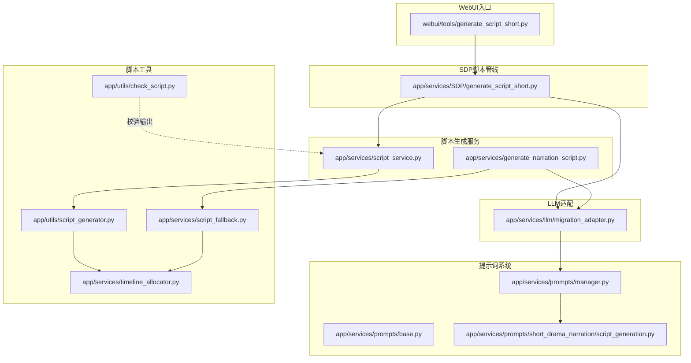
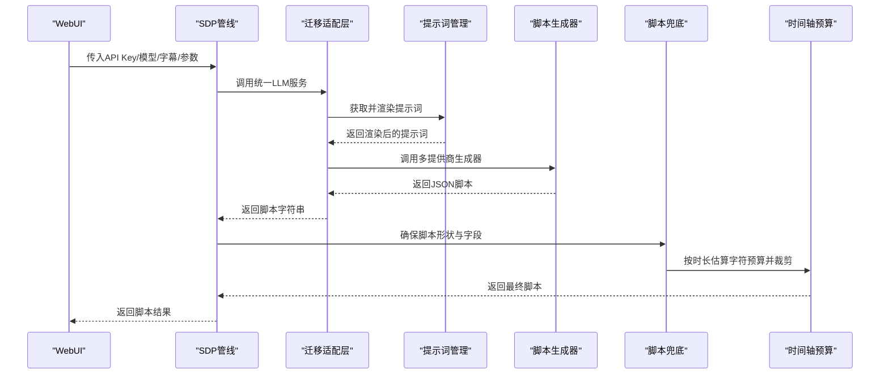
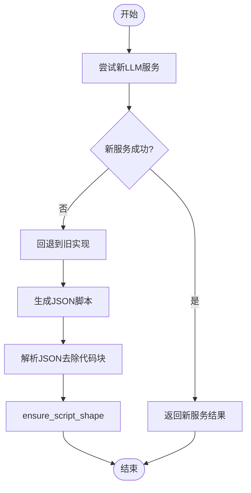
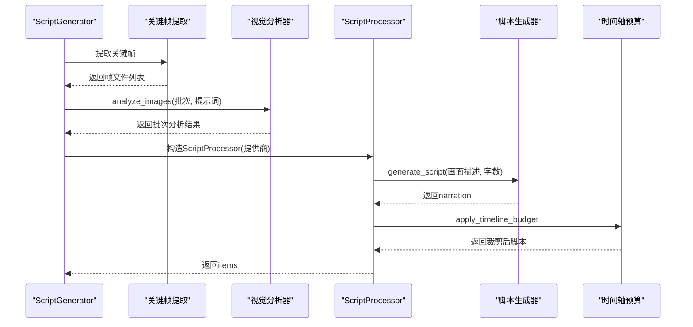
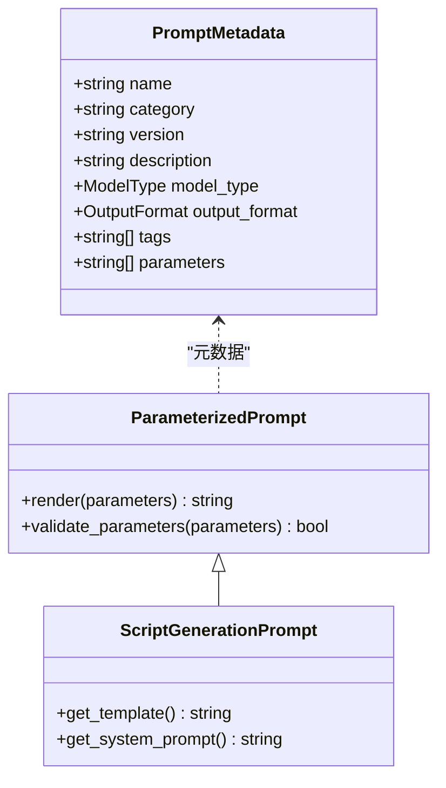
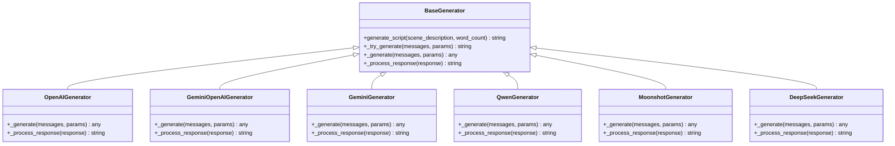
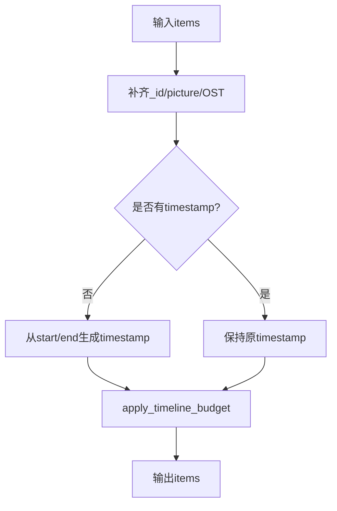
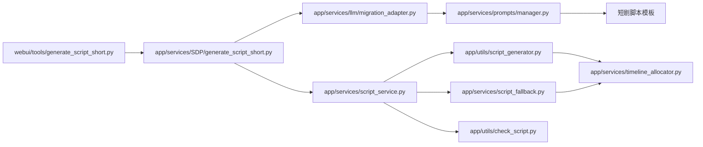

# 脚本生成器

<cite>
**本文引用的文件**
- [app/services/generate_narration_script.py](file://app/services/generate_narration_script.py)
- [app/services/script_service.py](file://app/services/script_service.py)
- [app/utils/script_generator.py](file://app/utils/script_generator.py)
- [app/services/prompts/short_drama_narration/script_generation.py](file://app/services/prompts/short_drama_narration/script_generation.py)
- [app/services/llm/migration_adapter.py](file://app/services/llm/migration_adapter.py)
- [app/services/script_fallback.py](file://app/services/script_fallback.py)
- [app/utils/check_script.py](file://app/utils/check_script.py)
- [webui/tools/generate_script_short.py](file://webui/tools/generate_script_short.py)
- [app/services/SDP/generate_script_short.py](file://app/services/SDP/generate_script_short.py)
- [app/services/prompts/base.py](file://app/services/prompts/base.py)
- [app/services/prompts/manager.py](file://app/services/prompts/manager.py)
- [app/services/timeline_allocator.py](file://app/services/timeline_allocator.py)
</cite>

## 目录
1. [简介](#简介)
2. [项目结构](#项目结构)
3. [核心组件](#核心组件)
4. [架构总览](#架构总览)
5. [详细组件分析](#详细组件分析)
6. [依赖关系分析](#依赖关系分析)
7. [性能考量](#性能考量)
8. [故障排查指南](#故障排查指南)
9. [结论](#结论)
10. [附录](#附录)

## 简介
本文件面向“脚本生成器”的使用者与维护者，系统化梳理基于剧情分析生成短视频解说脚本的完整流程。文档覆盖脚本模板设计、JSON格式化输出、时间戳对齐与预算裁剪、不同提供商API调用差异（原生Gemini与OpenAI兼容格式）、质量控制机制（温度参数、JSON校验、兜底策略）以及实际使用示例与优化建议。

## 项目结构
围绕“脚本生成器”，相关模块分布在服务层与工具层：
- 服务层：负责脚本生成主流程、提示词管理、LLM迁移适配、脚本兜底与时间轴预算控制
- 工具层：负责脚本格式校验、脚本生成器（多提供商适配）
- WebUI入口：提供前端交互与参数传递

**图表来源**
- [webui/tools/generate_script_short.py:13-128](file://webui/tools/generate_script_short.py#L13-L128)
- [app/services/SDP/generate_script_short.py:12-126](file://app/services/SDP/generate_script_short.py#L12-L126)
- [app/services/generate_narration_script.py:113-252](file://app/services/generate_narration_script.py#L113-L252)
- [app/services/script_service.py:20-246](file://app/services/script_service.py#L20-L246)
- [app/services/prompts/manager.py:26-288](file://app/services/prompts/manager.py#L26-L288)
- [app/services/prompts/short_drama_narration/script_generation.py:15-308](file://app/services/prompts/short_drama_narration/script_generation.py#L15-L308)
- [app/services/llm/migration_adapter.py:82-342](file://app/services/llm/migration_adapter.py#L82-L342)
- [app/utils/script_generator.py:433-642](file://app/utils/script_generator.py#L433-L642)
- [app/services/script_fallback.py:45-58](file://app/services/script_fallback.py#L45-L58)
- [app/services/timeline_allocator.py:24-36](file://app/services/timeline_allocator.py#L24-L36)
- [app/utils/check_script.py:5-111](file://app/utils/check_script.py#L5-L111)

**章节来源**
- [webui/tools/generate_script_short.py:13-128](file://webui/tools/generate_script_short.py#L13-L128)
- [app/services/SDP/generate_script_short.py:12-126](file://app/services/SDP/generate_script_short.py#L12-L126)
- [app/services/generate_narration_script.py:113-252](file://app/services/generate_narration_script.py#L113-L252)
- [app/services/script_service.py:20-246](file://app/services/script_service.py#L20-L246)
- [app/services/prompts/manager.py:26-288](file://app/services/prompts/manager.py#L26-L288)
- [app/services/prompts/short_drama_narration/script_generation.py:15-308](file://app/services/prompts/short_drama_narration/script_generation.py#L15-L308)
- [app/services/llm/migration_adapter.py:82-342](file://app/services/llm/migration_adapter.py#L82-L342)
- [app/utils/script_generator.py:433-642](file://app/utils/script_generator.py#L433-L642)
- [app/services/script_fallback.py:45-58](file://app/services/script_fallback.py#L45-L58)
- [app/services/timeline_allocator.py:24-36](file://app/services/timeline_allocator.py#L24-L36)
- [app/utils/check_script.py:5-111](file://app/utils/check_script.py#L5-L111)

## 核心组件
- generate_narration_script：面向“剧情分析+原始字幕”生成JSON脚本，支持新旧两套LLM路径与兜底策略
- script_service：面向“关键帧+视觉分析”的脚本生成流程，支持多提供商统一接口与时间戳对齐
- script_generator：多提供商脚本生成器（OpenAI/Gemini/Qwen/Moonshot/DeepSeek），统一温度与参数
- prompts：提示词管理与渲染，短剧脚本模板定义参数与输出约束
- migration_adapter：LLM迁移适配层，兼容旧链路并统一新服务调用
- script_fallback：脚本形状与兜底填充，确保items字段齐全与时间预算
- timeline_allocator：按片段时长估算字符预算并裁剪文案
- check_script：脚本格式校验（JSON、字段、格式）

**章节来源**
- [app/services/generate_narration_script.py:113-252](file://app/services/generate_narration_script.py#L113-L252)
- [app/services/script_service.py:20-246](file://app/services/script_service.py#L20-L246)
- [app/utils/script_generator.py:13-642](file://app/utils/script_generator.py#L13-L642)
- [app/services/prompts/short_drama_narration/script_generation.py:15-308](file://app/services/prompts/short_drama_narration/script_generation.py#L15-L308)
- [app/services/llm/migration_adapter.py:82-342](file://app/services/llm/migration_adapter.py#L82-L342)
- [app/services/script_fallback.py:45-58](file://app/services/script_fallback.py#L45-L58)
- [app/services/timeline_allocator.py:24-36](file://app/services/timeline_allocator.py#L24-L36)
- [app/utils/check_script.py:5-111](file://app/utils/check_script.py#L5-L111)

## 架构总览
脚本生成器采用“提示词驱动 + 多提供商适配 + 统一输出”的架构。WebUI发起请求，SDP管线或剧情分析路径进入LLM服务，经提示词模板渲染后生成JSON脚本，再通过脚本形状与预算裁剪确保输出稳定可用。

**图表来源**
- [webui/tools/generate_script_short.py:84-103](file://webui/tools/generate_script_short.py#L84-L103)
- [app/services/SDP/generate_script_short.py:50-64](file://app/services/SDP/generate_script_short.py#L50-L64)
- [app/services/llm/migration_adapter.py:274-331](file://app/services/llm/migration_adapter.py#L274-L331)
- [app/services/prompts/manager.py:34-61](file://app/services/prompts/manager.py#L34-L61)
- [app/utils/script_generator.py:433-642](file://app/utils/script_generator.py#L433-L642)
- [app/services/script_fallback.py:45-58](file://app/services/script_fallback.py#L45-L58)
- [app/services/timeline_allocator.py:24-36](file://app/services/timeline_allocator.py#L24-L36)

## 详细组件分析

### 组件A：generate_narration_script（剧情分析+原始字幕）
- 输入参数
  - markdown_content：视频帧分析Markdown（由parse_frame_analysis_to_markdown生成）
  - api_key/base_url/model：LLM提供商配置
- 处理流程
  - 优先尝试新LLM服务（migration_adapter.generate_narration）
  - 失败则回退到旧实现（_generate_narration_legacy）
  - 事实抽取与文案润色双阶段JSON生成
  - 兜底策略：_fallback_from_scene_evidence
- 输出
  - JSON脚本items，包含_id、timestamp、picture、narration、OST等字段
- 质量控制
  - 温度参数：_chat_json=0.7，_generate_narration_legacy=0.9
  - JSON格式验证：_parse_json_text处理代码块包裹
  - 脚本形状保证：ensure_script_shape

**图表来源**
- [app/services/generate_narration_script.py:113-194](file://app/services/generate_narration_script.py#L113-L194)
- [app/services/generate_narration_script.py:196-218](file://app/services/generate_narration_script.py#L196-L218)
- [app/services/generate_narration_script.py:220-252](file://app/services/generate_narration_script.py#L220-L252)
- [app/services/script_fallback.py:45-58](file://app/services/script_fallback.py#L45-L58)

**章节来源**
- [app/services/generate_narration_script.py:113-252](file://app/services/generate_narration_script.py#L113-L252)
- [app/services/script_fallback.py:45-58](file://app/services/script_fallback.py#L45-L58)

### 组件B：script_service（关键帧+视觉分析）
- 输入参数
  - video_path、video_theme、custom_prompt、frame_interval_input、skip_seconds、threshold、vision_batch_size、vision_llm_provider
- 处理流程
  - 提取关键帧并缓存
  - 通过迁移适配器创建统一视觉分析器
  - 异步批处理分析，拼接带时间戳的帧内容
  - 选择文本提供商（原生Gemini/OpenAI兼容），构造ScriptProcessor
  - 按时间范围估算字数，生成文案并保存中间结果
- 输出
  - 脚本items，包含timestamp、picture、narration、OST等
- 时间戳对齐
  - _get_batch_timestamps：解析帧文件名时间戳，格式化为HH:MM:SS,mmm
  - _save_results：计算新时间戳并保存中间JSON

**图表来源**
- [app/services/script_service.py:20-246](file://app/services/script_service.py#L20-L246)
- [app/services/script_service.py:259-324](file://app/services/script_service.py#L259-L324)
- [app/utils/script_generator.py:433-642](file://app/utils/script_generator.py#L433-L642)
- [app/services/timeline_allocator.py:24-36](file://app/services/timeline_allocator.py#L24-L36)

**章节来源**
- [app/services/script_service.py:20-246](file://app/services/script_service.py#L20-L246)
- [app/utils/script_generator.py:433-642](file://app/utils/script_generator.py#L433-L642)
- [app/services/timeline_allocator.py:24-36](file://app/services/timeline_allocator.py#L24-L36)

### 组件C：提示词系统（短剧脚本模板）
- 提示词对象：ScriptGenerationPrompt
- 参数要求：drama_name、plot_analysis（必需），subtitle_content（可选）
- 输出格式：JSON，items数组，字段包含_id、timestamp、picture、narration、OST
- 技术要求：时间戳连续不交叉、与原始字幕时间戳格式一致、原声片段占比与分布策略

**图表来源**
- [app/services/prompts/base.py:35-183](file://app/services/prompts/base.py#L35-L183)
- [app/services/prompts/short_drama_narration/script_generation.py:15-308](file://app/services/prompts/short_drama_narration/script_generation.py#L15-L308)

**章节来源**
- [app/services/prompts/short_drama_narration/script_generation.py:15-308](file://app/services/prompts/short_drama_narration/script_generation.py#L15-L308)
- [app/services/prompts/base.py:35-183](file://app/services/prompts/base.py#L35-L183)

### 组件D：多提供商脚本生成器（OpenAI/Gemini/Qwen/Moonshot/DeepSeek）
- BaseGenerator：统一温度、最大token、重试与上下文拼接
- OpenAIGenerator/GeminiOpenAIGenerator/GeminiGenerator/QwenGenerator/MoonshotGenerator/DeepSeekGenerator：各提供商参数与异常处理
- 适配原生Gemini的兼容响应对象，处理安全过滤与限流

**图表来源**
- [app/utils/script_generator.py:13-642](file://app/utils/script_generator.py#L13-L642)

**章节来源**
- [app/utils/script_generator.py:13-642](file://app/utils/script_generator.py#L13-L642)

### 组件E：脚本形状与兜底（ensure_script_shape、_fallback_from_scene_evidence）
- ensure_script_shape：补齐_id、picture、OST，若无timestamp则按start/end生成，再应用timeline预算
- _fallback_from_scene_evidence：从scene_evidence直接生成items，作为LLM失败的兜底

**图表来源**
- [app/services/script_fallback.py:45-58](file://app/services/script_fallback.py#L45-L58)
- [app/services/timeline_allocator.py:24-36](file://app/services/timeline_allocator.py#L24-L36)

**章节来源**
- [app/services/script_fallback.py:45-58](file://app/services/script_fallback.py#L45-L58)
- [app/services/timeline_allocator.py:24-36](file://app/services/timeline_allocator.py#L24-L36)

## 依赖关系分析
- WebUI入口通过generate_script_short调用SDP管线，后者解析字幕输入并调用迁移适配层
- 迁移适配层通过提示词管理器获取渲染后的提示词，再调用统一LLM服务
- 脚本生成器按提供商类型选择具体实现，最终统一输出JSON
- 脚本形状与预算在生成后统一处理，格式校验保障输出质量

**图表来源**
- [webui/tools/generate_script_short.py:84-103](file://webui/tools/generate_script_short.py#L84-L103)
- [app/services/SDP/generate_script_short.py:50-64](file://app/services/SDP/generate_script_short.py#L50-L64)
- [app/services/llm/migration_adapter.py:274-331](file://app/services/llm/migration_adapter.py#L274-L331)
- [app/services/prompts/manager.py:34-61](file://app/services/prompts/manager.py#L34-L61)
- [app/utils/script_generator.py:433-642](file://app/utils/script_generator.py#L433-L642)
- [app/services/timeline_allocator.py:24-36](file://app/services/timeline_allocator.py#L24-L36)
- [app/services/script_fallback.py:45-58](file://app/services/script_fallback.py#L45-L58)
- [app/utils/check_script.py:5-111](file://app/utils/check_script.py#L5-L111)

**章节来源**
- [webui/tools/generate_script_short.py:84-103](file://webui/tools/generate_script_short.py#L84-L103)
- [app/services/SDP/generate_script_short.py:50-64](file://app/services/SDP/generate_script_short.py#L50-L64)
- [app/services/llm/migration_adapter.py:274-331](file://app/services/llm/migration_adapter.py#L274-L331)
- [app/services/prompts/manager.py:34-61](file://app/services/prompts/manager.py#L34-L61)
- [app/utils/script_generator.py:433-642](file://app/utils/script_generator.py#L433-L642)
- [app/services/timeline_allocator.py:24-36](file://app/services/timeline_allocator.py#L24-L36)
- [app/services/script_fallback.py:45-58](file://app/services/script_fallback.py#L45-L58)
- [app/utils/check_script.py:5-111](file://app/utils/check_script.py#L5-L111)

## 性能考量
- 批处理与缓存
  - 关键帧提取结果缓存，避免重复处理
  - 视觉分析批处理（batch_size），减少API往返
- 温度与参数
  - 事实抽取阶段温度较低（0.7），提升稳定性
  - 文案生成阶段温度较高（0.9），增强创造性
- 超时与重试
  - 原生Gemini与Moonshot具备限流与异常重试策略
- 字符预算裁剪
  - 按时长估算字符预算，避免超长文案影响TTS与剪辑

[本节为通用指导，无需特定文件引用]

## 故障排查指南
- 提示词渲染失败
  - 检查参数是否满足提示词必需参数（如drama_name、plot_analysis）
  - 查看提示词对象元数据与渲染日志
- LLM输出非JSON
  - 使用_parse_json_text清理代码块包裹
  - 若仍失败，启用脚本兜底（ensure_script_shape）
- 时间戳不连续或格式错误
  - 校验原始字幕时间戳格式
  - 使用_script_service的时间戳解析与格式化逻辑
- WebUI报错
  - 确认字幕文件存在且扩展名为.srt
  - 检查提供商API Key与模型配置

**章节来源**
- [app/services/prompts/manager.py:98-137](file://app/services/prompts/manager.py#L98-L137)
- [app/services/generate_narration_script.py:211-218](file://app/services/generate_narration_script.py#L211-L218)
- [app/services/script_service.py:259-324](file://app/services/script_service.py#L259-L324)
- [webui/tools/generate_script_short.py:51-66](file://webui/tools/generate_script_short.py#L51-L66)

## 结论
脚本生成器通过提示词系统与多提供商适配，实现了从剧情分析到高质量JSON脚本的自动化流水线。其关键优势在于：
- 模板化提示词与严格的输出约束，确保脚本一致性
- 温度参数与JSON解析策略，兼顾创意与稳定性
- 兜底与预算裁剪机制，保障最终脚本可用性
- WebUI与SDP管线的清晰边界，便于扩展与维护

[本节为总结，无需特定文件引用]

## 附录

### 实际使用示例（基于现有接口）
- WebUI入口
  - 通过generate_script_short传入视频与字幕，内部调用SDP管线生成脚本
- SDP管线
  - generate_script_result解析字幕输入，调用迁移适配层生成剧情要点，再合并为最终脚本
- 直接调用剧情分析脚本生成
  - generate_narration/markdown_content/api_key/base_url/model，优先走新LLM服务，失败回退旧实现

**章节来源**
- [webui/tools/generate_script_short.py:13-128](file://webui/tools/generate_script_short.py#L13-L128)
- [app/services/SDP/generate_script_short.py:12-126](file://app/services/SDP/generate_script_short.py#L12-L126)
- [app/services/generate_narration_script.py:113-194](file://app/services/generate_narration_script.py#L113-L194)

### API调用差异与响应处理
- 原生Gemini
  - 使用OpenAI兼容接口时，通过OpenAI客户端封装请求与响应
  - 原生Gemini模式下，自行构造请求体与安全设置，处理限流与安全过滤
- OpenAI兼容格式
  - 统一使用OpenAI客户端，response_format=json_object
  - 对返回内容进行代码块清理与JSON解析

**章节来源**
- [app/utils/script_generator.py:155-314](file://app/utils/script_generator.py#L155-L314)
- [app/utils/script_generator.py:82-122](file://app/utils/script_generator.py#L82-L122)

### 质量控制机制
- 温度参数
  - 事实抽取：0.7；文案生成：0.9
- JSON格式验证
  - _parse_json_text：去除代码块标记
  - check_script：字段完整性与格式校验
- 脚本形状与预算
  - ensure_script_shape：补齐字段与时间戳
  - apply_timeline_budget：按片段时长裁剪文案

**章节来源**
- [app/services/generate_narration_script.py:196-218](file://app/services/generate_narration_script.py#L196-L218)
- [app/utils/check_script.py:5-111](file://app/utils/check_script.py#L5-L111)
- [app/services/script_fallback.py:45-58](file://app/services/script_fallback.py#L45-L58)
- [app/services/timeline_allocator.py:24-36](file://app/services/timeline_allocator.py#L24-L36)