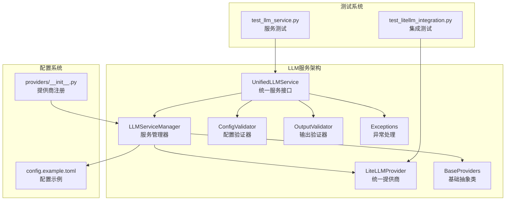
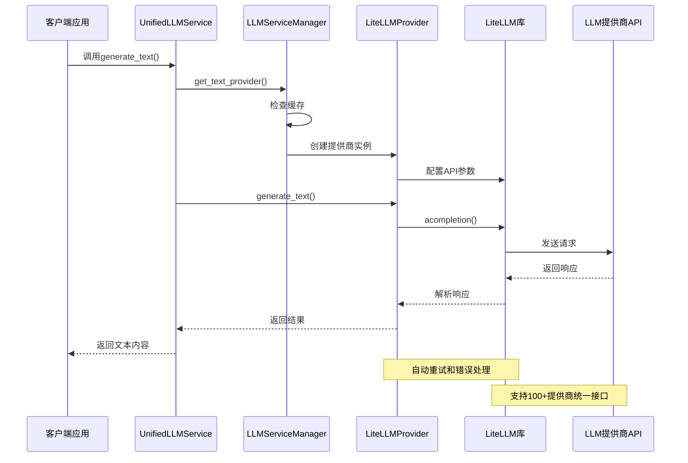
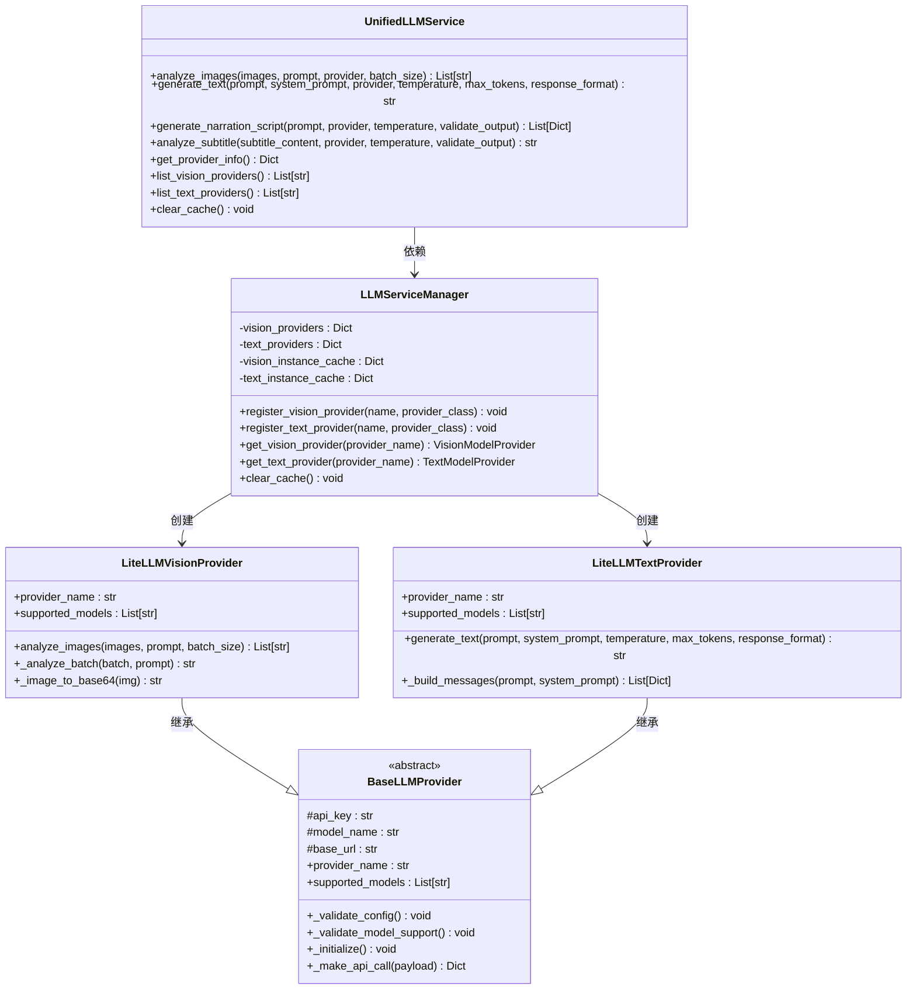
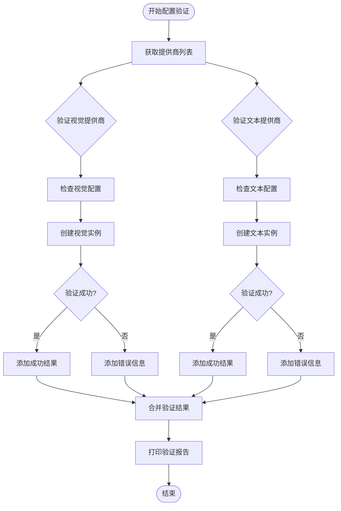
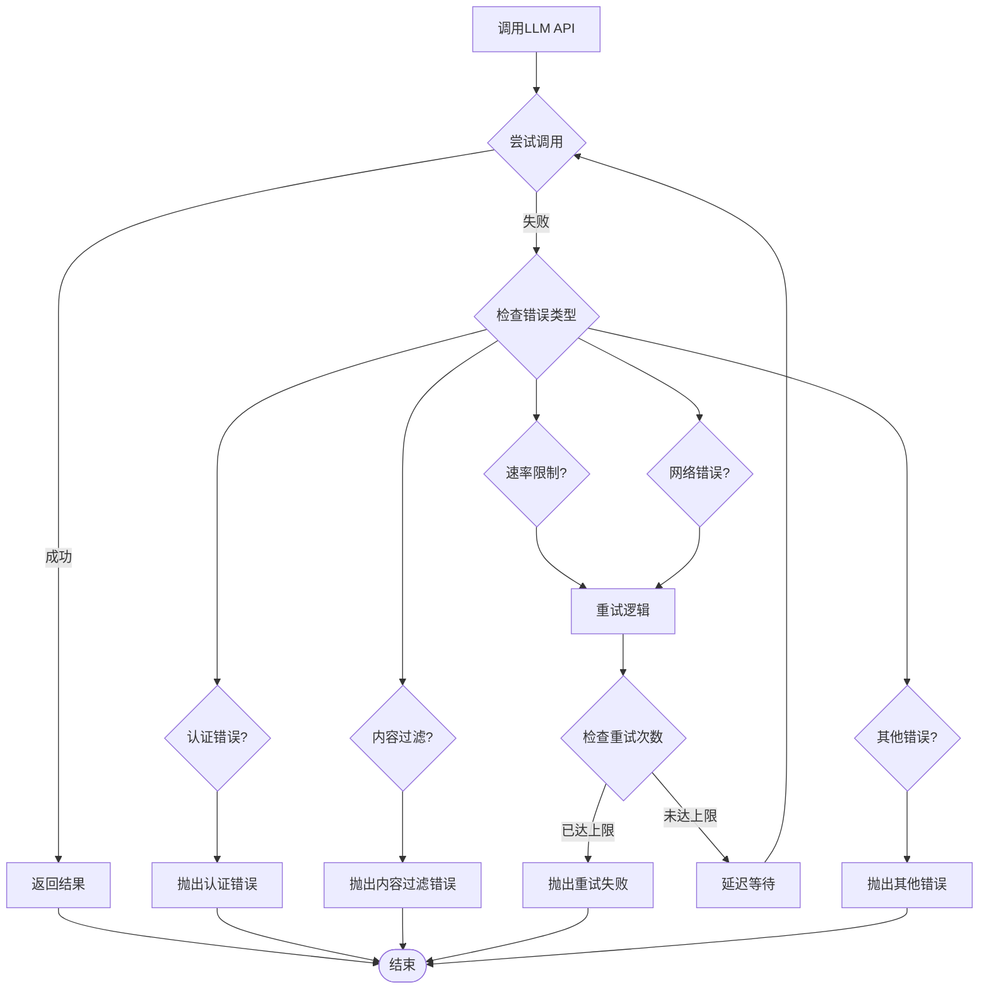
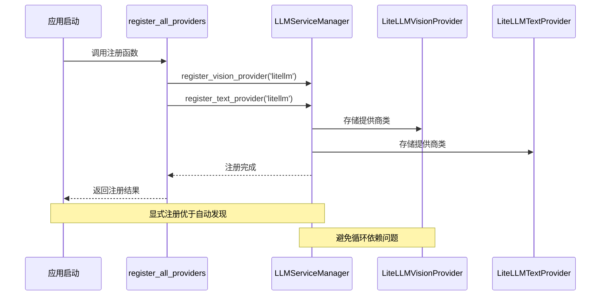
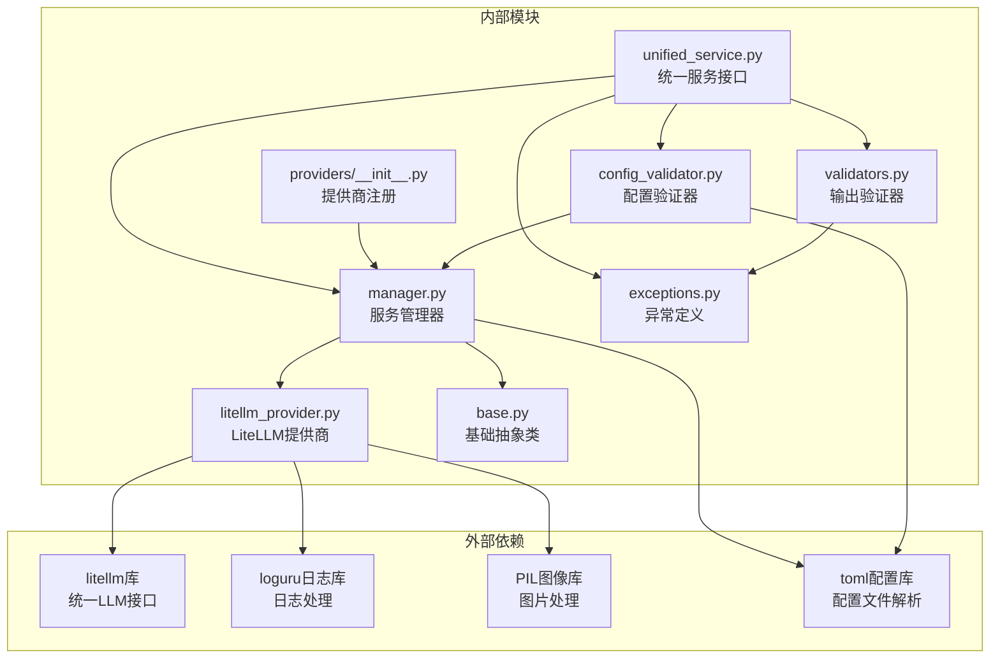

# LLM服务管理系统

<cite>
**本文档引用的文件**
- [unified_service.py](file://app/services/llm/unified_service.py)
- [manager.py](file://app/services/llm/manager.py)
- [litellm_provider.py](file://app/services/llm/litellm_provider.py)
- [base.py](file://app/services/llm/base.py)
- [config_validator.py](file://app/services/llm/config_validator.py)
- [exceptions.py](file://app/services/llm/exceptions.py)
- [validators.py](file://app/services/llm/validators.py)
- [providers/__init__.py](file://app/services/llm/providers/__init__.py)
- [config.example.toml](file://config.example.toml)
- [test_litellm_integration.py](file://app/services/llm/test_litellm_integration.py)
- [test_llm_service.py](file://app/services/llm/test_llm_service.py)
- [webui.py](file://webui.py)
</cite>

## 目录
1. [简介](#简介)
2. [项目结构](#项目结构)
3. [核心组件](#核心组件)
4. [架构概览](#架构概览)
5. [详细组件分析](#详细组件分析)
6. [依赖关系分析](#依赖关系分析)
7. [性能考虑](#性能考虑)
8. [故障排除指南](#故障排除指南)
9. [结论](#结论)
10. [附录](#附录)

## 简介

NarratoAI的LLM服务管理系统是一个基于LiteLLM统一接口的现代化大语言模型服务架构。该系统旨在为用户提供统一的多提供商LLM服务访问接口，支持100+个主流AI模型提供商，包括OpenAI、Gemini、Qwen、DeepSeek、SiliconFlow等。

系统的核心设计理念是通过LiteLLM库实现"一次编写，多处运行"的统一接口，开发者只需配置相应的模型名称和API密钥，即可无缝切换不同的LLM提供商，而无需修改业务代码。

## 项目结构

LLM服务管理系统位于`app/services/llm/`目录下，采用模块化设计，主要包含以下核心模块：



**图表来源**
- [unified_service.py:1-263](file://app/services/llm/unified_service.py#L1-L263)
- [manager.py:1-246](file://app/services/llm/manager.py#L1-L246)
- [litellm_provider.py:1-491](file://app/services/llm/litellm_provider.py#L1-L491)

**章节来源**
- [unified_service.py:1-263](file://app/services/llm/unified_service.py#L1-L263)
- [manager.py:1-246](file://app/services/llm/manager.py#L1-L246)
- [config.example.toml:1-177](file://config.example.toml#L1-L177)

## 核心组件

### 统一服务接口层

`UnifiedLLMService`是整个LLM服务系统的对外接口，提供简洁易用的API方法：

- **文本生成接口**：`generate_text()` - 支持温度控制、最大token数、JSON格式输出
- **图片分析接口**：`analyze_images()` - 支持批量图片分析，自动批处理
- **专用场景接口**：
  - `generate_narration_script()` - 生成视频解说文案
  - `analyze_subtitle()` - 分析字幕内容
- **提供商管理接口**：`get_provider_info()`、`list_vision_providers()`、`list_text_providers()`

### 服务管理器

`LLMServiceManager`负责统一管理所有LLM提供商，实现工厂模式和实例缓存：

- **提供商注册**：支持动态注册视觉和文本模型提供商
- **实例缓存**：避免重复创建提供商实例，提升性能
- **配置验证**：从配置文件读取提供商配置并验证
- **错误处理**：提供统一的异常处理机制

### LiteLLM统一提供商

`LiteLLMVisionProvider`和`LiteLLMTextProvider`实现了LiteLLM的统一接口：

- **多提供商支持**：支持OpenAI、Gemini、Qwen、DeepSeek等100+提供商
- **自动重试机制**：内置重试逻辑，处理网络异常和API限制
- **统一错误处理**：将不同提供商的错误标准化
- **环境变量管理**：自动设置各提供商的API密钥环境变量

**章节来源**
- [unified_service.py:20-263](file://app/services/llm/unified_service.py#L20-L263)
- [manager.py:15-246](file://app/services/llm/manager.py#L15-L246)
- [litellm_provider.py:59-491](file://app/services/llm/litellm_provider.py#L59-L491)

## 架构概览

系统采用分层架构设计，每层职责明确，便于维护和扩展：



**图表来源**
- [unified_service.py:65-109](file://app/services/llm/unified_service.py#L65-L109)
- [manager.py:137-208](file://app/services/llm/manager.py#L137-L208)
- [litellm_provider.py:422-472](file://app/services/llm/litellm_provider.py#L422-L472)

## 详细组件分析

### 统一服务接口设计

`UnifiedLLMService`提供了简洁的API接口，隐藏了底层提供商的复杂性：



**图表来源**
- [unified_service.py:20-263](file://app/services/llm/unified_service.py#L20-L263)
- [manager.py:15-246](file://app/services/llm/manager.py#L15-L246)
- [base.py:16-190](file://app/services/llm/base.py#L16-L190)
- [litellm_provider.py:59-491](file://app/services/llm/litellm_provider.py#L59-L491)

### 配置验证系统

`LLMConfigValidator`提供了完整的配置验证机制：



**图表来源**
- [config_validator.py:18-85](file://app/services/llm/config_validator.py#L18-L85)
- [config_validator.py:87-199](file://app/services/llm/config_validator.py#L87-L199)

### 错误处理和重试机制

系统实现了多层次的错误处理和重试机制：



**图表来源**
- [litellm_provider.py:235-252](file://app/services/llm/litellm_provider.py#L235-L252)
- [litellm_provider.py:438-472](file://app/services/llm/litellm_provider.py#L438-L472)

### 提供商注册机制

系统采用显式注册机制，确保提供商的可靠性和可调试性：



**图表来源**
- [providers/__init__.py:12-34](file://app/services/llm/providers/__init__.py#L12-L34)
- [webui.py:232-246](file://webui.py#L232-L246)

**章节来源**
- [config_validator.py:15-309](file://app/services/llm/config_validator.py#L15-L309)
- [exceptions.py:11-119](file://app/services/llm/exceptions.py#L11-L119)
- [providers/__init__.py:12-44](file://app/services/llm/providers/__init__.py#L12-L44)

## 依赖关系分析

系统采用松耦合设计，各模块间依赖关系清晰：



**图表来源**
- [litellm_provider.py:16-27](file://app/services/llm/litellm_provider.py#L16-L27)
- [unified_service.py:7-14](file://app/services/llm/unified_service.py#L7-L14)
- [manager.py:7-12](file://app/services/llm/manager.py#L7-L12)

**章节来源**
- [litellm_provider.py:16-52](file://app/services/llm/litellm_provider.py#L16-L52)
- [unified_service.py:7-14](file://app/services/llm/unified_service.py#L7-L14)

## 性能考虑

系统在设计时充分考虑了性能优化：

### 缓存策略
- **实例缓存**：LLMServiceManager对创建的提供商实例进行缓存，避免重复初始化
- **配置缓存**：提供商实例缓存键包含提供商名称，支持多实例场景

### 批处理优化
- **图片批处理**：默认批处理大小为10，平衡内存使用和网络效率
- **异步处理**：所有LLM调用均为异步，提升并发性能

### 资源管理
- **图片优化**：自动调整图片尺寸至1024x1024以内，减少传输开销
- **环境变量管理**：LiteLLM自动管理API密钥，减少配置开销

## 故障排除指南

### 常见问题及解决方案

#### 1. 提供商注册失败
**症状**：应用启动时报"LLM提供商未注册"错误
**解决方案**：
- 确认`register_all_providers()`函数已被调用
- 检查`providers/__init__.py`文件中的注册逻辑
- 验证应用启动顺序，确保在使用LLM功能前完成注册

#### 2. API密钥配置错误
**症状**：调用LLM服务时报"缺少API密钥配置"错误
**解决方案**：
- 检查`config.example.toml`中的配置项
- 确认API密钥格式正确且未过期
- 验证提供商名称与配置前缀匹配

#### 3. 模型不支持错误
**症状**：调用特定模型时报"模型不支持"错误
**解决方案**：
- 确认模型名称格式为"provider/model_name"
- 检查LiteLLM支持的模型列表
- 验证提供商账户是否已开通相应模型

#### 4. 网络连接问题
**症状**：调用LLM API超时或连接失败
**解决方案**：
- 检查网络连接和防火墙设置
- 验证自定义base_url配置
- 调整超时时间和重试次数配置

**章节来源**
- [exceptions.py:26-119](file://app/services/llm/exceptions.py#L26-L119)
- [config_validator.py:118-142](file://app/services/llm/config_validator.py#L118-L142)

## 结论

NarratoAI的LLM服务管理系统通过LiteLLM统一接口实现了高度模块化和可扩展的架构设计。系统的主要优势包括：

### 核心优势
- **统一接口**：支持100+提供商，开发者只需学习一套API
- **自动重试**：内置智能重试机制，提升服务稳定性
- **配置验证**：完整的配置验证和错误提示系统
- **性能优化**：实例缓存、批处理、异步处理等优化措施
- **易于扩展**：模块化设计，支持新增提供商和功能

### 技术创新
- **显式注册机制**：优于自动发现的提供商注册方式
- **统一错误处理**：标准化不同提供商的错误类型
- **配置验证系统**：提供完整的配置检查和建议
- **输出验证机制**：确保LLM输出符合预期格式

该系统为开发者提供了一个稳定、高效、易用的LLM服务集成平台，能够满足从个人项目到企业级应用的各种需求。

## 附录

### 配置示例

#### 基础配置
```toml
[app]
# LLM API超时配置
llm_vision_timeout = 120
llm_text_timeout = 180
llm_max_retries = 3

# LiteLLM统一接口配置
vision_llm_provider = "litellm"
vision_litellm_model_name = "gemini/gemini-2.0-flash-lite"
vision_litellm_api_key = "your-gemini-api-key"

text_llm_provider = "litellm"
text_litellm_model_name = "deepseek/deepseek-chat"
text_litellm_api_key = "your-deepseek-api-key"
```

#### 高级配置
```toml
# 自定义API基础URL
vision_litellm_base_url = ""
text_litellm_base_url = ""

# 批处理配置
vision_batch_size = 10

# 超时和重试配置
llm_request_timeout = 180
llm_num_retries = 3
```

### 最佳实践

1. **提供商选择**：优先使用LiteLLM统一接口，支持100+提供商
2. **配置管理**：使用环境变量管理API密钥，避免硬编码
3. **错误处理**：实现完善的异常捕获和重试机制
4. **性能监控**：定期检查LLM使用情况和成本控制
5. **测试验证**：使用提供的测试脚本验证配置正确性

### 支持的提供商

系统通过LiteLLM支持以下主流LLM提供商：
- **OpenAI**：GPT系列模型
- **Google**：Gemini系列模型
- **阿里云**：Qwen系列模型
- **DeepSeek**：DeepSeek系列模型
- **SiliconFlow**：多种开源模型
- **Anthropic**：Claude系列模型
- **Moonshot**：Moonshot系列模型
- **Cohere**：Cohere系列模型
- **Together AI**：多种开源模型
- **Replicate**：多种开源模型
- **Groq**：高性能推理模型
- **Mistral**：Mistral系列模型