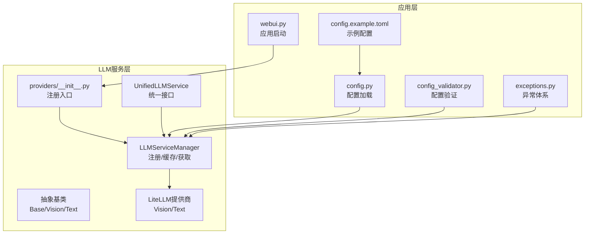
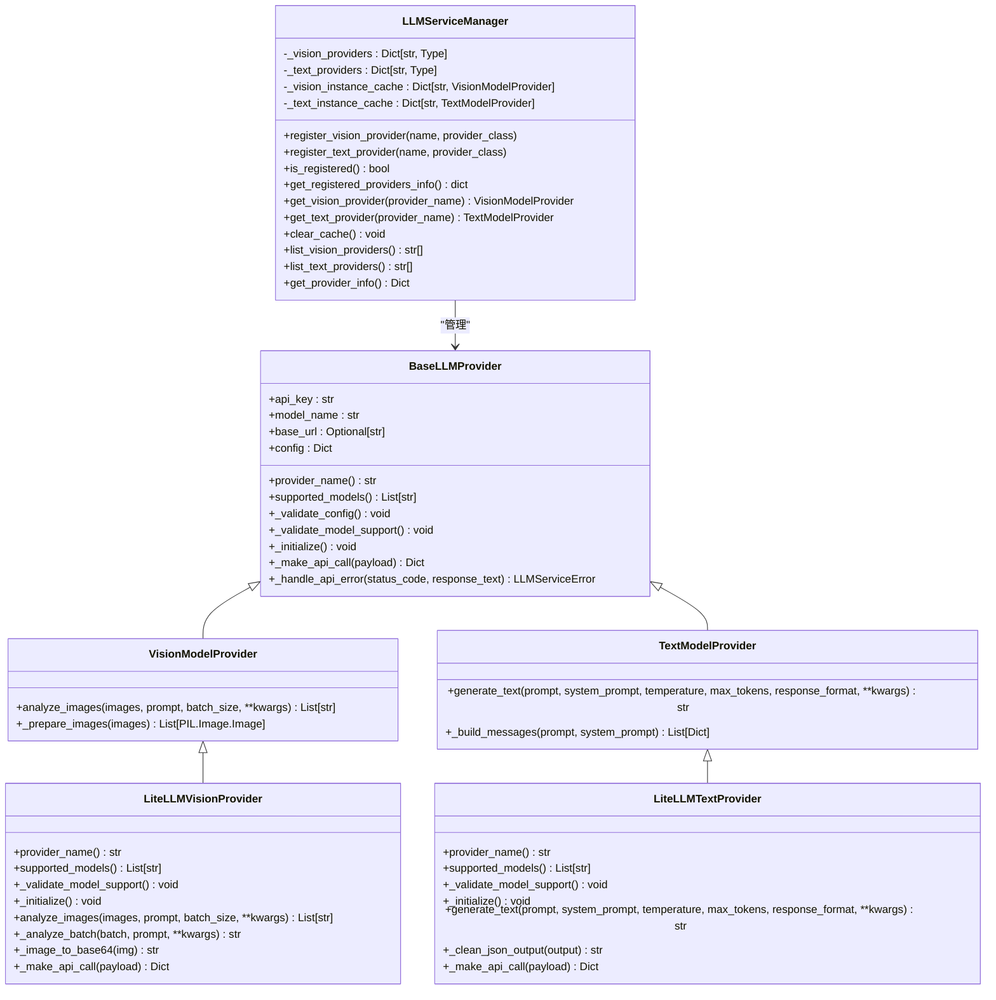
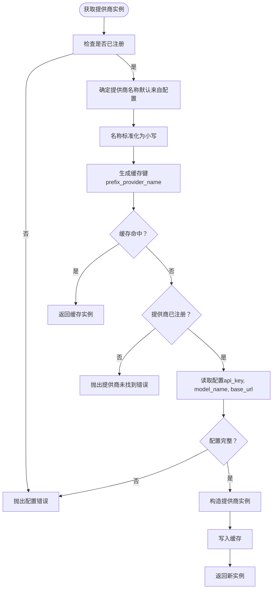
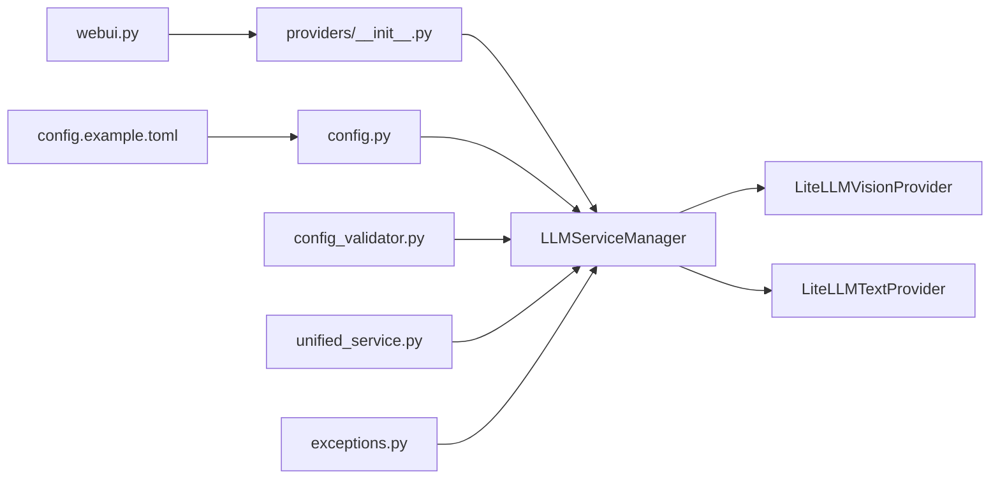

# 提供商注册机制

<cite>
**本文引用的文件**
- [manager.py](file://app/services/llm/manager.py)
- [base.py](file://app/services/llm/base.py)
- [litellm_provider.py](file://app/services/llm/litellm_provider.py)
- [providers/__init__.py](file://app/services/llm/providers/__init__.py)
- [unified_service.py](file://app/services/llm/unified_service.py)
- [webui.py](file://webui.py)
- [config.py](file://app/config/config.py)
- [config_validator.py](file://app/services/llm/config_validator.py)
- [exceptions.py](file://app/services/llm/exceptions.py)
- [config.example.toml](file://config.example.toml)
</cite>

## 目录
1. [简介](#简介)
2. [项目结构](#项目结构)
3. [核心组件](#核心组件)
4. [架构总览](#架构总览)
5. [详细组件分析](#详细组件分析)
6. [依赖关系分析](#依赖关系分析)
7. [性能考量](#性能考量)
8. [故障排查指南](#故障排查指南)
9. [结论](#结论)
10. [附录](#附录)

## 简介
本文件面向NarratoAI的LLM提供商注册机制，重点围绕LLMServiceManager类的双通道注册系统（视觉模型与文本模型），系统性阐述：
- 注册方法register_vision_provider与register_text_provider的实现原理与设计要点
- 提供商名称规范化、类注册、日志记录与错误处理
- 实例缓存机制（缓存键生成、实例复用、内存管理）
- 查找与获取流程（名称匹配、配置读取、实例创建、缓存检查）
- 完整的应用启动注册示例
- 安全性与健壮性设计（重复注册检测、类型验证、错误处理）

## 项目结构
与LLM提供商注册机制直接相关的模块位于app/services/llm目录，关键文件如下：
- manager.py：LLMServiceManager类，负责注册、缓存与实例获取
- base.py：抽象基类BaseLLMProvider、VisionModelProvider、TextModelProvider
- litellm_provider.py：基于LiteLLM的统一提供商实现
- providers/__init__.py：注册入口，集中注册所有提供商
- unified_service.py：统一服务接口，封装对LLMServiceManager的调用
- webui.py：应用启动时显式调用注册函数
- config.py：配置加载与环境变量设置
- config_validator.py：配置验证器，辅助检查提供商配置
- exceptions.py：统一异常体系
- config.example.toml：示例配置，包含LLM提供商配置项

图表来源
- [manager.py:15-246](file://app/services/llm/manager.py#L15-L246)
- [base.py:16-190](file://app/services/llm/base.py#L16-L190)
- [litellm_provider.py:59-491](file://app/services/llm/litellm_provider.py#L59-L491)
- [providers/__init__.py:12-44](file://app/services/llm/providers/__init__.py#L12-L44)
- [unified_service.py:20-263](file://app/services/llm/unified_service.py#L20-L263)
- [webui.py:227-246](file://webui.py#L227-L246)
- [config.py:24-95](file://app/config/config.py#L24-L95)
- [config_validator.py:15-309](file://app/services/llm/config_validator.py#L15-L309)
- [exceptions.py:11-119](file://app/services/llm/exceptions.py#L11-L119)
- [config.example.toml:1-177](file://config.example.toml#L1-L177)

章节来源
- [manager.py:15-246](file://app/services/llm/manager.py#L15-L246)
- [providers/__init__.py:12-44](file://app/services/llm/providers/__init__.py#L12-L44)
- [webui.py:227-246](file://webui.py#L227-L246)

## 核心组件
- LLMServiceManager：提供注册、缓存与实例获取的中心控制器
- 抽象基类体系：BaseLLMProvider、VisionModelProvider、TextModelProvider
- LiteLLM提供商：统一视觉与文本提供商实现
- 注册入口：providers/__init__.py中的register_all_providers
- 统一服务接口：UnifiedLLMService对外暴露简化的API
- 配置与验证：config.py、config_validator.py、config.example.toml
- 异常体系：exceptions.py

章节来源
- [manager.py:15-246](file://app/services/llm/manager.py#L15-L246)
- [base.py:16-190](file://app/services/llm/base.py#L16-L190)
- [litellm_provider.py:59-491](file://app/services/llm/litellm_provider.py#L59-L491)
- [providers/__init__.py:12-44](file://app/services/llm/providers/__init__.py#L12-L44)
- [unified_service.py:20-263](file://app/services/llm/unified_service.py#L20-L263)
- [config.py:24-95](file://app/config/config.py#L24-L95)
- [config_validator.py:15-309](file://app/services/llm/config_validator.py#L15-L309)
- [exceptions.py:11-119](file://app/services/llm/exceptions.py#L11-L119)
- [config.example.toml:1-177](file://config.example.toml#L1-L177)

## 架构总览
LLMServiceManager采用“双注册表 + 实例缓存”的设计，分别维护视觉与文本提供商的注册表，并在获取实例时进行缓存命中与配置读取。注册入口集中化，应用启动时显式调用，确保可控性与可观测性。

图表来源
- [manager.py:15-246](file://app/services/llm/manager.py#L15-L246)
- [base.py:16-190](file://app/services/llm/base.py#L16-L190)
- [litellm_provider.py:59-491](file://app/services/llm/litellm_provider.py#L59-L491)

## 详细组件分析

### LLMServiceManager类与注册系统
- 双注册表设计：分别维护视觉与文本提供商的映射，键为小写名称，值为类类型
- 注册方法：
  - register_vision_provider：将名称标准化为小写后登记至视觉注册表
  - register_text_provider：将名称标准化为小写后登记至文本注册表
- 日志记录：每次注册都会记录调试日志，便于追踪注册状态
- 注册状态检查：is_registered用于判断是否已注册任何提供商；get_registered_providers_info返回当前注册的提供商清单
- 列表与信息查询：list_vision_providers/list_text_providers/get_provider_info提供运维与诊断能力

章节来源
- [manager.py:18-66](file://app/services/llm/manager.py#L18-L66)
- [manager.py:46-66](file://app/services/llm/manager.py#L46-L66)

### 实例缓存机制
- 缓存键生成：以“vision_”或“text_”前缀拼接提供商名称形成缓存键
- 缓存命中：获取实例前先检查缓存，命中则直接返回，避免重复创建
- 实例创建：若未命中，检查提供商是否已注册，读取配置（API密钥、模型名、base_url），构造提供商实例并写入缓存
- 内存管理：clear_cache提供清空缓存的能力，便于在配置变更或资源回收时使用

图表来源
- [manager.py:69-135](file://app/services/llm/manager.py#L69-L135)
- [manager.py:137-208](file://app/services/llm/manager.py#L137-L208)

章节来源
- [manager.py:69-135](file://app/services/llm/manager.py#L69-L135)
- [manager.py:137-208](file://app/services/llm/manager.py#L137-L208)
- [manager.py:210-215](file://app/services/llm/manager.py#L210-L215)

### 抽象基类与提供商实现
- BaseLLMProvider：统一的配置校验、模型支持检查、错误处理与抽象接口
- VisionModelProvider：定义图像分析接口与图片预处理（尺寸调整、类型转换）
- TextModelProvider：定义文本生成接口与消息构建
- LiteLLMVisionProvider/LiteLLMTextProvider：基于LiteLLM的统一实现，支持100+提供商，自动处理重试、错误映射与JSON模式

章节来源
- [base.py:16-190](file://app/services/llm/base.py#L16-L190)
- [litellm_provider.py:59-491](file://app/services/llm/litellm_provider.py#L59-L491)

### 注册入口与应用启动
- providers/__init__.py：集中注册所有提供商，当前仅注册LiteLLM统一接口
- webui.py：应用启动时显式调用register_all_providers，确保在UI初始化前完成注册，提升可控性与可观测性

章节来源
- [providers/__init__.py:12-44](file://app/services/llm/providers/__init__.py#L12-L44)
- [webui.py:232-246](file://webui.py#L232-L246)

### 统一服务接口
- UnifiedLLMService：封装对LLMServiceManager的调用，提供analyze_images、generate_text、generate_narration_script、analyze_subtitle等高层接口
- 与LLMServiceManager解耦：通过统一接口简化上层调用，同时保留底层灵活性

章节来源
- [unified_service.py:20-263](file://app/services/llm/unified_service.py#L20-L263)

### 配置与验证
- config.py：加载config.toml，设置环境变量（如ImageMagick、FFmpeg），提供全局配置访问
- config.example.toml：示例配置，包含LLM提供商的默认项（如vision_llm_provider、text_llm_provider、各provider的api_key、model_name、base_url）
- config_validator.py：验证所有提供商配置，输出验证报告与建议

章节来源
- [config.py:24-95](file://app/config/config.py#L24-L95)
- [config.example.toml:1-177](file://config.example.toml#L1-L177)
- [config_validator.py:15-309](file://app/services/llm/config_validator.py#L15-L309)

### 异常体系
- LLMServiceError：统一异常基类
- ProviderNotFoundError：提供商未找到
- ConfigurationError：配置错误
- APICallError、RateLimitError、AuthenticationError、ContentFilterError：API调用相关错误

章节来源
- [exceptions.py:11-119](file://app/services/llm/exceptions.py#L11-L119)

## 依赖关系分析
- LLMServiceManager依赖抽象基类与具体提供商实现
- providers/__init__.py在注册时导入LLMServiceManager，实现注册入口
- webui.py在应用启动阶段调用注册入口，确保注册顺序可控
- config.py与config.example.toml为LLMServiceManager提供配置数据
- config_validator.py依赖LLMServiceManager进行配置验证
- unified_service.py依赖LLMServiceManager进行统一接口调用

图表来源
- [webui.py:232-246](file://webui.py#L232-L246)
- [providers/__init__.py:12-44](file://app/services/llm/providers/__init__.py#L12-L44)
- [manager.py:15-246](file://app/services/llm/manager.py#L15-L246)
- [litellm_provider.py:59-491](file://app/services/llm/litellm_provider.py#L59-L491)
- [config.py:24-95](file://app/config/config.py#L24-L95)
- [config_validator.py:15-309](file://app/services/llm/config_validator.py#L15-L309)
- [unified_service.py:20-263](file://app/services/llm/unified_service.py#L20-L263)
- [exceptions.py:11-119](file://app/services/llm/exceptions.py#L11-L119)

章节来源
- [webui.py:232-246](file://webui.py#L232-L246)
- [providers/__init__.py:12-44](file://app/services/llm/providers/__init__.py#L12-L44)
- [manager.py:15-246](file://app/services/llm/manager.py#L15-L246)
- [litellm_provider.py:59-491](file://app/services/llm/litellm_provider.py#L59-L491)
- [config.py:24-95](file://app/config/config.py#L24-L95)
- [config_validator.py:15-309](file://app/services/llm/config_validator.py#L15-L309)
- [unified_service.py:20-263](file://app/services/llm/unified_service.py#L20-L263)
- [exceptions.py:11-119](file://app/services/llm/exceptions.py#L11-L119)

## 性能考量
- 实例缓存：通过缓存键复用实例，避免重复初始化与网络握手开销
- 批处理与图片预处理：LiteLLM提供商对图片进行尺寸调整与批量处理，降低传输与处理成本
- 自动重试与超时：LiteLLM配置支持重试次数与超时设置，提升稳定性
- 资源管理：clear_cache用于释放缓存，适合在配置变更或长时间运行后进行清理

章节来源
- [manager.py:96-128](file://app/services/llm/manager.py#L96-L128)
- [manager.py:167-202](file://app/services/llm/manager.py#L167-L202)
- [litellm_provider.py:149-165](file://app/services/llm/litellm_provider.py#L149-L165)
- [litellm_provider.py:140-145](file://app/services/llm/litellm_provider.py#L140-L145)
- [litellm_provider.py:39-52](file://app/services/llm/litellm_provider.py#L39-L52)

## 故障排查指南
- 注册失败或未找到提供商：检查应用启动时是否调用了register_all_providers；确认providers/__init__.py中的注册逻辑
- 配置缺失：检查config.example.toml中的LLM配置项（如vision_llm_provider、text_llm_provider、各provider的api_key、model_name、base_url）
- 实例创建失败：查看LLMServiceManager的异常抛出与日志记录，定位配置或网络问题
- 配置验证：使用config_validator.py进行验证，获取详细的错误与建议
- 统一接口调用失败：通过unified_service.py的异常包装定位具体问题

章节来源
- [webui.py:232-246](file://webui.py#L232-L246)
- [providers/__init__.py:12-44](file://app/services/llm/providers/__init__.py#L12-L44)
- [config.example.toml:1-177](file://config.example.toml#L1-L177)
- [config_validator.py:15-309](file://app/services/llm/config_validator.py#L15-L309)
- [unified_service.py:20-263](file://app/services/llm/unified_service.py#L20-L263)

## 结论
NarratoAI的LLM提供商注册机制通过LLMServiceManager实现了“双注册表 + 实例缓存”的稳健架构。注册入口集中化、应用启动显式调用，确保了可控性与可观测性；抽象基类与LiteLLM统一实现提升了扩展性与兼容性；完善的异常体系与配置验证工具保障了系统的健壮性。该设计既满足多提供商场景，又兼顾性能与可维护性。

## 附录

### 应用启动时的完整注册示例
- 在webui.py的main函数中，应用启动时显式调用register_all_providers，确保在UI初始化前完成LLM提供商注册
- 注册完成后，可通过LLMServiceManager获取提供商实例，或通过UnifiedLLMService进行统一调用

章节来源
- [webui.py:227-246](file://webui.py#L227-L246)
- [providers/__init__.py:12-44](file://app/services/llm/providers/__init__.py#L12-L44)

### 配置项说明（节选）
- 视觉模型提供商配置：vision_llm_provider、vision_litellm_model_name、vision_litellm_api_key、vision_litellm_base_url
- 文本模型提供商配置：text_llm_provider、text_litellm_model_name、text_litellm_api_key、text_litellm_base_url
- 全局LLM超时与重试：llm_vision_timeout、llm_text_timeout、llm_max_retries

章节来源
- [config.example.toml:1-177](file://config.example.toml#L1-L177)