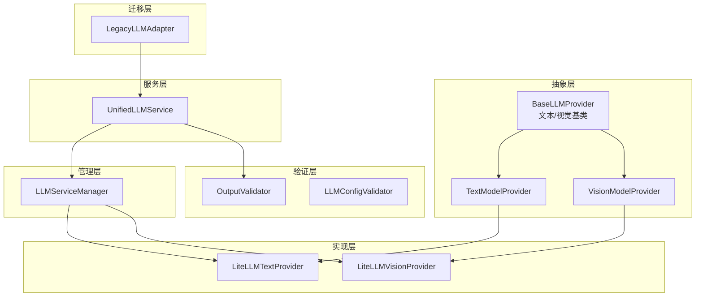
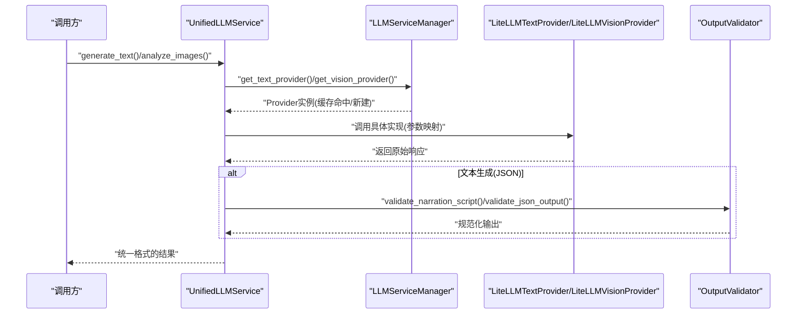
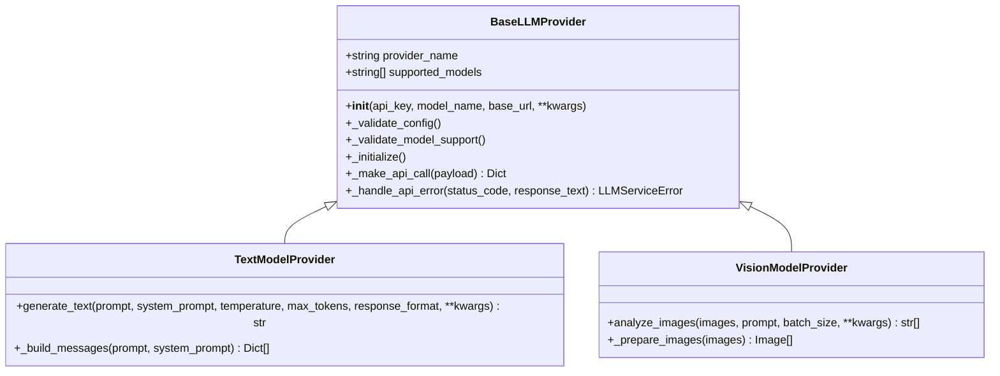
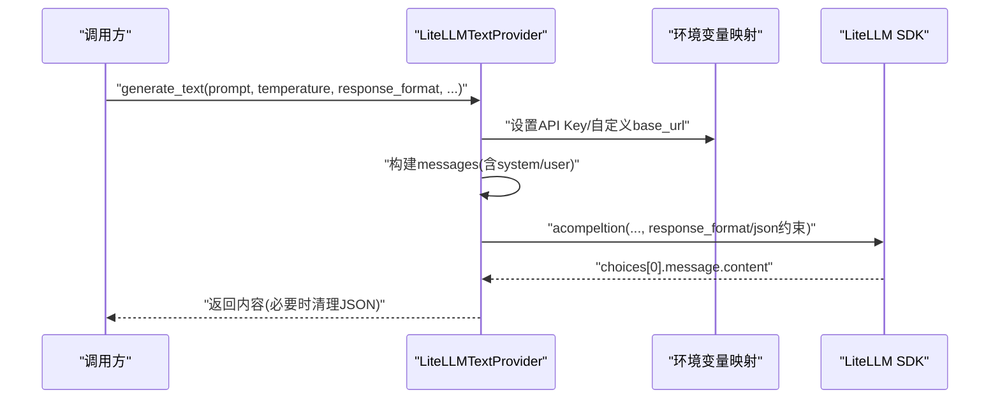
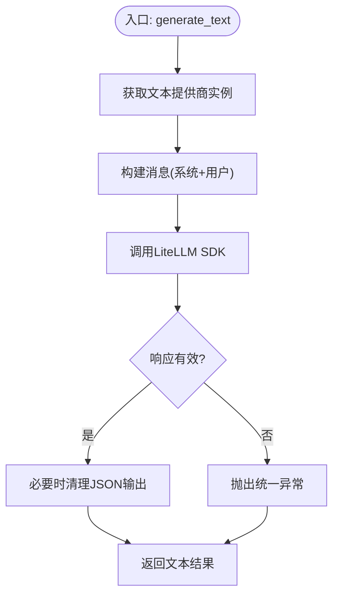
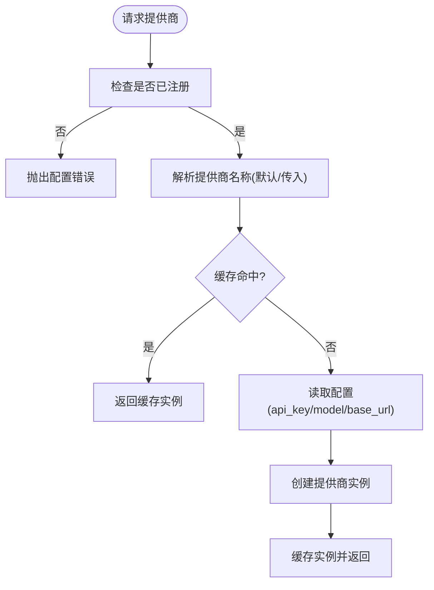
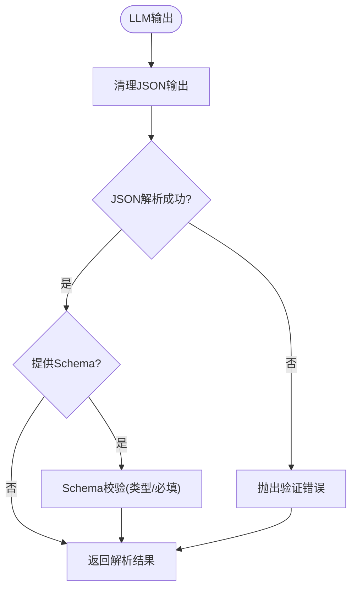
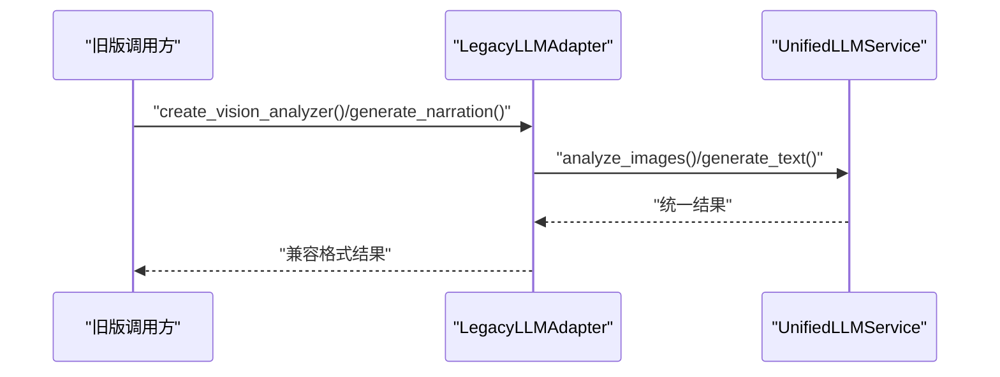
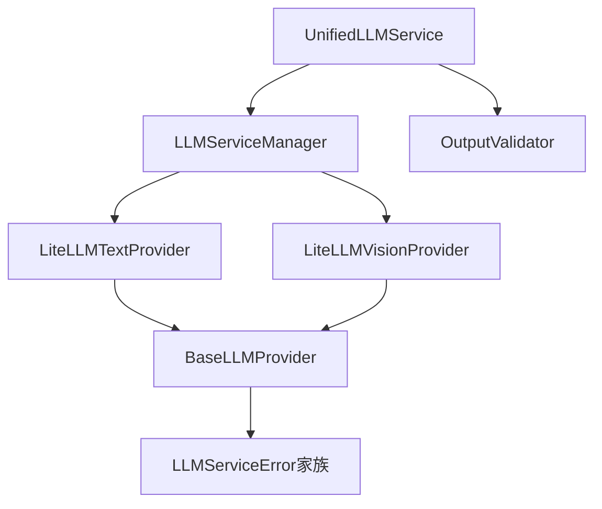

# 统一接口设计

<cite>
**本文引用的文件**
- [unified_service.py](file://app/services/llm/unified_service.py)
- [base.py](file://app/services/llm/base.py)
- [litellm_provider.py](file://app/services/llm/litellm_provider.py)
- [manager.py](file://app/services/llm/manager.py)
- [exceptions.py](file://app/services/llm/exceptions.py)
- [validators.py](file://app/services/llm/validators.py)
- [config_validator.py](file://app/services/llm/config_validator.py)
- [migration_adapter.py](file://app/services/llm/migration_adapter.py)
- [webui.py](file://webui.py)
</cite>

## 目录
1. [简介](#简介)
2. [项目结构](#项目结构)
3. [核心组件](#核心组件)
4. [架构总览](#架构总览)
5. [详细组件分析](#详细组件分析)
6. [依赖分析](#依赖分析)
7. [性能考虑](#性能考虑)
8. [故障排查指南](#故障排查指南)
9. [结论](#结论)
10. [附录](#附录)

## 简介
本文件面向NarratoAI的LLM统一接口设计，系统性阐述基于LiteLLM的统一抽象如何屏蔽多家AI提供商的差异，提供一致的调用体验。文档重点覆盖以下方面：
- 抽象层设计：BaseLLMProvider、TextModelProvider、VisionModelProvider三类基类如何标准化接口、统一方法签名与错误处理。
- 统一服务接口：UnifiedLLMService如何封装文本与视觉能力，支持多模态统一抽象。
- LiteLLM实现：LiteLLMVisionProvider/LiteLLMTextProvider如何对接多家提供商，自动重试、参数映射与错误转换。
- 使用示例：如何通过统一接口进行LLM调用，包括请求构建、响应解析与参数传递。
- 优势与价值：如何简化多提供商切换与管理，提升可维护性与可扩展性。

## 项目结构
LLM统一接口位于app/services/llm目录，围绕“抽象基类 + 统一服务 + 管理器 + LiteLLM实现 + 验证器 + 迁移适配”的分层组织：
- 抽象层：定义统一接口与通用行为（基类与异常）。
- 实现层：LiteLLM统一提供商，覆盖文本与视觉两类能力。
- 服务层：统一服务接口，面向上层业务提供简洁API。
- 管理层：服务管理器负责提供商注册、实例化与缓存。
- 验证层：输出格式验证与配置验证，保障质量与稳定性。
- 迁移层：向后兼容适配器，平滑过渡到新架构。

**图表来源**
- [base.py:16-190](file://app/services/llm/base.py#L16-L190)
- [litellm_provider.py:59-491](file://app/services/llm/litellm_provider.py#L59-L491)
- [unified_service.py:20-263](file://app/services/llm/unified_service.py#L20-L263)
- [manager.py:15-246](file://app/services/llm/manager.py#L15-L246)
- [validators.py:15-201](file://app/services/llm/validators.py#L15-L201)
- [config_validator.py:15-309](file://app/services/llm/config_validator.py#L15-L309)
- [migration_adapter.py:62-342](file://app/services/llm/migration_adapter.py#L62-L342)

**章节来源**
- [base.py:16-190](file://app/services/llm/base.py#L16-L190)
- [litellm_provider.py:59-491](file://app/services/llm/litellm_provider.py#L59-L491)
- [unified_service.py:20-263](file://app/services/llm/unified_service.py#L20-L263)
- [manager.py:15-246](file://app/services/llm/manager.py#L15-L246)
- [validators.py:15-201](file://app/services/llm/validators.py#L15-L201)
- [config_validator.py:15-309](file://app/services/llm/config_validator.py#L15-L309)
- [migration_adapter.py:62-342](file://app/services/llm/migration_adapter.py#L62-L342)

## 核心组件
- 抽象基类与接口标准化
  - BaseLLMProvider：统一配置校验、模型支持检查、错误处理映射与抽象API调用接口。
  - TextModelProvider：统一消息构建（system/user），生成文本的标准签名。
  - VisionModelProvider：统一图片预处理（尺寸优化、类型转换）、批量分析标准签名。
- LiteLLM统一实现
  - LiteLLMTextProvider：自动重试、JSON模式兼容、SiliconFlow特殊处理、环境变量映射。
  - LiteLLMVisionProvider：多模态消息构造、base64图片编码、批处理与异常转换。
- 统一服务接口
  - UnifiedLLMService：对上层暴露简洁API，内部委派给管理器与验证器，支持文本生成、视觉分析、字幕分析与脚本生成。
- 服务管理器
  - LLMServiceManager：注册提供商、按配置实例化、缓存复用、提供查询与诊断信息。
- 验证与配置
  - OutputValidator：严格JSON与业务Schema验证，清理非结构化输出。
  - LLMConfigValidator：配置完整性与可用性验证，生成建议清单。
- 迁移适配
  - LegacyLLMAdapter：兼容旧版接口，桥接到新统一服务，保证平滑过渡。

**章节来源**
- [base.py:16-190](file://app/services/llm/base.py#L16-L190)
- [litellm_provider.py:59-491](file://app/services/llm/litellm_provider.py#L59-L491)
- [unified_service.py:20-263](file://app/services/llm/unified_service.py#L20-L263)
- [manager.py:15-246](file://app/services/llm/manager.py#L15-L246)
- [validators.py:15-201](file://app/services/llm/validators.py#L15-L201)
- [config_validator.py:15-309](file://app/services/llm/config_validator.py#L15-L309)
- [migration_adapter.py:62-342](file://app/services/llm/migration_adapter.py#L62-L342)

## 架构总览
统一接口通过“抽象基类 + LiteLLM实现 + 统一服务 + 管理器 + 验证器”的分层，形成稳定、可扩展且易维护的架构。其核心价值在于：
- 屏蔽提供商差异：统一方法签名与参数语义，隐藏SDK差异与认证细节。
- 多模态统一抽象：文本与视觉能力在同一服务层下协同工作。
- 可插拔与可扩展：新增提供商只需实现对应基类，经管理器注册即可使用。
- 稳定性与可观测性：统一错误映射、自动重试、配置验证与日志记录。

**图表来源**
- [unified_service.py:65-159](file://app/services/llm/unified_service.py#L65-L159)
- [manager.py:69-208](file://app/services/llm/manager.py#L69-L208)
- [litellm_provider.py:349-472](file://app/services/llm/litellm_provider.py#L349-L472)
- [validators.py:15-201](file://app/services/llm/validators.py#L15-L201)

## 详细组件分析

### 抽象基类设计模式
- 统一配置校验：在构造阶段强制校验API密钥与模型名称，支持宽松的模型支持检查（传统实现）或交由LiteLLM在调用时验证。
- 统一错误映射：将底层HTTP状态码映射为统一异常类型，便于上层一致处理。
- 统一消息构建：文本模型提供标准消息格式（system/user），减少重复实现。
- 统一图片预处理：视觉模型提供图片类型统一、尺寸优化与批处理框架。

**图表来源**
- [base.py:16-190](file://app/services/llm/base.py#L16-L190)

**章节来源**
- [base.py:16-190](file://app/services/llm/base.py#L16-L190)

### LiteLLM统一提供商实现
- 文本模型实现要点
  - 自动重试与超时配置：通过全局配置影响SDK行为。
  - JSON模式兼容：优先使用response_format，不支持时在提示词中约束并二次清理输出。
  - SiliconFlow特殊处理：替换provider为openai并设置API Key与base_url。
  - 环境变量映射：根据provider自动设置对应环境变量。
- 视觉模型实现要点
  - 多模态消息构造：将文本与base64图片拼装为消息内容。
  - 批处理与异常恢复：批次失败时记录错误并返回占位结果，保证整体流程继续。
  - SiliconFlow特殊处理：同文本模型类似。
  - 图片预处理：统一转为PIL Image并缩放至合适尺寸。

**图表来源**
- [litellm_provider.py:349-472](file://app/services/llm/litellm_provider.py#L349-L472)

**章节来源**
- [litellm_provider.py:59-491](file://app/services/llm/litellm_provider.py#L59-L491)

### 统一服务接口（UnifiedLLMService）
- 文本生成：封装温度、最大token、响应格式等参数，委派给管理器获取文本提供商并执行。
- 视觉分析：统一图片输入（路径/PIL对象），批处理调用，返回字符串结果。
- 解说文案生成：基于文本生成，结合输出验证器确保JSON结构与字段规范。
- 字幕分析：内置系统提示词，支持输出验证或直接返回。
- 便捷函数：提供analyze_images_unified与generate_text_unified，便于快速调用。

**图表来源**
- [unified_service.py:65-109](file://app/services/llm/unified_service.py#L65-L109)
- [litellm_provider.py:349-472](file://app/services/llm/litellm_provider.py#L349-L472)

**章节来源**
- [unified_service.py:20-263](file://app/services/llm/unified_service.py#L20-L263)

### 服务管理器（LLMServiceManager）
- 注册机制：显式注册文本与视觉提供商，避免隐式发现带来的不确定性。
- 实例化与缓存：按配置读取API Key、模型名与base_url，创建并缓存实例，支持清空缓存。
- 查询与诊断：提供提供商列表、信息查询与注册状态检查。
- 错误处理：缺失注册、配置不全、实例化失败均转化为统一异常。

**图表来源**
- [manager.py:69-208](file://app/services/llm/manager.py#L69-L208)

**章节来源**
- [manager.py:15-246](file://app/services/llm/manager.py#L15-L246)

### 输出验证与配置验证
- 输出验证（OutputValidator）
  - JSON清理：去除markdown代码块标记，剥离多余字符。
  - 结构验证：支持JSON Schema（类型、必填字段）与业务规则（如解说文案字段校验）。
- 配置验证（LLMConfigValidator）
  - 全量扫描：遍历已注册提供商，逐项验证配置键与可用性。
  - 建议清单：提供必填/可选配置与示例模型列表，辅助部署与运维。

**图表来源**
- [validators.py:15-201](file://app/services/llm/validators.py#L15-L201)

**章节来源**
- [validators.py:15-201](file://app/services/llm/validators.py#L15-L201)
- [config_validator.py:15-309](file://app/services/llm/config_validator.py#L15-L309)

### 迁移适配与向后兼容
- LegacyLLMAdapter：为旧版接口提供适配器，内部桥接至UnifiedLLMService，确保返回格式兼容。
- _run_async_safely：在多种事件循环环境下安全运行异步协程，降低集成风险。
- 传统分析器：VisionAnalyzerAdapter/SubtitleAnalyzerAdapter分别兼容旧版图片分析与字幕分析接口。

**图表来源**
- [migration_adapter.py:62-342](file://app/services/llm/migration_adapter.py#L62-L342)
- [unified_service.py:246-263](file://app/services/llm/unified_service.py#L246-L263)

**章节来源**
- [migration_adapter.py:62-342](file://app/services/llm/migration_adapter.py#L62-L342)

## 依赖分析
- 组件耦合与内聚
  - 抽象基类与实现解耦：通过接口约束实现细节，便于替换与扩展。
  - 统一服务与管理器：统一服务仅依赖管理器与验证器，职责清晰。
  - LiteLLM实现：集中处理SDK差异与异常转换，向上提供一致接口。
- 外部依赖
  - LiteLLM：统一SDK，支持100+提供商，自动重试与参数映射。
  - PIL：图像预处理与编码。
  - loguru：统一日志记录与过滤。
- 潜在循环依赖
  - 未发现循环导入；模块间通过接口与管理器间接交互。

**图表来源**
- [unified_service.py:12-14](file://app/services/llm/unified_service.py#L12-L14)
- [manager.py:10-12](file://app/services/llm/manager.py#L10-L12)
- [litellm_provider.py:29-35](file://app/services/llm/litellm_provider.py#L29-L35)
- [base.py:13-13](file://app/services/llm/base.py#L13-L13)
- [exceptions.py:11-119](file://app/services/llm/exceptions.py#L11-L119)

**章节来源**
- [unified_service.py:12-14](file://app/services/llm/unified_service.py#L12-L14)
- [manager.py:10-12](file://app/services/llm/manager.py#L10-L12)
- [litellm_provider.py:29-35](file://app/services/llm/litellm_provider.py#L29-L35)
- [base.py:13-13](file://app/services/llm/base.py#L13-L13)
- [exceptions.py:11-119](file://app/services/llm/exceptions.py#L11-L119)

## 性能考虑
- 批处理与吞吐
  - 视觉分析支持批处理，减少API往返次数，提升吞吐。
- 图像预处理
  - 自动缩放与base64编码，平衡精度与传输开销。
- 超时与重试
  - 全局超时与重试配置，提升稳定性与成功率。
- 缓存复用
  - 管理器缓存提供商实例，避免重复初始化成本。
- 建议
  - 合理设置批大小与超时阈值，结合监控指标持续优化。

[本节为通用性能讨论，无需引用具体文件]

## 故障排查指南
- 常见异常与定位
  - 认证失败：检查API Key与环境变量映射是否正确。
  - 速率限制：查看统一异常中的重试建议与配置。
  - 内容过滤：安全过滤器触发时返回专门异常，需调整提示词或策略。
  - 配置错误：确认提供商名称、API Key、模型名与base_url配置齐全。
- 验证与诊断
  - 使用配置验证器生成验证报告，识别缺失或错误配置。
  - 通过管理器查询已注册提供商与实例信息，确认缓存状态。
- 日志与追踪
  - 统一使用loguru记录详细上下文，便于定位问题根因。

**章节来源**
- [exceptions.py:11-119](file://app/services/llm/exceptions.py#L11-L119)
- [config_validator.py:15-309](file://app/services/llm/config_validator.py#L15-L309)
- [manager.py:210-245](file://app/services/llm/manager.py#L210-L245)

## 结论
NarratoAI的LLM统一接口通过“抽象基类 + LiteLLM实现 + 统一服务 + 管理器 + 验证器”的分层设计，实现了：
- 接口标准化与方法签名统一，屏蔽多家提供商差异；
- 多模态统一抽象，文本与视觉能力在同一服务层协同；
- 稳健的错误处理与配置验证，提升系统可靠性；
- 平滑的迁移适配，降低升级成本。

该设计显著简化了多提供商切换与管理，提升了可维护性与可扩展性，为后续功能演进与生态扩展奠定了坚实基础。

[本节为总结性内容，无需引用具体文件]

## 附录

### 使用示例（路径指引）
- 文本生成
  - 路径：[unified_service.py:65-109](file://app/services/llm/unified_service.py#L65-L109)
  - 关键点：provider、temperature、max_tokens、response_format参数传递与默认值。
- 视觉分析
  - 路径：[unified_service.py:24-63](file://app/services/llm/unified_service.py#L24-L63)
  - 关键点：images输入支持路径与PIL对象，batch_size批处理。
- 解说文案生成
  - 路径：[unified_service.py:112-159](file://app/services/llm/unified_service.py#L112-L159)
  - 关键点：response_format="json"与OutputValidator联合使用。
- 字幕分析
  - 路径：[unified_service.py:162-206](file://app/services/llm/unified_service.py#L162-L206)
  - 关键点：内置系统提示词与可选输出验证。
- 迁移适配
  - 路径：[migration_adapter.py:62-342](file://app/services/llm/migration_adapter.py#L62-L342)
  - 关键点：LegacyLLMAdapter桥接旧版接口，_run_async_safely处理事件循环。

**章节来源**
- [unified_service.py:20-263](file://app/services/llm/unified_service.py#L20-L263)
- [migration_adapter.py:62-342](file://app/services/llm/migration_adapter.py#L62-L342)

### 提供商注册与启动流程
- 显式注册
  - 路径：[webui.py:232-246](file://webui.py#L232-L246)
  - 关键点：应用启动时调用register_all_providers，确保LLM功能可用。
- 管理器注册
  - 路径：[manager.py:28-39](file://app/services/llm/manager.py#L28-L39)
  - 关键点：register_vision_provider/register_text_provider注册实现类。

**章节来源**
- [webui.py:232-246](file://webui.py#L232-L246)
- [manager.py:28-39](file://app/services/llm/manager.py#L28-L39)